# 中华人民共和国国家军用标准

FL 6130GJB 548C-2021 代替GJB 548B-2005

微电子器件试验方法和程序

Test methods and procedures for microelectronic devices

2021-12-30 发布

2022-03-01 实施

### 前言

本标准代替GJB548B- 2005《微电子器件试验方法和程序》。

本标准与GJB548B- 2005相比主要变化如下：a) 正文

1) 更新并增加了引用文件；2) 增加了失效模式、失效机理、标准物质等术语定义；3) 增加了电测试应在最坏电源电压条件下进行的要求；4) 细化了电测试温度控制要求(尤其对于混合电路)。

b) 方法1012.1 热性能

1) 基于当前红外热像设备大多已具备辐射率修正能力，将涂漆要求改为可选操作；2) 增加了涂层材料对峰值结温的影响说明。

c) 方法1014.3 密封

1) 增加了A5试验条件；2) 提高了宇航级混合集成电路器件漏率失效判据；3) 细化了氨质谱检漏法固定方法的内腔容积分段；4) 增加了累积氨质谱检漏法；5) 细化了光学检漏法有关要求。

d) 方法1017.1 中子辐射

1) 增加了部分术语定义；2) 细化了辐射源要求，增加了电离总剂量限制指标。

e) 方法1018.2 内部气体成分分析

1) 删除了程序2和程序3；2) 细化了质谱仪的校准要求；3) 增加了真空箱和传递通道的描述；4) 增加了实验室应提供对未知或已存在但未达到识别浓度的气体质谱描述说明的规定；5) 增加了实验室无权利定器件合格或不合格的规定。

f) 方法1019.3 电离辐射(总剂量)

1) 增加了部分术语定义；2) 增加了低温辐射试验规定；3) 增加了使用干冰保存样品的规定；4) 增加了低剂量率增强效应(ELDRS)的判定试验和表征试验。

g) 方法1020.2 剂量率感应锁定剂量测量系统中增加了闪烁探测器和康普顿二极管。

h) 方法1034.1 染料渗透

1) 增加了试验设备，并细化了规格参数；2) 修改了浸渗剂粘度；3) 增加了正常明视场条件下的剖面拍照要求。

i) 方法2003.2 可焊性

1) 增加了部分术语定义；

2) 增加了材料和设备；3) 对蒸汽老化作了分类编写；4) 对试验条件作了分类编写；5) 增加了附录A和附录B;6) 删除了可焊性评价准则表。

j) 方法2004.3 引线牢固性

1) 增加了部分术语定义；2) 增加了试验条件 \(\mathrm{A}_1\) 引线钎焊牢固性和试验条件E引线镀层牢固性；3) 修改了刚性引线试验程序；4) 弯曲应力试验和引线疲劳试验增加了翼型引线和J形引线试验程序。

k) 方法2005.1 振动疲劳增加了峰值加速度与振幅和频率的计算关系。

1) 方法2009.2 外部目检

1) 增加了焊球/焊柱阵列引出端缺陷判据；2) 增加了玻璃填充底座封装的玻璃密封处开口泡的缺陷判据。

m) 方法2010.2 内部目检(单片电路)

1) 增加了受控环境(洁净室)要求；2) 修改了S级金属化层跨接的挤出金属缺陷判据。

n) 方法2011.2 键合强度

1) 增加了引线键合点剪切试验；2) 增加了拉力钩放置位置示意图。

o) 方法2012.2 X射线检查

1) 增加了实时成像X射线检查的设备和程序要求；2) 增加了有缺陷密封判据的示意图。

p) 方法2015.2 耐溶剂性

修改了刷样品时的手压力。

q) 方法2017.2 内部目检(混合电路)

1) 删除了一般要求；

2) 再检查中增加了附加检查的规定；

3) 键合检查通用要求增加了H级和K级的挤出金属缺陷判据。

r) 方法2018.2 扫描电子显微镜(SEM)检查

1) 增加了对于化学机械抛光(CMP)等平坦化工艺不需要SEM检查的要求；

2) 增加了采用芯片或已封装器件的抽样方案；

3) 增加了阻挡层/附着层不需要检查的情况；

4) 修改了钝化层台阶放大倍数范围。

s) 方法2019.3 芯片剪切强度

1) 增加了部分术语定义；

2) 修改了失效判据和分离模式。

t) 方法2020.2 粒子碰撞噪声检测

1) 降低了预置阈值峰值；

2) 增加了设备的数据存储采集与分析可选功能；

3) 增加了不允许试验大型器件的规定；

4) 增加了器件放置位置范围要求；

5) 增加了试验频率的计算公式；6) 修改了腔高和频率典型对应值。

u) 方法2023.3 非破坏性键合拉力增加了拉力钩放置位置示意图。

v) 方法2030.1 芯片粘接的超声检测增加了图例及反射/透射模式对照图。

w) 方法2032.1 无源元件的目检

1) 再检查中增加了附加检查的规定；2) 细化了判据格式说明；3) 修改了薄膜元件检查中的金属化划伤判据；4) 修改了平面厚膜元件检查中的金属化划伤判据；5) 修改了平面厚膜元件检查中的金属化空洞判据；6) 修改了平面厚膜元件检查中的厚膜电阻缺陷判据；7) 修改了声表面波元件检查中的基板材料缺陷判据；8) 修改了声表面波元件检查中的多余物缺陷判据；9) 修正了部分数据换算错误。

x) 方法2036 耐焊接热新增试验方法。

y) 方法2037 铅锡焊料成分分析一X射线荧光检测新增试验方法。

z) 方法2038 焊柱阵列封装的破坏性引线拉力新增试验方法。

aa) 方法3015.1 静电放电敏感度的分级

1) 修改了交换引出端以获得极性相反波形的规定；2) 增加了空脚引出端的试验要求；3) 细化了同名电源引出端的分组规定；4) 增加了可以放置旁路电阻来消除脉冲前电压的选择；5) 增加了放电结束后可以将所有引线同时接地的选择。

bb) 方法3023 集成电路锁定新增试验方法。

cc) 方法5004.3 筛选程序增加了附录A。

dd) 方法5005.3 鉴定检验和质量一致性检验程序

1) B级B组检验增加了芯片剪切或芯片粘接强度试验；2) D组检验增加了耐焊接热分组；3) E组检验增加了单粒子效应分组；4) 增加了部分注释。

ee) 方法5007.2 晶圆批验收

1) 增加了金属化层厚度和钝化层厚度按GJB597B-2012执行的规定；

2) 增加了GaAs、GaN工艺品圆厚度要求。

ff) 方法5009.1 破坏性物理分析该方法内容已被GJB4027工作项目1100所代替。

gg) 方法5010.3 复杂单片微电路检验程序E组检验增加了瞬态电离辐射、辐射锁定和单粒子效应分组。

hh) 方法5013.1 GaAs工艺的晶圆制造控制和接收程序

1) 修改了工艺监测图形(PM);

2) 增加了PM合格率和PM设置要求。

本标准由中央军委装备发展部信息系统局提出。

本标准起草单位：工业和信息化部电子第四研究院、北京航空航天大学、中国电子科技集团公司第二十四研究所、中国电子科技集团公司第四十三研究所、中国电子科技集团公司第五十五研究所、中国航天科技集团有限公司第九研究院第七七一研究所、中国航天科技集团有限公司第九研究院第七七二研究所、济南市半导体元件实验所。

本标准主要起草人：王宝友、安琪、周俊、李博、王琪、张秋、李锟、罗晓羽、高立、孙明、王海丽、吕贤亮、黄东巍、蔡依林、王爽、杨迪、尹航、高成、刘海天、秦国林、刘俊夫、王瑞曾、孙丽玲、林建京、卞岩。

本标准所代替的历次版本发布情况为: GJB 548- 1988, GJB 548A- 1996, GJB 548B- 2005。

## 微电子器件试验方法和程序

### 1 范围

本标准规定了军用微电子器件的气候环境试验、机械环境试验、电学试验和检验程序，以及为保证微电子器件满足预定用途所要求的质量和可靠性而必须的控制措施和限制条件。

本标准适用于军用微电子器件(以下简称"器件")。

### 2 引用文件

下列文件中的有关条款通过引用而成为本标准的条款。凡注日期或版次的引用文件，其后的任何修改单(不包括勘误的内容)或修订版本都不适用于本标准，但提倡使用本标准的各方探讨使用其最新版本的可能性。凡不注日期或版次的引用文件，其最新版本适用于本标准。

GB/T 3131 锡铅钎料GB/T 9178 集成电路术语GB/T 9491 锡焊用液态焊剂(松香基)

GB/T 12842 集成电路和混合膜集成电路术语

GB 18871 电离辐射防护与辐射源安全基本标准

GB 128B- 2021 半导体分立器件试验方法

GB 360B- 2009 电子及电气元件试验方法

GB 597B- 2012 半导体集成电路通用规范GB 1208 微电路的认证要求GB 1209 微电路生产线认证用试验方法和程序GB 2438 混合集成电路通用规范GB 2712 装备计量保障中测量设备和测量过程的质量控制GB 3014 电子元器件设计过程控制体系GB 3495 快中子脉冲堆中子能谱测量方法

GB 4027 军用电子元器件破坏性物理分析方法GB 7242 单粒子效应试验方法和程序GB 7400- 2011 合格制造厂认证用半导体集成电路通用规范GB 7677 球栅阵列(BGA)试验方法

GB 9389 集成电路锁定试验方法

### 3 术语和定义

GB 597B- 2012、GB 2438、GB/T 9178和GB/T 12842确立的以及下列术语和定义适用于本标准。

### 3.1 微电子器件 microelectronic device

单片、多片、膜和混合集成电路、微电路模块，以及构成这些电路和模块的各组成部分。

### 3.2 失效模式 mode of failure

失效器件的拒收原因。如果器件达不到规定的电参数或物理参数要求时，就把它们作为失效器件。

### 3.3 失效机理 mechanism of failure

激发器件失效的原始缺陷或使其逐渐退化到失效的物理过程。失效机理可以用来鉴别内部的、结构上的或电特性等方面的质量缺陷，并在适用时可鉴别导致失效的外加应力的性质。

### 3.4 绝对最大额定值 absolute maximum ratings

根据"绝对值体系"规定的一组极限值，在任何使用条件下都不允许超过这些极限值。在为确定器件性能和批质量而对器件进行试验时，如已确定试验没有破坏性，并且采取了限制器件击穿及避免引起器件退化的措施，则允许超过这些极限值。这些额定值是极限值，超过这些极限值，器件的使用可靠性可能受到损害。通常不能同时达到全部额定值。只有在各项工作条件都不超过额定值的情况下，才允许某些额定值的组合。除另有规定外，电压、电流和功率额定值是针对 \(25^{\circ}\mathrm{C}\pm 3^{\circ}\mathrm{C}\) ，正常大气条件和连续直流功率情况规定的。对脉冲和其他工作条件，电流、电压和功率耗散额定值与时间和占空比有关。为保证不超过额定值，使用器件的整机设计者应确定一个平均设计值，此值低于额定值，有合理的安全系数。这样在正常的电源电压波动、负载变化和整机制造中存在分散性等情况下也不会超过额定值。

方法1005、方法1008、方法1015、方法5004和方法5005中规定的试验额定值，仅适用于短期、加速的贮存、老炼及寿命试验，而不得作为使用器件时的设计依据。

### 3.5 最坏情况条件 worst case condition

把电源电压、输入信号、负载和环境条件的最不利数值(依器件的功能而定，但在规定的工作范围内)同时加到被试器件上，所构成的条件。测量不同参数时的最坏情况可能是不一样的。如果并非全部测试条件都取最不利的数值，则用术语"部分最坏情况条件"加以区别，并应同时指明与最坏情况的偏离。例如电源电压、输入信号电平和环境温度的最小值及负载的最大值可能构成测量门输出电压的"最坏情况条件"。在室温下加电条件取最不利的数值则构成"部分最坏情况条件",这时应注明"在室温下"以示区别。

### 3.6 加速试验条件 accelerated test condition

规定作为加速试验条件的一个或几个应力水平，其值超过最大额定工作或贮存应力水平，但不超过试验额定值。

### 3.7 静态参数 static parameter

用来表示器件直流特性的电参数。

例如：直流电压、直流电流，或直流电压比、直流电流比，或直流电压与直流电流之比。

### 3.8 动态参数 dynamic parameter

用来表示器件交流特性的电参数。

例如：电压或电流的方均根值，或随时间变化的值，或它们之间的比值。

### 3.9 开关参数 switching parameter

与输出电平转换有关的参数，或与阶跃输入响应有关的参数。

### 3.10 功能测试 functional test

按顺序实现功能(真值)表的通过和不通过的测试；或器件作为外电路的一部分来工作，对整个电路的工作进行的测试。

### 3.11 准确度 accuracy

被测量的测得值与其真值间的一致程度。

### 3.12 精密度 precision

在规定条件下，对同一或类似被测对象重复测量所得示值或测得值间的一致程度。

### 3.13 容差 tolerance

由文件规定的数值允许的变化范围。

### 3.14 标准物质(RM) reference material(RM)

具有足够均匀和稳定的特定特性的物质或器件，其特性被证实适用于测量中或标称特性检查中的预定用途。在产品试验中使用RM,使技术规范具有可追溯性。

### 4 一般要求

### 4.1 试验方法的编号

### 4.1.1 试验方法的分类

本标准规定的气候环境试验、机械环境试验、电学试验以及检验程序的编号范围分别如下：气候环境试验 \(1001\sim 1999\) 机械环境试验 \(2001\sim 2999\) 电学试验 \(3001\sim 3999\) 检验程序 \(5001\sim 5999\)

### 4.1.2 试验方法修改的标识

修改过的试验方法的编号为：前面是试验方法编号，后面是连续排列的修改序号，中间用圆点隔开。例如：2001.1表示经过第一次修改的试验方法2001。

### 4.1.3 试验方法的引用

相应器件规范引用本标准中的试验方法时应明确：本标准的编号、试验方法编号和该试验方法中“说明”部分的具体要求。引用时不应标明修改序号。例如，引用时应使用方法2001，而不使用方法2001.1。

### 4.2 试验结果

应根据实际试验条件和结果，报告试验方法或程序的数据。除实际结果外，还可以给出等效结果（例如根据 \(125^{\circ}\mathrm{C}\) 试验导出的等效于 \(25^{\circ}\mathrm{C}\) 的器件小时数或失效率)，但不能代替实际试验结果。所有试验方法和程序的结果应附有下列信息： \(100\%\) 或抽样检验的器件批量、抽样检验的样品量、失效或拒收的器件数和观察到的失效模式。如果检验批或交货批中包含几个型号的器件，还应按器件型号对数据进行分类。

### 4.3 试验样品的处理

试验样品的处理应按相应器件规范的规定。

### 4.4 器件的取向

### 4.4.1 器件取向和施力方向的标识

对于那些与器件取向有关的观测或施加外力的试验方法，器件的取向和施力方向应符合图1～图6的规定。

注：图1～图6中Y1是指施加的力使芯片脱离基板或内引线脱离芯片的方向。施加的力是指作用于器件本身的力，为使器件获得所需应力，它可以采取不同方式或方向进行施加(例如恒定加速度)。

### 4.4.2 其他结构器件的取向

当器件封装结构不同于图1～图6所示时，应在适用的文件中规定器件的取向。

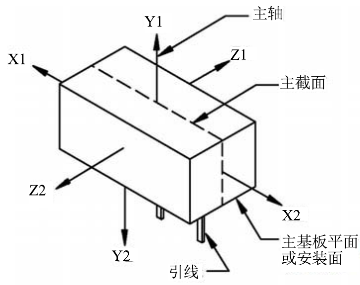

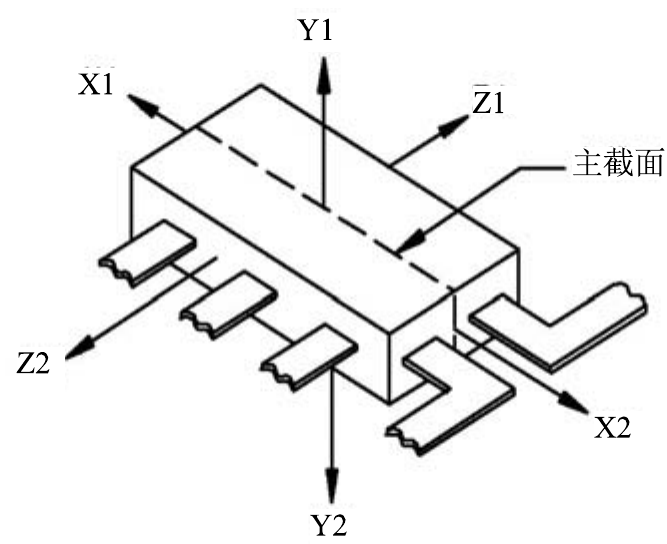

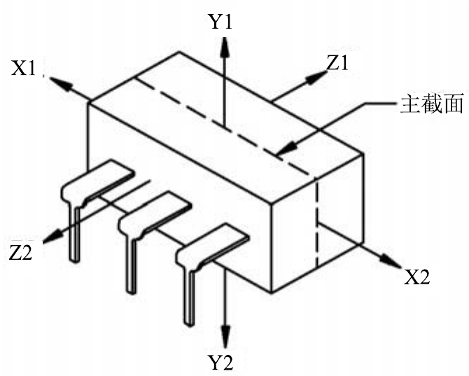

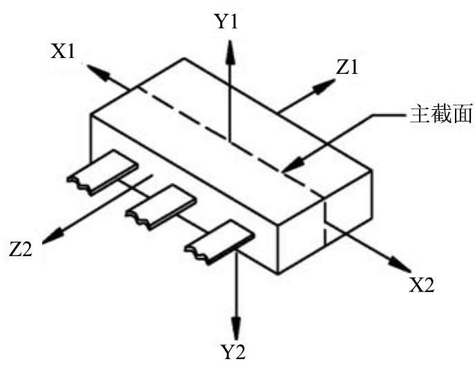

图4 单边径向引线的扁平封装

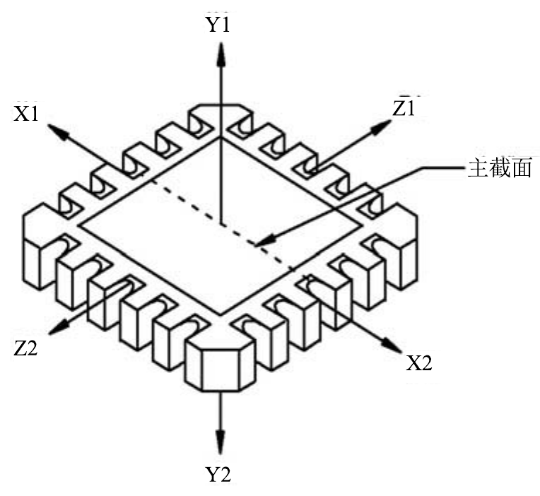

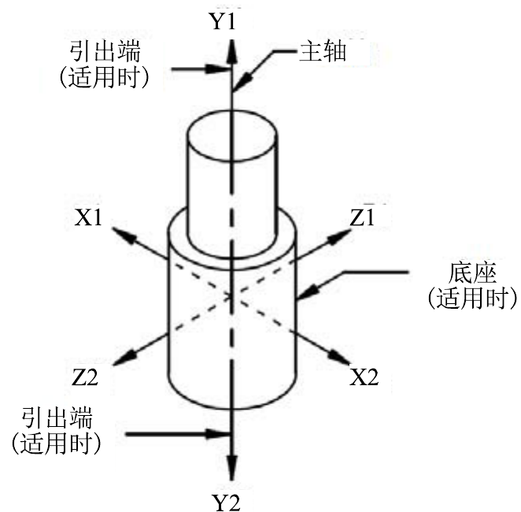

### 4.4.3 两横向尺寸不同时的取向

从三个或更多的侧面引出径向引线的扁平封装，X方向应取两横向尺寸中尺寸较大的方向；而Z方向取尺寸较小的方向。

### 4.5 试验条件

### 4.5.1 校准

用于保证产品符合规范要求和关键制造过程控制的测试和试验设备应按GJB2712的要求进行校准。对校准过的设备应有效控制，并按规定使用和贮存。对要求校准的设备（单台件或组合）应按GJB2712的要求进行标识。

### 4.5.2 电测试设备的准确度

在确定测量值极限时，应考虑测量误差(包括由于偏离标称试验条件而引起的误差)，使器件参数的真值(标称的试验条件下)在规定的极限值之内。

除另有规定外，以下电测试容差均应适用于器件的测量：a) 电源电压和偏压准确度应保持在规定值的 \(1\%\) 之内。b) 输入调整电压准确度应保持在规定值的 \(1\%\) 或 \(1\mathrm{mV}\) 之内，取其大者。c) 输入脉冲特性、重复率、频率等准确度应保持在 \(10\%\) 之内。应当这样选择标称值，使其 \(\pm 10\%\) 的变化(如果测试设备的变量小于 \(10\%\) ，则选用实际值)不影响规定值测量的准确度。d) 击穿试验施加的电压准确度应保持在规定值的 \(1\%\) 之内。e) 对于数字器件而言，应注意保证只有在其适当的高或低逻辑电平或其他规定电平时才施加最大输出负载电流。f) 阻性负载的容差为 \(\pm 1\%\) 。

g) 容性负载的容差为 \(\pm 5\%\) 或 \(\pm 1\mathrm{pF}\) ，取其大者。

h) 感性负载的容差应为 \(\pm 5\%\) 或 \(\pm 5\mu \mathrm{H}\) ，取其大者。

i) 静态参数应测到 \(1\%\) 以内。

j) 开关参数应测到 \(5\%\) 或 \(1\mathrm{ns}\) 以内，取其大者。

### 4.5.3 电测试设备的能力

### 4.5.3.1 通则

承制方根据以下要求确定测试设备或系统是否适用于保证产品一致性符合规范和合同的规定。承制方应确定所用方法，并形成文件。器件容差与测试设备准确度的比值应符合以下规定:a) 对通常情况，不小于 \(10:1\)

b) 对特殊情况(无市售设备),不小于 \(4:1\) 。

注：由于缺少相应的国家标准，不能有效的达到4:1时，应说明情况并形成文件。

### 4.5.3.2 不确定度的控制

对复杂的测试过程应进行不确定度分析和控制。应确定各项测试的总不确定度，并应考虑不确定度对产品参数容差的影响。可选用下述一种或几种方法:

a) 算术相加(线性)方法。本方法通常导致过于保守的估计，它反映在同一时刻各误差均在同一方向达到最大值这一不大可能出现的情况。

b) 平方和的平方根(RSS)方法。本方法通常适用于误差源相互独立，误差趋于正态分布(高斯分布)的情况。

c) 偏导数方法。本方法用于不确定性依赖关系复杂的情况。

d) 蒙特卡洛模拟。用于其他方法不易使用或不适用的非常复杂的情况。

e) 测试标准物质(或比对器件)提供数据。

注：根据比对器件的数据确定测试过程是否在统计极限范围内。

f) 系统误差和随机误差分析。适用时用本方法进行修正。

g) 经工程分析证明的其他经认可的方法。

### 4.5.3.3 标准物质(RM)或比对器件的使用和控制

如果承制方采用标准物质或比对器件，应在文件中规定适当的使用和控制方法，包括参数、型号、数量、说明、标识、存放、操作和周期验证要求。

### 4.5.4 电测试频率和电源电压

除另有规定外，电测试应在规定的工作频率进行。如规定了某个频率范围，除了在该频段的任一规定频率下进行的测试外，还应在该频段的最高和最低频率下对主要功能参数进行测试。无论在规定的频率范围或在一个以上的工作频率对器件进行电测试时，都应记录测试频率以及在该频率下测得的参数值。

除另有规定外，电测试应在最坏电源电压条件下进行。

### 4.5.5 多输入/输出端的器件测试

对具有一个以上输入或输出端的器件，当规定了输入或输出参数时，应对器件的所有输入和输出端测量规定的参数。

### 4.5.6 复杂器件的测试

如果被试器件含有多个电路或多种功能时，无论是独立地与引出端相连接，还是为了把引出端数减到最少而以某种方式内连，都应采用适当的线路和程序以便能按适用文件规定的试验方法对器件所含的所有电路或功能进行测试。例如，器件有一对逻辑门就不能只测量一个门的规定参数，而应对复杂器件的所有电路进行测试，以保证在各电路之间不出现严重干扰(例如把信号加到双门器件的一个门上，不应使另一个门的输出发生变化)。此项要求的目的是为了保证器件内所有电路元件能按其结构和连接状态，最大可能地经受试验。对于具有复杂的信号路径，且信号路径随输入信号的性质或内部功能随输入信号的执行而变化的电路阵列，应编制器件工作程序来满足此项要求，从而保证所有电路元件均起作用，并能按规定试验方法观察或测量它们的性能水平。

### 4.5.7 试验环境

除本标准或有关的订购文件另有规定外，电测试环境温度要求: \(25 \pm 3^{\circ} \mathrm{C}\) ;其他试验环境温度要求: \((25 \pm 10)^{\circ} \mathrm{C}\) ;环境气压 \(86 \mathrm{kPa} \sim 106 \mathrm{kPa}\) 。如果环境湿度对试验有影响，应在有关文件中规定。

### 4.5.8 试验箱内允许的温度变化

当采用试验箱时，被试样品只能放在符合下述规定的工作区内:a) 工作区内各点温度随时间的变化。试验箱的控制应保证工作区内任一个参考点的温度变化保持在 \(\pm 2^{\circ} \mathrm{C}\) 或 \(\pm 4 \%\) 之内，取较大者。

b) 工作区内各点之间的温度差异。试验箱的结构应使其工作区内任一点的温度在任何时间内偏离参考点为 \(\pm 3^{\circ} \mathrm{C}\) 或 \(\pm 3 \%\) ，取较大者。发热样品附近除外。

c) 规定最低温度的试验箱。当规定最低试验温度时(例如老炼、寿命试验等),试验箱的结构和控制应保证工作区内任一点的温度对最低温度的偏离不超过 \(4^{\circ} \mathrm{C}\) 或 \(8 \%\) ，取其大者。

### 4.5.9 电测试时的温度控制

### 4.5.9.1 通则

除另有规定外，规定的测试温度一外壳温度 \(T_{\mathrm{C}}\) 、环境温度 \(T_{\mathrm{A}}\) 或结温 \(T_{\mathrm{J}}\) ，应采用下面规定的适用程序加以控制。这些程序专门用于在一定温度下进行器件的电测试时控制所用试验箱、装置等，这时4.5.8中的规定不适用。测试可在低占空比脉冲或稳定功率温度条件下进行。

### 4.5.9.2 测试温度 \(T_{\mathrm{C}}\) 、 \(T_{\mathrm{A}}\) 或 \(T_{\mathrm{J}}\) 高于 \(25^{\circ} \mathrm{C}\) 时的控制

除另有规定外，在不加电的条件下将器件(包括内部元器件；例如芯片、电容器、电阻器)温度稳定在 \(T_{\mathrm{C}}\) 、 \(T_{\mathrm{A}}\) 或 \(T_{\mathrm{J}}\) 的 \(\pm 3^{\circ} \mathrm{C}\) (对于混合集成电路为 \(5^{\circ} \mathrm{C}\) ) 之内。如果混合集成电路的结构指明且承制方能够保证该器件在试验下不会退化，则混合集成电路可以超过正偏差。当建立的温度特征曲线对器件试验是可用的，那么可使用该特征曲线代替温度测量，以决定合适的热浸条件从而达到本要求。当使用温度特征曲线时，试验设备监控应保证控制可以提供正确的试验环境。在稳定后，器件工作和 \(T_{\mathrm{C}}\) 、 \(T_{\mathrm{A}}\) 或 \(T_{\mathrm{J}}\) 进行控制不得降低规定温度的 \(3^{\circ} \mathrm{C}\) 以上。在测试过程中器件温度不应低于规定的 \(T_{\mathrm{C}}\) 、 \(T_{\mathrm{A}}\) 或 \(T_{\mathrm{J}}\)\(3^{\circ} \mathrm{C}\) 以上。如果承制方保证器件不会退化，测试期间温度可以比规定的 \(T_{\mathrm{C}}\) 、 \(T_{\mathrm{A}}\) 或 \(T_{\mathrm{J}}\) 高 \(3^{\circ} \mathrm{C}\) 以上。应采用低占空比脉冲，或有规定时采用稳定功率条件(见4.5.9.5)来测量电参数。

### 4.5.9.3 测试温度 \(T_{\mathrm{C}}\) 、 \(T_{\mathrm{A}}\) 或 \(T_{\mathrm{J}}\) 低于 \(25^{\circ} \mathrm{C}\) 时的控制

除另有规定外，在不加电的条件下将器件(包括内部元器件；例如芯片、电容器、电阻器等)温度稳定在设定温度的 \(\pm 3^{\circ} \mathrm{C}\) 之内(对于混合集成电路为 \(5^{\circ} \mathrm{C}\) )。如果混合集成电路的结构指明且承制方能够保证该器件在试验下不会退化，则混合集成电路可以超过负偏差。当建立的温度特征曲线对器件试验是可用的，那么可使用该特征曲线代替温度测量，以决定合适的热浸条件从而达到本要求。当使用湿度特征曲线时，试验设备监控应保证控制可以提供正确的试验环境。在稳定后，器件工作和 \(T_{\mathrm{C}}\) 、 \(T_{\mathrm{A}}\) 、或 \(T_{\mathrm{J}}\) 进行控制不得降低规定温度的 \(5^{\circ} \mathrm{C}\) 以上。这一温度作为冷启动温度。应采用低占空比脉冲，或有规定时采用稳定功率条件(见4.5.9.5)来测量电参数。适用时详细规范应规定对冷启动温度最敏感的参数或测试程序。当有规定时，这些参数应在测试程序开始时测量，并且应尽可能迅速或在规定的时间内完成。

除详细规范另有规定外，设定温度应为 \(- 55^{\circ} \mathrm{C}\) ( \(T_{\mathrm{C}}\) 、 \(T_{\mathrm{A}}\) 或 \(T_{\mathrm{J}}\) ，适用时),如果测试期间器件温度( \(T_{\mathrm{C}}\) 、 \(T_{\mathrm{A}}\) 或 \(T_{\mathrm{J}}\) ，适用时)升高超过 \(5^{\circ} \mathrm{C}\) ，设定温度应比 \(- 55^{\circ} \mathrm{C}\) 更低。

### 4.5.9.4 测试温度 \(T_{\mathrm{C}}\) 、 \(T_{\mathrm{A}}\) 或 \(T_{\mathrm{J}}\) 为 \(25^{\circ} \mathrm{C}\) 时的控制

除另有规定外，在不加电的条件下将器件(包含其内部元件，如芯片、电容、电阻等)温度稳定在 \(25 \pm 3^{\circ} \mathrm{C}\) 之内。应采用低占空比脉冲来测量电参数，或有规定时采用稳定功率温度条件(见4.5.9.5)。

### 4.5.9.5 稳定功率温度条件

当规定时，器件应在规定的稳态加电条件下，在规定的测试温度( \(T_{\mathrm{A}}\) 、 \(T_{\mathrm{C}}\) 或 \(T_{\mathrm{J}}\) ，适用时)等于、高于或低于 \(25^{\circ}C\) 下至少稳定5min或规定的时间。电参数测量应在温度/功率稳定后尽可能快地或在规定时间内完成。作为替代方法，当有规定时器件温度 \(T_{\mathrm{C}}\) 或 \(T_{\mathrm{A}}\) 可稳定在规定稳定功率状态预计的典型结温的 \(\pm 3^{\circ}C\) 之内至少5min,采用低占空比脉冲技术进行测试。

### 4.6 一般注意事项

### 4.6.1 瞬态响应

不应使器件承受超过额定值的瞬态电压和电流。

### 4.6.2 引出端连接顺序

应小心地将器件与电源连接。对MOS器件、其他一些微电路，或分立器件引出端的连接顺序是很重要的，应注意有关订购文件中的注意事项。

### 4.6.3 焊接

试验需要进行焊接时，应注意避免损坏器件。

### 4.6.4 辐射防护

在X射线、中子或其他高能粒子的辐射环境中贮存或测试器件时，应当采取适当的防护措施。

### 4.6.5 操作注意事项

操作时，应注意:a) 器件接入测试线路之前，所有设备应接地；

b) 在器件接入设备之前，或为了进行测试必须取出器件之前，应尽可能把它们一直放在金属屏蔽容器内；

c) 适用时，在测试期间器件应一直装在载体或其他防护包装内。

### 4.7 可回收、循环利用或利于环保的材料

应尽可能使用可回收、循环利用或利于环保的材料，前提是该材料满足或优于操作及维护要求，并有助于降低产品寿命周期成本。

### 5 详细要求

各项试验的详细要求见1000系列、2000系列、3000系列和5000系列中的各试验方法。

注：各试验方法中提及的章、条、图、表等的编号，均指对该方法中相应内容的引用。对该方法之外内容的引用，需作明确界定，如"按本标准第×章规定"、"见方法××表×"等。

## 方法1001 低气压(高空工作)

### 1 目的

本试验是模拟飞机或其他飞行器在高空飞行中所遇到的低气压条件来进行的。本试验的目的是测定器件和材料在气压降低的情况下，由于空气和其他绝缘材料的绝缘强度降低，而不至于出现电击穿失效的能力。在低气压条件下，即使不会产生完全的电压击穿，也会增强电晕放电、介质损耗和电离等有害影响。此项试验还可以用来检验低气压条件下的其他效应，如稀薄空气使绝缘材料介电常数发生变化、使发热器件散热能力降低等对器件工作特性的影响。

### 2 设备

低气压试验所需仪器设备包括真空泵、合适的密封室(必要时，该密封室应具备能观察样品的装置)、可用于测量密封室模拟高度的压力表、用于检测从直流到 \(30\mathrm{MHz}\) 范围电流的微安表或示波器和其他必要的测试仪器。

### 3 程序

样品应按规定安装在密封室内，将室内气压降到下述试验条件中的规定值(见表1)。把样品保持在规定的气压下，对它们进行规定的试验。在试验期间及试验前的 \(20\mathrm{min}\) 内，试验温度应为 \(25^{\circ}\mathrm{C}\pm 10^{\circ}\mathrm{C}\) 。器件应施加规定的电压，在从大气压力到规定的最低气压并恢复到大气压力的整个过程中监测器件是否出现故障。器件如出现飞弧、有害的电晕或其他任何影响器件工作的缺陷或退化，都应视为失效。

连接器件，进行测量，并且在整个抽气过程中施加规定的电压。用微安表或示波器监视施加最大电压(见第4章c))的器件引出端，从直流到 \(30\mathrm{MHz}\) 范围内看其是否出现电晕放电电流。应制定适用试验条件下的数据处理程序(试验电路中的电流减去器件正常工作条件下的电流)，以保证获得被试器件的低气压特性。

除另有规定外，试验样品在低气压条件下的试验时间，可从下列数值中选取：5min、30min、1h、2h、4h、16h。

### 4 说明

有关的订购文件应规定以下内容：a) 安装方法(见第3章)。b) 试验条件字母代号(见第3章)。除另有规定外，应采用条件E。c) 降压期间的测试(见第3章)。除另有规定外，器件应承受在额定条件下的最大电压。

d) 适用时， 进行降压后的测试(见第 3 章)。除另有规定外， 应对器件规定的特性或参数进行全面的电测试。

e) 适用时， 测量前的暴露时间(见第 3 章)。

f) 试验时间。

## 方法1002 浸液

### 1 目的

本试验的目的是验证器件密封的有效性。当器件由于不良结构，在物理或环境试验中可能产生机械损伤引起密封缺陷时，本试验可检测器件密封的有效性。浸液试验一般紧接在其他物理和环境试验之后进行，因为浸液试验能使接口、焊缝和外壳中的密封隐患进一步恶化。将被试器件浸入温差很大的两种液体中，使之受到热应力和机械应力，这样就很容易检查出接口、焊缝或外壳中的缺陷。选用淡水还是盐水作为试验液体取决于被试器件的封装特性。当试验后用检测电参数的方法来证实是否泄漏时，用盐水比用淡水更容易检测出封口穿透的情况，因为盐水更容易使内部元件腐蚀或出现盐的结晶，导致绝缘电阻降低。本试验不能代替热冲击试验或盐雾试验，尽管它也可以揭示器件在这些方面的不足。本试验是破坏性试验，故不应作为 \(100\%\) 的筛选或试验。

### 2 设备

浸液试验所用的设备是两只温控恒温槽，能够保持所选的冷、热水浴条件的规定温度。使用合适的温度计测量槽温。

### 3 程序

本试验连续进行数次浸液循环，每次循环先浸在温度为 \(65^{\circ}\mathrm{C}\) 的热淡水(自来水)槽中，然后浸在冷水槽中。循环次数、每次浸渍时间(即冷、热水槽浸渍时间)、冷水槽的性质和温度都在表1中加以规定。样品应尽可能迅速地从一个槽转移到另一槽中。在任何情况下，转移时间都不应超过15s。完成最后一次循环后，应在淡水或蒸馏水中把样品迅速而彻底地清洗，并擦干或吹干所有表面，使其干净和干燥。除另有规定外，应在末次循环完成4h后、48h内对器件进行测试。当订购文件有规定时，在电测试和外部自检完成后，应按方法2013打开器件，检查内部元器件有无浸蚀现象和盐的晶粒。当本试验作为一个试验组或试验分组的一部分来进行时，在本项试验结束时，不必专门进行试验后的测试或检查，而可以在该组或分组试验结束时再进行。

### 4 说明

有关的订购文件应规定以下内容：a) 试验条件字母代号(见第3章)。除另有规定外，应采用条件C。

b) 若与第3章中规定不同，应规定最后一次循环后的测量时间。

c) 最后一次循环后的测试(见第3章)。除另有规定外，测试应包括引线间的绝缘电阻、引线与外壳间的绝缘电阻和订购文件列出的所有器件特性或全部电参数。最终评价应包括对器件标志清晰度、封装和引线是否变色或腐蚀等的外观目标。

d) 适用时，打开器件并进行内部检查(见第3章)。

## 方法1003 绝缘电阻

### 1 目的

本试验的目的是测量器件的绝缘部分对外加直流电压所呈现的电阻，施加的外加电压会使绝缘部分表面或其内部产生漏电流。绝缘电阻的测量不能等效于介质耐压试验或电击穿试验。干净而又干燥的绝缘体具有很高的绝缘电阻，但如果存在机械缺陷，就会在介质耐压试验中失效。由于绝缘部分是由不同的绝缘材料或材料组合而成的，具有不同的固有绝缘电阻，因此测得的绝缘电阻数值不宜作为洁净度或有无变质现象的依据。

影响绝缘电阻测量的因素有温度、湿度、残余电荷、充电电流或仪器和测试线路的时间常数、测量电压、预调及连续施加电压的时间(加电时间)。对于最后一个因素，某些元件(如电容器和电缆)的电流特性，通常从瞬时最大值以某一变化速率下降到一平稳态的较小值，其下降速率取决于试验电压、温度、绝缘材料、电容量和外电路的阻抗。因此，当连续施加测量电压时，在一段时间，所测到的绝缘电阻会不断增加。由于这种现象，可能要经过数分钟才趋于最大绝缘电阻读数。因此，规范通常要求在规定的时间后读出数值。如果绝缘电阻相当接近稳态值，而电流- 时间曲线又已知，或者在测量值上加上适当的修正因子，就可以大大地缩短测量时间，且仍可得到良好的测量结果。对于某些器件，可以在几秒钟内获得稳定的仪器读数。当需要有关试验前后测量绝缘电阻，应在相同的条件下进行。

### 2 设备

绝缘电阻的测量设备应与被测元件的特性相适应，如兆欧电桥、兆欧表、绝缘电阻测量装置或其他适用设备。

### 3 程序

当需要特殊准备或条件时，如特殊的试验夹具、重新连接、接地、绝缘、低气压、湿度或水浸等，应作出规定。按规定，在相互绝缘点间，或在绝缘点与地之间测量绝缘电阻。除另有规定外，当加电(充电)时间是一个影响因素时，在连续施加测量电压到规定的时间(见第4章)之后应立即进行绝缘电阻的测量。但是，如果仪表读数表明绝缘电阻达到了规定极限，无论它处于稳态状态或还继续增加，都可在规定的测量时间之前终止测量。如果要进行多次测量，应采用与初次测量相同的极性依次测量绝缘电阻。除另有规定外，施加到样品上的直流电压应按表1规定的试验条件，并在外加电压的两种极性上测量绝缘电阻。

当进行质量一致性检验时，可以使用任何等于或高于适用的试验条件所允许的最低电压。除另有规定外，绝缘电阻值的测量误差不应超过 \(10\%\) 。应采用适当的保护措施，防止由于不希望的路径漏电造成读数误差。

### 4 说明

有关的订购文件应规定以下内容：a) 适用时，试验条件字母代号或其他测量电压(见第3章)。

b) 必要时，应规定特定的准备或条件(见第3章)。

c) 测量点(见第3章)。除另有规定外，应在器件引线(全部引线互相电连接在一起或连接到一个公共点)与器件外壳之间测量绝缘电阻，测量的绝缘电阻值不小于 \(15\mathrm{M}\Omega\) 。

d) 如果“加电时间”很关键，应具体规定加电时间(见第1章)。

e) 用在规定测量电压下测得的最大漏电流表征绝缘电阻。除另有规定外，在 \(100\mathrm{V}\) 直流电压下，任何相邻而不相连接的引线间的最大漏电流，不超过 \(100\mathrm{nA}\) 。

## 方法1004.1 耐湿

### 1 目的

本试验的目的是用加速方式评估器件及其所用材料在炎热和高湿条件(典型的热带环境)下批退化效应的能力。大多数炎热条件下退化现象是直接或间接地由于有缺陷的绝缘材料吸附水蒸汽和水膜，以及由于金属和绝缘材料表面变湿而引起的。这种现象会产生多种类型的退化，其中包括金属的腐蚀、材料成分的变化及电特性变坏。本试验与稳态潮湿试验不同，它采用温度循环来提高试验效果，其目的在于提供一个凝露和干燥的交替过程，使进入密封外壳内的水汽产生"呼吸"作用，从而使腐蚀过程加速。在高温下，潮气的影响将更加明显，增强试验效果。试验包括一个低温子循环，因为凝结水汽引起的应力会使裂缝加宽，它能使在其他情况下不易发现的退化作用加速显现。这样，通过测量电特性(包括击穿电压和绝缘电阻)或进行密封试验就可以揭示该退化现象。应规定在绝缘体上施加极性电压，研究电解的可能性，因为电解会助长可能发生的介质击穿。如果需要，为了确定载流元件特别是细导线和接点的抗电化学腐蚀的能力，本试验还可以对某些元件施加一定的电负荷。本试验获得的结果是可重复产生的，并已通过现场失效的调查得到证实。现已证明，本试验能可靠地指出哪些器件不能在热带条件下使用。

### 2 设备

耐湿试验的设备包括能满足图1所示的循环和公差要求的温- 湿箱，以及按3.7和第4章的规定进行测量的电测试仪器。

### 3 程序

### 3.1 通则

应按 \(3.3\sim 3.8\) 的规定以及图1的要求对样品进行试验。样品的安装方式应使它们能暴露在试验环境中。

### 3.2 预处理

除另有规定外，在安置样品进行耐湿试验之前，器件引线应承受弯曲应力，其条件应符合方法2004中试验条件B的规定。如果在另一试验中样品已进行了所要求的预处理，则不必重复引线弯曲。

### 3.3 初始测试

在第一次循环的第一步之前，应在室温环境条件或按规定进行初始测试。当有规定时，初始测试前器件应在干燥箱内进行初始处理(见图1),从干燥箱取出后的8h内完成初始测试。

### 3.4 循环次数

样品应进行10次连续循环，每次都按图1进行。在完成规定的循环次数之前(不包括最后一次循环),如发生了不多于1次的意外试验中断(如电源中断或设备故障),应重做该循环，试验可以继续进行。若在最后一次循环期间出现意外的试验中断，除要求重做该循环外，还要求再进行一次无中断的循环。任何故意中断或意外中断超过24h,都要求从头至尾重做试验。

### 3.5 第7步子循环

在10次循环中，至少有5次循环期间内要进行低温子循环。在开始第7步后，至少1h但不超过4h,将样品移出潮湿箱，或降低箱内温度，以便进行低温子循环。在低温子循环期间，样品应在 \(- 10_{- 5}^{+2}\mathrm{^\circ C}\) 和不控制湿度的条件下，如图1所示至少保持3h。若不使用另一个低温箱，应注意保证样品在整个周期内保持在 \(- 10_{- 5}^{+2}\mathrm{^\circ C}\) 。在低温子循环后，样品应恢复为 \(25^{\circ}\mathrm{C}\) ，相对湿度(RH)至少为 \(80\%\) ，并一直保持到下一个循环的开始。

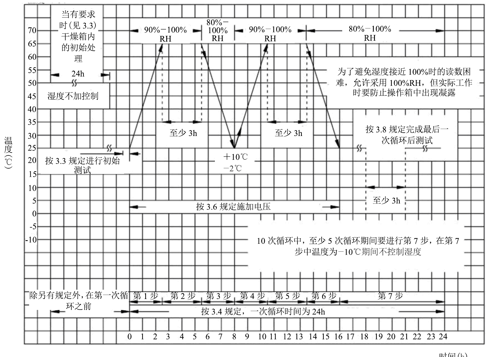

### 3.6 外加电压

在按图1规定进行耐湿试验期间，当有规定时(见第4章)，样品应按规定施加偏置电压，为了提高试验效果，选用的偏置条件应利用尽可能多的引出端，使芯片的金属化线条之间或外引出端之间的电位差达到最大，使功耗为最小。

### 3.7 温度条件

图1虽然没有规定箱内的温度变化率，但是在温度变化过程中，样品不应受到箱内加热体的直接热辐射。除另有规定外，箱内的空气每分钟的换气量至少等于箱的容积的5倍。紧靠样品的各点和箱体内表面上的稳态温度容差为所规定温度的 \(\pm 2^{\circ}C\) 。对质量不大于 \(11.4\mathrm{kg}\) 的样品，在试验箱间的转移时间应少于 \(2\mathrm{min}\) 。

### 3.8 最终测试

在最后一次循环的第6步之后(或者在第10次循环期间完成3.5的子循环，则在第7步之后)，器件应在室温环境条件下放置24h，然后按方法1003中试验条件A进行绝缘电阻测量，或在 \(25^{\circ}C\) 下进行规定的终点电测试。绝缘电阻测量或 \(25^{\circ}C\) 下终点电测试应在器件移出试验箱后的48h内完成。电测试也可以在放置的24h期间进行，但应记录测试中出现的所有失效器件，且禁止为了得到可接收的结果，在24h之后对失效器件重新进行测试。在24h放置期间不应进行其他试验(如密封试验)。进行绝缘电阻测量时，测得的电阻值不得小于 \(10\mathrm{M}\Omega\) ，并且应记录测量结果，其数据作为终点数据的一部分提交。如果把封装外壳设计成与芯片基板电连接，则不必进行绝缘电阻测量，而应在器件移出试验箱后的48h内完成规定的 \(25^{\circ}C\) 终点电测试，还应进行目检和任何其他规定的终点电参数测量(见第4章c))。

### 3.9 失效判据

器件出现下列情况应视为失效：a）所规定的标志全部或部分脱落、褪色、弄脏、模糊或达到不可辨认的程度。该检查应在正常室内照明和放大1倍 \(\sim 3\) 倍下进行。

b) 当放大10倍 \(\sim 20\) 倍观察时， 任何封装零件(即封盖、引线或盖帽)的镀涂或底金属被腐蚀的面积超过 \(5\%\) ， 或封装零件被腐蚀透。

c) 引线脱落、折断或局部分离。

d) 因腐蚀而导致引线之间或引线与金属外壳之间搭接在一起。

e) 终点电测试或绝缘电阻测量不合格。

注： 镀涂应包括封装和从弯月面到引线末端(不包括被剪掉的末端)的所有暴露部分， 以及所有其他被暴露的金属表面。

### 4 说明

有关的订购文件应规定以下内容:a) 如果不在室温环境下进行初始测试(见3.3), 应规定初始测试条件。

b) 适用时(见3.6), 应规定外加电压和偏置条件。偏置条件按下述导则:

1) 只要求一个电源电压端(V)(正负均可)和一个接地端(GND)或公共端。电源电压值的幅度应是最大值， 但不超过规定的绝对最大额定值， 并使试验条件最佳化。

2) 除另有规定外， 其他的电压端和接地端均应与GND连接。

3) 除另有规定外， 全部数据输入端应与V连接。选择V的极性和数值， 应使内部功耗为最小并使电流流入器件。除另有规定外， 所有扩展输入端应与GND连接。

4) 所有其他引线， 例如时钟端、置位端、复位端、输出端等应分别与V或GND连接， 连接的原则是使电流最小。

5) 内部没有连接的引线应连接到V或GND, 并使其极性与相邻的引线极性相反。

c) 最终测试(见3.8)要求： 最终测试应包括终点电测试规定的全部电特性和参数。

d) 若不是10次循环(见3.4), 应规定循环次数。

e) 必要时(见3.3), 初始测试前应在干燥箱中进行预处理。

## 方法1005.1 稳态寿命

### 1 目的

本试验的目的是验证承受规定条件的器件在整个工作时间内的质量或可靠性。在额定工作条件下进行的寿命试验，其试验时间应足够长，以保证其结果不具有早期失效或者“初期失效”的特征。在寿命试验期间还应进行定期观察输入试验条件和输出状态等，以监视失效率是否随时间有显著变化。为了在较短时间或以较小应力获取正确结果，应当使用加速试验条件或者足够大的样本以提供相应的失效概率，以便使该样本的失效分布能够表征所在批次的潜在失效分布。本方法第3章中所提供的试验条件正是基于以上考虑。

如果用本试验来评定器件的基本性能或对器件进行鉴定试验，以确保器件以后能用于高可靠场合，就应选择适当的试验条件，包括电输入、负载和偏置以及相应的最高工作温度、试验温度或其他规定的环境，以保证器件在最大工作额定值或试验额定值（见试验条件F)下试验。

### 2 设备

应提供适当的插座或其他安装手段，使之与被试器件的引出端在规定的电路中实现可靠的电连接。除订购方或鉴定机构批准之外，安装手段应设计成不会通过传导方式来散逸器件内部发出的热量，热量只能通过器件引出端、必须的电接触和气体或液体介质来散发。设备还应保证被试器件引出端上施加规定的偏置电压，当有规定时，还应能监视输入激励或输出响应。在电源电压和环境温度等条件正常变化的情况下，电源和调整电流的电阻器至少应能在整个试验期间保持规定的工作条件。不管器件是进行单个试验还是成组试验，当试验条件导致明显的功率耗散时，试验设备应能使每个器件产生的功率耗散大致相等。试验线路不需要对单个器件特性的正常变化进行补偿，但是在一组器件中出现失效或器件反常（即开路、短路等)时，应不至于影响该组中其他器件的试验效果。

### 3 程序

### 3.1 概述

器件应按规定的试验条件(见3.6)、规定的试验时间和规定的试验温度进行试验，并在规定的中间和终点进行所要求的测试。用引线、螺栓或外壳按正常的结构方式将其安装好，并且保持接触点温度不低于规定的环境温度。应记录所选择的试验条件、持续时间、样本大小，并在整个试验中予以控制。试验板上不同器件之间或同一器件不同输出端之间不得共用一个负载电阻器。

### 3.2 试验持续时间

### 3.2.1 标准寿命试验持续时间

除另有规定外(见3.3.2)， \(125^{\circ}C\) 的寿命试验持续时间至少应为 \(1000\mathrm{h}\) 。在规定的试验持续时间之后，应使器件脱离该试验条件并达到标准测试条件。如果本试验的目的是为了证明是否符合规定的失效率 \((\lambda)\) ，可以在达到规定时间时终止试验，如果在达到规定的试验时间之前出现拒收情况，可以在出现拒收点时终止试验。

### 3.2.2 加速寿命试验持续时间

对于B级器件，当进行加速试验时，其寿命试验持续时间在所选择或所规定的环境温度下(见表1)应等效于 \(125^{\circ}C\) 下的 \(1000\mathrm{h}\) 。在规定的试验时间之后的72h内，应把器件移出规定的试验条件，在不去掉偏置的条件下达到标准测试条件。为了把器件移到与寿命试验箱隔开的冷却位置而造成的偏置中断不超过1min，不应视作去掉偏置。

### 3.3 试验温度

### 3.3.1 一般要求

所规定的试验温度是最低的环境温度，在寿命试验箱工作区内所有的器件处于该温度下。要做到这一点，应通过对箱内结构、负载情况、控制仪器或监测仪器的位置以及空气或其他合适的气体或液体介质的流动进行必要的调整。因此，试验箱应在满负荷（线路板上不必插上器件）未通电（对器件而言）的状态下进行校正，而且指示传感器位于或调整到反映最接近工作区内最低温度的位置上。

### 3.3.2 标准寿命试验温度

### 3.3.2.1 通则

除另有规定外，试验条件A至试验条件E（见3.6）的环境寿命试验温度至少应是 \(125^{\circ }C\) ，对于混合集成电路，试验条件可以根据表1的规定进行变动。当采用规定的试验线路和偏置条件时，供货方可自行确定将试验条件A至试验条件E的环境温度按表1的规定升高以缩短试验时间。因为在正常情况下，外壳温度和结温将明显地高于环境温度，所以对于器件结构应作如下考虑，当器件在试验或工作时，其外壳或结的最高额定温度，对于B级不得超过 \(200^{\circ }C\) ，对于S级不得超过 \(175^{\circ }C\) （见3.3.2.2）。

<table><tr><td rowspan="2">最低温度\(T_{A}\) \(^{\circ }C\)</td><td colspan="4">最短时间 h</td><td rowspan="2">试验条件 （见3.6）</td></tr><tr><td>S 级</td><td>B 级</td><td>H 级a</td><td>K 级a</td></tr><tr><td>100</td><td>-</td><td>-</td><td>7500</td><td>7500</td><td rowspan="8">\(A\sim E\)</td></tr><tr><td>105</td><td>-</td><td>-</td><td>4500</td><td>4500</td></tr><tr><td>110</td><td>-</td><td>-</td><td>3000</td><td>3000</td></tr><tr><td>115</td><td>-</td><td>-</td><td>2000</td><td>2000</td></tr><tr><td>120</td><td>-</td><td>-</td><td>1500</td><td>1500</td></tr><tr><td>125</td><td>1000</td><td>1000</td><td>1000</td><td>1000</td></tr><tr><td>130</td><td>900</td><td>704</td><td>704</td><td>-</td></tr><tr><td>135</td><td>800</td><td>496</td><td>496</td><td>-</td></tr><tr><td>140</td><td>700</td><td>352</td><td>352</td><td>-</td></tr><tr><td>145</td><td>600</td><td>256</td><td>256</td><td>-</td></tr><tr><td>150</td><td>500</td><td>184</td><td>184</td><td>-</td></tr><tr><td>175</td><td>-</td><td>40</td><td>-</td><td>-</td></tr><tr><td>180</td><td>-</td><td>32</td><td>-</td><td>-</td><td rowspan="3">\(F^{b,c}\)</td></tr><tr><td>185</td><td>-</td><td>31</td><td>-</td><td>-</td></tr><tr><td>\(\geq 190\)</td><td>-</td><td>30</td><td>-</td><td>-</td></tr><tr><td colspan="6">a 仅对混合集成电路可采用低于125℃的试验温度。 b 试验条件F （试验温度大于等于175℃)，在采用之前应得到批准。 c 对于试验条件F ，不受最高结温的限制，但应小心，以免器件热烧毁。</td></tr></table>

### 3.3.2.2 单片功率电路的试验温度

器件无论功率大小都应能以最高额定工作温度进行老炼或寿命试验。用环境温度 \(T_{A}\) 表示最高工作温度的器件，采用表1。用外壳温度 \(T_{C}\) 表示最高工作温度的器件， \(125^{\circ }C\) 的环境温度有可能使 \(T_{J}\) 超过 \(200^{\circ }C\) （对S级，超过 \(175^{\circ }C\) )，为此进行老炼和寿命试验时的环境温度可以从 \(125^{\circ }C\) 降低到某一个温度，但要求在该温度下， \(T_{j}\) 应控制在 \(175^{\circ}\mathrm{C} \sim 200^{\circ}\mathrm{C}\) 之间， \(T_{\mathrm{C}}\) 等于或大于 \(125^{\circ}\mathrm{C}\) ，这时不必改变试验时间。应准备好支持这种降温处理的数据，在有要求时提交给订购方和鉴定机构。

### 3.3.2.3 混合集成电路的试验温度

寿命试验采用外壳温度时，应规定器件外壳温度 \((T_{\mathrm{C}})\) 的上限值。寿命试验的环境温度或外壳温度应按表1规定。对K级器件的寿命试验，时间至少 \(1000\mathrm{h}\) 。器件应按详细规范中规定的最高工作温度、电压和负载条件进行寿命试验。在正常环境下，外壳温度和结温明显高于环境温度，因此电路的设置不应超过详细规范中规定的最高额定结温和基线文件中规定的聚合材料固化温度。如果没有规定最高结温，则取最大值为 \(175^{\circ}\mathrm{C}\) 。不允许进行条件F的加速寿命试验。规定的试验温度应该是使试验箱中的所有器件都稳定达到的实际最低环境温度或外壳温度。为保证这一点，必须调整试验箱结构、负载、控制仪或监视仪的位置和气流或其他合适气体或试验箱中液体媒质的流动。

### 3.3.3 加速寿命试验温度

当规定或自愿(当有关的订购文件允许时)采用条件F时，除另有规定外，最低环境试验温度应为 \(175^{\circ}\mathrm{C}\) 。由于加速试验通常都在超过被试器件的最高额定工作结温下进行，所以应当注意保证不让器件进入热失控状态。

### 3.3.4 应用试验条件A至试验条件E时，对内部有过热保护器件的特殊考虑

对于内部有过热保护的器件，在超过断路温度时，即使延长试验时间也不可能提供长期工作可靠性的真实情况。对于有过热保护的器件，应在使最坏情况下的结温至少比最坏情况下热断路阈值低 \(5^{\circ}\mathrm{C}\) 的条件下进行工作寿命试验。应确保热断路阈值的数据齐全以便有要求时提交给鉴定机构或订购方。

### 3.4 测试

### 3.4.1 试验温度低于或等于 \(150^{\circ}\mathrm{C}\) 的测试

除另有规定外，全部规定的中间和终点测试应在器件去掉规定的试验条件(即去掉加热条件或者去掉偏置)后的96h内完成。如果这些测试不能在96h内完成，则器件在进行中间或终点测试之前，还应至少再承受24h的寿命试验，试验条件(见3.6)和温度应与先前采用的相同。如果有规定或承制方自愿时，应在 \(168^{+72}\mathrm{h}\) 和 \(504^{+68}\mathrm{h}\) 进行中间测试。如果规定试验时间超过 \(1000\mathrm{h}\) ，附加的中间测试点应是 \(1000^{+168}\mathrm{h}\) 和 \(2000^{+168}\mathrm{h}\) ，以后每次相隔时间为 \(1000^{+168}\mathrm{h}\) 。中间测试主要是规定的参数和条件，这些参数和条件应包括能足以揭示致命失效和退化失效的主要功能特征。器件应至少冷却到与器件处于室温下功耗稳定状态时的温度相差不超过 \(10^{\circ}\mathrm{C}\) ，才能去掉偏置。

为了把器件从进行寿命试验的试验箱中移到与其隔开的冷却位置上，对偏置中断不超过1min时不应视作去掉偏置。除线性器件、MOS(CMOS、NMOS、PMOS等)器件或其他规定的器件外，只要能使被试器件的外壳温度在去掉试验条件后的30min内降到低于 \(35^{\circ}\mathrm{C}\) ，并且被试器件在去掉偏置后的5min内移出加热的试验箱，器件就可以在冷却期间去掉偏置。在器件重新加热之前，应完成全部规定的 \(25^{\circ}\mathrm{C}\) 条件下的电测试。

### 3.4.2 试验温度高于或等于 \(175^{\circ}\mathrm{C}\) 的测试

除另有规定外，全部规定的中间和终点测试应在器件去掉规定的试验条件(即去掉温度条件或者去掉偏置)后的24h内完成。如果不能在24h内完成测试，则应采用同样的试验条件、温度和时间重新进行稳态寿命试验。去掉偏置之前，器件应至少冷却到与室温下器件处于功耗稳定状态时的温度相差不超过 \(10^{\circ}\mathrm{C}\) 。为把器件移到冷却位置上，对偏置中断不超过1min时不视作去掉偏置。在器件重新加热之前，应完成全部规定的 \(25^{\circ}\mathrm{C}\) 条件下的电测试。

在试验(加温)开始和试验结束时应监测试验装置，以确保按规定要求对全部器件施加了应力。至少应进行下列监测步骤：a) 器件插座在开始使用时及以后的至少每六个月(如六个月以上未使用，则使用前)，应检查每个试验板或试验盘，以验证接触点是否完好，从而保证把偏置和信号加到每个插座上。在最初和定期验证试验期间，应检查试验板上用来保证被试器件稳定性的电容或电阻，以确保它们的功能正常（不得开路或短路）。除了这种最初的和定期的验证之外，不必检查每个器件或器件插座，但在每次使用试验板之前应采用随机抽样技术，而该技术应足以保证被试器件接触的正确性和连续性。

b) 试验板或试验盘的插头在试验板上安装器件，置于试验箱中并使温度至少为 \(125^{\circ}C\) 或规定的试验温度(取其小者)，应在每个试验板或试验盘的至少一个位置上验证各个必要的试验电压和信号条件，从而确保在相应的试验状态中采用的每个连接点或插头的良好电接触，进而确保能施加规定的电应力。为进行此项工作，允许打开试验箱，但不超过 \(10\mathrm{min}\) 。当在试验插座上检查试验条件时，用于检查电连续性的仪器探头应等于或小于被试器件的外引线(接点)尺寸，而且其结构应确保插座接点不受损伤或损坏。

c) 在试验过程结束时，使器件降低温度和撤除试验条件前，应重复上述b)关于电压和信号条件的验证过程。

d) 对于S级和K级器件，在试验前应检查每个试验板或试验座以及每个试验用的插座，以保证对每个器件施加了规定的试验条件。这可通过检查每个器件输出端的响应来实现。也可采用经批准的其他方法。

当出现失效或接点开路，从而导致在所要求的试验时间(见3.2)内的某一段时间未能加上所要求的试验应力时，应延长试验时间以保证实际施加应力时间至少达到规定的最短总试验时间。在最后24h的寿命试验期间，无论试验箱是否处在加热状态下，若去掉或中断任何偏置的总时间超过 \(10\mathrm{min}\) ，则应延长试验时间，使其在最后一次偏置中断以后，在偏置不再中断的情况下至少再试验24h。

### 3.5 试验样本

试验样本应按规定(见第4章)抽取。当本试验方法用作一系列或一类器件型号的附加寿命试验时，数量较少的一种器件型号的样品可计入总的样品量中，只有在累计达到每种器件型号的最小样本要求之后试验结果才能视为有效。如果因补充新的样品而抽取了以前试验过的全部或部分样品，那么每种型号器件的最小样本大小应保持在开始试验的水平上，并且在累计了规定的最短试验时间(见3.2)之后，才能再抽取样品。

### 3.6 试验条件

### 3.6.1 试验条件A(稳态、反偏试验)

如图1所示，适用于各类线性电路和数字电路。本试验应使尽可能多的结都加上规定的反偏电压。

### 3.6.2 试验条件B(稳态、正偏试验)

如图1所示，适用于所有数字电路和某些线性电路。本试验应使尽可能多的结都加上规定的正偏电压。

### 3.6.3 试验条件C(稳态、功率和反偏试验)

如图1所示，适用于各种数字电路和输入端可以反偏、输出端可以偏置在最大功耗状态(反之亦然)的某些线性电路。

### 3.6.4 试验条件D(并行激励试验)

如图2所示，适用于各类电路。试验时所有电路必须施加合适的激励信号以尽可能模拟实际应用。所有电路均应采用最大外加负载。激励频率不得低于 \(50\mathrm{Hz}\) 。

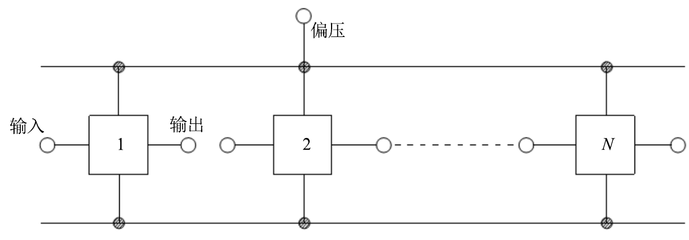

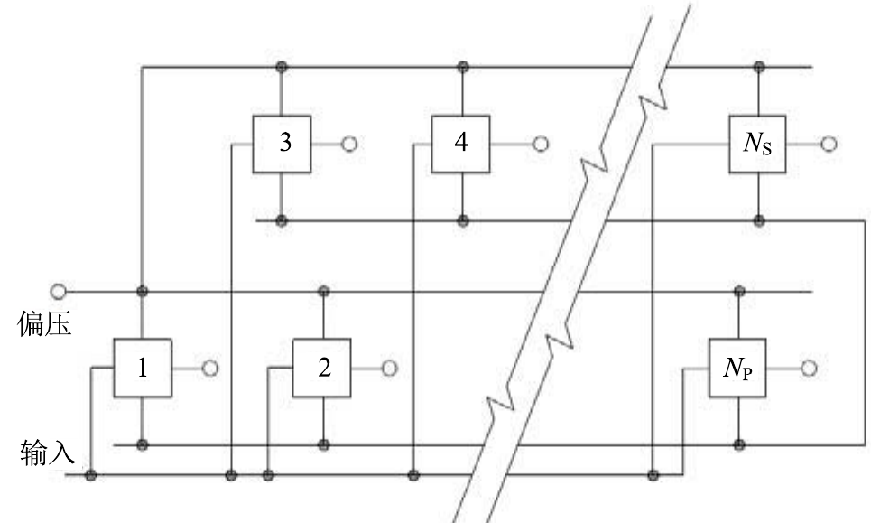

### 3.6.5 试验条件E(环形振荡器试验)

如图3所示，最后一个电路的输出端通常连接到第一个电路的输入端。这种串联会产生自由振荡，其频率由各个电路和有关布线的传输延迟确定，该频率应不低于 \(50\mathrm{Hz}\) 。在电路会引起倒相的情况下应采用奇数个电路。环路中的每个电路应加上额定的最大负载。虽然该条件提供了连续监视致命失效（即环路阻塞)的机会，但不得用它来代替中间测试(见3.4)。

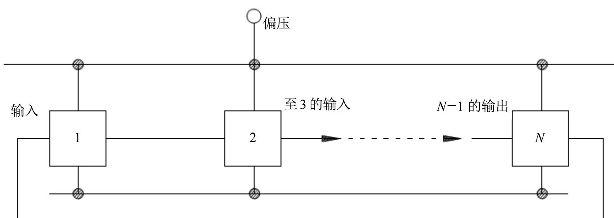

### 3.6.6 试验条件F(仅适用于B级器件)(温度加速试验)

按此试验条件，器件在远超过其最高额定温度的环境温度 \((175^{\circ}\mathrm{C} \sim 300^{\circ}\mathrm{C})\) 下进行偏置。在较高温度下，器件通常不能正常工作，因此必须特别注意选择偏置线路和条件以保证重要的电路部位得到合适的偏置，且对电路的其他部位不会产生破坏性的过应力。为了适当地选用实际偏置条件，建议把合适的器件样品放在预定的高温环境中，在每个器件引出端上测量电压和电流，以保证规定的线路和外加的电位力不会诱导出破坏性的过应力。承制方可以从表1中自行选择其替代的时间和温度，可以选用时间界限在 \(30\mathrm{h} \sim 1000\mathrm{h}\) 范围内的任何时间- 温度组合。对于采用试验条件F进行的寿命试验，应采用方法1016中3.6寿命试验基本准则，并且得到鉴定机构的特殊批准。当证实在规定电压下工作会导致过量电流通过或过量功耗时，任一或全部引出端上的外加电压可以降低到不低于规定电压的 \(50\%\) 。如果降低电压，则应按公式(1)确定寿命试验时间:式中:

\[t_{\\mathrm{a}} = \\frac{t_{0}(100\\%)}{100\\% - V\\%} \\quad (1)\]

\(t_{\mathrm{a}}\) ——调整后的总试验时间， \(\mathrm{h}\) ;

\(t_{0}\) ——原来的试验时间， \(\mathrm{h}\) ;

\(V\%\) ——最大的电压降低量在规定电压中所占的百分比。

对于具有内部过热保护的器件，在超过保护温度的温度下，即使延长试验时间也不可能得出长期工作可靠性的真实结果。对于这种器件，应在规定偏压下的几个不同环境温度中测量外壳温度，并根据这些测量数据来计算结温。工作寿命试验的环境温度应按以下原则确定，即在规定偏压下该环境温度使最坏情况下的结温比进入热保护的最低结温低 \(5^{\circ}\mathrm{C} \sim 10^{\circ}\mathrm{C}\) 。不同级别器件的试验时间由表1规定。

### 4 说明

有关的订购文件中应规定以下内容:a) 规定的预处理(适用时);

b) 若不按3.3的规定，则须规定试验温度(环境温度、结温或外壳温度);

c) 试验时间(若不按3.2的规定);

d) 试验的安装(若不是正常安装，见3.1);

e) 试验条件字母代号；

f) 中间测试和终点测试(见3.4);

g) 中间测试和终点测试(见3.4)的器件失效判据(若不采用器件规范极限值)和批接收判据；

h) 试验样本；

i) 完成终点测试的时间(若不按规定)(见3.4);

j) 适用时，采用条件F的批准及条件F的特殊最大试验额定值(见第4章b));

k) 条件F的时间- 温度条件(若不按3.6.6的规定)。

## 方法1006 间歇寿命

### 1 目的

本试验的目的是在规定的条件下测定器件的典型失效率或验证器件的质量和可靠性。本试验适用于器件受到“开”与“关”之间的电应力周期变化的应用情况，这种周期变化的电应力导致器件芯片和外壳安装表面之间应力的周期变化。

### 2 设备

见方法1005。

### 3 程序

除了周期性施加和去掉电应力之外，应按方法1005的要求对器件进行试验。规定的电输入(包括信号和偏压)应当瞬间而不是缓慢施加或去掉以完成“开”与“关”的周期变化。

### 4 说明

除方法1005的要求外，有关订购文件中应规定“开”与“关”循环的次数和持续时间。

## 方法1007 模拟寿命

### 1 目的

本试验的目的是在规定的条件下测定器件的典型失效率，或者证实器件的质量或可靠性，该规定的条件指的是温度循环、开- 关电应力和振动的组合试验条件。模拟尽可能接近实际系统的应用和环境。

### 2 设备

所需设备应按方法1005要求，试验箱应具有规定的温控能力，而且还应提供满足规定振动要求的适当设备。

### 3 程序

应按方法1005进行本试验，但温度应循环变化、振动应周期性地施加、电应力按开- 关周期性地施加。按表1的试验条件选择温度范围时，应把与被试器件有关的温升考虑进去。

### 4 说明

除方法1005的要求外，有关的订购文件还应规定以下内容:a) 试验条件字母代号(见表1);

b) 接通时间和转换时间(适用时);

c) 总接通时间。

## 方法1008.1 稳定性烘焙

### 1 目的

本试验的目的是在不施加电应力的条件下，确定高温贮存对器件的影响。本方法也可用于筛选程序或作为其他试验之前的预处理。本试验不能用来确定其他贮存条件下的失效率。为了提高参数退化试验的灵敏度或增进对与时间和温度有关的特殊失效机理的了解，可以根据对器件编序列号或在样品总量的直方图分布基础上进行终点测试和适用时的中间测试。

### 2 设备

本试验所需设备包括一台能在规定温度下恒温的温控试验箱和能进行规定测量的合适的电子仪器。

### 3 程序

应在规定的时间内把器件贮存在规定的环境试验条件中。在规定的时间开始计时之前应有足够升温时间，使被试的每个器件整体达到规定的温度。在达到规定的试验时间之前的24h(如试验时间不到250h，则为0h)到规定的试验时间之后的72h的时间间隔内，应把器件从规定的环境试验条件中移出并使之达到标准测试条件。当有规定时，应在器件从规定的环境温度移出之后的96h内完成终点测试。当有规定时(或未规定时，由承制方选择)，应进行中间测试。

应采用表1中的试验条件来规定本试验的环境试验温度。规定的试验温度是必须达到的最低实际环境温度，在试验箱的工作区内，所有器件都应处在该温度下。要做到这一点，应通过对试验箱结构、负载、控制或监测仪器的位置以及空气或试验箱的其他环境气体的流动进行必要的调整来保证。应对处于全负荷、断电状态下的试验箱进行校准，而且指示传感器应位于或调整至能反映该工作区内最低温度的位置上。除另有规定外，至少应采用试验条件C，其最短时间和最低温度按表2规定。除另有规定外，所有其他试验条件的试验时间，至少应为24h。

|  |  |  |
| --- | --- | --- |
| 最低温度 ℃ | 最短时间 h | 说明 |
| 150 | 24 | - |
| 155 | 20 | - |
| 160 | 16 | - |
| 165 | 12 | - |
| 170 | 8 | - |
| 175 | 6 | - |
| 200 | 6 | - |

### 4 说明

有关的订购文件应规定以下内容：a) 试验条件字母代号（若不是试验条件C)（见第3章）；

b) 试验时间（若不是24h）；

c) 终点测试（适用时）（见第3章）；

d) 中间测试（适用时）（见第3章）；

e) 最高试验温度额定值（适用时）。

## 方法1009.2 盐雾

### 1 目的

本试验是为了模拟海边空气对器件和封装元件影响的一个加速的腐蚀试验。

### 2 术语和定义

下列术语和定义适用于本方法。

### 2.1 腐蚀 corrosion

涂层和(或)底金属由于化学或电化学的作用而逐渐地损坏。

### 2.2 腐蚀部位 corrosion site

涂层和(或)底金属被腐蚀的部位，即腐蚀位置。

### 2.3 腐蚀生成物(淀积物) corrosion product (deposit)

腐蚀作用的结果(即锈或氧化铁、氧化镍、氧化锡等)。腐蚀生成物可能在腐蚀部位，或者由于盐液的流动或蔓延而覆盖非腐蚀区域。

### 2.4 腐蚀色斑 corrosion stain

腐蚀色斑是由腐蚀产生的半透明沉淀物。

### 2.5 气泡 blister

涂层和底金属之间的局部突起和分离。

### 2.6 针孔 pinhole

涂层中产生的小孔，它是完全贯穿涂层的一种缺陷。

### 2.7 凹坑 pitting

涂层和(或)底金属的局部腐蚀，在某一点或小区域形成空洞。

### 2.8 起皮 flaking

局部涂层分离，而使底金属显露。

### 3 设备

盐雾试验所用设备应包括:a) 带有支撑器件夹具的试验箱。该箱及其附件应采用不会与盐雾发生作用的材料(玻璃、塑料等)制造。在试验箱内，与试验样品接触的所有零件，应当用不产生电解腐蚀的材料制造。该箱应适当通风，以防止产生"高压",并保持盐雾的均匀分布。

b) 能适当防止周围环境影响的盐溶液容器。如需要按试验条件C和试验条件D(见4.6)进行长期试验的，可采用备用盐溶液容器。

c) 具有盐液雾化的能力，包括合适的喷嘴和压缩空气或者由 \(20\%\) 氧、 \(80\%\) 氮组成的混合气体(应防止诸如油和灰尘等杂质随气体进入雾化器中)。

d) 试验箱应能加热和控制。

e) 在高于试验箱温度的某温度下，保证空气潮湿的手段。

f) 空气或惰性气体干燥器。

g) 1倍\\~3倍、10倍\\~20倍和30倍\\~60倍的放大镜。

### 4 程序

### 4.1 试验箱的维护和处理

试验箱的清洗是为了保证包会对试验结果产生不良影响的所有物质清除出试验箱。使试验箱工作在(35±3)℃,用去离子水或蒸馏水进行必要的清洗。每当容器里的盐溶液用完时，就应当清洗试验箱。某些试验能在清洗之前进行，这取决于盛盐溶液的容器的大小和所规定的试验条件(见4.6)。当需要做长时间试验(见4.6的试验条件C和试验条件D)时，盛盐溶液的容器可采用备用的容器来补充，以便试验不中断。清洗后，试验箱开始工作时，盐溶液应补满该容器，并且应对试验箱进行适当地控制，使其温度稳定(见4.5)。如果试验箱中断工作超过一个星期，即使还留有盐溶液，也应废弃。而且试验箱在重新开始工作之前应当进行清洗。如果盐溶液的pH值和浓度保持在4.2中规定的范围之内，允许试验箱不连续工作。

### 4.2 盐溶液

为了达到4.5所要求的淀积速率，盐溶液应为浓度 \(0.5\% \sim 3.0\%\) (重量百分比)的去离子水或蒸馏水溶液。所用的盐应为氯化钠，其碘化钠的重量百分比不得多于 \(0.1\%\) ，且总杂质的重量百分比不得多于 \(0.3\%\) 。在 \((35\pm 3)^{\circ}\mathrm{C}\) 下测量时，盐溶液的pH值应在 \(6.5 \sim 7.2\) 之间。只能用化学纯或以上的盐酸或氢氧化钠(稀溶液)来调整pH值。

### 4.3 引线的预处理

除另有规定外，试验样品不应进行预处理。当有要求时(见5c)),样品进行试验之前，器件引线应按方法2004试验条件 \(\mathrm{B}_{1}\) 的要求，承受弯曲应力的初始处理。如果进行试验的样品已经作为其他试验的一部分进行过所要求的初始处理，那么，其引线无需重新弯曲。

### 4.4 试验样品的安置

样品的安置，应使它们彼此不接触，彼此不遮挡，能自由地接受盐雾作用，腐蚀生成物和凝聚物不会从一个样品落到另一个样品上。样品应按下述方位安置在固定的夹具上(有机玻璃棒、尼龙或玻璃纤维筛、尼龙绳等)。

a) 引线固定于封装侧面或引线从封装侧面引出的双列封装(如侧面钎焊双列封装和陶瓷双列封装):盖板向上，偏离垂直方向 \(15^{\circ} \sim 45^{\circ}\) 。将有引线的一个封装侧面向上，偏离垂直方向大于或等于 \(15^{\circ}\) (见图1a))。

b) 引线固定于封装底部(与盖板相对的那一面)或引线从底部引出的封装(如金属圆形封装):盖板偏离垂直方向 \(15^{\circ} \sim 45^{\circ}\) 。试验时一半样品应盖板向上；剩下一半，引线向上(见图1b))。对于在盖板同一侧固定或引出引线的封装，只需按一个方向放置(盖板和引线向上)。

c) 引线固定于封装某一面或从某一面引出，且与盖板平行的封装(如扁平封装):盖板偏离垂直方向 \(15^{\circ} \sim 45^{\circ}\) 。将有引线的封装面向上，且偏离垂直方向大于或等于 \(15^{\circ}\) 。对金属壳封装，试验时一半样品盖板向上。剩下的样品底座向上。其他封装都应盖板向上做试验(见图1c))。

d) 无引线和有引线片式载体：盖板偏离垂直方向 \(15^{\circ} \sim 45^{\circ}\) ，试验时一半样品盖板向上，剩余的样品盖板向下(见图1d))。

e) 扁平样品(如仅对盖板和仅对引线框架):偏离垂直方向 \(15^{\circ} \sim 45^{\circ}\) 。

对于要求进行两种取向的试验，应把规定的样品数分成两等份(或尽可能接近一半)。在所有的情况下，对所有的封装表面按4.8进行试验后的检查。

对开有窗口的紫外线可擦器件进行试验时，需采取保护措施，以防止光感应电动势产生电解作用。

### 4.5 试验箱的控制

按4.1的要求对试验箱进行处理之后，温度至少 \(35^{\circ}\mathrm{C}\) 的盐雾在规定的试验时间内(见4.6)流过试验箱。试验箱内暴露区域的温度应保持在 \((35\pm 3)^{\circ}\mathrm{C}\) 。盐雾的浓度和速度应调节到使得盐在试验区域内的淀积速率在 \((20 \sim 50)\mathrm{g} / (\mathrm{m}^{2} \cdot \mathrm{d})\) 之间。盐的淀积速率可以用体积的、重量的或其他方法来测定(由用户任意选择)。在试验箱底部收集的盐液应废弃。

### 4.6 试验时间

应从表1规定的试验条件中确定试验的最短时间。除另有规定外，应采用试验条件A。

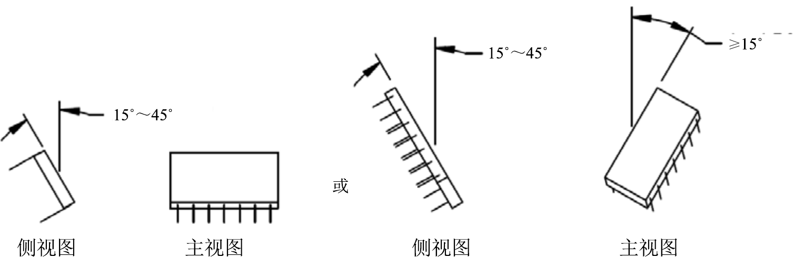

a) 引线固定于封装侧面或引线从封装侧面引出的双列封装(如侧面钎焊双列封装和陶瓷双列封装)

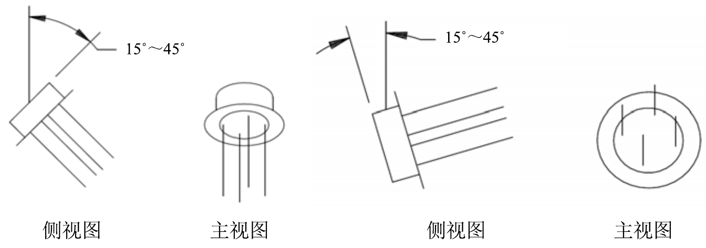

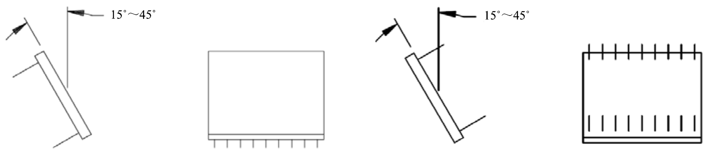

b) 引线固定于封装底部(与盖板相对的那一面)或引线从底部引出的封装(如金属圆形封装、金属平板封装和针栅阵列封装)

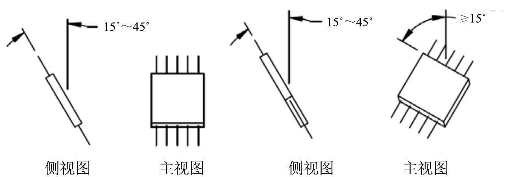

注：如果是金属封装，一半样品盖板向上，另一半样品底座向上。

c) 引线固定于封装某一面或从某一面引出且平行于盖板的封装(如扁平封装)

### 图1 试验样品取向的示例

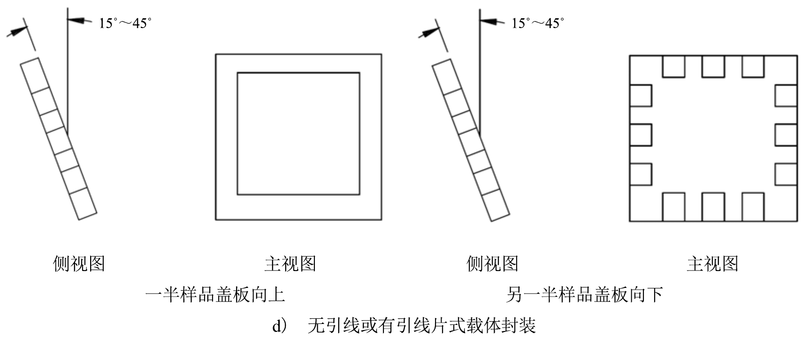

### 4.7 样品检验的准备工作

完成试验后，试验样品应立即用自由流动的去离子水(水温不得超过 \(38^{\circ}\mathrm{C}\) )至少冲洗5min，以便除去样品表面沉淀的盐。然后样品用空气或惰性气体吹干，进行下述检查。

### 4.8 失效判据

### 4.8.1 通则

除 \(4.8.2\mathrm{b}\) 和 \(4.8.2\mathrm{c}\) 另有规定外，所有检查都应在放大10倍 \(\sim 20\) 倍的情况下进行。其中：a) 腐蚀色斑不应认为是4.8.2a)中所指的缺陷；

b) 由引线腐蚀产生的淀积在引线以外部位的腐蚀生成物，不应认为是4.8.2a)中所指的缺陷；

c) 引线端头的腐蚀和由此腐蚀产生的腐蚀生成物，不应判为不合格；

d) 若由于设计或几何形状尺寸(例如针栅阵列封装的引线底部或陶瓷双列封装的钎焊部分)不能按 \(4.8.2\mathrm{b}\) 作进一步试验的引线，应根据4.8.2a)失效判据进行判定。

### 4.8.2 带有表面镀涂的产品

器件出现以下情况则不能接收：a) 腐蚀缺陷面积超过除引线外的任何封装零件(例如盖板、盖帽或外壳)镀涂或底金属面积的 \(5\%\) 。测量中要计入的腐蚀缺陷有：凹坑、气泡、起皮和腐蚀生成物。腐蚀缺陷面积由以下方法确定，用已知缺陷面积的卡片或照片(见图2)进行比较，用网格或类似的测量器具或镜像分析仪直接测量。

b) 引线缺损、断裂或部分分离。此外，若引线出现针孔、凹坑、气泡、起皮、腐蚀生成物完全跨越引线，或玻璃封装中出现针孔、凹坑、气泡、起皮、腐蚀生成物或腐蚀色斑的引线，应进一步做如下试验：在引线缺陷处弯曲 \(90^{\circ}\) ，使拉伸应力加到缺陷处。若出现引线的断裂或底层金属的破裂面超过引线横截面积的 \(50\%\) ，应拒收。若有多处出现缺陷，应在腐蚀最严重处进行弯曲。对10根以上引线出现缺陷的封装，只需对最多10根腐蚀最严重引线进行弯曲。应放大30倍 \(\sim 60\) 倍进行破裂情况检查。

c) 规定标志的全部或部分脱落、褪色、弄脏、模糊或不可辨认。该检查应在室内正常照明下放大1倍 \(\sim 3\) 倍进行。

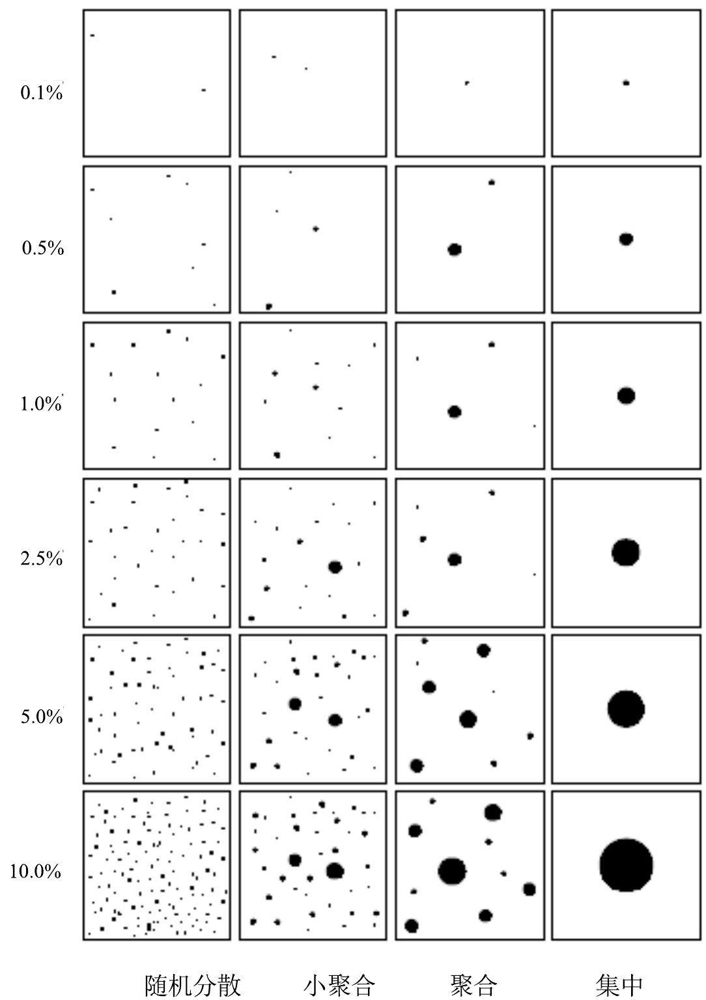

### 4.8.3 封装元件

作为来料检查，或在封装装配之前，作为一种选择性的质量控制，或作为一种要求的试验(见5d))时，对封装元件或部分组装的封装壳体进行本试验，呈现下列现象的元件不得接收：

a) 腐蚀缺陷面积超过盖板镀涂面积或底金属面积的 \(1.0\%\) ，或超过除引线以外其他任何封装零件(例如外壳)镀涂面积或底金属面积的 \(2.5\%\) 。器件制造完成后不会暴露于周围环境的镀涂或底金属层上的腐蚀不必考虑。应根据4.8.2a)程序进行本项检查。

b) 其引线镀涂根据4.8.2b)被拒收。

### 5 说明

有关的订购文件应规定以下内容：a) 试验时间(若不是试验条件A)(见4.6)；b) 适用时，试验后的测试和检查(除目检外)(见4.8)；c) 预处理的要求(若需要)和程序(若不按4.3的规定)；d) 适用时，封装元件的来料检查或部分组装的封装壳体检查的要求(见4.8.3)。

## 方法1010.1 温度循环

### 1 目的

本试验的目的是测定器件承受极端高温和极端低温的能力，以及极端高温与极端低温交替变化对器件的影响。

### 2 术语和定义

下列术语和定义适用于本方法。

### 2.1 负载 load

受试样品和试验中固定这些样品的夹具。最大负载应由载有规定样品的最坏情况负载温度来确定。当负载减弱空气流通量时，用单个负载来模拟实际负载是不合适的。最大负载必须满足规定的条件。

### 2.2 监测用传感器 monitoring sensor

安放于合适位置的温度传感器，能指示与最坏情况样品位置相同的温度。最坏情况样品位置由最坏情况负载温度的定期表征来确定。

### 2.3 最坏情况负载温度 worst case load temperature

插入负载中心的热电偶所指示的规定样品或等效质量块的温度。这些样品温度指示仪应放在负载的中央和每一个角落。应定期确定最坏情况负载温度(即最后达到试验温度的位置)。

### 2.4 工作区 working zone

试验箱内负载温度控制在表1规定范围内的区域。

### 2.5 样品 specimen

接受试验的器件或个体。

### 2.6 转换时间 transfer time

负载从一个极端温度开始转移到另一个极端温度所经历的时间。

### 2.7 最大负载 maximum load

对应于最坏情况负载温度满足时间参数要求时的最大负载。

### 2.8 停留时间 dwell time

从负载进入一个极端温度到开始转移到另一个极端温度之间的时间。

### 3 设备

所用试验箱在加载最大负荷时，应能为工作区提供和控制规定的温度。热容量和空气的流量必须能使工作区和负载满足规定的试验条件和计时要求(见4.2)。在试验期间，用温度指示器或自动记录仪来连续监视最坏情况的负载温度。对样品的直接热传导应减至最小。

### 4 程序

### 4.1 通则

样品的安放位置不应妨碍样品四周空气的流动。当需要特殊地安置样品时，应作具体规定。样品应在规定条件下连续完成规定的循环次数。采用试验条件C至少循环10次(见图1)。一次循环包括第1步至第2步或适用的试验条件，必须无中断地完成，才能算作一次循环。在完成规定的试验循环总次数期间，为了进行器件批的加载或卸载，或由于电源或设备故障，允许中断试验。然而，如果中断次数超过规定的循环总次数的 \(10\%\) 时，不管任何理由，试验必须重新从头开始进行。

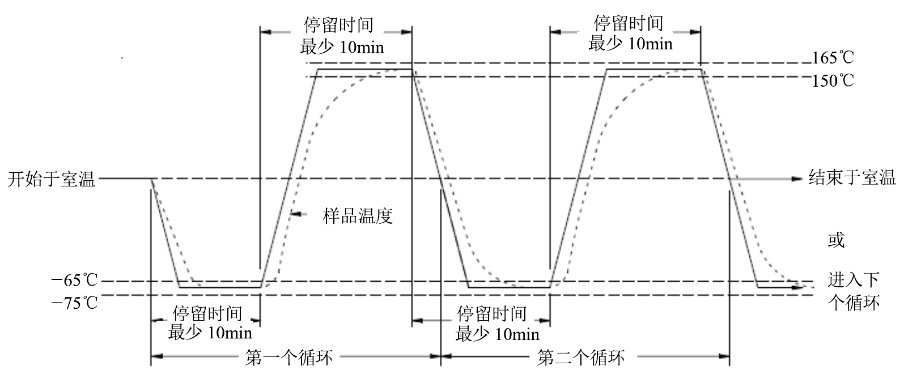

### 4.2 计时

从热到冷或从冷到热的转换时间不得超过 \(1\mathrm{min}\) (多箱法)。当最坏情况负载温度处于表1规定的极值范围之内时，可以转移负载，但停留时间不得少于 \(10\mathrm{min}\) ，负载应在 \(15\mathrm{min}\) (一箱法 \(16\mathrm{min}\) )内达到规定的温度。

### 4.3 检查

最后一次循环完成之后，不放大或放大不超过3倍对样品标志进行检查，放大10倍\\~20倍对外壳、引线或封口进行目检(当本试验用于 \(100\%\) 的筛选时至少应放大1.5倍进行检查)。本项检查和任何补充规定的测试及检查，都应在最后一次循环完成之后进行，或者在包括本试验的分组试验完成时进行。

### 4.4 失效判据

试验后，任何规定的终点测试或检查(见第5章d))不合格，外壳、引线或封口有缺陷或损坏迹象，或标志模糊，均应视为失效。试验期间，由于夹具或操作不当造成标志的损坏，不应影响器件的接收。

### 5 说明

有关的订购文件应规定以下内容:

a) 特殊的安装(适用时)(见4.1);

b) 试验条件字母代号(如不是条件C)(见4.1);

c) 试验的循环次数(如不是10次循环)(见4.1);

d) 终点测试和检查要求(见4.3)。例如：终点电测试、密封试验(方法1014)或其他接收判据。

## 方法1011.1 热冲击

### 1 目的

本试验的目的是确定器件在遭到温度剧变时的抵抗能力，以及温度剧变产生的作用。

### 2 术语和定义

下列术语和定义适用于本方法。

### 2.1 循环 cycle

一个循环即：从环境室温开始，进行第1步试验，然后进行第2步试验，或改为先进行第2步再进行第1步，再回到环境室温，中间没有间断。

### 2.2 停留时间 dwell time

负载浸入试验槽中的时间。

### 2.3 负载 load

受试样品和试验中固定这些样品的夹具。

### 2.4 最大负载 maximum load

在规定时间内，使试验槽保持规定温度的前提下，在其中能安放的样品和夹具的最大质量。

### 2.5 转换时间 transfer time

负载从一个试验槽中取出，浸入到另一个试验槽中所经过的时间。

### 2.6 最坏情况负载温度 worst case load temperature

负载中心位置处器件的本体温度。

### 2.7 监测用传感器 monitoring sensor

安放于合适位置并经过校准的温度传感器，能指示与最坏情况样品位置相同的温度。最坏情况样品位置由最坏情况负载温度的定期表征来确定。

### 3 设备

所用的试验槽在加载最大负荷时，应能为工作区提供并控制规定的温度。热容量和液体流量必须能使工作区和负载满足规定的试验条件和计时要求（见4.2）。在试验期间，用指示仪或记录仪显示监测传感器的读数，来连续监视最坏情况负载温度。按验证试验槽工作特性的要求，验证最大负载条件和配置下的最坏情况负载温度。用于试验条件B和试验条件C的全氟碳化合物应满足表1的规定。

### 4 程序

### 4.1 通则

样品应放于试验槽中的合适位置，使液体在样品周围的流动不应受到阻碍。然后根据表2的规定，使负载经受试验条件B或表2中规定的其他试验条件（见第5章b））下的15次循环。在完成规定的试验循环总次数期间，为了进行器件批的加载或卸载，或由于电源或设备故障，允许中断试验。然而，对任何给定的试验，若中断次数超过规定循环总次数的10％时，试验必须重新从头开始。

<table><tr><td colspan="2">试验条件</td><td>A</td><td>B</td><td>C</td></tr><tr><td rowspan="2">第1 步 试验</td><td>温度℃</td><td>\(100_{-2}^{+10}\)</td><td>\(125_{-0}^{+10}\)</td><td>\(150_{-0}^{+10}\)</td></tr><tr><td>推荐液体</td><td>水b</td><td>全氟碳化合物c</td><td>全氟碳化合物c</td></tr><tr><td rowspan="2">第2 步 试验</td><td>温度℃</td><td>\(0_{-10}^{+2}\)</td><td>\(-55_{-10}^{+0}\)</td><td>\(-65_{-10}^{+0}\)</td></tr><tr><td>推荐液体</td><td>水b</td><td>全氟碳化合物c</td><td>全氟碳化合物c</td></tr><tr><td colspan="5">a 乙二醇不能用作热冲击试验用的液体。 b 在该温度范围内，水是可采用的液体，但在使用前要确定它的化学适用性。考虑到海拔高度的因素，当采用水作为试验条件A 的液体，若达不到所规定的温度容差，可采用下面的试验条件代替： a）温度：\(100_{-6}^{+0}\)℃，\(0_{-6}^{+6}\)℃； b）循环次数增加到20 次。 c 全氟碳化合物不得含有氯或氢。</td></tr></table>

### 4.2 计时

从热到冷或从冷到热的总转换时间不得超过10s。当最坏情况负载温度处于表2规定的极值范围内时，可以转换负载。负载应在5min内达到规定的温度，但停留时间不得少于2min。

### 4.3 检查

最后一次循环完成之后，不放大或放大不超过3倍对样品标志进行外观检查，放大10倍~20倍对外壳、引线或封口进行目检（当本试验用于100％的筛选时应至少放大1.5倍进行检查）。本项检查和任何补充规定的测试及检查，都应在最后一次循环完成之后进行，或者在包括本试验的某试验组或分组完成时进行。

### 4.4 失效判据

试验后，任何规定的终点测试或检查（第5章d））不合格，外壳、引线或封口有缺陷或损坏迹象，或标志模糊，均应视为失效。试验期间，由于夹具或操作不当造成标志的损坏，不应影响器件的接收。

### 5 说明

有关的订购文件应规定以下内容：a）特殊的安装（适用时）；

b）试验条件字母代号（如不是试验条件B)（见4.1)；

c）试验的循环次数（如不是15次循环）（见4.1)；

d）终点测试和检验。例如：终点电测试、密封试验（方法1014）或其他接收判据。

## 方法1012.1 热性能

### 1 目的

本试验的目的是测定器件的热性能，包括器件的结温、热阻、壳温和安装表面温度，以及热响应时间。

### 2 术语和定义

下列术语和定义适用于本方法。

### 2.1 外壳温度 case temperature

\(T_{\mathrm{C}}\)

在内部装有芯片的封装壳体上规定参考点的温度。

### 2.2 安装表面的温度 mounting surface temperature

\(T_{\mathrm{M}}\)

器件与散热器安装界面(或主要散热表面)上规定参考点的温度。

### 2.3 结温 junction temperature

\(T_{\mathrm{J}}\)

器件中产生主要热量的半导体结的温度。 \(T_{\mathrm{J}(\mathrm{峰值})}\) 是非均匀电流分布下工作结的峰值温度， \(T_{\mathrm{J}(\mathrm{平均})}\) 是非均匀电流分布下工作结的平均温度， \(T_{\mathrm{J}(\mathrm{区域})}\) 是最接近工作结的六个等效半径处的温度(等效半径是面积与结界面区域面积相同的等效圆的半径)。通常， \(T_{\mathrm{J}(\mathrm{区域})} \leq T_{\mathrm{J}(\mathrm{平均})} \leq T_{\mathrm{J}(\mathrm{峰值})}\) (即使工作结中的电流分布是均匀的)。

### 2.4 热阻(结到规定参考点) thermal resistance (junction to specified reference point)

\(R_{\mathrm{th}(\mathrm{J} - \mathrm{R})}\)

结至封装壳体上规定参考点的温差与功耗 \((P_{\mathrm{D}})\) 之比。

### 2.5 功耗 power dissipation

\(P_{\mathrm{D}}\)

功耗有两类：单个半导体结消耗的功率 \(P_{\mathrm{D}(\mathrm{单结})}\) ，或整个封装器件消耗的功率 \(P_{\mathrm{D}(\mathrm{封装})}\) 。

### 2.6 热响应时间 thermal response time

\(t_{\mathrm{JR}}\)

结温变化达到最终值 \(90\%\) 所需要的时间。结温变化是在器件规定参考点温度保持不变的情况下，由于功耗的阶跃变化造成的。为了与测量结温的特定方式相一致，热响应时间也分为 \(t_{\mathrm{JR}(\mathrm{峰值})}\) 、 \(t_{\mathrm{JR}(\mathrm{平均})}\) 和 \(t_{\mathrm{JR}(\mathrm{区域})}\) 。

### 2.7 温敏参数 temperature sensitive parameter (TSP)

被测结与温度相关的电特性，将其随温度变化的关系进行校准后，可用来测量结温。

### 3 设备

### 3.1 热电偶

热电偶材料应是铜- 康铜(T型)或等效的材料，温度范围应为 \(- 180^{\circ}\mathrm{C} \sim 370^{\circ}\mathrm{C}\) 。热电偶丝直径不得大于 \(0.25\mathrm{mm}\) 。热电偶结点应熔焊成小珠，不得用低温焊或绞合。热电偶和相应测量系统的准确度应为 \(\pm 0.5^{\circ}\mathrm{C}\) 。

### 3.2 温箱或散热器

温箱或散热器应能使规定参考点恒温且可控，其控制准确度应能在预置(测量)温度的 \(\pm 0.5^{\circ}\mathrm{C}\) 内。用于安装被试器件的典型散热器如图1所示。散热器是水冷的，其上装有热电偶传感器，用以监测出入水的温度，如图1a)所示。在主散热器的顶端表面上紧固有散热适配器，如图1b)所示，它具有特殊的几何形状以便安装特殊尺寸的封装壳体，例如扁平式、双列直插式及金属圆形等封装外壳。散热适配器为散热器和封装壳体之间提供了一个高效可重复的"接口"。散热适配器的温度是通过伸入散热适配器底部靠近封装壳体的热电偶来测量的。散热适配器还包括插座或其他连接装置。采用扁平封装的散热适配器时，将封装壳体放入专门开槽的印刷电路板(PCB)中。使器件引线与印刷电路板的相应点接触，再用拉丝钳把封装壳体与印刷电路板夹紧。双列直插式或轴向引线式的封装壳体装入通常的插座中。

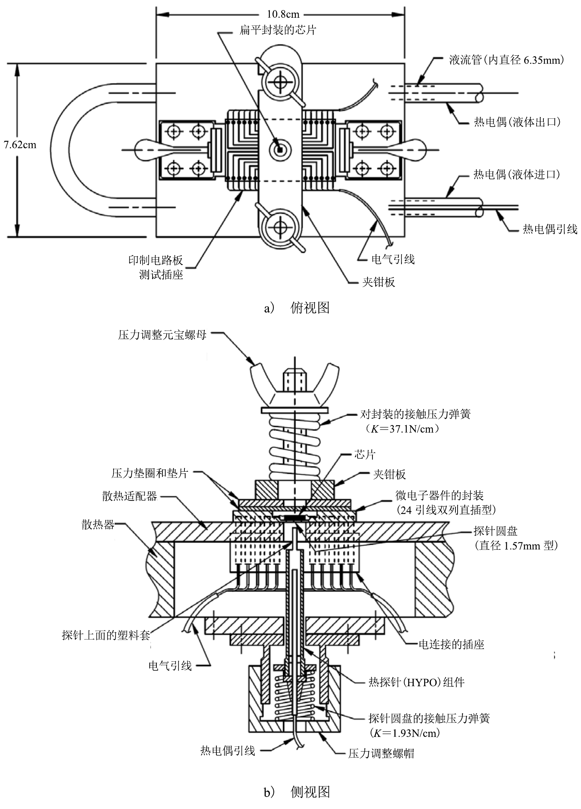

### 3.3 可控电源和进行测量所需的电学设备

用于测量温敏参数的电学设备应能测量 \(0.5\mathrm{mV}\) 的电压变化。为此目的，应配备适用的采样/保持装置或示波器。

### 3.4 红外微辐射仪

红外微辐射仪应能测量 \(1\mu \mathrm{m}\sim 6\mu \mathrm{m}\) 范围内的辐射；在其半功率点上，应能以直径小于 \(40\mu \mathrm{m}\) 的空间分辨率检测相关区域发出的辐射；在 \(60^{\circ}\mathrm{C}\) 时，温度分辨率(可分辨出的温度变化)应为 \(0.5^{\circ}\mathrm{C}\) 。

### 3.5 热探针组件

热探针组件如图1b)所示。通过调整压力调整螺母，使探针顶端的圆盘以预定的压力和封装壳体的底部接触。为了达到可靠的热接触，该界面应涂上硅脂(约 \(25\mu \mathrm{m}\sim 50\mu \mathrm{m}\) 厚)。

### 4 程序

### 4.1 规定参考点温度 \((T_{\mathrm{C}}\) 或 \(T_{\mathrm{M}}\) )的直接测量

### 4.1.1 通则

为了测量器件的热阻或热响应时间，应在可以进行测量的封装壳体的最高温度位置处作为规定参考点，进行温度测量。通常，这个温度应在直接紧靠芯片下面的载体表面上测量。位置的选择应尽可能靠近芯片，并能代表芯片至散热器的主要热通道上的温度。为了便于测量，可以变更测量表面，但这种变更不应影响封装壳体内原始热量传导路线，因此封装壳体内的热阻变化不会超过几个百分点。

### 4.1.2 外壳温度 \((T_{\mathrm{C}})\)

被试器件应安装在温度可控的散热器上，使外壳温度保持在规定值上。热电偶应尽可能紧贴在芯片或基板中心下面的器件外壳位置上，为此可采用导热环的环氧树脂。通常，对于自然冷却的器件，外壳温度应在外壳最高温度点上测量。热电偶引线(直到熔焊的热电偶头)应与外壳绝缘。热电偶头应与被试器件的外壳直接机械接触。

### 4.1.3 安装表面温度 \((T_{\mathrm{M}})\)

安装表面温度应在外壳的主散热面下方直接测量。它是用热电偶在(或靠近)散热器的安装表面的位置上测量的。典型的安装布局如图2所示。安装底座的铜表面应镀镍以防止氧化。

安装底座应钻一个热电偶孔，以便热电偶头能与封装外壳下面的待测区直接接触。建议把热电偶插入安装底座时，用导热焊接剂(或低温焊料)将其可靠地固定，特别要注意的是使热电偶头的周围尽量没有间隙。在安装底座和被试器件界面上应使用导热化合物(或焊接剂)。

### 4.2 热阻(结到规定参考点) \((R_{\mathrm{th}(J - R)})\)

### 4.2.1 一般考虑

半导体器件的热阻是衡量半导体器件的载体、封装壳体及其组装工艺在提供散逸半导体结热量的能力。当外壳温度、功耗和结温已知时，器件的热阻可以用计算方法得到。应选择芯片上功耗密度 \((\mathrm{W / mm}^2)\) 最大的结进行测量，因为，一般来说，该结是在芯片上温度最高的位置。如果热电偶不能靠近该结而靠近了另一个结进行测量，那么，就不能确保测得的是芯片上的最高温度。在这种情况下，应进行直接的结温测量。

当按下述测量方法测得结至外壳的温度差达到或接近其最终值的 \(99\%\) 时，可以认为封装壳体已达到热平衡。此时温度差的变化率小于公式(1)计算值:式中:

\(t\) ——施加功耗增量后的时间。当达到稳定要求时，该时间一般小于 \(1\mathrm{min}\) 。

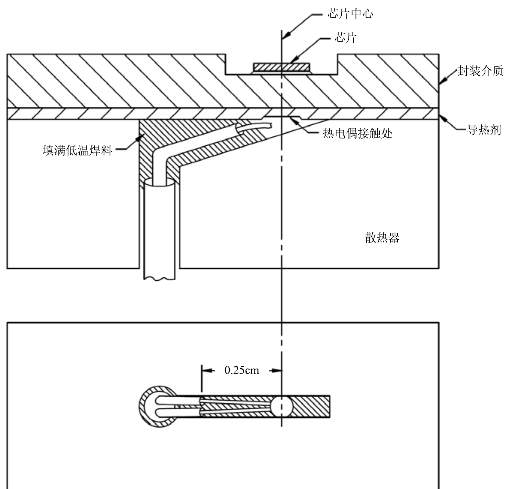

### 4.2.2 直接测量结温以确定 \(R_{\mathrm{th}\mathrm{J - R}}\)

采用红外微辐射仪可以直接测量半导体芯片内部热限制单元的结温。首先应去掉封装壳体的帽或顶盖，以暴露出有源芯片或器件。除非芯片太大并且至片式载体的通道导热性太差，否则无需在腔内镀涂任何红外透射材料。应参考该芯片的坐标系统以确定被测结的位置，从而保证芯片镀涂后定位正确。芯片的有源区域可均匀涂上一薄层 \((25\mu \mathrm{m}\sim 50\mu \mathrm{m})\) 已知高辐射系数 \((c > 0.8)\) ，又是低导热的材料，如黑漆。然后把封装壳体安装在温度可控的散热器上，并且使外壳温度或安装表面温度稳定在规定值上。接着，应使被试器件工作于它的额定功耗上，使红外显微镜的十字标线对准该结，并轻轻地前后扫描，使得在某位置上辐射测量值最大。而后应记录下该辐射测量值和片式载体温度。断开被试器件电源，并使片式载体回复到规定的外壳温度或安装表面温度。而后，利用测量的该结区域上的辐射率，将工作结区域的辐射转换成温度。

注：这种方法是假设涂层材料的辐射率不随温度显著变化。如果该结果精确且可重复，表示这种假设应当是成立的。

由于芯片热学特性的改变，涂层材料可能减少峰值结温。

如果未具体规定被测结，按上述方法进行测量时，红外显微镜十字标线应对准芯片的全部有源区域扫描，以便找到最高结温区并测其最大辐射值。

如果本方法用来测量 \(T_{\mathrm{J}(\mathrm{峰值})}\) ，那么，结区的最小宽度或长度应比物镜的半功率点直径大5倍，比芯片表面涂层厚度大5倍。如果结单元直径是红外显微镜物镜半功率点直径的1倍 \(\sim 5\) 倍之间，则测量的是平均结温 \(T_{\mathrm{J}(\mathrm{平均})}\) ，这时， \\(T_{\\mathrm{J}(\\mathrm{区域})}< T_{\\mathrm{J}(\\mathrm{平均})}< T_{\\mathrm{J}(\\mathrm{峰值})}\\) 。

测量过程应记录下列数据：a) 峰值结温 \(T_{\mathrm{J}(\mathrm{峰值})}\) 或平均结温 \(T_{\mathrm{J}(\mathrm{平均})}\) ；b) 外壳温度 \(T_{\mathrm{C}}\) 或安装表面温度 \(T_{\mathrm{M}}\) (通常是 \(60^{\circ}\mathrm{C} \pm 0.5^{\circ}\mathrm{C}\) )；c) 封装器件内的功耗 \(P_{\mathrm{D}(\mathrm{封装})}\) ；

d) 测量点的参考温度；

e) 安装布局；

f) 红外显微镜的半功率点尺寸；

g) 控制辐射的涂层厚度(仅对 \(T_{\mathrm{J}(\mathrm{平均})}\) 测量);

h) 被测结的最小宽度或长度(仅对 \(T_{\mathrm{J}(\mathrm{平均})}\) 测量)。

### 4.2.3 间接测量结温以确定 \(R_{\mathrm{thJ - R}}\)

### 4.2.3.1 一般考虑

本试验的目的是用芯片上特定半导体单元给出器件的结温来确定集成电路的热阻。为了获得实际平均工作结温 \(T_{\mathrm{J}(\mathrm{平均})}\) ，应给封装壳体内的整个芯片或每个芯片通电，以提供合适的内部温度分布。测量4.2.1所述的其他参数，仅需对用于测温的结通电。在测量结温时，应切断芯片的加热电流而保持结的校正电流稳定。如果假定校正电流不会影响电路工作，那么当切断电源时，校正电流就必须接通。

为了计算热阻，可用温敏参数来指示半导体器件的平均结温。所测结温仅仅指出紧靠测热单元附近的温度。这样，对于加热电流是恒定的，如果用于测温的结也有功耗，则对于特定的结， \(T_{\mathrm{J}(\mathrm{平均})}\) 近似等于 \(T_{\mathrm{J}(\mathrm{峰值})}\) 。如果加热电流不是恒定的，则测得的将是 \(T_{\mathrm{J}(\mathrm{平均})}\) 。如果用于测温的结是紧靠功耗单元位置，则测得的将是 \(T_{\mathrm{J}(\mathrm{区域})}\) 。当测量 \(T_{\mathrm{J}(\mathrm{区域})}\) 时，加热电源不必关闭。

一般用于间接测量结温的温敏电参数是二极管正向电压、双极晶体管的发射极一基极正向电压和集电极一基极正向电压。当因为制造工艺原因，而不适宜测量有源结电压时，可用其他合适的温敏参数来间接测量结温。例如，P- N 结隔离的单片集成电路中的衬底二极管(参数)可以用作温敏参数去测量 \(T_{\mathrm{J}(\mathrm{区域})}\) 。在这种特殊的情况下，在衬底二极管上加正向偏置的同时，加热电源必须切断。

### 4.2.3.2 测量 \(T_{\mathrm{J}(\mathrm{平均})}\) 的开关方法

本测量采用下列符号:

\(I_{\mathrm{M}}\) : 测量电流 \((\mathrm{mA})\) ；

\(V_{\mathrm{MD}}\) : 在施加 \(P_{\mathrm{D}}\) 的相应结温下，测量电流为 \(I_{\mathrm{M}}\) 时测得的温敏参数值 \((\mathrm{mV})\) ；

\(T_{\mathrm{MC}}\) : 在参考点上测得的校准温度(℃);

\(V_{\mathrm{MC}}\) : 在规定的 \(T_{\mathrm{MC}}\) 值时测量电流为 \(I_{\mathrm{M}}\) 时测得的温敏参数值 \((\mathrm{mV})\) 。

采用结正向电压作温敏参数的 \(T_{\mathrm{J}(\mathrm{平均})}\) 测量，应按下列步骤进行:步骤1:测量温敏参数的温度系数(校准):在烘箱内或在温度可控的散热器上对被试器件进行外部加热，规定恒定的测量电流 \(I_{\mathrm{M}}\) 和集电极电压。通过测量温敏参数与参考点温度的关系，得出温敏参数的温度系数。规定参考点被校准的温度范围应不少于施加功率试验(见步骤2)中所涉及的温度范围。通常，选择的测量电流使得在感兴趣的范围内，随着温度的增加，温敏参数线性地减少，并且在测量期间内部产生的热量可以忽略不计。测量温敏参数时，根据被试器件的额定条件和工作条件，通常采用的测量电流范围为 \(0.05\mathrm{mA}\sim 5\mathrm{mA}\) 。在本试验中采用的具体测量电流和集电极电压的情况下，温敏参数温度系数值 \((V_{\mathrm{MC}} / T_{\mathrm{MC}})\) 可从校准曲线 \((V_{\mathrm{MC}}\) 与 \(T_{\mathrm{MC}}\) 的关系曲线)中计算得到。

步骤2:施加功率的试验：施加功率的试验分两部分进行。两部分试验的规定参考点温度均应保持在固定的预置值上。首先进行测量的是温敏参数 \(V_{\mathrm{MC}}\) ，它是在校准期间所用的测量电流 \(I_{\mathrm{M}}\) 和集电极电压下测量得到的。而后用占空系数不少于 \(99\%\) 的加热功率间断地施加到被测量的器件上。应采用在校准期间所用的测量电流 \(I_{\mathrm{M}}\) 和集电极电压(见步骤1),在加热脉冲间隔(小于或等于 \(100\mu \mathrm{s}\) )的时间内测量温敏参数 \(V_{\mathrm{MD}}\) 。

由于某些半导体单元的温度在去掉加热电源和测温敏参数之间的时间里会降低，所以要将 \(V_{\mathrm{MD}}\) 回推到加热电源终止时刻的值。对于冷却开始后的前 \(100\mu \mathrm{s}\) ，可用公式(2)计算:式中:

\(V_{\mathrm{MD}}(t = 0)\) ——外推到加热功率终止时刻的温敏参数， \(\mathrm{mV}\) ;

\(t\) ——加热功率终止后的延迟时间， \(\mu \mathrm{s}\) ;

\(V_{\mathrm{MD1}}\) —— \(t = t_{1}\) 时刻的温敏参数， \(\mathrm{mV}\) ;

\(V_{\mathrm{MD2}}\) —— \\(t = t_{2}< t_{1}\\) 时刻的温敏参数， \(\mathrm{mV}\) 。

如果在线性坐标纸上绘制冷却开始后的前 \(100\mu \mathrm{s}\) 的 \(V_{\mathrm{MD}}(t)\) 与 \(t^{1 / 2}\) 关系曲线，绘出的将是一条直线(非热开关瞬变占优势的初始部分除外)。 \(t_{2}\) 是可进行温敏参数测量的最短时间，它由 \(V_{\mathrm{MD}}(t)\) 与 \(t^{1 / 2}\) 冷却关系曲线上的线性部位确定。 \(t_{1}\) 至少应等于 \(t_{2} + 25\mu \mathrm{s}\) ，但应小于 \(100\mu \mathrm{s}\) 。对多数据件而言，可测量温敏参数之前的延迟时间范围为 \(1\mu \mathrm{s}\sim 50\mu \mathrm{s}\) 。对于作为敏感器件的半导体(结)单元，若直径大于或等于 \(0.2\mathrm{mm}\) ，延迟时间超出 \(1\mu \mathrm{s}\sim 50\mu \mathrm{s}\) 范围，这个外推方法是正确的。

由于采用 \(V_{\mathrm{MD2}}\) 代替外推值 \(V_{\mathrm{MD}}(t = 0)\) 而引起热阻计算误差超过 \(5\%\) 时，应采用外推的 \(V_{\mathrm{MD}}\) 值来计算平均结温。

加热功率 \(P_{\mathrm{D}}\) 的选择应使得计算的结与规定参考点之间的温差(由 \(V_{\mathrm{MD2}}\) 的测量)不小于 \(20^{\circ}\mathrm{C}\) 。在施加功率的试验中，应记录 \(V_{\mathrm{MD}}\) 、 \(V_{\mathrm{MC}}\) 和 \(P_{\mathrm{D}}\) 值。

应记录和计算下列数据:a) 温敏电参数，即 \(V_{\mathrm{F}}\) ， \(V_{\mathrm{EB}}\) (仅发射极开关), \(V_{\mathrm{FB}}\) (发射极和集电极开关), \(V_{\mathrm{CB}}\) , \(V_{\mathrm{F}}\) (基板)或其他温敏参数。

b) 平均结温 \(T_{\mathrm{J}}\) (平均),按公式(3)计算:式中:

\(T_{\mathrm{R}} = T_{\mathrm{C}}\) 或 \(T_{\mathrm{M}}\) 。

c) 外壳温度 \(T_{\mathrm{C}}\) 或安装表面温度 \(T_{\mathrm{M}}\) (通常是 \((60\pm 0.5)^{\circ}\mathrm{C}\) )。

d) 功耗 \(P_{\mathrm{D}}\) ，此处 \(P_{\mathrm{D}} = P_{\mathrm{D}}\) (封装)或 \(P_{\mathrm{D}}\) (单结)。

e) 安装布局。

### 4.2.3.3 间接测量 \(T_{\mathrm{J}}\) (平均)的典型线路

可用图3的线路测量温敏参数 \(V_{\mathrm{F}}\) 、 \(V_{\mathrm{EB}}\) (仅发射极开关)、 \(V_{\mathrm{FB}}\) (发射极和集电极开关)及 \(V_{\mathrm{CB}}\) 。该线路为一示例，线路中仅给出对被测结施加加热功率 \(P_{\mathrm{D}}\) (单结)。

图3的线路由脉冲宽度小于或等于 \(100\mu \mathrm{s}\) 、重复频率小于或等于 \(66.7\mathrm{Hz}\) 的时钟脉冲所控制。当时钟脉冲的电压电平为0时，晶体管 \(\mathrm{T}_{1}\) 截止，晶体管 \(\mathrm{T}_{2}\) 导通，通过被试器件的发射极电流是固定的加热电流和固定的测量电流之和。而后使晶体管 \(\mathrm{T}_{1}\) 加上偏置导通，对地旁路加热电流使二极管 \(\mathrm{D}_{1}\) 有效地反偏。当切断加热电流时，采样/保持装置被触发，并用来监控被试器件的温敏参数。校准时，应断掉开关 \(\mathrm{S}_{4}\) 。

图4的线路可用来测量P-N结隔离的集成电路衬底二极管的正向电压。在该测试线路中，被试器件由工作于共发射极的晶体管所代表。图中所示的衬底二极管连接在被测集成电路的集电极(多是正偏)和发射极(多是负偏)之间。是否需要中断加热电源的线路形式则应根据被测集成电路的复杂程度而定。

图4的线路采用脉冲宽度小于或等于 \(100\mu \mathrm{s}\) 、重复频率小于或等于 \(66.7\mathrm{Hz}\) 的时钟脉冲控制。当时钟脉冲的电压电平等于0时，晶体管 \(\mathrm{T}_{1}\) 截止，晶体管 \(\mathrm{T}_{2}\) 导通，被试器件耗散加热功率。而后，给晶体管 \(\mathrm{T}_{1}\) 加偏置使其导通，使 \(\mathrm{T}_{2}\) 截止，中断加热电源并使衬底二极管正偏。当切断加热电流时，取样和保持装置被触发并用来监控衬底二极管的正向电压。校准时，应断开开关 \(\mathrm{S}_{1}\) 。

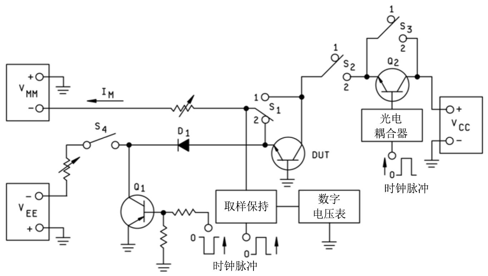

注：不同温敏参数对应的开关位置：二极管的 \(V_{\mathrm{F}}\) ：开关 \(\mathrm{S}_1\) 在位置2、开关 \(\mathrm{S}_2\) 在位置1；晶体管的 \(V_{\mathrm{CB}}\) ：开关 \(\mathrm{S}_1\) 在位置1、开关 \(\mathrm{S}_2\) 在位置2、开关 \(\mathrm{S}_3\) 在位置1；晶体管的 \(V_{\mathrm{EB}}\) (仅发射极开关)：开关 \(\mathrm{S}_1\) 在位置2、开关 \(\mathrm{S}_2\) 在位置2、开关 \(\mathrm{S}_3\) 在位置2；晶体管的 \(V_{\mathrm{EB}}\) (发射极和集电极开关)：开关 \(\mathrm{S}_1\) 在位置2、开关 \(\mathrm{S}_2\) 在位置2、开关 \(\mathrm{S}_3\) 位置1。

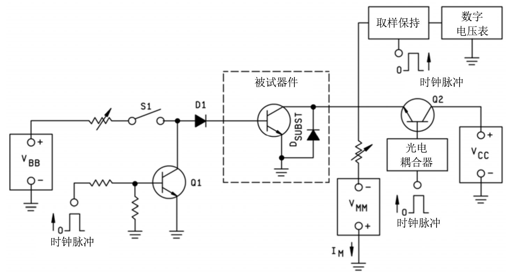

图3 采用有源器件的 \(\mathbf{P} - \mathbf{N}\) 结电压来间接测量 \(T_{\mathrm{J}}\) (平均)的典型线路

### 4.3 结对规定参考点的热响应时间 \(t_{\mathrm{JR}}\)

### 4.3.1 一般考虑

当阶跃函数形式的功率施加到半导体器件上时，结温并不按阶跃函数形式上升，而按复杂的指数曲线上升。应采用红外微辐射仪或电测试技术来测量器件的热响应时间。结温值是通过测量(预先校准过的)温敏参数得到的。采用电测试技术时，在测量温敏参数之前应先切断器件的加热电源。这时为测量热响应时间，应使用冷却曲线方法。冷却曲线的测量是通过下面的步骤来完成的：把器件加热到稳定状态，切断电源，并在器件冷却过程中监测结温。冷却曲线方法是依据这样的假设，即器件的冷响应与器件的热响应是共轭的。

### 4.3.2 测量结温与时间的关系以确定 \(t_{\mathrm{JR}}\)

在结上施加或去掉阶跃形式的加热功率，使结温随时间发生变化。应采用红外微辐射仪或电测试仪器来观测结温的变化。这些仪器的响应时间均应小于 \(100\mu \mathrm{s}\) ，而且电测试仪器还应具有足够的灵敏度，能够读取(已预校准的)结的温敏电参数测量值。测量过程中器件规定参考点的温度(规定值)应保持不变。施加或去掉阶跃形式的功率，并且从施加或去掉电源的时刻开始到结温达到稳定时为止，应记录结温和时间关系的曲线。

应记录下列数据:a) 温敏电参数(见4.2.3);

b) 红外显微镜的空间分辨率(见4.2.2);

c) 随时间变化的结温(峰值、平均值或区域值，见4.2.2或4.2.3的说明);

d) 外壳温度 \(T_{\mathrm{C}}\) 或安装表面温度 \(T_{\mathrm{M}}\) (通常是 \((60\pm 0.5)^{\circ}\mathrm{C}\) );

e) 封装内的功耗 \(P_{\mathrm{D}(\mathrm{封装})}\) 或 \(P_{\mathrm{D}}\) (单结);

f) 测量点的参考温度；

g) 安装布局。

### 4.3.3 测量结温与时间关系的典型测试线路

4.3.3 测量结温与时间关系的典型测试线路4.2.3 规定的线路也可以用来测量结温随时间的变化。改变时钟脉冲以提供所要求的阶跃加热功率，用示波器监测温敏参数。当采用红外微辐射仪时，应断开测量电流和温敏参数测试线路。

### 4.4 计算 \(R_{\mathrm{th}(\mathrm{J} - \mathrm{R})}\) 和 \(t_{\mathrm{JR}}\)

### 4.4.1 计算封装热阻

当按4.1和4.2所述步骤分别测量结温的峰值 \(T_{\mathrm{J}(\mathrm{峰值})}\) 、平均值 \(T_{\mathrm{J}(\mathrm{平均})}\) 或区域值 \(T_{\mathrm{J}(\mathrm{区域})}\) 之后，通过计算可得到器件的热阻。若要估计整个封装的热阻，应对被试器件施加额定功率 \(P_{\mathrm{D}(\mathrm{封装})}\) 。若用作为质量控制，可用单个被测结的功耗 \(P_{\mathrm{D}(\mathrm{单结})}\) 来计算热阻。

记录了每种测量数据之后，应按公式(4)\\~公式(6)计算热阻:根据上述公式计算单结热阻时，应采用 \(P_{\mathrm{D}(\mathrm{单结})}\) 。值得注意的是，这些热阻值与封装的散热方式无关。这可能由于外壳或片式载体(参考)温度是在封装壳体自身的某个合适位置上(即在从芯片经封装到散热器的主要热流通道上给出典型温度的位置)测量的缘故。

\[R_{\\mathrm{th}(\\mathrm{J} - \\mathrm{C})}(\\mathrm{峰值}) = \\frac{T_{\\mathrm{J}(\\mathrm{峰值})} - T_{\\mathrm{C}}}{P_{\\mathrm{D}(\\mathrm{封装})}} \\quad (4)\]

\[R_{\\mathrm{th}(\\mathrm{J} - \\mathrm{C})}(\\mathrm{平均}) = \\frac{T_{\\mathrm{J}(\\mathrm{平均})} - T_{\\mathrm{C}}}{P_{\\mathrm{D}(\\mathrm{封装})}} \\quad (5)\]

\[R_{\\mathrm{th}(\\mathrm{J} - \\mathrm{C})}(\\mathrm{区域}) = \\frac{T_{\\mathrm{J}(\\mathrm{区域})} - T_{\\mathrm{C}}}{P_{\\mathrm{D}(\\mathrm{封装})}} \\quad (6)\]

### 4.4.2 计算封装热响应时间

当按4.3的具体步骤分别测量了随时间变化的结温的峰值 \(T_{\mathrm{J}(\mathrm{峰值})}\) 、平均值 \(T_{\mathrm{J}(\mathrm{平均})}\) 或区域值 \(T_{J}(\mathrm{区域})\) 之后，可计算得到器件的热响应时间。若要估计整个封装的热响应时间，应对被试器件施加额定功率 \(P_{\mathrm{D}(\mathrm{封装})}\) 。若用作为质量控制，可用单个被测结的功耗 \(P_{\mathrm{DD}}\) (单结)来计算热响应时间。

当得到上述各项测量的数据之后，热响应时间可从结温与时间的关系曲线上确定。测量从施加或去掉加热功率的时刻开始到结温达到稳定值为止的时间，该时间的0.9倍就是热响应时间。

### 5 说明

有关的订购文件应规定以下内容:a) 封装描述。包括内含的芯片数量、外壳或片式载体温度的测量位置以及散热器的布局；

b) 测量条件(适用时，见第4章);

c) 各芯片的测量电压、电流和功耗；d) 每种测量的记录数据(适用时);e) 确定热特性标记的下标符号，以便验证这些特性的规定值(适用时);f) 接收或拒收判据。

## 方法1013.1 露点

### 1 目的

本试验的目的在于检测出器件封装中足以对器件参数产生不良影响的残存湿气。对湿度最敏感的参数是器件的漏电流。对通常的露点测试，本试验中规定低温为 \(- 65^{\circ}\mathrm{C}\) 。在某些情况下，若湿度比在该温度下能检测的湿度还要低时，可以将低温再降低些。

### 2 仪器

用于本试验的仪器应能在测量参数时，使温度能从规定的高温到 \(- 65^{\circ}\mathrm{C}\) 之间变化。

### 3 程序

在器件的各引出端施加由有关的订购文件规定的电流、电压值，在从规定的高温到 \(- 65^{\circ}\mathrm{C}\) 然后再返回高温的过程中，连续监测器件漏电流或其他规定的参数。在被试器件的参数与温度关系曲线上出现明显的不连续突变点就是露点。若未出现不连续点，应认为露点低于 \(- 65^{\circ}\mathrm{C}\) ，被试器件可以接收。如果在测试过程中，在某一点上测得的参数表现出不稳定，即使未测出露点，该器件也应视为拒收。若采用的订购文件中未规定具体的高温数值，试验中采用的高温应至少比环境温度高 \(10^{\circ}\mathrm{C}\) ，这样就能检测出湿度可能已处于饱和状态的器件的露点。试验过程中温度变化的速率不应高于 \(10\mathrm{K / min}\) 。因产生电离需施加足够大的电压，测量电压应至少等于器件的额定击穿电压。

### 4 说明

有关的订购文件应规定以下内容：a) 试验温度：高温（见第3章）和低温（若不是 \(-65^{\circ}\mathrm{C}\) ）（见第1章）；b) 测量电压和电流（见第3章）；c) 测量参数（见第1章和第3章）。

## 方法1014.3 密封

### 1 目的

本试验的目的是确定具有内空腔的器件封装的气密性。

### 2 术语和定义

下列术语和定义适用于本方法。

### 2.1 标准漏率 standard leak rate

\(25^{\circ}\mathrm{C}\) 时，在高压一侧为一个大气压(101kPa)和低压一侧为近似绝对真空(不超过 \(0.2\mathrm{kPa}\) )的情况下，每秒钟通过一条或多条漏泄通道的干燥空气量。单位是 \((\mathrm{Pa}\cdot \mathrm{cm}^{3}) / \mathrm{s}\) (空气)。

### 2.2 测量漏率 measured leak rate

R在规定的条件下，使用规定的试验媒质(示踪气体)所测得的给定封装的漏率。单位是 \((\mathrm{Pa}\cdot \mathrm{cm}^{3}) / \mathrm{s}\) (试验媒质)。

### 2.3 漏率转换因子 leak-rate conversion factor

采用不同气体媒质表征漏率时的定量转换计算因子。

注：不同气体媒质的漏率转换因子如下:a) \((\mathrm{Pa}\cdot \mathrm{cm}^{3}) / \mathrm{s}(\mathrm{氮}85)\times 1.71 = (\mathrm{Pa}\cdot \mathrm{cm}^{3}) / \mathrm{s}(\mathrm{空气})\)

b) \((\mathrm{Pa}\cdot \mathrm{cm}^{3}) / \mathrm{s}(\mathrm{氮}85)\times 4.61 = (\mathrm{Pa}\cdot \mathrm{cm}^{3}) / \mathrm{s}(\mathrm{氮})\)

c) \((\mathrm{Pa}\cdot \mathrm{cm}^{3}) / \mathrm{s}(\mathrm{氮})\times 0.37 = (\mathrm{Pa}\cdot \mathrm{cm}^{3}) / \mathrm{s}(\mathrm{空气})\)

### 2.4 等效标准漏率 equivalent standard leak rate

L给定封装在2.1标准条件下的漏率。各漏率可根据2.3规定的转换因子进行计算转换。为了使不同媒质条件下的漏率具有可比性，对于试验中使用某种媒质的等效标准漏率必须换算为与之可比的某种媒质的等效标准漏率，通常换算为等效标准空气漏率，单位是 \((\mathrm{Pa}\cdot \mathrm{cm}^{3}) / \mathrm{s}\) (空气)。

### 3 试验条件构成

### 3.1 示踪气体(氦)

\(\mathrm{A}_{1}\) ——细检漏固定方法

\(\mathrm{A}_{2}\) ——细检漏灵活方法

\(\mathrm{A}_{4}\) ——适用于未密封的外壳的细检漏

\(\mathrm{A}_{5}\) ——He/O₂干法粗检漏和He细检漏( \(\mathrm{A}_{1}\) 或 \(\mathrm{A}_{2}\) )的组合方法

### 3.2 放射性同位素(氦85)

B——细检漏

### 3.3 氟碳化合物粗检漏

\(\mathrm{C}_{1}\) ——使用液体槽的固定方法

### 3.4 光学检漏

\(\mathrm{C}_{4}\) ——粗检漏

\(\mathrm{C}_{5}\) ——细检漏

### 3.5 染料渗透检漏

D——粗检漏

### 3.6 增重检漏

E——粗检漏

3.7 累积式氨检漏(CHLD)

\(\mathrm{CH}_{1}\) ——粗检漏和细检漏的固定方法

\(\mathrm{CH}_{2}\) ——粗检漏和细检漏的灵活方法

### 4 一般要求

### 4.1 试验实施

细检漏和粗检漏试验应按相应试验条件的要求和程序实施。除采用试验条件 \(\mathrm{A}_{5}\) 或光学检漏或累积式氨检漏外，试验顺序为先进行细检漏，后进行粗检漏。规定时(见第7章),应在检漏程序完成后进行测试。采用试验条件 \(\mathrm{A}_{4}\) 时，不必进行粗检漏。试验条件 \(\mathrm{A}_{4}\) 不能用于已封装的器件所要求的密封试验。

当规定的加压压力超过器件封装的承受能力时，可以使用其他满足试验要求的加压压力、压力作用时间、候检时间的组合条件，但在任何情况下作用于器件上的压力不得小于 \(202\mathrm{kPa}\) (两个绝对大气压),或对于试验条件 \(\mathrm{A}_{4}\) ，任何情况下试验压力至少为 \(69\mathrm{kPa}\) 。

若按试验条件A或试验条件B对多个器件同时进行试验时(即在检漏仪中每次放置一个以上器件),如该组器件出现漏率超标，可以对每个器件分别重新进行试验以决定接受与否，但必须在将器件从示踪气体加压室中取出后1h之内完成对该组所有器件的重新试验。仅对试验条件 \(\mathrm{B}_{1}\) ，可对多个器件同时进行试验或单独试验以决定接受与否，但必须在将器件从示踪气体加压室中取出后1.5h之内完成试验。

对试验条件 \(\mathrm{C}_{4}\) 和试验条件 \(\mathrm{C}_{5}\) ，封装必须满足5.4.1中规定的要求。这包括敷形涂层器件，例如电路板组件。

### 4.2 重新试验

没有通过粗检漏的器件，必要时可按试验条件D重新进行破坏性试验，如果重新试验显示器件通过，则该器件不应视为失效。没有通过细检漏的器件不应重新试验，除非在订购文件中有规定。当允许重新进行细检漏试验时，规定条件下的整个试验程序应重复进行。器件应按规定试验条件重新暴露在示踪液中或示踪气体中，而不允许直接进行第二次观察检漏试验。在重新试验前可以为检测剩余示踪气体而进行预测。

### 4.3 失效判据

细检漏的失效判据在第6章中表6给出；粗检漏的失效判据在每一项试验后给出。

### 5 试验程序

5.1 试验条件 \(\mathrm{A}_{1}\) 、试验条件 \(\mathrm{A}_{2}\) 、试验条件 \(\mathrm{A}_{4}\) 和试验条件 \(\mathrm{A}_{5}\) 一示踪气体氨(He)细检漏

### 5.1.1 设备

5.1.1.1 试验条件 \(\mathrm{A}_{1}\) 、试验条件 \(\mathrm{A}_{2}\) 和试验条件 \(\mathrm{A}_{4}\) 的设备按本条件进行试验所需设备包括合适的真空/压力室和一台质谱检漏仪。该质谱检漏仪应经过适当的预置和校准，使其灵敏度达到足以读出小于或等于 \(10^{- 4}(\mathrm{Pa}\cdot \mathrm{cm}^{3}) / \mathrm{s}\) 的氦漏率。用于测量漏率的工作室体积应根据实际情况保持尽量小，因为该体积过大时对灵敏度极限值会产生不利的影响。应该在每个工作班次期间，至少用经校准的扩散型标准漏孔校准一次检漏仪的指示器。

此外，对试验条件 \(\mathrm{A}_{4}\) 还需使用以下设备:a) 连接被试封装与漏气检测器的夹具和配件；

b) 橡皮密封垫片；

c) 润滑油。

### 5.1.1.2 试验条件 \(\mathrm{A}_{5}\) 的设备

对于试验条件 \(\mathrm{A}_{5}\) ，除真空/压力室外，还需使用以下设备:a) 在整个试验过程中能够测量样品室和质谱仪腔内气体压力的质谱检漏仪，并且在按试验条件

\(\mathrm {A}_{2}\) 定量进行氮细检漏之前，能够在抽真空过程中定性测量氦气及氧气的粗漏信号；

b) 能够永久记录整个试验过程的计算机数据系统；c) 不同外形尺寸的金属块，以根据需要减少样品室空间从而达到要求的氦气检测水平(即本底)；d) 两个经过校准的氦标准漏孔，一个漏孔的漏率值等于或者低于测量氦漏率判据 \((R_{1})\) ；另一个漏孔的漏率值至少比测量氦漏率判据 \((R_{1})\) 高出1个数量级，但不得超出3个数量级；e) 浓度为 \(99.9\%\) 的氮气或氩气，用于在试验开始前排出样品室内的空气。

### 5.1.2 程序

### 5.1.2.1 概述

试验条件 \(\mathrm {A}_{1}\) 是一种“固定”的试验方法，按表1规定的条件进行试验，它能保证为了检测出要求的拒收极限值 \((R_{1})\) 所必须的试验灵敏度。

试验条件 \(\mathrm {A}_{2}\) 是一种“灵活”的试验方法，它允许按5.1.2.4中的公式改变加压条件，以根据预先确定的拒收极限值 \((R_{1})\) 检测规定的等效标准漏率 \((L)\) 。

试验条件 \(\mathrm {A}_{3}\) 用于检测未密封外壳的测量漏率 \((R)\) 的大小。

试验条件 \(\mathrm {A}_{5}\) 是将干法粗检漏与细检漏相结合的检漏方法。

### 5.1.2.2 试验条件 \(\mathrm {A}_{1}\) 、试验条件 \(\mathrm {A}_{2}\) 和试验条件 \(\mathrm {A}_{5}\) 的程序

将被试器件置于真空/压力室内，真空/压力室内的空气被抽至接近绝对真空，然后用 \(1000_{- 5}^{0}\%\) 的纯氮气进行加压；或交替的进行使氦气充满、排出的操作，直至达到规定的氦浓度。此时真空/压力室可保持规定的压力，到达规定的时间后，压力被释放，再将每个样品转移到另一个与抽真空系统和检漏仪相连接的试验箱。当试验箱抽真空后，原先加压进入样品的示踪气体会释放出来，并在检漏仪上显示得到测量漏率 \((R)\) 。注意，应限制从氦气压力室取出的器件数量，以便最后一个器件能够在试验条件 \(\mathrm {A}_{1}\) 即表1所规定的候检时间内完成检漏，或者在试验条件 \(\mathrm {A}_{2}\) 所给定的候检时间 \(t_{2}\) 内完成。

除非在订购文件或合同上有特别规定，否则应使用灵活方法。

### 5.1.2.3 试验条件 \(\mathrm {A}_{1}\) -固定方法

根据表1，按被试器件封装内空腔容积规定相应的条件。

### 5.1.2.4 试验条件 \(\mathbf{A}_2\) -灵活方法

选择适当的加压压力、压力作用时间和候检时间， 使有缺陷的被试器件测得的示踪气体测量漏率 \((R)\) 的读数大于质谱仪的最小检测灵敏度。器件应至少承受两个绝对大气压 \((202\mathrm{kPa})\) 的氮气作用。将上述选定的数值以及被试器件的内空腔容积和"等效标准漏率" \(L\) 的最大极限值(如第6章表6所示或在有关订购文件中规定)一起代入公式(1)计算"测量漏率" \(R_{1}\) 的极限值:式中:

\[R_{1} = \\frac{L\\cdot P_{\\mathrm{E}}}{P_{\\mathrm{O}}}\\left(\\frac{M_{\\mathrm{A}}}{M}\\right)^{1 / 2}\\left\\{1 - \\exp \\left[-\\frac{L\\cdot t_{1}}{V\\cdot P_{\\mathrm{O}}}\\left(\\frac{M_{\\mathrm{A}}}{M}\\right)^{1 / 2}\\right]\\right\\} \\exp \\left[-\\frac{L\\cdot t_{2}}{V\\cdot P_{\\mathrm{O}}}\\left(\\frac{M_{\\mathrm{A}}}{M}\\right)^{1 / 2}\\right] \\quad (1)\]

\(R_{1}\) ——计算得到的测量漏率的最大允许拒收极限值， \(\mathrm{(Pa\cdot cm^3)/s}\) (氮);

\(L\) ——等效标准漏率的最大允许拒收极限值， \(\mathrm{(Pa\cdot cm^3)/s}\) (空气);

\(P_{\mathrm{E}}\) ——绝对作用压力， \(\mathrm{Pa}\) ;

\(P_{\mathrm{O}}\) ——绝对大气压力(为 \(1.01\times 10^{5}\) ), \(\mathrm{Pa}\) ;

\(M_{\mathrm{A}}\) ——空气的分子量(为 \(28.96\) ), \(\mathrm{g}\) ;

\(M\) ——示踪气体(氮)的分子量(为4), \(\mathrm{g}\) ;

\(t_{1}\) ——受 \(P_{\mathrm{E}}\) 压力作用的时间， \(\mathrm{s}\) ;

\(t_{2}\) ——去除压力后到检漏之间的候检时间， \(\mathrm{s}\) ;

\(V\) ——被试器件封装的内空腔容积， \(\mathrm{cm}^3\) 。

### 5.1.2.5 试验条件 \(\mathbf{A}_4\) -未经封盖的外壳试验程序

将5.1.1.1a)所述的夹具和配件固定在漏气检测器的真空接头处， 采用5.1.1.1b)中的密封圈(如果密封需要，可采用5.1.1.1c)列出的真空脂或液体)对一块平面金属板作密封试验，测量漏气检测系统的工作情况，以验证夹具的完整性。试验时，先把被试外壳密封在真空接头处，再将封装内腔抽真空至小于或等于 \(0.01\mathrm{kPa}\) 。试验时，应注意不要使外壳(不包括密封环部分)与真空盾接触，以防遮盖了漏气的部分。然后用气囊或喷枪使外壳的外部受到一个 \(69\mathrm{kPa}\) 的氮气压力(表压)作用。

### 5.1.2.6 试验条件 \(\mathbf{A}_5\) -He/O₂干法粗检漏和He细检漏(A₁或A₂)的组合方法

每次使用前需要对检漏仪(可配有适合尺寸的金属块)进行校准，且在每8h使用后或更换金属块时，以及设备维护后重新进行校准。检漏仪校准时，应基于当前使用温度和氦损耗率，根据相应的可追溯标准漏孔的校准证书，对每个氦标准漏孔的漏率进行校正。通过测量两个经校正的标准漏孔的氦信号，并创建一个线性校准函数，将检漏仪所测量的氦信号转换为定量测量的氦漏率。至少每年应对标准漏孔重新进行校准。

使用本试验条件的粗检部分可检测的样品最小内腔体积应是在器件盖板上具有直径为 \(0.13\mathrm{mm}\) 或更大漏孔的且可检测到粗漏信号的内腔体积。基准测量应在试验一批器件之前及时记录，并作为确定粗漏拒收依据的定性参考。基准应包括与时间相关的样品室压力，以及在粗漏试验期间使用已知密封性良好的样品或金属块模拟被试样品外部体积的氦和氧基线信号。

被试器件应放置在密封的氦气压力室中。基于器件细检漏试验所需的等效标准漏率 \(L\) 值，根据候检时间(最长72h)选择加压压力和加压时间，从而使按公式(1)计算得到的示踪气体最大允许测量漏率 \((R_{1})\) 读数比质谱仪的最小可检漏率(背景读数)高出半个数量级。也可使两者差值在半个数量级之内，前提是质谱仪需要有程序文件控制背景信号抬升，以避免干扰测量结果准确性，使得质谱仪测量的 \(R_{1}\) 信号不小于背景信号标准偏差的3倍。

将被试器件从氦气压力室取出后，应在1h内完成对这些器件的初始粗检漏和细检漏，除非可以证明较长的时间(不超过计算 \(R_{1}\) 所用的候检时间)能够发现粗泄漏和中程细泄漏。应将被试器件依次放入样品室，然后用氮气或氩气吹洗样品室一段时间，以便去除样品室内的空气。开始抽真空时，样品室内的压力数据和采集的氦氧粗漏试验数据，以及氦细漏试验数据均需永久保存。将器件的试验数据与基准数据进行比较，以确定器件是否通过粗检漏。

在试验过程中，应按以下次序对被试器件进行处理:a) 剔除粗漏失效的器件。

b) 通过粗检漏和细检漏判据的样品应予接收。

c) 其余器件(已通过粗检漏但由于氦气吸附或可能存在的中程细泄漏而造成细检漏超标)则应置于空气中，隔一段时间重新检测一次，以确定是否通过细漏判据。如果所测漏率是由于器件密封区域泄漏通道的实际泄漏而非氦气吸附效应，那么细检漏的最大候检时间(FLDT)应通过计算器件内部氦气含量消耗 \(1\%\) 所需的时间来确定。应通过公式(2)计算每个器件的FLDT(单位为小时):式中:

\[FLDT = K \\cdot P \\cdot V / LMLR \\quad (2)\]

\(K\) —— \(2.8 \times 10^{- 4}\) , \(\mathrm{h} / \mathrm{s}\) ;

\(P\) —— \(0.01\) (氦损失 \(1\%\) );

\(V\) ——被试器件内腔体积， \(\mathrm{cm}^{3}\) ;

LMLR——初始检漏后立即记录的测量漏率。

FLDT不应超过72h,且不应大于计算 \(R_{1}\) 时所用的候检时间，未能在规定的FLDT时间内达到细检漏判据的器件应予以拒收。与典型的良好器件相比，在初始试验期间检测到显著泄漏，而又在候检时间内通过了细检漏判据的那些样品，应作进一步的目标以排除粗漏可能。内部体积大于 \(0.1\mathrm{cm}^{3}\) 的器件可置于真空中或在 \(100^{\circ}\mathrm{C}\) 下烘烤不超过20min,以缓解封装表面氦气吸附。

### 5.1.3 失效判据

### 5.1.3.1 粗检漏失效判据

粗检漏失效判据如下:a) 氦泄漏信号大于氦基准值的3倍(不包括已知的氦吸附效应);

b) 氧泄漏信号大于氧基准值的3倍；

c) 压力读数大于压力基准值的3倍或压力降到质谱仪启动所需的时间大于基准时间的3倍(因设备泄漏而非器件泄漏的情况除外)。

### 5.1.3.2 细检漏失效判据

试验条件 \(\mathrm{A}_{1}\) 、试验条件 \(\mathrm{A}_{2}\) 和试验条件 \(\mathrm{A}_{5}\) 的失效判据见第6章中表6。

对于试验条件 \(\mathrm{A}_{4}\) ，除另有规定外，如果测量漏率 \((R)\) 超过 \(1\times 10^{- 3}(\mathrm{Pa}\cdot \mathrm{cm}^{3}) / \mathrm{s}\) (氦),则器件应视为失效。

### 5.2 试验条件B-放射性同位素细检漏试验

### 5.2.1 激活参数

激活压力和吸收时间应按公式(3)确定:式中:

\[Q_{S} = \\frac{R}{S\\cdot K\\cdot T\\cdot P\\cdot t} \\quad (3)\]

\(Q_{S}\) ——被试器件的最大允许漏率， \((\mathrm{Pa}\cdot \mathrm{cm}^{3}) / \mathrm{s}\) (氦)。

\(R\) ——活化后，器件漏率等于 \(Q_{S}\) 时，每分钟超出环境背景的计数大小。如之前已经受放射性检漏试验，则为超过计数设备和器件背景的拒收计数。

\(S\) ——激活系统中的氦- 85示踪气体放射性比活度， \(\mathrm{Bq} / (\mathrm{Pa}\cdot \mathrm{cm}^{3})\) 。

\(K\) ——闪烁晶体对被试器件内部空腔中氦- 85的总计数效率，计数数目/ \(\mathrm{Bq}\cdot \mathrm{min}\) ;该因子大小取决于器件形状结构和闪烁晶体的尺寸。计数效率的确定见5.2.2。

\(T\) ——吸收时间(即器件受激活的时间), \(\mathrm{h}\) 。

\(P\) ——等于 \(P_{\mathrm{e}}^{2} - P_{\mathrm{i}}^{2}\) ，其中 \(P_{\mathrm{e}}\) 是器件的激活压力，可按规范确定或者在确定了合适的吸收时间 \(T\) 的情况下，按公式(3)确定，单位为绝对大气压。 \(P_{\mathrm{i}}\) 为器件内部原有的压力，单位为绝对大气压。

\(t\) ——小时转换成秒的换算系数， \(1\mathrm{h} = 3600\mathrm{s}\) 。

### 5.2.2 计数效率 \(K\) 的确定

应按下述方法确定计数效率 \(K\) :a) 选用五个有代表性的被试器件样品，焊上管道，由管道向器件内腔充入一定已知体积和放射性比活度的氦-85示踪气体，然后封闭该管道；

b) 从检测器件的计数台上屏蔽的闪烁晶体中直接读出每分钟的计数，由该值计算计数效率。

### 5.2.3 表面吸收的鉴定

所有用玻璃、金属和陶瓷(或它们的组合)封装的器件，包括其涂层和外部密封剂，在确定漏气试验参数之前都应鉴定其对氦- 85的表面吸收。对于待确定其表面吸附作用的材料，应选取有代表性的样品，根据器件的结构形状，按5.2.1确定压力大小和作用时间，使器件受到氦- 85的作用。然后 \(10\mathrm{min}\) 计数一次，记录单位时间的计数，直到单位时间的计数渐渐与时间无关(相应于表面吸收不再成为问题的时间)。记录该段时间并用来确定5.2.4中规定的"等待时间"。

### 5.2.4 程序

器件应放在放射性示踪气体激活箱内。为了减少抽真空的时间，可在激活箱内填充部分惰性材料。将激活箱抽真空到 \(0.07\mathrm{kPa}\) 。然后使器件至少受到 \(202\mathrm{kPa}\) 的氦- 85与干燥氮气混合气体的作用，作用时间至少 \(12\mathrm{min}\) ，实际压力大小和吸收时间应按5.2.1的计算结果。用“每分钟的计数”表示的 \(R\) 值应高出背景600以上，氦- 85与干氮混合气体应抽出存贮，直至激活箱内真空度达到 \(0.07\mathrm{Pa}\sim 0.27\mathrm{Pa}\) 。应在 \(3\mathrm{min}\) 内完成这一气体的抽出存贮过程。该时间从激活过程结束时算起，若采用高压力作用，则从激活压力达到 \(414\mathrm{kPa}\) 时算起。接着使激活箱充满空气(气洗)。然后将器件移出激活箱。在受气体作用后1h内，用装有闪烁晶体的计数台进行泄漏试验。对5.2.3要求的器件封装应先暴露在环境空气中不少于5.2.3规定的“等待时间”。但器件从激活箱中取出到进行试验之间的间隔时间决不能超过1h。应在受到气体作用之后，但又在用计数台确定漏气率之前进行这样的暴露。对5.2.3中未提到的那些器件封装可直接进行试验而不需要“等待时间”，从增压室中一次取出的器件数应受下列要求的限制：即它们中最后一个接受试验的器件应能在1h内完成试验。器件实际漏率按公式(4)计算：式中：

\[Q = \\frac{n\\cdot Qs}{R} \\quad (4)\]

\(Q\) ——实际的漏率， \((\mathrm{Pa}\cdot \mathrm{cm}^{3}) / \mathrm{s}\)

\(n\) ——每分钟的实际净读数；

\(Qs\) 、 \(R\) ——见5.2.1。

注：排入大气中的氦- 85限量应符合有关标准的规定。

### 5.2.5 失效判据

除另有规定外，当漏率大于或等于表2试验极限值的规定时，器件应视为失效。

注：有些器件因漏率不大而通过了密封性试验，但其封装内部残留的放射性示踪气体对这些复杂的小几何尺寸的器件可能会引起软错误。

### 5.2.6 人身安全

使用氦- 85泄漏试验设备应得到有关部门的认可，使用放射性气体时，应按有关规定要求的最长允许暴露时间及最大允许剂量。

### 5.3 试验条件 \(C_1\) -氟碳化合物粗检漏

### 5.3.1 设备

本试验所需设备为：a）真空/压力室：用于抽真空及随后加压，能使器件受到 \(724\mathrm{kPa}\) 的压力(绝对压力)作用达 \(23.5\mathrm{h}\) 。

b）能保持指示用的液体温度在 \(125^{\circ}\mathrm{C}\) 并适于观察的容器，以及一套能将尺寸大于 \(1\mu \mathrm{m}\) 的粒子从液体中除去的过滤系统。

c）1.5倍 \(\sim 30\) 倍的放大镜：将器件浸入指示用的液体中时，能用该放大镜观察到从器件中冒出的气泡。

d）表3中所列的检测用I型液体和指示用II型液体。

e）光源：它在空气中能在距离等于容器中离光源最远的器件与光源之间距离的位置处产生大于或等于 \(4572\mathrm{m}\) 烛光的亮度。光源不需要校准。但光源在观察位置上(即在观察气泡时放置被试器件的位置上)应产生足够的亮度。

f) 已校准过的合适仪器：指示试验温度、压力和时间是否符合规定。

g) 使器件浸入指示液中的合适夹具。

### 5.3.2 程序

试验条件 \(\mathrm{C_1}\) 采用的是能保证必须的试验灵敏度的特定条件。

将待测样品放置于真空/压力室内，把压力降到小于或等于 \(0.7\mathrm{kPa}\) ，至少保持 \(30\mathrm{min}\) 。对内腔体积大于或等于 \(0.1\mathrm{cm}^3\) 的器件，此步可省略。然后注入足量的I型检测用液体覆盖器件，应在保持真空过程 \(30\mathrm{min}\) 后，但在真空被破坏前注入液体。然后按表4的规定对器件加压。加压阶段结束后，除去压力，将器件从真空/压力室中取出，但仍需继续浸在检测液中20s以上。这种浸泡也可以是在另一个容器或贮存桶中。器件移出浸泡槽后，应在空气中至少干燥 \((2\pm 1)\mathrm{min}\) ，然后浸入 \((125\pm 5)^{\circ}\mathrm{C}\) 的II型指示液体中。器件顶部应在指示器液体液面以下至少浸入深度5cm。可以一次浸入一个器件或同时浸入一组器件。但在后一种情况下应保证能清楚地看到从被观察的一组器件中的任一个器件冒出的气泡及其来源。应该在光源照射下，从浸入时刻起，在暗淡的不反射的黑色背景衬托下经放大观察器件至少30s，除非在这之前器件已被拒收。

对于大于5g的封装，应使用该系列封装的已知漏气的器件，测量气泡出现的时间，来评估封装热质量效应。如果评估时间超过了观察所需的30s，那么，应延长观察时间，以考虑封装热效应的影响。在有要求时，也可在有关文件中规定其他方法来达到这个目的。

### 5.3.3 失效判据

从同一位置出来的一串明显气泡或两个以上大气泡应视作器件失效。

### 5.3.4 注意事项

进行氟碳化合物粗检漏试验时应遵守以下注意事项：a) 在使用前利用能排除大于 \(1\mu \mathrm{m}\) 粒子的过滤系统过滤氟碳化合物。允许整体过滤和贮存。在使用过程中积累了一定数量可见粒子的液体应抛弃或过滤后回收使用。应注意防止污染；b) 注入观察容器的液体应保证覆盖器件高度至少 \(5\mathrm{cm}\) ；c) 被试器件表面应无外来杂质，包括会产生错误试验结果的涂覆和标志；d) 试验较大的封装时应注意防止由于封装破裂或加压液体的猛烈喷出而使操作者受到伤害。

### 5.4 试验条件 \(\mathbf{C}_4\) 和试验条件 \(\mathbf{C}_5\) -光学粗检漏和细检漏

### 5.4.1 概述

光学检漏(OLT)适用于独立的器件和安装到印制电路板或更高等级组装的器件。光学检漏系统是基于其使盖板或封装产生弹性形变的能力。被试器件的盖板变形量应满足干涉仪所检测的最小灵敏度，即最少为 \(7.25\times 10^{- 7}\mu \mathrm{m / Pa}\) 。这些试验条件对由金属、陶瓷或其他加压时盖板有可检测变形的已封盖器件是有效的。一般地，用氮气作为加压媒质。所需的设备包括合适的压力室，内置一个光学检漏仪。光学检漏仪应经过预置和适当的校准，使其对漏孔的等效标准漏率检测灵敏度达到第6章表6的要求。

### 5.4.2 试验条件 \(\mathbf{C}_4\) 、试验条件 \(\mathbf{C}_5\) -光学粗检漏和细检漏

### 5.4.2.1 设备

试验条件 \(\mathbf{C}_4\) 、试验条件 \(\mathbf{C}_5\) 所需设备如下：a) 用于检测一个或多个器件压力改变时盖板的亚微米形变量的光干涉仪；b) 能够提供高达 \(620\mathrm{kPa}\) 氦环境压力(绝对压力)的真空/压力室；c) 能够感应微小压力变化并同时对每个器件产生盖板形变的压力变化进行电子测量的工具，以确定每个器件的盖板刚度；d) 能够同时追踪盖板随时间变化的工具；e) 在试验的开始和最后能用检测的盖板位置和校准的刚度值确定器件内部压力变化的电子装置。

### 5.4.2.2 漏率

光学检漏试验的试验压力 \((P)\) 和时间 \((t)\) 的确定应能保证所要求的漏率灵敏度。漏率由公式(5)给出：式中：

\(O L_{\mathrm{He}}\) ——光学检漏得到的等效标准氦漏率， \((\mathrm{Pa}\bullet \mathrm{cm}^{3}) / \mathrm{s}\) (氦)；

\(V\) ——封装的内空腔容积， \(\mathrm{cm}^3\)

\(t\) ——试验时间，s；

\(P_{0}\) ——绝对大气压力，Pa；

\(D\) ——盖板的形变变化量， \(\mu \mathrm{m}\)

\(P\) ——压力室的压力(表压)，Pa；

\(S\) ——盖板刚度值， \(\mu \mathrm{m / Pa}\) 。

### 5.4.2.3 控制试验时间和压力以控制灵敏度

如上所述，对于一定盖板刚度和内空腔容积的封装，漏率灵敏度随着试验时间 \(t\) 和真空/压力室压力 \(P\) 的增加而增加。

### 5.4.2.4 试验条件 \(\mathbf{C}_4\) -光学粗检漏

本试验与试验条件 \(\mathbf{C}_5\) 光学细检漏一起使用。将整个器件放置在真空/压力室中，用一台光干涉仪观测封装的盖板。在利用光干涉仪观测盖板变形的同时，对真空/压力室加压或抽真空。在观测区内，应该能够同时观察到每个盖板随着压力变化发生的形变；当压力在一定时间内保持恒定(或等效的程序)时，观察盖板是否缺少持续形变。

### 5.4.2.5 失效判据

出现下列情况的器件应拒收：a) 如果试验箱中压力最初变化时， 光干涉仪没有观测到盖板变形； b) 光干涉仪观测到盖板刚度值大于 \(0(0\mu \mathrm{m} / \mathrm{Pa})\) 。

### 5.4.2.6 试验条件 \(\mathrm{C}_5\) -光学细检漏

本试验与试验条件 \(\mathrm{C}_4\) 光学粗检漏一起使用。将整个器件放置在真空/压力室中， 用一台光干涉仪观测封装的盖板。然后用氦气对真空/压力室加压或抽真空。试验期间， 压力能够充分调制以得到每个器件的盖板刚度校准测量值。用光干涉仪观测盖板的变形。在压力变化时间(或等效程序)内， 在观测视野中同时观测每个封装盖板的形变。

### 5.4.2.7 失效判据

细检漏的失效判据见第6章中表6。

### 5.5 试验条件D-染料渗透粗检漏

### 5.5.1 概述

本试验为按4.2重新试验要求所进行的破坏性试验。

### 5.5.2 设备

本试验所需设备如下:a) 紫外光源： 其峰值辐射频率应能使染料的反射最强；

b) 能保持压强为 \(724\mathrm{kPa}\) (绝对压力)的真空/压力室；

c) 按有关规定混合的荧光染料溶液；

d) 1.5倍 \(\sim 30\) 倍的放大镜。

### 5.5.3 程序

真空/压力室应注入足够量的染料溶液以保证能完全覆盖所有的器件。器件应置于溶液中， 对真空/压力室至少增压到 \(724\mathrm{kPa}\) (绝对压力), 并至少维持3h。对不能经受 \(724\mathrm{kPa}\) (绝对压力)的器件封装， 可增压到 \(413\mathrm{kPa}\) (绝对压力), 维持10h。然后移出器件， 用对所采用染料合适的工艺进行处理。用适当频率的紫外线光源照射并用放大镜检查器件。

### 5.5.4 失效判据

染料渗透到器件中的任何迹象应视作器件失效。

### 5.6 试验条件E-增重粗检漏

### 5.6.1 设备

本试验所需设备包括:a) 真空/压力室： 用于抽真空及随后加压， 能使器件受到 \(620\mathrm{kPa}\) (绝对压力)的作用力达10h;

b) 分析天平： 精确到 \(0.1\mathrm{mg}\)

c) 表3所列的III型检测液体；

d) 能将大于 \(1\mu \mathrm{m}\) 的粒子从氟碳化合物溶液中除去的过滤系统；

e) 用于测量试验压力和时间并经过校准的合适仪器。

### 5.6.2 程序

将器件放入 \(125^{\circ}\mathrm{C}\) 的烘箱中至少存放1h, 接着冷却到环境室温。应对每个器件称重并记录最初的重量。或者按下述方法将器件分组： 体积小于 \(0.01\mathrm{cm}^3\) 的器件按 \(0.5\mathrm{mg}\) 的重量差分组； 体积大于或等于 \(0.01\mathrm{cm}^3\) 的器件按 \(1.0\mathrm{mg}\) 重量差分组。把器件放在真空/压力室中并将压力减小到 \(0.7\mathrm{kPa}\) ， 保持1h。对内腔体积大于或等于 \(0.1\mathrm{cm}^3\) 的器件可省略该真空过程。把足够量的III型检测用液体注入真空/压力室浸没器件。当实施真空过程时， 应在1h以后但又在真空被破坏前注入液体。然后把器件至少增压到 \(517\mathrm{kPa}\) (绝对压力)。对省略真空过程的情况应采用至少为 \(620\mathrm{kPa}\) (绝对压力)的增压。应至少保持压力2h。如果器件不能承受 \(517\mathrm{kPa}\) (绝对压力)的试验压力， 对实施过真空预处理的器件压力可减小到 \(310\mathrm{kPa}\) (绝对压力), 但该压力至少保持10h。完成了加压过程后应去除压力并把器件移出真空/压力室， 保留在氟碳化合物液体槽中， 器件移出液体后在称重量前吹风干燥 \((2\pm 1)\mathrm{min}\) 。逐一将器件放到天平上以确定其重量或重量级别。全部器件应在移出液体后 \(4\mathrm{min}\) 内进行试验。根据器件的最初和最后重量记录，计算重量的变化。将已分类的器件分别归入两组，重量的变化为一个或小于一个重量级差的为一组，重量的变化大于一个重量级差的为另一组。

### 5.6.3 失效判据

对内腔体积小于或等于 \(0.01\mathrm{cm}^3\) 的器件，如果器件重量增量大于或等于 \(1.0\mathrm{mg}\) ，该器件应拒收。对内腔体积大于 \(0.01\mathrm{cm}^3\) 的器件，重量增量大于或等于 \(2.0\mathrm{mg}\) 为拒收。对已按重量分组的器件，若器件增加了足够的重量，使其按重量划分的级别增加一级以上，则该器件为拒收。失去了一定重量的器件(结果增加了该重量就会引起器件拒收),可在 \(125^{\circ}\mathrm{C}\) 下烘烤 \(8\mathrm{h}\) 后重新试验。

### 5.7 试验条件 \(\mathbf{CH}\) -累积式氨检漏试验

### 5.7.1 设备

### 5.7.1.1 标准漏孔

本程序的设备类似于条件 \(\mathrm{A}_1\) 中质谱检漏仪，质谱检漏仪最适宜的标准漏孔为 \(5\times 10^{- 5}(\mathrm{Pa}\cdot \mathrm{cm}^3) / \mathrm{s}\) 由于累积氨的测量值与测量时间是线性函数，当信噪比大于100时，测量范围可达到 \(10^{- 7}(\mathrm{Pa}\cdot \mathrm{cm}^3) / \mathrm{s}\) 当需要检测更小漏率时，需要一个 \(5\times 10^{- 7}(\mathrm{Pa}\cdot \mathrm{cm}^3) / \mathrm{s}\) 的标准漏孔。当需要检测较大漏率时，需要一个 \(1\times 10^{- 3}(\mathrm{Pa}\cdot \mathrm{cm}^3) / \mathrm{s}\) 的标准漏孔。

用一个经校准的扩散型标准漏孔，每个工作班次校准检漏仪的指示器至少一次。

### 5.7.1.2 抽吸系统

CH试验设备应具备专门的抽吸系统，既能检测到氨气释放量，也能检测到氨气的变化率或变化斜率，漏率由细检的斜率和粗检的氨气释放量确定。

### 5.7.1.3 真空/压力室容积

5.7.1.3 真空/压力室容积检漏的真空/压力室容积应尽量小，因为真空/压力室固定容积 \((V_{\mathrm{C}})\) 与器件内空腔容积 \((V_{\mathrm{d}})\) 的比超过100将降低粗检灵敏度。对于单个器件检测或一组检测，需确定真空/压力室固定容积 \((V_{\mathrm{C}})\) 与器件内空腔容积 \((V_{\mathrm{d}})\) 的最大比值，以保证在信噪比至少为3时能够检测到粗检漏率的范围。该比值是净化气体中氨气含量、内空腔容积和被试器件数量的函数。

### 5.7.1.4 净化泵

净化泵应能保证净化气体中氨的含量低于 \(10^{- 6}(1.0\mathrm{ppm})\) 。

### 5.7.2 试验条件 \(\mathbf{CH}_1\) 和试验条件 \(\mathbf{CH}_2\) 的程序

### 5.7.2.1 概述

将完整的器件放入如5.1.2.2中试验条件 \(\mathrm{A}_1\) 和试验条件 \(\mathrm{A}_2\) 的真空/压力室内(如抽真空，应记录抽真空压力)。加压后压力释放(可用空气冲洗或其他技术减少5.7.2.2中表面吸附效应),将每个样品转移到另一试验箱或几个试验箱，这些试验箱与抽真空系统和质谱检漏仪连接。当试验箱抽真空后，原先加压进入样品的示踪气体就会泄漏出来，并在检漏仪上显示为测量漏率 \(R\) 。试验中采用的器件数应满足下述要求：对于内空腔容积大于 \(0.05\mathrm{cm}^3\) 的器件，从压力室中移出后，对于试验条件 \(\mathrm{CH}_1\) ，能够在 \(4\mathrm{h}\) (或固定方法表格中选择的候检时间)之内完成检测，对于试验条件 \(\mathrm{CH}_2\) ，能够在选择的候检时间 \(t_2\) 内完成检测。对于内空腔容积小于 \(0.05\mathrm{cm}^3\) 的器件，对于试验条件 \(\mathrm{CH}_1\) ，必须在 \(4\mathrm{h}\) (或固定方法表格中选择的候检时间)之内开始检测，对于试验条件 \(\mathrm{CH}_2\) ，必须在选择的候检时间内开始检测。

除非在订购文件或合同上有特别规定，否则应使用灵活方法。

### 5.7.2.2 表面吸附和等待时间的评估

### 5.7.2.2.1 等待时间

在确定检漏试验参数之前，应对所有器件封装材料的检漏示踪气体(如氨)表面吸附进行评估，这些封装由玻璃、金属、陶瓷或其组合构成，包括涂覆层和外部密封剂。受表面吸附影响的器件在检测之前必须"等待"表面吸附消散。这个时间要记录并决定着"等待时间"。

对于待确定表面吸附作用的材料，其代表样品应打开，每个器件的所有部件作为一个整体承受相应压力，压力大小和作用时间由器件结构决定，如表1规定。监测每个器件的 \(R\) 测量值和持续时间，直至 \(R\) 测量值降至不大于 \(0.5R_{1}\) (试验条件 \(\mathrm{CH}_{1}\) ，按表5)或预先确定的要求(试验条件 \(\mathrm{CH}_{2}\) )。该过程持续时间即"等待时间"。去除压力后的平均等待时间决定了最小候检时间。需要指出的是，测量灵敏度随着背景显示的漏率相对于拒收水平 \(R_{1}\) 减少而增加。另一种方法是，对完整的(未被打开的)评估样品采取与上述相同的试验程序，获得的较短的"等待时间"将决定最小候检时间。需要说明的是:需要说明的是:a) 若等待时间超过表5规定的候检时间，则不应使用固定方法。

b) 吸附随压力和加压时间而变，因此在得到恰当的加压参数值之前，应进行一些必要的试验。

c) 受到水汽、油脂、油等表面沾污以及贴装或印制的标签、表面孔洞、对示踪气体有显著扩展作用的材料等因素影响的示踪气体表面吸附效应必须得到重视。用氯作为示踪气体时，应保持器件、压力室和夹具等干净且不受表面杂质污染。特别要考虑的是化妆品中存在的低蒸汽压力的有机粘接剂，因此不要用裸手拿器件进行检漏，而应始终使用指套或干净的防静电手套。检漏之前如用溶剂清洗，要确保在正式检漏之前将溶剂清除干净。

### 5.7.2.2.2 表面吸附的缓解

下述三项措施可用于减少5.7.2.2.1中所述的"等待时间",这三项措施是：周围空气的流通、干燥气体吹洗和热烘焙。用哪一种方法取决于被试器件对示踪气体的吸附特性和检漏仪的灵敏度。一般来说，较短的压氩时间可使得氦吸附减少，且"等待时间"更短。在实施相应措施之前，每种封装类型的建议措施都要进行鉴定以确保要求的灵敏度不会降低。

a) 周围空气的流通如果从氩压力室中移出器件并拿到检漏仪所用的时间比较充足，可减少表面效应至氦检漏限值 \((R_{1})\) 水平以下。一般在检漏之前将器件有序地露天放置在通风的区域 \(15\mathrm{min}\sim 30\mathrm{min}\) 。

b) 干燥气体吹洗在检漏之前用干燥气体吹器件以减小表面效应对被表面水汽或其他高蒸汽压力的溶剂如IPA(乙二醇)污染的器件是最有效的。一些存在盲孔的陶瓷封装采用吹洗方法效果较好。由于CHLD试验方法提供了覆盖粗检漏范围的漏率检测，因此可能出现一种最坏的情况，即在封装内部只有空气，则若用干燥氮气吹走表面吸附，有可能造成氮气取代漏孔中的空气，从而降低粗检漏的灵敏度(大部分商业氮气中含有至少 \(10^{- 6}(1.0\mathrm{ppm})\) 的氦气，而室内空气至少含有 \(5\times 10^{- 6}(5.0\mathrm{ppm})\) )。因此若用干燥气体，干燥的空气更适合于CHLD检测系统。

c) 热烘焙加压完成后对器件加热以减少氦的吸附，这一措施在周围空气环境中效果最好，也可减少取代大漏孔中氦的可能性。这项措施对于陶瓷封装或对氦渗透明显的玻璃密封最为有效。对于暴露于防静电工作区高湿度环境下表面所吸附的水汽，这项措施去除吸附的效果较为明显。此除吸附过程可采用不同的温度，然而，必须对表面吸附的水分子施加足够的热能以破坏其极性键，该过程一般在 \(125^{\circ}\mathrm{C}\) 以上。加热对于外表面有塑料或玻璃的光学器件效果比较好。在 \(125^{\circ}\mathrm{C}\) 散开的热板上烘焙器件 \(20\mathrm{min}\sim 30\mathrm{min}\) 足以去除示踪气体的吸附。

### 5.7.3 试验条件 \(\mathbf{CH}_{1}\) -固定方法

固定方法如5.1.2.3,加压条件见表5(仅用于混合集成电路K级)。被试器件按封装内空腔容积，使用表5所列的合适条件进行检测。 \(t_{1}\) 是加压时间， \(t_{2}\) 是压力释放之后器件检漏之前的最长允许时间。若产品规范中最大标准漏率限值比灵活方法给出的限值低，不应使用固定方法。

### 5.7.4 试验条件 \(\mathbf{CH}_{2}\) -灵活方法

灵活方法如5.1.2.4。

表5试验条件CH固定条件（仅用于混合集成电路K级）

<table><tr><td rowspan="2">内空腔容积V cm³</td><td colspan="3">加压条件</td><td rowspan="2">拒收极限值R1 (Pa·cm³)/s(氦)</td></tr><tr><td>加压压力PE (绝对压力) kPa</td><td>加压时间t1 h</td><td>最长候检时间t2 h</td></tr><tr><td rowspan="3">V&amp;lt;0.05</td><td>517±15</td><td>3.8+1 0</td><td>4</td><td>1×10-6</td></tr><tr><td>620±15</td><td>1.58+1 0</td><td>4</td><td>5×10-7</td></tr><tr><td>-</td><td>0</td><td>不适用</td><td>2.68×10-5 (10%氦填充)</td></tr><tr><td rowspan="3">0.05≤V&amp;lt;0.30</td><td>517±15</td><td>54+60 min</td><td>4</td><td>1×10-6</td></tr><tr><td>620±15</td><td>22+60 min</td><td>4</td><td>5×10-7</td></tr><tr><td>-</td><td>0</td><td>不适用</td><td>1.34×10-4 (10%氦填充)</td></tr><tr><td rowspan="3">0.30≤V&amp;lt;0.50</td><td>517±15</td><td>1.5+1 0</td><td>4</td><td>1×10-6</td></tr><tr><td>620±15</td><td>37+60 min</td><td>4</td><td>5×10-7</td></tr><tr><td>-</td><td>0</td><td>不适用</td><td>1.34×10-4</td></tr><tr><td rowspan="3">0.50≤V&amp;lt;0.70</td><td>517±15</td><td>2.1+1 0</td><td>4</td><td>1×10-6</td></tr><tr><td>517±15</td><td>1.06+1 0</td><td>4</td><td>5×10-7</td></tr><tr><td>-</td><td>0</td><td>不适用</td><td>2.68×10−4 (10%氦填充)</td></tr><tr><td rowspan="3">0.70≤V&amp;lt;1.0</td><td>413±15</td><td>3.8+1 0</td><td>4</td><td>1×10-6</td></tr><tr><td>517±15</td><td>1.5+1 0</td><td>4</td><td>5×10-7</td></tr><tr><td>-</td><td>0</td><td>不适用</td><td>2.68×10⁻⁴ (10%氦填充)</td></tr><tr><td rowspan="3">1.5</td><td>413±15</td><td>5.7+1 0</td><td>4</td><td>1×10-6</td></tr><tr><td>517±15</td><td>2.3+1 0</td><td>4</td><td>5×10⁻⁷</td></tr><tr><td>-</td><td>0</td><td>不适用</td><td>2.68×10⁻⁴ (10%氦填充)</td></tr><tr><td colspan="5" /></tr><tr><td rowspan="3">5.0</td><td>413±15</td><td>19+1 0</td><td>4</td><td>1×10-6</td></tr><tr><td>517±15</td><td>7.6+1 0</td><td>4</td><td>5×10⁻⁷</td></tr><tr><td>-</td><td>0</td><td>不适用</td><td>2.68×1⁰⁻⁴ (10%氦填充)</td></tr><tr><td rowspan="3">10.0</td><td>310±15</td><td>50.6+1 0</td><td>4</td><td>1×10-6</td></tr><tr><td>413±15</td><td>18+1 0</td><td>4</td><td>5×10⁻⁷</td></tr><tr><td>-</td><td>0</td><td>不适用</td><td>2.68×104 (10%氦填充)</td></tr></table>

### 6 失效判据

除另有规定外，任何进行细检漏的被试器件的漏率如等于或大于表6中的限值，将视作失效。

### 7 说明

有关的订购文件中应规定以下内容：a) 进行特定试验时的试验条件字母代号(见第3章)。

b) 若不采用本方法规定的接收漏率，则应规定试验条件 \((\mathrm{A}_1\) 、 \(\mathrm{A}_2\) 、 \(\mathrm{A}_4\) 、 \(\mathrm{A}_5\) )、试验条件 \(\mathrm{C}_5\) 、试验条件 \(\mathrm{CH}_1\) 、试验条件 \(\mathrm{CH}_2\) 的接收漏率(见第6章)。

c) 适用时，试验后的测试(见4.1)。

d) 是否允许进行试验条件 \((\mathrm{A}_1\) 、 \(\mathrm{A}_2\) 、 \(\mathrm{A}_4\) 、 \(\mathrm{A}_5\) )和试验条件B的重新试验(见4.2)。

e) 如果不是在粗检漏前进行细检漏，应规定粗检漏和细检漏的执行次序。使用试验条件 \(\mathrm{C}_4\) 、试验条件 \(\mathrm{C}_5\) 除外。

f) 适用时，若器件封装的压力(绝对压力)额定值小于规定的加压条件，应规定该压力额定值。

## 方法1015.1 老炼

### 1 目的

本试验的目的是为了筛选或剔除那些具有潜在缺陷的器件，这些器件或是本身具有固有的缺陷，或是制造工艺控制不当产生缺陷，这些缺陷会造成与时间和应力有关的失效。如不进行老炼试验，这些有缺陷的器件在使用条件下会出现初期致命失效或早期寿命失效。因此，筛选时用最大额定工作条件或在最大额定工作条件之上对器件施加应力，或施加能以相等的或更高的灵敏度揭示出随时间和应力变化的失效模式的等效筛选条件。

### 2 设备

所需设备的详细情况见方法1005。

### 3 程序

### 3.1 概述

器件应按规定的时间和温度（对不同器件等级见方法5004）进行规定条件的老炼筛选试验（见3.2）。除另有规定外，在由表1确定的等效时间和温度下（见3.3）进行。表1中对不同器件等级规定的温度一时间组合关系均可作为试验条件。试验前确定的试验条件（时间和温度）应予以记录并贯穿整个试验过程。用引线、双端螺栓或外壳固定的器件应该用引线、双端螺栓或外壳，按它们的正常安装方式进行安装，并保持接点温度不低于规定的环境温度。老炼前和老炼后测试应按规定进行。老炼板上不同的器件之间以及同一个器件的不同输出端之间不得公用同一个负载电阻器。

<table><tr><td rowspan="2">最低温度\(T_{A}\)\(^{\circ }C\)</td><td colspan="4">最少时间 h</td><td rowspan="2">试验条件 （见3.2）</td><td rowspan="2">再老炼 最少时间 h</td></tr><tr><td>S 级</td><td>B 级</td><td>H 级a</td><td>K 级a</td></tr><tr><td>100</td><td>-</td><td>-</td><td>352</td><td>700</td><td rowspan="10">A~E</td><td>24</td></tr><tr><td>105</td><td>-</td><td>-</td><td>300</td><td>600</td><td>24</td></tr><tr><td>110</td><td>-</td><td>-</td><td>260</td><td>520</td><td>24</td></tr><tr><td>115</td><td>-</td><td>-</td><td>220</td><td>440</td><td>24</td></tr><tr><td>120</td><td>-</td><td>-</td><td>190</td><td>380</td><td>24</td></tr><tr><td>125</td><td>240</td><td>160</td><td>160</td><td>320</td><td>24</td></tr><tr><td>130</td><td>208</td><td>138</td><td>138</td><td>-</td><td>24</td></tr><tr><td>135</td><td>180</td><td>120</td><td>120</td><td>-</td><td>18</td></tr><tr><td>140</td><td>160</td><td>105</td><td>105</td><td>-</td><td>16</td></tr><tr><td>145</td><td>140</td><td>92</td><td>92</td><td>-</td><td>14</td></tr><tr><td>150</td><td>120</td><td>80</td><td>80</td><td>-</td><td>12</td></tr><tr><td>175</td><td>-</td><td>48</td><td>-</td><td>-</td><td rowspan="2">\(F^{b,c}\)</td><td>12</td></tr><tr><td>200</td><td>-</td><td>28</td><td>-</td><td>-</td><td>12</td></tr></table>

a 仅对混合集成电路可采用低于 \(125^{\circ}C\) 的试验温度。

试验条件F(试验温度大于等于 \(175^{\circ}C\) )，在采用之前应得到批准。

对于试验条件F，不受最高结温的限制，但应小心，以免器件热烧毁。

### 3.2 试验条件

基本的试验条件如下所示。除另有规定外，试验条件F不适用于S级器件。有关这些条件的各项详细内容，除另有规定外，均按方法1005的规定。

a）试验条件A-稳态，反偏；

b）试验条件B-稳态，正偏；

c）试验条件C-稳态，功率和反偏；

d）试验条件D-并行激励；

e）试验条件E-环形振荡器；

f）试验条件F-温度加速试验。

### 3.3 试验温度

### 3.3.1 一般要求

试验条件A～试验条件E的老炼试验环境温度应至少为 \(125^{\circ}C\) (混合集成电路见表1)。承制方可以提高试验条件A～试验条件E的试验温度，并按表1减少相应的试验时间。由于正常情况下壳温和结温将明显地高于环境温度，所以采用的电路应设计成使试验和工作时的最高额定结温不超过规定值(B级不超过 \(200^{\circ}C\) ，对S级不超过 \(175^{\circ}C\) )（见3.3.2)。具有内部过热保护线路的器件应符合方法1005中3.3.4的规定。规定的试验温度是在试验箱中工作区域内所有器件受到的最低环境温度。要做到这一点，可对试验箱的内部结构、负荷、控制或监测仪器的放置位置以及空气或其他合适气体或液体介质的流动进行必要的调整来保证。在校准时，应使试验箱处于满负载(试验电路板上不必放入器件)但不加功率的状态，调节指示器的传感器探头位置，使其位于试验箱内工作区域的最低温度处。

### 3.3.2 单片功率电路试验温度

器件无论功率大小都应能在其最大额定工作温度下进行老炼或寿命试验。对于采用环境温度 \(T_{\mathrm{A}}\) 表示最高工作温度的器件，试验温度按表1的规定。对于采用外壳温度 \(T_{\mathrm{C}}\) 表示其最高工作温度的器件，如果环境温度会引起 \(T_{\mathrm{J}}\) 超过 \(200^{\circ}C\) (对S级为 \(175^{\circ}C\) )，老炼和寿命试验时的环境工作温度可以从 \(125^{\circ}C\) 减少到某一个温度值而无需改变试验时间，应能证明在该环境温度下 \(T_{\mathrm{J}}\) 在 \(175^{\circ}C\) 到 \(200^{\circ}C\) 之间， \(T_{\mathrm{C}}\) 等于或大于 \(125^{\circ}C\) 。应有一组数据表明减少环境温度的合理性，并在需要时提交给订购和鉴定机构。

### 3.3.3 混合集成电路试验温度

应按表1的规定确定老炼的环境温度或壳温。但按壳温老炼时至少应采用对该器件确定的最高工作壳温 \((T_{\mathrm{C}})\) 。对K级，老炼时间至少为 \(320\mathrm{h}\) 。器件老炼时应采用详细规范中规定的最高工作温度、电压和负载条件。由于在正常情况下，壳温明显高于环境温度，应该改进电路结构，使温度不要超过详细规范中规定的最高额定结温和基线文件中规定的聚合材料固化温度。若未规定最高结温，则取为 \(175^{\circ}C\) 。不应采用加速老炼试验(试验条件F)。试验箱中所有器件的环境温度或壳温的最低值不得小于规定的试验温度，为了保证这一条件的实现，可对试验箱的内部结构、负荷、控制或监测仪器的放置位置，试验箱内空气或其他气体的流动或液体介质等各方面作必要的调整。

### 3.3.4 温度加速试验

若采用试验条件F，器件在 \(175^{\circ}\mathrm{C}\sim 250^{\circ}\mathrm{C}\) (该温度大大超过最高额定结温)下加上偏置。通常发现在这样的高温下，器件不能按有关的订购文件中的规定正常工作，因此必须特别注意选择偏置电路和条件，以保证电路的重要部位得到充分偏置又不使电路的其他部位受到破坏性的过应力。为了适当的选择加速试验条件，建议将适当选取的器件样品置于预定的高温下，测量各个器件引出端上的电压和电流，以确信施加的电力未导致损坏性的过应力。除详细规范中另有规定外，应采用表1确定的最小时间一温度组合。最短试验时间应为 \(12\mathrm{h}\) 。在任一或全部引出端上的外加电压等于推荐的 \(125^{\circ}\mathrm{C}\) 时的工作电压。若在规定电压下工作时会引入过量电流或过大的功率耗散，相应引出端上的外加电压最低可以降到规定电压的 \(50\%\) ，同时按方法1005中3.6.6给出的公式确定试验时间。带有内部过热保护电路的器件应按方法1005中3.6.6处理。在任何时候都必须防止热失控状况的出现。

### 3.4 测试

### 3.4.1 通则

当有规定时，或承制方自愿时，应在施加老炼试验条件前进行老炼前测试。老炼后测试应在器件移除规定老炼试验条件后(即撤除加温或去除偏置)的96h内完成。测试应包括全部 \(25^{\circ}\mathrm{C}\) 时的直流参数测量(方法5005或GJB2438中A1分组)和作为中间(老炼后)电测试的一部分而规定了变化量极限的全部参数。当采用时，应根据这些测试确定参数的变化量极限是否超过了允许的范围。无论对于常规老炼试验或加速老炼试验，如果不能在96h内完成这些测试，那么在作老炼后的测试条件之前器件应按原先的老炼条件(见3.2)和原来采用的温度至少再作表1中所规定的时间的老炼。

### 3.4.2 常规老炼后的冷却

去除偏置之前，所有器件应冷却到与器件处于室温下功耗稳定状态时的温度相差不超过 \(10^{\circ}\mathrm{C}\) 。为了把器件转移到与老炼试验箱不在一处的冷却位置而中断偏置不超过1min，不应看作去除了偏置(在冷却位置处加的偏置应与老炼时的偏置相同)。对于线性或MOS(CMOS、NMOS、PMOS等)电路以外的器件(除另有规定外)，如果在撤除试验条件后的30min内被试器件的外壳温度能够降到 \(35^{\circ}\mathrm{C}\) 以下，并且能够在去除偏置后的5min内将器件从老炼试验箱内取出的话，也可以在冷却期间去除偏置。在重新加热器件之前应完成全部 \(25^{\circ}\mathrm{C}\) 的直流参数或其他参数测量(见3.4.1)。

### 3.4.3 加速老炼后的冷却

按试验条件F作加速试验的全部器件，去掉偏置之前，应冷却到与器件处于室温下功耗稳定状态时的温度相差不超过 \(10^{\circ}\mathrm{C}\) 。为了把器件转移到与老炼试验箱不在一起的冷却位置而中断偏置不超过1min，不应算作去除了偏置(在冷却位置处加的偏置应与老炼的偏置相同)。在重新加热器件之前应完成全部 \(25^{\circ}\mathrm{C}\) 的直流参数或其他参数测量。

### 3.4.4 试验装置的监测

在试验(加温)开始和试验结束时应监测试验装置，以确保按规定要求对全部器件施加了应力。至少应进行下列监测步骤：a) 器件插座在开始使用时及以后的至少每六个月(如六个月以上未使用，则使用前)，应检查每个试验板或试验盘，以验证接触点是否完好，从而保证把偏置和信号加到每个插座上。在最初和定期验证试验期间，应检查试验板上用来保证被试器件稳定性的电容或电阻，以确保它们的功能正常(不得开路或短路)。除了这种最初的和定期的验证之外，不必检查每个器件或器件插座，但在每次使用试验板之前应采用随机抽样技术，而该技术应足以保证被试器件接触的正确性和连续性。

b) 试验板或试验盘的插头在试验板上安装器件，置于试验箱中并使温度至少为 \(125^{\circ}\mathrm{C}\) 或规定的试验温度(取其小者)，应在每个试验板或试验盘的至少一个位置上验证各个必要的试验电压和信号条件，从而确保在相应的试验状态中采用的每个连接点或插头的良好电接触，进而确保能施加规定的电应力。为进行此项工作，允许打开试验箱，但不超过 \(10\mathrm{min}\) 。

c) 在试验过程结束时，使器件降低温度和撤除试验条件前，应重复3.4.4b)关于电压和信号条件的验证过程。

d) 对于S级和K级器件，在试验前应检查每个试验板或试验座以及每个试验用的插座，以保证对每个器件施加了规定的试验条件。这可通过检查每个器件输出端的响应来实现。也可采用经批准的其他方法。

当出现失效或接点开路从而导致在所要求的试验时间(见第3章)内的某一段时间未能加上所要求的试验应力时，应延长试验时间以保证实际施加应力时间至少达到规定的最短总试验时间。若在老炼的最后8h,在温度未变的情况下，偏置中断的总时间超过了 \(10\mathrm{min}\) ，就要从最后一次偏置中断时刻算起，至少再作8h不中断的老炼。

### 4 说明

有关的订购文件应规定以下内容:a) 试验时间(如不同于方法5004中为不同等级的器件所规定的时间或表1给出的时间-温度组合);

b) 试验条件字母代号；

c) 若不采用3.3的规定，应采用的老炼试验温度，并且说明试验温度是指环境温度、结温还是外壳温度(见第3章);

d) 不同于通常方式的被试器件安装方式(见3.1);

e) 老炼前和老炼后的测试及漂移允许范围(适用时)(见3.4);

f) 对采用试验条件F的批准权和试验条件F的特定最大试验额定值(见3.2和3.3.4)(适用时);

g) 老炼后必须完成测试的时间(若与3.4规定不同时)。

## 方法1016 寿命/可靠性

### 1 目的

本试验的目的是确定寿命分布、寿命加速特性以及失效率(1)水平。确定失效率通常是为了对器件或制造这些器件的生产线进行常规鉴定，或是为了预测使用这些器件的设备的故障率(或平均无故障时间，MTBF)。

### 2 设备

应提供适当的插座和其他安装手段，使得在规定的电路结构中被试器件引出端有可靠的电连接。安装的方式通常应设计成器件内部的耗热不会通过其他传导方式消散，只能在规定的环境温度或高于该温度通过器件引出端和必要的电连接散热。设备应能在被试器件引出端上提供规定的偏置，并且若有规定时，还应监测输入激励。只要其电源电压、环境温度等条件的变化在常规范围内，电源电压和电流的调节电阻器应至少能在整个试验过程中，均能保持规定的工作条件。试验设备应安排成使器件只出现自然对流冷却。当试验条件导致明显的功率耗散时，试验设备应设置成使每个器件产生平均的功率耗散，而不管器件是单独试验还是成组试验。试验电路不必补偿单个器件特性的正常变化，但是应设置的使一组中的某个器件失效和出现异常时(即开路，短路等),不致对该组中其他器件的试验效果产生不良影响。

### 3 程序

### 3.1 概述

器件应在规定时间内和试验温度下按规定的试验条件(见3.5)并应在规定的中间和终点进行必要的测试。带有外引线、螺母或外壳的器件应按正常安装方式采用外引线、螺母和外壳安装，并且保持连接点的温度不低于规定的温度。试验前选择的试验条件、时间、样本大小和温度应记录下来，并在整个试验中都应遵照执行。

### 3.2 试验时间

寿命试验时间如下:a) 初级鉴定： \(4000_{-24}^{+72}\mathrm{h}\) 或者出现 \(75\%\) 失效时，取第一个出现值；

b) 所有其他试验： \(1000_{-24}^{+72}\mathrm{h}\) 或者出现 \(50\%\) 的失效，取第一个出现值。

在达到规定的试验时间之前的24h到规定的试验时间之后的72h的时间间隔内，器件应去掉规定的试验条件并允许在去掉偏置前达到标准测试条件。

### 3.3 测试

### 3.3.1 测试分类

测试应分为以下两类:A类——初始和最终测试；

B类——中间测试。

除另有规定外，全部测试应在器件去掉规定试验条件后的8h内完成，测试内容包括:A类——全部规定的终点测试；

B类——选择的临界参数(见第4章)。

A类测试应在试验开始和最终测试时进行。B类中间测试对1000h试验应在第4h、8h、16h、32h、64h、128h、256h、512h时进行，对4000h试验时还应在第1000h、2000h时进行。

### 3.3.2 寿命试验后的测试

在进行了寿命试验后，测试器件时，器件应在去掉偏置前冷却到室温。重新加热器件之前应完成全部规定的 \(25^{\circ}\mathrm{C}\) 电测试。

### 3.3.3 试验装置的监测

在试验(加温)开始和试验结束时应监测试验装置，以确保按规定要求对全部器件施加了应力。至少应进行下列监测步骤:a) 器件插座在开始使用时及以后的至少每六个月(如六个月以上未使用，则使用前),应检查每个试验板或试验盘，以验证接触点是否完好，从而保证把偏置和信号加到每个插座上。除了这种最初的和定期的验证之外，不必检查每个器件或器件插座，但在每次使用试验板之前应采用随机抽样技术，而该技术应足以保证被试器件接触的正确性和连续性。

b) 试验板或试验盘的插头在试验板上安装器件，置于试验箱中并使温度至少为 \(125^{\circ}\mathrm{C}\) 或规定的试验温度(取其小者),应在每个试验板或试验盘的至少一个位置上验证各个必要的试验电压和信号条件，从而确保在相应的试验状态中采用的每个连接点或插头的良好电接触，进而确保能施加规定的电应力。验证试验可在温度试验箱打开 \(10\mathrm{min}\) 内完成。

c) 在试验过程结束时，使器件降低温度和撤除试验条件前，应重复3.3.3b)关于电压和信号条件的验证过程。

d) 对于S级和K级器件，当对试验板或座加负载时，应验证各个器件的与偏置电源之间的电连接。

当出现失效或接点开路，从而导致在所要求的试验时间内的某一段时间未能加上所要求的试验应力时，应延长试验时间以保证实际施加应力时间至少达到规定的最短总试验时间。

### 3.4 试验样本

试验样本应按规定(见第4章),在给定的试验温度内所用器件应不少于40个。

### 3.5 试验条件

### 3.5.1 一般考虑

器件在超过最高额定工作的温度 \((200^{\circ}\mathrm{C}\sim 300^{\circ}\mathrm{C})\) 且加偏置的试验条件下，一般不能按有关的订购文件的规定正常工作，因此必须特别注意偏置电路和条件的选择，从而保证电路重要部位加上足够的偏置，并且对电路其他部位不产生过应力损坏。

### 3.5.2 试验温度

除另有规定外，应在 \(200^{\circ}\mathrm{C}\sim 300^{\circ}\mathrm{C}\) 的范围内选择试验温度。规定的温度是指所有器件在试验箱中工作区内所经受的最低环境温度。还必须通过对一些因素的调节来保证，如试验箱内结构、负荷、控制或监视仪器的位置和空气或其他气体在试验箱内的流动。因此对试验箱的校准应在满负荷、不加电源状态下进行，而且指示传感器应位于工作区域的最冷点或调整到能指示最冷点温度。初始失效率测定试验应选择三个温度，且两个邻近的试验温度之间保持至少 \(25^{\circ}\mathrm{C}\) 的温度间隔。所有其他周期寿命试验应在间隔最少 \(50^{\circ}\mathrm{C}\) 的两个温度下进行。

### 3.5.3 偏置电路的选择

为了适当选择加速试验条件，建议在器件各引出端测量电压和电流时，应使适量的器件样品暴露在预定的高温下，从而保证施加的电应力不致引起器件的损坏。所以在进行器件的寿命试验前，试验电路、热阻(有影响时)和步进应力等的测定应在通常为 \(200^{\circ}\mathrm{C}\sim 300^{\circ}\mathrm{C}\) 的试验温度范围内进行。在步进应力试验时选步长为 \(25^{\circ}\mathrm{C}\) 至少维持24h(时间间隔步长应基本相等，其公差为 \(\pm 5\%\) ),每次步进后都要进行适当的电测试。最佳试验条件是在高温应力下对最易失效的器件结或部位施加最大电压，但把器件电流控制在较低值上。器件中过量电流可以导致过热并可能使器件损坏，应采用限流电阻器。在任一端或所有端上施加的电压应等于 \(125^{\circ}\mathrm{C}\) 下的最大额定电压。如有必要，只有得到鉴定机构的特殊批准，并且能证明过量电流或功率耗散是由规定电压下的工作引起的，才可把任一端或全部端上外加电压下降到不低于规定值的 \(50\%\) 。如果按此减少电压，应按方法1005的3.6.6给出的公式来确定寿命试验时间。

### 3.6 寿命试验的基本准则

下述规则有助于为有效的器件加速寿命或筛选试验选择适当的试验条件：a) 对在步进应力试验期间发现的器件中最易失效的结或部位施加最大额定电压(除了3.5.3规定的之外);

b) 对尽量多的结施加电偏置；

c) 在每个MOS或CMOS器件中，对不同的栅氧化物施加偏压，以至同时需要施加正、负电压；

d) 应控制器件电流以避免过热和过量电迁移引起的失效；

e) 采用与各器件串联的限流电阻以保证在试验时对全部非失效器件施加电应力；

f) 应适当选择各个限流电阻器的阻值，该阻值足够大，以防止万一失效时大量器件被损坏，而阻值又应足够小，可以把电流波动引起的施加的电压变化减到最小；

g) 避免超过设计或材料限制(如焊料熔化点)的条件出现；

h) 避免不适当的加速条件，出现非典型现场情况下失效机理；

i) 采用过电压保护电路。

确定试验条件是否符合上述基本规则应包括三个基本步骤:

步骤一：在加速试验温度下比较、评价供选用的偏置电路；

步骤二：确定器件热特性；

步骤三：步进应力试验。

### 3.7 试验结果分析

### 3.7.1 数据剔除

为了把失效分为与温度有关和与温度无关的两类，就必须对加速试验结果进行失效分析。与温度无关的失效应在寿命分布分析前将其从试验数据中剔除。应报告全部失效的分析结果，并阐明被剔除的与温度无关的失效的合理性。

### 3.7.2 寿命分布分析

对每次试验失效进行认真分析可提高试验结果分析的有效性。用失效机理的相似性，如与相关表面、金属迁移、金属间化合物结构的形成等对失效进行分组。应记录一组中每个失效情况随时间变化的过程。它包括单个失效的时间及计算得到的相关累计百分失效率。为了有利于从小样本寿命试验估算分布参数，数据应按累计分布绘制曲线。因为半导体寿命分布表现为对数正态分布，数据分析就需要如图1所示的概率纸。在这张图上对数正态分布将是一条直线。在组合图形中的"反常"和"主要"点群与预期的双峰分布点将呈S形。数据分析所必需的分布参数值，中位寿命和标准差 \(\sigma\) 按公式(1)计算:式中:

\(t_{50\%}\) ——50%失效的时间；

\(t_{16\%}\) ——16%失效的时间。

应进行单个的"反常"和"主要"的点群的分别分析和进行拟合优度检定分布来检验分布。

### 3.7.3 寿命加速分析

进行寿命可靠性表征要求在相同的额定电压条件下对几个温度应力建立失效分布。这些失效分布对应同一失效机理。采用一张如图2所示，反应率分析所用的特殊表格，可以画出"反常"和"主要"的点群中位寿命时间来确定在所希望的使用温度下的等效寿命时间。

### 3.7.4 失效率计算

半导体器件的失效是对数正态分布。所以失效率随时间而变化。任何给定时间的失效率可采用图3进行计算，该图是根据对数正态分布，使用数学方法计算瞬态失效率的归一化表示。

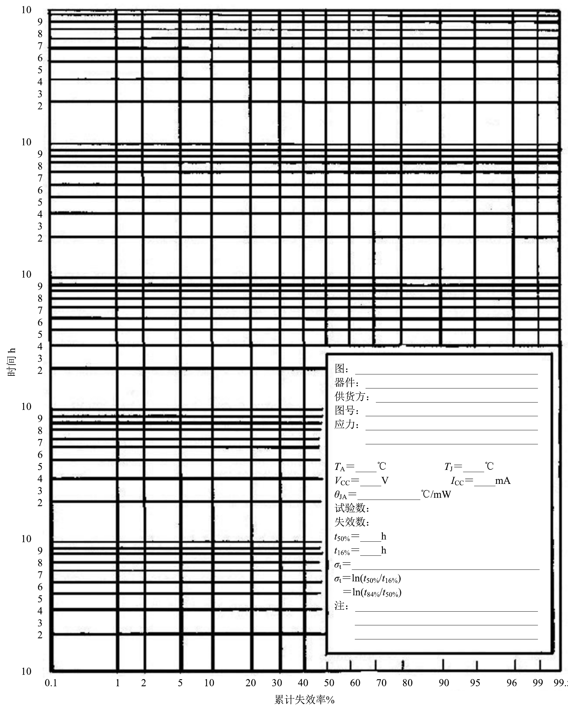

### 4 说明

有关订购文件应规定以下内容：a) 试验温度，并指明是环境或外壳温度。d) 若不是正常安装(见3.1)应规定试验安装方式。c) 终点测试(见3.3)。d) 中间测试(见3.3)。e) 若与器件规范极限值要求不同，则需规定终点和中间测试的失效判据(见3.3)。f) 试验样本(见3.4)。g) 适用时，规定对输入、输出、偏置试验电路和功耗的要求(见3.5)。

h) 数据分析要求， 包括:

1) 失效分析结果；

2) 数据计算： 随温度的对数正态变化关系； 反应率关系； 失效率与时间关系。

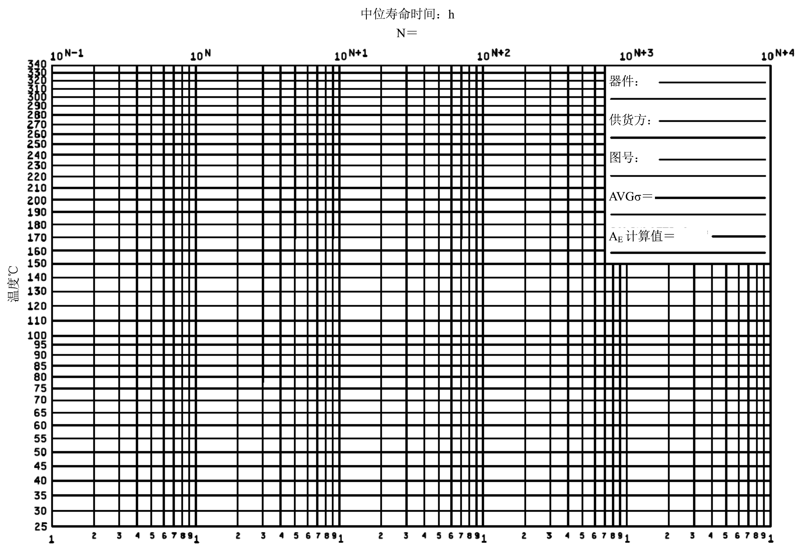

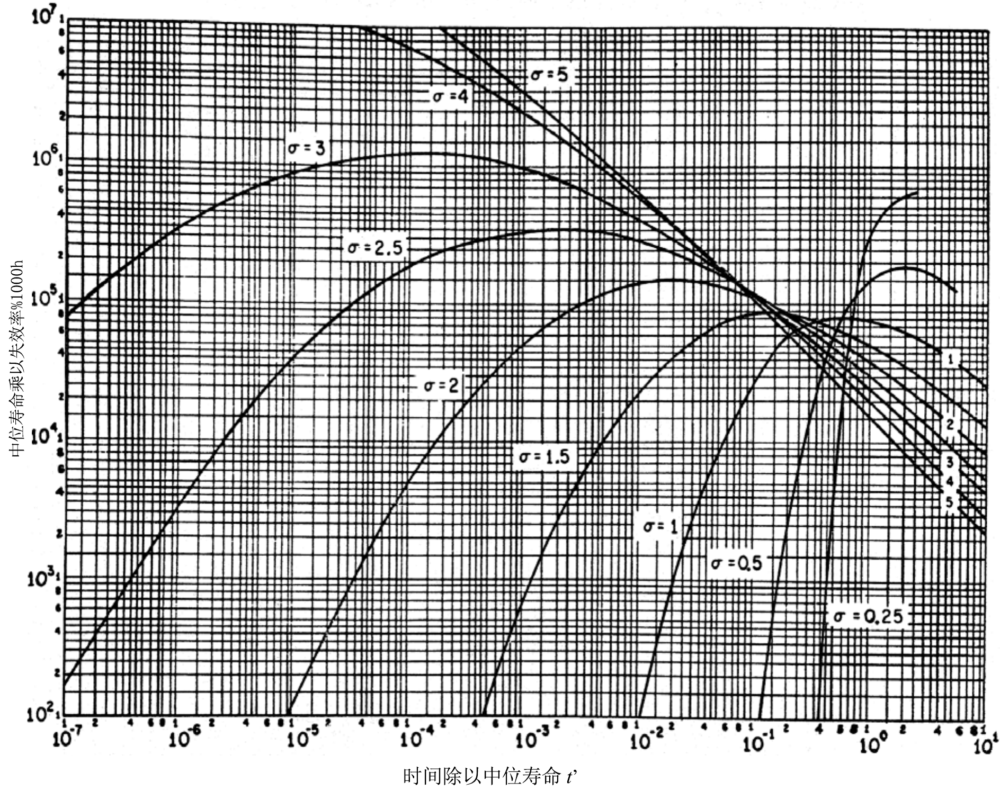

图3 对数正态分布失效率

## 方法1017.1 中子辐射

### 1 目的

本试验的目的是测定半导体器件对中子引起的非电离能量损失(non- ionizing energy loss, NIEL)导致性能退化的敏感度。这里所描述的试验方法适用于集成电路、晶体管和二极管。本试验为破坏性试验，用于检测和测量半导体器件关键参数与中子注量之间的关系；确定规定的半导体器件参数在接受规定等级的中子注量辐射之后是否在规定极限值之内(见第4章)。

### 2 术语和定义

下列术语和定义适用于本方法。

### 1MeV等效中子注量 the1MeVequivalentneutronfluence

半导体材料接受具有能谱分布的各种不同能量中子注量的辐射，产生位移损伤，用产生与此相同位移损伤的1MeV中子注量表征。

### 3 设备

### 3.1 测试仪器

辐射试验中采用的测试设备应是能测量所要求的电参数的实验室通用电子仪器，如电源、数字电压表和皮安培计。参数测试方法和校准应按本标准或GJB128B- 2021中相应部分的要求。

### 3.2 辐射源

试验采用的中子辐射源应经过充分评估，可以产生宽中子能谱(例如TRIGA反应堆或快中子反应堆)，或单能中子谱(例如氘( \(\mathrm{DT}\) )或氘( \(\mathrm{DD}\) )加速器)，并经过比对能将输出注量转化为1MeV等效中子注量。中子谱的不确定度采取按能量相关的协方差矩阵形式描述。中子源在使用前，应确定每单位中子注量的伴生电离辐射量。若每 \(1\times 10^{12} / \mathrm{cm}^2\) (1MeV等效)中子注量对应的电离总剂量(TID)超过5Gy(Si)时，则不应采用此类辐射源。可采用订购方接受的一种辐射源。

### 3.3 剂量测定设备

剂量测定设备有：a）快中子阈值活化箔，例如 \(^{32}\mathrm{S}\) 、 \(^{54}\mathrm{Fe}\) 和 \(^{58}\mathrm{Ni}\) b) \(\mathrm{GaF}_2\) 热释光剂量计(TLD)；c) 适用的活化箔计数及TLD读出设备。

### 3.4 剂量测定

### 3.4.1 中子注量

通过测定与被试器件同时受辐射的快中子活化箔如 \(^{32}\mathrm{S}\) 、 \(^{54}\mathrm{Fe}\) 和 \(^{58}\mathrm{Ni}\) 中感生的放射总量可获得用于器件受辐射的中子注量。把活化箔中测得的放射量换算到中子注量的方法由有关标准给出。

由箔的放射量换算到中子注量，需预先知道入射到箔上的中子能谱。若中子能谱未知，则应采用GJB3495或其他适用方法确定入射在箔上的中子谱。一旦确定了中子能谱，并计算出1MeV等效中子注量，就应在随后的辐射中采用适当的监测用箔(如 \(^{32}\mathrm{S}\) 、 \(^{54}\mathrm{Fe}\) 和 \(^{58}\mathrm{Ni}\) )确定中子注量。使用活化箔来测量1MeV等效中子注量的方法仅当中子能谱保持不变时有效。

### 3.4.2 剂量测量

如果在器件辐射试验中要求检测吸收的 \(\gamma\) 射线量，那么就应采用 \(\mathrm{CaF}_2\) 热释光剂量计或等效的方法来确定。

### 4 程序

### 4.1 安全要求

4.1 安全要求经中子辐射的器件具有放射性。经历过辐射环境的试验样品或设备应按GB18871的规定进行处理和贮存。

### 4.2 试验样品

样品应符合器件规范要求。每个样品应单独编号，以便试验前后能够识别和比较。

### 4.3 辐射前

### 4.3.1 电测试

应按要求对每个样品进行辐射前的电测试，当规定了参数变化量 \((\Delta)\) 极限值时，应记录辐射前数据。

### 4.3.2 辐射准备

每个样品应不加偏压安装固定，并且其外引线或者全部短路，或者全部开路，MOS器件或含有MOS单元的任何微电路，其全部外引线应短路。应使用合适的夹具安装固定被试器件及必须的剂量测量设备。安装夹具的形状应取决于所采用的反应堆形式，并应与反应堆有关工作人员一起讨论决定。样品安装应使全部样品上的中子注量总变化不超过 \(20\%\) 。

### 4.4 辐射

4.4 辐射样品和剂量计应接受规定的中子注量辐射，若要求多次辐射，在每次辐射后应进行辐射后电测试（见4.5.1）。若要求使用剂量计，每个辐射等级使用一套新的剂量计。因为中子效应是累计的，所以必须确定每次附加的辐射量，以满足规定的总累计注量。全部辐射应在 \(24^{\circ}\mathrm{C}\pm 6^{\circ}\mathrm{C}\) 下进行，并推算出1MeV等效中子注量时的情况。为避免电离总剂量损伤对NIEL效应的干扰，样品接受的中子注量不应使其承受高于额定值 \(10\%\) 的电离总剂量。若有必要，允许采用屏蔽措施以降低伴生的 \(\gamma\) 总剂量辐射。

### 4.5 辐射后

### 4.5.1 电测试

只有在样品达到规定的安全标准后，才能把它们取走。从辐射起直至进行电测试，样品的温度必须保持在 \(20^{\circ}\mathrm{C}\pm 10^{\circ}\mathrm{C}\) 。规定的电测试应在完成辐射之后24h内完成。如果残余的放射性高于安全操作的规定，在试验后进行电测试前的经历时间可延长到一周。或者采取措施进行远距离测试。必须记录每个样品在每次辐射后的全部要求的数据。

### 4.5.2 异常分析

器件的参数退化特性超出预先确定的范围（如双极晶体管的 \(h_{\mathrm{FE}}\) 退化超过规定值），就应按方法5003进行失效分析。

### 4.6 报告

4.6 报告报告应至少包括器件型号、序列号、承制方、控制规范、日期代码和承制方给定的其他识别号。每张数据表应包括辐射试验日期、电测试条件、辐射级别环境条件以及测试数据。当不是采用规定的试验电路时，数据应附有参数测试电路。应在注册信息内给出所有异常事件的详细解释。

### 5 说明

有关订购文件应规定以下内容：a) 器件型号；b) 辐射前后需测量的电参数；c) 合格和失效判据，对被试器件的记录要求；d) 异常特性判据；e) 辐射等级；f) 测试仪器要求；g) 如不按3.3的规定，则规定辐射剂量计的要求；

h) 若不按本方法的规定， 则规定环境温度； i) 数据报告和数据提交方式的要求 (适用时) (见 4.6)。

## 方法1018.2 内部气体成分分析

### 1 目的

本试验的目的是检测密封金属或陶瓷器件的内部气体成分。其作用除了测定水汽含量以确定器件是否满足规定的水汽判据外，还可以测定除水汽外的其他气体。这些数据不仅能够反映密封工艺的质量，并且能提供关于器件内部气氛长时间下化学性质的稳定性信息。

本试验属于破坏性试验。

### 2 设备

### 2.1 质谱仪

### 2.1.1 谱范围

质谱仪可以读取到最小的谱范围应在 \(1\sim 100\) 原子质量单位(AMUs)。

### 2.1.2 检测极限

质谱仪能对给定的封装体积重复地检测出现定的水汽含量，其信噪比为 \(20:1\) 。例如对于 \(0.01\mathrm{cm}^3\) 封装体积，允许的水汽含量为 \(0.5\% (5000\mathrm{ppm})\) ，质谱仪的水汽含量检测极限应能达到 \(0.025\% (250\mathrm{ppm})\) 。

最小的封装体积被认为是最恶劣的检测环境。

### 2.1.3 校准

质谱仪应按以下程序进行校准：a）质谱仪应采用相同的灵敏度因子每年完成一次 \(0.45\% \sim 0.55\% (4500\mathrm{ppm}\sim 5500\mathrm{ppm})\) ， \(0.2\% \sim\)\(0.3\% (2000\mathrm{ppm}\sim 3000\mathrm{ppm})\) 和 \(0.7\% \sim 0.8\% (7000\mathrm{ppm}\sim 8000\mathrm{ppm})\) 范围的水汽含量校准。每个体积的封装模拟器都需要完成一次这样的校准以证实其线性响应并检测偏移量。每个水汽含量范围应至少采集3个数据点。封装模拟器应能对已知的水汽含量(偏差为 \(\pm 5\%\) )的标气进行连续取样排气，能重复性地产生至少三种封装模拟器内的气体体积(偏差为 \(\pm 10\%\) )。

b）水汽含量应由标准的产生方法(即两种压力、分配流量或低温法)建立。露点仪应由具有资质的机构至少一年校准一次。露点仪应有能力以 \(\pm 0.2^{\circ}\mathrm{C}\) 的准确度测定露点温度。系统应有一个与温度露点传感器相配合的压力传感器，其测量准确度在所测压力范围内应达到 \(\pm 2.54\mathrm{mm}\) 汞柱。另外，检测实验室应有一个程序，可通过露点仪的测量和压力的测量来计算水汽的浓度，按 \(10^{- 6}(\mathrm{ppm})\) 表示。

c）用其他气体进行的年度校准。对浓度大于 \(0.01\%\) 的所有气体都应进行校准，至少应包括3.4中列出的所有气体。通常情况下应在约 \(1\%\) 的浓度要求下进行校准，下列气体用其要求的特定浓度进行校准：碳氟化合物可在 \(0.02\% (200\mathrm{ppm})\) ；氨气可在 \(0.02\% (200\mathrm{ppm})\) ；氦气可在 \(0.02\% (200\mathrm{ppm})\) ；氩气可在 \(80\%\) ；氪气可在 \(10\%\) ；氧气可在 \(20\%\) 。

d）每日进行的校准检查。当日试验开始前应进行质谱仪的校准检查。方法是将水汽含量为 \(0.45\% \sim 0.55\% (4500\mathrm{ppm}\sim 5500\mathrm{ppm})\) 的校准气体通入所需体积的封装模拟器进行水汽检测，并把检测结果与露点仪进行比较。水汽检测结果的偏差应在校准气体水汽含量的 \(0.025\% (250\mathrm{ppm})\) 以内。应确定仪器误差并将其从允许的最大偏差 \(0.025\% (250\mathrm{ppm})\) 中减去。应使用与被试器件相同的条件进行校准检查(如背景压力、背景环境、样品放入的间隔时间、封装模拟器体积等)。每日应对校准情况进行记录。

e）气体分析结果只有在由至少两个(体积或浓度)校准点所确定的水汽范围值或极限值内，才视为有效(例如在 \(0.01\mathrm{cm}^3 \sim 0.1\mathrm{cm}^3\) 封装模拟器体积范围校准 \(0.5\% (5000\mathrm{ppm})\) ，或在 \(0.01\mathrm{cm}^3 \sim 0.1\mathrm{cm}^3\) 封装模拟器体积范围校准 \(0.1\% \sim 0.5\% (1000\mathrm{ppm} \sim 5000\mathrm{ppm})\) 。体积校准点之间的值应采用最佳拟合曲线进行核准。应要求对校准点平均值偏差大于 \(10\%\) 的灵敏度因子进行修正。

f) 在设备重大维护或离子源维修后应进行精密度调校。

g) 关于灵敏度因子的变动都应进行记录。

### 2.2 真空室和传递通道

能放置器件的一个开口真空室和使器件与2.1中质谱仪相连接的真空传递通道。真空传递通道应能有效地将器件内的气体传送到质谱仪的离子源(防止明显的水汽吸附损失)。

对于系统的初始确认或检测能力的扩展，当使用外部夹具固定器件时，系统上的器件温度可通过将热电偶置入一个与被试器件具有类似质量、内部体积、结构和尺寸的空腔内进行表征，以保证器件温度在 \(100^{\circ}\mathrm{C}\pm 5^{\circ}\mathrm{C}\) 保持至少 \(10\mathrm{min}\) 时间。它也适用于检测在外部烘箱中预烘烤的器件在转移过程中温度的下降情况。这些记录应由检测实验室保留。

### 2.3 穿刺装置

一个工作在2.2描述的开口真空室或传递通道内的穿刺装置，其功能是刺穿器件的壳体(不破坏质谱室真空且不损坏管壳的密封介质),以使器件内部气体逸出进入真空室和质谱仪。

注：该尖头穿刺装置通过波纹管在真空室壁外进行移动操纵，用来刺穿金属或陶瓷外壳。对于陶瓷外壳或厚的金属外壳器件可以用砂磨法使之局部减薄以便穿刺。

### 2.4 压力传感器

在传递通道内放置一个压力传感器来测量试验中传递通道内压力的增加。这个压力传感器是用来读出在器件被刺穿后压力值的相对变化，当对比不同器件试验结果时，反映出器件内部的相对气体量。这个读数的意义不在于其绝对数值。尽管压力计读数需要给出，但它仅作为一种监测手段。

### 3 程序

### 3.1 一般要求

被试器件应是密封性合格的样品(按方法1014试验),并且不应存在可能影响水汽含量测定准确性的任何表面沾污。

不要求检测实验室按方法1014进行密封性试验。

建议提供被试器件附带其制造工艺的相关信息，包括密封压力、密封气体、内部空腔体积、穿刺点的盖板厚度、盖板材料和穿刺点位置。

### 3.2 预处理

所有的器件都要在试验前进行 \(100^{\circ}\mathrm{C}\pm 5^{\circ}\mathrm{C}\) 下 \(16\mathrm{h}\sim 24\mathrm{h}\) 的预烘烤。烘箱应有方法显示烘烤期间是否发生断电及温度低于 \(100^{\circ}\mathrm{C}\pm 5^{\circ}\mathrm{C}\) 的时间。如果器件温度低于 \(100^{\circ}\mathrm{C}\pm 5^{\circ}\mathrm{C}\) 超过 \(1\mathrm{h}\) ，则必须至少再烘烤 \(12\mathrm{h}\) 。

### 3.3 试验准备

器件从烘箱到安装在设备的时间不大于 \(5\mathrm{min}\) ，如果超过 \(5\mathrm{min}\) ，应重新烘烤到 \(100^{\circ}\mathrm{C}\pm 5^{\circ}\mathrm{C}\) 。

设备应能保持一个等同或高于器件温度的稳定温度。在开口真空室使用的夹具应按2.3描述的穿刺装置的要求安装器件，穿刺前器件在 \(100^{\circ}\mathrm{C}\pm 5^{\circ}\mathrm{C}\) 下至少保持 \(10\mathrm{min}\) 。

器件装好后，真空室需要抽真空，且在 \(100^{\circ}\mathrm{C}\pm 5^{\circ}\mathrm{C}\) 一直烘烤，直到背景压力水平不会影响获得规定的测量准确度和灵敏度。需要采集背景真空的质谱，并在稍后器件质谱中将其扣除。

### 3.4 器件刺穿

抽真空后，对器件的外壳或盖板进行刺穿，然后用质谱仪测量所释放出的气体含量。检测出的水汽含量，按单位体积的百分比或总体气体成分的 \(10^{- 6}(\mathrm{ppm})\) 表示。

除水汽外其他气体的比例(按体积):氮、氨、质量数69的碳氟化合物、氧、氩、氢、二氧化碳、甲烷、氨和其他溶剂(必要时)。所有出现的气体都应计算并在检测报告中给出。应对数据做简化处理，以消除其他气体裂解图谱对计算水汽含量的影响。对任何与系统相关的影响(如内部环境中氢气的存在)都应进行数据的修正。

刺穿器件封装释放气体时真空室压力将增加。当出现实际的压力变化比预期的器件空腔体积释气增压改变 \(\pm 25\%\) 情况时，可能是以下原因造成:a) 器件外壳未完全刺穿；

b) 器件外壳不密封；

c) 器件内未包含常规的内部压力。

### 3.5 情况处理

检测实验室应提供对未知或已存在但未达到识别浓度的气体质谱的描述说明。如果实验室有理由认为试验结果是无效的，例如对器件不适当的穿刺或设备的不正常工作而导致的情况，试验结果应报告为"无效试验"并提供附加的说明。可替换器件进行重新试验。

### 3.6 失效判据

除另有规定外，检测实验室一般不判定器件合格或不合格。

如果一只被试器件在同一批次中显示异常低的压力变化，如3.4中的界定，构成密封失效而非内部气体失效，这样的器件可由同一批次中另外的器件替换，如果替换的器件显示正常的气体量，那么替代的和原来的器件均不视为内部气体控制失效。

### 3.7 执行规定

由鉴定机构对检测实验室能够实施本方法的能力(特定极限值及体积)进行认定。检测实验室的能力确认原则被设计为：在确定一个样品是否通过规定的极限值时，一个实验室与另一个实验室间的差别不超过 \(\pm 20\%\) 。高于或低于适用范围的水汽含量不得作为可依据的数据。超出范围的数据只表示一个相对的概念，仅在实验室内部的结果比较时才有用。

除另有规定外， \(0.5\%\) (5000ppm)的规范极限值可用于所有腔体体积。承制方可允许使用下面的修正因子，前提是这些修正因子的适用性应得到证明，并形成文件。

在烧结炉里密封的小于 \(0.01\mathrm{cm}^3\) 的器件空腔体积，修正因子按公式(1)计算:式中:

\(C_{\mathrm{T}}\) ——温度修正因子；

\(T_{\mathrm{r}}\) ——室内温度， \(^\circ \mathrm{C}\)

\(T_{\mathrm{s}}\) ——密封温度， \(^\circ \mathrm{C}\) 。

在真空环境下密封的所有尺寸的器件空腔体积，修正因子按公式(2)计算:式中:

\(C_{\mathrm{P}}\) ——压强修正因子；

\(P_{\mathrm{s}}\) ——密封压力， \(\mathrm{Pa}\)

\(P_{\mathrm{a}}\) ——大气压力， \(\mathrm{Pa}\) 。

如果使用了修正因子，则应按公式(3)计算修正后的水汽含量:水汽含量(修正后的) \(=\) 水汽含量(测得的) \(\times C_{\mathrm{x}}\) (3)

式中:

\(C_{\mathrm{x}}\) ——适用的修正因子( \(C_{\mathrm{T}}\) 或 \(C_{\mathrm{P}}\) )。

GJB 548C- 2021

### 4 说明

有关的订购文件应规定以下内容： 最大允许水汽含量(如不是 \(0.5\%\) (5000ppm))。

## 方法1019.3 电离辐射(总剂量)

### 1 目的

本试验规定了器件的钴 \(60(^{60}\mathrm{Co})\gamma\) 射线源电离辐射(总剂量)效应试验程序与要求，包括室温辐射试验、高温/低温辐射试验、加速退火试验和低剂量率增强效应(ELDRS)试验。对低剂量率情况或器件可能发生明显时变效应的其他特定应用情况，用加速退火试验方法评估器件的剂量率电离辐射效应非常重要。ELDRS试验用来确定双极工艺器件对低剂量率辐射增强损伤的敏感性。这里规定的程序只描述了稳态辐射模式情况，对脉冲辐射模式则不适用。本试验可使被辐射器件的电性能产生严重退化，因此本试验为破坏性试验。

### 2 术语和定义

下列术语和定义适用于本方法。

2.1 电离辐射效应 ionizing radiation effects由于辐射诱生电荷引起的器件电参数的改变，也称之为总剂量效应。

2.2 辐射中测试 in-flux test

辐射期间对器件进行的电测试。

2.3 内部辐射图形 internal dose pattern同状态向量相关的一种测试条件，用于指定在辐射期间逻辑电路内部所有单元的逻辑条件。

2.4 非辐射中测试 not in-flux test

除辐射期间以外的任何时间对器件进行的测试。

2.5 移位测试 remote test将器件从辐射位置移开后对器件进行的测试。

2.6 原位测试 in-situ test

器件在辐射位置进行的测试。

2.7 时变效应 time dependent effect(TDE)

辐射后，由于辐射诱生陷阱电荷的积累和(或)退火引起电参数明显退化。在辐射期间也会发生类似的效应。

2.8 加速退火试验 accelerated annealing test

利用提高温度加速时变效应的试验程序。

2.9 低剂量率增强效应 enhanced low dose rate sensitivity(ELDRS)

某一产品在剂量率低于 \(0.50\mathrm{Gy(Si)} / \mathrm{s}\) 时辐射产生的增强破坏。

2.10 过辐射试验 overtest根据规范规定的剂量和过辐射因子确定一个新的辐射剂量等级，器件必须通过该辐射剂量等级，才能按规范规定的剂量接收。如一个过辐射因子为1.5,则意味着器件必须要用规范规定剂量的1.5倍来进行试验。

2.11 参数 \(\Delta\) 值设计容限 parameter delta design margin(PDDM)

指应用于电参数辐射诱生变化的设计容限。PDDM2指在一个特定剂量率下辐射后的变化值乘以2再加上辐射前的值来判断器件是否超出了辐射后的参数极限。例如，辐射前的 \(I_{\mathrm{b}}\) 值是 \(30\mathrm{nA}\) ，辐射 \(200\mathrm{Gy(Si)}\) 后是 \(70\mathrm{nA}(I_{\mathrm{b}}\) 相差 \(40\mathrm{nA}\) ),那么对于PDDM2来说，其值应为 \(110\mathrm{nA}(30\mathrm{nA} + 2\times 40\mathrm{nA})\) 。如果可接收的辐射后参数极限为 \(100\mathrm{nA}\) ，那么这个器件为失效。

### 3 设备

### 3.1 辐射源

试验使用的辐射源应是钴 \(60(^{60}\mathrm{Co})\gamma\) 射线源的均匀场。除另有规定外，在器件被辐射范围内用辐射剂量系统测得的辐射场均匀性应为 \(10\%\) 。钴60源的 \(\gamma\) 射线场强度大小的变化为 \(\pm 5\%\) 。器件与辐射源之间位置的变化以及辐射吸收和散射材料的存在会影响辐射场的均匀度和强度。

### 3.2 辐射剂量测定系统

应提供适用的辐射剂量测定系统，且能够完成4.4规定的测量。

### 3.3 铅/铝 \((\mathrm{Pb / Al})\) 容器

被试器件应放在 \(\mathrm{Pb / Al}\) 容器内，以减小由低能散射辐射引起的剂量增强效应。容器外层要求至少为 \(1.5\mathrm{mm}\) 厚的铅，内层屏蔽层至少为 \(0.7\mathrm{mm}\) 厚的铝。这种 \(\mathrm{Pb / Al}\) 容器对Si以及对如 \(\mathrm{CaF}_2\) 产生近似的带电粒子平衡。在下述三种情况下应测量 \(\mathrm{Pb / Al}\) 容器的内部辐射场强度：a) 开始时；

b) 源变换时；

c) 源的方向或结构变化、容器和试验夹具变化时。

测量时应将剂量计(例如一个TLD)放置于器件辐射容器中靠近被试器件所在位置。如果能证明，低能散射辐射足够小，以至不会因剂量增强效应引起剂量测定误差，也可不使用 \(\mathrm{Pb / Al}\) 容器。

### 3.4 电测试仪器

所有用于电测试的仪器必须满足电参数精确测试所要求的稳定性、准确度和分辨率。需要在辐射环境中工作的仪器都要做适当的屏蔽。

### 3.5 试验电路板

在辐射期间或原位测试中，被试器件应安装或连接在带有给器件提供必要偏置的试验电路板上。除另有规定外，辐射期间器件所有的输入端以及其他可能影响辐射响应的引出端都应电连接，即不得浮空。电路板的几何尺寸和材料应能使被试器件受到均匀辐射。应使用良好的设计和结构以防止振荡、使漏电流减到最小、防止电损伤，并得到准确的测量结果。只有能抗辐射的并且没有显著漏电(相对于被试器件而言)的插座才能用来安装器件和连接带有相关电路的试验电路板。所有在辐射场中反复使用的设施应定期检查其物理和电学性能退化。试验电路板上除被试器件之外放置的所有元件应对累积辐射不敏感，或者对其进行辐射屏蔽。测试夹具应由不影响被试器件附近辐射场强度均匀性的材料制成。应在辐射场外测试夹具的漏电流。插座上不插装器件的情况下，使试验电路板与测试系统相连接，保证所有可能起作用的噪声源和干扰源存在的状态下，施加器件的最大偏置，任意两个引出端之间的漏电流应不超过器件规范中辐射前最小电流极限值的 \(10\%\) 。加速退火试验中为器件施加偏置的试验电路板应能承受加速退火试验的温度，在试验前后均应对试验电路板的物理和电学退化情况进行检查。

### 3.6 电缆

在辐射场中连接试验电路板和试验仪器的电缆应尽可能短。如果必须使用长电缆，可能需要采用线驱动器。电缆对地应具有小的电容和漏电流，并要求在导线间要具有低的漏电。

### 3.7 转接或开关系统

转接或开关系统应置于辐射试验场地的外部，在被试器件和测试仪器之间提供接口。它是整个测试系统的一部分，引出端之间的漏电应满足3.5中规定的限度。

### 3.8 环境试验箱

当需要进行时变效应试验时，环境试验箱应能使被试器件维持在选定的加速退火温度 \(\pm 5^{\circ}\mathrm{C}\) 范围内。当需要进行低温辐射试验时，环境试验箱应能使器件维持在选定的辐射温度 \(\pm 5^{\circ}\mathrm{C}\) 范围内。

### 3.9 辐射温度箱

在进行高温辐射试验时，使用的辐射温度箱在辐射过程中应能使被试器件维持在 \(100^{\circ}\mathrm{C}\pm 5^{\circ}\mathrm{C}\) 范围内。辐射前，温度箱应能以较快的速度使试验样品从环境温度升到辐射温度，辐射后应能在 \(20\mathrm{min}\) 内使其从辐射温度冷却到环境温度。在升温和冷却过程中， 应始终保持偏置。被试器件的升温、恒温、冷却过程可通过使用充入热、冷液体的热沉来实现， 或是采用交替充入热、冷空气的方法， 或是其他可以得到正确结果的方法。对于低温辐射试验， 温度箱应能使被试器件在辐射期间维持在所需低温的 \(\pm 5^{\circ}\mathrm{C}\) 范围内(比如， 液氮或液氮)。温度箱应能使被试器件在辐射后电参数测试期间维持低温。

### 4 程序

### 4.1 试验方案

应按规定的试验方案对被试器件进行辐射和加速退火试验(若要求进行时变效应试验时)。该试验方案阐述了器件描述、辐射条件、器件偏置条件、剂量测定系统、额定条件、测量参数和测试条件， 以及加速退火试验条件(需要时)。

### 4.2 被试器件的选择和传递

只有通过了试验方案中规定的电特性指标的器件才可作辐射试验。除另有规定外， 被试器件应从母体中随机抽取并具有相同的封装类型。每个器件应单独编号， 以便在辐射前后能进行识别比较。对于静电放电敏感器件类型， 应采用适当的传递措施以防止器件的损坏。

### 4.3 老炼

对于某些器件， 在老炼前和老炼后， 其总剂量辐射响应是不同的。除非以前有表征试验证明或设计上证明老炼对总剂量辐射响应的影响可以忽略(电参数符合辐射后规范), 否则必须做下述工作之一:

a) 承制方在进行总剂量辐射试验前， 应按规定条件对被试器件进行老炼；

b) 承制方应提供用户可以接受的修正因子， 把经过老炼器件的总剂量辐射效应的变化考虑进去， 修正因子用于修正未经老炼器件的辐射效应。

### 4.4 剂量测量

试验前应依据实际情况采用剂量测定仪器或用源衰变修正计算的方法， 确定被试器件所在位置的辐射场强度， 以保证符合试验等级和均匀性要求。应采用下述两种方法之一确定被试器件经受的剂量:a) 辐射期间用合适的剂量测定仪器测量；

b) 对原先的剂量测定值进行修正， 得到间隔时间中 \(^{60}\mathrm{Co}\) 源强度衰减。采取合适的修正方法将测量的或计算得到的剂量测试材料中的剂量转换为被试器件中的剂量。

### 4.5 辐射等级

被试器件应接受试验方案中规定的剂量等级( \(\pm 10\%\) 内)的辐射。如果需对一组被试器件辐射多次， 应在每次辐射后进行辐射后电参数测量。

### 4.6 辐射剂量率

### 4.6.1 通则

对于双极(或BiCMOS)线性或混合信号器件， 如果在最大剂量率不超过 \(0.5\mathrm{Gy(Si)} / \mathrm{s}\) 的应用场合中使用， 其辐射剂量率应按4.13的要求来决定。对低剂量率应用的器件， 除非它们已经被证明没有ELDRS效应， 否则就应使用条件C、条件D, 或条件E进行试验。同时包含MOS和双极结构的器件应要求进行多重试验条件的质量检验， 以确保ELDRS和传统MOS效应均被评价覆盖到。

### 4.6.2 条件A(标准条件)

该条件剂量率范围应为 \(0.5\mathrm{Gy(Si)} / \mathrm{s} \sim 3\mathrm{Gy(Si)} / \mathrm{s}\) 。在一个系列试验(分步辐射方式)中， 每个辐射等级的剂量率可能不同， 但是同一次辐射的剂量率变化不应超过 \(\pm 10\%\) 。

### 4.6.3 条件B

仅适用于MOS器件， 如果在预定应用中最大剂量率小于 \(0.5\mathrm{Gy(Si)} / \mathrm{s}\) ， 经试验相关方商定， 试验的剂量率可以大于或等于预定应用的最大剂量率。除非满足 \(4.12.2\mathrm{b}\) 的例外条件， 否则应执行4.12.3的加速退火试验。

### 4.6.4 条件C(替代条件)

该条件应在试验相关方都允许的指定剂量率下进行。

### 4.6.5 条件D

仅适用于双极(或BiCMOS)线性或混合信号器件，辐射剂量率应不大于 \(0.0001\mathrm{Gy(Si)} / \mathrm{s}\) 。

### 4.6.6 条件E

仅适用于双极(或BiCMOS)线性或混合信号器件，可以按加速试验条件(由4.13.3的表征试验确定)进行辐射。加速试验条件包括高温辐射等。

### 4.7 温度

### 4.7.1 室温辐射

由于辐射效应与温度有关，被试器件在辐射时，从试验箱中靠近夹具的位置测得的环境温度应为 \(24^{\circ}\mathrm{C}\pm 6^{\circ}\mathrm{C}\) 。应在 \(24^{\circ}\mathrm{C}\pm 6^{\circ}\mathrm{C}\) 的环境温度下对被试器件进行电测试。如果采用移位测试，不允许被试器件的测试环境温度比辐射温度高 \(10^{\circ}\mathrm{C}\) 。若要求其他温度范围，应作出规定。

注：在高于辐射温度的环境温度中，退火可能非常明显，特别是对于低剂量率条件(条件D)下的长时间试验。为了使退火效应减少到最低程度，将器件温度保持在上述温度范围内非常重要。

### 4.7.2 高温辐射

对双极(或BiCMOS)线性或混合信号器件，采用条件E进行高温辐射试验，被试器件接受辐射的环境温度应按表征试验(见4.13.3)的结果来确定，应在试验箱中靠近夹具的位置测量环境温度(升高和降低辐射温度的详细要求见3.9)。

### 4.7.3 低温辐射

对于工作在低温环境中的被试器件，被试器件应在低温下进行辐射(见3.9)，辐射后性能测试时也应维持低温(见4.10)。在整个辐射和性能测试期间被试器件应维持低温，直至总剂量试验和性能测试结束。

### 4.8 电测试

### 4.8.1 通则

试验方案里应规定需要进行的电参数测量和功能测试。在器件规范中提供的测试条件下，至少测试一个比对器件，以验证测试系统和辐射前后数据的有效性。对自动测试仪器，如果已对器件结温上升进行了最小化处理，则可不限制测试顺序。对手动测试，参数测量顺序应使测试时间最短。当进行一系列测试时，应最先进行功耗最低的测试项目，并按功耗逐渐增加的顺序安排测试。应在同一测试系统上完成辐射前后的电测试。对一系列辐射试验的测试，其测试顺序应保持一致。应视情况进行脉冲方式的电参数测试以使发热和后续的退火效应减至最小。对需要进行加速退火试验(见4.12)的器件，辐射前应进行老炼试验以消除与老炼相关的失效。

### 4.8.2 测试方式

### 4.8.2.1 一般考虑

应在试验方案中指定辐射中测试或非辐射中测试(这取决于器件的预定应用环境，试验获得的数据正是为此服务)。辐射中测试可避免辐射后时变效应导致的变化。但是，辐射过程中器件处于静态偏置，如果电测试需要动态偏置的时间占辐射总周期的比例较大，这种测试会引入误差。移位测试一般可进行更全面的电测试，但是当发生严重的辐射后时变效应时，可能导致错误的测试结果。

### 4.8.2.2 辐射中测试

在辐射前应按规范检查每一个器件的工作状态。当辐射中测试的整个系统就位后，应检查电路连接的正确性、漏电(见3.5)和噪声电平。为确保工作正常及装置的稳定性，用电参数值已知的比对器件按试验方案中所要求的全部测试项目进行验证性测试。应在插入被试器件之前或辐射完成移走器件后，或者两种情况都进行这种验证测试。

### 4.8.2.3 移位测试

除另有规定外，在将器件从辐射源转移到移位测试设备或从移位测试设备移回辐射源的过程中，应去除器件偏置并将器件引出端置于导电海绵中(或类似短接状态)。该方法可以使辐射后时变效应最小化。

### 4.9 偏置和负载条件

辐射或加速退火试验期间，器件偏置条件应在试验方案规定的 \(\pm 10\%\) 以内。应按如下原则为器件施加偏置：给器件施加的偏置、负载、内部辐射图形应使器件产生最大的辐射诱生损伤，或产生在预定应用环境下的最坏情况损伤(如果已知)。在整个分步方式的辐射试验和退火过程中，偏置、负载、内部辐射图形应保持一致。如果偏置、负载、内部辐射图形等条件的任何一个不是处于最坏情况条件，在试验方案和试验报告中应给出条件选择的合理理由。最大电压通常是最坏情况条件，然而对于一些双极线性器件参数(例如输入偏置电流或最大输出负载电流),在0V偏置时的退化更明显。应按试验方案要求给每一个器件施加规定的偏置条件。应在辐射即将开始前和辐射刚刚结束后检查偏置情况，并注意在选择和施加偏置时使结温的升高减至最小。

### 4.10 辐射后测试的程序

除另有规定外，应遵循下述时间间隔:a) 对条件A,辐射结束到电测试开始的间隔时间应不超过1h。对条件B、条件C、条件D和条件E,如果间隔超过1h,辐射结束到电测试开始的间隔时间可以等于辐射时间的10%,最多不能超过72h,否则也不应超过1h。对条件A、条件B、条件C、条件D和条件E,如果进行移位测试，可以选择将器件保存到干冰中，但是必须在辐射后15min内将器件包裹好。保存在干冰环境内的器件引线应短接，并维持器件的温度不高于 \(-60^{\circ}\mathrm{C}\) 。电测试应在器件温度恢复到室温的情况下进行，但温度的恢复时间必须控制在30min以内，并且从辐射结束到电测试开始的时间间隔不得超过72h,电测试应按4.7.1的要求进行。选择干冰保存的测试方式时，如果经过表征试验，处于室温的时间、以及在干冰中保持的温度和时间也可以与上述要求不同。具体见4.10c)。

b) 对条件A,前一次辐射结束到后一次辐射开始的时间间隔应不超过2h。对条件B、条件C、条件D和条件E,如果间隔超过2h,前一次辐射结束到后一次辐射开始的时间间隔可以等于前一次辐射时间的20%,最多不能超过120h,否则也不应超过2h。对条件A、条件B、条件C、条件D和条件E,当分步辐射的中间电测试采用移位测试时，可以选择将器件保存到干冰中，但是必须在电测试后15min内将器件包裹好。保存在干冰环境内的器件引线应短接，并维持器件的温度不高于 \(-60^{\circ}\mathrm{c}\) 。辐射应在器件恢复到室温的情况下进行，但温度的恢复时间必须控制在30min以内，并且从上次电测试结束到下一次辐射开始的时间间隔不得超过72h。选择干冰保存的测试方式时，如果经过表征试验，处于室温的时间、以及在干冰中保持的温度和时间也可以与上述要求不同。具体见 \(4.10\mathrm{c}\) )。

c) 如果使用干冰保存器件，应通过针对性的退火表征试验，证明退火对所有关键参数的变化影响小于辐射后1h内室温参数测量值的10%。如果采用4.10a)和4.10b)中所列的其他时间和温度条件，这些条件应经过表征。但是，辐射后到电测试开始的间隔时间不应超过72h,并且对分步辐射试验，上次辐射结束到下一次辐射开始的间隔时间不应超过120h。例如，可以允许承制方的低温规范限高于 \(-60^{\circ}\mathrm{C}\) 。另例，如果器件按条件A进行辐射后，在室温下退火不明显，也可以对1h和2h的限制加以适当放宽。对任何除4.10a)和4.10b)中所列的其他时间和温度条件，必须能够证明，对所有的关键参数，同辐射后1h内的室温测试数据比较，这些条件产生的退火变化在10%以内。如果采用1h以后的测试数据作为比较基准，则应对辐射试验时间进行适当地加严限定。表征试验的结果应包含在4.14的试验报告中。

为使时变效应减至最小，以上时间间隔应尽可能的短。对一系列试验(分步辐射方式),每次辐射试验的参数测量顺序应保持一致。

### 4.11 补充室温退火试验

### 4.11.1 概述

4.11.1 概述对某些低剂量率辐射环境(如空间应用的辐射剂量率),标准条件试验被认为过度保守。即使试验是在较高辐射剂量率下进行(比如 \(0.5\mathrm{Gy(Si)} / \mathrm{s} \sim 3\mathrm{Gy(Si)} / \mathrm{s}\) ),补充室温退火试验仍可估计在非常低剂量率环境下的器件特性。该程序包括：先按标准条件步骤进行辐射试验，辐射后将器件置于室温环境进行一定时间(见4.11.3c))的退火，该过程可以使那些漏电相关、超过辐射前规范值的参数返回到规范要求之内。

### 4.11.2 需要进行补充室温退火试验的情况

应根据如下标准来确定是否需要进行补充室温退火试验的情况:a) 退火试验程序适用于MOS或双极工艺器件。

b) 退火试验程序仅适用于参数失效(而非功能失效)情况。试验的相关方应采取适当步骤以确定被试器件在整个总剂量试验过程中只发生了参数失效。

c) 退火试验程序适用于用被试器件自然退火响应来修正参数响应超出规范值的情况。而且，对预定应用环境辐射剂量率很低，而辐射诱生陷阱正电荷的室温退火会导致器件性能的明显改进，该退火试验程序会导致较高的器件接收率。当预定应用环境辐射剂量率比试验剂量率低，且低于 \(0.001\mathrm{Gy(Si)} / \mathrm{s}\) 时，应考虑使用该程序。试验相关方应采取合适的措施确保其试验技术在整个总剂量试验范围内，能获得所要求的退火响应。

### 4.11.3 补充室温退火试验程序

如果器件在标准条件规定的辐射试验中失效，则可能需要按如下步骤附加室温退火试验:

a) 在完成标准条件的辐射和测试后，使试验样品在最坏情况静态偏置条件下进行室温退火试验。关于最坏情况偏置的要求见4.9。

b) 试验进行的方式应使试验样品始终处于 \(24^{\circ}\mathrm{C} \pm 6^{\circ}\mathrm{C}\) 的温度范围内。

c) 如果可能，室温退火试验时间应尽量长，以使超出辐射前器件规范值的参数返回至规范值或承制方给出的辐射后参数极限值(PIPL)以内。注意，室温退火试验的时间不应超过 \(t_{\mathrm{max}}\) ，按公式(1)计算:式中:

\(D_{\mathrm{spec}}\) ——器件规范规定的总剂量值；

\(R_{\mathrm{max}}\) ——预定应用时的最大辐射剂量率。

d) 按4.8的规定测试器件的电性能。如果试验样品在进行补充室温退火后通过电测试，尽管器件在标准条件辐射试验过程中发生电参数失效，但对极低剂量率环境应认为可接受该批次的器件。

### 4.12 MOS加速退火试验

### 4.12.1 概述

MOS加速退火试验程序提供了一种在低剂量率环境下MOS微电路性能最坏情况退化的评价方法。该程序包括辐射后按规定的温度、时间和偏置条件加热器件。对TDE会导致器件严重退化或失效的情况，应进行加速退火试验(4.12.3)。对于已知TDE不会导致器件性能严重退化或失效的情况，或者4.12.2中规定不需要考虑TDE的情况，只需按标准条件进行试验。

### 4.12.2 需要进行加速退火试验的情况

试验各方应采取合适的步骤确定是否需要进行加速退火试验。应采用下列判断标准:

a) 任何含有MOS电路单元(如晶体管或电容器)的器件或电路应进行4.12.3规定的试验。

b) 在如下任一情况可不考虑TDE:

1) 已知器件的电路设计中不包含MOS单元。

2) 已知应用环境的总剂量不超过 \(50\mathrm{Gy(Si)}\) 。

3) 已知器件在辐射环境服役的总寿命小于TDE时间。

4) 按预定应用环境的剂量率进行辐射试验。

5) 通过表征试验， 业已证明， 该器件类型或IC工艺， 并未表现出器件参数TDE变化大于试验误差(或大于规定的上限), 而且也已证明影响TDE响应的变量对于特定的生产工艺过程已处于受控状态。作为起码要求， 上述表征试验应包括评价TDE对传输延迟、输出驱动、最小工作电压参数的影响、对影响TDE变量的连续工艺控制状态可通过MOS测试结构的辐射加固批取样试验得到证明。

c) 对不包含MOS单元器件的加速退火问题， 本方法未提供指导意见。

如果器件按试验方案或相关规范中规定的总剂量等级通过了标准条件或4.11(若使用了该程序)试验， 且不属于4.12.2中规定可不进行TDE试验的情况， 应按4.12.3进行加速退火试验。

### 4.12.3 加速退火试验程序

### 4.12.3.1 过辐射试验

按如下步骤进行过辐射试验:a) 按标准条件对每一个被试器件附加0.5倍规定总剂量的额外总剂量辐射。注意， 该过程不需进行电测试。

b) 如果通过表征试验证明如下结果， 可不进行4.12.3.1a)的0.5倍总剂量额外辐射:器件传输延迟、输出驱动和最小工作电压等参数向辐射前恢复的量值均不大于按4.12.3.2加速退火试验的恢复量值， 并且辐射和加速退火试验所选择的偏置应使这些参数在加速退火过程中的响应达到最坏情况。

c) 表征试验应在规定的辐射等级下进行。应至少包括静态和动态偏置情况下的辐射试验， 辐射后接着进行最坏情况静态偏置加速退火试验(4.12.3.2的条件)。

### 4.12.3.2 加速退火

按下列条件之一， 在环境试验箱内对每个器件在最坏情况静态偏置条件下加热:a) \(100^{\circ}\mathrm{C}\pm 5^{\circ}\mathrm{C}\) , \(168\mathrm{h}\pm 12\mathrm{h}\)

b) 替代环境温度和时间条件， 经过表征试验证明采用与4.12.3.2a)导致等同或较大参数(如传输延迟、输出驱动、最小工作电压)变化的环境温度和时间条件；

c) 通过对相同工艺NMOS晶体管的表征试验确定， 采用能够导致陷阱空穴退火大于 \(60\%\) 、且界面态退火小于 \(10\%\) 的环境温度和时间条件， 应证明测试晶体管的辐射响应能代表被试器件的辐射响应。

### 4.12.3.3 电测试

加速退火试验后， 应按4.8的规定进行电测试。 MOS器件和双极数字器件总剂量辐射试验流程见图1。

4.13 预定应用环境剂量率低于 \(0.5\mathrm{Gy(Si)} / \mathrm{s}\) 的双极(或BiCMOS)线性或混合信号器件的试验程序(ELDRS试验)

### 4.13.1 概述

很多双极线性器件都表现出ELDRS现象， 该现象不能像MOS器件那样采用 \(0.5\mathrm{Gy(Si)} / \mathrm{s}\sim 3\mathrm{Gy(Si)} / \mathrm{s}\) 的室温辐射配合加速度退火试验来模拟。对表现出ELDRS现象器件的辐射试验方法为： 使用预定应用环境的辐射剂量率试验、按规定的低剂量率过辐射水平试验， 或加速试验(比如高温辐射试验， 需要规定参数 \(\Delta\) 设计裕量(见4.13.3, ELDRS器件表征试验))。如果不能确定器件是否会表现出ELDRS现象， 应采用判定试验来确定(见4.13.2)。

对以下情况可不进行4.13的ELDRS试验:a) 已知器件设计不包含双极晶体管；b) 已知器件设计不包含任何线性电路功能；c) 业已证明，该器件类型或 IC 工艺，并未表现出器件参数 ELDRS，而且也已证明影响 ELDRS 响应的变量对于特定的生产方工艺过程已处于受控状态。

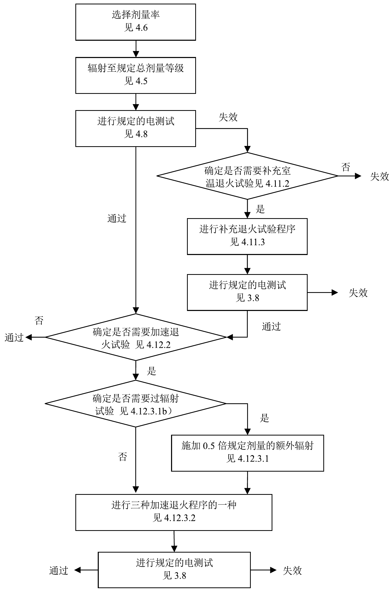

### 4.13.2 确定器件是否有ELDRS现象的判定试验

如果按4.13.1中的判据不足以排除器件需进行ELDRS试验，那么应根据判定试验来确定器件是否表现出 ELDRS 现象。应在两种剂量率下进行该试验：从最近生产的代表产品中最少随机选择 21 个器件样品。如果得到试验相关方的允许可减少试验样品数。所有器件应从已进行过高温可靠性筛选试验(如老炼和高温贮存)的产品中选取。将样本分为 4 组，每组 5 个样品，剩下 1 个器件用作测试比对。所有器件应经过 A 组电测试合格。对 10 个样品在室温下以 \(0.5\mathrm{Gy}(\mathrm{Si}) / \mathrm{s} \sim 3\mathrm{Gy}(\mathrm{Si}) / \mathrm{s}\) 的剂量率进行辐射，其中 5 个样品设置为 0V 偏置，另 5 个样品按相关规范进行偏置设置。再对另外 10 个样品在室温下以小于或等于 \(0.0001\mathrm{Gy}(\mathrm{Si}) / \mathrm{s}\) 的剂量率进行辐射，其中 5 个样品设置为 0V 偏置，另外 5 个样品按相关规范进行偏置设置。所有样品的总剂量辐射等级应相同，包括 0.5 倍或 1 倍预设定剂量，辐射后对每一个样品进行相同的电测试。在低剂量率试验考虑用条件 D 的场合，应按 3.10 的规定进行辐射后电测试。在每个辐射等级对每个器件计算每一个参数的辐射感生变化( \(\Delta\) 值)。在每个辐射等级对不同偏置组计算低剂量率中位 \(\Delta\) 值和高剂量率中位 \(\Delta\) 值的比值。如果对任意敏感参数该比值超过 1.5，则认为该器件对 ELDRS 敏感。当按规范给定的低剂量率进行试验时，若参数变化小于试验误差范围或仍在辐射前规范限内，则该试验不适用。

### 4.13.3 确定 ELDRS 器件生产或批接收辐射试验条件的表征试验

如果器件具有 ELDRS 现象或按 4.13.2 进行判定试验时表现出 ELDRS 现象，则可直接(不经过表征)使用剂量率小于或等于 \(0.0001\mathrm{Gy}(\mathrm{Si}) / \mathrm{s}\) (条件 D) 的低剂量率试验，或采用加速试验(条件 E) 进行生产或批接收试验。选择的加速试验方法，应经过详细的表征以确定试验条件。加速试验的方式可选下列方法之一：a) 剂量率大于 \(0.0001\mathrm{Gy}(\mathrm{Si}) / \mathrm{s}\) 的室温低剂量率辐射试验；

b) 高温辐射试验；

c) 高剂量率辐射和高温退火的组合试验；

d) 变剂量率试验；

e) 其他形式加速试验。

ELDRS 的表征试验必须表明，使用剂量率小于或等于 \(0.0001\mathrm{Gy}(\mathrm{Si}) / \mathrm{s}\) 、附加过辐射因子和/或参数 \(\Delta\) 值设计裕量的组合方法下，生产或批接收试验的辐射试验程序可界定所有关键电参数的低剂量率响应。因此，作为比对的基准，表征试验应包括以小于 \(0.0001\mathrm{Gy}(\mathrm{Si}) / \mathrm{s}\) 的剂量率达到规范中要求的总剂量水平的辐射试验。

### 4.13.4 双极(或 BiCMOS)线性或混合信号器件的低剂量率或高温辐射试验

具有 ELDRS 特性的器件应按如下任意一个条件进行试验：a) 商定的剂量率试验以 4.6.4 条件 C 进行辐射试验。

b) 规定的低剂量率试验以 4.6.5 条件 D 进行辐射试验，并附加 1.5 倍过辐射因子，即只有通过 1.5 倍规范规定总剂量试验的器件，才可接收。

c) 加速试验以 4.6.6 条件 E 进行加速条件的辐射试验，并附加参数 \(\Delta\) 值设计裕量和(或)过辐射因子(见 4.13.3)。

双极(或 BiCMOS)线性或混合信号器件总剂量辐射试验流程见图 2。

### 4.14 试验报告

试验报告应至少包括器件型号、编号、承制方、封装形式、产品规范、日期以及任何其他承制方给出的标识号码。应在报告中使用图表或框图等适当方式说明偏置电路、参数测试电路、测试设备的布局(包括距离的细节和使用的材料)、辐射中测试所使用电测试系统的噪声电平和漏电流。每份数据应包含试验日期、所使用的辐射源、辐射过程偏置条件、辐射及电测试过程器件的环境温度、每次辐射持续时间、辐射停止到电测试开始的间隔时间、电测试持续时间、采用分步辐射试验时电测试至下次辐射的间隔时间、辐射剂量率、电测试条件、剂量测定系统和程序、总剂量辐射等级等。记录每一个器件的辐射前、后数据，并与原始数据一并保存。应完全记录试验过程中发生的异常状况。当使用加速退火程序时，应进行描述。需要交货提供的其他辐射试验程序或测试数据应在器件规范或订购文件中说明。

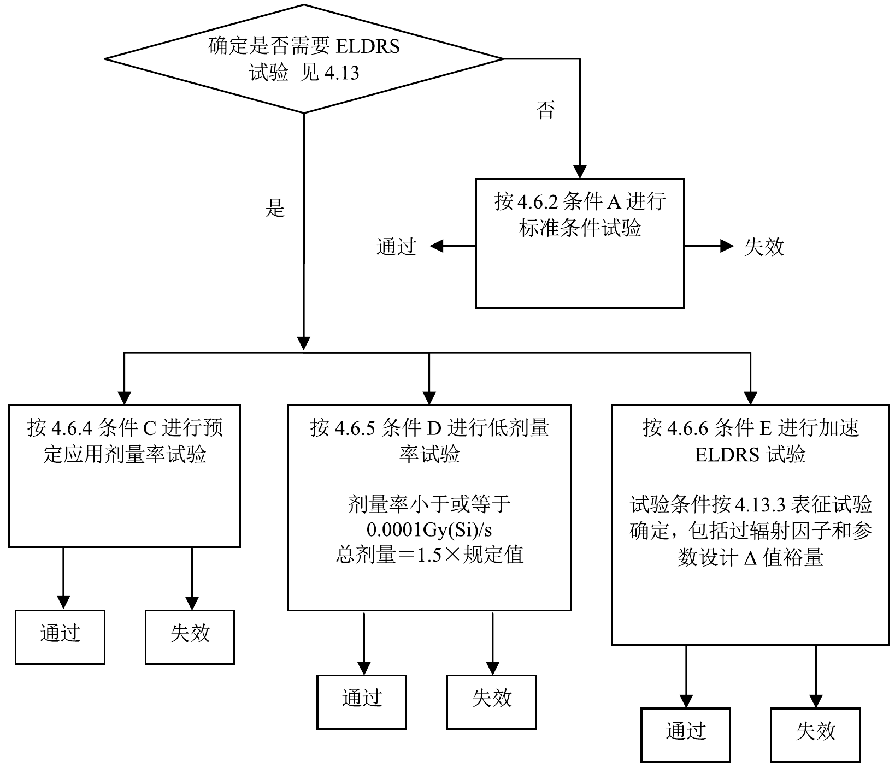

### 5 说明

有关订购文件中应规定以下内容:a) 器件型号、数量和产品规范(见4.2);

b) 剂量测量要求(见4.4);

c) 包括剂量和剂量率的辐射等级(见4.5和4.6);

d) 若与4.7规定不同，则应规定辐射、电测试和运输温度；

e) 待测电参数和测试期间的器件工作条件(见4.8.1);

f) 试验过程中的电测试方式，即采用辐射中测试或非辐射中测试(见4.8.2);

g) 辐射期间器件的偏置、负载和内部辐射图形条件(见4.9);

h) 辐射后测试的时间间隔(见4.10);

i) 需要时，补充室温退火试验要求(见4.11);

j) 需要时，加速退火试验要求(见4.12);

k) 需要时，ELDRS判定试验要求(见4.13.2);

l) 需要时，ELDRS表征试验要求(见4.13.3);

m) 与器件一起提交的其他文件(见4.14)。

## 方法1020.2 剂量率感应锁定

### 1 目的

本试验规定了进行微电路锁定的试验要求与程序，以确定器件对剂量率感应锁定是否敏感。

### 2 术语和定义

下列术语和定义适用于本方法。

### 2.1 剂量率 dose rate

给定材料的单位质量在单位时间内从其受辐射的辐射场中吸收的能量。

### 2.2 剂量率感应锁定 dose rate induced latchup

由于电离辐射脉冲产生的光电流作用，使器件内寄生结构(例如 \(\mathrm{p} - \mathrm{n} - \mathrm{p} - \mathrm{n}\) 或 \(\mathrm{n} - \mathrm{p} - \mathrm{n} - \mathrm{p}\) 四层通路)导通，而且在光电流消失后仍维持一段不确定时间的导通状态。这是一种可恢复的器件效应。只要电源电压大于维持电压、电流大于维持电流，器件就维持锁定。锁定破坏了电路中某一部分的正常工作，并可能由于半导体区域、金属化层或键合线的局部过热引起器件致命损坏。

### 2.3 锁定窗口 latchup window

器件呈现锁定效应的特定剂量率范围。低于或超过该范围，器件都不发生锁定。一个器件可能表现有不止一个锁定窗口。在CMOS(包括侧壁氧化物隔离)逻辑器件和LSI存储器中均已观察到锁定窗口。在其他器件中也可能会出现这一现象。

### 2.4 恢复时间 recovery period

器件去掉辐射脉冲作用后电源电流恢复到规定范围所需的时间间隔。

### 2.5 维持电压和维持电流 holding voltage and holding current

维持锁定现象所需的最小电压和最小电流。

### 2.6 组合逻辑 combinational logic

输出状态仅取决于输入端的逻辑信号，不考虑开关延迟。组合逻辑器件不包含存储单元。常用的组合逻辑器件包括门电路、解码器和多路调制器等。

### 2.7 时序逻辑 sequential logic

在任意给定时刻的输出状态取决于前一时刻输入端所加逻辑信号的顺序和时间关系。时序逻辑器件包含内部存储单元。移位寄存器、存储器、计数器和触发器等均属时序逻辑器件。

### 3 试验方案

进行锁定试验前，应制定锁定试验方案。该计划描述了辐射源、剂量测试技术、采用的试验设备和条件。对要试验的每一种器件类型均应制定可作为整个试验方案的一部分或作为单独的试验程序文件。试验程序应包括偏置条件、试验顺序、试验装置图。试验方案应得到订购方认可。在试验方案或试验程序中至少应包括下述项目：a) 器件类型(包括封装类型)和试验的器件数。

b) 可追溯性要求，例如序列编号要求、晶圆或批次的可追溯性等。

c) 数据报告和提交的要求。

d) 试验温度(见4.3.7)。

e) 试验装置的方框图或线路图。

f) 需监测的电参数和器件工作条件，包括辐射脉冲作用前、作用期间和作用后的偏置条件和功能试验要求。

g) 锁定试验前和试验后的A组电测试要求，包括测试极限和失效判据。

h) 辐射脉冲宽度、每个脉冲的辐射量以及剂量率范围。

i) 每种器件类型的总剂量极限。

j) 失效判据。

k) 除了上述条款之外， 用于生产试验的试验方案还应包括下述各项:

1) 测试锁定的方法。例如， 监测电源电流、功能测试(包括测试向量组等)。

2) 恢复时间以及何时开始辐射后的现场测试。对小规模(SSI)器件， 恢复时间典型值为 \(50\mu \mathrm{s} \sim 300\mu \mathrm{s}\) ， 而其他类型器件可能需要更长的恢复时间， 否则就可能有尽早恢复的特殊程序要求。

3) 功能测试要求。功能测试应证明器件对输入命令的响应正确且工作正常。注意， 在长引线以及许多锁定试验系统中不可避免地存在分布电容， 使得高速功能测试结果不一定正常。

4) 辐射时电路工作状态和工作条件。对数字电路器件， 通常采用一个特定状态及其互补状态。然而， 对比较复杂的器件， 可能要求电路在两种以上的工作状态下接受辐射。这些特定状态的选取应通过表征试验确定， 需要时应进行分析， 并应在试验方案或程序中给予规定。

5) 偏置和负载条件。除另有规定外， 应采用最大额定工作电压。

6) 需监测的输出。

7) 电源必须能提供的最小直流电流， 或经订购方批准认可(注意， 任何限流电阻都应小于或等于器件在系统应用时的值， 并应在锁定试验前得到订购方批准)。

### 4 设备

### 4.1 辐射源

试验可采用下述两种辐射源中的一种： 闪光X射线机(FXR)或电子直线加速器(LINAC)。FXR应用于X射线模式， LINAC用于电子束模式。FXR峰值(终点)能量应大于或等于2MeV, LINAC束能量应大于或等于10MeV, 脉宽应为 \(20\mathrm{ns} \sim 100\mathrm{ns}\) (或按订购文件中的规定)。在器件接受辐射的空间中， 用剂量测试系统测得的辐射场均匀性应为 \(\pm 15\%\) 。每次辐射暴露的剂量应在试验方案或程序中规定(关于生产试验的要求见5.5.1)。

### 4.2 剂量测量系统

应采用剂量测量系统(如热释光剂量计等), 其测量准确度为 \(\pm 15\%\) 。采用经校准的PIN二极管、闪烁探测器或康普顿二极管可以获得辐射脉冲的形状和剂量。

### 4.3 锁定检测系统

### 4.3.1 概述

典型的锁定检测系统方框图如图1所示。检测仪器应能施加规定的检测条件， 测试并记录要求的参数。对瞬态和直流条件， 包括锁定条件， 测试系统应设计为能使瞬时偏置电源电压保持在4.3.3规定的范围内。测试系统不应将交流或直流偏置电流限制在使锁定不会发生或检测不出的数值。除了被试器件以外其他元器件应对预计使用的辐射等级不敏感， 否则应将其屏蔽。用于锁定检测的系统包括下面各部分。

### 4.3.2 器件接口夹具

用于被试器件与检测线路之间接口的夹具应具有良好的高频特性， 与电源之间实现低感连接并有旁路电容。

### 4.3.3 偏置和功能试验电路

试验电路应对每种类型的被试器件均能提供试验方案或程序中规定的最坏情况偏置和负载条件， 并能进行原位功能测试。需要时， 应使用线驱动电路将被试器件与电缆引起的较大附加负载相隔离。线驱动线路应具有良好的特性(例如线性度、动态范围、输入电容、瞬态响应、辐射响应)以保证不会降低测试准确度。电源应采用低源阻抗并满足下述要求:a) 在被试器件电源电流上升期间， 被试器件电源电压的降低不应超过 \(20\%\) 。在这以后的降低不应超过 \(10\%\) 。这些要求通过选择合适的电容器、减少稳定(抗干扰)电容器引线长度来满足。对于每种偏置电源应在被试器件侧放置一个高频、抗辐射电容器。较大的电容器可以放在距离辐射屏蔽装置较近的地方。

b) 直流电源应对器件工作提供足够的电流， 并在发生锁定时能保持维持电流。

c) 将数字电流表(电流探针或电流传感器)与电压源串联时， 电流表必须位于旁路电容的电源一侧。选用的电流表应在出现可能的最大负载电流时使串联直流压降减至最小。必要时， 可将电源电压值调整得稍高一些， 以保证在被试器件处测得的电压值在测试条件规定的范围。

d) 除非在锁定试验前已得到订购方的批准， 否则不得使用与电源电压串联的限流电阻。若使用， 则电阻值应小于或等于在系统中应用时的数值。当使用限流电阻时， 其放置位置应与被试器件足够靠近， 以保证瞬态光电流上升期间被试器件处的电压降是由电阻决定， 而不是引线电压。这时 \(4.3.3 \mathrm{a}) \sim 4.3.3 \mathrm{c})\) 的要求同样适用， 只是参考点应取为限流电阻与电压源相连的一端而不是被试器件引线。如果在实际应用时电压源引线端直接采用了小容量旁路电容， 则采用限流电阻时， 试验线路中也必须采用一个容量与其相等或更大的电容器。如上所述， 引线应取为实际可能的最短长度。如果采用了限流措施， 特别是作为防止锁定的一种方法时， 应进行表征试验， 以确定适用于生产试验的剂量率。

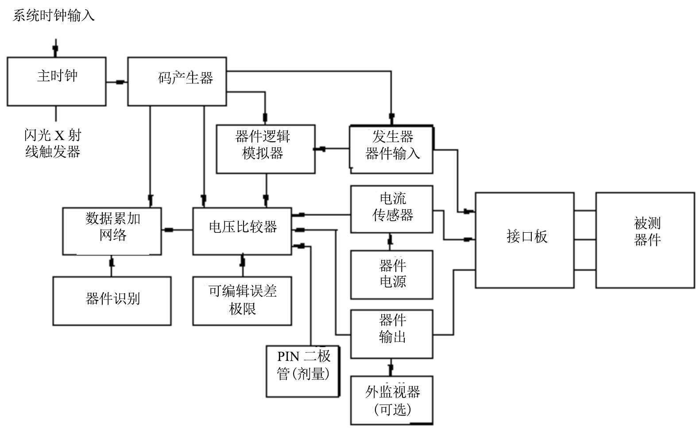

### 4.3.4 电缆

试验电路板与测试仪器间的连接应采用电缆。所有电缆应尽可能地短。在进行高速功能测试以及采用线驱动电路隔离监测设备的情况时， 应采用阻抗匹配同轴电缆。

### 4.3.5 监测和记录设备

试验方案或程序中规定监测和记录参数的设备应集成在锁定试验系统之中。可以采用示波器和瞬态数字化仪监测器件的瞬态响应。此外， 对应每个脉冲的剂量记录应与受该脉冲辐射的特定器件联系在一起。

### 4.3.6 定时控制系统

锁定试验系统应包括有可调的定时控制系统， 从而可在指定的时刻(一般是在辐射脉冲作用后

\(50\mu \mathrm{s} \sim 300\mu \mathrm{s}\) 进行辐射后的现场功能测试。对复杂的器件，完成功能测试可能要用较长的时间(可长达几分钟)。

### 4.3.7 温度控制系统

如果不是在室温下进行试验，应采用温度控制系统将被试器件的温度控制在规定温度的 \(\pm 10^{\circ}\mathrm{C}\) 范围内。在非室温时，锁定试验的温度应取为器件在系统应用中的最高器件工作温度或是比器件最高额定温度低 \(15^{\circ}\mathrm{C}\) (取低者)(见下注)。如果不知道或提供不了应用温度，则应在比最高额定温度低 \(15^{\circ}\mathrm{C}\) 下进行试验。为了保证器件工作温度不会高于最高额定温度，可以要求采用散热器。

注：通过锁定试验插座的热导通常比通过焊接板上外引线的热导小得多。

### 5 程序

### 5.1 器件识别

在所有情况下，对器件应编序列号，可用的试验记录数据应能追溯到每个器件。

### 5.2 辐射安全

所有人员应按GB18871及有关规定进行操作，以确保安全。

### 5.3 总剂量极限

除另有规定外，任何器件若接受超过总剂量极限值的 \(10\%\) 的辐射应认为是经受破坏性试验。对每个被试器件均应确定总剂量极限，并在试验方案中予以明确规定。

### 5.4 表征试验和分析

对每一个新的或不熟悉的器件类型都应进行表征试验，以确定其特性与剂量率的关系，并确定生产试验的要求。由于对不同的生产批，锁定效应也随之不同，所以应从生产批中提取表征试验的样品。下面是从表征试验中获得的信息实例。

a) 锁定阈值与辐射剂量、剂量率以及脉冲宽度的关系。

b) 锁定窗口的存在情况和剂量率范围。为了确定窗口大小，应在较宽的剂量率范围按较细的增量步长进行锁定试验。

c) 引起器件呈现锁定效应的最坏情况或唯一条件，例如工作电压、温度、偏置条件。

d) 检测锁定的方法，例如监测电源电流和(或)功能测试。现场功能测试必须足够充分，以确定在一个规模较大的电路中是否只有一小部分被锁定，从而并未引起足够大的附加电流，使器件电源电流未发生明显增加。

e) 锁定试验后的A组电参数退化。

f) 维持电流和维持电压。

对LSI/VLSI电路进行试验之前，通常应进行分析，确定可能的锁定通道以及偏置条件，辐射时的电路逻辑状态和功能试验几方面的要求。这些规模较大的电路通常需要分别监测的输出端很多，通过分析，就可以将需监测的输出端限制到那些最容易表现出锁定的输出端。

### 5.5 生产试验

### 5.5.1 通则

在生产试验之前，对于新的或不熟悉的器件类型(即新的设计或工艺过去很少或未进行过锁定试验的不熟悉的或很复杂的器件)至少要进行一次表征试验。表征试验的结果将用于确定生产试验的要求(见5.4)。在适用的试验方案或程序中应规定这些要求(包括第3章中列出的条款)。

除另有规定外，每个脉冲的剂量应为5Gy(Si) \(\pm 2\mathrm{Gy}\) (Si)，脉宽为 \(20\mathrm{ns} \sim 100\mathrm{ns}\) (包括上述范围两端的边界值)。应按试验方案或程序中的规定，(对逻辑器件)至少应使电路以两种不同的工作状态接受辐射脉冲的作用。除另有规定外，应根据被试器件电源电流、在规定时间范围内输出信号电压的恢复以及辐射后的现场功能测试这几方面的综合情况确定是否发生了锁定。在辐射后的现场测试结束之前，不得中断被试器件电压供给。应在辐射脉冲开始作用之前以及作用后的规定时刻测量被试器件电源电流，以确定电源电流是否已返回至规定的范围。在恢复以后立即进行功能测试，以确定器件功能是否正常。除另有规定外，器件的试验温度应取为其在系统应用时的最高器件工作温度或比器件最高额定温度低 \(15^{\circ}C\) (取其小者)。只有事先已得到订购方的批准，才可以使用限流电阻。且阻值应小于或等于在系统应用中的大小。除另有规定外，应在锁定试验前后均进行终点电测试(至少要按方法5005或GJB2438进行A1分组和A7分组测试)这些测试通常都不是在现场进行。对进行测试的时间也没有限制。如果这些测试是作为另一个测试的组成部分(例如：老炼后测试、最终电特性接收测试)，只要试验顺序是：A组测试- 锁定试验- A组测试，不需要重复进行A组测试。

### 5.5.2 试验顺序

### 5.5.2.1 设备验证

锁定试验系统包括试验电路、电缆、监测和记录设备。应进行合理组装，以提供规定的偏置和输出监测。

注意：在安置器件时，特别是将外引线与载体和夹具对准以及将器件连至测试线路中的时候，应特别小心。在插入器件时应保证断开偏置，遵循与被试器件级别对应的ESD处置步骤。

将被试器件放于特定剂量的位置，按第1步～第6步对系统进行验证：第1步：取走器件，加偏置，检查接口夹具处的偏置电压；

第2步：调整定时控制系统，提供辐射脉冲和辐射后测试之间所要求的时间间隔；

第3步：断开偏置电压，接入比对器件(与被试器件完全相同)；

第4步：接通偏置，根据特性要求，验证器件工作是否正常；

第5步：验证所有的记录、监测、定时控制设备等工作是否正常；

第6步：依次断开偏置，取走比对器件。

调整辐射源，使其按规定模式工作，产生规定的剂量，并按第7步进行验证：第7步：将剂量计放于接受辐射脉冲作用的合适位置，验证剂量记录设备是否能正常工作以及剂量是否合适。

当锁定试验系统，辐射源以及剂量测试系统已被证明能正常工作后，对每种被试器件类型继续下述试验步骤。

### 5.5.2.2 组合逻辑

对组合逻辑，应按下述步骤进行锁定试验：第8步：将被试器件放于辐射源前面的合适位置，使器件达到试验温度；

第9步：根据试验方案或程序的要求对器件施加偏置，验证器件工作是否正常；

第10步：按规定的测试向量加负载，并验证输出条件是否正确；

第11步：对器件进行辐射(维持上述输入条件)，按试验方案或程序的要求记录剂量和参数；

第12步：为了验证恢复时间，在辐射以后的规定时刻测试被试器件电源电流，验证电源电流和输出电压已返回至规定的范围以内；

第13步：再进行一次功能测试，确定器件是否能通过；

第14步：使器件工作于互补状态，重复上述第10步～第13步试验(在试验方案或程序中应规定需要被试器件的几种工作状态)；

第15步：依次断开偏置，取出器件。

如果恢复时间以后输出不能处于正常状态，不能通过辐射后的现场功能测试或电源电流在辐射以后的规定时间以内还不能回到规定的范围以内，则该组合器件视为未能通过锁定试验。

### 5.5.2.3 时序逻辑

对时序逻辑，应按下述步骤进行锁定试验：第8步：将被试器件放于辐射源前面的合适位置，使器件达到试验温度；

第9步：根据试验方案或程序的要求对器件施加偏置，验证器件工作是否正常；

第10步：按规定的测试向量加负载，并验证输出条件是否正确；

第11步：对器件进行辐射(维持上述输入条件)，按试验方案或程序的要求记录剂量和参数；

第12步：为了验证恢复时间，在辐射以后的规定时刻测试被试器件电源电流，验证电源电流和输出电压已返回至规定的范围以内；

第13步：进行功能测试，确定器件是否能通过；

第14步：将初始的输出条件变至其互补状态，重复上述第10步～第13步试验(在试验方案或程序中应规定要被试器件的几种工作状态)；

第15步：依次断开偏置，取出器件。

第15步：依次断开偏置，取出器件。对时序逻辑器件，辐射脉冲能引起输出端及内部存储寄存器的逻辑状态发生变化。因此必须由器件电源电流以及辐射后功能测试的综合结果确定辐射后的恢复验证。如果在规定的恢复时间内器件的电源电流尚未回到规定的范围或通不过功能测试要求，表示时序逻辑器件未能通过锁定试验。规定的电源电流范围应考虑到由于内部逻辑状态和内部寄存器的改变所引起的电源电流变化。

### 5.5.2.4 线性电路

由于线性电路的类别和应用条件繁多，这就决定了线性电路的锁定试验与器件及应用情况有关。要通过监测器件的电源电流和输出波形以及现场功能测试几方面综合效果检测线性器件中的锁定。在试验方案或程序中应规定最少需监测多少个输出端。但功能测试需对每一个输出端都要进行。采用带有快照功能的示波器或瞬态数字化仪监测器件输出的瞬态响应。图2是一个实例。图中A组图形表示辐射脉冲作用后，器件能正常工作。而B组图形为输出失效的情况。注意，辐射以后，对于振荡的输入，器件响应将不正常。线性器件的试验应按下述步骤进行：第8步：将被试器件放于辐射源前面的合适位置，使器件达到试验温度；

第9步：根据试验方案或程序的要求对器件施加偏置，验证器件工作是否正常；

第10步：按试验方案或程序中的规定调整输入信号，验证其输出电压是否正常；

第11步：对器件进行辐射，记录剂量，在辐射期间及辐射以后，监测电源电流和输出电压。测量电源电流和输出电压的恢复时间。监测输出波形；

第12步：在恢复周期过后，检测器件电源电流是否已返回至规定的范围；

第13步：确定输出电压是否在规定的恢复时间以内返回至规定的范围，验证器件对输入命令的反应是否正常，比较辐射前和辐射后的波形；

第14步：按试验方案或程序中的规定改变输入条件，重复上述第10步～第13步试验(在试验方案或程序中应规定要在几种条件下试验)；

第15步：依次断开偏置，取出器件。

如果电源电流或输出信号(或电压)不能在试验方案规定的恢复时间内恢复或者输出对输入信号的响应不正常。表示线性器件未能通过锁定试验。

### 5.5.2.5 其他器件类型

5.5.2.5 其他器件类型对其他类型的集成电路，例如LSI/VLSI以及更复杂的电路和混合集成电路，应通过表征试验和分析的综合结果确定：最坏情况偏置条件、接收辐射时的电路工作状态、需监测的输出、必须进行的辐射后测试以及失效判据。这些要求应在每种器件的试验方案或程序中予以规定。视器件类型的不同，按 \(5.5.2.2 \sim 5.5.2.4\) 中描述的步骤进行器件试验。

### 6 报告

6 报告应准备锁定试验报告，用器件类型、承制方、日期代码、生产批、晶圆批识别号表征被试器件。报告中应列出器件序列号、每个器件的通过/失效状态、每个辐射脉冲对每个器件的辐射剂量(或剂量范围)。试验方案和程序应附于试验报告之后，或者应在试验报告中被引用。

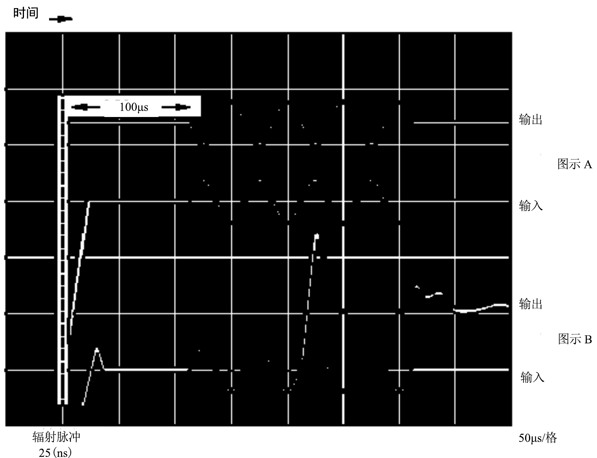

### 7 说明

有关的订购文件应规定以下内容：a) 器件型号和被试器件数；b) 试验温度(见4.3.7)；c) 可追溯性(器件编号、晶圆批/生产批编号等)要求以及数据报告和提交要求；d) 最大允许的恢复时间；e) 辐射脉宽和每个脉冲的辐射剂量；f) 对每种器件类型的总剂量极限；g) 锁定试验前和试验后的A组电测试要求；h) 测试仪器要求(若与本试验方法中的要求不同)；i) 表征试验和分析要求；j) 要求的最小直流电源电流或限流电阻阻值(若允许使用)。

## 方法1021.1 数字微电路的剂量率翻转

### 1 目的

本试验规定了已封装数字集成电路对于受脉冲作用电离辐射响应的试验要求和程序。电离辐射脉冲源采用闪光X射线机或电子直线加速器，响应可能包括瞬态输出信号，内部存储元件的状态变化，输入、输出或电源互连线中的瞬态浪涌电流。在许多应用场合使逻辑错误或状态变化误差开始出现的剂量率是很重要的参数。

### 2 术语和定义

下列术语和定义适用于本方法。

### 2.1 剂量率 dose rate

给定材料的单位质量在单位时间内从其受辐射的辐射场中吸收的能量。

### 2.2 剂量率翻转的阈值 dose rate threshold for upset

能引起下述任一种现象出现的剂量率：a）瞬态输出翻转，即处于工作状态的数字集成电路，输出电压发生变化，而高于或低于规定的逻辑电平(瞬态电压判据见5.3)，但在辐射脉冲停止作用后，电路立即恢复至辐射前的状态。b）数据存储或逻辑状态翻转，有一个或多个内部存储或逻辑单元的状态发生变化，而且在辐射脉冲作用后并不能立即得到恢复。但是，如果在输入端施加一个与原先用来建立辐射前状态时相同的逻辑信号序列，可使电路恢复至辐射前的条件状态。c）动态翻转，正处于工作状态的器件受辐射时，其正常输出或存储的测试图形发生变化。翻转响应可取决于辐射脉冲与器件工作周期之间精确的时间关系。由于工作时需要许多时钟信号，宜使用宽辐射脉冲。

### 2.3 状态向量 state vector

规定了逻辑电路内部所有单元的逻辑条件。对组合电路，状态向量包括加至所有输入端的逻辑信号。对时序电路，状态向量还必须包括所有输入信号的作用顺序和时间关系(这可能包括许多时钟周期)。

### 2.4 组合逻辑 combinational logic

输出状态仅取决于输入端的逻辑信号，不考虑开关延迟。组合逻辑器件不包含存储单元。常用的组合逻辑器件包括门电路、解码器和多路调制器等。

### 2.5 时序逻辑 sequential logic

在任意给定时刻的输出状态取决于前一时刻输入端所加逻辑信号的顺序和时间关系。时序逻辑器件包含内部存储单元。移位寄存器、存储器、计数器和触发器等均属时序逻辑器件。

### 3 影响因素

采用本试验程序时，需要考虑几种影响因素，这包括：a) 总剂量损伤总剂量会导致器件的永久性损伤。这就限制了瞬态翻转试验中可能施加的辐射脉冲数量。总剂量灵敏度取决于生产工艺与器件结构和材料。MOS器件对总剂量损伤特别敏感。具有侧壁氧化物隔离的较新型的双极器件也可能受到较低水平总剂量的影响。多次被试器件能接受的最大辐射总剂量一定不能超过给定器件类型典型总剂量失效时剂量值的 \(20\%\) 。

b) 相邻辐射等级之间的增量相邻辐射等级之间的增量大小限制了确定剂量率翻转阈值的精度。考虑到成本和总剂量损伤这两个因素，就限制了对特定器件进行试验时可采用辐射级别数量。

c) 锁定由于瞬态辐射会使某些类型的集成电路产生锁定，如果发生锁定，除非将电源断开后再重新接通，否则器件将不能正常工作。由于可能产生严重的局部过热，就会引起永久损伤。虽然锁定是一种重要的瞬态响应失效机理，本试验程序并不用于试验中发生锁定的器件。辐射后要进行的功能测试用于检测内部状态的改变，同时也将检测锁定。然而，一旦发生锁定，如果不首先中断电源，器件通常将不可能恢复正常工作状态。

d) 对于状态向量数量的限制考虑到费用、试验时间和总剂量损伤，必然要将翻转试验中使用的状态向量限制在一个较小的数量。为了避免导致不正确的结果，这些状态向量必须包括最灵敏的条件。应对用于辐射试验的状态向量进行分析，以确信考虑了影响翻转响应电路和几何因子(见5.2)。

### 4 设备

### 4.1 辐射源

试验可采用下述两种辐射源中的一种：闪光X射线机(FXR)或电子直线加速器(LINAC)。FXR应用于X射线模式，LINAC用于电子束模式。LINAC束能量应大于 \(10\mathrm{MeV}\) 。在被试器件和剂量测试仪器所在的区域内，辐射源应提供一个均匀的(偏离小于 \(20\%\) )的辐射等级。用于窄脉冲测量的辐射脉宽应为 \(10\mathrm{ns}\sim 50\mathrm{ns}\) 。对窄脉冲测量，可采用FXR或LINAC。对宽脉冲测量(典型值为 \(1\mu \mathrm{s}\sim 10\mu \mathrm{s}\) ),应采用LINAC。对LINAC辐射的脉宽应作出规定。被试器件所在处剂量率对窄脉冲应在 \(10^{4}\mathrm{Gy(Si)} / \mathrm{s}\sim\)\(10^{10}\mathrm{Gy(Si)} / \mathrm{s}\) (或根据要求)之间可调。对于宽脉冲应在 \(10^{3}\mathrm{Gy(Si)} / \mathrm{s}\sim 10^{9}\mathrm{Gy(Si)} / \mathrm{s}\) (或根据要求)之间可调。除另有规定外，被照射的被试器件总剂量达到总剂量失效级别的 \(20\%\) ，就应认为是破坏性试验，需从该批中剔除。

### 4.2 剂量测试设备

剂量测试设备必须包括一个测试总剂量的系统(例如热释光剂量计(TLD)或量热计),脉冲波形监测器，以及能通过电学测量确定剂量率的有源剂量仪(例如:PIN探测器、法拉第桶、二次发射监测或电流变换器)。

### 4.3 试验电路

试验电路应包括被试器件、连线和辅助元件(需要时),并且可在器件输入端施加电源和偏置电压或脉冲，以建立状态向量。应采用电源电容，使得辐射脉冲作用期间以及作用后，电源电压的变化不超过其规定值的 \(10\%\) 。其放置位置应尽量靠近被试器件，但又不能直接受到辐射作用。应确定规定输出的监测方法。试验电路的容性负载必须足够低，以避免对短时间的瞬态信号测量产生干扰。通常在器件输出端采用线驱动电路，以减小容性负载线，驱动电路必须具有足够好的上升时间、线性度和动态范围，以及完全的输出逻辑电平驱动终端电缆。试验电路不应影响测量的输出响应，并在预期的累计剂量作用下，其电特性不应发生永久的变化。为了满足这些要求，应使其得到充分的屏蔽以防止辐射的作用。试验电路的材料和元件不应引起辐射的衰减或散射，因此被试器件所在位置的束均匀性就不会受到扰动(均匀性要求见4.1)。被试器件的取向应使其表面与辐射束垂直。

### 4.4 电缆

位于辐射场中的试验电路板与位于仪器区域中测试仪器之间的连接应采用电缆。对所有输入输出信号应采用端头具有特征阻抗的同轴电缆。为了将噪声减少到可接受的程度，可以采用双屏蔽电缆、三同轴电缆、拉链式套管或其他的附加屏蔽措施。

### 4.5 瞬态信号测试仪

采用示波器或瞬态数字化仪来测量瞬态输出电压、电源电流和剂量测试仪的输出。对大于 \(33\mathrm{ns}\) 的脉宽，测试仪器的上升时间应小于 \(10\mathrm{ns}\) ；当脉宽小于 \(33\mathrm{ns}\) 时，测试仪器的上升时间应小于辐射有效脉宽的 \(30\%\) 。

### 4.6 功能测试设备

4.6 功能测试设备辐射脉冲作用后，在辐射试验夹具处，立即用功能测试设备对器件进行功能测试。该设备应包括能按规定图形驱动输入端的信号源，以及确定输出图形结果是否正确的比较电路。该设备可以包含逻辑分析仪、专用电路或集成电路测试系统，能够在长电缆条件下正常工作，并且必须与试验电路中器件输出端处的线性驱动器兼容。

### 4.7 通用测试设备

4.7 通用测试设备通用测试设备指电源、电压表、脉冲信号发生器以及其他用于测试的基本设备。这一设备必须满足试验要求并应按GJB2712的规定作定期校准。

### 5 程序

### 5.1 概述

试验程序由以下步骤构成：a) 确定器件接受辐射时的状态向量(或动态试验时的测试向量序列)。b) 根据试验方案的要求，建立试验夹具、功能测试设备和瞬态测试设备。c) 建立并校准辐射源。d) 对仪器作噪声检查。e) 用一组被试器件在规定的剂量率下进行辐射脉冲试验。通过测量几个剂量率下的瞬态响应，采用逐次逼近方法确定剂量率翻转的辐射级别。

### 5.2 状态向量选择

可采用两种方法选择器件接受辐射时的状态向量。

a) 多种输出逻辑状态将电路分成功能块，确定每个输出的逻辑通道，识别类似的内部功能。例如，一个4位计数器可分为：控制、内部触发器和输出逻辑单元。该电路中存在四个相同的逻辑通道，分别对应于四位中的一位，确定不同的输出逻辑状态组合，针对这些状态中的每种状态，对电路进行试验。对于上述计数器例子，有16种组合，因此，必须对这16种状态向量中的每一种均要确定翻转情况。

b) 拓扑结构分析方法如果采用电路的显微照相，通过研究内部电路的拓扑结构，可以减少需要的状态数。这就使人们不必重复试验那些内部几何图形完全一样的相同输出通道。对于上述计数器的例子，可将需要的状态数减少到2，对于那些采用上述多种输出逻辑状态方法会导致需要太多状态向量的比较复杂的电路，建议采用这一方法。

### 5.3 瞬态输出电压翻转判据

逻辑输出允许的瞬态变化，取决于系统应用中确定逻辑器件噪声容限的方式。由于样本代表的是典型情况而不是最坏情况，且具有较高的噪声容限，所以大部分系统采用最坏情况设计判据，而不直接使用样本，因此这一判据不能直接用于抽样试验。例如，TTL逻辑器件的逻辑振幅一般大于2V，但是最坏情况噪声容限规定为 \(400\mathrm{mV}\) ，对于典型的系统，这一噪声容限中的大部分用于失真和电噪声，只有一部分 \((100\mathrm{mV}\sim 200\mathrm{mV})\) 用于辐射感生瞬变。因此允许的电压瞬变比典型的逻辑信号范围小得多。负载条件对输出瞬变也有较大的影响。

然而，瞬态翻转试验通常是在固定温度下并且比最坏情况更为典型的条件下进行，因此试验中的噪声容限较大。若系统未规定具体条件，建议采用的隐含条件是：对采用5V电源(标称值)的CMOS或TTL逻辑器件，瞬变电压超过1V，对于其他工艺技术的器件，如ECL、集电极开路器件，或采用其他电源电压的器件，瞬变电压取为室温下逻辑电平振幅的 \(30\%\) ，隐含的负载条件是最低电源电压和最大扇出(最大负载)瞬态翻转信号的时间范围。如果瞬态电压变化的时间小于其他电路对其发生响应所需的最小值， 瞬变信号就不能看作为一个翻转。最小时间范围应为被试器件工艺基本门电路传输延迟时间的一半。

对其他参数也可建立测试判据， 例如电源浪涌电流。三态或集电极开路的电路的输出电流等。

### 5.4 试验方案

试验方案必须包括以下内容:a) 瞬态电压翻转、输出电流、电源电流判据(适用时);

b) 电源和工作频率要求；

c) 输出端负载条件；

d) 输入电压条件和电源阻抗；

e) 功能测试方法， 包括动态翻转(适用时);

f) 辐射脉冲有效宽度；

g) 调整剂量率的顺序， 以便用逐次逼近方法确定翻转阈值；

h) 试验用的状态向量(由5.2规定);

i) 用于瞬态响应测量的辐射级别(适用时);

j) 对瞬态翻转测试， 创建测试序列的推荐辐射级别(适用时);

k) 器件试验过程中的温度(通常为 \(25^{\circ}\mathrm{C} \pm 5^{\circ}\mathrm{C}\) )。

### 5.5 测试线路连接

组装的测试线路应包括试验电路板、线性驱动器、电学仪器、功能测试设备以及瞬态测量设备。并能提供要求的输入偏置、输出监测和负载。

### 5.6 设备准备

应调整辐射源使其按在规定的模式的工作， 并提供在规定范围内的辐射脉冲宽度。剂量测量设备的安装位置应尽可能靠近被试器件。如果需要采用特定设备将按试验方案规定进行温度控制， 该设备必须经装配和调试以满足要求。

### 5.7 安全要求

应遵循GB18871及辐射安全机构制定的健康和安全要求。

### 5.8 测试线路噪声检查

将所有线路连接好后， 进行噪声检查。检查方法可将一个电阻插入试验电路中被试器件的位置， 其阻值应能近似于被试器件的有源电阻。施加典型的辐射脉冲并监测指定的输出。如果测得的瞬态电压超过预计参数响应的 \(10\%\) ， 则测试线路不满足要求。只有经过调整以减小噪声以后才能使用。

### 5.9 偏置和负载条件

除另有规定外， 电源电压应取允许的最小值， 输入偏置电平取最坏情况逻辑电平。两种逻辑状态下的输出负载应为最大负载条件(通常等效于电路的最大扇出)。

### 5.10 温度

若试验方案中未提出更高的测量准确度要求， 试验期间器件温度测量准确度应为 \(\pm 5^{\circ}\mathrm{C}\) 。

### 5.11 剂量率翻转试验的程序

将被试器件插入试验插座， 施加要求的脉冲序列， 使器件处于5.2所述第一个状态向量要求的状态。

a) 将辐射源强度置为试验方案中规定的第一个辐射试验级别。使器件受辐射脉冲作用， 测量瞬态输出响应和电源电流瞬变。对时序逻辑电路， 进行动态功能测试， 以检查内部逻辑状态是否发生了变化。

b) 对试验方案中规定的所有其他状态向量和辐射级别， 重复进行5.11a)。

### 5.12 翻转阈值试验的辐射和试验顺序

将被试器件插入试验插座， 施加要求的脉冲序列， 使器件处于5.2规定的第一个状态向量规定的状态。对动态翻转， 则使器件按规定的测试向量序列工作。

a) 将辐射源强度置为试验方案中推荐的初始级别， 使器件接受辐射脉冲的作用， 针对具体情况确定是否发生了存储数据翻转、逻辑状态翻转或动态翻转。b) 如果未发生翻转， 根据试验方案规定的序列增加辐射级别； 如果观察到翻转， 则降低辐射级别。在辐射源调整为新的强度后， 对器件重新施加要求的状态向量， 继续施加脉冲辐射， 确定是否发生了翻转。继续这一过程， 直到按试验方案要求的分辨率确定了翻转响应阈值。c) 除非试验方案中未作要求， 否则在辐射试验过程中应监测并记录电源峰值瞬态电流。d) 对所有其他状态向量， 重复进行试验步骤 \(5.12 \mathrm{a}) \sim 5.12 \mathrm{c})\) 。

### 5.13 报告

报告中至少应包括下述内容:a) 器件识别；

b) 试验日期和试验操作人员；

c) 试验设施辐射源规范以及辐射脉冲宽度；

d) 偏置条件， 输出负载以及测试线路；

e) 试验中选择状态向量的方法描述；

f) 用于辐射试验的状态向量和每种状态向量的功能测试条件；

g) 瞬态输出翻转的判据；

h) 对每种状态向量的翻转阈值和电源电流记录；

i) 设备清单；

j) 噪声试验结果；

k) 温度(见5.10)。

### 6 说明

有关的订购文件应规定以下内容:

a) 器件型号和被试器件数量；

b) 采用的试验电路， 包括输出负载阻抗；

c) 试验中使用的状态向量以及需监测的器件输出端；

d) 功能测试序列；

e) 电源电压和所有引出端的偏置条件；

f) 辐射源脉冲宽度；

g) 在相邻辐射级别之间选定增量的方法和要求的精度；

h) 若与第3章a)的规定不同， 应规定对电离(总)剂量的限制；

i) 试验期间的器件温度；

j) 测量和记录电源峰值瞬态电流的要求(见5.12c));

k) 瞬态输出电压翻转的失效判据；

l) 电源电流和输出电流的失效判据(适用时)。

## 方法1022 MOS场效应晶体管阈值电压

### 1 目的

1 目的本方法给出了测量MOS场效应晶体管阈值电压的方法。本方法适用于增强型和耗尽型MOS场效应晶体管。适用于蓝宝石上硅(SOS)和体硅MOS场效应晶体管。本方法主要用于评估MOS场效应晶体管对电离辐射的响应特性，因此，它与通常测量阈值电压的方法有所不同。

### 2 术语和定义

下列术语和定义适用于本方法。

### MOS场效应晶体管阈值电压 MOSFET threshold voltage

\(V_{\mathrm{TH}}\)

使漏极电流减小到等于漏电流时的栅极与源极之间的电压值。

### 3 设备

### 3.1 概述

3.1 概述所用设备应包括合适的电压表、电流表和电压源。这些设备可以由人工调节，也可以用计算机控制或数字程控。采用计算机控制或数控时也应能满足下面对人工调节时提出的准确度要求。

### 3.2 电流表 \((\mathbf{A}_1)\)

电流表应能测量规定范围的电流。其满量程准确度应为 \(\pm 0.5\%\) 。

### 3.3 电压表 \((\mathbf{V}_1\) 和 \(\mathbf{V}_2\)

电压表的输入阻抗应大于等于 \(10\mathrm{M}\Omega\) 。其测量范围为 \(0\mathrm{V}\sim 20\mathrm{V}\) ，满量程准确度应为 \(\pm 0.5\%\) 。

### 3.4 电压源 \((\mathbf{V}_{\mathrm{S}1}\) 和 \(\mathbf{V}_{\mathrm{S}2}\)

3.4 电压源 \((\mathbf{V}_{\mathrm{S}1}\) 和 \(\mathbf{V}_{\mathrm{S}2}\) 电压源应在标定的 \(0\mathrm{V}\sim 20\mathrm{V}\) 范围内可调，输出电流至少应等于被试器件的最大额定漏极电流。其噪声和纹波电压应小于输出电压的 \(0.5\%\) 。

### 4 程序

### 4.1 N沟器件

### 4.1.1 测试线路

4.1 N沟器件4.1.1 测试线路按图1所示电路连接测试电路，接通各测量仪器。将电压源 \(\mathbf{V}_{\mathrm{S}1}\) 和 \(\mathbf{V}_{\mathrm{S}2}\) 置为 \(0\mathrm{V}\) ，把被测MOS场效应晶体管插入到测试线路中。栅压极性转换开关放于合适位置，将电压源 \(\mathbf{V}_{\mathrm{S}1}\) 的大小调节到比预计的阈值电压 \(V_{\mathrm{TH}}\) 约低 \(1.0\mathrm{V}\) 的数值。接着调节电压源 \(\mathbf{V}_{\mathrm{S}2}\) 的数值，直到由电压表 \(\mathbf{V}_{2}\) 指示的数值为规定的漏极电压 \(V_{\mathrm{D}}\) 。这时，记录下由电流表 \(\mathbf{A}_1\) 测得的电流 \(I_{\mathrm{D}}\) 和电压表 \(\mathbf{V}_{1}\) 测得的栅压 \(V_{\mathrm{G}}\) 。

### 4.1.2 栅压的测量

4.1.2 栅压的测量以 \(0.25\mathrm{V}\) 为增量，依次增加栅压，并测量相应的 \(I_{\mathrm{D}}\) 和 \(V_{\mathrm{G}}\) ，直到栅压或漏极电流达到其最大值。若在两者均未达到其极限值之前，栅压达到 \(0\mathrm{V}\) ，这时必须改变栅压转换开关，并继续以 \(0.25\mathrm{V}\) 为增量，依次增加栅压，直到栅压或漏极电流中有一个达到其极限值为止。

### 4.2 P沟器件

### 4.2.1 测试线路

4.2 P沟器件4.2.1 测试线路按图2所示电路连接测试线路，接通测量仪器。将电压源 \(\mathbf{V}_{\mathrm{S}1}\) 和 \(\mathbf{V}_{\mathrm{S}2}\) 置为 \(0\mathrm{V}\) 把被测MOS场效应晶体管插入测试线路。栅压极性转换开关置于合适位置。将电压源 \(\mathbf{V}_{\mathrm{S}1}\) 置于比预计的阈值电压 \(V_{\mathrm{TH}}\) 约高 \(1.0\mathrm{V}\) 的数值。调节电压源 \(\mathbf{V}_{\mathrm{S}2}\) 的大小，直到由电压表示的漏极电压 \(V_{\mathrm{D}}\) 达到规定的数值。这时用电流表 \(\mathbf{A}_1\) 和电压表 \(\mathbf{V}_{1}\) 分别测量并记录漏极电流 \(I_{\mathrm{D}}\) 和栅极电压 \(V_{\mathrm{G}}\) 。

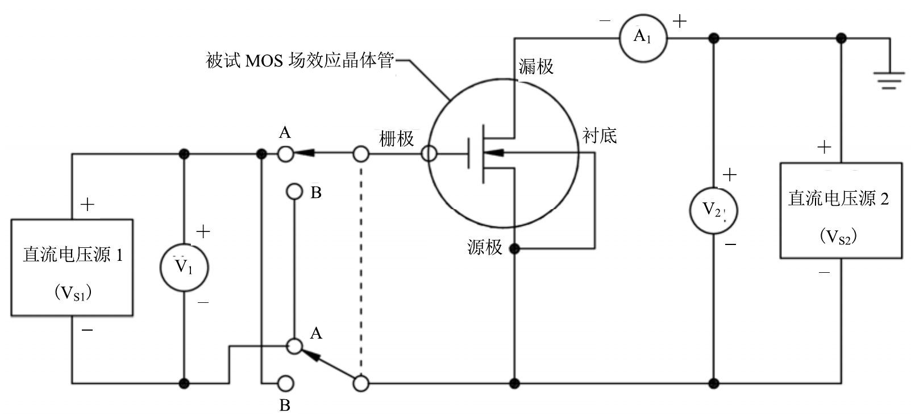

注：栅压极性转换开关的位置：A- 对增强型；B- 对耗尽型。

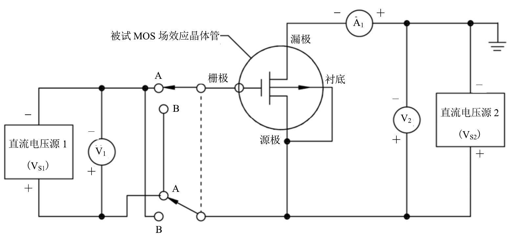

注：栅压极性转换开关的位置：A- 对增强型；B- 对耗尽型。

### 图2 P沟MOSFET的测试线路

### 4.2.2 栅压的测量

以 \(0.25\mathrm{V}\) 为增量，依次减小栅压 \(V_{\mathrm{G}}\) ，并测量相应的漏极电流 \(I_{\mathrm{D}}\) 和栅压 \(V_{\mathrm{G}}\) ，直到其中有一达到其最大值。如果在两个极限值均未达到之前，栅压变到 \(0\mathrm{V}\) ，这时必须变换栅压极性转换开关，继续以 \(0.25\mathrm{V}\) 为增量，依次减小栅压，测量 \(I_{\mathrm{D}}\) 和 \(V_{\mathrm{G}}\) ，直到其中一个达到其极限值。

### 4.3 漏电流

### 4.3.1 通则

应在规定的漏极电压和栅极电压下测量漏电流。

### 4.3.2 漏极电压

漏极电压值应按第5章b)的规定。

### 4.3.3 栅极电压

栅压应比预计的阈值电压低5V(对N沟)或高5V(对P沟)。

### 4.4 栅极曲线

画出栅压 \(V_{\mathrm{G}}\) 对漏极电流与漏电流之差的平方根( \(\sqrt{I_{\mathrm{D}} - I_{\mathrm{L}}}\) )之间的关系曲线。在曲线上偏离直线的地方，将直线段部分向下外推到与栅压坐标轴相交，该交点就是阈值电压 \(V_{\mathrm{TH}}\) 。图3表示的是个具体实例。

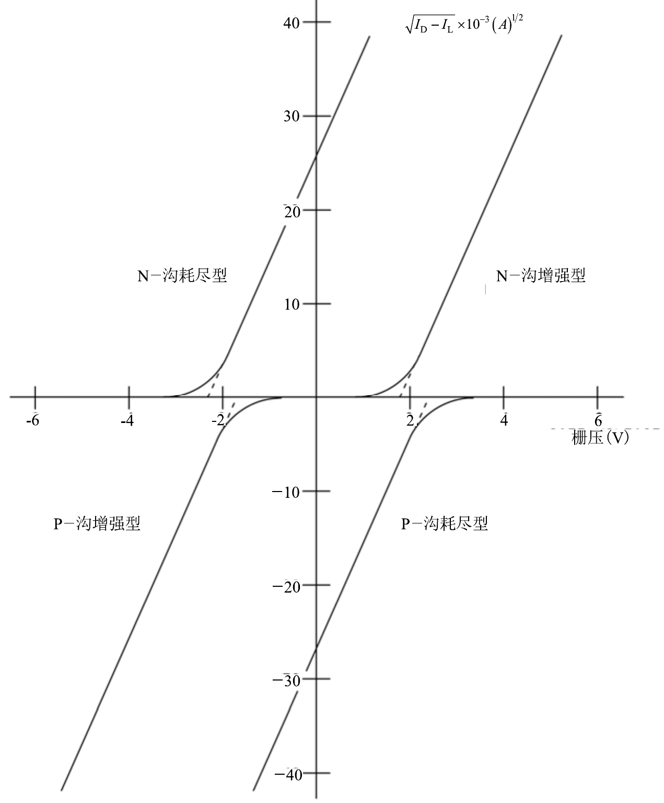

### 4.5 报告

试验报告至少包括：器件识别号、测试日期、测试人员、测试温度、漏极电压、栅压范围、漏电流和阈值电压。

### 5 说明

有关的订购文件应规定以下内容:a) 试验温度。除另有规定外，试验应在室温下进行。

b) 漏极电压。

c) 最大漏极电流。

d) 栅压范围。

## 方法1023.1 线性微电路的剂量率响应和翻转阈值

### 1 目的

本方法规定了在闪光X射线机或电子直线加速器的辐射作用之下，对已封装的线性微电路剂量率响应和翻转阈值的试验要求和程序。本方法规定了线性微电路剂量率响应特性的试验，但不包括方法1020规定的锁定情况。

### 2 术语和定义

下列术语和定义适用于本方法。

### 2.1 剂量率 dose rate

给定材料的单位质量在单位时间内从其受辐射的辐射场中吸收的能量。

### 2.2 剂量率响应 dose rate response

在给定剂量率的辐射脉冲作用下，处于工作状态的线性微电路的参数瞬态变化。

### 2.3 剂量率感应翻转 dose rate induced upset

当规定参数(如：输出电压、电源电流、输出信号波形)辐射感应的瞬态变化超过规定水平时所发生的翻转。

### 2.4 翻转阈值 upset threshold

器件翻转的最小剂量率。然而，记录中所测得的翻转阈值应是器件未翻转且输出波形和(或)电源电流的瞬态干扰仍保持在规定极限范围内的情况下测得的数值。

### 3 试验方案

### 3.1 概述

在进行剂量率试验之前，应准备一份试验方案，其中包括辐射源、剂量测定方法、测试设备、被试器件、试验条件和完善的试验设计(试验示例参见附录A和附录B)。应对每个被试器件准备详细的程序，并作为试验方案的一部分或放入单独的试验程序文件中。试验程序应包括偏置条件、试验顺序、试验装置和被测的特殊功能。在试验方案或程序中至少应包括下述条款：a) 器件类型，包括封装类型、承制方、日期代码和被试器件数量。

b) 追溯要求，如：连续性编号，晶圆或批的可追溯性等要求。

c) 数据报告和提交要求。

d) 试验装置的方框图或原理表征。

e) 试验中所用的设备清单，其校准符合性情况。

f) 试验条件，如偏置电压、温度等。

g) 用于监控的电参数和器件工作条件，包括辐射脉冲前后及试验中的功能测试要求。具有存储单元的器件所采用的测试图形或具有输入图形灵敏性的器件，也应加以规定。

h) 剂量率试验前后A组电测试要求，适用时应包括测试极限值和失效判据。

i) 辐射试验参数，如脉冲宽度、每个脉冲的辐射剂量和剂量率范围。

j) 适合每个器件类型的总电离剂量极限值。

k) 翻转和失效判据，如在模一数转换器(ADC)中、有效位数(ENOB)或丢码、 \(V_{\mathrm{OH}}\) 或 \(V_{\mathrm{ref}}\) 变化量、恢复时间、输出波形的形状或频率失真等。

### 3.2 翻转判据的表示

翻转判据通常是在关注的剂量率的特征数据中产生的。如果模拟结果与实际数据的结果得到证实，翻转判据有时可以通过应用电路的分析/模拟(集成电路专用模拟程序(SPICE)或等效计算机模拟软件)

来决定。

### 3.3 翻转判据的规范

一旦要求，应在详细规范中规定翻转判据，并可以包括下述内容(波形可以作为接收与否的界线):a) 判据适用的测试线路；

b) 输出电压允许的瞬态变化的峰值幅度；

c) 允许的瞬态输出变化时间间隔(恢复时间);

d) 电源电流和恢复特性中浪涌极限值；

e) 输出电压在恢复之后的稳态(恢复到正常)的水平；

f) 对于ADC的有效位数(ENOB)或丢码；

g) \(\Delta\) 参数，如 \(V_{\mathrm{ref}}\) 或 \(V_{\mathrm{OH}}\)

h) 器件的饱和时间。

### 4 设备

### 4.1 辐射源

试验可采用下述两种辐射源中的一种：闪光X射线机(FXR)或电子直线加速器(LINAC)。FXR应用于X射线模式，LINAC用于电子束模式。除另有规定外，LINAC束能量应大于或等于10MeV,FXR峰值(终点)能量应大于或等于2MeV,必须注意由于剂量增强(低能成分，如X射线)效应引起的剂量测量问题。在器件接受辐射的空间中，用剂量测定系统测得的辐射场均匀性应为 \(\pm 15\%\) 。每次辐射暴露的剂量应在试验方案或程序中规定。

### 4.2 剂量测定系统

应使用测量准确度在 \(\pm 15\%\) 范围内的剂量测定系统。为同时获得辐射脉冲和剂量波形，可以使用已校准的PIN二极管。应考虑器件封装材料和厚度，以决定施于被试器件的剂量。对于FXR试验，应考虑封装的剂量增强(低能成分，如X射线)效应。适用时，剂量测定技术应在试验报告中予以说明，同时还应说明器件封装材料、厚度和剂量增强的效应。

### 4.3 测试系统

### 4.3.1 概述

测试系统应能确保建立所要求的测试条件、测试以及记录所要求的参数。除被试器件以外的元器件应对规定的辐射剂量作用不敏感，或对其进行辐射屏蔽。剂量率试验所用测试系统包括4.3.2\\~4.3.9的要求。

### 4.3.2 远程测试线路

测试线路的外围部分包括电源、输入和控制信号发生器，用于检测、测量和记录瞬态和稳态响应的测试设备，还可以包括自动测试设备(ATE)。测试线路的外围部分应对辐射和辐射感生电磁场屏蔽。在辐射脉冲作用期间，测量和记录规定的信号，在脉冲之后应进行逻辑图形验证(适用时)。

### 4.3.3 转接夹具

转接夹具应放置在辐射试验箱中，通过电缆线连接到测试线路的外围部分(4.3.2),作为电源和信号分配箱，包含缓冲被试器件各种输出信号的线性驱动器。线驱动器的特性(如线性度、动态范围、输入电容、瞬态响应和辐射响应)应能准确地表示被试器件的输出响应。转接夹具应尽可能靠近被试器件，并必须恰当地屏蔽掉散射的辐射场，使辐射感生作用不会影响被测输出响应的准确度。

### 4.3.4 试验电路

对于每种器件型号的试验电路应对被试器件提供最坏情况的偏置和负载条件，并能对被试器件按规定的试验方案或程序进行原位功能测试。试验电路应能使器件、输出负载相配合，且电源旁路电容(见4.3.5)直接与器件电源端或插座相连。在试验电路上为避免地线回路，仅应有一个地的参考面(或地回路连接到一个单一的地),试验电路寄生电容为应保持最小。

### 4.3.5 旁路电容器

4.3.5 旁路电容器高频电容器应置于被试器件的每个偏置电源端， 引线长度尽可能短。这些电容器容量应足够大(典型值在 \(4.7\mu \mathrm{F} \sim 10\mu \mathrm{F}\) 之间), 使在辐射脉冲作用时器件的电源电压下降小于 \(10\%\) 。采用一只低感电容器(如 \(0.1\mu \mathrm{F}\) )与此电容并联， 应尽可能靠近电源端， 引线尽可能的短。此外， 对于进入器件的每根电源线， 一个大于等于 \(100\mu \mathrm{F}\) 的大电容器可以置于距器件较近的位置， 并应对辐射屏蔽。

### 4.3.6 限流串联电阻器

电源串联的限流电阻器应经订购方批准后， 才可以使用。限流电阻器可能降低器件的翻转性能。

### 4.3.7 定时控制

定时控制系统应包括在测试系统内， 使得辐射后原位功能测试在规定的时间内完成， 并能监测信号和电源电流的恢复情况。

### 4.3.8 电缆

外围测试线路与转接夹具和器件固定夹具之间的连接应使用屏蔽电缆(匹配特征阻抗)。为了将噪声降低到允许的程度， 可以采取附加的屏蔽措施(如双屏蔽电缆、三同轴电缆、拉链式套管、铝箔)。

### 4.3.9 测量和记录设备

4.3.9 测量和记录设备应使用示波器或其他合适的设备来测量及记录输出电压与电源电流的瞬态信号和恢复时间。这些仪器的上升时间应使其能准确反映规定的脉冲宽度。

### 5 程序

### 5.1 器件识别

在所有情况下， 应对器件编号， 使用的记录试验数据应能追溯到每个器件。

### 5.2 安全要求

所有试验工作人员都应遵守GB18871及辐射安全机构制定的健康和安全要求。

### 5.3 应力极限

### 5.3.1 电离总剂量极限

除另有规定外， 任何置于大于其总电离剂量极限 \(10\%\) 的器件应认为是进行破坏性试验。对每个被试器件类型应在试验方案中规定总剂量极限。

### 5.3.2 烧毁极限

器件光电流达到其烧毁水平的 \(10\%\) 时， 应认为是破坏性试验。应在试验方案或程序中规定烧毁水平。烧毁水平可以按器件类型经试验且没有出现烧毁的最大剂量率水平进行规定。

剂量率试验引起浪涌电流持续时间的范围是从 \(20\mathrm{ns} \sim 500\mathrm{ns}\) (典型值), 那么此期间内可能超过承制方规定的电流和功耗最大额定值。

### 5.4 表征试验

应进行表征试验或数据获取， 以决定器件在不同剂量率下的特性， 并且规定生产试验的要求(适用时)。下述是表征试验信息获得的示例:a) 在剂量率和脉冲宽度作用下的参数特性；

b) 不同辐射剂量率和脉冲宽度下的翻转阈值；

c) 确定敏感性线路条件；

d) 器件最敏感的线路识别， 以及被监测的合适输出端；

e) 温度对翻转或失效的影响；

f) 规定在详细规范中的翻转、恢复时间和失效判据；

g) 剂量率试验后A组电参数的退化；

h) 最坏情况电源电压；

i) 最大浪涌电流和时间间隔， 以及光电流烧毁水平。

### 5.5 生产试验

### 5.5.1 概述

在生产试验之前，应对每个器件类型进行表征试验或已获得表征数据。表征试验(见5.4)的结果或已有的数据将用于生产试验，这些要求规定在适用的试验方案或程序中(见第3章)。生产试验应按试验方案或程序规定的偏置和负载条件，在规定的剂量率(和脉冲宽度)下进行。所测得的响应与翻转判据进行比较，以决定是否通过。具有存储单元的器件应在试验前完成加载应用的测试图形，并且试验后完成功能测试以验证存储的图形。

### 5.5.2 复杂线性器件的试验

复杂线性器件(诸如模拟一数字和数字一模拟转换器)的试验应使用必需的试验条件(按试验方案或程序规定)来完成，以保证足够的覆盖率。通常，要求四个或四个以上的试验条件。应尽可能使用最敏感的试验条件(即：对翻转出现最有效的)。对于具有存储单元的线性器件，每个试验状态应包括一个存储测试图形和外部偏置。每个测试图形应在试验前加载，在辐射脉冲作用之后，应完成器件的功能测试，以验证图形。

### 5.5.3 设备准备

辐射源应被调节到规定模式中，并提供在规定有效脉冲宽度范围的辐射脉冲。要求的剂量计即应被安置在较接近被试器件的位置。

### 5.5.4 测试系统准备

剂量率试验测试系统(包括所有测试线路、电缆、监测和记录设备)应能提供规定的偏置和负载条件及输出监测。测试线路应放置在被试器件能够接受到规定剂量的位置。除另有规定外，剂量率试验应在 \(25^{\circ}\mathrm{C}\pm 5^{\circ}\mathrm{C}\) 下完成。应在试验方案或程序中规定试验温度。

### 5.5.5 测试线路噪声检测

应进行与所有线路相连的噪声检测(包括辐射感应噪声)。噪声信号应尽可能低，应调整线路和电缆，直到噪声信号达到可接受水平(通常小于规定响应的 \(10\%\) )。

### 5.5.6 试验顺序

注意：传递器件时应注意保护，特别是将器件引线插入试验电路中的固定夹具时格外小心。在插入器件之前，确认电源处于关断状态。遵守与被试器件相对应的防ESD操作程序。

第1步：调节定时控制系统，提供辐射脉冲作用与辐射后测量之间所要求的时间间隔；

第2步：去掉偏置电压，放置一个比对器件(与被试器件相同型号)；

第3步：施加偏置电压，根据性能要求验证器件固有的功能；

第4步：验证所有记录、监测和定时控制设备的操作，监测和记录噪声水平和温度；

第5步：去掉偏置电压和比对器件。

调节辐射源，使之工作在规定模式中，以提供规定的剂量，并按第6步进行验证；

第6步：验证剂量记录设备工作完好，并可提供适当的剂量。

当剂量率试验测试系统、辐射源和剂量测定系统已经被验证工作完好，对每种被试器件类型继续进行第7步～第11步：第7步：从试验电路中去掉偏置，并且放置器件；

第8步：根据试验方案或程序对器件进行偏置和对测试图形进行加载(适用时)。验证适当的器件功能操作；

第9步：将器件置于辐射脉冲中，测量规定输出的响应和恢复特性；

第10步：适用时，将器件响应与翻转判据进行比较。

对于每个试验状态和每个辐射剂量率重复第8步～第10步。

第11步：移去器件偏置。

翻转阈值应按器件未翻转时的最大剂量率进行报告。

### 6 试验报告

试验报告至少应包括下述内容：a) 器件识别，包括承制方，晶圆和(或)检验批追溯信息，辐射前信息；b) 辐射试验设施，源类型，脉冲宽度，剂量测定数据(包括脉冲波形)；c) 试验数据，试验操作者姓名和单位；d) 噪声测试结果；e) 器件响应数据，按器件序列号列出，包括输出和电源恢复波形，以及对每个器件每个脉冲的剂量；f) 在脉冲期间电源的下降幅度；g) 试验后功能测试数据(适用时)；h) 包括在试验方案或程序中的所有信息(可以作为对试验报告的参考或附加信息)以及与已批准的试验方案或程序的任何偏离；i) 封装材料和厚度，以及封装材料在剂量上对器件的影响(见4.2)。

### 7 说明

有关的订购文件应规定以下内容：a) 被试器件型号和数量。b) 追溯性(器件编号、晶圆/批编号等)要求和数据报告及提交的要求。c) 被试器件在试验中(包括结构框图)的电气结构图。d) 试验条件顺序和逻辑测试图形。e) 需要监测和记录的输出。f) 剂量率水平和脉冲宽度。g) 翻转和恢复判据，恢复的输出稳态值和(或)电源电流。包括采样波形(若需要)。h) 翻转阈值和失效水平(适用时)。i) 试验后，验证存储图形所需的功能测试，以及在辐射脉冲和功能测试开始之间的最大时间间隔。j) 对每个器件型号的总电离剂量极限和烧毁水平。k) 若适用，电源串联的最大限流电阻，以及在测试线路(见4.3.6)中允许的电阻。l) 适用时，辐射前后A组电测试要求。m) 测试仪器要求(若与上述规定不同)。n) 表征试验和分析要求。

### 附录A (方法1023)

(资料性附录)

### 运算放大器试验示例

A.1 本附录给出了一个例子， 用来说明如何规定一个运算放大器的试验条件。由于试验条件同时取决于器件类型和特定的使用情况， 因此不能认为本例适用于任何情况， 它只为了说明如何使用本试验方法。

A.2 方法1023试验规范:a) JF741型运算放大器， 8引线金属圆形封装；

b) 试验电路如图A.1所示， 其中外引线1、5和8未接；

c) \(V_{+} = 9.0\mathrm{V}\pm 0.2\mathrm{V}\) ; \(V_{-} = -9.0\mathrm{V}\pm 0.2\mathrm{V}\)

输入信号电压峰峰值为 \(280\times (1\pm 5\%) \mathrm{mV}\) ； 频率为 \(2000\mathrm{Hz}\pm 50\mathrm{Hz}\) ；

d) 监测6号引出端和电源电流；

e) 采用标准的噪声极限值要求；

f) 脉冲宽度: \(20\mathrm{ns}\) ;

g) 总剂量不得超过 \(10\mathrm{Gy(Si)}\) ；

h) 试验中使用的剂量率为 \(10^{5}\times (1\pm 30\%) \mathrm{Gy(Si)} / \mathrm{s}\) ；

i) 试验环境温度为 \(25^{\circ}\mathrm{C}\pm 5^{\circ}\mathrm{C}\) ；

j) 接收或拒收失效判据： 电源电流和输出信号应在辐射脉冲的 \(1\mathrm{ms}\) 以内回到辐射前水平的 \(10\%\) 以内；

k) 本试验是破坏性试验。

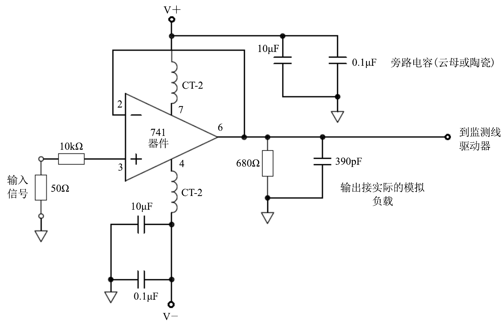

### 附录B (方法1023)

(资料性附录)

### 模拟-数字转换器试验示例

B.1本附录给出了一个例子，用来说明如何规定模拟-数字转换器(ADC)的试验条件。由于试验条件同时取决于器件类型和特定的使用情况，因此不能认为本例适用于任何情况，它只为了说明如何使用本试验方法。

B.2方法1023试验规范:a)ADC型 \(\scriptstyle (\mathrm{n} = \# \mathrm{bit} = 12)\) ，40引出端陶瓷双列封装。

b)试验电路按图B.1规定，试验装置图见图B.2。存储RAM必须以超过器件时钟频率的速度写入，并且对控制器提供一个接口，能够贮存来自辐射源的触发脉冲。如果使用ADC的数据准备线，由于可能出现翻转，也必须分别监测。

c)至少应试验3个输入电压。调节输入偏置，使中心输出码在:

1) \(2^{n} / 2\)

2) 满量程减去 \(10\% (2^{n} - 0.1 \times 2^{n})\)

3) 零加上 \(10\% (0 + 0.1 \times 2^{n})\)

d) 至少要在10MHZ和1MHZ( \(F_{\mathrm{max}}\) 和 \(0.1 \times F_{\mathrm{max}}\) )下进行测试。

e) 翻转判据：翻转阈值的确定应通过统计分析将辐射前ADC输出码与在辐射后立即得到的数据进行比较来得到，恢复时间( \(20\%\) 以内)也应通过比较辐射前后的数据来确定。

f) 脉冲宽度: \(20\mathrm{ns}\) (半高宽)。

g) 在 \(10^{2}\mathrm{Gy}(\mathrm{Si}) / \mathrm{s} \sim 10^{7}\mathrm{Gy}(\mathrm{Si}) / \mathrm{s}\) 的剂量率范围进行试验以确定翻转阈值。

h) 总电离剂量应不超过 \(500\mathrm{Gy}(\mathrm{Si})\) 。

i) 在环境温度 \(25^{\circ}\mathrm{C} \pm 5^{\circ}\mathrm{C}\) 试验。

j) 在翻转试验完成之后，试验达到设备最大剂量率以确定器件是否会烧毁。本试验是破坏性试验。

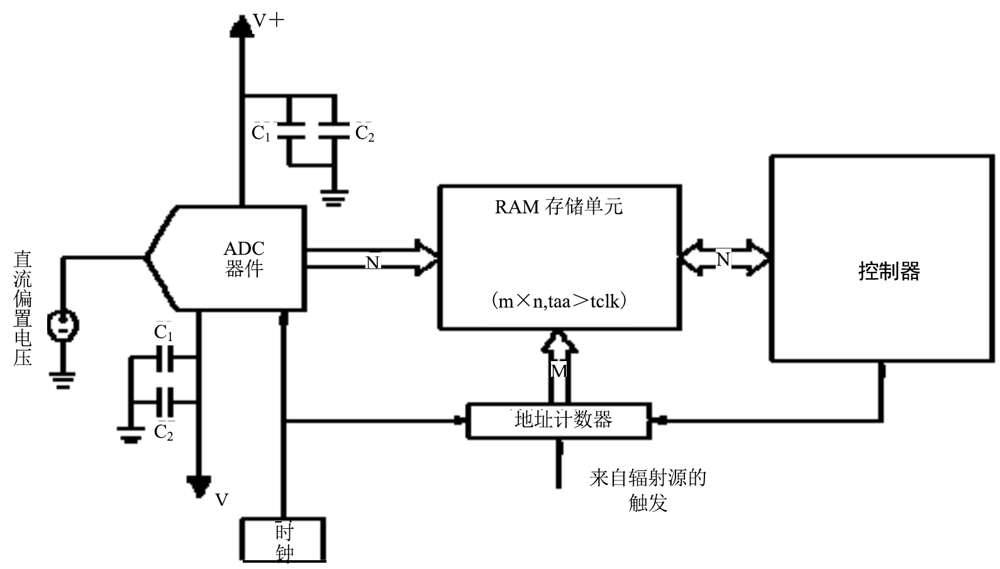

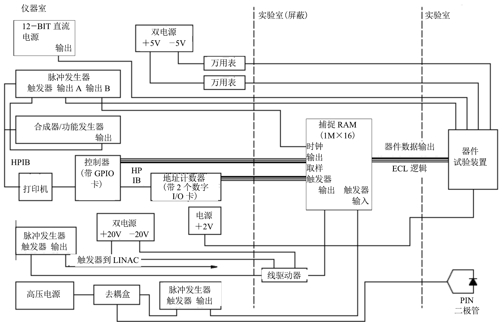

图B.2 ADC试验装置示例

## 方法1030.1 密封前老炼

### 1 目的

本试验的目的是为了在密封前稳定单片、多片或混合集成电路的工作性能，或找出那些具有潜在缺陷的器件，以便采取有关的返工或返修措施。标准或密封后老炼试验（见方法1015)通过对器件施加等于或大于最大额定工作条件的应力，或能以相等或更高的灵敏度暴露出与时间和应力有关的失效模式的等效筛选条件，以便筛选或剔除参数临界的器件。在密封前采用标准老炼试验中的部分试验内容可以发现那些参数临界的器件，以及在某些方面需要进行并且也容易进行返工或返修的器件。本试验是非强制试验，密封前老炼的采用与器件的复杂程度、密封后老炼试验中的实际失效率(如果提供有这类数据的语)均有关。

### 2 设备

所需设备的详细要求及气流速率的补偿(若有该要求)见方法1005。密封前老炼使用的试验箱至少应能提供10万级的干氮环境(在氮气供气口处，气体中的水汽应小于 \(0.01\%\) (100ppm))。应采用合适的设备控制干氮流速，并监测流入试验箱的干氮湿度。

### 3 程序

### 3.1 概述

所有器件应在全部装配操作(不包括封帽)完成后(见方法5004或GJB2438)，在规定的温度、时间和环境下接受规定条件(见3.2)的密封前老炼试验。内部目检应在密封前进行。器件应通过外引线、螺栓或外壳按其通常的固定方式来固定，并且连接处的温度不得低于规定的环境温度。密封前老炼试验前后应按规定进行测试。

### 3.2 试验条件

### 3.2.1 基本条件

基本的试验条件如下所示。每种条件的详细内容见方法1005。

a) 试验条件C——稳态、功率和反偏试验；

b) 试验条件D——并行激励试验(使被试器件处于正常的工作条件)。

### 3.2.2 试验时间

除另有规定外，密封前老炼应至少进行48h。如果密封前老炼和密封后老炼的总老炼时间等于或超过规定的160h，且密封后老炼时间等于或超过96h，则可以适当分配密封前和密封后的最少老炼时间。

### 3.2.3 试验温度

除另有规定外，密封前老炼试验温度应为 \(125^{\circ}C\) 。如果采用低于 \(125^{\circ}C\) 的温度，则应按方法1015中表1的数据相应增加试验时间。

### 3.2.4 试验环境

密封前老炼试验的环境至少应达到10万级的干氮(供气口处的氮气中水汽应小于 \(0.01\%\) (100ppm))。加热前应对烘箱用干氮进行气洗，然后加偏置。在要求的环境条件尚未完全具备之前不应开始试验。

### 3.3 测试

### 3.3.1 通则

密封前老炼试验之前的测试应在施加老炼条件前进行。除另有规定外，密封前老炼之后的测试应在老炼结束而将器件取出后96h内完成。测试内容包括全部 \(25^{\circ}C\) 直流参数(方法5005或GJB2438的A1分组)以及那些作为中间测试的一部分而又规定了变化量极限的所有参数。当适用时，应根据这些测试结果按变化量极限验收。如果不能在 \(96\mathrm{h}\) 内完成这些测试，那么在密封前老炼试验后的测试之前应按原先使用的老炼条件(见3.2)对器件至少再老炼 \(24\mathrm{h}\) 。

### 3.3.2 密封前老炼结束后的冷却

所有器件应冷却到与器件处于室温下功耗稳定状态时的温度相差不超过 \(10^{\circ}\mathrm{C}\) ，然后再去掉偏置。为了把器件移至与试验箱不在同一处的冷却位置，只要偏置中断不到 \(1\mathrm{min}\) ，就不应该看作是去除偏置。对于双极性和MOS(CMOS、NMOS、PMOS)以外的器件，如果在去除试验条件后 \(30\mathrm{min}\) 之内被试器件的外壳温度能降至不高于 \(35^{\circ}\mathrm{C}\) ，就可以在冷却期间去掉偏置。所有 \(25^{\circ}\mathrm{C}\) 直流测试应在对器件作任何形式的再加热之前完成。

### 3.3.3 失效验证和修复

密封前老炼试验结束后，通不过 \(25^{\circ}\mathrm{C}\) 直流测试的器件，应按方法5003试验条件A进行失效分析。确认并定位了有缺陷的或参数临界的器件后，应按GJB597B- 2012或GJB2438中允许的范围进行返工。返工结束后，再对修复的器件重新测试，若测试合格，且返工中涉及到器件的更换，就应对这些器件再进行附加的密封前老炼试验(见3.2)。

### 3.3.4 试验装置的监测

在试验(加温)开始和试验结束时应监测试验装置，以确保按规定要求对全部器件施加了应力。至少应进行下列监测步骤：a) 器件插座在开始使用时及以后的至少每六个月(如六个月以上未使用，则使用前)，应检查每个试验板或试验盘，以验证接触点是否完好，从而保证把偏置和信号加到每个插座上。除了这种最初的和定期的验证之外，不必检查每个器件或器件插座，但在每次使用试验板之前应采用随机抽样技术，而该技术应足以保证被试器件接触的正确性和连续性。

b) 试验板或试验盘的插头将器件插入试验板并装入试验箱后，在用氮气进行气洗之前，应在每个试验板或试验盘的至少一个位置上验证各个必要的试验电压和信号条件，从而确保在相应的试验状态中采用的每个连接点或插头的良好电接触，进而确保能施加规定的电应力。

c) 试验过程结束并冷却后，应重复3.3.4b)中要求的电压和信号条件的验证。

当出现失效或接点开路，从而导致在所要求的试验时间(见3.2.2)内的某一段时间未能加上所要求的试验应力时，应延长试验时间以保证实际施加应力时间至少达到规定的最短总试验时间。

### 3.4 对未封盖的器件的处理

为了防止在取拿器件过程中因不小心引起缺陷，建议在任何时刻对未封帽的所有器件使用专门的盖帽罩住，这种盖帽可以是直接固定金属盖帽或有导电外涂层的硬质塑料盖帽。当所有的器件放置到老炼台后，可将上述盖帽从器件上取走。如果在老炼时已将盖帽取走，在老炼结束后，待器件冷却并去除偏置后，将器件从老炼台上取出前应立即重新盖上盖帽。不管密封前老炼试验结束后的目检和密封之间的这段时间内如何处理器件，器件都应处于可控的环境之中(见方法2017)。

### 3.5 密封后老炼

在完成密封前老炼试验、内部目检、其他密封前的筛选及密封以后，除了可以不做稳定性烘焙外，所有的器件都必须进行由方法5004或GJB2438所规定的筛选。密封后老炼试验应按方法5004或GJB2438的规定进行(关于试验的详细内容见方法1015)。

### 4 说明

有关订购文件应规定以下内容：a) 试验条件和老炼电路，包括适用时对输入、输出、外加电压和功耗的要求(见3.2)；b) (如与常规不同)试验时固定器件的方式(见3.1)

c) 适用时“密封前老炼”试验前后的测试和参数漂移限制(见 3.3.1);d) 如与规定不同， 密封前老炼试验结束后完成测试的时间(见 3.3.2);e) 为防止器件在处置过程中引起缺陷而采用的盖帽类型(见 3.4);f) 密封前老炼和密封后老炼的试验时间(见 3.2.2);g) 若低于 \(125^{\circ} \mathrm{C}\) ， 则规定试验温度(见 3.2.3)。

## 方法1031 薄膜腐蚀

### 1 目的

本试验的目的是为了验证在一定时间内器件满足规定条件的质量和可靠性。它可用作为规定的短期质量保证试验，也可用作为保证器件可靠性的长期加速试验。它特别适用于那些含有薄膜导体、电阻器或熔丝的器件，因为这些元件在管壳内部残存的水汽作用下很易被腐蚀(虽然这些水汽含量低于方法5005或GJB2438中规定的极限)。这是一种破坏性的试验，它不应用于 \(100\%\) 筛选。通过本试验将揭示出由金属层腐蚀引起的与时间、温度、应力和湿度有关的失效模式。

### 2 设备

应采用合适的插座或其他固定器件的方式，以保证被器件外引线在规定试验线路中可靠的电连接。所用的电源和烘箱装置应至少能在整个试验期间保持规定的工作条件。试验箱应采用干燥空气来调节，以防止在温度循环过程中试验环境相对湿度达到 \(100\%\) 。

### 3 程序

### 3.1 概述

器件应受到规定的条件、持续时间和温度的作用，并在试验结束后进行规定的测试。应记录并控制整个试验全过程的试验条件、试验持续时间、数量和温度。所有可用程序控制的设备若已被承制方改变了状态，在试验前应对其重新编程。

### 3.2 试验条件

### 3.2.1 器件的初始处理

进行试验前，应将所有的器件在 \((125\pm 10)^{\circ}\mathrm{C}\) 的条件下，不加偏置放置至少24h。初始处理可将吸附的水汽驱至环境中。

### 3.2.2 短期试验

对于短期质量保证试验，应按图1中给出的时间- 温度偏置顺序作16次循环，每次3h，共48h。短期试验采用的顺序如下：

a) AB段 \(125^{\circ}C\) ，使管壳内壁上的表面水分汽化。b) BC段使环境水汽在管壳内壁和管芯上冻结(降温速率为 \(100\mathrm{K / min}\) )。c) CD段使封壳内部的表面温度达到平衡(也就是使水汽重新分布)。d) DE段将水汽从器件壁转移至管芯(冷表面泵)。从E点开始，在管芯还是湿的时候，施加偏置。e) EF段调整升温速率，以便通过减少热耗散和调整升温速率(最大为 \(100\mathrm{K / min}\) )，使管芯总是处于最低的温度。f) FG段保持环境温度为 \(2^{\circ}C\) ，在依然施加偏置的同时使管芯附近相对湿度最高。g) GH段迅速升温(最大升温速率为 \(100\mathrm{K / min}\) )阶段，使水汽从壁上蒸发，可能同时伴有一种剧烈的驱动力，增强污染物从壁到管芯间的传递。在施加偏置且温度为 \(25^{\circ}C\) 时结束循环。将器件从夹具中取出。

在施加偏置且温度为 \(25^{\circ}C\) 时结束循环。将器件从夹具中取出。

### 3.2.3 长期试验

进行长期可靠性试验时，作如下更改：a) AB段增加至12h。b) CD段增加至1h。c) DE段保持 \(0.5\mathrm{h}\) 不变。

d) EG段在E点开始施加偏压。在FG期间进行30min加偏压、30min断开偏压的循环。总时间为24h。

e) EF段如果能使功率耗散最小化，可增加至4h。

f) FG段增加至6.5h。总试验时间为10个星期或70个循环。

在施加偏置且温度为 \(25^{\circ}C\) 时结束循环。将器件从夹具中取出。

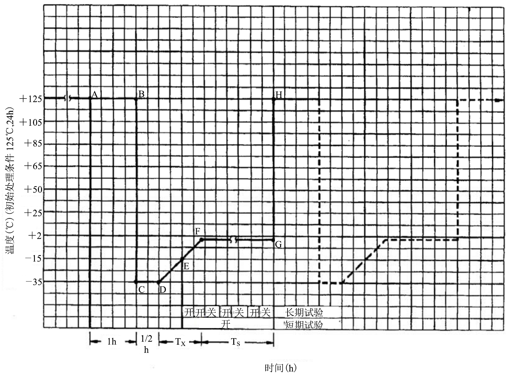

### 3.3 测试

除另有规定外，应在器件停止接受规定试验条件作用后的12h内完成全部电测试。终点测试应包括 \(25^{\circ}C\) 时方法5005或GJB2438的A1分组和A7分组测试。

必须在3.2.1之前以及3.3之后按方法1014进行细检漏和粗检漏试验。未通过试验的器件应从检验批中剔除。

### 4 说明

有关的订购文件应规定以下内容:a) 电测试图；

b) 应进行试验的器件数和接收判据；

c) 数据记录的要求(适用时)。

## 方法1032 封装引起的软错误

### 1 目的

本试验用于测定集成电路在已知试验条件下对于由 \(\alpha\) 粒子所产生错误的敏感程度。本试验特定用于测定器件承受 \(\alpha\) 粒子撞击的能力，同时还可以确定芯片表面保护层的效能。通过试验确定由器件封装、芯片和芯片表面保护层材料中的 \(\alpha\) 辐射源引起的器件失效率。

### 2 术语和定义

下列术语和定义适用于本方法。

### 2.1 软错误 soft error

由于 \(\alpha\) 粒子辐射撞击引起被试器件输出出现瞬时的或数据存储的任一种错误。

### 2.2 软错误率(SER) soft error rate(SER)

在正常封装环境下单位时间出现的软错误数。

### 2.3 加速软错误率(ASER) accelerated soft error rate(ASER)

在已知 \(\alpha\) 粒子源作用下单位时间内引起的软错误数。

### 2.4 非特(FIT) failure in time(FIT)

1FIT等于 \(10^{9}\) 器件·小时出现一次失效。

### 2.5 封装粒子流 package flux

来自封装材料(即盖板、芯片材料、密封材料及可选的 \(\alpha\) 粒子防护层)杂质的 \(\alpha\) 粒子在单位时间作用于单位芯片表面面积上的总数。 \((\mathrm{cm}^2 \cdot \mathrm{h})^{- 1}\) 。

### 2.6 修正的封装流 modified package flux

芯片表面有保护层时，单位时间内作用于单位芯片表面上的 \(\alpha\) 粒子总数。 \((\mathrm{cm}^2 \cdot \mathrm{h})^{- 1}\) 。

### 2.7 源粒子流 source flux

采用经校准的粒子源，单位时间内作用于单位芯片表面的 \(\alpha\) 粒子总数。 \((\mathrm{cm}^2 \cdot \mathrm{h})^{- 1}\) 。

### 3 设备

### 3.1 概述

所需设备包括电测试仪器、试验线路板、电缆、互连板或开关系统和针- 232 薄片(选用)。应采取有关预防措施使电测试系统具有适当的屏蔽和接地，且感应的电学噪声应尽量低。

### 3.2 辐射源

用于本试验的辐射源应为尺寸足够大的针- 232 薄片(该薄片能产生 \(\alpha\) 能量谱为 \(0\mathrm{MeV} \sim 10\mathrm{MeV}\) 的粒子)，以覆盖暴露的芯片腔体范围，其强度为 \(0.37\mathrm{kBq} \sim 185\mathrm{kBq}\) 。能产生与封装杂质一样的能谱。应按有关规定控制辐射源。对辐射源应进行定期检定。应取源被使用时的衰减速率计算实际“粒子流”值。避免辐射源受热。

### 3.3 电测试仪器

应采用通常用于测试被试器件的标准测试仪器。它们应能提供需要的测试条件，并能测量要求的电参数。所有仪器均应按本标准的一般要求作定期校准。

### 3.4 试验线路

试验线路应包括被试器件、需要的连线和辅助部件。连接时应保证能施加规定的试验条件以得到要求的输出。应具有监测并记录规定输出的手段，对输出负载，如电阻或电容应予以规定。试验线路不应在受到辐射源作用时电特性出现永久性的变化。必要时，在试验线路中应采取屏蔽措施，以防止辐射对线路的影响。

### 3.5 电缆

需要时， 应使用电缆将具有受辐射被试器件的试验线路板与测试仪连接起来。所有电缆应尽可能的短。应采取措施以减小由电缆引起的噪声， 为此可采用屏蔽电缆、三同轴电缆、拉链式套管或其他屏蔽措施。

### 4 程序

### 4.1 试验方案

试验方案应包括确定被试器件的最坏工作环境， 以采用以下试验步骤确定最坏情况的 SER。试验中使用的测试码应能保证每个单元和(或)通道均能接受逻辑 0 和逻辑 1 的作用， 使器件不断受到刷新， 并连续监视器件， 计数错误总数。对每一种新的器件或设计修改均应进行本试验。粒子源强度和作用时间应足够大， 以得到一定数目的软错误失效。

若数据保持或节能模式是被试器件的有效工作状态， 则也必须测试该状态下的软错误率(SER)。

### 4.2 测试程序

设备的测试程序应能连续地循环和刷新存储数据或循环测试码， 并记录错误总数。

### 4.3 试验条件

应在最小和最大工作电压下以三种不同的循环速率进行试验。除另有规定外， 应采用下述循环时间： 指定的最小和最大循环时间以及该最小、最大循环时间的平均值。

若器件为静态或动态随机存取存储器， 应对器件同时进行读、写操作试验。

### 4.4 试验步骤

本试验允许采用两种方法。

第一种为长期试验(有时又称为系统试验)。该方法不使用粒子源， 将确切的试验时间进行统计累加， 直接确定软错误率(SER)。这种方法的含义直观明确。进行时所采用的参数必须符合 \(4.1 \sim 4.3\) 的规定。采用公式(1)由该方法试验数据计算软错误率(SER), 然后再将其转化为非特数。

\[SER = Err_{total} / T_{total} \\quad (1)\]

式中:

\(Err_{total}\) ——错误总数；

\(T_{total}\) ——总试验时间， h。

第二种方法采用 3.2 中介绍的加速粒子源。以下为采用加速粒子源进行试验的程序。按 \(4.1 \sim 4.3\) 进行的每项试验均应按此程序进行。

a) 确定芯片无保护层情况下芯片表面受到的粒子流作用。该粒子流记为封装流。

b) 若芯片表面有保护层， 保留该保护层进行试验。去掉被试器件的封装盖板， 将粒子源直接放于芯片腔体的上方， 粒子源与芯片之间的距离应与原先封装盖板与芯片间的距离相同。粒子源薄片与芯片之间的距离必须小于 \(1.27 \mathrm{~mm}\) ， 且粒子源薄片必须覆盖整个芯片腔体开口， 以保证所有入射角方向均能产生作用。若被试器件具有反向芯片安装结构(如倒装芯片), 必须采用合适的试验夹具， 使得芯片有源表面区能受到辐射源的作用。

c) 按 \(4.4 \mathrm{~b}\) 的配置进行 \(4.1 \sim 4.3\) 中规定的试验， 对进行的每项试验， 确定软错误率(SER)。

d) 对每项试验， 应记录下述内容:

1) 试验中的错误总数。

2) 发生这些错误的总试验时间。

3) 按公式(2)和公式(3)计算 \(\mathrm{SER}_{1}\) :式中:

\[ASER_{1} = Err_{total} / T_{total} \\quad (2)\]

\[SER_{1} = ASER_{1} \\times (Flux_{pack} / Flux_{Source}) \\quad (3)\]

\(Flux_{\mathrm{Pack}}\) ——封装流， \((\mathrm{cm}^{2} \cdot \mathrm{h})^{- 1}\) ;

\(Flux_{\mathrm{Source}}\) ——源粒子流， \((\mathrm{cm}^{2} \cdot \mathrm{h})^{- 1}\) 。

e) 若未采用芯片保护层， \(\mathrm{SER}_{1}\) 即为测量的失效率。若采用了芯片保护层， 还应进行 \(4.4 \mathrm{~f} \sim 4.4 \mathrm{~j}\) 工作。

f) 保留芯片保护层， 确定芯片表面的粒子流。该粒子流记为修正的封装流， 修正的封装流应只是芯片和芯片保护层材料的粒子流之和。

g) 去除芯片保护层， 保证芯片不受损伤。按 \(4.4 \mathrm{~b}\) 中的要求放置粒子流源。

h) 按 \(4.4 \mathrm{~c}\) 进行试验， 将新得到的 \(\mathrm{SER}\) 记为 \(\mathrm{SER}_{2}\) 。

i) 对每项试验， 应记录下述内容:

1) 试验中的错误总数。

2) 发生这些错误的总试验时间。

3) 按公式(4)和公式(5)计算 \(\mathrm{SER}_{2}\) :式中:

\[ASER_{2} = Err_{\\mathrm{total}} / T_{\\mathrm{total}} \\quad (4)\]

\[SER_{2} = ASER_{2} \\times (ModFlux_{\\mathrm{Pack}} / Flux_{\\mathrm{Source}}) \\quad (5)\]

\(ModFlux_{\mathrm{Pack}}\) ——修正的封装流， \((\mathrm{cm}^{2} \cdot \mathrm{h})^{- 1}\) 。

j) 将上述试验得到的 \(\mathrm{SER}\) 相加 \((\mathrm{SER} = \mathrm{SER}_{1} + \mathrm{SER}_{2})\) ， 即为该被试器件的失效率。

注： 如果必要， 可将以上试验步骤调换， 在形成芯片保护层前先进行一次试验， 在有了芯片保护层后再进行一次试验。

### 4.5 报告

在报告中至少应包括下述内容： 器件识别号、试验日期、试验操作者、试验设施(适用时)、辐射源、试验所用时间和电压、数据分析以及试验中采用的设备。

### 5 说明

有关的订购文件应规定以下内容:

a) 被试器件的类型和数量；

b) 采用的试验线路；

c) 需监测的器件输出引出端；

d) 与方法中规定不同的 \(\alpha\) 辐射源；

e) \(\alpha\) 辐射源 \(\mathrm{Bq}\) (贝可勒尔)强度；

f) 封装流密度测试方法；

g) 采用的试验设备；

h) 放射性材料的适当处理程序。

## 方法1033 写/擦疲劳寿命

### 1 目的

本试验的目的是为了验证非易失性存储器件在受到反复写/擦循环作用时的质量和可靠性。本方法也可用于筛选程序或进行其他试验前的预处理。试验时可进行终点测试或(适用时)中间测试，突出试验时参数退化的灵敏度或特定失效机理随写/擦次数、时间、温度的变化，测试时应对样品器件进行序列编号或给出所有样品参数的直方图分布。

### 2 术语和定义

下列术语和定义适用于本方法。

2.1 写/擦疲劳寿命 write/erase endurance life 器件按其规范要求所能承受的写/擦循环次数。

### 2.2 写/擦循环 write/erase cycle

将存储器中所有位的数据从原状态改变为相反的状态，再改回原状态的作用过程。可以使各位("块"、"字节"、"位")同时变化，也可顺序变化。

### 2.3 数据维持烘焙 data retention bake

在高温下不加偏置进行烘焙，以加速存储节点处电荷的损耗。

### 3 设备

本试验所需设备包括能对器件进行写/擦循环操作的仪器、数据维持烘焙的受控恒温箱以及进行规定的中间和终点测试的电测试仪器。

### 4 程序

### 4.1 试验过程

首先按规定的最大循环次数对器件所有位进行写/擦操作，然后接着进行电测试、规定的数据维持烘焙和电测试。中间测试应采用同样的循环顺序、电测试、数据维持烘焙和电测试。

### 4.2 试验条件

外壳温度、循环次数、数据维持烘焙。电测试温度和条件均按有关规定(见第5章)。

### 4.3 失效判据

出现下述现象的器件视为失效:a) 不能在整个温度范围内进行写或擦；

b) 不能保存数据；

c) 不能在整个温度和电源范围内读取数据；

d) 达不到规定的最低"写/擦"循环次数。

### 5 说明

有关的订购文件应规定以下内容:a) 写/擦循环次数；

b) 数据维持烘焙条件，包括持续时间和温度；

c) 电测试时外壳温度和定时条件；

d) 适用时预处理条件和过程(若与第4章规定不同);

e) 循环条件，包括温度、方式(例如采用"块"、"字节"或"位")以及写/擦脉冲的持续时间和重复速率；

f) 抽样方案， 包括进行循环试验的器件数和接收数；g) 终点和中间电测试判据。

## 方法1034.1 染料渗透

### 1 目的

本试验用来检测塑料封装器件抵抗潮气进入的能力并探测封装材料中的裂痕。

### 2 设备

染料渗透试验使用的设备如下：

a) 防护性吸收材料(纸或塑料)；

b) \(2000\mathrm{mL}\) 容器；

c) \(1000\mathrm{mL}\) 烧杯；

d) 磁力搅拌器；

e) 搅拌用热板；

f) 过滤纸(优于 \(2.5\mu \mathrm{m}\) )；

g) \(500\mathrm{mL}\) 漏斗；

h) 带有定位功能的钟罩；

i) 带有真空附件的过滤基座；

j) 真空泵、软管和夹具；

k) \(15\mathrm{mL}\) 烧杯；

l) \(50\mathrm{mL}\) 烧杯；

m) \(250\mathrm{mL}\) 烧杯；

n) 表面玻璃器皿或蒸发器皿；

o) 有盖培养皿；

p) \(0.1\mathrm{mL}\) 吸管和柱塞；

q) 量筒；

r) 真空箱；

s) 加热箱；

t) 金相显微镜(放大倍数1000倍，在波长范围为 \(100\mathrm{nm} \sim 380\mathrm{nm}\) 的紫外光下观察)。

### 3 程序

### 3.1 浸渗液制备

3.1.1 原料采用的组分为：a) 低粘度液体浸渗剂( \(25^{\circ}\mathrm{C}\) 时粘度为 \(5\mathrm{mPa} \cdot \mathrm{s} \sim 15\mathrm{mPa} \cdot \mathrm{s}\) )；

b) 与浸渗剂配合使用的催化剂；

c) 黄色荧光粉。

注1：可以采用组分和性能确定或可检验的等效溶液。

注2：这些化学材料对皮肤、眼睛和鼻子有刺激性，使用时应注意安全。

### 3.1.2 预混合液制备

### 3.1.2.1 溶液混合

浸渗剂和黄色荧光粉按100:1进行混合，步骤如下：a) 将 \(2000\mathrm{mL}\) 浸渗剂倒入烧杯中。

b) 将 \(20\mathrm{g}\) 黄色荧光粉倒入盛有 \(2000\mathrm{mL}\) 浸渗剂的烧杯中，搅拌 \(5\mathrm{min}\) 。然后将该溶液分装至2个1000mL 烧杯中以便于后续试验。在这 2 个 1000mL 烧杯中各放入一个磁力搅拌器， 把烧杯放置在搅拌板上， 搅拌混合物溶液各 \(2\mathrm{h} \sim 3\mathrm{h}\) 。

### 3.1.2.2 预混合液过滤

预混合液应按以下步骤过滤以确保除去任何未溶解的颗粒:a) 将过滤纸放置在漏斗中， 把漏斗接头连接到漏斗杆上， 将该漏斗放入钟罩顶部。在钟罩座上放置一个 \(250\mathrm{mL}\) 烧杯， 然后把钟罩和漏斗放置在该烧杯的上方。

b) 接通真空泵。

c) 将盛有 \(1000\mathrm{mL}\) 预混合液的烧杯， 向漏斗内倒入约 \(200\mathrm{mL}\) 进行过滤。过滤后， 关闭真空泵。把过滤好的溶液倒入空容器中， 并在此容器上标记“浸渗剂和黄色荧光粉 G 混合”字样。重复上述过程直到所有溶液均已过滤。

d) 更换新过滤纸。

e) 重复步骤 3.1.2.2 c), 过滤另一个烧杯中 \(1000\mathrm{mL}\) 预混合液。

f) 用肥皂水清洗烧杯。

### 3.1.3 预混合液和催化剂混合

预混合液和催化剂混合比为 \(200000:1\) (体积比)。由于只需要极少量催化剂， 预混合液和催化剂的混合应分两步进行。首先， 预混合液和催化剂以 \(200:1\) 混合， 然后稀释 \(1000\) 倍。具体程序如下:

a) 用量筒量出 \(10\mathrm{mL}\) 预混合液(浸渗剂和黄色荧光粉混合溶液), 倒入一个小烧杯中。

b) 在催化剂溶液中插入吸管和柱塞。

c) 汲取 \(0.05\mathrm{mL}\) 催化剂并把其注入至有 \(10\mathrm{mL}\) 预混合液的烧杯中。

d) 在烧杯中放入一个磁力搅拌器， 并把烧杯放置在搅拌热板上， 搅拌 \(5\mathrm{min}\) 。这样就完成了预混合液与催化剂以 \(200:1\) 的混合过程。

e) 用肥皂水清洗吸管和柱塞。这些吸管和柱塞在步骤 3.1.3 h) 使用前必须要清洗干净。

f) 用量杯取出足够数量(数量取决于被试器件的数量和尺寸， 大多数情况需要 \(25\mathrm{mL}\) 溶液) 预混合液(浸渗剂和黄色染料混合液), 以便能够浸没被试器件。

g) 把 \(25\mathrm{mL}\) (或者要求的数量) 预混合液倒入小烧杯中。

h) 使用干净吸管和柱塞把少量含 \((200:1)\) 催化剂混合溶液添加到各种数量的预混合液中。对 \(25\mathrm{mL}\) 预混合液而言， 应加入 \(0.025\mathrm{mL}\) 含 \((200:1)\) 催化剂混合溶液。关于其他数量溶液的制备方法如下所示:

1) \(10\mathrm{mL}\) 预混合液加入 \(0.010\mathrm{mL}\) 含 \((200:1)\) 催化剂混合溶液；

2) \(25\mathrm{mL}\) 预混合液加入 \(0.025\mathrm{mL}\) 含 \((200:1)\) 催化剂混合溶液；

3) \(50\mathrm{mL}\) 预混合液加入 \(0.050\mathrm{mL}\) 含 \((200:1)\) 催化剂混合溶液；

4) \(75\mathrm{mL}\) 预混合液加入 \(0.075\mathrm{mL}\) 含 \((200:1)\) 催化剂混合溶液；

5) \(100\mathrm{mL}\) 预混合液加入 \(0.100\mathrm{mL}\) 含 \((200:1)\) 催化剂混合溶液。

i) 将磁力搅拌器放入配好的溶液中， 并将盛有此溶液的烧杯放在搅拌热板上， 搅拌 \(5\mathrm{min}\) 。这样就完成了预混合液和催化剂以 \(200000:1\) 混合的浸渗液的制作。

j) 将含 \((200:1)\) 催化剂的多余溶液倒进标有“浸渗剂、黄色荧光粉 G 和催化剂废料”字样的瓶中。

k) 用肥皂水清洗所有吸管和玻璃器具。

### 3.2 浸渗

具体步骤如下:a) 把器件放入上述配好的浸渗液中， 液面应覆盖被试器件。

b) 把烧杯放入培养皿中， 以便收集抽真空过程中溢出的溶液。

c) 把一个较大的烧杯扣置在盛有溶液烧杯的上方， 以防止在真空箱中溶液飞溅。

d) 把烧杯等装置放入真空箱。

e) 打开真空泵。

f) 监控真空条件下溶液的除气。在 \(1.3\mathrm{kPa}\) 左右真空度下将开始强烈除气。控制放气阀，以降低真空箱内的真空度，使除气过程中溶液不溢出。

g) 一旦除气结束，关闭放气阀并使压力继续下降至 \(133\mathrm{Pa}\) ，本程序工作真空度为 \(40\mathrm{Pa} \sim 133\mathrm{Pa}\) 。

h) 当真空度达到 \(133\mathrm{Pa}\) 时，在此压强下保持 \(15\mathrm{min}\) 。

i) \(15\mathrm{min}\) 后打开放气阀，直到真空箱内压强与外部压强平衡为止。将这些器件在此状态下保持 \(15\mathrm{min}\) 后，打开真空箱取出烧杯。

### 3.3 清洗被试器件

具体步骤如下：a) 从溶液中取出被试器件；b) 用纸巾或棉条轻轻擦掉器件上多余的溶液；c) 剩余混合溶液倒入标有“废液”字样的瓶中；d) 用肥皂水清洗烧杯、吸管和玻璃器皿。

### 3.4 加热固化

把被试器件放置在有盖培养皿中，并把培养皿放入预热至 \(100^{\circ}\mathrm{C}\) 的烘干炉，加热固化时间约 \(1\mathrm{h}\) 。

### 3.5 抽样制作器件剖面

抽样制作剖面，在样品研磨和抛光后要进行彻底清洗，确认杂散的染料未涂抹或嵌入在剖面上。应评估下列剖面或其他相关剖面：a) 器件长轴上的一个剖面(检查连接条)；b) 器件短轴上的三个剖面(检查最短引线，芯片边缘或填充料边缘)。

### 3.6 显微镜观察剖面

在紫外光和正常明视场条件下观察剖面并拍摄照片，确定渗透深度。

### 3.7 失效判据

应至少采用下述判据，发现的其他缺陷也应报告：

a) 裂纹或其他与封装有关的缺陷；b) 出现分层；c) 染料渗透到芯片粘结处或芯片表面；d) 在引线出口处染料渗透到超过引出端周界的 \(50\%\) ；e) 染料渗透到超过引出端封装内长度的 \(50\%\) 。

### 4 说明

有关的订购文件应规定以下内容：

a) 与3.7规定不同的失效判据；b) 确定样品数。

## 方法2001.1 恒定加速度

### 1 目的

本试验用来确定恒定加速度对器件的影响。设计该加速度试验的目的是揭示在冲击和振动试验时不一定能检测出的结构和机械类型的缺陷。它也可用作高应力试验来测定封装、内部金属化和引线系统、芯片或基板的焊接以及器件其他部件的机械强度极限值。如果确定了适当的应力强度，该试验也用于对器件进行 \(100\%\) 的筛选，用以检测和剔除其结构部件中的机械强度低于标称值的器件。

### 2 设备

恒定加速度试验设备应能在规定时间内施加规定的加速度。

### 3 程序

器件应通过其外壳或用通常的固定件固定好，引线或电缆也应固定好。除另有规定外，应在X1、X2、Y1、Y2、Z1和Z2各个方向上对器件施加1min规定数值的恒定加速度。对于内部元件的主基座平面与Y轴垂直的器件应把元件趋向于脱出其基座的方向规定为Y1方向。恒定加速度试验条件见表1。除另有规定外，应采用试验条件E。

### 4 说明

有关订购文件应规定以下内容：a) 如不采用试验条件E(见第3章)，则规定所施加的加速度；b) 必要时在试验后进行的测试；c) 试验持续时间或规定方向(如仅Y1方向)(见第3章)的变化；d) 若与所规定(见第3章)的不同，则应规定施加加速度方向的次序。

## 方法2002.1 机械冲击

### 1 目的

本试验目的是测定器件能否适用在需经受中等严酷程度冲击的电子设备中，这种冲击是在装卸、运输或现场操作中由于突然受力或运动状态突然变化而产生的。这种类型的冲击可能破坏工作特性或引起额外振动而造成的损坏。若冲击脉冲是重复性的，则损坏更严重。

### 2 设备

冲击试验设备应能按规定对器件本体施加4900m/s2~294000m/s2（峰值加速度）的冲击脉冲，其脉冲宽度为0.1ms~1.0ms。冲击脉冲应是半正弦波，其允许失真不大于规定的峰值加速度的20％。利用截止频率为冲击脉冲基频五倍以上的传感器（还可再加一个电子滤波器）来测量冲击脉冲。在上升时间的峰值加速度的10％处与下降时间的峰值加速度的10％处之间测量脉冲宽度。脉冲宽度的绝对偏差应不大于规定宽度的0.1ms或30%（取其大者）。

### 3 程序

### 3.1 试验过程

冲击试验设备应安装在牢固的试验台基上，在使用前应把它调于水平位置。器件的外壳应牢牢地被固定好，外引线也应有适当的保护。应采取措施防止由于设备中的“弹跳”而产生的重复冲击。除另有规定外，器件应在X1、X2、Y1、Y2、Z1和Z2的各个方向上承受五次脉冲冲击。冲击脉冲的峰值加速度和脉冲宽度应在选择的试验条件中规定（见表1）。对于其内部元件的主基座平面与Y轴垂直的器件，把该元件趋向于脱出其基座的方向规定为Y1方向。除另有规定外，应采用试验条件B。

注：如采用化合物（如硅酸钠）安装固定器件，则应保证试验程序和固定材料不会掩盖细漏或粗漏现象。

|  |  |  |
| --- | --- | --- |
| 试验条件 | 峰值加速度 m/s2 | 脉冲宽度 ms |
| A | 4900(500g) | 1.0 |
| B | 14700(1500g) | 0.5 |
| C | 29400(3000g) | 0.3 |
| D | 49000(5000g) | 0.3 |
| E | 98000(10000g) | 0.2 |
| F | 196000(20000g) | 0.2 |
| G | 294000(30000g) | 0.12 |

### 3.2 检查

试验完成后，在不放大或放大不超过3倍情况下，对标志进行外观检查。在放大10倍~20倍下，对外壳引线或密封进行目检。应在完成最后的循环或完成包括本试验的一组试验、一系列试验或分组试验后，进行此项检查和任何规定的附加测试。

### 3.3 失效判据

试验后，任何按规定测试或检查（见3.2）中出现的不合格，外壳、引线或密封的缺陷或损坏、或模糊的标志，都应视作失效。试验期间，由于夹具或处理引起的标志损坏不得视为器件失效。

### 4 说明

有关的订购文件应规定以下内容：

a) 如果不采用试验条件B(见3.1)，则应规定试验条件；b) 与规定(见3.1)不同的冲击脉冲次数和方向；c) 适用时的电负载条件；d) 必要时，试验后进行的测试(见3.2)；e) 必要时，在试验过程中进行的测试。

## 方法2003.2 可焊性

### 1 目的

1 目的本试验的目的是评价使用锡铅共晶焊料进行组装的器件引出端(包括最大直径为 \(3.2\mathrm{mm}\) 的引线)的可焊性。这种可焊性是根据这些引出端被锡铅共晶焊料涂覆时的浸润和形成适当焊缝的能力来评价的。这些步骤将检验所用封装材料和工艺制造出的器件是否能够用锡铅共晶焊料成功完成下一级组装焊接。本试验方法包括加速老化试验，它模拟了具有不同有害作用的各种贮存条件组合下的自然老化。

### 2 术语和定义

下列术语和定义适用于本方法。

### 2.1 可焊性 solderability

金属被熔融焊料浸润的能力。

### 2.2 浸润 wetting

在引出端表面上形成相对均匀、平滑、连续附着的焊料膜的过程。

### 2.3 多孔性 porosity

集中有许多小针孔和凹坑的、呈海绵状不均匀表面的焊料覆盖状况。

### 2.4 非浸润 nonwetting

引出端表面虽然已与熔融焊料相接触，但仅部分焊料附着在引出端表面，其余部分未被焊料附着。

### 2.5 针孔和空洞 pinholes and voids

作为缺陷存在的穿透整个焊料层的小孔。

### 2.6 反浸润 dewetting

当熔融焊料覆盖了被试验的表面后，由于收缩引起不规则形状的焊料堆积，它们被基底金属尚未暴露的焊料薄膜覆盖区域隔开。

### 2.7 外来物 foreign material

位于引线材料或涂层上其他材料构成的颗粒。

### 3 设备

### 3.1 焊料槽

### 3.1.1 性能

焊料槽尺寸应能容纳至少 \(1\mathrm{kg}\) 符合4.2规定的锡铅共晶焊料。在浸焊料过程中，焊料应处于静止状态。该设备应能把焊料保持在规定的 \(245^{\circ}\mathrm{C}\pm 5^{\circ}\mathrm{C}\) 的温度，并防止超过沾污程度(见3.1.2)。应使用至少 \(750\mathrm{g}\) 焊料。

### 3.1.2 焊料沾污控制

焊料槽中用于可焊性试验的焊料应每隔30个工作日进行化学或光谱分析，或者更换。沾污程度必须在表1的范围内。若检验结果表明未接近沾污极限，分析间隔时间可以延长。若杂质含量超过表1规定的限值，则应当更换焊料，并应缩短焊料分析的时间间隔。

### 3.2 浸焊料工具

除另有规定外，5.3规定的试验条件A、试验条件B和试验条件C应使用与图1类似的机械或机电式的浸焊料工具，它能够按5.3的规定控制引出端出入焊料槽的速率，并控制在焊料槽内的停顿时间及浸入深度。样品的夹具不要与焊料槽接触，应通过正确设计，使粘附的焊剂减到最少，并能使热损耗最小化并保证试验结果的重复性。应将摇动、振动及其他无关运动减至最小。

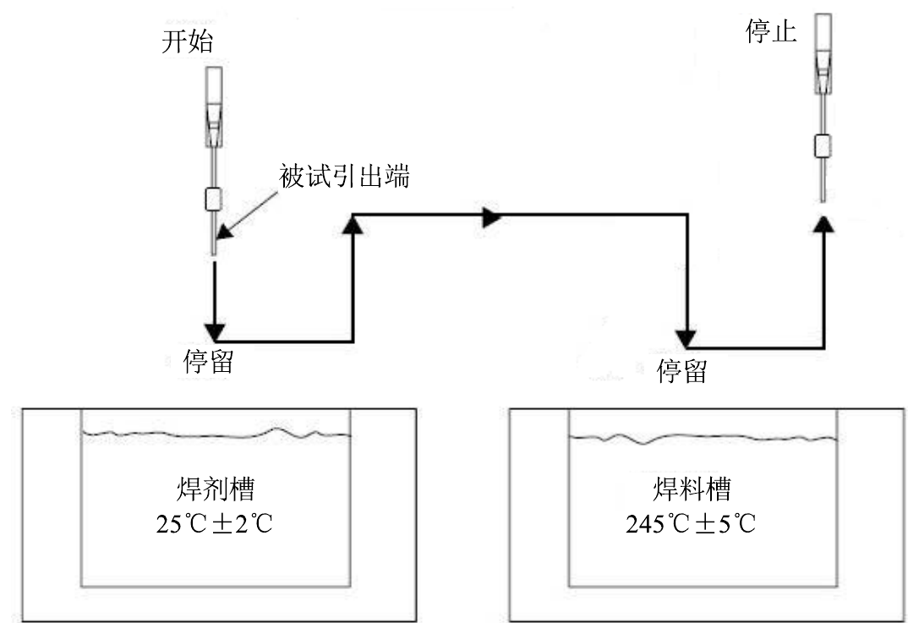

### 3.3 光学设备

应采用放大倍数至少为10倍的双筒显微镜。

照明设备能对样品提供均匀的、无闪光的、全散射的照明。

### 3.4 蒸汽老化设备

应采用足以容纳样品的、且耐腐蚀的容器。样品放置的位置应能使样品的底部高出水表面 \(4\mathrm{cm} \sim 5\mathrm{cm}\) 的距离，用于蒸汽老化的水见4.5。支撑样品的支架应采用无杂质污染的材料。该设备应能按5.2.2要求验证是否已达到规定的温度。

设备应至少每月(或在使用前)进行一次排空与清洗。根据水的洁净度，可能需要更频繁的清洗。清洗时应使用无污染的溶剂。

### 3.5 丝网印刷模板

应使用具有圆形开孔或与试验基板焊盘图形相似的合适形状开孔(如圆角方形)的金属(或其他适用材料，如塑料)模板。采用其他涂覆方式时(如喷涂印刷)，可不使用模板和刮刀。除另有规定外，模板的标称厚度应为 \(0.2\mathrm{mm} \pm 0.025\mathrm{mm}\) (引线节距大于 \(0.635\mathrm{mm}\) 时)。

### 3.6 刮刀

应使用橡胶、塑料或金属刮刀涂覆焊膏。采用其他涂覆方式时（如喷涂印刷），则不适用。

### 3.7 基座夹具

应设计一个能够承载试验基板，并能辅助丝网印刷模板对准的基座夹具，且根据涂覆方式的需要使用。

### 3.8 回流焊设备

应使用热风对流回流焊炉，或能达到推荐回流曲线要求的回流焊设备。除另有规定外，回流焊参数应符合表2要求。

<table><tr><td>方法</td><td>温度峰值 ℃</td><td>时间（达到183 ℃以上的）</td></tr><tr><td>汽相回流焊</td><td>\(215\sim 219\)</td><td>焊膏回流时，停留30s~90s</td></tr><tr><td>红外／对流回流焊</td><td>\(200\sim 230\)</td><td>60s~120s</td></tr><tr><td>烘箱</td><td>\(215\sim 230\)</td><td>2min~5min（直到确保焊膏完全回流）</td></tr><tr><td colspan="3">注：本表中的回流焊参数仅为可焊性试验目的，与潮湿敏感度等级回流焊试验参数无关。回流焊温度和时间可根据适应于电路板回流焊工艺而进行调整。</td></tr></table>

### 3.9 切割设备

应使用能够切割焊柱，但不会产生多余毛刺，同时又不会对焊柱造成损伤的设备（如金刚石线锯机）。

### 4 材料

### 4.1 焊剂

### 4.1.1 规格

焊剂应为符合GB/T 9491规定的R或RMA型松香焊剂，为试验条件C制备铜标准缠绕线和焊柱阵列封装可焊性试验使用的焊剂应为RMA型。

### 4.1.2 焊剂维护

当焊剂不使用时，应密封贮存，使用8h后更换；或者，焊剂应维持在 \(25^{\circ }C\pm 2^{\circ }C\) ，比重为 \(0.842g/cm^{3}\sim 0.846g/cm^{3}\) 之间，使用一周后更换。

### 4.1.3 焊剂去除

可焊性评价前用于清除引线及引出端焊剂的材料应能去除可见焊剂残留物，清洁后的表面不应存在机械损伤。

### 4.2 焊料

焊料应符合GB/T 3131规定的S-Sn60PbA或S-Sn63PbA锡铅焊料。

### 4.3 焊膏

对于焊柱阵列封装可焊性试验，锡铅焊膏成分应符合GB/T 3131规定的S-Sn60PbA或S-Sn63PbA，并满足 \(25\mu m\sim 45\mu m\) 的筛孔要求。焊膏应符合制造方说明中贮存条件和保存期限的要求。

### 4.4 异丙醇

应使用工业纯或纯度更高的、符合要求的异丙醇。

### 4.5 水

用于蒸汽老化的水必须是蒸馏水或去离子水。

注：上述材料中包括有以下物质：易燃的；对眼睛、皮肤或呼吸系统有害的；或者具有巨大烧毁能量的。对眼睛和皮肤应该予以保护，当处置热的物体时，应带防热手套。

### 4.6 计时工具

计时工具应自动计时(适用时),并满足试验方法的精度要求。

### 4.7 铜标准缠绕线

5.3.3 规定的标准缠绕线应采用软的或拉制的且退火未涂覆的引线来制造，引线直径应为 \(0.635\mathrm{mm} \pm 0.127\mathrm{mm}\) 。引线制备应按以下规定:a) 拉直引线，并将引线切割成适宜长度(最短为 \(50\mathrm{mm}\) )。

b) 浸入适当清洗剂(如：异丙醇)中 \(2\mathrm{min}\) ，以去除油脂。

c) 在室温下，在含有氟硼酸(HBF4) \(10\%\) (体积)的水中清洗 \(5\mathrm{min}\) ，并搅拌，操作时要小心。

d) 漂洗去除酸，步骤如下:

1) 用常温去离子水或蒸馏水漂洗两次；

2) 用异丙醇漂洗两次；

3) 自然干燥。

e) 浸入焊剂(GB/T9491中规定的RMA型)。

f) 对于锡铅焊料，浸入 \(245^{\circ}\mathrm{C} \pm 5^{\circ}\mathrm{C}\) 的熔融焊料中 \(5\mathrm{s}\) 。

按4.1.3的要求清洗或漂洗，以去除或溶解残留的焊剂。

标准缠绕导线如果未立即使用时，要将其贮存在干净、有盖的容器中。在涂覆后，标准缠绕导线的使用期限不应当超过30d。

### 4.8 试验基板

试验基板应采用环氧玻璃纤维板(如FR- 4)。基板上应当有若干直径至少比焊柱直径大 \(0.25\mathrm{mm}\) 的金属焊盘(如化学镀镍浸金)。

### 4.9 清洗液

用于去除可见焊剂残留物的清洗液应不会与器件和试验基板发生反应。

### 5 程序

### 5.1 通则

应根据有关订购文件中规定的引出端数目进行试验。本试验可以在存贮或发货包装之前进行，也可以从承制方的包装中取出后立即进行，或作为鉴定和质量一致性检验的一项试验。试验用样品应随机抽取。操作时应注意不要把样品表面弄粗糙，或被油、汗水等污染。

### 5.2 样品准备和表面处理

### 5.2.1 样品准备

试验前对引出端不得作擦拭、清洗、刮或摩擦性处理。应在详细规范中规定对引出端的任何特殊预处理，如试验前的弯曲或重新定向。

### 5.2.2 蒸汽老化

### 5.2.2.1 蒸汽老化条件分类

分类如下:a) A类一对于除金外的所有非锡镀涂，蒸汽预处理 \(1\mathrm{h} \pm 5\mathrm{min}\) ；

b) B类一对于焊柱阵列封装，蒸汽预处理 \(4\mathrm{h} \pm 10\mathrm{min}\) ；

c) C类一对于其他类型的镀涂，包括金，蒸汽预处理 \(8\mathrm{h} \pm 15\mathrm{min}\) 。

### 5.2.2.2 蒸汽老化过程

在加焊剂和随后的浸焊料之前，应对本试验选定的全部样品按5.2.2.1老化条件分类进行预处理。试验处于不同海拔高度进行时，蒸汽温度应根据表3确定。老化过程中只允许间断一次，但时间不得超过 \(10\mathrm{min}\) 。器件在完成规定的试验时间后，应从老化设备中取出。样品从老化设备中取出后的2h内，若不进行可焊性试验，必须在试验前将其贮存在一个干燥的大口瓶或干氮箱内，但不能超过72h。如果超过这一贮存要求，样品将不能用于试验。

当样品从设备中取出后，可以按下述程序之一进行干燥处理：

a) 在干燥环境中(推荐用干燥氮气)，最高 \(100^{\circ}\mathrm{C}\) 下烘焙且不超过1h；b) 在室温环境下空气干燥至少15min。

### 5.2.3 焊剂浸入

除另有规定外，被试验的引出端在室温下浸入焊剂 \(5\mathrm{s}\sim 10\mathrm{s}\) 。然后在浸渍焊料之前必须干燥 \(5\mathrm{s}\sim 20\mathrm{s}\) 。通孔安装轴向、径向及多引线器件的引线应垂直焊剂表面浸入焊剂中。表面安装有引线或无引线器件的引线或引出端应当以与焊剂表面呈 \(20^{\circ}\sim 45^{\circ}\) 浸入焊剂中。焊剂不用时必须盖住，每天至少更换一次。允许吸掉引出端上任何明显的焊剂滴。

### 5.2.4 镀金引出端的焊料浸渍

镀金引出端应采用两个焊料槽进行两次浸焊剂和浸焊料处理。第一次浸入焊料是为了去除引出端上的金。对于镀金器件建议使用单独的焊料槽。应有一个足够大或者是能严格监控焊料成分的小焊料槽，以保证试验按规定进行。

### 5.3 试验条件

### 5.3.1 试验条件A一焊料浸渍及观察试验(通孔安装器件和有引线表面安装器件等)

### 5.3.1.1 概述

适用于通孔安装器件和有引线表面安装器件，以及直径小于 \(1.14\mathrm{mm}\) 的实心导线或直径小于 \(1.02\mathrm{mm}\) 的绞合线。对于通孔安装器件，应保持引线对焊料表面垂直；除订购文件另有规定外，有引线表面安装器件的浸入角应为 \(90^{\circ}\) (见图2)，对任何给定的器件种类，这一角度应保持一致。

### 5.3.1.2 准备

应按5.2要求准备样品。

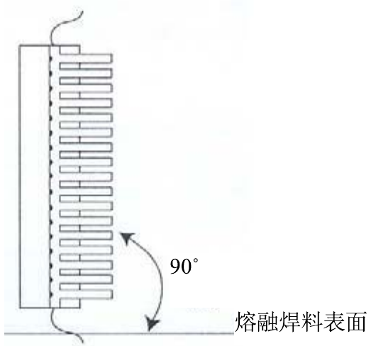

### 5.3.1.3 步骤

具体步骤如下：a) 在浸焊料前，应从熔融焊料表面撤去焊剂浮渣及焦渣；b) 已涂焊剂的样品浸入熔融焊料，焊料表面距有引线通孔安装器件本体或安装支撑面应小于 \(1.27\mathrm{mm}\) （取距离器件本体较远者，见图3）；c) 浸入速度和提出速度为 \(25\mathrm{mm / s}\pm 6\mathrm{mm / s}\) ，停留 \(5_{-0.5}^{+0}\mathrm{s}\) ；d) 提出后，在维持样品试验条件的同时，焊料允许在空气中冷却固化；e) 检查前，应按4.1.3要求，去除所有引线上的全部可见残余焊剂。

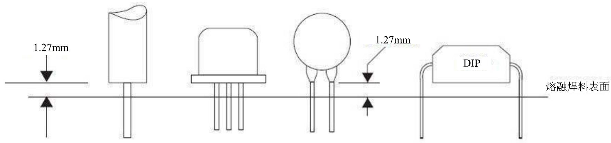

### 5.3.1.4 评价

### 5.3.1.4.1 放大倍数

器件应在3.3规定的10倍放大设备下检查。对小节距引线器件 \((0.5\mathrm{mm}\) 节距或更小)，检验放大倍数应为30倍。

### 5.3.1.4.2 接收/拒收判据

对于所有引线中的任何一根引线，表面至少 \(95\%\) 的关键区域(见附录A)覆盖有连续的无缺陷的焊料层。反浸润、非浸润、针孔和空洞以外的异常不应拒收(见附录B)。

### 5.3.2 试验条件B一焊料浸渍及观察试验(无引线表面安装器件)

### 5.3.2.1 概述

适用于无引线表面安装器件的焊料浸渍及观察试验。无引线表面安装器件应按与焊剂表面成 \(20^{\circ}\sim\)\(45^{\circ}\) 角的方向浸入，分立片式器件和裸焊盘封装的浸入角度应当为 \(0^{\circ}\) (见图4)。如果另有规定，则可以采用其他浸入角度。

### 5.3.2.2 准备

应按5.2要求准备样品。

### 5.3.2.3 步骤

具体步骤如下：a) 在浸焊料前，应从熔融焊料表面撤去焊剂浮渣及焦渣；b) 已涂焊剂样品浸入熔融焊料深度最少为 \(0.10\mathrm{mm}\) (见图4)，浸入和提出速度为 \(25\mathrm{mm / s}\pm 6\mathrm{mm / s}\) ，停留 \(5_{-0.5}^{+0}\mathrm{s}\) ，大体积器件可能需要在熔融焊料中停留更长时间(大体积器件指有厚热沉封装的器件，此类器件的停留时间应按有关规定执行)；c) 提出后，在维持样品试验条件的同时，焊料允许在空气中冷却固化；d) 检验前，应按4.1.3要求，去除所有引出端上的全部可见残余焊剂。

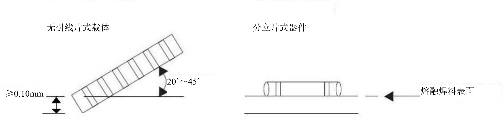

### 5.3.2.4 评价

### 5.3.2.4.1 放大倍数

器件应在3.3规定的10倍放大设备下检查。对小节距引出端器件(0.5mm节距或更小)，检验放大倍数应为30倍。

### 5.3.2.4.2 接收/拒收判据

对于任何一个引出端，至少 \(95\%\) 的面积覆盖有连续的无缺陷的焊料层。对于外露焊盘封装，外露的焊盘表面应当有连续的焊料层，并且这些表面至少有 \(80\%\) 的关键区域(见附录A)无缺陷。反浸润、非浸润、针孔和空洞以外的异常不应拒收(见附录B)。表面安装器件在器件制造过程中未镀覆的焊盘侧端面或剪切的器件引出端垂直表面允许暴露出端金属。

### 5.3.3 试验条件C一缠绕线试验(焊片、转接片、接线端、实心导线)

### 5.3.3.1 概述

适用于焊片、转接片、接线端、直径大于 \(1.14\mathrm{mm}\) 的实心导线或直径大于 \(1.02\mathrm{mm}\) 的绞合线的缠绕线试验。

### 5.3.3.2 准备

应按5.2要求准备样品。

a）对于焊片、转接片、接线端、直径大于 \(1.14\mathrm{mm}\) 的实心导线及直径大于 \(1.02\mathrm{mm}\) 的绞合线使用标准可焊线时，所有样品应用标准导线缠绕待试验部分1.5匝。

b）用4.7规定的标准缠绕线缠绕后，在浸焊料期间不应相对移动。图5是这种导线缠绕方式的示例。

c）若需要，在规范中应单独规定涉及样品缠绕部分的特殊说明。

d）对设计用于直径小于 \(0.6\mathrm{mm}\) 引线的焊片、转接片，4.7规定的标准铜缠绕线应与所设计的焊片、转接片的尺寸相同。

### 5.3.3.3 步骤

具体步骤如下：a）焊剂应处于室温，并符合4.1要求；

b）引出端浸入焊剂中的最小深度应能覆盖被试表面；

c）被试表面应浸入焊剂 \(5\mathrm{s}\sim 10\mathrm{s}\) ，并允许沥干 \(10\mathrm{s}\sim 60\mathrm{s}\)

d）在引出端浸焊料前，应从熔融焊料表面撤去焊剂浮渣及焦渣；

e）浸入和提出速度为 \(25\mathrm{mm / s}\pm 6\mathrm{mm / s}\) ，停留 \(7\mathrm{s}\pm 0.5\mathrm{s}\)

f）样品系吊到浸焊料装置，已涂焊剂的引出端浸入熔融焊料中一次，深度与5.3.3.3b)相同；

g）浸完后，允许被试件在空气中冷却；

h）检验前，应按4.1.3要求，去除所有引出端上的全部可见残余焊剂。

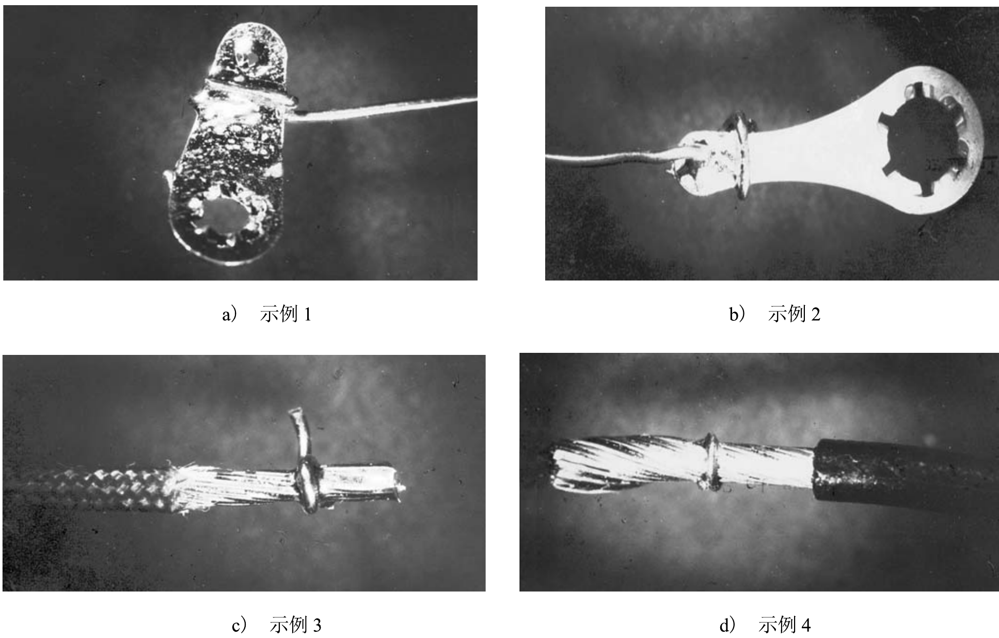

### 5.3.3.4 评价

### 5.3.3.4.1 放大倍数

样品应在3.3规定的10倍放大设备下检查。

### 5.3.3.4.2 接收/拒收判据

可焊性接收判据为：a) 在标准缠绕线和引出端之间焊缝总长度的至少 \(95\%\) 与引出端表面相切，并且无针孔等异常；

b) 粗糙的或不连续的相切是一种缺陷。

有争议时，存在缺陷的焊接轮廓线长度百分比应通过实际测量确定。附录B中的图B.4可以帮助评价 \(5\%\) 的允许缺陷。

### 5.3.4 焊球阵列封装可焊性试验

见GJB7677的可焊性试验。

### 5.3.5 焊柱阵列封装可焊性试验

### 5.3.5.1 步骤

具体步骤如下：a) 将试验基板和丝网印刷模板放在基座夹具上。b) 将足够量的焊膏涂到丝网印刷模板上。将焊膏涂覆到模板/丝网上，经一次平稳的推刮焊膏，将引出端图形印刷至试验基板。c) 小心地将丝网印刷模板移开，确保焊膏已完全覆盖金属焊盘。d) 小心地将器件的焊柱放入已印刷好的焊膏中。e) 小心地将器件和试验基板一起从基座夹具上移开。f) 在适当的放大倍数下确认器件是否对准。g) 对器件和试验基板实施回流焊接。根据采用的回流焊方法，从表2中选择回流焊参数。h) 冷却后在清洗液中清洗器件和试验基板。

i) 使用切割设备从试验基板上切下器件， 小心保护与试验基板界面处的焊接点。

### 5.3.5.2 评价

订购文件中规定的焊柱数量应在试验中随机选择。不完全在焊盘周长范围内的焊柱应在选择过程中被剔除。

试验基板上的焊缝应放大 15 倍 \(\sim 30\) 倍进行检查， 在确认失效时， 可采用高放大倍数 (直至 60 倍)。接收判据： 焊柱至少 \(50\%\) 的周长边应可见被良好浸润， 浸润角 \(\theta\) 应小于等于 \(90^{\circ}\) ， 如图 6 所示。

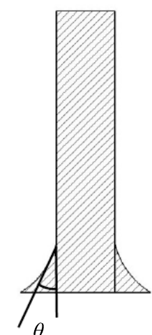

### 6 说明

有关的订购文件应规定以下内容:

a) 浸入深度， 若与本方法不同；

b) 表面安装有引线器件的浸入角， 若不是 \(90^{\circ}\) ；

c) 试验后的测试(适用时);

d) 丝网印刷模板厚度， 若与本方法不同；

e) 焊膏成分， 若与本方法不同。

### 附录A (方法2003)

(规范性附录)

器件可焊性考核的关键区域不同类型器件可焊性考核关键区域见图A.1～图A.10。

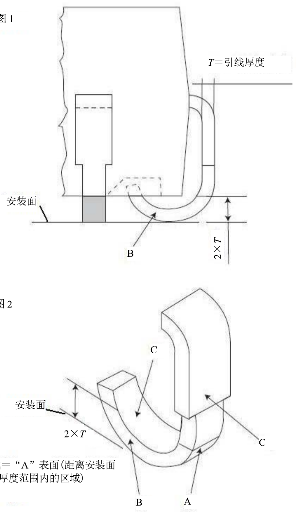

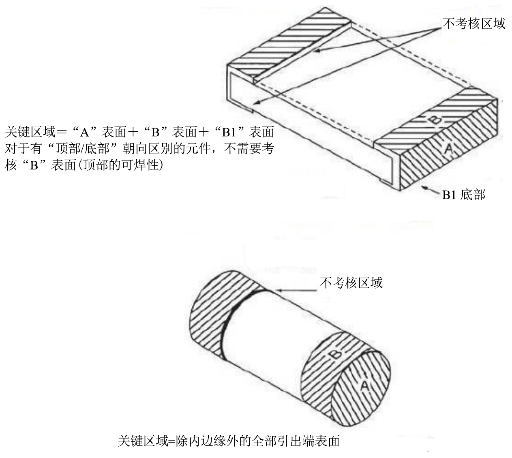

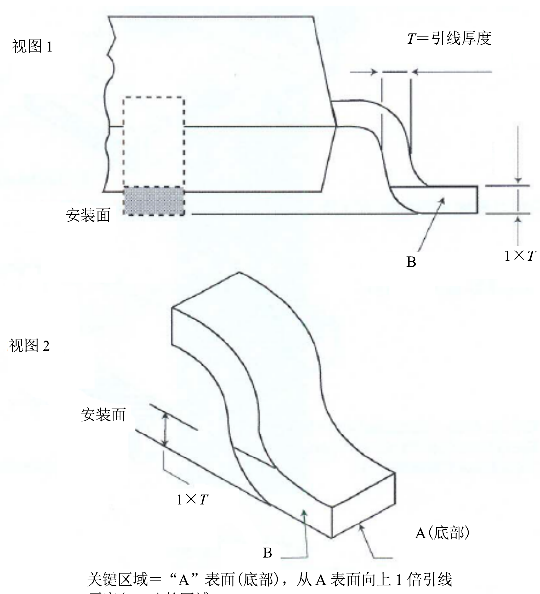

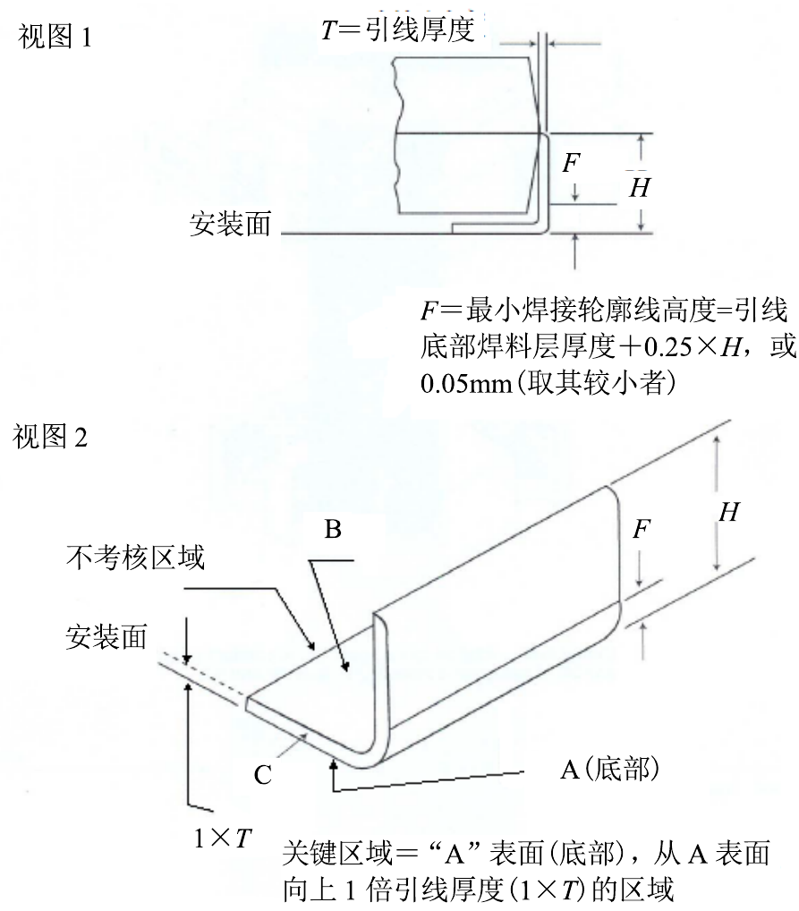

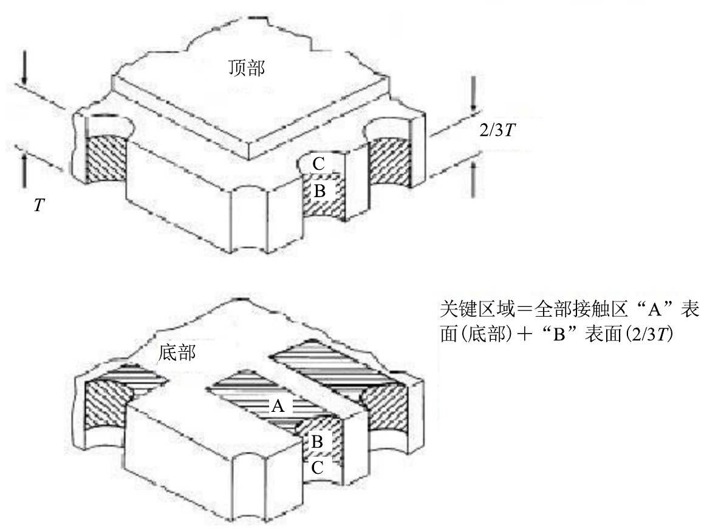

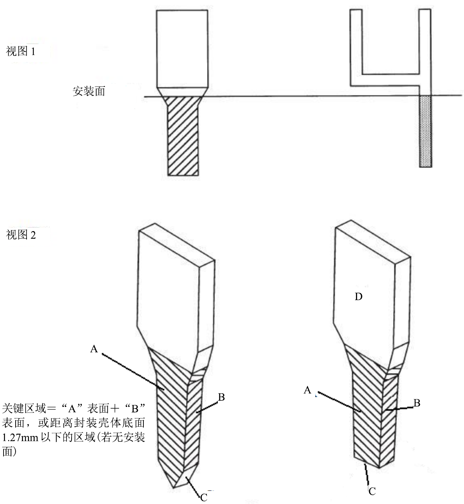

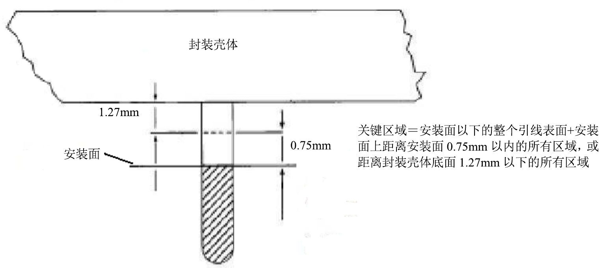

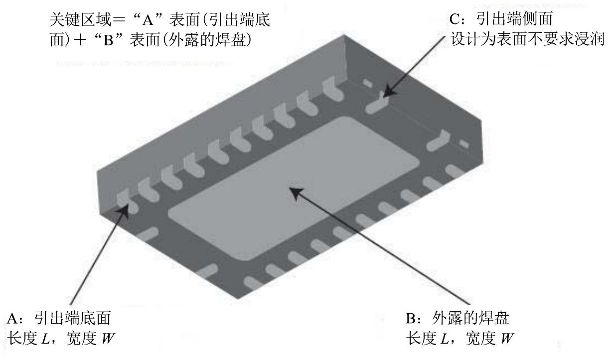

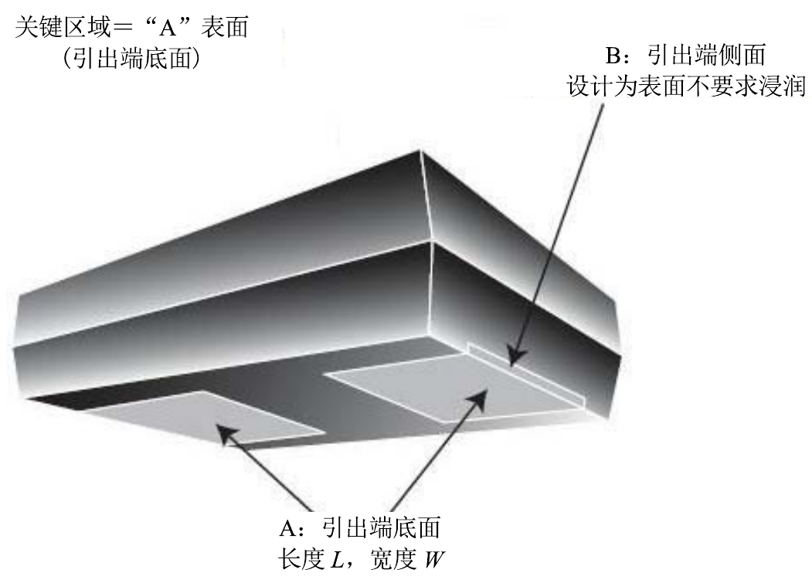


### 附录B (方法2003)

(规范性附录)

试验条件A和试验条件C的评价指南

### B.1 目的

本附录为试验条件A和试验条件C提供评价指南。

### B.2 圆柱形引线

圆柱形引线的缺陷测量或引线全部表面区域缺陷面积百分比估算比扁平矩形引线表面更为困难。例如，观察圆柱形引线的圆柱表面，一个测量直径为圆形的缺陷变成平面时显示是椭圆形，并且宽度比引线横向可见表面更窄。

为帮助可焊性试验检验员估算可焊性试验后引线表面百分比，图B.3是不同直径引线 \(5\%\) 允许针孔面积评价辅助图，当检验直径 \(0.5\mathrm{mm}\) 、长 \(25.4\mathrm{mm}\) 的引线表面焊料涂覆，10个直径等同于引线直径的缺陷的面积等于全部引线表面积的 \(5\%\) ，图B.1中也列出了缺陷直径为1/2引线直径及1/4引线直径情况下的最大缺陷允许数目，这些不同尺度缺陷的组合也能容易地计算。


考虑未被连续的新焊料涂覆的区域及查阅图B.2图例中规定的缺陷时，反浸润及非浸润的可见区域可直接适用。

构成浸渍面积 \(5\%\) 的一个例子是：直径 \(0.813\mathrm{mm}\) 、长度 \(25.4\mathrm{mm}\) 引线上六个直径 \(0.813\mathrm{mm}\) 的缺陷（见图B.3、图B.4及图B.5）。

### B.3 矩形引出端

矩形引出端应符合图B.5中可焊性涂覆指南的要求。

### B.4 堡形引出端

堡形引出端应符合与圆柱形引线相同的判据。


## 方法2004.3 引线牢固性

### 1 目的

本方法提供了几种不同的试验，用来测定器件引线(引出端)的牢固性和焊接的牢固性、密封性。试验条件A用于直线拉力负荷试验；试验条件 \(\mathrm{A_1}\) 用于试验带钎焊引线外壳的钎焊引线；试验条件 \(\mathrm{B_1}\) 用于施加弯曲应力来测定引线涂层的牢固性和密封性；试验条件 \(\mathrm{B_2}\) 则用于多次施加弯曲应力的情况，主要用来测定引线在多次弯曲时的抗金属疲劳性能；试验条件 \(\mathrm{C_1}\) 和 \(\mathrm{C_2}\) 规定对器件引线或者螺栓分别施加扭矩或转矩，以测定引线的牢固性和密封性能；试验条件D用于施加剥离和拉伸的应力，以测定无引线封装引出端的附着和镀层的牢固性；试验条件E用于通过弯曲试验，以测定易弯曲和半易弯曲引线的镀层牢固性。建议在试验条件A、 \(\mathrm{B_1}\) 和 \(\mathrm{C_1}\) 试验之后按方法1014进行密封试验，以确定所施加的应力对密封和引线(引出端)的影响。

注：本试验方法不适用于焊球阵列(BGA)或焊柱阵列(CGA)封装器件。

### 2 术语和定义

下列术语和定义适用于本方法。

### 2.1 弯曲循环 bending cycle

将引线从一个参考位置(如 \(0^{\circ}\) )弯曲到一个规定的角度，然后恢复到最初参考位置(如 \(0^{\circ}\) )。在一个引线上的所有弯曲操作都应该没有扭转且无限制地在同一个方向和平面上进行。

### 2.2 截面模量 section modules

矩形引线的截面模量为(宽度 \(\times\) 厚度) \(/6(\mathrm{mm}^3)\) ，圆柱形引线的截面模量为 \(0.098\times\) 直径 \(^3 (\mathrm{mm}^3)\) 。如：一个宽度为 \(0.51\mathrm{mm}\) 、厚度为 \(0.15\mathrm{mm}\) 的矩形引线截面模量为 \(1.91\times 10^{- 3}\mathrm{mm}^3\) ；一个直径为 \(0.51\mathrm{mm}\) 的圆柱形引线的截面模量为 \(1.30\times 10^{- 2}\mathrm{mm}^3\) 。

### 2.3 易弯曲引线 flexible lead

如果一个矩形引线的截面模量小于或等于横截面为 \(0.15\mathrm{mm}\times 0.51\mathrm{mm}\) 的等效矩形引线截面模量，则该引线为易弯曲引线。直径小于或等于 \(0.51\mathrm{mm}\) 的圆柱形引线，即使其使用时不进行弯曲，该引线仍定义为易弯曲引线，因为这些引线可能要经历常规手工处理。

### 2.4 刚性引线或刚性引出端 rigid lead or terminal

如果一个矩形引线或引出端的截面模量大于横截面为 \(0.15\mathrm{mm}\times 0.51\mathrm{mm}\) 的等效矩形引线截面模量，且不准备在最终使用时对引线进行弯曲或成型，则该引线或引出端为刚性引线或刚性引出端。圆柱形引线的直径大于 \(0.51\mathrm{mm}\) ，且最终使用时不准备对引线进行弯曲或成型，则该引线为刚性引线。

### 2.5 半易弯曲引线 semi-flexible lead

如果一个矩形引线或引出端的截面模量大于横截面为 \(0.15\mathrm{mm}\times 0.51\mathrm{mm}\) ，的等效矩形引线截面模量，且要求在最终使用时对引线进行弯曲或成型，则该引线为半易弯曲引线。圆柱形引线的直径大于 \(0.51\mathrm{mm}\) ，且要求在最终使用时对引线进行弯曲或成型，则该引线为半易弯曲引线。

### 3 适用于所有试验条件的一般程序

器件应经受规定试验条件所确定的应力作用，并进行规定的终点测试和检查(预处理除外)或按其他规定。除另有规定外，至少应从三个器件中按样品数抽取引线、引出端、螺栓或焊盘，或在订购文件中规定被试引线(引出端)的数量及选择方式。

### 4 试验条件A(拉力)

### 4.1 目的

本试验目的是为检验器件引线(引出端)、焊接及密封的抗直线拉力能力。

### 4.2 设备

拉力试验要求采用适当的固定装置、夹具、支架或其他适当的器具，来固定器件并施加规定的力，同时又不限制引线活动。也可采用等效的其他线性拉力试验设备。

### 4.3 程序

除另有规定外，应在与引线或引出端的轴平行方向上，对每根被试引线或引出端无冲击地施加 \(2.22\mathrm{N}\) 的力，并至少保持 \(30\mathrm{s}\) 。应尽量在接近引线(引出端)的末端施加力。

### 4.4 失效判据

当去掉应力后放大10倍 \(\sim 20\) 倍检查时，任何完全的破裂(如引出端脱离本体)或引线在玻璃/陶瓷密封处的松动而导致按方法1014进行密封试验的不合格都应视作失效。在引线牢固性试验后按方法1014进行密封试验时，通过密封试验器件的弯月区裂纹不应拒收。

### 4.5 说明

有关的订购文件应规定以下内容:a) 如不是 \(2.22\mathrm{N}\) (见4.3),施加到引线上的力；

b) 如不是 \(30\mathrm{s}\) (见4.3),在引线上施加力的时间。

### 5 试验条件A(引线钎焊牢固性)

### 5.1 目的

本试验针对钎焊引线外壳，试验引线与外壳的钎焊牢固性。本试验适用于扁平外壳和双列直插形式的外壳。

### 5.2 设备

采用适当的固定装置、夹具、支架或其他适当的器具，来固定器件并施加规定的力，同时又不限制引线活动。也可采用等效的其他线性拉力试验设各。

### 5.3 程序

除另有规定外，应在垂直于引线或引出端钎焊表面的方向上，对每根被试引线或引出端无冲击地施加 \(2.22\mathrm{N}\) 的力，并至少保持 \(30\mathrm{s}\) (即：施加使引线趋于从钎焊材料表面拉脱或剥离的力)。应尽可能地在接近引线(引出端)的末端施加力。

### 5.4 失效判据

当去掉应力后放大10倍 \(\sim 20\) 倍检查时，任何钎焊连接的引线开裂或引线脱离外壳的迹象都应视作失效。

### 5.5 说明

有关的订购文件应规定以下内容:a) 如不是 \(2.22\mathrm{N}\) (见5.3),施加到引线上的力；

b) 如不是 \(30\mathrm{s}\) (见5.3),在引线上施加力的时间。

### 6 试验条件B(弯曲应力)

### 6.1 目的

本试验是检验器件的引线、引线焊接和密封承受施加于引线和密封上弯曲应力的能力，这些应力可能出现在器件的实际使用和组装过程中，或是在环境试验前用适当的弯曲应力对引线进行预处理时。

### 6.2 设备

为了按规定的弯曲角度施加弯曲应力，需有适当的器件固定装置、夹具、支架或其他适当的器具。

### 6.3 程序

### 6.3.1 通则

每根被试引线或引出端均应采用 \(6.3.2 \sim 6.3.8\) 的适用程序接受规定的力。可对器件部分或全部引线同时进行弯曲试验。排列成行的引线可一次弯曲一行。每根引线应在一个方向弯曲并大致恢复到原始位置。全部弯曲应在同一个平面上而又不会限制引线的活动。

### 6.3.2 弯曲方向

6.3.2 弯曲方向被试引线应在刚性最小的方向进行弯曲。如没有刚性最小的方向，可在任何方向弯曲。引线弯曲时不应干扰其他引线。当干扰是不可避免时，被试引线就应朝相反的方向弯曲到规定角度，再大致恢复到原始位置。

### 6.3.3 预成型引线的试验程序

6.3.3 预成型引线的试验程序当通常的直引线(包括双列结构的交错式引线)处在预成型状态时，如果引线是在镀涂后成型的并且至少能使引线像规定的弯曲那样成为永久性形变，引线的预成型操作就可作为替代规定弯曲应力试验的可接收试验。

### 6.3.4 易弯曲和半易弯曲引线(如扁平外壳、轴向引线金属圆形外壳等)的试验程序

### 6.3.4.1 易弯曲引线

除另有规定外，易弯曲的引线应弯成弧形，在引线末端测量的弯曲角度至少应为 \(45^{\circ}\) 。

### 6.3.4.2 半易弯曲引线

除另有规定外，半易弯曲引线应弯成弧形，在引线末端测量的弯曲角度至少应为 \(30^{\circ}\) 。

### 6.3.5 双列直插封装和针栅阵列封装引线的试验程序

### 6.3.5.1 双列直插封装(扁平、侧边钎焊、浴盆形)

6.3.5.1 双列直插封装(扁平、侧边钎焊、浴盆形)双列直插封装(扁平、侧边钎焊、浴盆形)插装时其引线通常平行排列并与封装底部成 \(90^{\circ}\) 。双列直插封装引线应向内弯曲一个足以使引线保持至少 \(15^{\circ}\) 永久弯曲的角度(去掉应力后)。对于结构1和结构2(见图1)，应从引线末端到第一弯曲点测量弯曲角度；对于结构3(见图1)，应从引线末端到安装平面测量弯曲角度。

### 6.3.5.2 针栅阵列封装

6.3.5.2 针栅阵列封装针栅阵列封装应使相对边上位于外侧一列的受试引线弯曲到一个足以使引线保持至少 \(15^{\circ}\) 永久弯曲的角度(去掉应力后)。弯曲角 \(15^{\circ}\) 是与引线正常位置间的夹角，并应在接近安装平面处进行弯曲。


### 6.3.6 刚性引线或引出端的试验程序

除另有规定外，器件的刚性引线或引出端应至少永久性(去掉应力后)弯曲到 \(10^{\circ}\) 。

注：刚性引线或引出端可基于本试验条件目的按器件用户的要求调整弯曲角度。

### 6.3.7 小外形封装(SOP)和四边扁平封装(QFP)的翼形引线试验程序

对于小外形封装(SOP)和四边扁平封装(QFP)(见图1的结构4)，引线应先向外弯曲 \(15^{\circ}\) ，然后再向内弯曲 \(30^{\circ}\) ，最后恢复到原始位置(见图2)。


### 6.3.8 小外形封装(SOJ)和四边扁平封装(QFJ)的J形引线试验程序

### 6.3.8.1 引线

对于小外形J形引线封装(SOJ)和四边扁平J形引线封装(QFJ)(见图1的结构5)，应从试验样本的每个样品中随机选取被试引线，从每边引线中选取，且一次只对单边引线进行预处理和试验。

### 6.3.8.2 J形引线校直

具体操作如下：a) 把封装安装在类似图3的夹具上；b) 使用合适的钳子将引线肩部和过渡区拉直(见图4)；c) 将封装引线的J形弯曲段小心拉直，使其与引线最宽方向近似垂直；d) 应小心操作以免引线受损，如裂缝、扭结或深划痕。


### 6.3.8.3 引线检查

在引线校直前和校直后采用光学显微镜放大10倍 \(\sim 20\) 倍检查每根引线，由于校直而受损的引线不能试验。

### 6.3.8.4 封装安装

使用必要的垫片把封装固定在引线弯曲试验夹具上，要求被试引线垂直朝下，即相对于封装底部呈 \(90^{\circ}\) 角。

### 6.3.8.5 试验

弯曲方向为相对于封装朝外，其余按6.3.5.1进行试验。

### 6.3.8.6 旋转封装本体

选择另一个未试验过的引线并把一个 \(4.45\mathrm{N}\pm 0.14\mathrm{N}\) 的力加到校直引线支撑部位(狭小部位)的下端。应小心避免对被试引线或相邻引线产生扭曲或试验要求外的弯曲。旋转封装本体 \(30^{\circ}\) 再恢复到原始位置，一次循环应在 \(2\mathrm{s}\sim 5\mathrm{s}\) 内完成。封装体的旋转须避免施加力的摇摆或扭转(见图3)。

### 6.3.9 失效判据

当去掉应力后放大10倍 \(\sim 20\) 倍检查时，任何完全的破裂(如引出端脱离本体)或引线在玻璃/陶瓷密封处的破裂、松动、相对位移而导致按方法1014进行密封试验的不合格都应视作失效。在引线牢固性试验后按方法1014进行密封试验时，通过密封试验器件的弯月区裂纹不应拒收。

注：对于QFJ和SOJ封装弯曲试验的失效判据仅适用于图3中规定的最宽引线区域。

### 6.4 说明

有关的订购文件应规定以下内容:a) 若与规定不同时(见6.3),应规定弯曲的角度；

b) 若与规定不同时(见6.3),应规定试验的程序；

c) 若与规定不同时(见6.3),应规定被试引线(引出端)的数量和选择方式；

d) 适用时，试验后的测试。

### 7 试验条件 \(\mathbf{B}_{2}\) (引线疲劳)

### 7.1 目的

本试验是为了检验引线抗金属疲劳的能力。

### 7.2 设备

为了按规定的角度重复施加弯曲应力，需要有适当的器件固定装置、夹具、支架或其他适用的器具。

### 7.3 程序

### 7.3.1 通则

每根被试引线或引出端均应采用 \(7.3.2\sim 7.3.10\) 的适用程序接受规定的力。每根引线均应在同一方向并按规定角度进行试验，并恢复到原始位置。所有引线弯曲都应在同一平面内进行，且不互相干扰。一次循环应在 \(2\mathrm{s}\sim 5\mathrm{s}\) 内完成。对于矩形或带状引线器件，弯曲方向平面应垂直于引线平面。试验不应在外壳引线的根部进行，否则会把主要的扭力施加在引线密封处。

### 7.3.2 弯曲方向

被试引线应在刚性最小的方向进行弯曲。如没有刚性最小的方向，可在任何方向弯曲。引线弯曲时不应干扰其他引线。如这种干扰是不可避免的，被试引线就应朝与规定角度相反的方向弯曲，再恢复到原始位置。

### 7.3.3 预成型引线的试验程序

当通常的直引线(包括双列结构的交错式引线)处在预成型状态时，如果引线是在镀涂后成型的并且至少能使引线像规定的弯曲那样成为永久性形变，引线的预成型操作就可作为替代规定引线疲劳试验的可接受试验。

### 7.3.4 易弯曲引线封装的试验程序

易弯曲引线的试验力应为 \(0.83\mathrm{N}\pm 0.08\mathrm{N}\) 。除另外规定外，每根引线应进行三次 \(90^{\circ}\pm 5^{\circ}\) 的弯曲循环。

### 7.3.5 半易弯曲引线封装的试验程序

半易弯曲引线的试验力应为 \(2.22\mathrm{N}\pm 0.14\mathrm{N}\) 。除另外规定外，每根引线应进行三次 \(90^{\circ}\pm 5^{\circ}\) 的弯曲循环。

7.3.6 双列封装和针栅阵列封装引线的试验程序

7.3.6.1 双列直插封装(扁平、侧边钎焊、浴盆形引线)

双列直插封装(扁平、侧边钎焊、浴盆形)插装时其引线通常平行排列并与封装底部成 \(90^{\circ}\) 。双列直插封装引线应向内弯曲一个角度三次，该角度应足以使引线保持 \(15^{\circ}\) 的永久弯曲(去掉应力后)。对于结构1和结构2,应从引线末端到第一弯曲处测量弯曲角度(见图1);对于结构3,应从引线末端到安装平面测量弯曲角度(见图1)。

### 7.3.6.2 针栅阵列封装

针栅阵列封装应使相对边上位于外侧一列的受试引线弯曲一个角度三次，该角度应足以使引线保持 \(15^{\circ}\) 的永久弯曲(去掉应力后)。弯曲角 \(15^{\circ}\) 是与引线正常位置间的夹角，并应在接近安装平面处进行弯曲。在完成起始的弯曲后，应使引线恢复到原始位置。

### 7.3.7 半易弯曲和易弯曲引线的可选程序

作为所有尺寸引线的一种可选试验，除另外规定外，按公式(1)确定的力将施加到每根被试引线上，使外壳本体作 \(90^{\circ} \pm 5^{\circ}\) 的旋转。7.3.4和7.3.5的所有其他条件都适用。

式中:

\(W\) ——试验力，N;

\(S\) ——引线横截面积， \(\mathrm{mm}^{2}\)

\(K\) ——具体材料的极限抗拉强度， \(\mathrm{N} / \mathrm{mm}^{2}\) 。

可伐材料的极限抗拉强度典型值为 \(519.4 \mathrm{~N} / \mathrm{mm}^{2}\) ，42号合金的极限抗拉强度典型值为 \(490 \mathrm{~N} / \mathrm{mm}^{2}\) 。其他材料的极限抗拉强度可向供货商索取或通过其他途径得到。计算结果应四舍五入取整。

### 7.3.8 刚性引线和引出端的试验程序

不需要对刚性引线和引出端进行试验。

### 7.3.9 小外形封装(SOP)和四边扁平封装(QFP)的翼形引线试验程序

SOP和QFP封装应按弯曲应力试验(试验条件 \(\mathrm{B}_{1}\) )的6.3.7进行三次弯曲循环，试验力由引线截面模量决定。

矩形引线的截面模量大于横截面为 \(0.15 \mathrm{~mm} \times 0.51 \mathrm{~mm}\) 的等效矩形引线截面模量，或圆柱形引线的直径大于 \(0.51 \mathrm{~mm}\) ，则试验力为 \((2.22 \pm 0.14) \mathrm{~N}\) 。

矩形引线的截面模量大于 \(0.10 \mathrm{~mm} \times 0.25 \mathrm{~mm}\) ，且小于或等于 \(0.15 \mathrm{~mm} \times 0.51 \mathrm{~mm}\) 的等效矩形引线截面模量，或圆柱形引线直径大于 \(0.25 \mathrm{~mm}\) ，且小于或等于 \(0.51 \mathrm{~mm}\) ，则试验力为 \((0.83 \pm 0.08) \mathrm{~N}\) 。

矩形引线的截面模量小于或等于 \(0.10 \mathrm{~mm} \times 0.25 \mathrm{~mm}\) 的等效矩形引线截面模量，或圆柱形引线的直径小于或等于 \(0.25 \mathrm{~mm}\) ，则试验力为 \((0.42 \pm 0.03) \mathrm{~N}\) 。

### 7.3.10 小外形封装(SOJ)和四边扁平封装(QFJ)的J形引线试验程序

按弯曲应力试验(试验条件 \(\mathrm{B}_{1}\) )的 \(6.3.8.1 \sim 6.3.8.4\) 进行引线预处理，试验力由引线截面模量决定。按弯曲应力试验(试验条件 \(\mathrm{B}_{1}\) )的 \(6.3.8.5\) 和 \(6.3.8.6\) 进行三次弯曲循环。

### 7.3.11 失效判据

去掉应力后放大10倍 \(\sim 20\) 倍检查，任何完全的断裂(如引线脱离本体)都被视为失效。

注：对于QFJ封装来说，按弯曲应力试验(试验条件 \(\mathrm{B}_{1}\) )6.3.8.5的规定进行试验，其失效判据仅适用于从引线最宽部位到最窄部位的过渡区域。对于QFJ封装弯曲来说，按弯曲应力试验(试验条件 \(\mathrm{B}_{1}\) )6.3.8.5的规定进行试验，其失效判据适用于整根引线，而对于6.3.8.6则仅适用于引线最宽部位。

### 7.4 说明

有关的订购文件应规定以下内容:a) 若与规定不同时(见7.3),则应规定施加到引线上的力；

b) 若与规定不同时(见7.3),则应规定循环次数；

c) 若与规定不同时(见7.3),则应规定弯曲角度；

d) 若与规定不同时(见7.3),则应规定被试引线(引出端)的数量和选择方式；

e) 适用时，试验后的测试。

### 8 试验条件C(引线扭矩)

### 8.1 目的

本试验是为了检验器件引线(引出端)和密封的抗扭能力。

### 8.2 设备

8.2 设备扭矩试验需要适当的夹具、固定装置和扭力扳头，或其他能施加规定扭矩而又不妨碍引线运动的适当工具。

### 8.3 程序

### 8.3.1 具有圆形截面引线或引出端器件的试验程序

8.3.1 具有圆形截面引线或引出端器件的试验程序对器件本体作刚性固定，以引线(引出端)为轴，在被试引线(引出端)上无冲击地施加规定的扭矩至少15s。

### 8.3.2 具有矩形截面引线或引出端器件的试验程序

8.3.2 具有矩形截面引线或引出端器件的试验程序对器件本体作刚性固定，除另有规定外，在离器件本体 \(3.05\mathrm{mm}\pm 0.76\mathrm{mm}\) 处，或当引线不足 \(3.05\mathrm{mm}\) 长时则在引线末端处，对引线(引出端)施加 \(14.21\mathrm{N}\cdot \mathrm{mm}\pm 1.42\mathrm{N}\cdot \mathrm{mm}\) 的扭矩。以引线的轴线为轴，顺时针方向和逆时针方向各施加一次扭矩。如引线在靠近器件本体处作了成形处理，则在离成形部位 \(3.05\mathrm{mm}\pm 0.76\mathrm{mm}\) 处加扭矩。对于施加的扭矩小于规定值就扭转明显的器件引线，应继续扭转直至扭转角度达到 \(30^{\circ}\pm 10^{\circ}\) ，或达到规定的扭矩，取两者中首先出现的条件。然后应把引线恢复到原来位置。

### 8.3.3 失效判据

8.3.3 失效判据当去掉应力后放大10倍 \(\sim 20\) 倍检查时，任何完全的破裂(如引出端脱离本体)或引线在玻璃/陶瓷密封处的松动而导致按方法1014进行密封试验的不合格都应视作失效。在引线牢固性试验后按方法1014进行密封试验时，通过密封试验器件的弯月区裂纹不应作为拒收理由。

### 8.4 说明

有关的订购文件应规定以下内容:a) 对圆形截面引线所加的扭矩(见8.3.1);

b) 如不是至少15s,应规定对圆形截面引线施加扭矩的持续时间(见8.3.1);

c) 如不是 \(14.21\mathrm{N}\cdot \mathrm{mm}\pm 1.42\mathrm{N}\cdot \mathrm{mm}\) ，应规定对矩形截面引线所加的扭矩(见8.3.2);

d) 适用时，试验后的测试。

### 9 试验条件C(螺栓转矩)

### 9.1 目的

本试验用来检验带有通孔安装的螺栓型器件对在组装时紧固器件所造成应力的抵抗力。

### 9.2 设备

9.2 设备转矩试验需要适当的夹具、固定装置和转矩扳手，或能产生规定转矩的适当工具。

### 9.3 程序

9.3 程序利用器件的本体或凸缘处夹好器件，再把一个等于被试螺栓的六个螺距厚度的扁平型钢垫圈和一个新的二级配合的钢螺母按顺序装在螺栓上，所有部件都要清洗和干燥。然后无冲击地把规定转矩加到螺母上，并保持规定时间，而后从器件上拆下螺母和垫圈，检查器件柔顺性是否符合要求。

### 9.4 失效判据

出现下述任一情况器件应视为失效:

a) 螺栓破裂或被拉长1/2螺距以上；

b) 通不过规定的试验后终点测试；

c) 有明显的螺纹剥离或装配面变形。

9.5 说明有关的订购文件应规定以下内容:a) 施加的转矩大小(见9.3);

b) 施加转矩的维持时间(见9.3);

c) 试验后的测试。

### 10 试验条件D(无引线片式载体和同类封装器件的焊盘附着性能)

### 10.1 目的

本试验是用以检验器件焊盘承受规定时间剥离/拉脱应力作用的能力。

### 10.2 设备

本试验所用设备应包括放大10倍的显微镜，以及合适的夹具和固定装置，用以固定器件，并能对焊接在器件焊盘的导线施加规定拉力/时间的试验条件。也可采用等效的线性拉力试验设备。

### 10.3 程序

除另有规定外，剥离/拉脱应力试验应对用于本试验的每个器件上随机选择的焊盘进行。并且，除另有规定外，应至少从三个器件的所有焊盘中，采用 \(\mathrm{LTPD} = 15\) 、C(0)的抽样方案选取试验焊盘。器件预处理和试验应符合本方法中图5的规定和下述要求:

a) 把直径很接近但未超出标称焊盘宽度的、经预镀锡退火处理的实芯软铜线，用铅锡焊料(S- \(\mathrm{Sn60PbA}\) 或 \(\mathrm{S - Sn63PbA}\) )焊接到每个被试验的焊盘，使导线被焊接在整个焊盘的长度尺寸范围内，并终止在外壳边缘(见图5)。在焊接之前，导线未被焊接的部分应弯曲成与焊接平面垂直，并要注意在焊接过程中或导线弯曲处理时，保证焊盘金属化层不受到损坏。

b) 除另有规定外，应在垂直于焊盘表面方向对被试验的每个焊盘无冲击地施加至少2.22N的力，至少保持30s。

### 10.4 失效判据

去除拉力后放大10倍检验，出现构成焊盘界面的任何分层现象都被认为是焊盘的附着失效。焊盘与器件脱离是一种明显的(无须光学放大)附着失效。导线与焊缝区分离(焊盘完好无损)或导线断裂，不应认为是焊盘的附着失效。

### 10.5 说明

有关的订购文件应规定以下内容:a) 若与规定不同(见10.3)应规定抽样准则；

b) 若与规定不同(见10.4)应规定失效判据；

c) 若不是采用2.22N,应规定试验中所施加的拉力；

d) 若不是采用30s,应规定所施加拉力的时间。


材料：焊剂：按GB/T9491,使用R型或RMA型焊料：按GB/T3131,使用S- Sn60PbA或S- Sn63PbA锡铅焊料导线：经退火的软质实心铜线


### 11 试验条件E(引线镀层牢固性)

### 11.1 目的

本试验用以检验易弯曲和半易弯曲引线的引线镀层，这些应力很可能在器件成型操作过程中出现。

注：可能需要在具体镀层规范中增加规定镀层结合力的接收/拒收判据。

### 11.2 设备

11.2 设备为了按规定的弯曲角度施加弯曲应力，应有固定装置、夹具、支架或其他适当的器具。

### 11.3 程序

### 11.3.1 通则

11.3.1 通则每根易弯曲或半易弯曲被试引线都应弯曲到 \(90^{\circ}\) ，被试器件的部分或全部引线可同时弯曲到 \(90^{\circ}\) ，每根引线都应不受限制地在一个平面内朝同一方向弯曲 \(90^{\circ}\) 。可通过成型操作将引线弯曲到 \(90^{\circ}\) 。

### 11.3.2 弯曲方向

被试引线应在引线正常配置状态下进行弯曲。

### 11.3.3 已预成型引线的试验程序

当正常的直引线已进行了预成型，则本试验条件不再适用。

11.3.4 易弯曲和半易弯曲引线的试验程序(如：扁平封装和轴向引线金属圆形封装器件)

除另有规定外，应在引线中部至少弯曲 \(90^{\circ}\) 。

### 11.3.5 失效判据

11.3.5 失效判据去掉应力后放大10倍 \(\sim 20\) 倍检查时，任何会导致引线镀层剥落、起皮、起泡或能用锋利器具(如小刀)剥离的裂纹都应拒收。

### 11.4 说明

有关的订购文件应规定以下内容:a) 若与规定不同(见11.3),应规定弯曲角度；

b) 若与规定不同(见11.3),应规定试验程序；

c) 若与规定不同(见11.3),应规定被试引线的数量和选择方式。

## 方法2005.1 振动疲劳

### 1 目的

本试验的目的是测定在规定频率下振动对器件的影响。

### 2 设备

本试验所需设备包括能提供规定频率、幅度并持续振动的设备和用于试验后测试的光学和电气设备。

### 3 程序

### 3.1 试验过程

把器件牢固地安置在振动台上， 引线或电缆也应适当固定。器件做等幅简谐振动， 其峰值加速度应符合表 1 规定的试验条件。对于试验条件 A, 频率为 \(60\mathrm{Hz}\) (误差为 \(\pm 20\mathrm{Hz}\) ), 振动两倍幅值为 \(1.52\mathrm{mm}\) (总偏移) 的等幅谐振运动可用来代替规定的峰值加速度。振动时间至少要在 X、Y 和 Z 每个方向上维持 \(32\mathrm{h} \pm 8\mathrm{h}\) ， 且总时间至少为 \(96\mathrm{h}\) 。当有规定时， 对于壳内所含部件或元件在振动时易移动和易受到破坏的器件， 应按方法 2012 用 X 射线检查方法进一步检查， 或去掉封盖或打开外壳， 放大 30 倍进行目检， 检查部件或元件是否遭到破坏或错位。当本试验作为一个试验组或试验分组的一部分来进行时， 在本试验结束时不必专门进行试验后测试或检查， 可在该组或分组结束时进行。

### 3.2 检查

试验后， 不放大或放大不超过 3 倍对标志进行外观检查； 放大 10 倍\\~20 倍对外壳、引线或密封进行目检。此项检查和任何附加的特殊测试和检查应在最终周期完成后， 或在包括本试验的一个试验组、一系列试验或一个分组试验完成后进行。

### 3.3 失效判据

试验后， 不符合规定的任何一项测试或检查 (见第 4 章), 外壳、引线或密封有缺陷或损坏的迹象， 或标志模糊等， 都应视为失效。由于试验时的操作和夹具引起的标志损坏不应作为器件拒收的原因。

### 3.4 试验频率和振幅

对于试验条件 A、试验条件 B 和试验条件 C, 所使用的两倍振幅和频率值应与表 1 中规定的峰值加速度相对应。峰值加速度与频率和振幅的计算关系见公式 (1):式中:

\[a = 0.02sf^{2} \\quad (1)\]

\(a\) ——峰值加速度， \(\mathrm{m / s}^2\) ;

\(s\) ——两倍振幅， \(\mathrm{mm}\) ;

\(f\) ——频率， \(\mathrm{Hz}\) 。

### 4 说明

有关的订购文件应规定以下内容：a) 试验条件(见3.1)；b) 若与规定不同(见3.1)，应规定振动的频率和两倍幅值；c) 若与规定不同(见3.1)，应规定试验时间和样品方向；d) 试验后的测试(见3.2和3.3)。

## 方法2006 振动噪声

### 1 目的

本试验的目的是测量在振动条件下器件所产生的电噪声。

### 2 设备

本试验所需设备包括一台能产生规定强度的变频振动装置，在试验期间测量噪声并经过校准的高阻抗电压表，以及用于试验后测试所必需的光学和电气设备。

### 3 程序

### 3.1 试验过程

器件及其引线应牢固地安置在振动台上，引线或电线也应适当固定。器件作等幅简谐振动，其振幅两倍幅值为 \(1.52\mathrm{mm}\) （最大总偏移），或者其恒定峰值加速度至少为 \(196\mathrm{m / s}^2 (20\mathrm{g})\) 。振动频率从 \(20\mathrm{Hz}\) 到 \(2000\mathrm{Hz}\) 近似地按对数变化，每次循环应在不少于 \(4\mathrm{min}\) 的时间内经历整个频率范围。此循环在X、Y和Z三个方向上各进行一次，总共三次。整个周期运动所需的时间约为 \(12\mathrm{min}\) 。在试验线路中应施加规定的电压和电流。在通过整个规定频率范围期间，降在规定负载电阻上的最大噪声输出电压应用一只校准过的平均响应均方根值(rms)高阻抗电压表测量，该电压表应能测量 \(2000\mathrm{Hz}\) 的正弦波电压的均方根值，且其误差不超过 \(3\%\) 。在带宽为 \(20\mathrm{Hz}\) 至 \(2000\mathrm{Hz}\) 范围内，该电压表频率特性应为 \(2000\mathrm{Hz}\) 时的 \(\pm 1\mathrm{dB}\) 。当频率在 \(20\mathrm{Hz}\) 以下和 \(2000\mathrm{Hz}\) 以上时，衰减率为每倍频程 \(6\mathrm{dB}\pm 2\mathrm{dB}\) 。电路中最大的本征噪声应比规定噪声输出电压至少低 \(10\mathrm{dB}\) 。

当有规定时，对于壳体内所含部件或元件在振动时易移动和易受到破坏的器件，应按方法2012进行X射线检查，或去掉封盖或打开外壳放大30倍检查器件是否遭到破坏或错位。当本试验作为一个试验组或试验分组的一部分时，在本试验结束时不必专门进行试验后测试或检查，而可以在该组或分组试验结束时进行。

### 3.2 检查

试验结束后，不放大或放大不超过3倍对标志进行外观检查；放大10倍 \(\sim 20\) 倍对外壳、引线或密封进行目检。此项检查和任何附加的特殊测试和检查应在最终周期完成后，或在包括本试验的一个试验组、一个试验序列或一个试验分组完成后进行。

### 3.3 失效判据

本试验结束后，不符合规定的任何一项测试或检查(见第4章)，外壳、引线或密封有缺陷或损坏的迹象，或标志模糊等，都应视作失效。由于试验时的操作和夹具引起的标志损坏，不应作为拒收的原因。

### 4 说明

有关的订购文件应规定以下内容：a) 试验条件(见3.1)。b) 试验电压和电流(见3.1)。除另有规定外，应为器件的标称工作电压和电流。c) 负载电阻(见3.1)。除另有规定外，应为器件的最大额定工作负载。d) 试验后的测试(见3.2和3.3)。e) 噪声输出电压极限值。

## 方法2007 扫频振动

### 1 目的

本试验的目的是测定在规定频率范围内振动对器件的影响。本试验是破坏性试验。

### 2 设备

本试验所需设备包括具有规定强度和所需扫频的振动装置，以及试验后进行测试所必需的光学和电气设备。

### 3 程序

### 3.1 试验过程

器件应牢固地安置在振动台上，引线或电缆也应适当固定。使器件作等幅简谐振动，其振幅两倍幅值为 \(1.52\mathrm{mm}\pm 0.15\mathrm{mm}\) ，或其峰值加速度按表1的试验条件A、试验条件B或试验条件C的规定 \((+20\%)\) ， \(0)\mathrm{m / s}^2\) 。在交越频率以下，试验条件应由振幅大小控制，在交越频率以上试验条件应由峰值加速度值控制。振动频率在 \(20\mathrm{Hz}\sim 2000\mathrm{Hz}\) 范围内近似地按对数变化。应在不少于 \(4\mathrm{min}\) 的时间内经受从 \(20\mathrm{Hz}\sim 2000\mathrm{Hz}\sim 20\mathrm{Hz}\) 的整个频率范围的作用，在X、Y和Z三个方向上各进行四次这样的循环，总共是12次，从而整个扫描所需的时间至少约为 \(48\mathrm{min}\) 。

当有规定时，对其壳体内所含部件或元件在振动时易移动和易受到破坏的器件应按方法2012进行X射线检查，或去掉封盖或打开外壳放大30倍检查器件是否遭到损坏或有错位。当本试验作为一个试验组或试验分组的一部分时，在本试验结束时不必专门进行试验后测试或检查，而可以在该组或分组试验结束时进行。

### 3.2 检查

试验后，不放大或放大不超过3倍对标志进行外观检查；放大10倍\\~20倍对外壳、引线或密封进行目检。此项检查和任何附加的特殊测试和检查应在最终周期完成后，或在包括本试验的一个试验组、一个试验序列或一个试验分组完成后进行。

### 3.3 失效判据

本试验结束后，不符合规定的任何一项测试或检查(见第3章和第4章),外壳、引线或密封有缺陷或损坏的迹象，或标志模糊等，都应视作失效。由于试验时的操作和夹具引起的标志损坏，不应作为拒收的原因。

### 4 说明

有关的订购文件应规定以下内容:a) 试验条件(见3.1);

b) 试验后的测试(见3.2和3.3)。

## 方法2009.2 外部目检

### 1 目的

1 目的本试验的目的是检验器件封装的工艺质量，也可以用来检验已封装器件在装运、安装、试验过程中引起的损坏。本试验通常作为承制方的出厂检验或用户的入厂检验。

### 2 设备

2 设备试验中采用的设备应能证明器件是否符合相应要求，包括能放大1.5倍 \(\sim 10\) 倍的、具有较大可见视场的光学设备。

### 3 程序

### 3.1 放大倍数

3.1 放大倍数器件应在1.5倍 \(\sim 10\) 倍的放大镜下进行检查。在此范围，可以用1.5倍 \(\sim 10\) 倍间任一倍数对器件进行检查。然而，接收产品必须能够在10倍的放大镜下通过所有外部目检判据的检查。玻璃密封(见3.3.9)应在7倍 \(\sim 10\) 倍的放大镜下检查。

### 3.2 外来物

3.2 外来物当存在外来物，且其粘附度不确定时，应用经过过滤的、压强约为 \(137\mathrm{kPa}\) 的洁净气流(真空吸出或吹出)对器件进行吹除处理。

### 3.3 失效判据

### 3.3.1 一般判据

如果呈现以下任何一种情况，器件应视为失效。

a) 标志不清晰、标志内容或位置不符合适用的规范；

b) 密封区(即气密性封接界面)有二次涂覆材料；

c) 不符合订购文件要求，或缺少某些必要的特性。

### 3.3.2 外来或错位的物质

如果呈现以下任何一种情况，器件应视为失效。

a) 焊料或其他外来物(即沾污物或侵蚀物)使引线间或焊区间的绝缘间距减少到小于引线间距(对钎焊引线为焊区间距)的 \(50\%\) ，或未达到外形尺寸中的最低要求；b) 引线或引出端上存有任何无关的外来物，例如油漆或其他附着的沉积物。

### 3.3.3 结构缺陷

如果呈现以下任何一种情况，器件应视为失效。

a) 在封装底部安装表面上的突起物超出安装平面；

b) 有引线封装的任一表面存在高度超过引线厚度的突起物(不包括玻璃溢出物)；

c) 无引线封装盖板或帽上的突起物，或焊区平面的延展物高度超过引出端宽度的 \(25\%\) ；

d) 无引线封装的焊区之间、导热结构之间、密封环之间、导热结构和密封环之间、帽盖与金属化城堡状区之间存在非设计要求的金属化区，使得它们之间的绝缘间距小于焊区间距的 \(50\%\) 。

### 3.3.4 封装壳体或盖帽的镀涂层

如果呈现以下任何一种情况，器件应视为失效。

a) 存有镀涂层缺陷，如剥落、起皮、起泡、凹坑或腐蚀。没有这些缺陷的退色可以接收；

b) 由于损伤或工艺造成的划伤、擦伤或凹陷，使基底金属暴露。若仅是暴露底镀层，是可以接收的。

### 3.3.5 引线

如果呈现以下任何一种情况， 器件应视为失效。

a) 断线。

b) 引线或引出端受损伤， 或没位于规定位置， 或弯曲成有尖角状， 或有不符合规定的弯曲， 或扭曲使引线偏离正常引线平面 \(20^{\circ}\) 以上。

c) 引线上凹坑、凹陷的直径或最大宽度超过引线宽度(圆引线按直径计算)的 \(25\%\) ， 深度大于引线厚度的 \(50\%\) 。

d) 引线上的毛刺高度超过引线厚度的 \(50\%\) (圆引线按直径计算)。

e) 引线未对准焊区， 致使与焊区相接部分小于引线焊区面积的 \(75\%\) 。

f) 金属化(包括焊接引线镀层)使各引线之间或引线与其他封装金属化区间的绝缘间距减少到小于引线间距(对钎焊引线为焊区间距)的 \(50\%\) ， 或未达到外形尺寸中的最低要求。

g) 焊料使得安装平面与陶瓷壳体之间的引线尺寸大于引线最大设计厚度的 1.5 倍， 或使安装平面下的引线尺寸超过最大设计值。

h) 划痕使得引线暴露出的基底金属的面积大于引线表面积的 \(5\%\) 。暴露引线末端截面的基底金属是可以接收的， 不计算在 \(5\%\) 之内。

### 3.3.6 焊球/焊柱阵列引出端

如果呈现以下任何一种情况， 器件应视为失效。

a) 任何与设计规则的不符。

b) 焊柱/焊球偏离或歪斜出焊区中心， 使焊区有超过 \(20\%\) 的区域未被覆盖。

c) 焊柱/焊球破裂、扭曲或受损。因受损(划伤、凹槽), 焊柱/焊球不满足规定的尺寸要求。

d) 焊柱因弯曲或未对准， 不满足设计图纸要求。

e) 焊柱/焊球包含任何超过柱/球直径或体积 \(15\%\) 的孔隙、孔洞或凹坑， 对小于直径或体积 \(15\%\) 的孔隙、孔洞或凹坑， 全部累计应不超过柱/球直径的一半。

f) 焊柱/焊球有裂缝。

g) 焊柱/焊球有超过柱/球直径 \(20\%\) 的毛刺或隆起。

h) 焊柱/焊球存在脱皮、剥落、起泡或缺失。

i) 焊料角未 \(100\%\) 覆盖焊盘上的柱/球接触区域。

j) 对铜加固柱， 存在以下任一情况:

1) 柱圆周超过 \(25\%\) 的范围出现铜带分层；

2) 铜线柱露铜(暴露柱末端切口处的铜是可以接收的)。

k) 焊柱/焊球由于腐蚀、结壳或残留助焊剂而变色(焊料外观应该连续、光亮)。在放大 3 倍到 10 倍的情况下， 可以看到助焊剂残留、沾污、生锈或腐蚀。

1) 外来物、变色或粘附的沉积物在距焊柱末端的 \(0.5\mathrm{mm}\) 范围内。

m) 焊柱/焊球不符合设计文件中对器件共面性/均匀性要求(通常是小于 \(150\mu \mathrm{m}\) )。

### 3.3.7 有引线器件的封装壳体或盖帽

如果呈现以下任何一种情况， 器件应视为失效。

a) 封装壳体破裂或有裂纹。表面划痕不应视为失效， 除非与本方法中所列的其他标志、涂层等判据相违背。

b) 表面上任何缺口在任何方向上的尺寸大于 \(1.5\mathrm{mm}\) ， 并且其深度超过受损封装部件(如盖板、底板或壁)厚度的 \(25\%\) 。

c) 与钎焊引线相连的外引线金属化条上存在大于自身宽度 \(25\%\) 的空洞。

d) 在任何多层陶瓷封装上有明显的裂纹、分层、分离或空洞。

### 3.3.8 无引线器件的封装壳体或盖帽

如果呈现以下任何一种情况， 器件应视为失效。

a) 在受损表面(边缘或棱角)的任一方向上存在几何尺寸超过引出端间距 \(50\%\) 以上的陶瓷裂缝， 且其深度超过受损封装部件(例如盖帽、底板或壁)厚度的 \(25\%\) 。

b) 在任一封装部件上存在裂纹、分层、分离或空洞。

c) 城堡状区与焊区未对准。除环形区外， 在城堡状区内的金属均应在焊盘的可见延伸区域内(见图1)。

d) 城堡状区图形不符合下述任一规定(见图2)。城堡状区应呈凹形， 此凹形在封装边缘由贯穿所有城堡状区的陶瓷层的三维空间所限定。城堡状区表面可能是不规则的。此三维空间的尺寸分别为:

1) 最小宽度大于封装引出端焊盘宽度的1/3;

2) 最小深度大于城堡状区的最小宽度的1/2;

3) 长度等于设计值(见图2);

4) 最大宽度小于等于封装引出端的焊盘宽度；

5) 最大深度小于等于城堡状区最大宽度的1/2。

这些尺寸用以保证在极端的情况下， 城堡状区在封装边缘上不会呈现为平面， 同时也不会成为闭合的通孔。

### 3.3.9 玻璃密封

如果呈现以下任何一种情况， 器件应视为失效。

a) 玻璃密封表面龟裂(见图3)。

b) 任一超过一个座标象限范围(即超过 \(90^{\circ}\) 扇形或围绕引线的 \(90^{\circ}\) 弧形)的单个圆弧状裂纹(或重叠的裂纹), 它超过或正处于从引线到外壳距离一半以外的区域(见图4)。

c) 径向裂纹达到如下任一情况:

1) 裂纹不是起始在引线处(见图5a)、图5b);

2) 三条或更多条超过引线到外壳距离一半的裂纹(见图5c);

3) 两条位于同一象限的超过引线到外壳距离一半的裂纹(见图5d)。

d) 任何深度大于玻璃弯月区的劈形。玻璃弯月区指围绕在引线或引出端的隆起玻璃区域。由于导致弯月区劈而暴露了底层金属， 只要保证暴露区域的深度不大于 \(0.25\mathrm{mm}\) (见图6), 这种情况是可以接收的。

e) 表面气泡达到如下任一情况:

1) 玻璃密封处的开口泡直径超过 \(0.13\mathrm{mm}\) 。对玻璃填充底座的封装， 开口泡直径超过 \(0.25\mathrm{mm}\) ， 或者距引线 \(0.25\mathrm{mm}\) 范围内的开口泡直径超过 \(0.13\mathrm{mm}\) (见图7a);

2) 开口泡串或簇的尺寸大于引线到外壳距离的2/3。

f) 表面下气泡达到如下任一情况:

1) 大气泡或空洞的总面积超过玻璃密封面积的1/3(见图8a));

2) 单个气泡或空洞的尺寸大于引线到外壳距离的2/3(见图7b)、图8b);

3) 两个气泡在一条直线上， 且总尺寸大于引线到外壳距离的2/3(见图8c));

4) 互连的气泡大于引线到外壳距离的2/3(见图8d))。

g) 在引线处和(或)壳体界面处存在与毛细现象不一致的凹形密封(即反弯月形)(见图9)。

### 4 说明

有关的订购文件应规定以下内容:a) 标志、引线(引出端)或引出端识别要求；

b) 材料、设计、结构和工艺质量的其他详细要求。


注：由于陶瓷层位移、冲压后边界粗糙，涂覆装配不光滑等各种封装过程中的问题，使得对城堡状区的测量很困难。因此，在确定城堡状区是否符合接受条件时若出现意见分歧，应根据外形尺寸标准规定的极限进行直接测量。

### 图2 城堡状区的要求


## 方法2010.2 内部目检(单片电路)

### 1 目的

本试验的目的是为了检查器件的内部材料、结构和工艺是否符合有关订购文件的要求。为了查出可能导致器件在正常使用时失效的内部缺陷并剔除相应的器件，通常应在封帽或密封前对器件作 \(100\%\) 的内部目检。在确定承制方对器件的质量控制和操作程序的有效性时，也可在封帽前按抽样方式作本项试验。此外，本试验也适用于按方法5009“破坏性物理分析”所列出的破坏性物理分析(DPA)程序。试验条件A和试验条件B为方法5004筛选要求所规定的高可靠微电路内部目检规定了严格和详细的程序。对按试验条件B进行检查的产品，承制方可自行决定采用方法5004中所规定的替代筛选程序(替代程序1)来代替规定的内部目检。对于按试验条件A或试验条件B进行检查的产品，承制方可以选用方法5004中的替代筛选程序(替代程序2)来代替规定的内部目检。本方法中的试验条件A规定了S级器件的内部目检程序。本方法中的试验条件B规定了B级器件的内部目检程序。

### 2 术语和定义

下列术语和定义适用于本方法。

2.1 有源电路区 active circuit area包括功能电路元件、工作金属化层及其相连的集合(除梁式引线以外)的全部区域。

2.2 耦合(空气)桥 coupling (air) bridge用于互连且与元件表面相隔离的抬起金属化层。

2.3 块状电阻器 block resistor一种固态的矩形薄膜电阻。考虑到修正阻值需要，其宽度设计值应比功率密度要求的宽度宽得多，并且应在已批准的承制方封帽前目检执行文件中予以说明。

2.4 接触孔 contact via在键合区或焊球连接区上刻蚀掉介质材料而露出凸点下层金属(UBM)的开口。

2.5 沟道 channel在FET结构中位于漏和源之间的区域。

2.6 受控环境(洁净室) controlled environment (clean room)

湿度和空气洁净度受控的环境。除允许的最大相对湿度不超过 \(65\%\) 外，100级受控环境每立方米空气中微粒(直径大于等于 \(0.5\mu \mathrm{m}\) )应小于3520个，1000级受控环境每立方米空气中微粒(直径大于等于 \(0.5\mu \mathrm{m}\) )应小于352000个。

2.7 龟裂 crazing在受检验材料中存在的若干细裂缝(例如，玻璃钝化层龟裂)。

2.8 碎屑 detritus残留在切痕中的原始电阻材料或经激光修正后的电阻材料碎末。

2.9 芯片涂层 die coat为消除封装所产生的应力和防止芯片表面的划伤，在半导体器件表面所涂覆的一层软聚酰亚胺。

2.10 介质隔离 dielectric isolation用绝缘层(如氧化物)围绕着单片半导体集成电路中的元件，使该电路中的一个或多个元件之间形成电的隔离。

2.11 单层或多层介质 dielectric layer or layers为保护再分布金属层或为了在焊球连接区上形成接触孔，在芯片表面淀积的单层或多层介质层。

### 2.12 扩散岛 diffusion tub

在半导体材料中采用扩散工序(n- 或p- 型材料)所形成的一块体积(或区域)，并由n- p(或p- n)结或介质材料(介质隔离、等平面工艺、SOS、SOI)与周围的半导体材料相隔离。

### 2.13 多余物 foreign material

来自器件和封装以外的任何物质，或在器件封装内那些已离开了其原来或预定位置的任何非外来物质。

### 2.14 功能电路元件 functional circuit element

在电路中起特定功能的元件，如二极管、晶体管、穿接层、电容器和电阻器。

### 2.15 栅氧化层 gate oxide

将MOS结构的沟道与栅的金属化层(或用作栅电极的其他材料)相隔离的氧化层或其他介质层(见图1)。


### 2.16 玻璃钝化层 glassivation

芯片顶层的透明绝缘材料，其覆盖了除键合区和梁式引线以外的有源电路区。

### 2.17 玻璃钝化层的裂纹 glassivation crack

在玻璃钝化层中的细微裂缝。

### 2.18 结界线 junction line

钝化层台阶的外边缘，其给出了p型和n型半导体材料之间边界的轮廓。有源结是指在电路元件正常工作时传导电流的任何一个p- n结(例如：集电极- 基极结)。

### 2.19 切痕 kerf

修正或切割时从元件面积上被移去或被修正掉一部分材料的区域。

### 2.20 间隔线 line of separation

用显微镜放大观察时在该放大倍数下能分辨的两个不接触区域之间的可见距离或间隔。

2.21 金属半导体场效应晶体管(MESFET) metal semiconductor field effect transistor(MESFET)

栅电极采用金属半导体整流接触的场效应晶体管。典型MESFET采用砷化镓制作，称为GaAs MESFET。MESFET分为耗尽型器件和增强型器件，分别记为D- MESFET和E- MESFET。

### 2.22 金属化层的粘附不良 metallization nonadherence

不是由于设计要求而出现的金属化层材料与下面衬底的分离，空气桥和由设计切去金属层下部的情况除外。

### 2.23 多层金属化层(导体) multilayered metallization (conductors)

用于起互连作用的双层或多层金属或任何其他导电材料，这几层材料之间未用绝缘材料将它们彼此隔离。“下层金属”指顶层金属下面的任一层金属(见图2)。


### 2.24 多层布线金属化层(导体) multilevel metallization (conductors)

用于起互连作用的双层或多层金属或任何其他导电材料，这几层材料之间用绝缘材料(也称为层间介质)彼此隔离(见图3)。


### 2.25 电阻器最窄宽度 narrowest resistor width

一个给定电阻器在修正前的最窄部分的宽度。

### 2.26 工作金属化层(导体) operating metallization (conductors)

用作起互连作用的所有金属层或任何其他导电材料层，不包括金属化的划片槽、测试图、未连接的功能电路元件、不使用的键合区和识别标志。

### 2.27 原始宽度 original width

在没有出现异常情况下应具有的宽度或距离(例如：原始金属条宽、原始扩散区宽度、原始梁的宽度等)。

### 2.28 封装引线柱 package post

封装上的键合区域。

### 2.29 钝化层 passivation

在金属淀积之前或在多层布线器件的各金属层之间，在芯片上直接生长或淀积的氧化硅、氮化硅或其他绝缘材料。

### 2.30 钝化层台阶 passivation step

钝化层高度的急剧变化处，如在一个接触窗口或工作金属化层的交叉处。

### 2.31 外围金属 peripheral metal

所有直接与划片槽相连或位于划片槽上的金属。

### 2.32 再分布层 (RDL) redistribution layer (RDL)

在硅圆片或芯片上将原有键合区重新布线而形成更适合于倒装芯片制作的布线层。

### 2.33 再分布金属层 redistribution metalization

为连接原始键合区到被再分布后的焊球连接区而淀积的金属层。

### 2.34 挤出金属 shooting metal

在键合区引线键合(焊接)时产生的形状各异且长度不等的金属(如铝、金)挤出物。

### 2.35 焊球 solder ball

在接触孔的凸点下层金属上经过回流工艺形成的球形或半球型焊接材料。

### 2.36 焊料凸点 solder bump

通过电镀或网印到光刻胶窗口中的焊料。在去掉光刻胶以后，未回流成球形或半球形之前，类似一个柱状块的焊料。

### 2.37 衬底 substrate

起支撑结构作用的材料。钝化层、金属化层和电路元件位于其内和(或)其上。

### 2.38 衬底通孔 substrate via

晶圆上的小孔，通过金属化，实现从晶圆正面(指构成电路的一面)到背面的电连接。

### 2.39 厚膜 thick film

厚度大于 \(5\mu \mathrm{m}\) 的导电的、或电阻的、或电介质的膜系统。

### 2.40 薄膜 thin film

厚度等于或小于 \(5\mu \mathrm{m}\) 的导电的或电阻性的或电介质的膜系统。

### 2.41 凸点下层金属 under bump metalization (UBM) 淀积在铝键合区或焊球连接区上面，在凸点焊料与焊盘之间增强润湿性和阻止层间金属反应的金属层。

### 2.42 金属化层通孔 via metallization

多层金属化层中一层与另一层的连接通道。

### 3 设备

本试验所需设备包括具有规定放大倍数的光学仪器和各种目检判据(如标尺、图样和照片等)以保证检验的有效性，并使操作者对被试器件的接收与否做出客观判断。此外，还需要有既利于器件的检查而又不致其受到损伤的合适夹具。

### 4 程序

### 4.1 通则

应在规定的放大倍数范围内检查器件，以确定器件是否符合有关的订购文件的要求和规定的试验判据。应对所有器件及其应用场合按本方法规定的检查要求和判据作内部目检。对那些只适用某些特殊器件工艺或技术的检验要求，已在相应处作了说明。具体要求如下：a) 检查顺序进行内部目检时并不要求必须按本方法所采用的顺序，可由承制方自行安排。当采用倒装技术，芯片装架后无法实施本方法规定的检查内容时，应在装架前进行内部目检。不满足本方法规定的任何一项检查判据的器件即为缺陷器件，缺陷器件都应拒收并即时将其剔除。

目检可以按下述方式进行:

1) 在4.2.2.2、4.2.2.5、4.2.2.7、4.2.3、4.2.5e)和4.2.5f)、4.2.6、4.2.7a)～4.2.7f)和4.3.7中规定的目检可以在芯片装架前进行，而在装架后不必再重新检查。

2) 4.3.4中规定的目检可以在键合前进行，而在键合后不必再重新检查。

3) 仅对试验条件B而言，如果在封帽前按样品数为45、C为0的方式进行高放大倍数的抽样检查，那么，在4.2.2.1、4.2.2.3、4.2.2.4、4.2.2.6、4.2.4、4.2.5a)～4.2.5d)和4.2.5g)～4.2.5o)、4.2.7g)和4.2.7h)、4.2.8中规定的目检，可按下述方式进行检验：在芯片装架前用高放大倍数检验，在芯片装架后用低放大倍数检查。如果封帽前的抽样检查样品失效，应按样品失效的检验判据在高放大倍数下对整批重新进行检查。

b) 检查控制对除了芯片来料检查以外的其他所有情况，最终密封前检验之前的所有检查执行的质量大纲，应与最终密封前检验相同。在完成4.1a)中所列项目检查以后应特别小心，以保证在其后的工艺处理中产生的缺陷在密封前的最后一次检查中能被发现而予以拒收。在目检和等待密封的这段时间内，器件应保存在受控环境内。按试验条件A检查的器件，应在100级的受控环境中进行内部目检并等待密封。按试验条件B检查的器件，应在100000级的受控环境中进行内部目检并等待密封。上述净化环境中允许的最大相对湿度不得超过 \(65\%\) 。器件从一个受控环境传送到另一个受控环境时，应放在有盖的容器中。

c) 放大检查高放大倍数下的检查应是在与芯片表面垂直方向的照明条件下，在芯片表面的垂直方向上进行。低放大倍数的检查可使器件在适当的照明下采用金相显微镜或立体显微镜，并且可以在与芯片表面偏离 \(90^{\circ}\) 的角度范围内进行。若承制方愿意，在4.3.2规定的检查也可在高放大倍数下进行。

d) 再检查在承制方完成了检查以后进行产品验收检查时，若订购文件中未专门规定特定的放大倍数，可按适用的试验条件规定的放大倍数进行附加的检查。如果怀疑产品有缺陷或问题时，则需要用能评价或分辨出所怀疑问题的放大倍数进行附加的检查。

e) 说明本方法各条中所说的"呈现……"是指观察器件时看到确实存在某些特定情况而不需要用其他检验方法予以证实。如果要采用其他检验方法以证明不存在拒收条件时，需要得到订购方的认可。在75倍～100倍放大倍数下做目检检查时，可以用可见的"金属条"或"间隔线"作为满足各条中关于钝化层、间距或金属条宽为 \(2.5\mu \mathrm{m}\) 的要求判据。

f) 多余物控制每星期承制方应对新来的散件盖板和基座部件以及芯片表面或在装配部件的封装中是否存在外来物质进行检查。

装配部件的检查可以在进行常规的内部目检时完成。若发现有多余物时，承制方应对可疑器件的样品进行必要的分析，以确定多余物的性质。承制方需将它的检查结果和消除多余物的纠正措施编成文件，适用时将这些信息提供给认证委员会、订购方和(或)鉴定机构。在发现问题后最多十个工作日之内应制订出纠正措施计划。

新来的散件盖板和基座的检查应在装配零件之前进行，或在常规的质量检查时完成。如果发现有 \(25\mu \mathrm{m}\) 或更大的多余物存在，承制方应对多余物进行分析，以确定它的性质并将分析结果编写成文件。如果适用，应将这些结果分发给零件供应商，并要求供应商制订纠正措施并形成文件，使这样的多余物减至最少或消除。适用时这些信息应提供给承制方、认证委员会、鉴定机构和(或)订购方。

注：经鉴定机构批准，对散件零件的检查可以用散件零件的清洗处理来代替。在装配工序之前或装配时都要进行清洗处理，散件零件在使用之前应一直都保存在可控环境中。

上述的工作程序只是针对检查和解决多余物问题的要求而制定的。多余物可能造成器件功能的退化甚至失效，但又没有有效的筛选或检测的方法，若重复地发现此类问题又没有明显地改进，就需提交承制方领导或质量保证部门负责人继续进行研讨处理。

g) GaAs器件和硅-蓝宝石(SOS)器件的检查应按本方法列出的所有适用判据检查GaAs器件。此外，本方法还列出了GaAs微波器件采用的附加特定判据。

应按本方法列出的所有适用判据检查SOS器件(已注明的除外),蓝宝石部分被看作是"不导电的非功能材料"。

### 4.2 高放大倍数检查

### 4.2.1 通则

对每个器件都应进行 \(4.2.2\sim 4.2.4\) 要求的内部目检。此外，对器件中采用了玻璃钝化层、介质隔离和膜电阻器的相应区域，还应进行 \(4.2.5\sim 4.2.8\) 要求的目检。除另有规定外，对倒装芯片产品，4.2的要求仅适用于电路顶层一面的检查。芯片安装后仅需进行 \(4.2.4\mathrm{i}\) 规定的检查。

试验条件A(S级)的高放大倍数检查是在100倍 \(\sim 200\) 倍的范围，试验条件B(B级)的高放大倍数检查是在75倍 \(\sim 150\) 倍的范围。

GaAs微波器件的高放大倍数检查见表1的规定，不同特征尺寸的GaAs器件应按表1选取相应的放大倍数。对特征尺寸小于 \(1\mu \mathrm{m}\) 器件的检查，承制方可以执行经鉴定机构批准的作为承制方内控程序文件中规定的抽样检查方案。

### 4.2.2 金属化层缺陷

### 4.2.2.1 金属化层划伤

呈现下列情况的器件不得接收:a) 条件A(S级):除键合区和梁式引线以外的金属化层划伤使未受破坏的金属宽度小于原始金属条宽度的 \(50\%\) (见图4)。

条件B(B级):除键合区和梁式引线以外，金属化层划伤沿长度方向暴露出下层钝化层，使保留的未被破坏的金属宽度小于原始金属条宽的 \(50\%\) (见图5)。

注：对于GaAs微波器件，划伤处在栅金属条或栅金属化层的过渡区。


b) 条件A(S级):见4.2.2.1a)。

条件B(B级):仅对试验条件B,划伤完全横穿过金属化层通路，并破坏了环绕的钝化层、玻璃钝化层的表面或破坏了任何一边衬底的表面(对MOS器件，通路是栅长 \(L\) 方向)(见图6)。


注：当标准的金属化层划伤判据应用于栅区时，应把尺寸 \((W)\) 和 \((L)\) 分别看作原始的沟道宽度和长度。


c) 条件A(S级):除键合区和梁式引线以外的多层金属化层中的划伤沿长度方向暴露出下层金属或钝化层， 使保留的未受破坏金属宽度小于原始金属层宽度的 \(75\%\) (见图7)。

条件B(B级):除键合区和梁式引线以外的多层金属化层中的划伤沿长度方向暴露出下层金属或钝化层， 使保留未受破坏金属宽度小于原始金属层宽度的 \(25\%\) (见图8)。

注： 仅对于试验条件B(B级), 4.2.2.1 a)、4.2.2.1 b)和4.2.2.1 c)的要求不包括采用多条平行的电源或地线的金属化层通路。这时因划伤而使一条金属化层开路不会造成通路的意外开路。


d) 条件A(S级)和条件B(B级):钝化层台阶上的金属化层划伤使未受破坏的部分小于台阶处原始金属条宽度的 \(75\%\) 。

仅对试验条件B(B级),对于沿走线方向接触窗口上离窗口边距离为窗口长度 \(25\%\) 范围内的金属化层，以及超过接触窗口的金属化层端部，可不采用4.2.2.1a)、4.2.2.1b)、4.2.2.1c)和4.2.2.1d)判据，在这种情况下，要求金属化层至少覆盖接触窗口区的 \(50\%\) ，并且至少接触窗口区连续周长的 \(40\%\) 覆盖未被破坏的金属化层(见图9)。


e) 条件A(S级):栅氧层上金属化层划伤(仅适用于MOS结构)(见图10)。

条件B(B级):栅氧层上金属化层划伤，使其下层钝化层暴露，并使未受破坏的部分小于源与漏扩散区之间的金属化层的长度或宽度的 \(50\%\) (仅适用于MOS结构)(见图11)。

f) 条件A(S级)和条件B(B级):金属化层划伤暴露出薄膜电容器的介质层或跨接结构的介质材料(不适用于空气桥)。

g) 条件A(S级):键合区或过渡区的划伤，使与该键合区相连部分的金属条宽度减小到其进入键合区的相连金属条最窄宽度的 \(50\%\) 。如果有两条或多条金属与键合区相连，应按此要求分别检查每条金属条。条件B(B级):

键合区或过渡区的划伤暴露了下层钝化层或衬底，使与该键合区相连部分的金属条宽度减小到其进入键合区的相连金属条最窄宽度的 \(50\%\) 。如果有两条或多条金属和键合区相连，应按此要求分别检查每条金属条。

h) 条件A(S级)和条件B(B级):键合区的划伤(如探针压痕等)暴露出下层钝化层或衬底，使未被破坏的面积小于未被玻璃钝化层覆盖的键合区金属化层面积的 \(75\%\) 。

i) 条件A(S级)和条件B(B级):仅对GaAs器件，在金属化层中出现任何裂纹、剥落、缺口或横向位移。


### 4.2.2.2 金属化层的空洞

呈现下列情况的器件不得接收：a) 条件A(S级)：金属化层中的空洞使未受破坏的部分小于原始金属条宽度的 \(75\%\) (见图12)。

条件B(B级)：金属化层中的空洞使未受破坏的部分小于原始金属条宽度的 \(50\%\) (见图13)。该要求不包括存在多条平行的周边电源或地线的金属化层通路。这时因空洞使一条金属化层开路不会造成通路的意外开路。

b) 条件A(S级)和条件B(B级)：在钝化层台阶上的金属化层空洞，使未受破坏的部分小于该台阶上原有金属宽度的 \(75\%\) 。对于沿走线方向的接触窗口上离窗口末端距离为窗口长度 \(25\%\) 范围内的金属化层，以及超过接触窗口端部的金属化层，可不采用4.2.2.2a)和4.2.2.2b)判据。在这种情况下，未被破坏的金属化层至少应覆盖接触窗口周长的 \(50\%\) (见图14)。


c) 条件A(S级)和条件B(B级):在栅氧化层上的金属化层空洞使未受破坏的部分小于源与漏扩散区金属化层长度 \(L\) 或宽度 \(W\) 的 \(75\%\) (仅适用于MOS结构)(见图15)。

d) 条件A(S级):空洞使未受破坏的部分小于原来栅氧化层上金属化层面积的 \(75\%\) (仅适用于MOS结构)。

条件B(B级):空洞使未受破坏的部分小于原来栅氧化层上金属化层面积的 \(60\%\) (仅适用于MOS结构)。

e) 条件A(S级)和条件B(B级):空洞使未受破坏部分小于与源或漏扩散结线相重合的金属化层宽度的 \(75\%\) (仅适用于MOS结构)(见图15)。


f) 条件A(S级)和条件B(B级):键合区中的空洞使未受破坏部分小于其原来的无玻璃钝化金属化层面积的 \(75\%\) (见图16)。

g) 条件A(S级):在键合区或过渡区上的空洞使与该键合区相连部分的金属条宽减到进入键合区的互连金属条最窄宽度的 \(75\%\) 以下。如果与一个键合区有两条或两条以上的互连金属条，应对每条单独考虑(见图16)。

条件B(B级):在键合区或过渡区上的空洞使与该键合区相连部分的金属条宽减到进入键合区的互连金属条最窄宽度约 \(50\%\) 以下。如果一个键合区有两条或两条以上的互连金属条，应对每条单独考虑(见图16)。

在有过渡区时，应将其看作为键合区的进入/引出的金属条的一部分。

h) 条件A(S级)和条件B(B级):在薄膜电容器金属化层中的空洞使保留的金属化层面积小于金属化层设计面积的 \(75\%\) 。

i) 条件A(S级)和条件B(B级):

仅对GaAs微波器件，栅条中有空洞。


### 4.2.2.3 金属化层的腐蚀

指任何一种金属化层的腐蚀。对于金属化层中任何变色的局部区域应仔细进行检查。除非可以证实这种变色是由那些无害的薄膜、玻璃钝化层界面或使其变色的其他因素所致，否则这种金属化层应予以拒收。

### 4.2.2.4 金属化层的附着性不良

包括金属化层的隆起、脱皮或起泡。

### 4.2.2.5 金属化层的探针损伤

应用4.2.2.1且规定的目检要求检查探针损伤。

### 4.2.2.6 金属化层的跨接

呈现下列情况的器件不得接收：a）条件A(S级)：金属化层的跨接使金属条之间的距离减小于原始设计间距的 \(50\%\) 。条件B(B级)：金属化层的跨接使金属条之间看不到明显的间隔线。

注：仅对条件B(B级)，GaAs微波器件中横跨间距小于1um的金属化层跨接只需根据4.2和表1的要求，在400倍～1000倍下进行检查。如果不能着明显间隔线，只需在晶圆级对器件进行功能测试。

b）条件A(S级)：由于键合使原来在键合区的金属发生移位(挤出金属)超过 \(25\mu \mathrm{m}\) ，或者使未经玻璃钝化的工作金属化层或划片槽与键合区之间的间距减少到小于原设计间距的 \(50\%\) 或 \(6\mu \mathrm{m}\) (取较小值)。

由于键合使原来在键合区的金属发生移位(挤出金属)，使未经玻璃钝化的工作金属化层或划片槽与键合区之间的间距减小，不能着明显间隔线。

注：对SOS器件，不包括绝缘划片槽。

### 4.2.2.7 金属化层的对准偏差

呈现下列情况的器件不得接收：a）条件A(S级)：被金属化层覆盖的接触窗口面积小于整个接触窗口面积的 \(75\%\) 。

条件B(B级):被金属化层覆盖的接触窗口面积小于整个接触窗口面积的 \(50\%\) 。

b) 条件A(S级):连续被金属化层覆盖的接触窗口周边长度小于接触窗口周长的 \(50\%\) 。

条件B(B级):连续被金属化层覆盖的接触窗口周边长度小于接触窗口周长的 \(40\%\) 。

c) 条件A(S级)和条件B(B级):接触窗口两个相邻边上被金属化层覆盖的长度小于该两边总长度的 \(75\%\) (仅适用于MOS结构)。

注：若按设计要求，金属层应完全包含在接触窗口内或不需要完全覆盖整个接触窗口的周边时，只要满足设计要求， \(4.2.2.7a\) )、 \(4.2.2.7b\) 和 \(4.2.2.7c\) 要求可以不予考虑。

d) 条件A(S级)和条件B(B级):不应该覆盖接触窗口的金属化层通路与接触窗口之间看不到明显间隔线。

e) 条件A(S级)和条件B(B级):栅氧化层的任何暴露(即在源和漏扩散区之间的氧化层未被栅电极覆盖，仅适用于MOS结构)(见图17)。

f) 条件A(S级)和条件B(B级):对含有扩散保护环的MOS结构，栅金属化层未与扩散保护环重合或超越保护环(见图17)。


### 4.2.2.8 金属化通孔

仅对GaAs器件。

呈现下列情况的器件不得接收:

a) 条件A(S级)和条件B(B级):焊盘周围过量腐蚀形成的孔或可见的错位孔。

b) 条件A(S级)和条件B(B级):

粘附不良(隆起、脱皮或起泡)。

c) 条件A(S级)和条件B(B级):任何起源于通孔的裂纹。

d) 条件A(S级)和条件B(B级):通孔上金属隆起迹象。

e) 条件A(S级)和条件B(B级):当芯片安装到载体上时，焊料连接通孔焊盘的迹象。

### 4.2.2.9 耦合(空气)桥缺陷

仅对GaAs器件。

呈现下列情况的器件不得接收:

a) 条件A(S级)和条件B(B级):耦合(空气)桥金属化中的空洞使没受到破坏的金属化层宽度小于原始金属化宽度的 \(75\%\) (见图18)。

b) 条件A(S级)和条件B(B级):金属化核或金属化泡在任何方向上大于耦合(空气)桥原始金属化宽度(见图18)。


c) 条件A(S级)和条件B(B级):耦合(空气)桥与下层工作金属化接触(见图18)。

d) 条件A(S级)和条件B(B级):附着的导电外来物，其尺寸在任何方向上大于耦合(空气)桥原始金属化宽度的 \(50\%\) 。

e) 条件A(S级)和条件B(B级):耦合(空气)桥与下层工作金属化之间没有可见的间隔。

当耦合(空气)桥与下层工作金属化之间有绝缘材料时，本条不适用(见图18)。

f) 条件A(S级)和条件B(B级):耦合(空气)桥金属化悬于相邻的工作金属化层之上(非设计要求),且不存在可见的间隔(见图18)。

g) 条件A(S级)和条件B(B级):由于机械性破坏使得下层工作金属化层上的耦合(空气)桥塌陷。

注：由正常背面工艺形成的下层工作金属化层上的耦合(空气)桥塌陷不能认为是机械性破坏，耦合(空气)桥与下层工作金属化之间的可见间隔线仍按4.2.2.9e)。

### 4.2.3 扩散和钝化层缺陷

### 4.2.3.1 扩散缺陷

呈现下列情况的器件不得接收:

a) 条件A(S级)和条件B(B级):引起扩散区之间出现桥连的扩散缺陷(见图19)。


b) 条件A(S级)和条件B(B级):b) 条件A(S级)和条件B(B级):隔离扩散区不连续(未用区或未用键合区周围的隔离墙除外),或任何扩散区保留的宽度小于原始扩散宽度的 \(25\%\) (对电阻器是小于 \(50\%\) ) (见图20)。


### 4.2.3.2 钝化层缺陷

对于SOS器件，如果在表层导电连线(金属化层、多晶硅等)与蓝宝石芯片之间无其他有源电路元件，那么它们之间的缺陷不作为失效判据。

呈现下列情况的器件不得接收:

a) 条件A(S级)和条件B(B级):在金属化层的边沿并延续到金属层下面，能看到钝化层的多条干涉条纹或钝化层的缺损(对GaAs器件由设计要求的除外)。多条干涉条纹表示缺陷有足够的深度，已渗透到了半导体材料本体上。

注1:若在金属化层淀积之前还要有二次钝化，以及对位于隔离岛上的键合区，可不采用多条干涉条纹判据。

注2:仅对条件B(B级),在缺陷区无玻璃钝化层或有玻璃钝化层存在的特征可通过颜色或颜色对比来验证钝化层是否存在，也可以采用这种干涉条纹方法(见图21)。


b) 条件A(S级)和条件B(B级): 非设计要求的有源结界线上的无钝化层覆盖。

c) 条件A(S级)和条件B(B级): 非设计要求的接触窗口跨过一条结界线。

### 4.2.4 划片和芯片缺陷

呈现下列情况的器件不得接收:a) 条件A(S级):工作金属化层或键合区边缘与裸露的半导体材料之间的可见钝化层小于 \(6.5\mu \mathrm{m}\) (见图22)。

条件B(B级):工作金属化层或键合区边缘与裸露的半导体材料之间看不到明显间隔线(见图22)。

仅对GaAs器件，工作金属化层或键合区边缘与芯片边缘之间的可见衬底小于 \(2.5\mu \mathrm{m}\) 。

4.2.4a)不适用于梁式引线以及电位与芯片衬底相同的键合区和周边金属化层。

4.2.4a)不适用于SOS器件。

b) 条件A(S级)和条件B(B级):有源电路区中出现缺损或裂纹(见图22和图39)。此外，对GaAs器件，缺损进入功能金属化层(如键合区、电容、周边金属化层等)或在功能金属化层下面，但不包括器件的测试结构。

4.2.4b)不适用于电位与衬底相同的周边金属化层，因缺损使保留的未受破坏的金属化层宽度应至少还有 \(50\%\) 。

c) 条件A(S级):裂纹长度超过 \(76\mu \mathrm{m}\) 或裂纹与任何工作金属化层、功能电路元件的距离小于 \(6.5\mu \mathrm{m}\) ，电位与衬底相同的周边金属层除外(见图22)。

条件B(B级):裂纹长度超过 \(127\mu \mathrm{m}\) 或裂纹与任何工作金属化层、功能电路元件之间看不到明显间隔线。电位与衬底相同的周边金属层除外(见图22)。

d) 条件A(S级):终止于芯片边缘的半圆形裂纹，其弦长能跨接未被玻璃钝化层覆盖的工作材料(如金属化层、裸露半导体本体材料、装配材料、键合线等)之间的最窄距离(见图22)。

条件B(B级):

无此项要求。

e) 条件A(S级)和条件B(B级):在从芯片出来的梁式引线处，露出的半导体材料扩展过了该处的钝化层边缘(仅适用于梁式引线结构)(见图38)。

f) 条件A(S级)和条件B(B级):芯片上附着有另一个芯片的有源电路区的一部分。

g) 条件A(S级)和条件B(B级):划片槽内侧(或梁式引线器件的半导体材料边缘)裂纹长度超过 \(25\mu \mathrm{m}\) ，且裂纹指向工作金属化层或功能电路元件(见图22)。

h) 条件A(S级)和条件B(B级):裂纹与工作梁式引线金属化层的距离小于 \(13\mu \mathrm{m}\) (见图39)。梁式引线器件中的缺损或裂纹未扩展到半导体材料中，可不考虑 \(4.2.4\mathrm{c}\) 和 \(4.2.4\mathrm{h}\) 的要求。

4.2.4c)和 \(4.2.4\mathrm{h}\) 的要求不适用于GaAs器件。

i) 条件A(S级)和条件B(B级):对倒装焊芯片，在衬底材料中缺损或裂纹扩展超过了衬底厚度的 \(50\%\) 或裂纹在衬底材料中的长度大于 \(127\mu \mathrm{m}\) (见图23)。

j) 条件A(S级)和条件B(B级):玻璃钝化层、金属、层间介质或其他层中的起泡、脱皮、分层、侵蚀及其他严重的缺陷。


### 4.2.5 玻璃钝化层缺陷

4.2.5 a) \(\sim 4.2.5 \mathrm{n}\) 同时适用于条件 A(S 级)和条件 B(B 级)。仅对条件 B, 4.2.5 的判据对由于激光修正引起的缺陷可不考虑， 在这种情况下， 激光修正使切痕外面的缺陷不应超过所保留的电阻宽度的一半， 主要电阻通路应没有钝化层缺陷， 且应等于或大于最窄电阻器宽度的一半(见图 24)。呈现下列情况的器件不得接收:a) 玻璃钝化层中出现龟裂或破损， 使本条所要求的目检内容难以进行。


b) 玻璃钝化层中的起泡或剥落出现在有源区中， 或它们扩展过玻璃钝化层的设计周界 \(25 \mu \mathrm{m}\) 。

c) 除设计规定以外， 玻璃钝化层中的空洞暴露出两条或两条以上的有源金属化层通路。

d) 除设计规定以外， 在任一方向上未被玻璃钝化层覆盖的区域尺寸超过 \(127 \mu \mathrm{m}\) 。

e) 除设计规定以外， 在键合区边缘未被玻璃钝化层覆盖的区域暴露了半导体材料。

f) 由设计确定的键合区接触窗口的 \(25\%\) 以上被玻璃钝化层覆盖。

g) 在膜电阻器上出现龟裂。

h) 玻璃钝化层中的划伤破坏了金属层， 并跨接了几条金属化层通路。

i) 玻璃钝化层中的裂纹(不是龟裂)跨接了相邻的金属化层通路， 形成了闭合回路。

j) 玻璃钝化层中的空洞暴露出了薄膜电阻器或熔连线。按设计要求在玻璃钝化层上开窗除外。

k) 对 GaAs 器件， 玻璃钝化层中的空洞扩展过了 FET 的栅沟道。

l) 对 GaAs 器件， 在 FET 栅沟道上面的玻璃钝化层中有划伤。

m) 对 GaAs 器件， 在 FET 栅衬垫上面的玻璃钝化层中有划伤。

n) 对 GaAs 器件， 玻璃钝化层中的裂纹在划片槽内侧超过 \(25 \mu \mathrm{m}\) ， 或其长度大于划片槽和任一功能元件或有源元件之间距离的 \(50\%\) ， 且裂纹是指向功能元件或有源元件(如电容器、电阻器和 FET 等), 除非该裂纹已终止于器件外围部分(例如馈电线或直流电源线)。

### 4.2.6 介质隔离

4.2.6 a) \(\sim 4.2.6 \mathrm{d}\) 同时适用于条件 A(S 级)和条件 B(B 级)。根据 4.2.2.1 d) 和 4.2.2.2 b) 的要求， 若介质隔离台阶上的金属化层中存在划伤和空洞缺陷， 应拒收。呈现下列情况的器件不得接收:

a) 在含有功能电路元件的每个隔离岛周围隔离线(典型的为一条黑线)不连续(见图 25)。

b) 在含有功能电路元件的相邻隔离岛之间缺少连续的隔离线(见图 25)。

c) 扩散区与介质隔离材料重叠， 与相邻的隔离岛之间看不到明显间隔线， 或一个以上的扩散区同时与该介质隔离材料重叠(见图 25)。

d) 接触窗口与介质材料接触或重叠， 有设计要求的除外。

### 4.2.7 膜电阻器

应根据膜电阻器的有效使用部位存在的缺陷情况决定器件是否拒收。4.2.2 关于金属化层中缺陷的检查要求同样适用于本条。4.2.7 a) \(\sim 4.2.7 \mathrm{h}\) 同时适用于条件 A(S 级)和条件 B(B 级)。呈现下列情况的器件不得接收:

a) 互连线和电阻器之间任何错位， 使相互交叠的实际宽度 \(X\) 小于电阻器原始宽度的 \(50\%\) (见图 26)。


b) 膜电阻器和金属化层之间没有可见的接触交叠线(见图27)。


c) 空洞和缩颈使膜电阻端部宽度未受破坏的部分小于膜电阻器宽度的 \(75\%\) 。

d) 备用的电阻器将有源电路上不该相连的两点连接起来。

e) 两个电阻器之间或电阻器与金属化层通路之间的距离小于 \(7\mu \mathrm{m}\) 或小于设计距离的 \(50\%\) (取其小者)。

f) 膜电阻器在衬底上的不规则跨接(如越过介质隔离线、氧化层/扩散层台阶等)(见图28)。本判据不适用于多晶硅区域中的单晶硅方形隔离岛。


g) 由于空洞、划伤或两者同时存在的结果，使电阻器宽度减小到小于电阻器最窄宽度的一半(见图29)。不应超过最大允许电流密度的要求。


图29 未修正的电阻器的划伤和空洞判据

h) 在电阻器/连接器引出端的 \(3\mu \mathrm{m}\) 范围内，电阻器材料的颜色出现突变。

### 4.2.8 激光修调的膜电阻器

应根据膜电阻器有效使用部位缺陷的情况决定是否拒收器件。4.2.8 a) \(\sim 4.2.8\) g) 同时适用于条件A(S级)和条件B(B级)。呈现下列现象的器件不得接收:a) 除设计要求之外，切痕宽度小于 \(3\mu \mathrm{m}\) 。本判据不适用于边线修正情况。

b) 切痕内含有碎屑颗粒。

c) 切痕内含有未受到修正的电阻器材料，除非电阻器材料连续地越过该切痕，且在宽度上未受到破坏的部分大于电阻器最窄宽度的一半(见图30),有设计要求的除外。不应超过最大允许电流密度要求。

d) 在修正区域中，因修正，包括空洞、划伤及其组合的影响，使电阻器的宽度小于电阻器最窄宽度的一半(见图31)。按设计规定对梯形电阻网络中电阻分路条的修正大于给定电阻分路条宽度的 \(50\%\) 是可接收的，其条件是梯形电阻网络最后一个电阻分路条的修正不大于 \(50\%\) 。在设计图上，应当规定所有可修正的电阻器分路条。


e) 修正路径进入了金属化层(块状电阻器除外)。对进入金属化层走线端头的修正路径，本条要求可不采用。导体或电阻器由设计规定或对连条修正时可以修正成开路。

f) 块状电阻器修正区进入金属化层(不包括键合区)的尺寸大于原金属宽度的 \(25\%\) (见图32)。

g) 凹槽进入切痕中的二氧化硅，使凹槽与电阻器材料之间没有间隔线。

### 4.3 低放大倍数检查

### 4.3.1 通则

对每个器件都应进行 \(4.3.2 \sim 4.3.4\) 要求的内部自检，低放大倍数的检查是在30倍 \(\sim 60\) 倍范围。此外，4.3.5可适用于梁式引线工艺，4.3.6的检查应在所规定的高放大倍数和低放大倍数下进行，高放大倍数与4.2.1规定的一样，且遵循4.1a)中的条件。


### 4.3.2 引线键合

### 4.3.2.1 通则

本项检查和判据适用于对各种键合类型和位置上面观察(见图33)。

注：本检验方法中，键合(也称为楔形键合或键)的判据适用于图中以“L”和“W”表示的包括刀具压痕在内的全部或局部变形区域。本检验方法中，键合尾端(或键尾)的判据适用于键合引线扩展而超过键合的长度部分，如图33中“T”所表示的部分。键合尾端不属于键合的一部分。

### 4.3.2.2 金丝球焊键合

\(4.3.2.2\mathrm{a})\sim 4.3.2.2\mathrm{c})\) 同时适用于条件A(S级)和条件B(B级)。呈现下列情况的器件不得接收：

a）芯片或外引线键合区上的金丝球焊键合，其球型键合的直径小于引线直径的2.0倍或大于5.0倍；


b) 金丝球焊键合的引出线不完全在球的周界内； c) 金丝球焊键合引出线中心不完全在未被玻璃钝化层覆盖的键合区界限内。

### 4.3.2.3 楔形键

4.3.2.3 a) \(\sim 4.3.2.3\) d) 同时适用于条件 A(S 级) 和条件 B(B 级)。呈现下列情况的器件不得接收:

a) 芯片或外引线键合区上的超声楔形键合， 其宽度小于引线直径的 1.2 倍或大于 3.0 倍， 或其长度小于引线直径的1.5倍或大于6.0倍；

b) 芯片或外引线键合区上的热压楔形键合，其宽度小于引线直径的1.5倍或大于3.0倍，或其长度小于引线直径的1.5倍或大于6.0倍；

c) 对直径为 \(51\mu \mathrm{m}\) 或更大的铝引线，键合宽度小于引线直径；

d) 在楔形键合处，刀具压痕未完全覆盖整个键合线宽度。

### 4.3.2.4 无尾键合(月牙形键合、毛细终止键合)

4.3.2.4 a) \(\sim 4.3.2.4 \mathrm{b}\) 同时适用于条件A(S级)和条件B(B级)。呈现下列情况的器件不得接收:

a) 芯片或外引线键合区上的无尾键合，其宽度小于引线直径的1.2倍或大于5.0倍，或其长度小于引线直径的0.5倍或大于3.0倍；

b) 在无尾键合处，刀具压痕未完全覆盖整个键合线宽度。

### 4.3.2.5 一般情况(金丝球焊、楔形和无尾键)

呈现下列情况的器件不得接收(见图16):a) 条件A(S级):芯片上的键，其 \(75\%\) 以下部分在未被玻璃钝化层覆盖的键合区内。

条件B(B级):芯片上的键，其 \(50\%\) 以下部分在未被玻璃钝化层覆盖的键合区内。

b) 条件A(S级)和条件B(B级):除公共导线和键合区外，键尾和无玻璃钝化层的金属化层、另一条引线、引线键合、引线键尾之间没有间隔线。

c) 条件A(S级)和条件B(B级):除公共导线外，键合尾部延伸到有玻璃钝化层的金属化层上，而该玻璃钝化层存在扩展到键尾下面的裂纹或龟裂。

d) 条件A(S级)和条件B(B级):在芯片或在外引线端上键合尾部的长度超过引线直径的两倍。

e) 条件A(S级)和条件B(B级):键没有完全在封装引线端范围内。对玻璃包封封装，键没有在引线端终端的 \(508\mu \mathrm{m}\) 之内。

f) 条件A(S级):键(不包括键尾)与有玻璃钝化层或无玻璃钝化层的非公共金属化层、划片槽、另一条键合线或键与键之间的水平距离小于 \(6.5\mu \mathrm{m}\) 。

条件B(B级):键(不包括键尾)与有玻璃钝化层或无玻璃钝化层的非公共金属化层、划片槽、另一条键合线与键与键之间的水平距离上没有可见的间隔线。

若设计规定在一个公共键区或公共引出地上有多个键，它们不应使相邻键的宽度减少 \(25\%\) 以上。对SOS器件，不包括绝缘划片槽。

g) 条件A(S级)和条件B(B级):键(不包括键尾)的周界(在有玻璃钝化层或无玻璃钝化层的区域上)暴露出与键合区相连的进入/引出键合区的未受破坏的金属化通路部分小于 \(51\mu \mathrm{m}\) 。若由于键尾的掩盖而看不到明显的连接通道，且邻近键尾处的金属化层已被破坏，则该器件不得接收。若键合区处有过渡区，应将其看作为进入/引出键合区的金属条的一部分(见图34)。

注：本判据是对4.3.2.5a)键放置判据的增补。

h) 条件A(S级)和条件B(B级):键面积的 \(25\%\) 以上位于芯片安装材料之上。

i) 条件A(S级)和条件B(B级):有用附加材料通过桥连的方式返修正导线的明显迹象。

j) 条件A(S级)和条件B(B级):位于多余物上的键合。

k) 条件A(S级)和条件B(B级):金属间化合物在金属层中沿整个金丝球焊区周界向外延伸，径向尺寸大于 \(2.5\mu \mathrm{m}\) 。


拒收：由于键尾的掩盖而看不到明显的连接通道，并且邻近键尾处的金属化层已被破坏。


拒收：在(钝化或未钝化区上)键的周界(不包括键尾部分)与进入/引出键合区金属条之间的未受破坏的芯片金属连线"连接通道"小于 \(51\mu \mathrm{m}\) 。


接收：在(钝化或未钝化区上)键的周界(不包括键尾部分)与进入/引出键合区金属条之间的未受破坏了芯片金属连线"连接通道"不小于 \(51\mu \mathrm{m}\) 。箭头表示与键周界的连接通道。

### 4.3.2.6 单片器件的重新键合

单片器件的重新键合受到下列条件限制。呈现下列情况的器件不得接收：a) 条件A(S级)和条件B(B级):在暴露的钝化层上或有明显起皮的金属上面的重新键合。在任一设计键合区上试图进行一次以上的重新键合。重新键合触及因金属剥落而暴露氧化层的区域。

b) 条件A(S级):键完全或部分位于另一键、键尾或引线残留部分上。

条件B(B级):键完全或部分位于另一个键、键尾或引线残留部分上或与其相交，交叠宽度大于 \(25\%\) 。

c) 条件A(S级)和条件B(B级):在器件中重新键合超过了该电路全部键数目的 \(10\%\) 。

注：例如，对于28引线键合封装，有56个键合点，引线一端的键合计为一次键合；替换一根两端已键合的引线计为两次重新键合。仅对条件B,在第一次不成功的键合后，用于清除键的键剥离可不计为重新键合，只要能证实确实为键剥离。

d) 条件A(S级)和条件B(B级):

引线的短缺或多余的引线。

### 4.3.2.7 带倒装焊凸点芯片

4.3.2.7 a) \(\sim 4.3.2.7\) j)同时适用于条件A(S级)和条件B(B级)。呈现下列特征的带凸点芯片不可接收(见图35):a) 原设计有凸点的位置上没有凸点；

b) 焊球小于或大于设计值(标称值)的 \(20\%\) ；

c) 焊球间的桥连；

d) 导致焊球或再分布金属层桥连的任何附着的或嵌入的外来物；

e) 在接触孔上暴露出凸点下层金属化的焊球未对准；

f) 再分布金属层上的空洞大于设计宽度的 \(50\%\) ；

g) 再分布金属层上的任何桥连；

h) 任何因凸点下层金属层未被腐蚀干净而引起的焊球或再分布金属层的桥连；

i) 使焊球高度或直径减少大于 \(20\%\) 的机械划伤；

j) 再扩散层或介质材料的隆起、脱皮。

注：焊球的轻微划伤或凸点未对准可以通过对焊球再次回流及恢复进行返工。

### 4.3.3 内引线

在检查4.3.3的要求时，应从不同角度观察器件，以确定完全符合要求，除非这种观察可能损坏器件。呈现下列情况的器件不得接收:a) 条件A(S级):引线与未被玻璃钝化层覆盖的工作金属化层之间、或与另一键之间、或与另一引线之间(公用引线除外)、或与外引线键合区之间、或与芯片上未被钝化的区域之间(与芯片或衬底等电位的引线和键合区除外)以及与封装外壳的任一部分(包括封装后封帽封接平面)之间的距离小于引线直径的两倍。在芯片上从键周界算起径向距离为 \(127\mu \mathrm{m}\) 的范围内，间距最小要求为 \(25\mu \mathrm{m}\) 。


条件B(B级):引线与未被玻璃钝化层覆盖的工作金属化层之间、或与另一键之间、或与另一引线之间(公用引线除外)、或与外引线键合区之间、或与芯片上未被钝化的区域之间(与芯片或衬底等电位的引线和键合区除外),以及与封装外壳的任一部分(包括封装后封帽封接平面)之间的距离小于引线直径。在芯片上从键周界算起径向距离为 \(254\mu \mathrm{m}\) 的范围内必须有一条明显的间隔线。对SOS器件，不包括未钝化的绝缘区。

b) 条件A(S级)和条件B(B级):引线上存在有裂口、弯曲、割口、卷曲、刻痕或颈缩，使引线直径减小了 \(25\%\) 以上。

c) 条件A(S级)和条件B(B级):引线和键的接合处出现撕裂。

d) 条件A(S级)和条件B(B级):从芯片键合区到外引线键合区之间的引线为直线形，而不呈弧形。

e) 条件A(S级):从上面观察到引线与引线交叉(公共导线除外)。但对多层封装，交叉发生在较低层引线键合层的边界之内或向下键合的封装内，而且它们之间的最小间隙应为引线直径的两倍以上，这种引线交叉是可接收的(见图36)。引线不能与1根以上的其他引线交叉；不允许多于4根交叉引线或交叉引线数量多于引线总数的 \(10\%\) ，对任何单独封装腔体取其大者。

条件B(B级)：条件B(B级)：从上面观察到引线与引线交叉(公共导线除外)。引线与键合到不同高度引线柱上的引线交叉，或者与键合到腔体的引线交叉，如果它们之间的最小间隙保持在两个引线直径以上时，这种交叉是可以接收的(如多层封装或带有向下键合芯片的封装)。

f) 条件A(S级)和条件B(B级)：引线不符合键合图的要求。


### 4.3.4 芯片安装

### 4.3.4.1 芯片共晶安装

4.3.4.1a) \(\sim 4.3.4.1\) e)要求同时适用于条件A(S级)和条件B(B级)。呈现下列情况的器件不得接收：

a) 芯片安装材料聚集并延伸至芯片顶部表面或垂直延伸高于芯片顶部表面。

b) 至少在芯片的两条完整边上完全看不到或是在芯片周边的 \(75\%\) 以上部分看不到芯片与底座间的安装材料(共晶体)。"透明"芯片除外。

c) "透明"芯片的键合面积小于芯片面积的 \(50\%\) 。

d) 芯片装架材料剥落。

e) 芯片安装材料成球形或聚集，当从上面观察时可看到的周界焊接轮廓不到 \(50\%\) ，或芯片安装材料的堆积使堆积高度大于底部的最长尺寸，或在任何位置上有堆积颈缩(见图37)。


俯视图

### 图37 芯片附着材料呈球状

### 4.3.4.2 芯片非共晶安装

4.3.4.2 a) \(\sim 4.3.4.2 \mathrm{h}\) 要求同时适用于条件A(S级)和条件B(B级)。呈现下列情况的器件不得接收:a) 芯片四周的焊接材料延伸至芯片顶部表面或垂直延伸高于芯片顶部表面。

b) 沿着芯片的每个边的 \(75\%\) 长度上没有明显的焊接轮廓。

c) 焊接材料的任何剥落、起皮或隆起。

d) 在腔壁或腔体底面上焊接材料的分离、裂纹宽度大于或等于 \(51 \mu \mathrm{m}\) 。

e) 焊接材料中存在的龟裂。

f) 焊接材料导致封装引出端之间形成桥接，或在引出端的键合区上有焊接材料。

g) 焊接材料与导电腔体或内缘相连并延伸到腔壁上与封装引出端的距离小于 \(25 \mu \mathrm{m}\) 。(金属封装基座或陶瓷封装中的金属化层平面均为导电腔体的实例)。

h) "透明"芯片装架的键合面积小于芯片面积的 \(50\%\) 。

### 4.3.4.3 芯片方位

4.3.4.3 a) \(\sim 4.3.4.3 \mathrm{h}\) 同时适用于条件A(S级)和条件B(B级)。呈现下列情况的器件不得接收。

a) 芯片定向或定位不符合器件装配图的要求；

b) 芯片与封装腔体底面之间的平行关系出现明显倾斜(即：大于 \(10^{\circ}\) )。

### 4.3.5 梁式引线结构

### 4.3.5.1 键

本检查判据适合于采用直接工具接触或通过相容的中间层所形成的键合区。4.3.5.1 a) \(\sim 4.3.5.1 \mathrm{h}\) 要求同时适用于条件A(S级)和条件B(B级)。呈现下列情况的器件不得接收:b) 在薄膜衬底金属上的键， 刀具的压痕使梁式引线宽度增加量不到未变形梁宽的 \(15\%\) (对采用相容中间层的键为 \(10\%\) ) 或大于未变形梁宽的 \(75\%\) ；

c) 键合刀具压痕长度小于 \(25\mu \mathrm{m}\) (见图38);

d) 键合刀具压痕离芯片边缘小于 \(25\mu \mathrm{m}\) (见图38);

e) 有效键合面积小于精确对准情况下可能达到的梁面积的 \(50\%\) (见图38);

f) 梁的有效键合面积中的裂纹或破损大于原梁宽的 \(50\%\) ；

g) 键合点之间或键与其不相连的工作金属化层之间的间隔小于 \(2.5\mu \mathrm{m}\) ；

h) 键的隆起或剥皮。


### 4.3.5.2 梁式引线

\(4.3.5.2\mathrm{a})\sim 4.3.5.2\mathrm{f})\) 同时适用于条件A(S级)和条件B(B级)。呈现下列情况的器件不得接收:a) 空洞、裂痕、凹陷或划伤使未受破坏的部分小于梁宽的 \(50\%\) ；

b) 梁与芯片分离；

c) 除设计规定外的梁式引线损伤或不完整；

d) 未键合的梁式引线；

e) 键合区离钝化层边沿小于 \(2.5\mu \mathrm{m}\) ；

f) 从梁的两边看去， 在芯片和梁之间的钝化层小于 \(2.5\mu \mathrm{m}\) (见图38和图39)。

### 4.3.6 多余物

### 4.3.6.1 通则

芯片应在高放大倍数下检查， 封装和盖板应在低放大倍数下检查。芯片安装之前可以在高放大倍数下检查， 密封前检验时在低放大倍数下进行重新检查。


### 4.3.6.2 一般多余物

\(4.3.6.2\mathrm{a})\sim 4.3.6.2\mathrm{e})\) 同时适用于条件A(S级)和条件B(B级)。呈现下列情况的器件不得接收：

注：如果多余物可以被移走，可用压力小于 \(172\mathrm{kPa}\) 细小气流吹洗，清除多余物。经吹洗后，应检查器件所有的键合引线是否受到损伤。承制方若有特殊工艺或足够的数据保证键合线不会被损伤，也可以使用压力更大的气流进行吹洗。有关数据应该完备，以便根据要求向使用机构或订购方提供。

a）芯片表面的多余物大到足以跨接未被玻璃钝化层覆盖的工作材料(如金属化层、裸露的半导体材料、装架材料、键合引线等)之间的最窄间距。

b）在封装中除芯片表面以外的其他地方、在盖板上或在封帽上的多余物大到足以跨接未被玻璃钝化层覆盖的工作材料之间的最窄间距。这里所指的多余物不包括下列材料：半导体材料、玻璃飞溅物、芯片附着区域中的金渣、金共晶体材料或封装陶瓷材料。

注：在得到鉴定机构批准的情况下，并且在封帽或密封前，盖或帽一直存放在受控环境中，可用对盖或帽进行适当的清洗和质量验证替代 \(100\%\) 目检。

c）在芯片表面上附着或嵌入的多余物，桥连了包括金属化层在内的有源电路元件，除非用暗场照明下的高放大倍数验证它仅是附着而不是嵌入。

d）芯片表面的液滴、化学污斑、油墨或光致抗蚀剂跨接了未被玻璃钝化层覆盖的任何金属化层或裸露的半导体本体区域。

e）金共晶体材料、封装陶瓷材料或半导体材料的颗粒尽管未附着在芯片上，然而颗粒足够大，以致可桥接未被玻璃钝化层覆盖的工作材料之间最窄部分，且其显示出的焊接轮廓累积周长小于 \(50\%\) ，或其高度大于底部最长尺寸。

注1：仅对条件B，如果在装配工艺中，芯片装架以后用小于 \(413\mathrm{kPa}\) 的气流吹洗，在引线键合后再次用小于 \(172\mathrm{kPa}\) 气流吹洗，如果多余物(未附着，且尺寸足以形成桥接)被吹掉，则可不考虑本条要求。

注2：若芯片安装区域存在不影响正常芯片装配的金渣、密封玻璃溅出物(如果这并不表示工艺受控不良，且不影响芯片安装区域)或从玻璃密封溢出的内部玻璃(假如它仅限于封装壁范围，且不影响芯片安装区域),则可不拒收。

### 4.3.6.3 芯片涂层器件的多余物

对装配工序期间采用芯片涂层的所有器件，都需按本条进行检查。检查在芯片涂层处理后进行。 \(4.3.6.3\mathrm{a})\sim 4.3.6.3\mathrm{d})\) 同时适用于条件A(S级)和条件B(B级)。呈现下列情况的器件不得接收:

a) 在芯片涂层表面上或封装内的非附着性多余物颗粒大到足以桥连未被玻璃钝化层覆盖的工作材料(如：金属化层、裸露半导体材料、安装材料、键合引线等)之间的最窄间距。半导体颗粒应作为多余物对待；

b) 局部嵌入的多余物，其未嵌入的部分大到足以桥连未被玻璃钝化层覆盖的工作材料(如：金属化层、裸露的半导体材料、安装材料、键合引线等)之间的最窄间距；

c) 在芯片涂层上附着的或嵌入的多余物，当从上面观察时显现出桥连了未被玻璃钝化层覆盖的工作材料(如：裸露的半导体材料、键合区、键合引线、安装材料等);

d) 嵌入的多余物颗粒穿过芯片涂层的整个厚度。

### 4.3.6.4 芯片涂层材料缺陷

\(4.3.6.4\mathrm{a})\sim 4.3.6.4\mathrm{b})\) 同时适用于条件A(S级)和条件B(B级)。呈现下述情况的器件不得接收:a) 穿过芯片涂层并暴露下层被玻璃钝化层覆盖的金属的表面划伤；

b) 从半导体表面隆起或脱皮的芯片涂覆。

### 4.3.7 背面金属化层

应在芯片安装之前用低放大倍数进行检查(允许在高放大倍数下进行验证)。在得到订购方的批准后，承制方可以用晶圆级的抽样检查方案代替对芯片的 \(100\%\) 检查，抽样检查方案应形成文件，编入承制方的基线文件中。 \(4.3.7\mathrm{a})\sim 4.3.7\mathrm{e})\) 同时适用于条件A(S级)和条件B(B级)。呈现下列情况的器件不得接收:a) 金属腐蚀、隆起、脱皮、起泡；

b) 空洞或划伤暴露了下层金属层或衬底，其累积的面积大于元件面积或器件面积的 \(25\%\)

c) 在通孔金属化中的任何空洞或划伤，其影响大于通孔金属化的 \(25\%\) ，或引起金属化通路出现了不应有的隔断；

d) 通孔刻蚀不足；

e) 通孔刻蚀过度。

### 5 说明

有关的订购文件应规定以下内容:a) 试验条件(见第4章);

b) 与已批准的电路设计布局或结构有任何不符之处(适用时);

c) 用以作为操作人员进行比较标准的标尺、图样和照片(见第3章)(适用时);

d) 特殊的放大倍数(见第4章)(适用时)。

## 方法2011.2 键合强度(破坏性键合拉力)

### 1 目的

本试验的目的是测量引线键合强度，评估键合强度分布或测定键合强度是否符合有关的订购文件的要求。本试验可应用于采用低温焊、热压焊、超声焊或有关技术键合的、具有内引线的器件封装内部的引线- 芯片键合、引线- 基板键合或内引线- 封装引线键合，也可应用于测量器件的外部键合，如器件外引线- 基板或布线板的键合，或应用于不采用内引线的器件(如梁式引线或倒装片器件)中的芯片- 基板之间的内部键合。

### 2 设备

本试验的设备应包括能按规定试验条件要求，在键合点、引线或引出端上施加规定应力的适合设备。该设备能对外加应力提供经过校准的测量和指示，采用的单位为N,准确度为 \(\pm 5\%\) 或 \(\pm 3\times 10^{- 3}\mathrm{N}\)\((\pm 0.3\mathrm{gf})\) (取其大者),测量范围应达到规定应力最小极限值的两倍。

### 3 程序

### 3.1 概述

应采用与特定器件结构相符的、符合订购文件中规定的试验条件进行试验。应计算全部键合拉力，并应根据适用情况遵守抽样、接收和追加样品规定。除另有规定外，对于试验条件A、试验条件C和试验条件D,所需要的试验键合应从至少四个器件中随机抽取，为键合强度试验规定的样本大小用于确定进行拉力试验的最少键合引线数，而不是确定至少需要的完整器件数。按试验条件D、试验条件F、试验条件G和试验条件H进行的键合拉力试验，虽然同时涉及到两个或多个键合点，但是对键合强度试验和计算样本大小来说，应将其看成是一个拉力试验。除另有规定外，按试验条件F、试验条件G和试验条件H的键合拉力试验规定的样本大小用于确定被试验的芯片的数量，而不是键合数。对于混合或者多芯片器件(无论哪种条件)而言，应至少采用四个芯片；或者，如果二个完整的器件上不足四个芯片，则应采用全部芯片。在芯片下面、芯片上面或芯片周围，若存在任何导致增加表面键合强度的粘附剂、密封剂或其他材料，应在使用这些材料前进行键合强度试验。应观察到导致键合失效的应力大小，并记录分离部位(见3.4)。

当倒装片或梁式引线芯片是与基板键合而不是在成品器件中的键合时，则应采用下述条件:

a) 从与成品器件中采用的芯片属于同一批的芯片中，随机抽取本试验用的芯片样本；

b) 在键合成品器件的同一期间内，使用与键合成品器件时相同的键合设备键合用于本试验用的芯片；

c) 在处理成品器件基板的同一期间内，对试验芯片基板进行与成品器件基板相同的加工、金属化和有关处理。

### 3.2 试验条件

### 3.2.1 试验条件A-键合拉脱

本试验通常用于测量器件封装的外部键合。在固定引线或外引线以及器件的外壳时，应在引线或外引线以及布线板或基板之间，以某一角度施加拉力。除另有规定，该角度为 \(90^{\circ}\) 。当出现失效时，记录引起失效的力的大小和分离模式。

### 3.2.2 试验条件C-引线拉力(单个键合点)

本试验通常应用于测量器件的芯片或基板与引线框架上的内部键合。连接芯片或基板的引线应被切断，以使两端都能进行拉力试验。在引线较短的情况下，有必要靠近某一端切断引线，以便在另一端可以进行拉力试验。把引线固定于适当的位置，然后对引线或夹紧引线的装置施加拉力，其作用力大致垂直于芯片表面或基板。当出现失效时，记录引起失效的力的大小和分离模式。

### 3.2.3 试验条件D-引线拉力(双键合点)

本试验的步骤与试验条件C相同，只是在引线(该引线与芯片、基板或底座或两个端点相连)下方插入一个钩子夹紧器件，在引线中跨和顶部之间施加拉力，并避免使引线产生不利变形(对楔形和球焊键合，拉力位置在引线中跨和芯片边缘之间；对反向键合，拉力位置在引线中跨和封装边缘之间)，且该力方向与芯片或基板表面垂直，见图1。当出现失效时，记录引起失效的力的大小和分离模式。表1给出了最小键合强度。图2可用于确定表1中未列出的引线直径对应的最小键合强度。若引线直径或者等效横截面大于 \(127\mu \mathrm{m}\) ，若不适于使用钩子时，可用一个适当的夹子取代钩子。


### 3.2.4 试验条件F-键合剪切力(倒装焊)

本试验通常用于半导体芯片与基板之间以面键合结构进行连接的内部键合，它也可用来检验基板和安装芯片的中间载体或子基板之间的键合。用适当的工具或劈刀正好在位于主基板之上的位置与芯片(或载体)接触，在垂直于芯片或载体的一个边界并平行于主基板的方向上施加外力，由剪切力引起键合失效。当出现失效时，记录失效时力的大小和分离模式。

### 3.2.5 试验条件G-推开试验(梁式引线)

本试验一般用来进行工艺控制，并采用键合到一特别准备的基板上的半导体芯片样品进行试验，因此不能用于产品或检验批的随机抽样试验。试验时应采用带有一个开孔的金属化基板，这个接近中心位置的小孔应足够大，从而为推压工具提供间隙，但是又不能大到影响键合区。推压工具应足够大，以使在试验期间的器件断裂减到最小，但又不能大到与固定键合区的梁式引线相碰。应按下述方式进行推开试验：牢固固定基板并通过开孔插入推开工具，以小于 \(0.254\mathrm{mm / min}\) 的速率实现推开工具与硅器件的接触(这样不会产生明显冲击),并以恒定速率对键合器件下侧加力。当出现失效时，记录失效时力的大小和分离模式。

### 3.2.6 试验条件H-拉脱试验(梁式引线)

本试验通常应用在以抽样方式测量陶瓷或其他合适的基板上键合的梁式引线。经过校准的拉开设备(见第2章)包括一个拉开杆(例如镍铬或可伐合金线的环),通过粘胶材料(例如热敏聚乙烯醋酸盐树脂胶)与梁式引线芯片的正面牢固连接。把基板牢固地装在拉开夹具中，而拉开杆和粘胶材料保持牢固的机械连接，在垂直方向的 \(5^{\circ}\) 内施加应力，其值应不小于计算的应力大小(见3.3)或者直到把芯片拉到高于基板 \(2.54\mathrm{mm}\) 为止。当出现失效时，记录失效时力的大小、计算力的极限值和分离模式。

### 3.2.7 引线键合点剪切试验

试验程序见附录A。

### 3.3 失效判据

若外加应力小于表1中指定的试验条件、组成和结构所要求的最小键合强度时出现键合的分离，则将其视为失效。

### 3.4 分离模式

当有规定时，应记录造成分离所需要的应力，以及分离模式:a) 对于内引线键合:

1) 在颈缩点处(即由于键合工艺而使内引线截面减小的位置)引线断开；

2) 在非颈缩点上引线断开；

3) 芯片上的键合(在引线和金属化层之间的界面)失效；

4) 在基板、封装外引线键合区或非芯片位置上的键合(引线和金属化层之间的界面)失效；

5) 金属化层从芯片上拉脱；

6) 金属化层从基板或封装外引线键合区上拉脱；

7) 芯片破裂；

8) 基板破裂。

b) 对于连接器件与电路板或基板的外部键合:

1) 在变形处(受键合影响的部位)的外引线或引出端断开；

2) 在未受键合工艺影响的外引线或引出端断开；

3) 键合界面(在进行键合的外引线或引出端和布线板或基板导体间的低温焊或熔焊交界面)失效；

4) 金属化导体从布线板或基板上拉脱；

5) 布线板或基板内部断裂。

c) 对于倒装芯片结构:

1) 键合材料或基座键合区(适用时)的失效；

2) 芯片(或载体)或基板破裂(紧靠键合区下面的芯片或基板失掉一部分);

3) 金属化层拉脱(金属化层或基板键合区与芯片、载体或基板分离)。

d) 对于梁式引线器件:

1) 硅片破碎；

2) 梁在硅片上拉脱；

3) 键合处梁断裂；

4) 硅片边缘处梁断裂；

5) 在键合处和硅片边线之间梁断裂；

6) 键合点拉脱；

7) 金属化层从芯片上拉脱(金属化层分离),键合区的分离；

8) 金属化层拉脱。

注：射频/微波混合电路要求键合引线平直，这可能引起不正确的引线拉力数据。可运用公式(1)确定合适的引线拉力值:式中:

\(V_{1}\) ——拉力试验的新值；

\(V_{2}\) ——表1中与被试引线尺寸对应的值；

\(\theta\) ——计算的最大引线弯曲角度(见图3)。

此外对射频/微波混合电路中含有不能采用拉力钩的引线，必须复制试验样品，使拉力钩可以接入，达到拉力试验的目的。为此，应该在键合混合电路产品的同时，采用同样设备、操作者和步骤键合作为试样的引线。对试样引线进行拉力测量，以取代混合电路上的调谐引线或拉力钩难以插入的引线的测量。试样的失效被认为是产品的失效，并应按适用规范考虑采取合适的处理措施(见图4)。


### 4 说明

有关的订购文件应规定以下内容:

a) 试验条件字母代号(见第3章)。

b) 如果不按3.3的规定，应规定最小键合强度或适用时所需强度分布的细节。

c) 采用的样品数、接收数或对每一个器件应规定拉力试验的数目和选取方法。如果被试器件不是 4 个， 还应规定器件数。d) 对于试验条件 A, 如果施加于键合上使其脱落的应力角度不是 \(90^{\circ}\) ， 应规定其角度和键合强度极限值 (见 3.3)。e) 适用时， 给出分离力和分离模式报告的要求 (见 3.4)。

### 附录A (方法2011)

(规范性附录)

引线键合点剪切试验

### A.1 目的

本试验提供了确定芯片键合面上的金丝球键合或封装键合面上的铝楔形键合的键合强度测定方法，可在器件封装前或封装后进行测定。

键合强度的测量在确定如下两种特性时非常重要:a) 成形的冶金键合的牢固性；

b) 在芯片或封装键合面的金丝和铝丝键合的质量。

本试验涵盖小直径( \(18\mu \mathrm{m}\sim 76\mu \mathrm{m}\) )引线的球形键合和大直径(最小 \(76\mu \mathrm{m}\) )引线的楔形键合。本试验方法仅适用于当球形键合点的球高度(至少为 \(10\mu \mathrm{m}\) )和球形键合的直径足够大，或楔形键合的引线高度(在压焊区至少 \(32\mu \mathrm{m}\) 高)足够大，并且相邻结构间的距离足够远的情况，以使剪切试验推刀能够有合适的放置空间(在键合焊盘或引线框架键合指之上，及相邻的键合之间)。本试验方法也适用于金丝楔形键合，且引线应足够粗可从键合面进行剪切而无须将剪切区磨平。

引线键合点剪切试验是破坏性的，它可用于工艺开发、工艺控制和质量保证。

### A.2 术语和定义

下列术语和定义适用于本附录。

### A.2.1 球形键合 ball bond

采用热超声引线键合工艺，将键合丝(通常为金丝)键合到芯片金属化层(通常为铝合金焊接面)。球形键合点包括扩大的球或钉头、引线的一部分(由热压和热熔超声工艺中的成球和第一点键合操作所形成的)、焊球下面的键合面和相应球形键合焊盘间焊接界面上的金属间化合物。

### A.2.2 楔形键合 wedge bond

采用超声引线键合工艺，将键合丝(通常为铝丝)键合到封装键合面(通常为电镀的引线框架接线柱或键合指)。楔形键合点包括引线超声键合加压区和底层键合面。对于铝合金芯片焊盘上的键合，由于两层材料具有相同的成分，因此就不存在楔形键合面间的金属间化合物，但两层材料会通过熔焊过程中的超声波能量重新结晶到一起。

### A.2.3 键合点剪切 bond shear

利用剪切刀去剪切一个球形或楔形键合点，使其与键合焊盘分离的过程。分离时所需要的力称作键合剪切力并应记录下来。金丝球键合的键合剪切力，与金丝球键合点的直径相关，是金丝球键合点和键合面金属化层间金属键合的一个质量指标。铝制楔形键合点的键合剪切力，当与承制方的引线拉力强度相比较时，是铝丝与键合焊盘或封装表面金属化层焊接牢固性的一个指标。

### A.3 球形或楔形键合的键合点剪切分离模式

### A.3.1 模式1-键合点脱离

整个键合点从键合区上脱离，只在键合区上留下了印痕。键合区上有少量金属间化合物残留或无残留(见图A.1)。

### A.3.2 模式2-键合点切断

键合点从金属间化合物上分离，键合区上残留有金属间化合物和部分键合点材料(见图A.2)。


### A.3.3 模式3-键合区剥离

键合区金属化层与基底剥离，部分金属化层和金属间化合物附着在键合点上(见图A.3)。


### A.3.4 模式4-凹坑

指在芯片焊盘金属化区下方，绝缘层(氧化物或层间介质)与基体材料(硅)的分离或脱落。在绝缘层中呈现出凹坑或凹陷(不深入基体)的分离面不应认为是凹坑。应注意，一些因素可能会产生凹坑，如引线键合操作、后键合工艺甚至剪切试验本身的作用等。在剪切试验之前存在的凹坑是不可接收的(见图A.4)。


### A.3.5 无效模式一跳剪

剪切刀只切掉了键合点顶端部分。此情况可能是由于样品的位置不正确、剪切高度太高或仪器故障所致。此类键合点剪切类型是不允许的，应将这些剪切数据剔除(见图A.5)。


### A.3.6 无效模式一剪切刀接触到键合区

剪切刀触碰到键合区金属化层而产生无效的剪切值。此情况可能是由于样品的位置不正确、剪切高度太低或仪器故障所致。此类键合点剪切类型是不允许的，应将这些剪切数据剔除(见图A.6)。


### A.4 设备和材料

### A.4.1 检查设备

可提供至少为70倍放大的光学显微镜系统，或扫描电镜(必要时)。

### A.4.2 测量设备

光学显微镜/测量系统测量误差在 \(2.54\mu \mathrm{m}\) 之内。

### A.4.3 夹具

A.4.3 夹具夹具用于保持被试件在试验中与剪切面平行，与剪切刀垂直。同时，夹具可使得被试件在键合剪切试验中不发生移动。如果采用了控制夹具的卡规，则夹具的位置应使剪切运动的方向正对着卡规的阻挡方向，不会影响键合剪切试验。

### A.4.4 剪切刀

A.4.4 剪切刀碳化钨硬质合金或等效的工具，其底面和背面具有特定角度的凿形，以确保进行剪切操作。剪切刀所需的参数包括但不限于：平板剪切面，锋利的切边，剪切宽度至少为键合直径或键合长度的1.2倍。剪切刀应设计成能防止试验时的刮削和打滑，并且应干净，不能有影响剪切试验的缺口和其他缺陷。

### A.4.5 键合剪切设备

A.4.5 键合剪切设备键合剪切设备必须能保证剪切刀位置精确(基体之上的误差在 \(\pm 2.54\mu \mathrm{m}\) 之内)，应高于键合面最高部位的规定距离 \((h)\) 以保证剪切刀不接触到芯片表面，但应小于从键合面的最高部位至球形或楔形键合点的中心线 \((C_{\mathrm{L}})\) 之间的距离(见图A.7)。


### A.5 程序

### A.5.1 开封后被试键合点的目检

A.5.1 开封后被试键合点的目检如果对采用湿式化学和(或)干法蚀刻技术开封后的器件进行键合剪切试验，则应对键合焊盘进行检查，以保证键合表面的金属化物未因化学蚀刻而缺失，且引线键合点附着在键合面上。在键合焊盘上，有显著化学腐蚀或无金属化区的球形或楔形键合点，不应进行剪切试验。键合面未受到化学腐蚀而退化的引线键合点也可能由于其他原因(如封装应力)而不能附着到键合面上，这些引线键合点数据认为是有效的，并应作为零(0)牛顿值包括在剪切数据中。还必须对各键合点进行检查，以确定相邻的相互有影响的结构件之间是否有足够的距离以保证剪切刀具有合适的位置和间隙(在键合面之上并在相邻的键合点之间)。

### A.5.2 样品数

样品数应采用相关标准或文件中规定的最小值。

### A.5.3 球形键合点直径测量(用以确定球形键合点剪切试验的失效判据)

检查完各键合面后，在进行键合剪切试验之前，应对所有被试的球形键合点直径进行测量和记录。

对于不对称的键合点，用最大直径值 \((d_{\text {最大}})\) 和最小直径值 \((d_{\text {最小}})\) 确定平均值(见图A.8)。这些球形键合点直径的测量值用于确定其直径的中间值或平均值。然后采用得到的球形键合点直径的中间值或平均值，确定如图A.9和表A.1的失效判据。若过程监测数据已经建立了球形键合标称直径，则该值也可用于确定如图A.9和表A.1的失效判据。


图A.8 球形键合(对称和非对称)测量


图A.9 球形键合点样本剪切平均值和单个剪切读数的最小推荐值

<table><tr><td>直径 μm</td><td>样本剪切平均值的最小值 N</td><td>单个剪切读数的最小值 N</td></tr><tr><td>64(2.5mil)</td><td>0.206(20.6gf)</td><td>0.124(12.4gf)</td></tr><tr><td>66(2.6mil)</td><td>0.224(22.4gf)</td><td>0.140(14.0gf)</td></tr><tr><td>69(2.7mil)</td><td>0.244(24.4gf)</td><td>0.156(15.6gf)</td></tr><tr><td>71(2.8mil)</td><td>0.265(26.5gf)</td><td>0.174(17.4gf)</td></tr><tr><td>74(2.9mil)</td><td>0.286(28.6gf)</td><td>0.192(19.2gf)</td></tr><tr><td>76(3.0mil)</td><td>0.308(30.8gf)</td><td>0.211(21.1gf)</td></tr><tr><td>78(3.1mil)</td><td>0.332(33.2gf)</td><td>0.231(23.1gf)</td></tr><tr><td>81(3.2mil)</td><td>0.356(35.6gf)</td><td>0.251(25.1gf)</td></tr><tr><td>84(3.3mil)</td><td>0.381(38.1gf)</td><td>0.272(27.2gf)</td></tr><tr><td>86(3.4mil)</td><td>0.407(40.7gf)</td><td>0.294(29.4gf)</td></tr><tr><td>89(3.5mil)</td><td>0.434(43.4gf)</td><td>0.317(31.7gf)</td></tr><tr><td>91(3.6mil)</td><td>0.462(46.2gf)</td><td>0.341(34.1gf)</td></tr><tr><td>94(3.7mil)</td><td>0.491(49.1gf)</td><td>0.365(36.5gf)</td></tr><tr><td>97(3.8mil)</td><td>0.521(52.1gf)</td><td>0.391(39.1gf)</td></tr><tr><td>99(3.9mil)</td><td>0.552(55.2gf)</td><td>0.417(41.7gf)</td></tr><tr><td>102(4.0mil)</td><td>0.583(58.3gf)</td><td>0.443(44.3gf)</td></tr><tr><td>104(4.1mil)</td><td>0.616(61.6gf)</td><td>0.471(47.1gf)</td></tr><tr><td>107(4.2mil)</td><td>0.650(65.0gf)</td><td>0.500(50.0gf)</td></tr><tr><td>109(4.3mil)</td><td>0.684(68.4gf)</td><td>0.529(52.9gf)</td></tr><tr><td>112(4.4mil)</td><td>0.719(71.9gf)</td><td>0.558(55.8gf)</td></tr><tr><td>114(4.5mil)</td><td>0.756(75.6gf)</td><td>0.590(59.0gf)</td></tr><tr><td>117(4.6mil)</td><td>0.793(79.3gf)</td><td>0.621(62.1gf)</td></tr><tr><td>119(4.7mil)</td><td>0.831(83.1gf)</td><td>0.653(65.3gf)</td></tr><tr><td>122(4.8mil)</td><td>0.870(87.0gf)</td><td>0.686(68.6gf)</td></tr><tr><td>125(4.9mil)</td><td>0.910(91.0gf)</td><td>0.720(72.0gf)</td></tr><tr><td>127(5.0mil)</td><td>0.951(95.1gf)</td><td>0.755(75.5gf)</td></tr><tr><td colspan="3">注: 这些剪切力值适用于金丝球键合点。</td></tr></table>

### A.5.4 键合点剪切试验

在开始进行试验前， 键合剪切设备应通过所有的自诊断测试。键合剪切设备和试验区应无过大的振动或移动。检查剪切刀具以核实其处于良好状态并且未被折弯或损坏， 并且处于抬起的位置。

a) 调整夹具使之与被试件匹配， 将被试件固定在夹具上。确保芯片表面与剪切刀的剪切面平行。在剪切操作中， 剪切刀不得接触芯片表面或临近结构件， 否则会给出过大的键合读数。

b) 放置被试器件， 使剪切刀靠近被试的键合点， 然后使剪切刀下降或被试件升高， 并使剪切刀接近被剪切键合点的键合面但不能接触该面。

c) 调整被试的球形键合点位置， 使剪切运动与键合面侧面垂直。调整被试的楔形键合点位置， 使得剪切运动朝着楔形键合的长边且无任何干扰。调整剪切刀， 使其距离被剪切键合点大约一个球直径(对于球形键合)或引线直径(对于楔形键合)内， 然后剪切键合点。

### A.5.5 已剪切的键合点检查

所有键合应按计划或规定的顺序进行剪切， 下面的目检可确定哪个剪切值将被删除(由于不正确的剪切)。

采用放大倍数至少 70 倍的显微镜检查键合点， 以确定剪切工具是否从键合点跃过(无效模式- 跳剪), 或剪切工具切碎了芯片键合表面(无效模式- 剪切刀接触到键合面)。这两种不正确剪切状态得到的读数应被删除。

如果剪切的键合点中出现凹坑现象， 则应进行进一步研究， 以确定这些碎裂和(或)凹坑是由于键合工艺造成的， 还是由于剪切试验造成的。在剪切试验前所形成的凹坑是不可接收的。由剪切试验所形成的凹坑应认为是允许的， 并包括在剪切数据中。

### A.5.6 铝楔形键合点的键合轨迹检验

对芯片键合焊盘和引线框架接线柱的引线键合工艺应包括键合轨迹的检查。对于无法进行键合剪切试验的很小引线(在压焊键合区的高度小于 \(32\mu \mathrm{m}\) ), 应采用小锋利刀片将引线从键合部位切除， 引线的切除应能对键合界面进行目检， 并能确定键合区的金属间化合物。对于键合点剪切试验后的较大引线， 应对所有器件进行检验， 检查分离模式， 并确定键合痕迹的有效压痕。

### A.5.7 键合剪切数据

对每个剪切过的键合点都应保存其数据。应能通过数据识别出键合点(位置、键合直径、引线材料、键合方法及被键合的材料), 剪切强度和剪切类别代号。

### A.5.8 分离模式

对每个被剪切过的键合点， 都应记录图 A.1\\~图 A.6 中规定的类别代号。

### A.5.9 失效判据

### A.5.9.1 通则

以下失效判据不适用于已经受过环境应力试验或从印制电路板上解焊取出的器件。

### A.5.9.2 球形键合点失效判据

图 A.9 和表 A.1 中表示出了单个剪切力读数和样本平均剪切力所推荐的最小值。此判据适用于铝合金键合焊盘上的金丝球键合点。对于其他材料的组合， 可以要求一组新的失效判据。承制方可以提出键合点剪切的其他最小值， 但必须由支撑数据证明其提出的最小值是正确的。

### A.5.9.3 铝楔形键合点合格判据

若某一被试器件上的楔形键合点剪切力的最小值不小于承制方的键合线拉力强度， 且键合部分的键合压痕不小于 \(50\%\) ， 则该键合可接收。

## 方法2012.2 X射线检查

### 1目的

1 目的本试验的目的是用非破坏性的方法检测封装内的缺陷， 特别是由密封工艺引起的缺陷和诸如多余物、错误的内引线互连、芯片粘接材料中的或采用玻璃密封时玻璃中的空洞等内部缺陷。本方法为半导体器件和混合电路的X射线检查确立了适用的方法和判据。

注： 对于某些类型的器件， 由于结构材料(外壳或内部材料)对X射线的不穿透性， 从某些或全部可能的观察角度， 会妨碍识别某些类型的缺陷。当规定采用本方法时， 应结合器件设计考虑此因素。

### 2设备

### 2.1 实时成像X射线检查

本试验所用设备和材料包括:a) X射线检查设备： 其电压范围应足以使X射线穿透器件。焦距应适当， 使得主要尺寸为 \(25.4\mu \mathrm{m}\) 的物体能清晰成像。

b) X射线检查观察器： 主要尺寸分辨率应能达到 \(25.4\mu \mathrm{m}\) 。

c) 固定夹具： 能把器件固定在要求的位置上， 而不影响图像的准确性和清晰度。

d) 实时成像X射线照片分辨率： 具备能够验证检测全部规定缺陷的能力。

### 2.2 胶片成像X射线检查

本试验所用设备和材料包括:a) X射线检查设备： 其电压范围应足以使X射线穿透器件。焦距应适当， 使得主要尺寸为 \(25.1\mu \mathrm{m}\) 的物体能清晰成像。

b) X射线成像胶片： 颗粒精细的工业级X射线胶片， 单乳胶或双乳胶均可。

c) X射线照片观察器： 主要尺寸分辨率为 \(25.4\mu \mathrm{m}\) 。

d) 固定夹具： 能把器件固定在要求的位置上， 而不影响图像的准确性和清晰度。

e) X射线检查质量标准： 具备分辨检测全部规定缺陷的能力。

f) 胶片容器： 表面覆盖厚度至少 \(1.6\mathrm{mm}\) 铅材料的工作台或者背面为铅材料的胶片盒， 以防止射线的背散射。

### 3程序

### 3.1 实时成像X射线检查

### 3.1.1 准备

为了在灵敏度要求的范围内获得满意的曝光， 并得到X射线检查的器件或缺陷特征图像最详细的细节， 应选择或调整X射线曝光指数、电压、电流和时间设置。在满足要求的前提下， X射线电压应尽量低， 除另有规定外， 不应超过 \(200\mathrm{kV}\) 。尽管高一些的电压能穿透特定封装的器件， 但会损伤一些器件的性能， 必须征得承制方的认可方可使用。实时成像X射线检查系统用剂量率表征， 应鉴定其剂量率， 并建立安全时间限制以确保被试器件不遭受过量辐射。

注： 实时成像X射线设备应具有同胶片技术一样的成相质量， 与在胶片上显影相比， 在显示器上观察数码相片应具有等效或更好的放大倍数。

### 3.1.2 安装

器件应安装在固定夹具中或设备自带的操纵装置中， 使其不受损坏或沾污， 并安装在规定的适当平面上。承制方应提供能显示器件正确结构和零件安装位置的器件图像。

### 3.1.3 观察

### 3.1.3.1 对扁平封装、双列直插封装以及单端圆柱形器件的观察

3.1.3.1 对扁平封装、双列直插封装以及单端圆柱形器件的观察除另有规定外， 对扁平封装、双列直插封装以及单端圆柱形器件， 在本标准第 4 章的图 1\\~图 6 所规定的 Y 方向上， 用 X 射线透视观察一次。在需要一个以上的视图时(适用时), 用 X 射线分别在 Z 方向和 X 方向进行第二次、第三次(适用时)透视观察。对于扁平封装， Z 方向或者 X 方向均可。实时成像 X 射线技术不像胶片技术那样受限制， 因此应对每只器件 X、Y 和 Z 方向进行观察。也应包括承制方推荐的检查方向。

### 3.1.3.2 对双端螺栓安装的器件和圆柱形轴向引线器件的观察

除另有规定外， 将双端螺栓安装的器件和圆柱形轴向引线器件， 在本标准第 4 章的图 1\\~图 6 中规定的 X 方向上， 用 X 射线透视观察一次。在需要一个以上的视图时(适用时), 在 Z 方向和在 X 与 Z 方向夹角 \(45^{\circ}\) 方向上， 用 X 射线透视进行第二次和第三次观察。

### 3.1.4 记录

要求有记录并应在规定时间内保留。可使用合适的存储介质存储 X 射线检查过程的信息， 数据存放应包括下列信息， 应以数据摘要清单的形式与图像一起作为识别方式保存。

a) 器件承制方名称或识别代码；

b) 器件型号或器件编号；

c) 生产批号或日期代码或检验批号；

d) 仪器的序列号和日期；

e) 适用时， 器件序号或对照号(见 3.3);

f) X 射线实验室识别标志(如果不是由器件承制方进行试验)。

### 3.2 胶片成像 X 射线检查

### 3.2.1 准备

为了在灵敏度要求的范围内获得满意的曝光， 并得到 X 射线检查器件或缺陷特征图像最详细的细节， 应选择或调整 X 射线曝光指数、电压、电流和时间设置。在满足要求的前提下， X 射线电压应尽量低， 除另有规定外， 不应超过 \(200\mathrm{kV}\) 。

### 3.2.2 安装

器件应安装在固定夹具中， 使其不受损坏或沾污， 并安装在设备规定的适当平面上。夹具可以是多种类型的带有铅隔膜或钡土的挡板， 可用来隔开多个样品， 但要求夹具或挡板材料不妨碍从 X 射线源到胶片(呈现器件本体任何部位的照相胶片)的观察。

### 3.2.3 观察

### 3.2.3.1 扁平封装、双列直插封装、混合电路封装以及单端圆柱形器件

除另有规定外， 对扁平封装、双列直插封装、混合电路封装以及单端圆柱形器件， 在本标准第 4 章的图 1\\~图 6 所规定的 Y 方向上， 用 X射线穿透观察一次。在需要一个以上的视图时， 用 X 射线分别在 Z 方向和 X 方向进行第二次、第三次透视观察(适用时)。对扁平封装， Z 方向或者 X 方向均可。把芯片与腔体的界面尽可能放在靠近胶片处， 以避免影像失真。

### 3.2.3.2 双端螺栓安装的器件和圆柱形轴向引线器件

除另有规定外， 将双端螺栓安装的器件和圆柱形轴向引线器件， 在本标准第 4 章的图 2\\~图 6 中规定的 X 方向上用 X 射线透视观察一次。在需要一个以上的视图时， 用 X 射线分别在 Z 方向和在 X 与 Z 方向夹角 \(45^{\circ}\) 方向进行第二次、第三次透视观察(适用时)。把芯片与腔体的界面尽可能放在靠近胶片处， 以避免影像失真。

### 3.2.4 X 射线照片质量标准

每次观察应至少用两种质量标准进行曝光各形成一张 X 射线照片， 并在对应的胶片上相对的角上做标记， 制成质量标准(或称透度计), 它具有与被检查器件最接近的 X 射线照相黑度。X 射线照片质量标准应符合电子器件 X 射线检查试验质量控制的适用标准， 或者其他等效标准中的规定。

### 3.2.5 胶片和标志

X 射线照相胶片应放在背面被铅的胶片盒中，或者把普通胶片盒放在有铅覆盖的工作台上，铅厚至少 \(1.6\mathrm{mm}\) 。应在 X 射线照片上，用照相方法印出下述内容来识别胶片:a) 器件承制方名称或识别代码；

b) 器件型号或器件编号；

c) 生产批号或日期代码或检验批号；

d) X 射线检查胶片观察编号和日期；

e) 适用时，器件序号或对照号；

f) X 射线实验室识别标志(如果不是由器件承制方进行试验)。

### 3.3 连续编号的器件

当要求对器件连续编号时，就比较容易识别每个器件。按从小到大顺序号对这些器件连续拍摄 X 射线照片。在缺少某一个器件时，空白处应含有该器件序号或其他 X 射线的不透光体，以便容易地识别 X 射线数据，并使其相互关联。在连续编号的器件内，当出现大范围的空白时，出现空白前的最后一个器件的编号和出现空白后的第一个器件的编号，可用来代替胶片上多个不透光物体的位置。

### 3.4 特定的器件标记

当有规定时(见第 4 章 c)),做过 X 射线检查并已通过试验的器件，应在外壳上打上蓝点以示辨认。蓝点的直径约为 \(1.6\mathrm{mm}\) ，蓝点所在位置既要易于辨认，又不至于覆盖器件上的其他标志。实时 X 射线检查采用绿点。

### 3.5 试验

选择 X 射线曝光指数使主尺寸分辨率达到 \(25.4\mu \mathrm{m}\) ，且失真小于 \(10\%\) 。对每一要求的观察角度均应拍摄 X 射线照片。

### 3.6 胶片处理

采用 X 射线胶片厂推荐的程序将曝光的胶片显影。胶片加工中，应注意不要产生指印、划痕、模糊、化学斑点、污点等工艺缺陷。

### 3.7 人员安全预防措施

应按国家有关规定采取适宜的安全预防措施。

### 3.8 X 射线检查的分析

### 3.8.1 实时成像 X 射线检查的分析

采用本方法规定的设备应放大 \((6\sim 25)\) 倍进行实时 X 射线检查，确定被试器件是否符合本方法所列判据，有缺陷的器件应拒收。任何不能清楚地表明 X 射线质量标准中的特征的 X 射线图像不得接收，应重新进行实时成像。当无法清晰地看到器件的某些部分，以致无法进行判断时，试验人员应在 X 射线检查检验报告上作出标记，表明未对结果进行评价和确认。

### 3.8.2 X 射线照片的分析

采用本方法规定的设备进行 X 射线照片检查，确定被试器件是否符合本方法所列判据，有缺陷的器件应拒收。应在没有眩光的低光强条件下对 X 射线照片进行分析。在投影型观察设备上及强度可变的适当光源下，或适于 X 射线检查的观察器上检查 X 射线照片。应放大 \((6\sim 25)\) 倍来观察 X 射线照片。必要时，可采用观察屏。不能清楚表征 X 射线质量的标准图像特征的照片不得接收，应重新拍摄该器件的 X 射线照片。当无法清晰地看到器件的某些部分，以致无法进行判断时，试验人员应在 X 射线检查检验报告上作出标记，表明未对结果进行评价值和确认。

### 3.9 记录和报告

### 3.9.1 检查报告

对于 S 级器件或有规定时的其他级别器件，承制方在每批器件交货时，应提供检查报告。报告应阐明 X 射线检查的结果，并列出订货单号或等效的识别号、器件编号、日期代码、检查数量、拒收数量和试验日期以及哪些器件采用了3.10.2.2中的说明。对每个拒收器件，应列出器件编号、序号(适用时)以及拒收的原因。由于胶片分辨率(或实时成像设备)的原因任何判据不能判定，应在报告中注明。

### 3.9.2 X射线照片的提供

可以提供全部的X射线照片复制件，但不得进行人工修版。实时成像X射线照相结果可用合适的媒介提供。

### 3.9.3 X射线照片和报告的保存

当规定时，承制方应保留一套X射线照片或一套实时成像的图像，和一份检查报告的副本，并应保存到所规定的时间。

### 3.10 单片电路的检查和接收判据

### 3.10.1 器件结构

可接收的器件应是经X射线特征检查表明具有规定的设计和结构。明显违背规定结构的器件应拒收。

### 3.10.2 单个器件缺陷

### 3.10.2.1 通则

对单个器件的检查应包括但不仅限于以下项目：外来颗粒、钎焊或熔焊的“溅散物”、粘接材料的堆积、引线或触须的合适形状和位置、引线或触须线分别与半导体元件及外引线键合区的键合、半导体金属化图形和半导体元件的安装。存在以下缺陷的器件应拒收。

### 3.10.2.2 多余物

多余物应包括但又不限于下述类型：a）大于 \(25\mu \mathrm{m}\) 的游离或附着的颗粒(见图1)，或者虽然尺寸较小但足以跨接器件中互不相连的导电部分的外来颗粒。

b）内引线尾部的延伸，在半导体芯片键合区超过内引线直径的两倍，或在封装外引线键合区上超过内引线直径的四倍(见图1)。

c）外引线上主要尺寸大于 \(80\mu \mathrm{m}\) 的毛刺或从形状来看会脱落的毛刺。

d）多余的半导体芯片粘接材料的堆积：1）安装和粘结的半导体芯片，相对于正常安装面的倾斜不应超过 \(10^{\circ}\) 。在半导体芯片周围堆积的粘接材料，无论是否接触半导体芯片边沿，其堆积厚度不得超过半导体芯片高度(见图2和图3)。半导体芯片粘接材料不应与芯片有源区、任何内引线或外引线相连，且不应与粘接材料主体区域隔开(见图4)。

2）在半导体器件内不应见到主尺寸为 \(25\mu \mathrm{m}\) 或者更大的外来颗粒。游离的粘接材料应看作为多余物。多余的但不是游离的粘接材料不能认为是多余物，除非它不符合3.10.2.2d)1)的要求，或者除非堆积的粘接材料的高度大于其底部的宽度，或者在某点颈缩(见图2和图3)。具有可疑多余物(根据3.10.2.2a)和3.10.2.2d)2))的器件，如果3.10.2.2d)2)(a)～3.10.2.2d)2)(g)条件满足的话，可认定为可接收：

(a）在芯片粘接之前，用 \(30\sim 60\) 放大倍数对芯片接触面进行了自检，确信芯片接触面没有会影响有效的芯片接触的异常情况。

(b）按方法2010中的试验条件A，已进行了 \(100\%\) 的封帽前检查。器件经过检查后，在100级环境中准备封装。

(c）所有具有3.10中其他X射线缺陷类型的器件已从批中剔除。

(d）少于5个可疑外来颗粒或多余物的编有序列号的器件，应按颗粒碰撞噪声检测(PIND)方法2020试验条件A的要求进行振动和冲击。

(e）在振动和冲击之后，对编有序列号的器件进行第二次失效观察的X射线检查，每一个器件应和它的前一次X射线记录进行比较。

(f) 有可疑颗粒已经从原来位置上移动或消失的现象，应判器件拒收。如果颗粒没有移动的迹象，器件可接收。

(g) 对可疑的外来颗粒或多余物进行重新检查的承制方，应对再检器件的腔体进行工艺监测目检，以保证接收的器件不存在实际上可能引起拒收的外来颗粒或多余物（见方法2010中的4.3.4.1a）、4.3.4.1d）、4.3.4.1e）、4.3.4.2a）、4.3.4.2c）、4.3.4.2f）、4.3.4.2g）、4.3.4.2h）和4.3.6）。如果在工艺监测目检中出现有再检器件通不过的情况，那么已经检查过的批中的所有再检器件应加以处理。应在适当时候采取纠正措施。对上次成功监测以来接收的所有再检器件应执行追溯、召回以及处理的程序。监测记录应包括本条进行再检的所有批的标记、采用目检监测的那些批次的识别、样本大小、抽样频度、目检结果和再检的封装类型。

在未能通过工艺监测的情况下，记录应标明所有受影响的批次、对它们的最终处理以及处理的理由。此外，未能通过工艺监测的记录也包括所进行的纠正措施及其合理性的说明。这种类型的记录应在有要求时提交给鉴定部门。

e) 外壳内底座上、外引线键合区或任一处的金层剥离。

f) 外壳内任一处额外的球形键合，当允许再键合时附着的键合剩余物除外。


注：芯片和引线不一定是可见的。

### 3.10.2.3 不可接收的结构

检查器件时，以下几种情况应视作不符合接收要求的结构。存在以下缺陷的器件应拒收：

a) 空洞：当对器件进行X射线检查时，某些类型的安装不能正确显示出空洞。在检查这样的器件时，应在检查报告上注明安装类型(见图1)。

1) 接触区空洞超过整个接触面积的1/2；

2) 单个空洞横贯半导体芯片的整个长度或宽度范围，并且超过整个预定接触面积的 \(10\%\) 。


b) 除连接半导体芯片的规定区域与外引线以外的内引线。在器件设计中要求的内引线(如调整负载电阻时需要跨接线之类的)是可接收的(见图1)。

c) 半导体芯片的裂纹、破裂或缺口。

d) 半导体芯片底部过多的底切(见图5,仅X和Z平面)。


e) 有缺陷的密封： 不管哪种类型的器件， 只要其整个封盖密封是不连续的， 或密封宽度减少超过设计密封宽度的 \(75\%\) ， 应拒收。使密封宽度减少到小于 \(25\%\) 可能是单一空洞引起的， 也可能是同一宽度范围上相连的几个空洞引起的 (见图 6)。最终密封过程所引起的流淌不视为多余物， 只要能够确认它是连续的、均匀的并附着于母体材料以及不呈现球、斑点或泪滴形状 (即基底部分最小尺寸小于其支撑物的尺寸)。


f) 间隙不足： 可接收的器件内部应有足够的间隙， 以保证元件之间或元件和外壳之间不接触。除方法 2010 (条件 A) 的 \(4.3.3 \mathrm{e}\) 允许之外， 不允许跨接。如果在 X 射线检查中看不见引线， 则 \(3.10.2.3 \mathrm{f} 1) \sim 3.10.2.3 \mathrm{f} 3\) 用于键合引线的判据不适用。不同封装类型的器件拒收情况如下所示:

1) 扁平封装和双列直插封装 (见图 7):(a) 接触或跨接其他引线或键合点的任何引线 (仅 Y 平面)。

(b) 偏离从键合点到外引线间的直线并与另外键合点或引线间距离小于 \(50 \mu \mathrm{m}\) 的任何引线 (仅 Y 平面)。

(c) 引线虽未偏离从键合点到外引线间的直线， 但表现出接触到另一引线或键合点， 公共引线除外 (仅 Y 平面)。

(d) 引线与不应接触的外壳或外引线相碰， 或它们之间距离小于 \(50 \mu \mathrm{m}\) (适用于 X 和 Y 平面)。

(e) 键合点与另一键合点之间距离小于 \(25 \mu \mathrm{m}\) (不包括由公共导体连接的键合点) (仅适用于 Y 平面)。

(f) 从芯片键合点到外引线键合区的内引线为直线状， 而没有弧度。

(g) 内引线下垂部分低于芯片键合点顶部所在假想平面 (仅 X 平面)。设计要求的除外。

2) 圆形或矩形封装 (见图 8):(a) 引线与不应接触的外壳或外引线相碰， 或它们之间距离小于 \(50 \mu \mathrm{m}\) (用于 X 和 Y 平面)。


(b) 内引线下垂部分低于芯片键合点顶部所在的假想平面(仅X平面),设计要求的除外。

(c) 引线接触或跨接其他引线或键合点(仅Y平面)。

(d) 内引线偏离由键合点到外引线之间的直线，表现出与其他内引线或键合点接触，或其间距小于 \(50\mu \mathrm{m}\) (仅适于Y平面))。

(e) 键合点与另外键合点之间的距离小于 \(25\mu \mathrm{m}\) (不包括由公共导体连接的键合点)。

(f) 从芯片键合点到封装外引线键合区之间的内引线为直线状，没有弧度。设计要求的例外(例如，线夹或刚性连接的引线)。

(g) 内接线柱与垂直方向或预定的设计位置的偏离大于 \(10^{\circ}\) ，或者在长度和结构上不均匀，或者与另外外引线之间的距离小于一个外引线的直径。

(h) 在采用较低外壳时，外引线与外壳顶部的距离不到外壳内部底座与顶之间总尺寸的 \(20\%\) 。在具有半导体元件与底座相垂直的器件中，半导体元件离底座或外壳任一部分的距离小于 \(50\mu \mathrm{m}\) 。

(i) 在外壳底座设计中，未考虑采用底座边缘或其他结构(如阻挡环),以防止钎焊或熔焊溅散物进入壳内。

3) 同轴引线封装(见图9):(a) 触须到外壳距离小于外引线直径的1/2。

(b) 外壳到半导体芯片或到任何共晶键合材料的距离小于 \(50\mu \mathrm{m}\) 。

(c) 触须偏离器件引线轴方向 \(5^{\circ}\) 以上或变形伸长以致与自身接触。

(d) 呈现C形和S形的触须部分，其任意两点间的间隙小于触须引线直径或厚度的两倍。对外引线和芯片通过触须冶金键合的二极管，如果保持图9a)中规定的最小触须间距，触须可能会变形伸长以致与自身接触。

(e) 无触须结构的器件中，阳极和阴极连接引线相对于器件中心轴的位移超过 \(250\mu \mathrm{m}\) 。

(f) 相对于器件主轴的垂直方向，半导体元件的装配倾斜 \(15^{\circ}\) 以上(见图9c))。

(g) 芯片面积的 \(10\%\) 以上超出底座边沿。

(h) 不到 \(75\%\) 的半导体元件底面与安装表面粘接在一起。

(i) 在引线和散热片之间的熔焊点中，与任一边缘有大于引线直径 \(15\%\) 的空洞。在应该被熔接的区域中心存在空洞。

(j) 器件封装中存在玻璃体裂纹、不完全密封(有空洞、玻璃位置不合适等)、芯片破裂以及与芯片或外引线相连的S形和C形触须严重对不准之类的缺陷。


### 3.11 混合电路的检查和接收判据

### 3.11.1 器件结构

可接收的器件应是经X射线特征检查表明具有规定的设计和结构。明显违背规定结构的器件应拒收。

### 3.11.2 单个器件缺陷

### 3.11.2.1 通则

对单个器件的检查应包括但不仅限于以下项目：多余物、元件的位置和方向、基板裂纹长度超过 \(127\mu \mathrm{m}\) 或指向有源金属化区、粘接材料堆积、焊料溅散物、引线布局、封盖密封有空洞(这可能不适用于功率型混合电路)，以及在基板和外壳之间不良浸润等。存在以下缺陷的器件应拒收。

### 3.11.2.2 多余物

多余物应包括但又不限于下述类型：a) 存在于芯片、元件、基板表面或封装内的尺寸大于 \(25\mu \mathrm{m}\) 的可动多余物或尺寸虽小但足以跨接器件中互不相连接的导电部分的任何可动多余物；b) 附着的多余物桥连了金属化通道、封装引线、引线与封装金属化区、电路功能元件、接头或任一组合；注：附着或可动多余物可以通过比较两次相同观察条件之间进行的轻微机械振动(如PIND试验)加以验证。c) 内引线尾丝与不应相连的金属相连，内引线尾丝在基板或外壳接线端的长度超过了直径的4倍，或在芯片、元件上的尾丝长度超过引线直径的2倍；d) 焊料、合金或导电粘结剂使得非设计要求的金属化区域(即引线、键合柱、有源金属化区或任一组合)发生桥连；e) 底座上、外引线键合区或外壳内任一处的金层剥离。

### 3.11.2.3 不可接收的结构

检查器件时，以下几种情况应视作不符合接收要求的结构。存在以下缺陷的器件应拒收：a) 在基板或元件粘接材料内存在空洞。

1) 接触区空洞超过总接触区面积的 \(1 / 2\) 。

2) 单个空洞贯穿基板或半导体元件的长度或宽度， 并且面积超过总设计接触面积的 \(10\%\) 。

注： 为了获得和/或验证基板的连接效果， 强烈建议采用热阻分析仪测量热特性(散热)。

b) 存在图纸标明的连接规定区域以外的引线， 设计用于调谐器件的引线， 脱焊是允许的。

c) 不正确的元件安装。

d) 装入有效电路区的元件或基板存在裂纹、破裂或缺口。

e) 有缺陷的密封： 不管哪种类型的器件， 只要其整个封盖密封是不连续的， 或密封宽度减少超过设计密封宽度的 \(75\%\) ， 应拒收。使密封宽度减少到 \(25\%\) 可能是单一空洞引起的， 也可能是同一宽度范围上相连的几个空洞引起的(见图6)。最终密封过程所引起的流淌不视为多余物， 只要能够确认它是连续的、均匀的并附着于母体材料以及不呈现球、斑点或泪滴形状(即基底部分最小尺寸小于其支撑物的尺寸)。

注： 对功率型混合集成电路各种类型的封装密封处空洞可能会探测不到。

f) 间隙不足:

1) 对于球形键合点在距键合周界为 \(127\mu \mathrm{m}\) 的球形径向距离内， 或者对于超声与热压楔形键合点在距键合周界为 \(254\mu \mathrm{m}\) 球形径向距离内， 任何引线距另一根引线(不包括公共引线)小于 \(25\mu \mathrm{m}\) (对于器件规范/图纸中规定的绝缘引线， 本条判据不适用)。

2) 引线弧度过高或过分下垂， 这样对于球形键合点在距键合周界为 \(127\mu \mathrm{m}\) 的球形径向距离内或对于楔形键合周界为 \(254\mu \mathrm{m}\) 球形径向距离内， 一根引线距另一根引线、封装接线端、未经玻璃钝化保护的金属化区、芯片或封装零件的距离不到两根引线的直径(对于器件规范/图纸中规定的绝缘引线， 本条判据不适用)。

3) 不符合键合图， 缺少或多出引线或带条(在键合图中指定用于微波调谐的引线或带条除外)(对于按GJB2438用于统计过程控制的或批键合强度/工艺/机器/操作者评价而多出的引线， 本条判据不适用)。

4) 从芯片键合点到外引线键合区之间的引线呈直线状， 没有弧度。

5) 引线与引线之间交叉， 公共导体或方法2010(条件A)中4.3.3e)允许的除外。

6) 元件或引线弧度太高， 安装时距封盖小于 \(127\mu \mathrm{m}\) 。

7) 引线断开， 但方法2017规定的引线键合尾部不在本判据内。

8) 基板上的引线过度下垂， 下垂距离大于基板键合区边缘到被键合芯片间距离的 \(1 / 2\) ， 或者距离安装有芯片的导电环氧树脂伸出部分小于 \(25\mu \mathrm{m}\) 。

9) 键合点的布置使引线跨接其他键合点， 公共键合点除外。对于射频/微波器件， 除设计要求外， 键合点的布置使引线跨接键合点， 并且间隙至少应是两倍引线直径(公共键合点不适用于本条判据)。

### 4 说明

有关的订购文件应规定以下内容:a) 若不按3.1.3和3.2.3的规定， 应规定观察次数。

b) 提供X射线照片， 有要求时(见3.9.2)。

c) 标志要求。如果要求的标志与3.1.4或3.2.5规定不同， 在需要时应对样品作标记， 以表示器件已进行过X射线试验(见3.4)。

d) 若不按3.10规定， 应规定在样品中要检查的缺陷， 以及接收或拒收判据。

e) X射线照片和报告的保存， 适用时(见3.9.3)。

f) 有要求时， 对B级器件的试验报告。

## 方法2013 破坏性物理分析(DPA)的内部目检

### 1 目的

本试验是用于破坏性物理分析(DPA)程序中的内部目检。本破坏性试验的目的是打开器件的外壳进行试验后的器件检查，以证实在以前的试验中没有产生缺陷和损坏。

### 2 设备

进行本试验所需的设备包括具有亮视场和暗视场照明、能放大30倍\\~60倍和75倍\\~150倍的双筒正入射照明显微镜，以及用于测量或比较的目检和机械标准。

### 3 程序

### 3.1 概述

运用某种技术打开器件，注意不得损坏或沾污内部结构，也不得以任何方式损害观察器件缺陷或观察由以前试验产生的影响的能力。在30倍\\~60倍下观察器件，用显微镜检验出那些不是在打开器件时引进的颗粒。在对颗粒的检验完成之后，用一般大小的气流(约 \(137\mathrm{kPa}\) )吹掉在打开器件过程中由于开盖产生的非附着物。然后对器件进行显微镜检查，以确定是否存在3.2和3.3中指出的其他可见缺陷。

### 3.2 低放大倍数30倍\\~60倍下的缺陷

呈现下述缺陷的器件不得接收:a) 不正确的基板或外引线键合区的镀涂料材料；

b) 不正确的键合内引线材料或尺寸；

c) 金属沾污或外来物(见方法2010);

d) 浮起或断开的内引线；

e) 浮起、裂开或破碎的芯片/基板；

f) 不正确的芯片装配(见方法2010);

g) 引线呈多余的环形或下垂(见方法2010);

h) 不正确的键合技术和尺寸(见方法2010);

i) 与适用的装配图相比，不正确的芯片装配位置和方向；

j) 不是由开盖期间引入的颗粒(见方法2010)。

### 3.3 高放大倍数75倍\\~150倍下的缺陷

呈现下述缺陷的器件不得接收:a) 金属化层空洞、浸蚀、脱皮、浮起、砂眼或者划痕(见方法2010);

b) 键合金属间化合物在某一方向的径向延伸超过键合点周界 \(2.5\mu \mathrm{m}\) 以上；

c) 不正确的芯片或基板金属化设计图形或识别标记；

d) 芯片裂纹(见方法2010)。

### 4 说明

有关的订购文件应规定以下内容:a) 适用时，提供样片、草图或照片作为操作者比较标准(见第2章);

b) 对材料、设计或结构的任何可适用的要求；

c) 需要时，给出照相记录的要求和照片的处置要求；

d) 需要时，对于所规定步骤和判据的任何增加和修改。

## 方法2014 内部目检和结构检查

### 1 目的

本试验的目的是验证内部材料、设计和结构是否符合有关的订购文件的要求。本试验是破坏性试验，通常是在对特定器件型号进行鉴定或质量一致性检验时，采用抽样的方式进行，以证明是否与订购文件一致，并暴露未经文件规定的元件型号的变更。

### 2 设备

用于检查的设备应能证明符合有关的订购文件要求，并应包括其放大倍数足以验证器件全部结构特征的光学设备。

### 3 程序

### 3.1 概述

应在足够大的放大倍数下检查器件，以便验证其内部材料、设计和结构是否符合适用的设计文件要求或其他规定要求(见第4章)。非空腔结构的样品(如塑封和灌封器件)或在剖开器件时会造成内部重要特征损坏的器件，可以在制造过程中封装前取样。结构上带有内腔的样品应从完成了全部制造工艺的器件中选择。在打开和(或)剖开它们的盖子时，应注意使被检查区域的损坏减到最小。当订购文件有规定时，可以在生产过程中取得带有内腔的样品。

### 3.2 芯片的布局照片和内部互连图形照片

当有规定时，应拍摄放大的彩色照片或透明胶片来显示在芯片和基板上形成的元件布局图和金属化图形。照片应至少放大80倍，但是如果放大80倍使照片的尺寸大于 \(20\mathrm{cm}\times 25\mathrm{cm}\) ，可以减小放大倍数使照片的尺寸为 \(20\mathrm{cm}\times 25\mathrm{cm}\) 。

### 3.3 失效判据

不符合材料、设计和结构详细要求的器件应视为失效。

### 4 说明

有关的订购文件应规定以下内容：a) 对材料、设计和结构的任何适用的要求；b) 适用时，允许对具有内腔的器件在制造过程中的取样步骤(见3.1)；c) 需要时，规定对照片记录(见3.2)和照片处置的要求。

## 方法2015.2 耐溶剂性

### 1 目的

本试验的目的是验证当器件受到溶剂作用时其标志是否变模糊。溶剂不得引起材料或涂覆发生有害的、机械的或电学的损坏或者退化。

### 2 试验溶剂溶液的要求

就通常的涂层和标志而言，本方法所推荐的溶剂配方是具有典型性和代表性的严格配方。其他溶剂不是不够有效，就是过于严格，或是当直接接触或吸入其蒸气时对人有危害。

### 3 矛盾检查

应谨慎使用本方法，以确保根据相关的指定涂覆和标志的特性，不引入相互矛盾的要求。

### 4 材料

### 4.1 溶剂溶液的配方

用于本试验溶剂溶液的配方如下：a）在 \(20^{\circ}\mathrm{C}\sim 30^{\circ}\mathrm{C}\) 按下述配方构成混合剂：

1) 一份体积的分析纯异丙醇；

2) 三份体积的75号航空汽油，或者三份体积的 \(80\%\) 体积煤油和 \(20\%\) 体积乙苯构成的混合液。

b) 半水溶性的溶剂，如松节油、三氯三氟乙烷、石油醚等。

c) 在 \(63^{\circ}\mathrm{C}\sim 70^{\circ}\mathrm{C}\) ，按下述配方构成的混合液：

1) 42份体积的去离子水；

2) 一份体积的乙二醇一丁醚；

3) 一份体积的单乙醇胺。

### 4.2 溶剂溶液的安全措施

列于 \(4.1\mathrm{a})\sim 4.1\mathrm{c})\) 的溶剂溶液对健康和安全具有潜在的危害，应采取以下安全措施：a) 避免和眼睛接触；b) 避免长时间与皮肤接触；c) 应提供良好的通风；d) 防火；e) 避免和很热的表面接触。

### 4.3 容器

容器应采用惰性材料制成，其尺寸应足以能把试验样品完全浸入到4.1规定的溶剂溶液中。

### 4.4 刷子

刷子应采用与溶液不起反应的材料制成，至少应有三行硬质长毛，毛的自由端应位于同一个平面上。每种溶剂应有专用的牙刷。当出现变软、弯曲、磨损、掉毛等迹象时，刷子就应更换。

### 5 程序

### 5.1 试验步骤

将接受本试验的样品分成等量的三组，每组样品应独立进行下述步骤(带有金属盖的无引线片式载体(LCC)封装样品应在室温下浸入RMA焊剂中(按GB/T9491的规定)，预处理 \(5\mathrm{s}\sim 10\mathrm{s}\) 。然后把样品置入温度 \(215^{\circ}\mathrm{C}\pm 5^{\circ}\mathrm{C}\) 的环境下60s。在预处理之后，每一个样品封盖应经过异丙醇清洗)：a) 第一组将浸入 \(4.1\mathrm{a}\) 规定的溶液中， 把温度维持在 \(25^{\circ}\mathrm{C} \pm 5^{\circ}\mathrm{C}\) ； b) 第二组将浸入 \(4.1\mathrm{b}\) 规定的溶液中， 把温度维持在合适的温度； c) 第三组将浸入 \(4.1\mathrm{c}\) 规定的溶液中， 把温度维持在 \(63^{\circ}\mathrm{C} \sim 70^{\circ}\mathrm{C}\) 。

样品和刷子毛的部分应完全浸在由 4.3 规定的容器盛放规定的溶液中至少 \(1\mathrm{min}\) ， 随后立即用 4.4 中规定的刷子， 对样品有标志的部分以通常的手压力 \((0.5\mathrm{N} \sim 0.9\mathrm{N})\) 刷十次。刷完后， 随即再重复上述浸、刷步骤两遍， 即总共浸刷三遍。刷的动作应向前刷过被试验样品的表面。在完成第三遍浸刷之后， 将器件漂洗干净， 并将整个表面吹干。 \(5\mathrm{min}\) 后， 检验样品以确定器件标志的退化程度。

### 5.2 第三组试验的一种可选程序

将样品置于喷雾器喷嘴下 \(15\mathrm{cm} \pm 2.5\mathrm{cm}\) 处的试验面上， 喷出按 \(4.1\mathrm{c}\) 规定的 \(0.61\mathrm{L} / \mathrm{min} \pm 0.021\mathrm{L} / \mathrm{min}\) 溶液， 其在喷到器件每 \(6.5\mathrm{cm}^2\) 面积作用面上的压力为 \(140\mathrm{kPa} \pm 30\mathrm{kPa}\) 。样品喷洒至少 \(10\mathrm{min}\) 。停止喷洒后应在 \(5\mathrm{min}\) 内按 5.3 要求对样品检验。在检验前可用清水把样品洗净并吹干。

### 5.3 失效判据

试验之后， 器件有损坏迹象或规定的标志出现下述情况者应判为失效。规定的标志部分或全部脱落、退色、抹掉、变模糊或者变到在正常的室内光线下不放大或者放大不超过三倍， 在相距 \(15\mathrm{cm}\) 处就不容易识别的程度。

### 6 说明

有关的订购文件应规定以下内容： 试验的样品数。

## 方法2016 外形尺寸

### 1 目的

本检查的目的是验证器件的外形尺寸是否符合有关文件的要求。

### 2 设备

本检查所使用的设备应包括千分尺、卡尺、量规、轮廓投影仪或能测定有关订购文件中规定的实际器件尺寸的其他测量设备。

### 3 程序

除另有规定外，应测量器件外形尺寸。

### 4 失效判据

尺寸超过规定公差或极限值的器件应视为失效。

### 5 说明

有关的订购文件应描述器件的外形尺寸(见第3章)。要考虑的尺寸应包括：外壳外形尺寸；适用时，应给出的特殊引线形状(如要求的弯曲位置、弯曲角度);为了引线编号、自动夹持及类似目的而采用的任何伸出或凹下的部件尺寸；以及影响器件正常使用时的装配尺寸和方向的其他任何数据。

## 方法2017.2 内部目检(混合电路)

### 1 目的

本试验的目的是检查混合集成电路、多芯片微电路和多芯片组件的内部材料、结构和制造工艺。本试验适用于H级和K级电路及声表面波(SAW)器件，也可检查下述类型的器件:a) 无源薄膜和厚膜网络；

b) 有源薄膜和厚膜电路；

c) 由1a)和1b)的组合、叠层或其他互连方式形成的多片电路。

通常在封帽或密封前，对器件 \(100\%\) 进行本项检查，从而检出并剔除带有内部缺陷的器件。这种缺陷会导致器件在正常使用时失效。也可在封帽前进行抽样试验，从而确定承制方对器件的质量控制和处理程序的有效性。

### 2 术语和定义

下列术语和定义适用于本方法。

2.1 有源电路区 active circuit area包括功能电路元件、工作金属化层或除梁式引线以外的任何组合连接区域。

2.2 附加基板 add-on substrate一种支撑结构材料，能在其上/内制作玻璃钝化层、金属化层和组装电路元件，并作为一个整体组装到主基板上。

2.3 粘接介质 attachment media用来实现元件与下层表面附着的一种材料(例如：粘合剂、焊料、合金)。

2.4 键合区 bonding site在基板与元件上用于引出，或导电带互连的金属化区域。

2.5 冷焊接 cold solder joint表面呈粒状或无光泽的焊接。当此粒状或无光泽表面是某些特定材料(如AuSn焊料等)的特有性质时，不能作为冷焊接的拒收判据。

2.6 复合键合 compound bond一个键在另一个键上面所形成的单一金属键合。

2.7 传导粘接 conductive attach可提供电接触或散热通道的粘接工艺和材料(例如：焊料、共晶焊或含有焊料的环氧树脂)。

2.8 非传导粘接 dielectric attach不提供电接触或散热通道的粘接工艺和材料。

2.9 边缘金属化 edge metallization能使基板上表面和下表面实现电连接且通过基板侧面的金属化层，也称环绕金属化。

2.10 元件 element混合集成电路的组成单元，如整体淀积或丝网印刷的无源元件、基板、分立或集成的电子器件，包括芯片、片式元件及其他微型元件，也包括机械零件，如壳体、封盖以及对混合集成电路工作起作用的 所有部件。

2.11 电气公共端 electrically common具有相等的直流电压/信号电位的两个或两个以上导电面或互连。

2.12 端点接头或环绕元件 end terminated or wrap around elements电连接到边缘或基板背面的元件。

### 2.13 多余物 foreign material

对器件来说，是外来的任何物质或在器件封装内任何离开了其原来或预定位置的非外来物质；导电的多余物是指在常规自检中，采用照明和放大条件下呈现为不透明的那些物质，当在粒子周围有明显彩色条纹时，该粒子应被认为已嵌入玻璃钝化层中。

### 2.14 玻璃钝化层 glassivation

芯片顶层的透明绝缘材料，它覆盖了包括金属化层在内(但不包括键合区和梁式引线)的有源电路区。龟裂是钝化层中的细微裂缝。

### 2.15 绝缘层 insulation layer

用于隔离多层导电性和电阻性材料或保护顶层导电电阻材料的介质层。

### 2.16 金属间化合物(紫斑) intermetallics (purple plague)

金- 铝化合物之一，是在金丝键合到铝上之后，经过再次暴露于潮湿和高温(温度大于 \(340^{\circ}\mathrm{C}\) )的环境过程后形成的。紫斑略带紫色，且非常脆，可导致与时间有关系的键合失效；由于有硅物质的存在，形成三元化合物可大大促进紫斑的生长。

### 2.17 机械强度试验 mechanical strength tests

用于验证粘接工艺和材料的试验，如机械冲击和恒定加速度。

### 2.18 不同金属的复合键合 non-monometallic compound bond

包含两根引线的键合，有不同的金属、一个引线键合到另一个键合的顶部构成；界面在不同金属引线的键合之间，如，铝丝键合到金丝键合的顶部，反之亦然。

### 2.19 工作金属化层导体 operating metallization conductor

用作互连的所有金属层或任何其他材料层，不包括金属化的划片槽、测试图形、未连接的功能电路元件、不用的键合区和识别标志。

### 2.20 原始设计间距 original design separation

由设计规定的间距或距离。

### 2.21 原始宽度 original width

由设计所规定的宽度或距离(例如原始金属条宽、原始扩散区宽度、原始梁的宽度等)。

### 2.22 钝化层 passivation

在金属淀积之前，在芯片上直接生长或淀积的氧化硅、氮化硅或其他绝缘材料。

### 2.23 细丝 string

有机聚合物材料的细丝状伸出或触丝。

### 2.24 基板 substrate

支撑结构的材料，钝化层、金属化层和电路元件位于其内或其上。

### 2.25 射频调谐 RF tuning

通过改变布线或键合点，增加、取消或改变导线带，或改变电阻、电感、电容的值来调整射频电路的输出信号，以满足特定的电性能的规定。

### 2.26 通孔金属化层 through hole metallization

电气上把基板顶部表面金属化与基板背面连接起来的金属化层。

### 2.27 未用的部件或未用的淀积元件 unused component or unused deposited element

未与电路连接或和电路支路只在一点上相连的元件，连接情况可由设计或通过观察确定。

### 2.28 空洞 void

材料中(内互连线、键合区域等)可以看到下层材料的任何区域，不是由划伤造成的。

### 2.29 可见线条 visible line

在60倍放大条件下宽 \(12.7\mu \mathrm{m}\) 的线条。

### 2.30 受控环境 controlled environment

2.30 受控环境 controlled environment湿度和空气洁净度受控的环境。除允许的最大相对湿度不超过 \(65\%\) 外，100 级受控环境每立方米空气中微粒(直径大于等于 \(0.5\mu \mathrm{m}\) )应小于 \(3520\) 个，1000 级受控环境每立方米空气中微粒(直径大于等于 \(0.5\mu \mathrm{m}\) )应小于 \(35200\) 个，100000 级受控环境每立方米空气中微粒(直径大于等于 \(0.5\mu \mathrm{m}\) )应小于 \(352000\) 个。

### 3 设备

3 设备本试验所用的设备应包括能放大规定倍数的光学仪器和有关的目检辅助标准(如标尺、图纸、照片等)，以进行有效的检验，并使操作者对受检的器件是否可接收作出客观的判断。为了在检验过程中便于处理，应提供适用的夹具以便提高工作效率，而又不损坏器件；如果混合电路对静电敏感应采用如防静电接地手腕带和防静电桌垫等适当的安全措施。

### 4 程序

### 4.1 通则

在规定的放大倍数范围内，按适当的观察程序检查器件，以确定器件是否符合规定的试验条件。具体要求如下：a) 检查顺序本方法中描述判据的次序，不是用于检查所要求的顺序，可以由承制方意见而改变。在看不到安装工艺的地方(如梁式引线器件、叠层基板、安装在孔洞或断面上的元件、倒装焊器件、已包封器件)，在装配后不能执行本方法的检查条款，应在装配元件或基板前进行。4.2.2 的检查判据，可由承制方选择在元件装配前执行。

b) 检查控制在所有情况下，最终密封前检验之前的所有检查执行的质量大纲，应与最终密封前检验相同。检查后(见4.1a)应细心操作，以保证在后续处理中产生的缺陷能在最终密封前的检查中被发现并剔除。除了允许的相对湿度小于 \(65\%\) 以外，H级在100000级环境中进行检查和密封前准备，而K级在100级环境中进行检查和密封前准备。在内部目检和密封准备之间的一段时间内，器件应贮存在1000级受控环境内。将器件从一个受控环境转到另一个受控环境时，器件应放在盖好的容器中。

c) 放大倍数在垂直照明条件下，对器件基板表面进行高放大倍数的检查，如果看到的图像情况和在规定条件下看到的相同，可按承制方的选择采用其他角度进行检查和对器件的照明。低放大倍数检查应采用单筒、双筒或立体显微镜进行，这种检查应在器件置于适当的照明下，倾斜适当的角度以便于观察。

d) 再检查在承制方完成检查后，按本方法的目检要求进行产品的验收或质量验证时，除非订购文件要求特别的放大倍数外，可以按适用试验条件规定的任何放大倍数进行补充检查。采用抽样而不是 \(100\%\) 再检查时，采用GJB2438的抽样规定。如果怀疑产品有缺陷或问题时，则需要用能评价或分辨出所怀疑问题的放大倍数进行附加的检查。

e) 例外对于准许有限制的例外之处，在装配检查图文件中应具体说明可应用例外的位置和限制条件。

f) 说明本方法中所说的“呈现出”是指受检器件的图像或形貌表明情况的存在，而且并不要求由任何其他试验方法来证实。当需要采用其他试验方法来证实不存在拒收条件时，这些方法需得到订购方的批准。

g) 多余物的控制g) 多余物的控制承制方应对芯片表面或封装内存在的多余物进行每周一次的检查。这种检查通过常规的内部目检来完成，如果发现存在任何类型的多余物/污染，承制方有必要对受检器件样品进行必要的分析，确定多余物的性质，给出调查结果及消除多余物的措施。需要时应向政府有关部门、订购方或鉴定机构提供上述信息。纠正措施应在发现问题后10天内提出。此程序的目的是针对那些还没有有效的筛选和检验方法的情况，研究和解决这一类多余物/污染的问题，因为多余物/污染的问题可能引起器件功能的退化和最终失效。若问题重复性出现而又没有明显的改善，则需要上报承制方负责人和质量保证负责人，或与之相当的机构和人员，以便进一步处理。

### 4.2 检查

### 4.2.1 通则

4.2.1 通则应按 \(4.2.2\sim 4.2.10\) 中规定的要求对每一个混合集成电路、多芯片微电路、SAW或微波混合集成电路进行内部目检。每项检查所要求的放大倍数应与相应的试验方法规定的放大倍数(如：本方法、方法2010或方法2032以及有关晶体管和二极管内部目检方法等)相一致。

### 4.2.2 有源和无源元件

所有集成电路应按方法2010进行检查。

H级按B级单片，K级按S级单片，具体条款如下：

a) 方法2010中4.2.2 金属化层缺陷；b) 方法2010中4.2.3 扩散和钝化层缺陷；c) 方法2010中4.2.4 划片和芯片缺陷；d) 方法2010中4.2.5 玻璃钝化层缺陷；e) 方法2010中4.2.6 介质隔离；f) 方法2010中4.2.7 膜电阻器；g) 方法2010中4.2.8 激光修调的膜电阻器；h) 方法2010中4.3.6 多余物。

所有晶体管和半导体二极管应按方法2010或GJB128B- 2021中的适用方法检查(见表1)。无源元件应按方法2032检查。

### 4.2.3 元件粘接(装配)

用10倍 \(\sim 60\) 倍的显微镜检查，图1为各种粘接介质类型的视图示例。对H级电路，可以用机械强度试验或X射线照相检查代替目检判据来验证粘接。对K级电路，可以用机械强度试验方法来评价绝缘性粘接；对于导电粘接，可用鉴定机构批准的其他方法验证粘接的完整性。呈现下列情况的器件不得接收：

a) 对于无端电极的元件，大于 \(50\%\) 的元件周界上见不到粘接介质，除非粘接介质在元件的两个不相邻的侧边上是连续的(当用预成型或印制方法使粘接材料大于粘接区域 \(50\%\) 时，本条判据不适用)。


b) H级：对于导电粘接的有端电极元件，每端周界至少有 \(50\%\) 缺少介质；而绝缘粘接的有端电极元件(如元件端电极之间的主体部分被粘接)，使用4.2.3a)判据；

K级：对于导电粘接的有端电极元件，每端周界至少有 \(25\%\) 缺少介质；而绝缘粘接的有端电极元件(如元件端电极之间的主体部分被粘接)，使用4.2.3a)判

c) 从底部观察玻璃基板或透明芯片时，有效粘接面积小于 \(50\%\)

d) 粘接介质材料剥落。

e) 没有焊接轮廓线的焊料或合金材料球状物(见图2a))。

f) 导电粘接介质延伸到任何非电学公共端的功能金属化区或元件的间距小于 \(25\mu \mathrm{m}\) 。

g) 粘接材料表面的裂纹长度大于 \(127\mu \mathrm{m}\) 或大于接触周长的 \(10\%\) ，取其大者。粘接介质边缘的裂纹或褶皱不应视为裂缝(见图2b))。

h) 粘接带在粘接点的直径小于该带最大长度的 \(50\%\) (见图2c))。

i) 对于连接到封装引线柱上的元件，能看到的粘接介质少于柱周长的 \(25\%\) 。当引线柱也用于基板粘接时，可见的粘接介质不应少于柱周长的 \(50\%\) (见图2d))。

j) 冷焊接。

k) 仅适用于镍铬薄膜，非导电粘接材料覆盖淀积电阻材料的面积超过 \(10\%\) 。


### 4.2.4 元件方向

元件未按装配图定位或走向的不得接收，除非在装配图中说明，否则键合和电气结构对称的元件可以扭转(见图3)。

### 4.2.5 间距

元件与基板边缘之间的间距不应小于 \(76\mu \mathrm{m}\) ，元件上的非绝缘部分与任何不与其形成电连接的导电表面之间的最小间距不应小于 \(25\mu \mathrm{m}\) 。


### 4.2.6 键合检查

### 4.2.6.1 通用要求

放大30倍 \(\sim 60\) 倍，该项检查和判断应依据不同的键合类型来确定，而且是采用俯视的观察方式进行检查。确定键合尺寸时，尾丝不视为键合的一部分。呈现下列情况的器件不得接收：

a）对于H级，芯片上的键合，其 \(50\%\) 以下的部分在未被玻璃钝化的键合区内。对于K级，芯片上同种金属的键合，其 \(50\%\) 以下的部分在未被玻璃钝化的键合区内；芯片上不同金属的键合，其 \(75\%\) 以下的部分在未被玻璃钝化的键合区内。b）对于H级，由于键合使原来在键合区的金属发生移位(挤出金属)，使未经玻璃钝化的工作金属化层或划片槽与键合区之间的间距减少到小于原设计间距的 \(50\%\) 或小于 \(6\mu \mathrm{m}\) (取较小值)。对于K级，由于键合使原来在键合区的金属发生移位(挤出金属)超过 \(25\mu \mathrm{m}\) ，或者使未经玻璃钝化的工作金属化层或划片槽与键合区之间的间距减少到小于原设计间距的 \(50\%\) 或小于 \(6\mathrm{\mu m}\) (取较小值)。c）封装引线柱或基板上的键合点不完全在键合区内。对于基板键合区尺寸小于1.5倍最小键合尺寸的情况，应拒收基板键合区内少于 \(50\%\) 的键合。d）键合点的位置使从键合点引出的引线与另一键合点交叉(公用键合点除外)，在此情况下间距至少应是引线直径的2倍(对公共键合点本条第不适用)。e）在非电气公共键合点之间，看不到可见的间隔线。f）在键合和非电气公共金属化之间看不到可见的间隔线，本条判据适用于有玻璃钝化金属化和无玻璃钝化金属化。g）键合引线的尾丝延伸到或接触到任何非公共的、未玻璃钝化的有源金属区。h）键合引线的尾丝在键合区的长度超过引线直径的2倍，或在封装引线的长度超过引线直径的4倍。i）在元件粘结材料、污染物或多余物上的键合点。j）任何剥落与脱皮的键合。k）扩展的异种金属间化合物完全包围了任何键合的金属界面。1）位于键合区到金属化引线出口处的楔形键合、月牙键合或球形键合，键合区周边和金属化条(至少一条边)之间不存在可见的未损伤金属通路。仅对H级，当可接收的尾丝遮蔽有关区域时，若键合距连入键合区的导体与键合区交叉线的距离 \(3\mu \mathrm{m}\) 以上，且在键合和尾丝交界处未见受损的键合区金属化，则可以满足可见金属通路的要求。(本条判据不适用于梳状引线，也不适用于热声/超声(例如非热压)键合与下层材料是单金属之间的界面。当键合区连入金属化的导体宽度大于 \(50\mu \mathrm{m}\) ，并且连入金属化的导体一侧键合区尺寸大于 \(89\mu \mathrm{m}\) 时，可不执行本条第。

m) 从色彩证明引线键合周围 \(127\mu \mathrm{m}\) 以内有聚合粘接剂材料或其残余。

n) 引线和键合接合处的破损。接合处是指在键合点的引线折痕线。

### 4.2.6.2 球焊键合

呈现下列情况的器件不得接收:a) 球焊键合的直径小于引线直径2倍或大于5倍；

b) 球焊键合的引出线不完全在球的周界内；

c) 球焊键合的引出线中心不在键合区边界内。

### 4.2.6.3 楔形键合

呈现下列情况的器件不得接收(见图4a)):a) 超声和热声楔形键合，键合宽度小于引线直径的1倍或大于3倍，或者其长度小于引线直径的0.5倍，或者没有工具压痕。

b) 热压楔形键合，键合宽度小于引线直径的1.2倍或大于3倍，或者其长度小于引线直径的0.5倍，或者没有工具压痕。

### 4.2.6.4 无尾键合(月牙形)

呈现下列情况的器件不得接收(见图4b)):a) 无尾键合的宽度小于引线直径的1.2倍或大于5倍；

b) 金丝在芯片铝键合区上的无尾键合。

### 4.2.6.5 复合键合

由排除故障或调谐造成的键合断开或脱落，不计入 \(10\%\) 返修数量。呈现下列情况的器件不得接收:a) 用于固定两根公用引线的键合(见图5)。

b) 在原有键合点上有多于一个的键合点。当设计上需要时，且得到鉴定机构或订购方批准，允许另外的复合键合而无须考虑4.2.6.5a)和4.2.6.5b)的限制。但对可接收的 \(\mathrm{N} + 1\) 次键合叠层(N是制造工艺所允许复合键合的最大数目),应作必要的说明同时建立有效的工艺控制，并得到批准。

c) 第二次键合的接触面积小于下层键合面积的 \(75\%\) 的复合键合。

d) 不同金属的复合键合(例如，不同的金属之间，但不包括键合区金属化层)。


### 4.2.6.6 梁式引线

本检查和判据适用于直接工具操作的整个键合区，呈现下列情况的器件不得接收：a) 在梁式引线的整个宽度内，键合(或焊接)压痕未 \(100\%\) 呈现出。键合(或焊接)尖端自然劈裂造成的梁式引线键合(或焊接)之间的缺口，只要所有间隙不超过梁式引线宽度的 \(25\%\) ，则可接收。

b) 梁式引线与芯片全部或部分分离。

c) 基板上的梁式引线键合未见工具压痕。

d) 梁式引线增加的宽度大于原始宽度的 \(60\%\) 。

e) 在键合处工具压痕长度小于 \(25\mu \mathrm{m}\) (见图6)。

f) 键合工具压痕离芯片边缘不到 \(25\mu \mathrm{m}\) (见图6)。

g) 有效键合面积不到精确对准情况下梁面积的 \(50\%\) (见图6)。

h) 在最接近芯片上键合区的结合点与芯片之间梁式引线的任何破损，或者在距离等于 \(50\%\) 梁式引线宽度的梁式引线的键合区域内的破损(见图7)。

i) 键合点与钝化层边缘之间无可见间隙(见图6)。

j) 在梁式引线和非电学公共端的金属化层之间不存在可见间隙，该条款适用于玻璃钝化及非玻璃钝化的金属化层。

### 4.2.6.7 网眼键合

呈现下列情况的器件不得接收：a) 在基板金属化层上的键合面积少于总面积的 \(50\%\) 。b) 穿过各段的纵向网格线，连续的网格线数目少于 \(50\%\) (见图8a))。c) 通过键合区的连续支路数，对于H级器件少于1条，对于K级器件少于2条(见图8b))。

### 4.2.6.8 带键合

呈现下列情况的器件不得接收：a) 在带环与键合/焊接的结合处不能有任何的缺损。b) 在带与下层金属化层重叠的区域内，键合压痕未 \(100\%\) 呈现出。由键合(或焊接)尖端自然劈裂造成的带上键合(或焊接)之间的缺口，只要所有间隙不超过带宽度的 \(25\%\) ，则可接收。c) 有效键合面积小于精确对准时的 \(50\%\) 。d) 键合尾丝长度大于带的宽度或者 \(254\mu \mathrm{m}\) 取其较小，或者桥连邻近的金属化层。e) 键合调谐短带的未键合端的长度大于带宽或者 \(254\mu \mathrm{m}\) ，取其较小者，并且未键合端未采用聚合粘合剂固定过。


### 4.2.7 内引线(例如键合丝、带、梁、线环、带环等)

在10倍 \(\sim 60\) 倍放大倍数下检查，呈现下列情况的器件不得接收:a) 球形键合引线离芯片表面键合点 \(127\mu \mathrm{m}\) 以内、楔形键合引线离芯片表面键合点 \(254\mu \mathrm{m}\) 以内，任何引线距离不该电连接的导电表面(例如未玻璃钝化的工作金属化层、未钝化的导电芯片边缘)小于 \(25\mu \mathrm{m}\) (对于绝缘引线和电学公共端，本条判据不适用)。

b) 球形键合引线离芯片表面键合点 \(127\mu \mathrm{m}\) 以外、楔形键合引线离芯片表面键合点 \(254\mu \mathrm{m}\) 以外，任何引线距离不该电连接的导电表面(例如未玻璃钝化的工作金属化层、未钝化的导电芯片边缘)小于2倍引线直径(对于绝缘引线和电学公共端，本条判据不适用)。

c) 引线上的裂口切伤刻痕弯曲或颈缩使引线直径减少 \(25\%\) 以上。

d) 不符合键合图要求的遗漏的或额外的键合丝(对于射频微波器件不符合键合图要求的遗漏的或多余的引线或带键合图上为调谐设计的引线或带除外)。

e) 键合点为直线而不成弧形的引线。

f) 与元件本体全部或部分分离的引线。

g) 引线环过高，使其在装配后引线触及封盖。

### 4.2.8 螺丝接头和螺孔安装(在3倍 \(\sim 10\) 倍下检查)

呈现下列情况的器件不得接收:a) 接头未对准；

b) 接头遗漏或损坏；

c) 裂缝始于螺孔；

d) 基板松动；

e) 螺丝遗漏或松动。

### 4.2.9 连接器和穿通线中心接触焊接(在10倍 \(\sim 30\) 倍下检查)

呈现下列情况的器件不得接收:a) 中心接触与金属化层图形重叠部分不到 \(50\%\) (见图9);

b) 中心接触和基板的交叠部分小于圆形引线的直径或小于扁平引线的宽度(见图10);

c) 焊接中的空洞(见图11a));

d) 焊接处开裂(见图11b));

e) 焊料和中心接触或基板粘附不良(见图11b));

f) 焊料不足或过剩(见图11c)\\~图11e));

g) 在沿中心接触和金属化的长度方向上，焊料没有全部覆盖(见图11e))。


### 4.2.10 封装情况在10倍 \(\sim 60\) 倍放大倍数下检查

呈现下列情况的器件不得接收：a) 在封装内部或凸缘上存在没有固定住的多余物。

注：多余物应视为未固定的，除非能证明其是固定的。当多余物最大长度大于最邻近的未被玻璃钝化的导体间距的 \(75\%\) 时， 可用适当的机械器具(即针、探针、钓针等)轻轻触动它来核实附着情况， 可以采用订购方批准的清洗工艺来验证较小的外来物附着情况， 所有的多余物或颗粒均可用气流吹(大约 \(138\mathrm{kPa}\) )以验证其附着情况。

b) 附着的多余物使金属化层通路、封装的两引线、封装金属化层与引线、各功能电路元件、各个结或者以上各部分之间桥接。

c) 液滴或任何化学沾污使未被玻璃钝化的工作金属表面之间桥接。

d) 阻碍充分密封的密封面的物理损伤或污染(共晶或聚合材料)。

e) 存在残余助焊剂(使用10倍\\~15倍放大)。

f) 看不到轮廓线的熔融多余物。

### 5 说明

有关的订购文件应规定以下内容:a) 试验条件(见第4章);

b) 将适用的实物、图纸和照片(见第3章)作为比较标准， 提供给操作人员；

c) 如果不使用本方法的放大倍数(见第4章), 应规定适用的放大倍数。

## 方法2018.2 扫描电子显微镜(SEM)检查

### 1 目的

本方法提供了一种判定集成电路晶圆或芯片互连线金属化层质量是否可以接收的手段，对于氧化层互连平坦化技术例如化学机械抛光(CMP)工艺不需要扫描电子显微镜(SEM)检查。本方法特别适合识别那些在批量生产中形成的特定类型缺陷。对于使用方法2010就能很好地鉴别出的工艺和其他类型缺陷，不应使用本方法。关于SEM检查金属化层完整性的替代方法见附录A。

已进行SEM检查的样品不应作为正式产品发货，除非业已表明电镜工作条件未使器件结构受到损伤。

### 2 术语和定义

下列术语和定义适用于本方法。

### 2.1 阻挡层/附着层 barrier layer/adhesion layer

指多层金属化系统中位于下层的金属层，其作用是提供与硅及二氧化硅表面间的良好(机械)附着接触；或作为阻挡层，阻止金属向某些不希望区域的扩散，例如防止铝向接触窗口内扩散。

### 2.2 横截面 cross-sectional plane

指与电流流动方向垂直并扩展至金属条整个条宽范围的一个设想平面，如图1所示。对于不平整的表面上与电流方向不垂直的金属条(如：位于钝化台阶、跨接区、鸟嘴等之上),为了计算减少的横截面积，应将其投影至横截面。

### 2.3 破坏性SEM destructive SEM

指采用了特定的设备参数和技术，使被检查的半导体结构受到超出可接收范围的辐射损伤或污染。

### 2.4 方向边 directional edge

典型的方向边(见图2)为矩形接触窗口的几条边。在该窗口上淀积有金属层，器件工作时，电流将流入、穿过或流出接触窗口。应指出，接触的几何形状和/或需考虑的位置会发生变化。如果这样的话，应相应修正方向边的概念。

### 2.5 一般金属化层(导体) general metallization (conductors)

指除了钝化层台阶、鸟嘴、跨接等不平整表面区以外所有区域上的金属层，包括实际接触窗口上的金属层(条)。

### 2.6 玻璃钝化层 glassivation

位于芯片最顶层覆盖有源区(包括金属化层)的透明绝缘层。但键合区和梁式引线上无玻璃钝化层。

### 2.7 内连 interconnection

指淀积在通孔中的金属，实现相互绝缘的金属层间的电学连接。

### 2.8 主载流方向边 major current-carrying directional edge

指被设计作为提供电流流入、通过或流出接触窗口(或其他区域)的通道(见图2)。

### 2.9 多层金属化层(导体) multi-layer metallization (conductors)

起电连接作用的两层或多层金属，各层金属之间未用生长或淀积的绝缘材料层隔开。"下层金属"是指顶层金属化层下面的任一层金属。

### 2.10 多层布线金属化层(导体) multi-level metallization (conductors)

单层金属或多层金属均代表多层布线层中的一层。将几层组合在一起，相互间用生长或淀积的绝缘材料层隔开，就构成了多层布线金属化层互连系统。用通孔通过绝缘层在某些部分有选择性地将不同层的金属化层连在一起属于本定义范畴。

### 2.11 非破坏性SEM nodestructive SEM

采用特定设备参数和技术对受检半导体结构产生的辐射损伤或污染均可忽略不计(见4.9和4.10)。

### 2.12 钝化层 passivation

在金属化之前用生长或淀积工艺在芯片上形成的二氧化硅、氮化硅或其他绝缘材料。

### 2.13 钝化层台阶 passivation steps

由于晶圆表面不平整(如接触窗口、扩散孔、通孔等)形成的垂直面或斜面。

### 2.14 通孔 via

在绝缘层上开出的孔， 经过淀积金属实现不同金属层间的互连。

### 2.15 晶圆批 wafer lot

指在晶圆生产一开始就形成的这样一批微电路晶圆， 它们作为一组， 同时接受相同工艺处理， 被赋予单独的识别批号或代码， 在整个生产工艺过程中提供可跟踪性并保持批的完整性。

### 3 设备

### 3.1 性能

用于本项检验的设备是一台扫描电子显微镜(SEM)。在使用条件下测量图像时应具有 \(25\mathrm{nm}\) 或更高的分辨率， 其放大倍数在1000倍 \(\sim 20000\) 倍间可调节。设备应能使样品倾斜， 具有 \(0^{\circ} \sim 85^{\circ}\) 的观察角(见图3), 并能使样品旋转 \(360^{\circ}\) 。

### 3.2 校准

扫描电子显微镜的放大倍数应根据有关标准或等同的检验所用的放大倍数要求校准， 工作时的实际放大倍数误差不应超出标称值的 \(\pm 10\%\) ； 其分辨率应按有关标准或其他等效标准要求检查， 验证是否具备 \(25\mathrm{nm}\) 或更好的分辨率。放大倍数和分辨率校准的间隔时间由设备制造商根据其SEM设备统计数据而定。

### 3.3 操作人员

作SEM检查的人员在获得检查金属化层的资格之前应在设备操作和如何分析显微镜图像及摄取的照片等方面接受一定的培训。SEM操作人员获得金属化层检查资格的程序应形成文件， 并在有要求时能随时提供给鉴定机构或适用时由鉴定机构指定的代表进行审查。其中应包括每年至少需要重新获得一次资格的审查程序条款。操作人员的资格或重新获得的资格应以书面文件确定， 并在有要求时能随时提供给鉴定机构或适用时由鉴定机构指定的代表审查。

### 3.4 程序文件

应有金属化检查程序的书面材料， 并应将这些程序形成文件， 并在有要求时， 能随时提供给鉴定机构， 或适用时由鉴定机构指定的代表审查。

### 4 程序

### 4.1 样品选取

### 4.1.1 概述

表1中给出晶圆抽样方案以及在晶圆样品中规定的特定芯片位置可在保证整体试验置信度的同时， 使试验样品减至最少。这些芯片代表了金属化结构中的最典型情况或是最坏位置情况。

当芯片或已封装器件用作晶圆批接收评估， 不能满足根据表1进行的晶圆选择要求， 则应使用下列样本大小:

a) 如果芯片/已封装器件来自于已知的同类晶圆批(能追溯到特定的晶圆或晶圆批， 并有可查证的客观证据), 则可以从中随机抽取8只器件；

b) 如果芯片/已封装器件来自于非同类晶圆批(可追溯性是未知的， 或没有可查证的客观证据), 则必须从中随机抽取22只器件。

芯片上作SEM评估检查的区域不应位于或靠近晶圆边缘。被检查的区域应是完全没有受到污染，以保证是在一个未被破坏的金属化区域实施规定的检查。互连金属化的接收应基于对所选芯片区域的检查，来确定单个晶圆的接收与否或一个晶圆批的接收与否。

本方法中涉及的芯片指对一个具有完全功能的器件芯片的评价。如果鉴定机构批准，也可代之为一个特定设计的SEM测试图形的评价。这些测试图形可位于划片区、包含在每个器件芯片内或是用插入式方法位于晶圆上某几个特定芯片位置上。

### 4.1.2 抽样条件

### 4.1.2.1 适用对象

本抽样条件适用于金属化层上有钝化层的器件，但当检查是用于确定晶圆批的接收与否时，以下第一步和第二步都要采用。当检查是确定单个晶圆的接收与否时，只采用第二步。

### 4.1.2.2 第一步：选取晶圆

对确定晶圆批接收与否的每一批，应按表1的规定选择晶圆，如果在金属化操作中同时处理数个晶圆批，每个晶圆批应按表1规定分组。并从确定晶圆批接收与否的各批晶圆中分别选出一组晶圆。

<table><tr><td rowspan="2">金属化层反应室的结构ab</td><td rowspan="2">反应室中晶圆批数c</td><td colspan="2">对每批需要的样品数</td><td rowspan="2">每个晶圆批的抽样方案</td></tr><tr><td>蒸发</td><td>溅射</td></tr><tr><td rowspan="4">晶圆夹架的平面投影为圆形，夹架是静止的或“摆动”的。</td><td>\(1^{d}\)</td><td>5</td><td>2</td><td>从接近晶圆夹具边缘并相距90 度 置取出四个样品，从夹具的中心抽 取一个样品，见图4 。</td></tr><tr><td>2</td><td>3、4 或5</td><td>2</td><td>见图4 。</td></tr><tr><td>3</td><td>3 或4</td><td>2</td><td>见图4 。</td></tr><tr><td>4</td><td>3</td><td>2</td><td>见图4 。</td></tr><tr><td>晶圆夹具是对称的（即圆形、方形等）。淀积源在晶圆夹架之上或之下，淀积期间晶圆夹架绕其中心旋转。</td><td>1、2、3 或4d</td><td>2</td><td>2</td><td>对每批晶圆，从晶圆夹架的边缘取出一个，从接近旋转中心处取出一个，见图4 4 。</td></tr><tr><td>行星式系统。在共同绕反应室中心旋转的同时，一个或几个对称的晶圆夹架（行星）也围绕各自的轴旋转，淀积源在晶圆夹架之上或之下。</td><td>每个行星有 1、2、3 或4d</td><td>2</td><td>2</td><td>对每批晶圆，从接近行星边缘处取出一个，从同一行星接近中心处再取出一个，见图4 4 。</td></tr><tr><td>连续送片。通过密封反应室的另一个抽气口不断将晶圆送入淀积反应室（通常可同时装入25 片）。</td><td>\(1^{a}\)</td><td>2</td><td>2</td><td>从每批随机取出两个晶圆。</td></tr><tr><td colspan="5">a 在这种情况下，一个晶圆批是指同时经历了那些决定晶圆上钝化层台阶坡度和厚度的工艺过程的一组晶圆。 b 如果晶圆夹具只有一个圈，或者对多圈的晶圆夹具中只用一圈，应从该圈中选取规定的取样晶圆总数。 c 如果在金属化反应室内有数批晶圆，则每批晶圆在夹架内应可近似形成一个独立扇形区域。该区域是圆形晶圆夹架中由两条半径和与它们相对的弧组成的那一部分。图4 表示了1 /4 圆和半圆两个例子。 d 如果晶圆批大小超过了金属化系统每次工艺加工时所能处理的晶圆数，则对同一批金属化工艺处理的子批应按单独一批晶圆处理。 e 若评价数据表明，SEM 结果与金属化过程中晶圆所在具体位置之间无直接关系，应允许采用对每个晶圆批随机选取两个晶圆的取样方法，对设备进行重大维修后应重复验证两者之间是否存在对应关系。 f 如果反应室中数批晶圆都位于同一个行星中，只需从该行星中选择样品晶圆，否则，还应从另外行星的晶圆批中选择样品晶圆。</td></tr></table>

### 4.1.2.3 第二步：选择芯片

### 4.1.2.3.1 通则

为确定单个晶圆接收与否或为确定晶圆批接收与否而对晶圆进行评价时，承制方可根据具体情况自行决定选用以下抽样条件之一。

### 4.1.2.3.2 象限抽样

在将晶圆划成芯片后(例如划片和扳片、割锯、腐蚀),且在晶圆上各个芯片的相对位置还可辨认时，选取四个芯片。这些芯片位于晶圆上与晶圆中心距离为2/3半径的位置并相互间近似相距 \(90^{\circ}\) 。然后用合适的腐蚀液去掉芯片上玻璃钝化层(见4.3),再进行SEM检查。

### 4.1.2.3.3 玻璃钝化前的弓形抽样

只有当以后的晶圆制造工艺温度低于 \(450^{\circ}C\) (723K),且互连金属条的宽度不小于 \(3\mu \mathrm{m}\) 时才能用本取样方式。如果向鉴定机构提供的相关性数据表明，本程序与采用常规腐蚀的程序之间没有区别，并已得到鉴定机构的批准，本取样方法也可用于较高温度或较细线宽的情况。

在金属化和腐蚀后，但在玻璃钝化前，从待检查的每个晶圆上相对的两边切下两个弓形。组成弓形的弦边应位于沿着半径方向距晶圆边缘1/3半径的位置。然后在每个弓形的弦边上距两端约 \(1.5\mathrm{cm}\) 处各取一个芯片(共有四个芯片)作SEM检查。

### 4.1.2.3.4 玻璃钝化后的弓形抽样

在完成所用工艺步骤后，且在划片前，从每个晶圆上相对两边各切下一个弓形。组成弓形的"弦"应位于沿着半径方向距晶圆边缘约1/3半径的位置。然后采用合适的腐蚀液去掉钝化层(见4.3),在每个弓形的弦边上距两端约 \(1.5\mathrm{cm}\) 处各取一个芯片(共四个芯片)作SEM检查。

### 4.1.2.3.5 玻璃钝化前的晶圆抽样

只有当后续的晶圆制造工艺温度低于 \(450^{\circ}C\) (723K),且互连金属条的宽度不小于 \(3\mu \mathrm{m}\) 时才能用取样方式。如果向鉴定机构提供的相关性数据表明，本程序与采用常规腐蚀的程序之间没有区别，并已得到鉴定机构的批准，本取样方法也可用干较高温度或较细线宽的情况。

在完成了金属化、腐蚀工艺和样片准备操作后(适用时，见4.3),将整个晶圆置于SEM设备中，对晶圆上距晶圆中心约2/3半径处、且相互间近似相隔 \(90^{\circ}\) 的四个芯片进行检查。

受检查的晶圆上的芯片或与其相邻的芯片不得作为正规产品发货，除非业已表明所作检查是非破坏性的(见4.9和4.10)。

### 4.1.2.3.6 玻璃钝化后的晶圆抽样

本抽样方式是破坏性的。对完成芯片工艺的晶圆作样品准备(适用时)(见4.3)后将晶圆置于SEM设备中。对晶圆上与晶圆中心相距约2/3半径且相互之间近似相隔 \(90^{\circ}\) 的四个芯片进行检查。

### 4.1.3 破坏性物理分析(DPA)评价的抽样

可采用本方法规定的试验条件和判据对最终产品、晶圆或芯片作DPA评价。

### 4.2 SEM检查期间的批量控制

在选择了SEM检查的芯片后，承制方有两种可能的选择。

a) 第一种选择：承制方对生产批继续正常的工艺流程，但这将要冒风险，即如果进行的SEM检查揭示出金属化层中有缺陷，其产品将会被剔除和拒收。如果按本选择，承制方应该有适当的可追溯性文件来证明它已被加工材料实施了有效控制和剔除。

b) 第二种选择：在继续其工艺流程之前，承制方先把芯片和晶圆贮存在合适的环境中，直到完成了SEM检查并得到了可继续其工艺流程的批准。

### 4.3 样品准备

适用时，应采用不损伤其下层待检查的金属化层的腐蚀工艺(如化学或等离子腐蚀)去除芯片表面的玻璃钝化层。检查时固定样品的方式应与检查用的设备相适应。应注意采取措施不要破坏待检查样品的特征。

如果能得到合适的分辨率和信噪比，样品检查时可不用表面敷层。若需要采用表面敷层，应采用厚度不超过 \(10\mathrm{nm}\) 的用气相淀积或溅射方式形成的合适导电材料(例如：金)薄层。应控制敷层淀积工艺保证在这过程中不要引入其他外来物。

### 4.4 样品检查

### 4.4.1 一般要求

### 4.4.1.1 概述

下面从方向边、放大倍数、观察角度和观察方向四个方面规定了对一般金属化层和钝化层台阶覆盖作SEM检查的一般要求。

### 4.4.1.2 方向边

对每个样品上的每一类钝化层台阶(接触窗口台阶或其他类型钝化层台阶)应检查其四个方向边(见表2)。

### 4.4.1.3 放大倍数

对一般金属化层和钝化层台阶检查时所用的放大倍数应在表2确定的范围。

### 4.4.1.4 观察角度

应在适于精确评价金属化层质量的某个角度观察样品。通常在 \(0^{\circ} \sim 85^{\circ}\) 的角度上(见图3)观察接触窗口、金属化层的厚度、附着性不良和腐蚀性缺陷。

### 4.4.1.5 观察方向

应在适于精确评价金属化层质量的方向上观察样品。这包括在接触窗口和其他类型钝化层台阶(见4.4.1.2)的边沿检查金属化层。检查方向的选取应能清楚地观察每一边且能很好地显示钝化层台阶上的任何缺陷。这意味着观察角度可能与某一边垂直、平行或相互成一个斜角，以便能最好地分辨钝化层台阶上的任何缺陷(见图5)。

### 4.4.2 详细要求

### 4.4.2.1 概述

应按下述规定进行检查。表2概括了这些规定。样品检查应按4.7要求形成文件。

### 4.4.2.2 一般金属化层

### 4.4.2.2.1 通则

采用低放大倍数，在每个芯片上至少应检查 \(25\%\) 或 \(6.5\mathrm{mm}^2\) (取较小者)的一般金属化层，以发现剥皮、翘起、空洞、小丘之类的缺陷。应对金属化层中的每一层都进行检查。

### 4.4.2.2.2 多层金属化层和多层布线金属化层

对每一层布线中淀积形成的每一层金属都应进行检查。应该在用合适的腐蚀液(见4.3)去除掉玻璃钝化层(适用时)后，对载流层作SEM检查。

### 4.4.2.2.3 阻挡层/附着层

若设计中由阻挡层/附着层传导的电流不到总电流的 \(10\%\) ，则不需要进行检查，因其被认为是非导体层。

如果至少有 \(10\%\) 的电流按设计应由该层传导，且该层参与电流密度的计算，则应将阻挡层/附着层看作导体(考虑其层厚和相对电导率)。在这一情况下，阻挡层/附着层以及主要导电层均应分别满足所有台阶覆盖要求。按 4.4.2 要求检查样品，采用 4.6.2 确定的接收/拒收判据。可采用 SEM 或光学显微镜检查阻挡层/附着层。检查方法可采用下述两种:a) 腐蚀检查包括采用合适的腐蚀剂，通过选择性腐蚀方式，每次只腐蚀掉一种金属层。经过逐层腐蚀，可实现对每一层的检查。一般情况是按顺序逐层去除一种金属层，暴露出其下面的一种金属层供检查。如果要求只逐层剥除一个芯片区域内的金属层是不可能的，这时应将晶圆区域或片子上该芯片附近一些芯片区域内的金属层一起剥除，以满足将每种金属层逐层剥除，并作检查的要求。

b) 在线检查在完成每一种金属的淀积和腐蚀操作后立即按规定的接收/拒收判据检查晶圆。

### 4.4.2.3 钝化层台阶

按 4.4.2.2.2 和表 2 的要求检查所有类型钝化层台阶处的金属化层。

### 4.5 接收

### 4.5.1 单个晶圆接收

只有当一个晶圆的所有取样区域或芯片样品都是可接收时，才能判断该晶圆上的金属化层是可接收的。

### 4.5.2 晶圆批接收

只有当全部晶圆样品中的所有取样区域或芯片样品都是可接收时，才能判定该批晶圆是可接收的。如果按本条要求检查结果为批拒收，可对该批中的晶圆再逐片检查，并按 4.5.1 要求决定单个晶圆的接收与否。

### 4.6 接收/拒收判据

### 4.6.1 概述

拒收芯片应基于与批量生产工艺有关的缺陷，而不应根据随机缺陷(如刻伤、金属层涂污、工具压痕等)。当随机缺陷掩盖了待检查的细节特征时，应在该被查芯片的附近选择另外的芯片继续检查。图 6\\~图 22 显示了典型的缺陷。

### 4.6.2 一般金属化层

### 4.6.2.1 通则

表现出的任何一种金属化层附着不良均应拒收。任一种缺陷(见图 18 和图 20),例如空洞、裂纹、分隔、凹陷、凹槽、隧道，或这些缺陷的组合，使金属条的横截面积减少了 \(50\%\) 以上，应为"不接收"。下面给出两种特定情况的一般金属化层检查判据。

### 4.6.2.2 导电金属条

在检查其他金属层导电金属条(不包括接触窗口区)的特定情况下，贯穿整个阻挡层/附着层厚度的缺陷，只要未扩展到金属层的条宽的 \(50\%\) 以上，应接收(见图 22)。

### 4.6.2.3 接触窗口区的阻挡层

不允许阻挡层中存在有可能引起上层金属层与半导体材料表面相接触的任何一种缺陷。

### 4.6.2.4 覆盖附着层

对于主要导电层上方的金属层，即使其中的缺陷贯穿该附着层整个厚度，只要该缺陷未扩展到金属条宽度的 \(50\%\) 以上，应接收。

### 4.6.3 钝化层台阶

### 4.6.3.1 通则

如果任何几种缺陷(见图 23)的共同作用或由于金属化层的变薄使主载流方向横截面上金属条的横截面的面积减少了 \(50\%\) 以上，该钝化层台阶上的金属化层不应接收。对于钝化层台阶上的金属化层，当其结构是圆形或多边形通孔或接触结构，并有足够的环绕金属(大于金属线条宽度的 \(10\%\) ),允许电流流过通孔或接触孔的所有边时， 在主载流方向上只要有 \(20\%\) 以上的金属层覆盖就是允许的 (包括阻挡层金属， 见图 24)。金属化层必须满足 GJB 597B- 2012 中的电流密度要求。在看不到能明显表示有效覆盖的棱边、平缓过渡或斜坡的情况下， 应通过横截面来验证金属覆盖。

### 4.6.3.2 不应拒收的横截面积

如果下述两个条件同时满足， 即使特定方向边剖面上金属化层横截面小于 4.6.3.1 所规定的， 也不应拒收:a) 条件 1若能确认， 缺少金属层的方向边剖面并不在主载流方向边上。可通过下述方法作出这种确认： 扫描芯片上所有其余的同一类型钝化层台阶， 或查阅由承制方提供的表示金属互连关系的拓扑图。

b) 条件 2只是确定单个晶圆的接收与否。

### 4.6.3.3 不应拒收的未被金属化层覆盖的方向边

钝化层台阶接收的条件是： 所有方向边都应覆盖有金属化层并满足 4.6.3.2 的接收条件 (按设计要求的除外)。即使出现有某一类型钝化层台阶的一个方向边剖面上未覆盖有金属化层的情况， 如果下述两个条件均得到满足， 则不应拒收:a) 条件 1若能确认， 缺少金属层的方向边剖面并不在主载流方向边上。可通过下述方法作出这种确认： 扫描芯片上所有其余的同一类型钝化层台阶， 或是查阅由承制方提供的表示金属互连关系的拓扑图。

b) 条件 2代表该批的取样晶圆上， 没有一个其他样品在主要载流方向边上存在缺少金属层的方向边剖面。

注： 如果 4.6.3.3 a) 和 4.6.3.3 b) 的条件同时得到满足， 则可用于确定晶圆批的接收与否。如果仅满足 4.6.3.3 a),则只能用于确定单个晶圆的接收与否。

### 4.6.4 潜在拒收的验证

### 4.6.4.1 概述

如果承制方愿意， 应允许提交样品或呈现同一拒收模式的邻近位置样品作验证试验， 下面列出几个合适的验证试验示例。

### 4.6.4.2 横截剖面

用切割或研磨方法将经钝化的样品待套部位切开做剖面， 然后可对样品作腐蚀， 去除检查面 (即近似与芯片表面相垂直的面) 上的互连金属层。如果表面电荷不是关键问题， 并能获得合适的分辨率和信噪比， 在样品表面可不加敷层进行检查。若要给样品表面加敷层， 应采用气相淀积或溅射的方法形成合适的导电材料薄膜 (例如 \(10\mathrm{nm}\) 的金层)。应控制敷层淀积过程， 使敷层形成过程中不会引入多余物。样品经准备处理 (见 4.3) 后， 作 SEM 检查， 包括检查互连金属化层的厚度、钝化层台阶覆盖百分比或其他有关参数。

注： 这一横截剖面技术对发丝状裂纹得不出确切结论， 因为它们不能被钝化材料适当填充。

注意： 在作横截剖面时应小心， 使其靠近接触窗口的中心， 以避免因接触窗口拐角变成圆弧形而引起尺寸误差。

### 4.6.4.3 表面腐蚀

对未作玻璃钝化的样品表面进行化学腐蚀， 以已知的受控速率腐蚀芯片表面的互连金属层。当要求的金属层厚度被腐蚀掉后， 停止腐蚀， 然后作样品准备 (见 4.3), 用 SEM 检查钝化层台阶/接触窗口界面处的剩余金属层。应对样品拍照， 帮助确定接收与否。

### 4.6.4.4 整体拓扑图

以方向边为中心拍得一组照片，在合适的图纸上按比例绘制最坏情况横截面积剖面，并将其组合成整体横截面积剖面拓扑图。这一技术对评价不平整表面上的金属化层是很有用的。

### 4.7 样品文件

对每批样品中受检金属化层中的每一层应至少拍摄三张照片，并在检查后至少保存五年。其中两张照片反映最坏的钝化层台阶情况，第三张照片反映一般金属层中的最坏情况。如果某张照片上在所观察的范围出现了一种明显缺陷，就应另外再拍摄一张照片来确定该明显缺陷的程度(见表2)。

注：其他形式的图像存贮方法也可采用(例如：光盘),但应首先得到鉴定机构的认可。

每张照片都应附有下述信息:a) SEM照片的日期；

b) 器件或电路识别(型号或器件号);

c) 照片范围；

d) 电子束加速电压；

e) 放大倍数；

f) 承制方；

g) 生产批号；

h) 计算/测试的台阶覆盖百分比的记录；

i) SEM操作员或检查员的识别号；

j) 观察角度。

### 4.8 已受检查样品的处置

SEM样品和邻近的芯片不应作为正规产品发货，除非能证明其满足非破坏性的SEM条件和要求(见4.9)。为了说明其非破坏性，应向鉴定机构提交合适的寿命试验数据(见4.10)以证明试验的非破坏性(如：辐射加固退化一RHD),并应得到认可。此外还必须满足4.9和4.10规定的所有条件。

### 4.9 非破坏性SEM条件

### 4.9.1 设备条件

设备条件如下:a) 加速电压在 \(0.5\mathrm{kV} \sim 2.0\mathrm{kV}\) 范围内。

b) 吸收的样品电流(用法拉第杯测量时)小于 \(500\mathrm{pA}\) 。

c) 晶圆上每一试验位置的总扫描时间不超过 \(10\mathrm{min}\) 。

d) 在 \(4.9.1\mathrm{a}\) 规定的加速电压下作金属层检查时，分辨率应满足第3章的要求。当用于其他在线非破坏性SEM检查时(例如：光刻胶、关键尺寸(CD)检查等),分辨率应足以能清晰地验证所作的测试。

### 4.9.2 晶圆条件

晶圆条件如下:a) 晶圆批应满足方法5007中表1中规定的热稳定性标准；

b) 在作SEM检查的工作区应每周监测一次环境中尘埃粒子数允许的粒子数范围应小于或等同于对晶圆生产区的规定；

c) 晶圆应进行清洗且没有任何表面涂层。

### 4.10 确认非破坏SEM需要的数据

### 4.10.1 概述

应在实施 \(4.10.2 \sim 4.10.4\) 中详细规定的程序后向鉴定机构提交有关数据，以证明试验方法满足GJB 597B- 2012中4.3.3.3规定的非破坏性要求。

### 4.10.2 样品处理

按以下条件处理足够数量的器件，以形成用于寿命试验的样品。每组样品应满足样品数(接收数)

为45(0)的方案:a) 样品A: 在最坏SEM工作条件(即： 加速电压、吸收样品电流、倾角)下， 按常规SEM金属化层检查程序作 \(10\mathrm{min} \pm 1\mathrm{min}\) 的检查； b) 样品B: 在最坏SEM工作条件(即： 加速电压、吸收样品电流、倾角)下， 按常规SEM金属化层检查程序作 \(30\mathrm{min} \pm 3\mathrm{min}\) 的检查； c) 样品C: (由承制方自行决定采用与否)不进行SEM检查， 只作比对控制用。

### 4.10.3 程序

各组样品应经受所有的常规筛选试验， 完成老炼后的电测试， 然后给试验样品编号， 完成 \(4.10.3 \mathrm{a}) \sim 4.10.3 \mathrm{d})\) 各步:

a) 按数据格式记录所有 \(25^{\circ}\mathrm{C}\) 直流参数的变化量， 记录所有其他A组电参数特征数据和详细规范或图纸中规定的条件及规定值范围(即全部A组参数， 而不仅只是规定的寿命试验终点参数)。 b) 使试验样品， 包括比对控制用的一组样品(适用时)进行方法1005规定条件的试验。试验条件为至少 \(125^{\circ}\mathrm{C}\) 、 \(1630\mathrm{h}\) 或等效的其他试验条件( \(130^{\circ}\mathrm{C}\) 下 \(1135\mathrm{h}\) 、 \(135^{\circ}\mathrm{C}\) 下 \(800\mathrm{h}\) 、 \(140^{\circ}\mathrm{C}\) 下 \(565\mathrm{h}\) 、 \(145^{\circ}\mathrm{C}\) 下 \(405\mathrm{h}\) 、 \(150^{\circ}\mathrm{C}\) 下 \(295\mathrm{h}\) 、 \(155^{\circ}\mathrm{C}\) 下 \(215\mathrm{h}\) 、 \(160^{\circ}\mathrm{C}\) 下 \(155\mathrm{h}\) 、 \(165^{\circ}\mathrm{C}\) 下 \(115\mathrm{h}\) 、 \(170^{\circ}\mathrm{C}\) 下 \(85\mathrm{h}\) 、 \(175^{\circ}\mathrm{C}\) 下 \(65\mathrm{h}\) ), 按试验条件C在加偏置的情况下冷却。

c) 重复 \(4.10.3 \mathrm{a})\) ， 作寿命试验后的终点测试。

d) 对每组样品向鉴定机构提交一组试验结果， 包括寿命试验前和寿命试验后终点参数测试的参数变化量及特征数据、参数变化量的平均值和标准偏差分析及不满足A组参数要求的器件情况。

### 4.10.4 SEM非破坏性的确认判据

如果样品A通过了单倍规定时间SEM检查(4.10.2a)), 样品B通过了三倍规定时间SEM检查(4.10.2b)), 并都通过了寿命试验， 而且满足所有详细规范或图纸中关于参数、条件和参数范围的要求(或有规定时的 \(\Delta\) 参数要求), 则SEM检查程序应被确认为对样品器件代表的工艺流程及同一工艺流程的其他器件是非破坏性的。经鉴定机构批准， SEM非破坏性验证可通过对代表工艺流程的合适工艺监测结构或标准评价电路(SEC)的试验进行。

### 5 说明

有关的订购文件应规定以下内容:a) 若订购单位有要求时， 规定采用确定每片晶圆接收与否的方法；

b) 如不按4.7的规定， 则应给出对照片文件的要求(数量和种类)。


注1：横截面积如图中虚线所示。

注2：所有不与电流方向垂直的钝化层台阶必须投影至与电流方向垂直的横截面，计算横截面积。

注3：采用横截面的概念有双重目的：为横截面积的计算提供一种方便而统一的方法；用于保证不平整表面上的金属层横截面积的减少不超过 \(50\%\) （适用时为 \(30\%\) ）。


注：1、2、3和4为方向边；1是主载流方向边。


图3 观察角


图4 晶圆抽样方法注： 此时隧道未延伸到金属表面， 也未使截面减少 \(50\%\) 以上。


图14 (7200倍)钝化层台阶上金属层变薄，但台阶上金属化层的截面积仍大于水平表面处的 \(50\%\) (多层布线金属)(接收)


图15 (7200倍)钝化层台阶上金属化层变薄，使台阶上金属化层的截面积不到水平表面处的 \(50\%\) （多层布线金属）（拒收）


图18 (5000倍)在接触窗口区域一般金属化层的剥皮或浮起(拒收)


图21 (5000倍)钝化层台阶上的过腐蚀/底切型的凹槽(多层金属化层)(接收)


图22 (5000倍)钝化层台阶上阻挡层或附着层的过腐蚀/底切型凹槽(多层金属化层)(接收)


注：在台阶上由于缺陷和变薄的综合作用，使金属化层的截面积小于4.6.3所规定的水平表面上淀积的金属化层截面积的百分数，应拒收。


# 附录A（方法2018）（资料性附录）SEM检查金属化层完整性的替代方法

### A.1 目的

金属化层的完整性是通过质量和可靠性系统的设计和建立来实现的，若仅依靠最后的测试来确保则是不现实也不经济。本附录对于设计、制造和监控金属化提供了一个系统化方案，使器件能在规定寿命期内承受规定的工作条件。

本附录所描述的方法是通过综合使用设计规则和技术、工艺开发、生产控制、产品筛选和可靠性试验等来确保金属化层的完整性。本附录为方法2018的要求提供一种替代的方法，当用于金属化层完整性评估时，本附录应与方法5004的3.3.1中的替代程序2结合使用。

### A.2 设计控制

A.2.1 设计包括器件设计和工艺开发。器件设计包括将一个器件的功能描述转换成图形生成数据库的所有步骤和支持系统。工艺开发包括材料的选择、加工和工艺条件，这些有可能极大影响金属化层的完整性。在保证金属化层完整性中应主要考虑设计工艺。

A.2.2 承制方的设计系统应包括基于承制方工艺能力受控的和文件化的规则。这些规则应规定特征尺寸和间距要求，并应考虑在加工过程中可能发生的尺寸变化。承制方应有能力证明其规则是基于所期望的工艺改变。此外，还应形成文件化的可靠性规则，用以考虑加工材料、公差和极限，以确定每项技术的电特性。承制方还应具备一个检查规则违背的系统，以及纠正违背的系统。设计规则应考虑最大电流密度(按GJB597B- 2012的规定进行计算)，其是由最坏工作条件所决定，并考虑了接触窗口和通孔的电流密集情况。承制方应保证最坏情况的工艺条件(如对齐、金属化厚度、线宽和接触区/通孔尺寸)不会违背电流密度的规定。对于每项技术所设计的电流密度应有足够的余量，以确保在器件的规定寿命期内不会由电迁移引起失效。

A.2.3 承制方的设计必须考虑工艺中的已知缺陷水平。承制方开发的工艺所生产的金属化层，其电特性和机械特性应和A.2.2的设计规则和技术的可靠性目标相一致。在最后加工完成后，应能明确推导出金属层中的机械应力。利用适当的设计试验结果，承制方应能证明已达到了所要求的电特性和机械特性，并说明其已了解其他工艺参数对金属化层完整性参数(在A.3中所列的最低要求)的影响。初始的工艺规范限制应这样选择：金属化完整性参数都在加工能力之内。承制方应具备更改控制系统，使那些新的或更改的工艺若不进行适当的可靠性评估不能投入生产。

### A.3 生产控制

为了使金属化系统能达到稳定的、良好的质量和可靠性，并确保产品是根据设计中规定的要求进行生产的，承制方应对生产进行控制。承制方应确定哪些参数对于金属化层完整性是关键的，并根据GJB3014的规定控制这些参数。承制方应能证明至少对金属化层厚度、台阶覆盖和横截面积、金属条线宽、接触区域和通孔尺寸、接触区域和通孔电阻、方块电阻等进行了控制，并能显示它们已把金属化层控制到与设计规定的极限值相一致。对于这些参数，应建立规范极限值。此外，危及金属化层完整性的缺陷应根据方法5004附录A中的替代目标程序(替代程序2)相一致的方法进行控制。

### A.4 可靠性试验

尽管可靠性是由设计和制造出来，而不是通过筛选成品来实现的。但从筛选和可靠性试验中可获得具有价值的信息。筛选试验如老炼等不仅能提出该批产品中的有缺陷器件，而且还能提供有关失效机理的信息，这些信息能用来改进设计、材料、工艺或电测试。与此类似，对器件的加速试验是使那些在正常工作条件下可能出现的失效机理提早出现。对这些失效机理进行分析，从而为改进提供基础。承制方所使用的加速试验包括(但不限于)电迁移试验、寿命试验、温度- 湿度偏置试验、温度循环试验。加速试验中所使用的结构对所代表的技术应具有典型性。在加速试验中所出现的失效机理，应为器件在正常工作时出现的典型失效机理。

承制方应具备一个对金属化系统可靠性进行评估的系统。该系统应使承制方能确定器件在给定寿命时间内出现失效的概率，使用户能随时了解与给定技术相关的有关金属化系统的寿命和失效率数据。承制方系统收集的数据必须能显示它具有极大的概率满足规定的寿命和/或失效率。

### A.5 文件

A.5.1 为了便于用户评估，承制方必须具有本附录所使用的每项技术的可控的可靠性规则、设计规则和电流密度。此外，为了评估，承制方还应具有对上述规则进行检查和验证的方法。

A.5.2 承制方应能证明生产控制和系统能处理失控的发生，这对于金属化层的完整性是至关重要的。

A.5.3 便于用户评估，承制方必须具有评估金属化系统可靠性的试验。

A.5.4 根据用户要求，承制方应向用户提供金属化层的寿命数据。

## 方法2019.3 芯片剪切强度

### 1 目的

本试验的目的是确定安装在器件基板/底座上的半导体芯片(以下简称为“芯片”)或表面安装的无源元件(以下简称为“元件”)所使用的材料和工艺的完整性。通过测量对被试件(芯片或元件)所加力的大小、观察在该力作用下产生的分离类型以及残留的粘接材料和基板/底座金属化层的表面形貌来判定样品是否接收。

### 2 术语和定义

下列术语和定义适用于本方法。

### 2.1 有效粘接面积 effective adhesion area

在被试件与基板/底座设计粘接区域内，粘接材料能够起到粘接被试件和基板/底座作用的面积(即分离后粘接材料与被试件或基板/底座均有粘接的面积，以及被试件残留在基板/底座上的面积)。

注：在设计粘接区域内残留的不连续碎芯片或碎元件区域，也应视为此种粘接材料有效粘接面积。粘接材料与被试件、基板/底座形成的共晶界面层也应视为粘接材料。

### 2.2 无效粘接面积 invalid adhesion area

在被试件与基板/底座设计粘接区域内，粘接材料不能起到粘接被试件和基板/底座作用的面积(如粘接材料与被试件或基板/底座不润湿的面积或粘接材料内的空洞面积)。

注：冷焊(俗称豆腐渣焊)应视为被试件与基板/底座的无效粘接。在双筒显微镜下放大至少10倍能观察到的空洞应视为被试件与基板/底座的无效粘接区域。

### 2.3 附着区面积 attachment area

被试件与基板/底座设计粘接面积。附着区面积等于有效粘接面积和无效粘接面积之和。

### 3 设备和工具

本试验所需设备是一台能施加负载的仪器，要求其准确度达到满刻度的 \(\pm 5\%\) 或 \(0.5\mathrm{N}(50\mathrm{gf})\) (取其大者);一台用来施加本试验所需力的带有杠杆臂的圆形测力计或线性运动加力仪。试验设备应具有以下能力:

a) 被试件接触工具，能把力均匀地加到被试件的一条棱边(见图1)。可使用合适的辅助器材(如光滑的爪状物、线带等),以确保被试件接触工具能将应力均匀地施加到被试件的一条棱边。

b) 保证被试件接触工具与底座或基板上安放芯片的平面垂直。

c) 被试件接触工具与基板/底座夹具具有相对旋转能力，这有利于与被试件边沿线接触，即对被试件加力的工具应从一端到另一端接触被试件的整个边沿(见图2)。

d) 一台放大倍数至少为10倍的双筒显微镜，其照明应有利于在试验过程中对被试件与接触工具的界面进行观察。


### 4 程序

### 4.1 通则

除非对特殊的器件结构在详细规范中规定其他试验条件外，应按以下规定进行试验。所有的芯片剪切强度试验都应参与统计，适用时应遵循规定的抽样、接收或追加样品的规定。

### 4.2 试验过程

采用上述设备对被试件施加力，该力应足以能把被试件从固定位置上剪切下来或等于规定的最小剪切强度(见图4)的两倍(以第一个出现的值为准)。具体步骤如下：

a) 当采用线性运动加力仪时，加力方向应与基板/底座平面平行，并与被试件垂直。b) 当采用带有杠杆臂的圆形测力计施加试验所需要的作用力时，它应能围绕杠杆臂轴转动。其运动方向与基板/底座平面平行，并与被试件边沿垂直。与杠杆臂相连的接触工具应位于适当距离上，以保证外加力的数值精确。c) 接触工具应与固定样品的基板/底座近似成 \(90^{\circ}\) 的方向上，对被试件边沿由0到规定值逐渐施加应力(见图3)。对于矩形被试件，应从与被试件长边垂直的方向施加应力。当试验受到封装外形结构限制时，如果上述规定不适用，则可选择适用的边进行试验。d) 在与被试件边沿开始接触之后或在加力期间，接触工具的相对位置不得移动，以保证与基板/底座或粘接材料一直保持接触。如果接触工具碰触被试件上表面，可换用一个新的被试件或重新对准被试件，按 \(4.2 \mathrm{c}\) 的规定试验。


图3 接触工具应对基板/底座近似成 \(90^{\circ}\) 的被试件边沿加力

### 4.3 失效判据

### 4.3.1 芯片剪切强度

### 4.3.1.1 环氧树脂类材料粘接

符合以下任一条判据的芯片均应视为失效。

a) 达不到图4中1.0倍曲线所表示的剪切强度要求；

b) 发生分离的力大于图4中表示的最小强度(1.0倍力)曲线所对应的力，但是小于图4中2倍力曲线所对应的力，同时有效粘接面积小于附着区面积的 \(75\%\) 。


注1:若附着区面积大于 \(4.13\mathrm{mm}^2\) ，被试件承受的最小作用力应为 \(24.5\mathrm{N}\) 或其倍数(见4.3)。

注2:若附着区面积小于或等于 \(4.13\mathrm{mm}^2\) ，被试件承受的最小作用力应为 \(6.1\mathrm{N / mm}^2\) (1.0倍时)、 \(7.6\mathrm{N / mm}^2\) (1.25倍时)或 \(12.2\mathrm{N / mm}^2\) (2.0倍时)。

### 图4 芯片剪切强度判据(最小作用力与附着区面积的关系)

### 4.3.1.2 共晶、焊料或其他类型材料的粘接

符合以下任一条判据的芯片均应视为失效。

a) 达不到图4中1.0倍曲线所表示的芯片强度要求；

b) 发生分离的力大于或等于图4中表示的最小强度(1.0倍力)曲线所对应的力，但是小于图4中1.25倍力曲线所对应的力，同时有效粘接面积小于附着区面积的 \(50\%\) ；

c) 发生分离的力大于或等于图4中1.25倍力曲线所对应的力，但是小于图4中2倍力曲线所对应的力，同时有效粘接面积小于附着区面积的 \(10\%\) 。

### 4.3.2 元件剪切强度

### 4.3.2.1 仅元件端头粘接区与基板粘接

用于确定施加推力大小的元件面积为元件两个端头粘接区最大投影面积，失效判据按本方法4.3.1.1进行。

### 4.3.2.2 元件底部填充粘接材料

用于确定施加推力大小的元件面积为元件本体最大投影面积，失效判据按本方法4.3.1.1进行。

### 4.4 分离模式记录

### 4.4.1 分离模式

分离模式划分A、B、C三种：a) 分离模式A：被试件被剪切掉，底座上残留有碎芯片或碎元件(仅被试件本体发生破坏)；b) 分离模式B：被试件与粘接材料分离(被试件与粘接材料在界面处发生分离)；c) 分离模式C：被试件与粘接材料一起脱离基板/底座(粘接材料本体发生破坏或粘接材料与基板/底座在界面处发生分离)。

### 4.4.2 模式记录

试验后，所有分离模式均应记录。

### 5 说明

有关的订购文件应规定以下内容：a) 若不同于图4的规定，应规定最小芯片剪切强度的要求；b) 被试件的数量和合格判据；c) 适用时，数据记录的要求。

## 方法2020.2 粒子碰撞噪声检测

### 1 目的

本试验的目的在于检测器件封装腔体内存在的自由粒子。本试验为非破坏性试验。当粒子质量足够大时，通过它们与器件封装壳体碰撞时产生的传感器激励信号而被检测出来。

### 2 设备

粒子碰撞噪声检测(PIND)试验所需如下设备或与之等效的设备。

a) 阈值检测器能够检测出超过预置阈值峰值为 \(15\mathrm{mV}\pm 1\mathrm{mV}\) (以系统接地为参考)的粒子噪声电压。

b) 振动装置和驱动装置在下述条件下可对被试器件提供基本为正弦的运动：

1) 条件A-在峰值加速度为 \(196\mathrm{m / s}^2\) 时，频率为 \(40\mathrm{Hz}\sim 250\mathrm{Hz}\)

2) 条件B-在峰值加速度为 \(98\mathrm{m / s}^2\) 时，最小频率为 \(60\mathrm{Hz}\)

c) PIND传感器应在 \(150\mathrm{kHz}\sim 160\mathrm{kHz}\) 范围内某个频率上，对于 \(1\mathrm{V} / 0.1\mathrm{Pa}\) 上 \((- 77.5\pm 3)\mathrm{dB}\) 的峰值灵敏度予以校准。

d) 如图1所示的灵敏度检测装置(STU)

用来定期评定PIND检测系统的性能。STU应包括一个其容差与PIND传感器容差相同的传感器，以及一个能以 \(250\times (1\pm 20\%) \mu \mathrm{V}\) 的脉冲激励传感器的电路。当此传感器以粘附介质与PIND传感器相耦合时，STU应能在示波器上产生一个峰值约为 \(20\mathrm{mV}\) 的脉冲。


注1：按钮式开关应为无机械振动、动作快、金触点的E.G.T2SM4微动开关。

注2：电阻公差为 \(5\%\) ，且为无感电阻器。

注3：电压源采用标准干电池(电压为 \(1.5\times (1\pm 20\%) \mathrm{V}\) )。

注4：试验期间，相互耦合的传感器之间必须同轴。

注5：输出到STU传感器的电压应为 \(250\times (1\pm 20\%) \mu \mathrm{V}\) 。

### 图1 典型的灵敏度检测装置

e) PIND电子设备该设备在PIND传感器峰值灵敏度的频率中心值上所具有的增益应为 \(60\mathrm{dB}\pm 2\mathrm{dB}\) ，放大器输出端的噪声峰值不得超过 \(10\mathrm{mV}\) ，当需要时可选择示波器、音响发生器等。当对试验数据有追溯需求时， 可增加数据存储采集与分析系统。

f) 粘附介质用于连接器件与PIND传感器的粘附介质应与STU试验时一致。

g) 冲击装置或工具该装置能对器件施加峰值为 \(9800\mathrm{m / s}^2 \pm 1960\mathrm{m / s}^2\) 冲击脉冲， 主冲击脉冲延续时间不超过 \(100\mu \mathrm{s}\) 。若采用了可同时进行冲击试验的系统， 在施加冲击脉冲时， 可能使振动受到一个时间不超过 \(250\mathrm{ms}\) (试验过程中从施加的最后一个冲击脉冲开始时刻算起) 的中断或扰动。应在冲击脉冲幅值的 \((50 \pm 5)\%\) 冲击脉冲点上测量冲击试验的时间。

### 3 程序

### 3.1 试验设备的设定

根据被试器件的腔体尺寸将振动器驱动频率和振幅调整到规定的条件(对试验条件A, 见表1)。冲击脉冲应调整到对器件施加 \(9800\mathrm{m / s}^2 \pm 1960\mathrm{m / s}^2\) 的峰值冲击。

### 3.2 试验设备的校验

### 3.2.1 通则

试验设备的校验至少每个班次进行一次。当发现系统不能满足校验要求时， 应对上一次系统校验合格之后进行试验的全部器件重做试验。

### 3.2.2 振动器驱动系统的校验

驱动系统应产生规定的振动器频率及振动器振幅。驱动系统应经过校准， 使其与标称值相比， 频率误差为 \(\pm 8\%\) ， 振幅误差为 \(\pm 10\%\) 。如果在传感器上附有可视位移监测装置， 可在 \(1.02\mathrm{mm} \sim 3.05\mathrm{mm}\) 的振幅值内使用该监测装置。另外， 在整个振幅范围内均可使用加速度计， 但在低于 \(1.02\mathrm{mm}\) 的振幅值下必须使用加速度计。

### 3.2.3 检测系统的校验

关闭振动器， 采用器件试验时使用的粘附介质安装STU传感器， 使之与PIND传感器处于面对面位置并同轴。然后触发几次STU, 验证在示波器上是否可观察到低电平信号脉冲和检测阈值指示灯是否闪亮。并非每次使用STU时均能产生需要的振幅， 但所有大于 \(20\mathrm{mV}\) 的脉冲应能被检测出来。

### 3.2.4 系统噪声的验证

观察 \(30\mathrm{s} \sim 60\mathrm{s}\) ， 系统噪声电平应基本为不变的带状。峰值到峰值之间不应超过 \(20\mathrm{mV}\) 。

### 3.3 安装要求

必须采取适当措施(例如： 安装过程使器件引线接地或使试验工作人员具有接地装置等)以防止器件出现静电损坏。

不允许对超过传感器托盘直径的大型器件进行试验。

大部分类型的器件应借助于粘附介质直接装在传感器上， 外引线也应有适当的保护。为了获得最大的灵敏度， 应使器件的最大扁平表面朝向传感器， 并将其安装在传感器的中心位置或轴线上。器件和传感器粘接平面的几何中心应大致位于传感器几何中心 \(2\mathrm{mm}\) 范围内。如果器件具有一个以上较大的表面， 则选取其中最薄的或厚度最均匀的一面朝向传感器。例如， 扁平封装应倒放在传感器上。对轴向引线的、圆柱形的小型器件应使它们的轴线呈水平安装， 使圆柱体的侧面对着传感器。具有特殊形状的器件应采用专用夹具， 这些夹具应具有下述特性:a) 质量小；

b) 高声音传导率(如铝合金7075);

c) 与传感器表面做到完全接触， 特别在中心位置；

d) 与被试器件有最大实际接触表面；

e) 无可动部件；

f) 适用于粘附介质安装。

### 3.4 试验条件

### 3.4.1 试验条件A

试验条件A的正弦峰值加速度为 \(20\mathrm{g}\) ，其振动装置试验频率 \((f)\) 由封装最大自由活动腔高 \((h)\) 决定，按公式(1)计算：式中：

\[f = 99.706 / \\sqrt{h} \\quad (1)\]

\(h\) ——最大自由活动腔高， \(\mathrm{mm}\)

\(f\) ——振动装置的试验频率， \(\mathrm{Hz}\)

公式(1)的使用要限于 \(40\mathrm{Hz} \sim 150\mathrm{Hz}\) 频率范围内，对于计算出的频率在该范围以外的封装高度不应使用本公式，除非该频率能够获得相应的认可。

### 3.4.2 试验条件B

试验条件B的正弦峰值加速度为 \(10\mathrm{g}\) ，其振动装置试验频率 \((f)\) 由封装最大自由活动腔高 \((h)\) 决定，按公式(2)计算：式中：

\[f = 70.503 / \\sqrt{h} \\quad (2)\]

\(h\) ——最大自由活动腔高， \(\mathrm{mm}\)

\(f\) ——振动装置的试验频率， \(\mathrm{Hz}\)

公式(2)使用的最小频率为 \(60\mathrm{Hz}\) (对应的最大自由活动腔高 \(h\) 为 \(1.381\mathrm{mm}\) )，当器件的最大自由活动腔高大于 \(1.381\mathrm{mm}\) 时，其振动装置的试验频率均为 \(60\mathrm{Hz}\) 。对混合或多芯片组件封装，最大自由活动腔高应从封装空腔的底部或从基板的顶部算起，且不应包括安装在封装内部芯片的厚度。

### 3.5 试验顺序

下述 \(3.5\mathrm{a}) \sim 3.5\mathrm{i}\) 操作顺序构成了一组试验过程：a) 试验前冲击3次；b) 振动 \(3\mathrm{s} \pm 1\mathrm{s}\)

c) 与 \(3.5\mathrm{~b}\) 振动同时进行3次冲击；d) 振动 \(3\mathrm{~s}\pm 1\mathrm{~s}\) ；e) 与 \(3.5\mathrm{~d}\) 振动同时进行3次冲击；f) 振动 \(3\mathrm{~s}\pm 1\mathrm{~s}\) ；g) 与 \(3.5\mathrm{~f}\) 振动同时进行3次冲击；h) 振动 \(3\mathrm{~s}\pm 1\mathrm{~s}\) ；i) 根据试验结果决定器件接收或拒收。

### 3.6 试验监测

除了同时进行的冲击试验期间及冲击后的 \(250\mathrm{ms}\) (最多)，应连续监测每个试验周期(见3.5)。在三种检测系统中的一种或几种中出现下述现象表示存在可动粒子：

a) 超过正常恒定背景“白噪声”电平的高频尖峰信号的视觉指示；b) 与传感器上无器件时的恒定背景噪声不同的卡塔声、喀啦声或劈啪声的音响指示；c) 由灯光或示波器的二次轨迹偏转表示的阈值检测。

### 3.7 失效判据

在监测时，由三个检测系统中的任一个指示出除背景噪声之外的任何噪声爆发(由冲击本身引起的除外)都应导致器件拒收，拒收的器件不得重新试验(在试验系统发生故障的情况下，需对全部器件重新进行的试验除外)。如果规定对某批产品要作附加的试验，则每个附加试验过程都要重复进行整个试验程序(设备的安装、校验、振动和同时进行的冲击试验)。在每个试验过程中要剔除那些失效的器件。这些器件不得在以后的试验中重新参加试验。

### 3.8 筛选批接收

除另有规定外，为批接收而进行筛选试验的检验批(或子批)，应按试验条件A要求进行最多5次的 \(100\% \mathrm{PIND}\) 试验。不应进行PIND预筛选。若5次筛选试验中任意一次失效样品数小于该次筛选试验样品总数的 \(1\%\) ，且累计失效样品总数不超过整个试验样品总数的 \(25\%\) ，则筛选可被接收。每次筛选后的失效样品应从批中剔除，不允许对其进行重新提交。5次筛选试验中某次筛选的样品数小于或等于100只时，若该次筛选出现失效样品则拒收。

### 4 说明

有关的订购文件应规定以下内容：a) 试验条件的字母代号；b) 批接收/拒收判据(若不同于3.8的规定)；c) 试验循环次数(如不是一次)；d) 试验前冲击应力以及与振动同时进行的冲击试验的冲击应力(如与规定不同)。

## 方法2021 玻璃钝化层的完整性

### 1 目的

本试验的目的是评价在半导体器件或微电路铝金属化层上淀积的介质薄膜(例如化学气相淀积、溅射或电子束蒸发形成的玻璃钝化层或氮化物等)的结构质量。本试验主要用来鉴别与工艺和材料有关的玻璃钝化层缺陷。这些缺陷会造成局部污染物堆积并失去正常玻璃钝化层在高温和电流密度增大条件下能延缓电迁移的功能。本试验为破坏性试验。

### 2 设备

本试验所需设备包括保证操作人员安全所需的适当的样品处理和化学腐蚀装置。包括能按方法2010检查器件所要求的标准光学显微镜及腐蚀用的分析纯及以上化学药品。

### 3 程序

### 3.1 概述

除另有规定外，本试验应使用已做过包括最后密封封装在内的完整组装过程的器件。

已密封的器件在用机械方法去盖时应使受到的热应力减至最小。除另有规定外，应至少从待检验批中随机抽取一个器件作为试验样品。可采用下列方法中的一种进行腐蚀试验。

### 3.2 方法A

把去盖的样品完全浸没在铝腐蚀液中： \(\mathrm{H}_3\mathrm{PO}_4(85\%):\mathrm{H}_2\mathrm{O}:\mathrm{HNO}_3(70\%) = 40:19:4\) (体积比)

该溶液温度保持为 \(50^{\circ}\mathrm{C}\pm 5^{\circ}\mathrm{C}\) 。

在腐蚀过程中应采用适于观察浸入溶液中样品的光学系统(如单筒、双筒或立体显微镜)检查器件。器件的腐蚀时间是从裸露的键合点处完全去掉铝金属层所需总时间的两倍。将经腐蚀的器件从加热溶液中取出，在蒸馏水中漂洗后用压缩空气或其他合适的气流吹干。腐蚀干燥之后至少用100倍进行最后光学检查。

### 3.3 方法B

在室温下将去盖的样品浸没在下述铝腐蚀液中 \((20\sim 30)\mathrm{min}\)

\(\mathrm{HNO}_3(70\%):\mathrm{H}_3\mathrm{PO}_4(85\%)\) :醋酸：去离子水 \(= 5:80:5:10\) (体积比)

注：允许采用商用等效腐蚀液(如：Mity2号腐蚀液)。

腐蚀后，将器件取出，在蒸馏水中漂洗后用压缩空气或其他合适的气流吹干。应至少放大100倍进行最终光学检查。

### 3.4 失效判据

如果在紧邻有意不作玻璃钝化层的区域(例如键合区、管芯边沿、划片线等)(见第4章)的边沿之外的任何地方出现铝层腐蚀的情况，该批就应拒收(如图1～图7所示)。这一判据只适用于电流密度的计算值超过 \(2\times 10^{5}\mathrm{A / cm}^{2}\) 的铝互连线。除非整个铝条被完全切断，否则图3、图4、图6、图7所示的C类和D类缺陷不得判为拒收。铝的腐蚀可通过被玻璃钝化层覆盖的铝区域相比出现的透射形貌或反射特性的变化来判断。

应记录失效情况，记录内容包括被试器件数(如不是一个器件)以及与不同失效类别相对应的失效数。

### 4 说明

有关的订购文件应规定以下内容：a) 在铝金属化层上有意不保留玻璃钝化层的区域(适用时)(见3.4)；

b) 与第3章规定不同的放大倍数要求(适用时);

c) 样品规格(如不是同一个样品)(见第3章);

d) 特殊的报告要求(适用时)。


图4 在铝层表面上或铝条边缘处的玻璃钝化层中出现针孔（D类）


注：B类 铝层上的玻璃钝化层中出现裂纹；C类 铝条边缘处玻璃钝化层出现裂纹或钝化层覆盖不良。


## 方法2022.2 可焊性(浸润法)

### 1 目的

本试验的目的是确定最大宽度为 \(1.27\mathrm{mm}\) 、最大厚度为 \(0.64\mathrm{mm}\) 的带状引线的可焊性。器件在实际使用中，一般采用锡焊的方法连接这些引线。根据样品试验时的浸润时间和浸润力曲线测定这种可焊性。

本试验用来验证承制方所采取的有利于焊接的生产工艺是否令人满意，并且判明部件中那些将要用于焊接的部位是否已进行了这样的助焊处理。

### 2 设备

### 2.1 焊料弯月面测力装置

应采用一种测量焊料弯月面力的装置，它包括一只温度可控的焊槽，槽内含有约 \(750\mathrm{g}\) 的焊料。该装置应能控制焊料的温度，使之符合3.5的规定。它还应包括一只条带形曲线记录仪，记录被试器件的浸润力曲线。

### 2.2 浸渍装置

机械浸渍装置属于焊料弯月面力测量装置的一部分，它能按预定程序产生符合3.4规定的浸入速率和引出速率。样品的有规则停顿时间由操作人员按3.5的规定控制。

### 2.3 老化装置

应采用一只抗腐蚀容器，其大小应足以把样品悬挂在沸腾的蒸馏水或去离子水之上 \(38\mathrm{mm}\) 。容器盖应是一块或几块抗腐蚀盖子，它能够大约覆盖容器开口面积的7/8,以使容器保持恒温。应采用适当的抗腐蚀方法悬挂样品，为此允许在盖板上穿孔或开缝。

### 2.4 材料

### 2.4.1 焊剂

应采用符合GB/T9491规定的R型或RMA型松香焊剂。

### 2.4.2 焊料

应采用符合GB/T3131规定的S- Sn60PbA或S- Sn63PbA焊料。

### 3 程序

### 3.1 概述

应按有关的订购文件规定的引线数量进行试验。操作时应注意不要把引线表面弄毛糙或者被油或汗水污染。试验步骤如下:a) 适用时对引出端进行适当的预处理(见3.2);

b) 对全部样品进行老化(见3.3);

c) 对引线浸焊剂，并把引线端点浸入熔融焊料中(见3.4和3.5);

d) 浸焊料后的检查和评价记录(见3.6)。

### 3.2 引线端的预处理

对引线端不得进行擦、清洗、刮或研磨性处理。引线端的任何特殊预处理，如试验前的弯曲或重新走向，应按所采用的订购文件规定进行。

### 3.3 老化

在浸焊剂和浸焊料之前，为本试验选定的全部样品应进行老化处理。将被试表面暴露于2.3规定容器的水蒸汽中。悬挂样品时应使样品的任一部位与沸腾的蒸馏水或去离子水表面的距离不小于 \(38\mathrm{mm}\) 。按2.3要求盖上容器盖，并至少保持 \(4\mathrm{h} \sim 8\mathrm{h}\) 。悬挂工具应是非金属的。如有必要，可以逐步少量地加入热蒸馏水，使水保持沸腾，并使温度基本上保持恒定。

当样品从设备中取出后， 可以按下述程序之一进行干燥处理:

a) 在干燥气氛中(推荐用干燥氮气), 最高采用 \(100^{\circ}\mathrm{C}\) 烘焙不超过 \(1\mathrm{h}\) ；

b) 在环境温度下用空气干燥至少 \(15\mathrm{min}\) 。

在样品从老化设备中取出的 \(2\mathrm{h}\) 内若不作可焊性试验， 必须将老化后的样品贮存在一个干燥的大口瓶或干氮箱内， 贮存时间最多 \(72\mathrm{h}\) ， 如果超过这一贮存时间， 样品将不能继续用来做试验。

### 3.4 浸焊剂

应采用 2.4.1 规定的焊剂， 引线端应浸入处于室温下的焊剂中， 浸入深度必须至少覆盖被试表面。除另有规定外， 浸入深度 \(4\mathrm{mm}\) 。被试表面浸入焊剂中的时间应为 \(5\mathrm{s} \sim 10\mathrm{s}\) 。

### 3.5 浸渍焊料

应将 2.4.2 规定的熔融焊料表面的浮渣和氧化的焊剂除去。熔融焊料保持在 \(245^{\circ}\mathrm{C} \pm 5^{\circ}\mathrm{C}\) 的均匀温度下。将引线端浸入熔融焊料之前， 应再一次除去熔融焊料表面异物。该部件应固定在浸渍装置上(见 2.2), 并把覆盖了焊剂的端点在熔融焊料中浸一次， 其浸入深度与 3.4 规定相同。除另有规定外， 浸入和引出速率应为 \(25.40\mathrm{mm} / \mathrm{s} \pm 6.35\mathrm{mm} / \mathrm{s}\) ， 在熔融焊料槽中停留时间应为 \(5\mathrm{s} \pm 0.5\mathrm{s}\) 。

### 3.6 对器件引线试验中得到的弯月面曲线的评价

在评价记录曲线时， 可焊性的接收判据为:a) 记录信号轨迹与平衡零点相交的时间小于或等于 \(0.59\mathrm{s}\) ；

b) 记录信号轨迹达到最大值的 2/3 时间小于或等于 \(1\mathrm{s}\) (见图 1)。


### 4 说明

有关的订购文件应规定以下内容：a) 对每个器件进行试验的引线端数(见3.1)。b) 端点的特殊预处理(适用时)(见3.2)。c) 浸入深度(若不是4mm)(见3.4)。d) 焊料浸渍要求(若不按3.5规定)。e) 弯月面曲线的评价(若不按3.6规定)。f) 焊料成份、焊剂和温度(若不按2.4和3.5规定)。g) 如不止一次循环，应规定循环次数。如规定进行多次循环来试验被试器件在多次浸焊时的抗热性能，应在第一次循环结束时和在规定的总循环次数结束时进行要求的检查和测试。在一次循环或最终结束时的任一次测试和检查中的器件失效，都应视作达不到本项要求。

## 方法2023.3 非破坏性键合拉力

### 1 目的

本方法的目的是在避免损坏合格内引线键合的同时揭示出不合格的引线键合。本方法适用于超声或热压工艺形成的键合，直径(或等效截面积)大于 \(127\mu \mathrm{m}\) 且没有足够空间使用钩子的的引线除外。

本方法3.3规定的替代程序可用于封装外引出端不少于84个或引线柱间距不大于 \(300\mu \mathrm{m}\) 的器件。

### 2 设备

本试验设备应包括能按规定试验条件要求对键合、键合引线或引线端施加规定应力的装置。该装置应通过校准，且应能显示所加应力，其测量应力能达到规定极限值的两倍，准确度为 \(\pm 5\%\) 或 \(\pm 3\times 10^{- 3}\mathrm{N}(0.3\mathrm{gf})\) (取其大值)。具体要求如下:

a) 将力施加到互连内引线上的钩子，其直径应符合表1的规定。对于带状引线，采用与被试验带状引线截面积相同的等效圆形引线直径。钩子的水平部分应不小于被试验引线直径的1.25倍。

b) 钩子应光滑，没有毛刺，否则会影响试验结果或损坏被测引线。

c) 应控制钩子的移动速度，使钩子开始接触引线时产生的冲击力不应超过规定的非破坏性键合拉力的 \(20\%\) 。

d) 应在至少15倍放大倍数下完成钩子的放置，可使用有变焦功能的显微镜来检查钩子的位置。

e) 固定封装的夹具应有利于钩子的对准，以利于对引线施加最佳应力。

f) 指示仪应能测量使互连引线失效所需的力或能表明所加的负载力已符合预定的要求。

g) 钩子应处在一个固定位置，使钩子在沿着键合点之间直线方向上的运动受到限制，避免试验只是对一个键合点进行(例如，对一个球焊键合)。

### 3 程序

### 3.1 试验步骤

应按适用订购文件的规定进行试验，该试验可作为抽样或筛选进行。试验条件应随键合材料和结构而变化。应对每个器件的全部键合引线进行拉力试验和计数，并且应遵守规定的抽样、接收和追加样品的条款(如果采用)。如果在引线表面、引线下面或引线周围有用于增加键合强度的任何粘接剂、密封剂或其他材料时，应在使用这些材料之前进行试验。具体步骤如下:a) 设置外加拉力额定值。

b) 固定被试器件，调节上升装置，根据引线的尺寸和材料设定规定的应力。

c) 转动器件到合适位置，使钩子在引线跨度中点和引线弯曲最高点之间与引线接触(对正向楔形键合和球形键合，应在引线跨度中点和芯片边缘之间；对逆向键合，应在引线跨度中点和封装边缘之间),拉力方向近似垂直于芯片或基板，或近似与键合点之间的连线垂直(如图1和图2所示)。承制方应尽量接近引线跨度中点施加拉力，以免对引线造成有害的变形。

d) 驱动上升装置，使键合引线受力，在施加规定应力时应使产生的冲击力尽量小，在整个试验过程指示仪显示的冲力不应超过仪器的规定准确度。施加最大应力的持续时间不得超过1s。

e) 观察键合是否断裂。

f) 如键断裂， 剔除该器件(允许返工的器件除外), 继续检验下一个器件， 并记下断裂键的号码和含有此键的器件的标识。如果允许返工， 应在键返工以前试验其他所有键。返工后的键也要重新试验。

g) 如果器件上的键都不断裂， 可以接收该器件。

h) 对全部被试键合重复 \(3.1\mathrm{a}) \sim 3.1\mathrm{g})\) 的步骤。

i) 统计在预定应力下试验而失效的引线或失效键的总数。

j) 统计未通过试验的器件数。


### 3.2 失效判据

在外加应力小于规定应力(按采用的材料和结构来确定应力)时， 如果被拉的键发生分离(在键合面上出现键的分离或与整个键合区相连的任一位置出现键分离或引线发生断裂), 这样的键为失效。除另有规定外， 外加非破坏性拉力应是密封前最小键合强度的 \(80\%\) ， 最小键合强度与所用材料、尺寸和结构有关。最小键合强度的数值见方法2011中的表1或图2。表2列出了通常使用的内引线所对应的拉力值。

注： 对严格要求键合线平直的射频/微波混合电路， 上述测量可能得到错误的拉力数据， 可利用公式(1)确定正确的拉力值:式中:

\[V_{1} = V_{2}\\sin \\theta \\quad (1)\]

\(V_{1}\) ——拉力试验中的新值；

\(V_{2}\) ——根据被试引线的尺寸由表2给出的值；

\(\theta\) ——用以计算的键合引线最大弯曲角度(见图3)。


对含有调谐引线(移动该引线时，将改变射频性能)或拉钩伸不进引线下面的射频/微波混合电路，必须在一个能伸入钩子进行拉力测量的试样上进行模拟。进行拉力测量的试样引线是用来替代混合电路产品中的调谐引线或钩子不能伸入的引线，这些引线是与被试验的混合电路同时键合而成的。它们是采用相同设备、操作方法、程序及元件(可以采用电性能不合格的产品)。应把试样失效认为成品失效，对此，需要按适用的规范、采取适当的操作方式。

### 3.3 替代程序

### 3.3.1 适用对象

因器件引出端太多(不少于84个)或引线柱间距太小(不大于 \(300\mu \mathrm{m}\) )而无法进行 \(100\%\) 的非破坏性键合拉力试验的器件均可采用本替代方法。

### 3.3.2 过程控制

### 3.3.2.1 通则

承制方为了使用替代程序，键合过程中应按GJB 3014的要求实施统计过程控制(SPC)。特性鉴定后发生任何对键合强度有重大影响的变化时，均应开展键合工艺变化对键合完整性影响程度的特性鉴定。对于QML,SPC大纲和本程序所列出的要求都应得到鉴定机构的批准，并随时接受鉴定机构的监督审查。在有要求时，SPC大纲和本程序列出的要求应接受订购方的评审。所有统计评估、特性鉴定和设计试验都应能够提交评审。

### 3.3.2.2 外购材料

3.3.2.2 外购材料需要进行质量控制的外购材料包括用于芯片键合区金属化的金属靶、封装上的键合引线柱、键合丝等，它们都应有自己的关键特性参数判据，用来检验外购材料或对供应商 SPC 数据进行验收。关键特性参数判据应包括材料的可能沾污(如铝丝的碳含量过高等)。

### 3.3.2.3 适用的制造工艺

适用的制造过程应包括键合区金属淀积、玻璃钝化层刻蚀和最坏情况的外壳密封偏移。它们均应规定相应的关键特性参数判据，且置于 SPC 之下。此外包括污染控制、预防性的维护程序和维护周期、从键合区上完全去除钝化层等工作均应执行相应的总规范的工艺控制要求。

### 3.3.2.4 有镀金引线柱的封装

3.3.2.4 有镀金引线柱的封装对于有镀金引线柱的封装，器件承制方应从每个进货批的外壳中，抽取一只外壳进行烘焙试验。该试验可以评估底座的镀层和沾污异常情况。用键合丝将该外壳的引线柱逐个键合起来。键合后的外壳在大气或惰性气氛中， \(300^{\circ}C\) 下烘焙1h。然后按方法2011，使用45(0)的抽样方案进行键合强度试验。如果出现任何与外壳电镀或沾污有关的键合强度不合格，该批外壳不能使用替代程序，除非缺陷能够被有效地筛选掉，并且按更加严格的76(0)抽样方案，重新进行键合强度试验合格。

### 3.3.2.5 多余物控制程序

多余物控制程序应该符合方法2010或方法2017的规定。储存和处理晶片、外壳、相关零件和非密封器件的程序和过程，必须防止密封过程包括口罩、无棉手套等带来的污染，严格限制因化妆、头发罩、测试间用工作服所产生的微粒。

### 3.3.2.6 键合前 \(100\%\) 自检程序

应在有关文件中规定键合前对芯片键合区和封装引线柱进行 \(100\%\) 自检的程序。自检应在放大100倍 \(\sim 200\) 倍、100级洁净环境中进行。允许对可能导致拒收的沾污进行清洗处理。器件不得出现下述情况：

a）设计的键合区有玻璃钝化层；b）芯片键合区或外壳引线柱有化学物质薄膜、光刻胶或液体污染物；c）在芯片键合区或外壳引线柱的有关键合区域上有直径大于 \(6.4\mu \mathrm{m}\) 的微粒或多余物；d）相应的芯片键合区和外壳引线柱不完全满足方法2010条件A或方法2017的所有相应要求。注：在进行了 \(100\%\) 清洁预处理，且随机抽取5个器件对其所有芯片键合区和引线柱进行自检合格后，键合前 \(100\%\) 自检可省略。如果以往的数据证明清洁预处理是不必要的，则清洁预处理可以省略。在样品自检过程中，不允许作任何清洁处理。 \(100\%\) 清洁预处理和5(0)抽样方案的目检最多可重复2次。如果第二次清洁预处理后出现样品拒收，则应按3.3.2.6对整批进行键合前 \(100\%\) 自检。应对该批次中和样品中出现拒收的原因进行分析，并采取必要的纠正措施。同时，对后续产品要进行键合前 \(100\%\) 自检。一旦确定了纠正措施的有效性，键合前 \(100\%\) 自检可取消。

### 3.3.2.7 键合设备参数

3.3.2.7 键合设备参数必须对每种芯片/外壳组合确定键合设备参数(如：温度、压力、时间、夹具、键合线尺寸、键合线材料、高度设定等)，并通过设计试验来优化键合设备参数范围。这些试验应考虑到键合线几何尺寸的变化程度(如整个键合线的高度、键合线长度、梁的高度等)。这些试验应能确定预计的键合强度和键合操作引起的公差。由受控试验确定的键合参数允许的性能变化范围应在文件中注明。设备参数的变化超出允许的极限时，必须进行评估并在文件中注明仍然满足预计的键合强度和公差。

### 3.3.2.8 工艺能力研究

3.3.2.8 工艺能力研究在键合工艺处于稳定和统计控制条件下，工艺能力研究应证明密封后器件的最小键合强度不合格的概率能满足 \\(P< 0.0001\\) 。此概率必须满足器件级的累计概率，而不是指单个内引线级的累计概率。应对密封后键合强度的分布与选取抽样的分布(如：高斯分布、对数正态分布、威布尔分布等)的一致性进行统计评价。工艺能力研究的样品数量应能足以检测出最坏芯片/外壳组合情况下百万分之一百量级的分布偏移。用户风险 \(\beta\) 不大于0.001(参见附录A,正态分布的例子)。应定期进行工艺能力研究，可通过描述对一个或多个最坏情况下的芯片/外壳组合的强度的特性来完成能力研究。最坏情况的芯片/外壳组合的选取应充分考虑键合线几何尺寸、几何线数、芯片键合区和引线柱尺寸等。最坏情况的芯片/外壳组合特性结果的表征必须能容易地推广到所有器件。

### 3.3.2.9 控制极限和操作步骤

3.3.2.7和3.3.2.8的评估结果应用于确定键合操作的极限控制和操作步骤。对每台键合设备的破坏性键合能力抽样方案应包括每个组装批的开始和结束、组装批的抽样频次、操作人员的更换(仅对手工键合)、线轴、外壳批次、设备状态等。键合强度数据应包括破坏性键合拉力试验失效所需的力、失效的物理位置、失效模式等。同晶圆批电性能不合格器件可用于破坏性键合拉力试验。一旦键合线或相近几何形状的键合线的键合强度超出预计值，应立即停止使用该键合设备，直到试验证明其操作回到统计控制范围内才恢复生产使用。应建立对上一次合格键合强度测量之后所有键合器件的追溯、回收和处置程序。

### 3.3.2.10 时间和温度测定

针对热膨胀导致的键合线屈伸以及金属界面的微裂纹和微空洞等因素，应测定每种主要类型的键合金属界面(例如：金/铝等)的时间和温度特性，以确定键合的化学与机械性能的完整性。通过特性测试应证明键合的完整性足以保证预期寿命内的器件功能。使用条件下的寿命是键合点在 \(0^{\circ}\mathrm{C} \sim 85^{\circ}\mathrm{C}\) 的温度范围内循环超过50000次。加速试验的时间和加速因子温度应按这些最低使用寿命进行调整。

### 3.3.2.11 键合完整性

如果怀疑老炼前、老炼中和老炼后电性能失效(开路/短路)、鉴定或质量一致性检验中的失效与键合完整性有关，则需要进行分析以验证键合的完整性。如果任何键合被确认是有缺陷的，应剔除有关的批或子批，并进行评估以确定键合失效原因。在评估的基础上应采取纠正措施，处置其他受影响的检验批或子批。应保留失效分析和纠正措施记录，在有要求时能提供给鉴定机构。

### 3.3.3 批接收程序

每个组装批应按受密封后键合完整性接收试验。应对每台键合设备、每次变化设定条件、每卷键合线、每批外壳、每批晶圆，分别进行接收(已证明没有明显统计差别的除外)。按下列最低要求进行密封后破坏性键合拉力试验，试验抽样和试验方案应在相应的文件中说明:

a) 应有多于一个的器件进行接收试验。可使用电性能不合格的和自检中与键合无关的不合格或密封不合格的器件进行密封后键合强度试验。

b) 键合强度应按方法2011或本方法的3.3.2.8评估破坏性键合拉力是否满足密封后键合强度的要求。如果键合强度满足下面3.3.3c)、3.3.3d)和3.3.3e)的要求，则组装批可接收。

c) 对每个器件所有键合线或随机抽取至少50根键合线进行拉力试验。密封后键合强度的分布必须显示出键合工艺在统计控制范围内，且单边低于控制极限的分布特性没有改变或没有单个破坏性键合拉力值低于规定的密封后键合强度的极限。样品数量应足够多，使其能反映出所有被拉键合线的统计分布，以确定键合强度的分布不随分布中心的变化而改变或键合强度的分散性违反器件级概率 \\(P< 0.0001\\) 要求。用户的 \(\beta\) 风险应不大于0.01。统计分析方法应在相关文件中注明，且得到鉴定机构批准。

d) 从每个器件中应至少抽取八根代表最坏情况的键合丝(有可能超出下限规范值的键合线)进行评估。它们的拉力强度应在3.3.2.7给出预计容差范围之内。特性分布中任何键合线拉力强度超出预计容差的情况，都应对引起超出的控制条件的原因进行评估，而且应追加最坏情况键合线拉力测量，以确定在键合线键合强度分布是否满足 \\(P< 1 - (0.9999)^{1 / n} (n =\\) 封装内键合线数量)。如果不满足这个判据，该批次产品应该拒收。

e) 如果有键合不满足接收判据，应制定方案以分析引起失效的原因。应用文件说明验证出的非键合原因引起的键合失效情况，并且，应按3.3.3c)和3.3.3d)所描述的统计控制要求进行追加的密封后键合强度试验。经验证，如果失效与键合的完整性有关(如，键合线上有污染、键合区上有钝化层等),则该组装批的所有器件都应拒收。相关键合设备的键合应该暂停，直到按方法5003对失效的键合进行失效分析、采取了纠正措施并进行记录为止。

### 4 说明

有关的订购文件应规定以下内容:

a) 所加拉力，若不采用3.2的规定；

b) 抽样接收或筛选要求；

c) 被试键合线总数的失效数对应的允许不合格品率(PDA);

d) 对失效类别报告的要求(适用时)。

### 附录A (方法2023)

(资料性附录)

工艺能力研究示例以最小芯片、100根键合丝的封装作为最坏情况的芯片/外壳组合的例子。所谓最坏情况是以键合线的几何尺寸和数量来表征的。直径为 \(32\mu \mathrm{m}\) 的铝丝，其密封后键合强度合格判据为 \(0.02\mathrm{N}(2\mathrm{gf})\) 。推荐的要求是失效率 \(0.01\% (100\mathrm{ppm})\) 。

器件的键合强度分布通过每根键合线的键合强度来检验。本示例假设键合强度服从正态分布，对每根键合线的键合强度作正态统计。可以确定最坏情况下键合强度在规范规定的 \(0.02\mathrm{N}\) 左右变化并接近 \(0.02\mathrm{N}\) ，这种最坏情况分布的平均值是 \(0.0426\mathrm{N}(4.26\mathrm{gf})\) ，标准偏差 \(\sigma\) 是 \(0.005\mathrm{N}(0.5\mathrm{gf})\) 。

因此对于该分布， \(0.02\mathrm{N}\) 的规范对应于 \(4.52\sigma (0.0426 - 0.02) / 0.005\mathrm{N})\) ，而相当于近似 \(3.1\times 10^{- 6}(3.1\mathrm{ppm})\) 水平。如果将分布移动至使 \(0.02\mathrm{N}\) 相当于 \(0.01\% (100\mathrm{ppm})\) 水平(即： \(0.02\mathrm{N}\) 的规范对应于 \(3.719\sigma)\) ，则要求分布由当前键合强度平均值 \(0.0426\mathrm{N}\) 移动大约 \(0.8\sigma (4.52 - 3.719)\) (见图A.1)。采用这个数据来确定能力研究所需器件的数量。

若数据为正态分布，可用公式(A.1)获得:式中:

\[n = \\left[(Z_{\\mathrm{a}} + Z_{\\mathrm{p}})^{2}\\right] / (d^{2}) \\quad (A.1)\]

\(d\) (标准偏差移动) \(= 0.8\)

\[Z_{\\mathrm{a}} = -1.645(\\alpha = 0.05)\]

\[Z_{\\mathrm{p}} = -3.09(\\beta = 0.001)\]

则 \(n = \left[(- 1.645 - 3.09)^{2}\right] / (0.8)^{2} = 22.42 / 0.64 = 35\) 。因此，在本示例能力研究中应使用35个器件(不同标准偏差移动至 \(0.01\% (100\mathrm{ppm})\) 所需的 \(n\) 值见表A.1)。

采用标准键合工艺，对35个器件(每个器件100根键合线)进行外壳密封，测定密封后的键合强度。

对35个器件的每个键合线位置的键合强度计算平均值 \(X_{\mathrm{bar}}\) 和标准偏差 \(\sigma\) 。

对键合强度的分布进行评估，确认其分布与正态分布偏离不明显。

确定键合拉力的下限(LSL),本示例中的下限为 \(0.02\mathrm{N}(2\mathrm{gf})\) 。

对每个键合线位置，按公式(A.2)计算 \(Z\) :对每根键合线位置，通过判定键合强度低于 \(Z\) 值的概率来确定键合线失效的概率。因为是正态分布，在本示例中可利用正态分布表，对本示例有100个值。

\[Z = (X_{\\mathrm{bar}} - \\mathrm{LSL}) / \\sigma \\quad (A.2)\]

通过计算键合线位置失效的100个 \(P\) 值的总和来估算器件失效的概率。

\(P\) (器件失效率)为总的 \(P\) (键合线失效率)之和，等于0.00005(50ppm)。

对本示例已证明器件不满足密封后最小键合强度概率小于0.0001的要求。


## 方法2024 玻璃熔封盖板的扭矩

### 1 目的

本试验的目的是确定玻璃熔封的器件的封装抗剪强度，这是一种破坏性试验。

### 2 设备

试验设备包括合适的固定式的或可调节式的夹具和固定装置，以便当扭矩加到密封区时器件能固定。扭转机构和固定装置应能支撑封装基座和盖板，以便保证扭矩主要是加在密封区，而被试器件的外壳没有明显的弯曲、翘起和移动(特别是对扁平封装，片式载体封装和其他薄形封装)。可采用扭转扳手或扭转机构把扭矩加到盖板上，该机构至少能把 \(12.8\mathrm{N}\cdot \mathrm{m}\) 的扭矩加到盖板上。还应有一个测量准确度为 \(\pm 5\%\) 或 \(\pm 0.2\mathrm{N}\cdot \mathrm{m}\) (取较大者)的测力仪。对于密封面积较小的封壳应使用足以使封壳分离的扭转扳手或扭转机构，以及测量准确度为 \(\pm 5\%\) 或 \(\pm 0.2\mathrm{N}\cdot \mathrm{m}\) (取较大者)的测力仪，以便精确地读数。扭转机构应有峰值指示器，以便记录所加的最大应力，或具有其他等效的应力记录系统。

### 3 程序

### 3.1 概述

试验时固定器件的基座，将扭矩加在器件盖板上；反过来也可以。安装盖板的扭转装置是为了保证扭矩只加在封装盖板、基座或其间垫层的侧面，避免接触密封玻璃。盖板扭转装置可以接触封装外引线，但不能让大部分转矩直接通过外引线而转移。扭矩应逐渐平缓地施加，直到封装发生分离，或达到 \(12.8\mathrm{N}\cdot \mathrm{m}\) 的极限扭矩为止。记录分离封装所需要的扭矩或达到 \(12.8\mathrm{N}\cdot \mathrm{m}\) 的极限扭矩。施加扭矩时应使旋转轴与密封区平面垂直，且位于密封区的中心(见图1)。


### 3.2 多层玻璃封装

对于具有一层以上玻璃熔封的封装(例如盖板和引线框架分别有独立的玻璃熔封)，每一层密封都应进行试验，并应对照失效判据分别加以评定，只要有一层失效，就认为试验未通过。对于两层密封也可以只夹住盖板和基座，同时对两层密封玻璃施加应力，所加的扭矩为较大密封面所对应的扭矩。

### 3.3 失效判据

封装扭矩为器件封口面积的函数(见图2)。当扭矩值低于表1中的规定值时，若密封层发生分离、破裂，器件就定为失效。如果整个封装(盖板、密封圈和基座)在与施加扭矩的平面垂直方向上都发生分裂(这是施加扭矩不合适的证据)，而盖板和基座部分仍然在一起，可以去除这次试验结果，不记入失效，重取一个样品进行试验。


### 4 说明

有关的订购文件应规定以下内容：a) 最小扭矩(若与表1中的规定值不同)；b) 试验的器件数；c) 记录数据的要求(适用时)。

|  |  |
| --- | --- |
| 设计的封口面积 cm2 | 扭矩 N·m |
| \(1.081\sim 1.410\)\(1.411\sim 1.730\)\(1.731\sim 2.050\)\(2.051\sim 2.500\)\(2.501\sim 3.000\)\(>3.000\) | 4.4 5.9 7.4 8.8 10.8 12.8 |

## 方法2025.1 引线涂覆附着力

### 1 目的

本破坏性试验是用于确定引线主(外)涂覆层和内涂覆层的牢固性。

### 2 设备

合适的夹具， 能施加应力使外引线达到规定弯曲角度所需的器械， 以及能放大 10 倍\\~20 倍的光学设备。

### 3 程序

除另有规定外， 从每个被试器件中随机选取若干根外引线， 施加使其弯曲的应力。本试验应在密封和主涂覆以后进行。除另有规定外， 至少应从三个器件中选取被试的外引线数， 抽样方案为 15(0)。应在引线最小刚性方向弯曲引线。如果没有最小刚性方向， 可以在任何方向弯曲。有涂覆层的引线， 在接近引线的中部弯曲， 弯曲角度至少 \(90^{\circ}\) ， 弯曲半径小于引线厚度(或引线直径)的四倍， 在同一方向(或平面)反复弯曲， 直到底层金属发生断裂(即引线断裂)。

用一尖锐器具来检验弯曲/破裂区域， 各涂覆层接触面不应有裂纹、剥落、脱皮、起泡、松开或分离现象。如果底层金属破裂， 而主涂覆层或内涂覆层没有裂纹、剥落、脱皮、起泡、松开或分离， 则不认为失效。

对锡铅或厚锡涂覆层， 疲劳碎片或表面形成的裂纹、由断裂引起的焊锡撕裂不应视为失效。

### 4 说明

有关的订购文件应规定以下内容:

a) 抽样要求(若与第 3 章规定不同);

b) 失效判据。

## 方法2026.1 随机振动

### 1 目的

本试验是为确定器件经受动态应力的能力。这种动态应力是由在上、下限频率范围内的随机振动来施加，其模拟了各种现代化现场环境下出现的振动。随机振动是由导弹、高速推进喷气式飞机和火箭引擎装置产生的现场环境。随机振动提供了一个更贴近实际的试验。

### 2 设备

由振动装置组成的振动系统和辅助设备。随机振动的振幅为高斯(正态)分布，但峰值的加速度数值可限制到最小值为三倍均方根值( \(3\sigma\) 极限值)。振动装置应能调平，使它的谱密度曲线在规定范围之内(如图1和图2)。试验物体或相同质量的替代物应合适地固定在振动装置上。电动式振动机械系统的平稳是由调节电子放大器的增益和控制系统得到的，从而使输出的振动振幅与输入信号振幅之比在整个要求频谱内是恒定值(或是给定值)。

### 3 振动的控制与分析

### 3.1 谱密度曲线

用图来表示振动装置输出的功率谱密度与频率的关系。功率谱密度是在一窄带滤波器的每个单一滤波通带中所通过的一个波幅的均方值。此处以 \(G^{2} / f\) 表示。 \(G^{2} / f\) 是加速度的均方值，以滤波通带每一周波数的重力单位表示。分贝数 \(dB\) 按公式(1)定义为:在 \(f_{1}\) 和 \(f_{2}\) 之间频带内加速度均方根值 \(G_{\mathrm{rms}}\) 由公式(2)给出:式中:

\[dB = 10\\lg \\frac{G^{2} / f}{G_{\\mathrm{r}}^{2} / f} = 20\\lg \\frac{G / (f)^{1 / 2}}{G_{\\mathrm{r}} / (f)^{1 / 2}} \\quad (1)\]

\[G_{\\mathrm{rms}} = \\left(\\int_{f_{1}}^{f_{2}}G^{2} / f\\mathrm{d}f\\right)^{1 / 2} \\quad (2)\]

\(G_{\mathrm{r}}^{2} / f\) ——是给定的功率谱密度参考值，通常是规定的最大值。

谱密度值在规定的下限频率与 \(1000\mathrm{Hz}\) 之间应为规定值 \(^{+40\%}_{- 50\%}\) ( \(\pm 1.5\mathrm{dB}\) )之内，在 \(1000\mathrm{Hz}\) 与规定的上限频率 \((2000\mathrm{Hz})\) 之间应为规定值 \(^{+100\%}_{- 50\%}\) ( \(\pm 3\mathrm{dB}\) )之内。滤波器带宽是1/3倍频的最大值或 \(25\mathrm{Hz}\) 频率(取较大者)。

### 3.2 分布曲线

得到的概率密度分布曲线与高斯分布曲线进行比较。试验得到的曲线相对于高斯分布曲线的偏离为最大值的 \(\pm 10\%\) 。

### 4 监测

### 4.1 通则

监测包括振动激励的测量和试验物体状态的测量。当有规定时，应在试验期间监测器件。对监测电路的细节，包括连接方式及样品的连接点，均应作出规定。

### 4.2 振动输入的监测

应在振动装置和固定夹具上尽可能接近器件固定点的位置监测振动值。在数个点上测量振动输入时，最小振动输入应与规定的试验曲线一致(见图1和图2)。对较大的器件和固定夹具，以及对较大的激励或多次振动的激励， 控制输入数值可以是三个或更多输入平均幅度的平均值。在连接点上测量的横向加速度应限制在所加振动的 \(100\%\) 范围内。

### 5 程序

### 5.1 试验过程

把器件牢固地固定在振动平台上， 引线应适当固定， 调整或调平后起动振动装置， 以产生符合试验条件 1、图 1 中规定的曲线的随机频率和强度； 或符合试验条件 2、图 2 中规定曲线的随机频率和强度。器件在 X、Y、Z 每个方向上都应受到 15min 试验条件 (见表 1 和表 2) 所规定的随机振动。若本试验是一组或分组试验的一部分， 则无需在本试验结束时专门进行测试和检查。

### 5.2 检查

试验结束后， 在不放大或不大于 3 倍的放大倍数下检查外部标志， 用 10 倍 \(\sim 20\) 倍的放大倍数检查外壳、引线或密封。这些检查和附加规定的测试及检查都应在最后循环完成后， 或在包括本试验在内的一组、一系列或一分组试验完成后进行。

### 5.3 失效判据

试验结束后， 在规定的测试或检查中出现的失效 (见第 5 章和第 6 章)、外壳、引线、或密封的缺陷或损伤、模糊的标志都应视为失效。在试验过程中由于夹具或装卸引起的损伤， 不应判为拒收。

### 6 说明

有关的订购文件应规定以下内容:a) 试验条件 (见第 5 章);

b) 试验后的测试 (见 5.1 和 5.2);

c) 试验条件 1 或试验条件 2 及字母 (A\\~K) 代号；

d) 试验的持续时间 (若与本规定数值不同);

e) 在器件通电情况下进行试验的要求 (适用时)。


## 方法2027.1 芯片粘结强度

### 1 目的

本试验的目的是确定器件在Y1轴方向受到力时器件芯片的粘结强度。本方法适用于通过有机材料粘结固定在底座或基板上的半导体芯片，用于对材料的评价和工艺的控制。

### 2 设备

试验设备应包括抗拉强度试验台，该试验台应能提供7MPa乘以最大被试芯片面积的力，其准确度为 \(\pm 5\%\) 或 \(0.5\mathrm{N}(50\mathrm{gf})\) 的力(取较小者)。试验设备应具有下述功能：a) 可互换的芯片接触工具，每次试验接触面范围应是被试芯片面积的 \(60\% \sim 100\%\) ；

b) 能够保证芯片接触工具与安放芯片的底座或基板平面垂直；

c) 芯片接触工具和底座/基板固定装置之间能够旋转。

### 3 程序

### 3.1 概述

在芯片接触工具上涂敷少量快速凝固的粘结材料，然后与芯片表面接触(见图1)。粘结材料充分固化后，对样品施加规定的垂直拉力。


图1 提起芯片前接触工具和芯片上表面的粘接

### 3.2 作用力

利用上述设备对芯片施加拉力，此力应足以把芯片从底座上拉下来，或者达到规定的最小抗拉强度的两倍，取第一个出现的力(见图2)。

### 3.3 失效判据

如在低于两倍的最小拉力下芯片表面与芯片接触工具发生分离，则无法判断该样品是否失效，被试芯片应重新试验或用替代样品重新试验。出现下述情况样品被判为失效：a) 在低于图2表示的1.0倍芯片最小抗拉力下芯片与底座/基板发生分离；

b) 在低于图2表示的2.0倍芯片最小抗拉力下芯片与底座/基板发生分离，且芯片粘结材料与芯片之间，或芯片粘结材料与底座/基板之间的界面上没有明显的附着痕迹。

### 3.4 记录

当有规定时，记录分离时力的大小与失效类别。


注： \(x\) 轴为对数刻度，未给出的点不能从图上外推，应根据公式(1)和公式(2)计算：示例：假设被试芯片尺寸为 \(0.8\mathrm{cm}\times 0.8\mathrm{cm}\)

\[x = 0.8\\mathrm{cm}\\times 0.8\\mathrm{cm} = 0.64\\mathrm{cm}^2\]

则 \(y = 14.8\times \log x + 47.2 = 14.8\times \log (0.64) + 47.2 = 14.8\times (- 0.194) + 47.2 = - 2.9 + 47.2 = 44.3\mathrm{N}\)

因此1.0倍时 \(y = 44.3\mathrm{N}\) ，2.0倍时 \(y = 88.6\mathrm{N}\) 。

### 图2 芯片附着强度的判据(最小抗拉强度对芯片附着面积)

### 4 说明

有关的订购文件应规定以下内容：a) 芯片最小抗拉强度(若不采用图2所示)；

b) 试验的芯片数和接收数；

c) 数据记录要求。

## 方法2028 针栅阵列封装的破坏性引线拉力

### 1 目的

本试验的目的是通过测量封装引线经受轴向拉力的能力来确定针栅阵列式封装引线的牢固性。

### 2 设备

本试验所需的设备应包括能对封装引线施加规定应力的合适设备。应由能测量两倍于规定的最低极限应力值的设备来提供外加应力的校准测量和指示，其准确度为 \(\pm 5\%\) 或 \(\pm 2.45\mathrm{N}\) (取其大值)。

### 3 程序

应至少从3个器件中随机选取被试引线，将无冲击的拉力以平行引线轴向的方向加到每根引线上。应增加拉力直至达到可接收的最小引线拉力强度或引线从铜焊接点分离为止。拉力应施加到尽可能接近引线末端的位置。

可接收的最小引线拉力强度应为 \(258\mathrm{N / mm}^2\) (例如平均截面积为 \(0.16\mathrm{mm}^2\) 的引线的最小拉力为 \(42.1\mathrm{N}\) )。

### 4 说明

有关的订购文件应规定以下内容：a) 若与第3章不同，应规定引线的数目和选择方式；b) 若与第3章不同，应规定测量的引线拉力强度和要求的最低拉力强度。

## 方法2029 陶瓷片式载体焊接强度(破坏性推力)

### 1 目的

本试验的目的是测定无引线器件封装的外部焊接强度(例如从片式载体引出端到基板或线路板的焊接)。

### 2 设备

本试验所需的设备能测量两倍于规定的最低极限应力值，并能提供外加应力的校准测量和指示，其准确度为 \(\pm 5\%\) 或 \(\pm 2.45\mathrm{mN}\) (取其大值)。

### 3 程序

### 3.1 概述

应采用下述程序进行试验。所有推力试验都应计数，且应遵循规定的抽样、接收以及追加样品的规定(适用时)。至少从两个已完成的基板或线路板上选取不少于四个片式载体，若不够四个，则使用所有片式载体。若在片式载体周围存在可能提高焊接强度的粘结剂、密封剂或其他材料，则应在使用这些材料之前进行焊接强度试验。

### 3.2 试样

当片式载体的封装被焊接到基板或线路板上(最终器件中的基板或线路板除外)时，应采用下述条件:

a) 本试验所用的封装样品应从所代表的最终器件所使用的相同片式载体中随机抽取；

b) 在焊接最终器件期间，所用样品的焊接采用与最终器件焊接相同的焊接设备；

c) 应在处理最终器件基板期间，采用与最终器件相同的方式加工和处理试验载体基板。

### 3.3 试样制备

基板应按如下方法制备:a) 利用对被试基板进行端铣钻孔或其他适当方法使包含每个片式载体样品 \((50^{+5}_{0})\%\) 焊接面的近似圆形区域暴露出来，若不能以这种方式暴露陶瓷，那么应把片式载体焊接到已经制造了合适的孔和孔径的基板上(假定满足了3.2的条件)。

b) 必须为被试基板提供适当的支撑，以使在试验期间基板的弯曲减至最小。若需要，这种支撑可以把基板焊接到刚性金属板上。该金属板具有与基板匹配的圆形小孔。

c) 必须为每个孔径制备一个圆柱形刚性金属试验杆，它将通过支撑板插入基板孔中。试验杆将用来把应力源设备的规定应力传输到暴露的封装表面。试验杆的直径应是相应试验孔直径的 \((85^{+5}_{0})\%\) ，试验杆的长度应足够长，以便当它完全插入孔内时，露出试验孔开端的部分长度达到 \(25.4^{+25.4}_{0}\mathrm{mm}\) 。

### 3.4 试验

试验应按如下方式进行:a) 在试验中应对单个封装施加推力。

b) 在试验之前，应把一层聚四氟乙烯带安放在暴露的片式载体表面和试验杆之间。

c) 把试验杆插入试验孔。试验杆与片式载体的接触应无明显碰撞(不大于 \(2.5\mathrm{mm / min}\) )。当试验设备的施力装置以 \(0.5\times (1\pm 1\%) \mathrm{mm / s}\) 的恒定速率推进时，通过试验杆将足够的力施加到片式载体上，使片式载体与基板彻底分开(至少使试验中的片式载体的三边撕开)。发生失效时应记录失效时的作用力和失效类别。导致片式载体或基板破碎的试验应被看作是不可接收的，应不采纳该试验数据，并重新进行试验。

### 3.5 失效判据

按焊接区宽度计算低于 \(11.6\mathrm{N / mm}\) 的焊接强度而导致分离的推力试验定为失效。焊接强度由分离力除以在封装边外基板上平行于封装边方向测量的总焊盘宽度来确定。

### 3.6 分离模式

有规定时应记录分离所需的应力和主要分离模式。分离模式如下：a) 器件断裂；b) 封装与焊点界面的失效；c) 在不受焊接工艺影响的位置上的引出端断开；d) 焊接点与基板导体界面中的失效；e) 导体从线路板或基板抬起；f) 线路板或基板内的断裂。

### 4 说明

有关的订购文件应规定以下内容：a) 若不按3.5规定，应给出最小焊接强度，或使用时应给出所需强度分布细节；b) 若不是四个器件，则应给出抽样方案和片式载体数目；c) 适用时(见3.6)，应给出分离力和分离模式的报告要求。

## 方法2030.1 芯片粘接的超声检测

### 1 目的

本试验的目的是通过声学连续性测量实现半导体器件芯片粘接材料中的未粘附区域和空洞的非破坏性检测。本试验为半导体器件的超声检测规定了方法和判据。

对于某些器件结构或芯片粘接材料，很难得到粘接良好和粘接不好两种情况之间的明显差别。当规定应用本试验方法时，应考虑每种器件的设计因素。

### 2 术语和定义

下列术语和定义适用于本方法。

### 2.1 芯片粘接界面 die attach interface

芯片和粘接衬底之间的全部区域，包括芯片粘接材料和芯片之间的界面、芯片粘接材料和衬底之间的界面以及芯片粘接材料本身。

### 2.2 体材料 bulk material

特定层材料的整个厚度。对于芯片粘接，粘接材料本身被认为是体材料。

### 2.3 超声检测 ultrasonic inspection

即高频超声显像(成像)，其通过超声扫描(US)或声学显微(AM)技术产生灰度或彩色测量输出。通常是指C-Scan或C模式成像，也可使用其他超声技术获取芯片粘接的完整数据。

### 2.4 反射 reflected

前波在两种不同媒质间界面上方向的改变，即前波通过媒质从其初始产生的方向返回。

### 2.5 反射模式 reflection mode

使用同一个传感器作为脉冲发生器和接收器的超声扫描或声学显微扫描模式(也称脉冲/回波模式)。

### 2.6 透射 transmitted

超声波通过媒质或媒质间的界面传播，穿透器件结构。

### 2.7 透射模式 transmission mode

超声波从一个发射传感器发射到对面的接收器，完全透过样品的超声扫描或声学显微扫描模式。

### 3 设备

### 3.1 超声检测设备

该设备的试验频率应能足以穿透芯片粘接界面。不推荐将密封的器件，或者非密封但有空腔的器件打开，超声设备应有能力检测进入封装的顶部、底部或背面并反射或穿透所期望材料界面的声波信号。试验频率和对焦距离应适合于检测直径小到 \(25.4\mu \mathrm{m}\) 的空洞，检测时穿透芯片是所期望的，但由于器件的结构有可能不易实现。在这种情况下，试验频率和对焦距离应选择确保穿透期望的材料界面，所能达到的分辨率作为第二位的考虑因素。

### 3.2 输出装置

输出装置应采用拷贝灰度或彩色记录装置或其他直接记录装置(计算机存储)产生分析用的图像(手工或自动)。输出图像的动态范围应至少有256级可识别的颜色或灰度。合适的灰度/颜色数值应包括在图像中。硬拷贝或数字图像应足够大，达到的分辨率应能检测直径小到 \(25.4\mu \mathrm{m}\) 的空洞，或者当检测穿透芯片时，所使用的最佳分辨率。

### 3.3 样品放置箱

样品放置箱用来容纳耦合液体和定位夹具(需要时)，确保被检测器件位置的精确和可重复性。样品放置箱， 定位夹具和其他辅助的支撑硬件， 应不受耦合液体的腐蚀或发生其他反应。

### 3.4 超声检测器

对不希望打开气密封装的地方应使用反射成像模式。超声检测器应能检测透过管壳背面或底部， 并通过芯片粘接界面反射或传输的声信号。对于非密封器件或已打开的密封器件， 可以使用反射/透射模式成像。

### 4 程序

### 4.1 概述

应根据需要选择和调整超声波发生器、接收器和行扫描记录仪的配置(适用时), 以便在对器件和试验所要检测的缺陷特性的灵敏度要求之内得到满意的图像， 并获得最多的图像细节。在反射模式或传输模式图像的情况下， 必须注意确保超声波穿透整个芯片粘接界面或感兴趣的体材料并对其敏感。

### 4.2 固定与操作

器件应固定在试验样品箱中， 防止受到损伤或污染， 并能按规定置于适当的平面上， 只要夹具不妨碍从超声波传感器到器件各个部分的观察， 可采用任何一种夹具固定器件。箱中的耦合流体应是蒸馏水或其他合适的非腐蚀液体。器件留在耦合流体中的时间应尽可能短。超声波检测之后， 要对样品进行适当的清洁和干燥。

### 4.3 观察

在声信号从垂直于芯片粘接平面方向穿透器件， 并在从管壳外表面到芯片粘接界面具有声连续性的情况下对所有器件进行一次观察(通常是Y1方向， 而芯片粘接平行于XZ平面)。对于半导体元件有源表面没有密封气隙的器件(无盖器件或非气密封装器件), 可以规定在声信号直接(反射)从或通过(透射)半导体元件的有源性表面指向芯片粘接界面的情况下进行观察(见图1)。


a) 例1: 开盖器件的反射模式图像（从芯片到芯片粘接界面）


b) 例2: 开盖器件的反射模式图像（从衬底一侧到芯片粘接界面）


图1 芯片粘接界面的反射模式灰度图像(示例)

### 4.4 记录与标志

声图像应打印在纸上，分辨率为每厘米至少118个(即每英寸至少300个)数据元素，或以数据文件格式存储。打印图像的纸上或储存的数字文件中应标注(但不限于)下列信息：a) 器件承制方名称或识别代码编号；b) 器件型号或编号；c) 生产批号或日期代码或检测批号；d) 超声波图像观察号码和日期；e) 器件序列号或交叉参照号(适用时)；f) 超声波实验室识别(若不是器件承制方)；g) 芯片粘接所使用的安装材料，如已知。

### 4.5 非打印方法的记录

若不需要永久记录，且该设备能产生与打印记录方法具有同样质量的结果，则允许使用非纸记录方法(例如计算机记录，数字化的数据文件)，该方法应满足除关于实际记录要求以外的一切要求。如果可能，数字文件名应包含唯一的器件识别，如序列号，作为文件名的一部分。

### 4.6 器件序列

当对器件有顺序要求时，每个器件应能方便地由序列号识别。

### 4.7 设置确认

当对有盖(密封)器件成像时，至少采用一个相同类型和结构的开盖器件，来对装置进行设置。该器件可以是废品或无功能的器件，或已知的样件，其空洞已知用来识别内部的图像特征标志且保证设备正常工作。

### 4.8 检测

应调节声波频率、接收器衰减和设备的其他参数，以达到该检测类型所期望的分辨率，例如当检测穿透芯片时，芯片粘接的分辨率为 \(25.4\mu \mathrm{m}\) 。应使人感兴趣的材料界面反射的信号最佳，并能以尽可能大的对比度显示图像特性。应对每个要求的视图作超声图像。

### 4.9 超声波图像的解释

检查超声波图像以确定每个器件是否符合本方法，并剔除有缺陷的器件。对记录纸或显示器上的图像在没有眩光的中等亮度条件下进行检查。图像应在合适的放大倍数下观察，以判定是否符合所规定的接收判据。在证实自动方法至少等于目检方法的精度后，可使用空洞或粘接区域的自动百分比计算，以代替目检分析(自动方法的示例，见图2)。

### 4.10 记录报告

### 4.10.1 检测报告

当有要求时，承制方应对每次发货的器件提供检测报告。报告应说明超声检测结果，并列出采购合同号或等效的识别、器件型号、日期代码、检测合格的数量、不合格数量和试验日期。对于每个不合格器件，应列出器件型号、序列号(适用时)和不合格原因。

### 4.10.2 超声图像和报告的保存

有规定时，承制方应保留一套超声图像和检测报告的副本。这些资料应保存规定的期限。

### 4.11 芯片粘接的检测和拒收判据

在器件检测中，下列情况应被看作是不可接收的芯片粘接。如果关注散热器，直接在“热”区域下方的粘接界面缺陷可能存在问题，应进一步用可靠性试验进行评估。当用超声波为器件成像时，某些种类的安装材料可能无法显示空洞的真正图像，检测此类器件时，应在检测报告中注明这类安装材料。呈现下列缺陷的器件应被拒收：a) 多个空洞总和大于预计接触区总面积的 \(50\%\) ；b) 单个空洞大于预计接触区总面积的 \(15\%\) (见表1)；

c) 拐角区空洞大于预计接触区总面积的 \(10\%\) (见表1);

d) 当用平分两对边方法把图像分成四个面积相等的象限时， 任一象限中的空洞大于该象限预计接触区面积的 \(70\%\) (见表1)。

在有争议的情况下， 空洞的百分比应使用数字图像的空洞和粘接图像分析功能来实际测量确定， 至少使用两个阈值水平。


<table><tr><td rowspan="2">空洞判据</td><td colspan="2">扫描模式</td></tr><tr><td>典型的透射模式图像分析 （两个阈值水平-B＆W ） =空洞或未粘接区域</td><td>典型的反射模式图像分析 （两个阈值水平-B＆W ） =空洞或未粘接区域</td></tr><tr><td>拒收：某个象限中70 ％以上部分未粘接</td><td /><td /></tr><tr><td>接收：所有象限中未粘接的面积均小于70 ％</td><td /><td /></tr></table>

### 5 说明

有关的订购文件应规定以下内容：a) 若不按4.3中规定，应规定观察方向；

b) 若不按4.4中规定，应规定标志；若需要，应对样品进行标记以表示它们已进行过超声图像检验；

c) 若不按4.11规定，应规定样品中被观察到的缺陷和拒收判据；

d) 按4.10.2规定图像和报告保存要求（适用时）；

e) 如果不按4.10.1，应规定试验报告要求。

## 方法2031 倒装片拉脱

### 1 目的

本试验的目的是测定采用面键合结构进行连接的半导体芯片与基板之间的键合强度。

### 2 设备

本试验所需的设备能测量两倍于规定的最低极限应力值， 并能提供外加应力的校准测量和指示， 其准确度为 \(\pm 5\%\) 或 \(\pm 2.45\mathrm{mN}\) (取其大值)。

### 3 程序

### 3.1 通则

应按下列步骤进行试验。应统计所有的芯片拉力， 且应遵循规定的抽样接收和附加的样品制备， 适用时由规定的LTPD确定被试芯片数目， 而不是键合数。对于混合或多片器件应采用最少四个芯片； 若器件不足四个芯片， 应采用至少两个最终器件的所有芯片。如果器件采用了提高键合强度的密封剂、粘合剂或其他材料， 应在采用这些材料之前进行所有的拉脱试验。

当倒装芯片所键合的基板不是最终器件的基板时， 应该使用下列条件:

a) 本试验的被试芯片应从其代表的最终器件中所使用的同一芯片母体中随机抽取；

b) 在对最终器件进行键合期间， 本试验所用芯片键合设备应与最终器件中使用的设备相同；

c) 在对最终器件基板进行处理的同一时期内， 对被试芯片基板应采用与最终器件基板一样的处理、金属化和加工。

### 3.2 试验

经校准的拉脱设备(见第2章)应包括拉开棒， 其截面积为芯片面积的 \((75_{- 3}^{+3})\%\) 。该拉开棒用高强度粘结剂材料(例如具有高拉力强度的腈基丙烯酸酯或其他粘结剂)与倒装芯片背面相连接。基板应刚性地安装在拉开夹具中， 拉开棒应与粘结剂材料形成坚固的机械连接。应以 \(4.9\mathrm{N / s}\pm 0.98\mathrm{N / s}\) 的速率在芯片表面法线方向 \(5^{\circ}\) 范围内无冲击地拉芯片， 直到芯片与基板分离。当出现失效时， 应记录失效时的力、计算的力割据和分离模式。

### 3.3 失效判据

使倒装芯片产生分离的最小外加应力应按公式(1)计算， 小于其值则视为失效:式中:

\(X\) ——最小外加应力， \(N\) ;

\(S\) ——凸点平均面积， \(\mathrm{cm}^2\) ;

\(N\) ——凸点数。

### 3.4 分离模式

分离模式如下所示。当规定时， 应记录发生分离所需的应力和主要分离模式。

a) 硅断裂；

b) 金属化层从芯片上拉起；

c) 粘接区和芯片界面的分离；

d) 粘接区内的失效；

e) 粘接基板界面的分离；

f) 金属化层从基板上拉起；

g) 基板断裂。

### 4 说明

有关的订购文件应规定以下内容：a) 若不按 3.3 中规定，则应给出最小键合强度，或给出所需强度的分布细节（适用时）；b) 若不是四个样品，则应给出抽样方案和样品数目；c) 适用时，报告分离力和分离模式的要求（见 3.4）。

## 方法2032.1 无源元件的目检

### 1 目的

本试验的目的是检查器件(包括射频/微波)中采用的无源元件是否存在如本方法所述的外观缺陷。本方法可用于对未安装的元件在密封前或封装前进行 \(100\%\) 检验，以发现和剔除那些带有的外观缺陷而可能导致在正常使用中失效的元件；本方法还可以采用抽样方式对未安装元件、或在封装/包封之前实施检验，以确定承制方对无源元件的质量控制和处置程序的有效性。目检的判据分以下四部分的内容:

a) 涉及平面薄膜元件(电阻、电容、电感、单层图形化基板和多层图形化基板)(见4.2);

b) 涉及平面厚膜元件(电阻、电容、电感、单层图形化基板和多层图形化基板)(见4.3);

c) 涉及非平面元件(陶瓷片式电容器、片式铝电容器、片式平行板电容器、片式电阻器、电感和变压器等)(见4.4);

d) 涉及声表面波(SAW)元件(见4.5)。

各部分包含的检验内容规定了K级和H级元件的目检要求(无源元件的等级见GJB2438的筛选要求)。

### 2 术语和定义

下列术语和定义适用于本方法。

### 2.1 有源电路区 active circuit area

所有的功能电路、工作金属化层或它们的任何互连组合；对于电阻，是指两个金属化区(一般是键合区)之间构成连续通路的所有电阻材料。

### 2.2 块状电阻 black resistor

一种固态的矩形薄膜电阻。考虑到修正阻值需要，其宽度设计值应比功率密度要求的宽度宽得多，并且应在已批准的承制方封帽前目检执行文件中予以说明。

### 2.3 键合区 bonding pad

通常位于器件外围，可在其上制备电互连线金属化区域。

### 2.4 桥接 bridging

电路中不应该相连接的两部分之间出现的完整连接。

### 2.5 导电基板 conductive substrate

一种可以导电的基板，例如，铜或掺杂的硅是导电基板，而氧化铝和石英是非导电(绝缘)基板。

### 2.6 接触窗口 contact window

为了使淀积材料与基板接触而通过氧化层(或绝缘层)开的孔(通常为正方形)。

### 2.7 受控环境 controlled environment

湿度和空气洁净度受控。除允许的最大相对湿度不超过 \(65\%\) 外，100级受控环境每立方米空气中微粒(直径大于等于 \(0.5\mu \mathrm{m}\) )应小于3520个，1000级受控环境每立方米空气中微粒(直径大于等于 \(0.5\mu \mathrm{m}\) )应小于35200个，100000级受控环境每立方米空气中微粒(直径大于等于 \(0.5\mu \mathrm{m}\) )应小于3520000个。

### 2.8 腐蚀 corrosion

通常由化学作用引起的金属逐渐损耗，并伴有腐蚀物的产生。

### 2.9 龟裂 crazing

存在于表面的许多细小的、相互连通的裂纹。

### 2.10 交叉 crossover

金属化通路之间没有相互电接触的垂直交叉，通过在跨接区域的两层金属化通路之间淀积一个绝缘层的方法来实现。

### 2.11 碎屑 detritus

原始的或已修正的电阻或导体材料的碎片。

### 2.12 介质 dielectric

一种不导电但能够承受电场的绝缘材料；用于交叉跨接作为钝化层或玻璃钝化层，或用在电容器中。

### 2.13 多余物 foreign material

相对于元件而言的任何外来物质，或者是从元件中脱离的任何非外来物质。当它不能被一般的气流(压强大约 \(138\mathrm{kPa}\) )或被批准的清洗工艺去除时，就认为是附着的；导电的外来物质是在常规的目检光照和放大倍数下不透明的所有材料，当颗粒周围出现彩色条纹时，就认为该颗粒已埋入玻璃钝化层中。

### 2.14 玻璃钝化层 glassivation

覆盖除键合点之外包括金属化层在内的有源电路区域的最上层透明绝缘材料；龟裂是玻璃钝化层中存在的许多细小裂纹；裂纹是由应力释放或粘附性差而导致的玻璃钝化层中的缝隙；裂纹可以在金属化区域上形成环状。

### 2.15 切缝 kerf

阻值调整后时在被修正电阻上形成的干净区域；在激光修正中切缝由回流区域(它由粘附有熔化的电阻材料为特征)、焦痕热影响区域(它以电阻薄膜在物理形状不变条件下的褪色为特征)和未受干扰区域所包围。


### 2.16 擦伤 mar

表面受到影响但尚未达到撕裂的程度(如磨痕、压痕等)。

### 2.17 多层布线(导体) metallization, multilevel(conductor)

相互间用生长或淀积的绝缘材料彼此分隔开的，而又用作互连的不同金属化层或其他材料，"顶层金属化"是指在绝缘材料上面的任何金属化层。

### 2.18 多层金属化(导体) metallization, multilayered(conductor)

用于互连的两层或多层金属化或其他材料，它们之间未被生长或淀积的绝缘材料彼此分隔开。"下层金属化"是指位于最上层金属化下面的任何金属化层。

### 2.19 工作金属化层(导体) metallization, operating(conductor)

用作互连的所有金属化(金、铝或其他材料);键合区就是工作金属化层，而对准标志、测试图形和识别标记则不是工作金属化层。

### 2.20 最小电阻宽度 narrowest resistor width

给定电阻调整前的最窄部分；而对于块状电阻其最小电阻宽度可以在合格承制方设计文件中详细说明。

### 2.21 颈状缩小 neck down

2.21 颈状缩小 neck down电阻条在金属化界面处的逐渐变细；电阻材料的变细一般在电阻条两侧是相等的，不像空洞那样的突变。

### 2.22 缺口部分切口 nicking partial cut

与被调整电阻相邻的电阻或同一电阻的下一个梯级的不完全的或不适当的修正。

### 2.23 非平面元件 nonplanar element

三维结构的元件。

### 2.24 原始间隔 original separation

由设计确定的分隔尺寸或空间。

### 2.25 原始宽度 original width

由设计确定的宽度尺寸。

### 2.26 氧化层缺陷 oxide defect

氧化层中由边缘处两条或三条彩色条纹所表征的不规则形状缺陷。

### 2.27 钝化层 passivation

在金属化淀积之前用生长或淀积的方法在元件上直接形成的氧化硅、氮化硅或其他绝缘材料。

### 2.28 钝化层台阶 passivation step

由设计决定的钝化层厚度改变。

### 2.29 无源元件 passive element

平面电阻、电容、电感和图形化基板(包括单层和多层)，及非平面化的片式电容器、片式电阻器、片式电感器和变压器等。

### 2.30 成膜基板 patterned substrate

用厚膜或薄膜技术在其上面形成了导体和电阻或电容等元件的基板。

### 2.31 平面元件 planar element

基本是二维元件，元件的所有点均在同一平面内。

### 2.32 突起 protrusion

电路图形中的突出部，它通常是由光刻或丝网缺陷引起。

### 2.33 电阻梯阶 resistor ladder

外观像梯子状的电阻结构，在修正过程中其阻值逐步增加；用于粗调的梯阶结构，一个横档的修正将导致较大的电阻增加(该变化可能引起阻值超过容差)；而细调的横档在调整时，只导致较小的电阻增量(不会引起阻值超过容差)。

### 2.34 电阻梯阶横档 resistor ladder rung

电阻梯阶结构中为增加电阻值而设计的要被激光切割的部分。

### 2.35 电阻环 resistor loop

外观象环状的可以被修正的电阻结构，粗调的环结构调整可导致较大的电阻变化(这种可能引起阻值超过容差)；而细调的环结构调整仅引起较小的电阻值变化(该变化不会引起阻值超过容差)。

### 2.36 自钝化电阻材料 resistor material self passivating

在电阻材料上可以热生长一层形状相同的绝缘层(如氮化钽材料上可生长五氧化二钽)。

### 2.37 焦痕 scorching

激光调整后，物理形式的薄膜电阻材料的变色现象。

### 2.38 金属化划伤 scratch, metallization

金属化表面(包括探针痕迹)在内的所有撕裂性缺陷；金属化表面的擦伤不认为是划伤。

### 2.39 电阻划伤 scratch, resistor

电阻膜的各种撕裂性缺陷；电阻表面的擦伤不认为是划伤。

### 2.40 边条 sidebar

电阻梯阶状结构中横档所依附的部分，边条一般不被激光修正。

### 2.41 基板 substrate

起支撑作用的结构材料。功能电路在基板中或(和)基板上形成。

### 2.42 声表面波(SAW)元件 surface acoustic wave(SAW) element

利用薄膜技术在各类基板材料上制成的一种平面元件，其尺寸随频率要求而变；设计特征如叉指图形。

### 2.43 引出端 terminal

用来提供与功能电路电连接的金属区域。

### 2.44 厚膜 thick film

在基板上用丝网印制形成的电导型、电阻型或介质材料；并在一定的温度下烧制，使之熔凝为其最终形态。

### 2.45 薄膜 thin film

采用真空蒸发、溅射或其他方法淀积在基板上的电导型、电阻型或介质材料，其厚度通常小于 \(5\mu \mathrm{m}\) 。

### 2.46 下层材料 underlying material

在最上层金属化下的任一层材料，包括金属化层、电阻、钝化层、绝缘层或基板本身。

### 2.47 通孔 via

绝缘材料上的开口，在该孔上形成一个金属化层到另一层的垂直导电互连通道。

### 2.48 玻璃化 vitrification

用加热和熔融的手段使物质向玻璃态或玻璃状转化。

### 2.49 金属化层中的空洞 void metallization

因失去金属化而使下层材料可见(暴露)的区域；空洞通常是由光刻和与掩膜版有关的缺陷引起的，而不是由划伤引起。

### 2.50 电阻空洞 void resistor

因失去电阻材料而使下层材料可见(暴露)的区域；空洞通常是由光刻和与掩膜版有关的缺陷引起的，而不是由划伤引起。

由设计要求的延伸在基板周围边缘的导体。

### 2.52 耦合(空气)桥 coupling(air) bridge

用于互连的并提高了高度的金属化层，它通过空气间隙或其他绝缘材料与元件表面相隔离。

### 2.53 凹痕 pit

在基板上由于金属在非均匀淀积或非均匀处理时而形成的凹痕，如：由过分的激光调整脉冲引起。

### 2.54 硬质基板 hard substrate

在其中/或在其上形成功能电路的无机刚性材料，例如氧化铝和硅。

### 2.55 金属化气泡 metallization blister

可以压平的中空金属化隆起处。

### 2.56 金属化瘤 metallization nodule

不能压平的实心金属化隆起处。

### 2.57 基板通柱 substrate plug via

基板材料中的圆形通柱，该通柱连接基板的上下两个表面的接触区，通柱内注满导电金属材料。

### 3 设备

用于本试验的装置应包括能够完成有效的检查，并使操作者对于被检查元件的可接收性做出客观决定所必要的具有规定放大倍数的光学仪器和有关的目检标准(图形、照片等等)；检验过程中，在不损伤元件的前提下，为了进行有效的操作，需提供处置元件所需的合适固定装置。

### 4 程序

### 4.1 通则

元件应按适当的顺序，在规定的放大倍数范围内进行检查，以确定其是否符合H级或K级目检要求。如果某一规定的目检要求与元件的设计、拓扑图形或结构相矛盾，应以文件形式注明并得到订购方的专门批准。对所有的元件均应按本试验方法中所有适用的目检缺陷判据进行检查，对那些适用于特定元件种类、工艺或技术的标准，应注明适用对象。具体要求如下：a) 检查顺序本方法中提供检查判据时采用的次序并不是要求的实际检查顺序，承制方可以合理的改动。

b) 检查控制在所有情况下，最终密封前检验之前的所有检查执行的质量大纲，应与最终密封前检验相同。对未安装元件，检验后的任何操作应避免产生缺陷，并确保这些操作所产生的缺陷能够在最终密封前检查中被检出、并剔除；如果某一元件是静电放电(ESD)敏感的，应采取适当的静电预防措施。

c) 检查环境未安装元件的检查应在至少100000级的环境下进行，而最大允许的相对湿度不能超过 \(65\%\) ；已安装元件的检查环境对于H级至少要100000级，而对于K级至少要100级。在最终密封前检验到准备密封这一时间间隔内，已安装的元件应放置在一个受控环境内(见2.7)。当从一个受控环境传送到另一受控环境时，安装和未安装元件都应置于带盖的容器中。

d) 放大倍数“高放大倍数”检查应在垂直照明条件下完成，如果在其他检查角度和照明角度下的视觉观察效果与原先规定条件相同，承制方也可选择使用其他的检查角度和照明角度；“低放大倍数”检查可以使用单筒、双筒或立体显微镜，采用适当的照明，在元件倾角不大于 \(30^{\circ}\) 的角度下来完成。检查中所使用的放大倍数范围在每一部分的开始处均予以注明，并在每一主要的判断开始处重申。

e) 再检查在承制方完成检查之后，为产品验收或质量验证的目的而对产品进行目检时，附加的检查应采用本方法规定的放大倍数，除非订购文件专门规定了特定的放大倍数。如果怀疑产品有缺陷或问题时，则需要用能评价或分辨出所怀疑问题的放大倍数进行附加的检查。

f) 例外在对目检标准允许有条件的例外时，应在封装图上专门用文字注明该例外适用的位置和条件等特殊说明。

g) 格式和约定为了便于理解和比较，本方法的判据以下面的形式表示：H级判据在上面给出，K级判据在下面给出。当两者有差别时，为了清楚并便于比较，在K级判据栏中仅给出与H级判据不同之处。当两者相似时，在K级判据栏中使用“同H级”表示。如果某一要求对任一产品级均不适用，用“不要求”来表示。除非在K级中另有特别说明，否则H级的说明均适用于K级，K级的说明只适用于K级。术语“设计要求的除外”、“设计决定”、“设计”、或“除非设计另有规定”等要求参阅元件图以确定其含义。对于在100倍放大情况下进行的检验，一条钝化线、金属线或间距指满足 \(2.54\mu \mathrm{m}\) 宽度要求的钝化层、间距或金属条。本方法中所说的“呈现出”是指受检器件的图像或形貌表明情况的存在，而且并不要求由任何其他试验方法来证实，当采用其他试验方法来证实某种缺陷不存在时，这些方法应得到采购机构的批准。在插图中交叉线区域代表金属化，空白区域代表电阻材料，阴影区域代表暴露出的下层材料，字母 \(x\) 、 \(y\) 或 \(z\) 代表相关的尺寸，字母 \(d\) 代表原始尺寸，大多数插图中仅表示出拒收条件。

### 4.2 平面薄膜元件检查

### 4.2.1 通则

对每一个平面薄膜无源元件，都应按本条款的规定进行目检缺陷检查，对于H级和K级，"高放大倍数"检查应在100倍\\~200倍范围内，"低放大倍数"检查应在30倍\\~60倍范围内；当在电路组装前进行检查时，对无背面金属化的陶瓷或玻璃类基板元件应采用背面光照，检查细缝、空洞或桥接情况；具有 \(51\mu \mathrm{m}\) 或更大几何尺寸的图形化基板应在10倍\\~60倍的显微镜下检查。

### 4.2.2 工作金属化层缺陷(高放大倍数)

### 4.2.2.1 金属化划伤

呈现下列情况的元件不得接收:a)H级：除键合区外，使金属化中的划伤或探针划痕沿导电带宽度方向上暴露出下层材料(下层材料不一定在沿整个划伤的长度方向上全部暴露),并使未受影响的部分小于初始宽度的 \(50\%\) (见图1)。本判据不适用于电容器(见4.2.2.1e))。

K级：同H级。


图1 H级金属化划伤判据

b)H级：在键合区内由于划伤暴露了下层材料，并在导电带连接到键合点的位置，使金属化通路的宽度减少至初始宽度的 \(50\%\) 以下；如果有两条或更多条导电带连接到同一个键合点，对每一条走线应分别考虑(见图2a))。

K级：小于 \(75\%\) (见图2b))。

c)H级：划伤完全横穿过金属化层通路，并破坏了环绕的钝化层、玻璃钝化层的表面或破坏了任何一边基板的表面。K级：同H级。

d)H级：在键合点区域的划伤或探针划痕使暴露出的下层材料超过其初始未玻璃钝化的金属化区域的 \(25\%\) 。

K级：同H级。

e)H级:(仅对电容器)除键合点区域外，金属化划伤暴露了介质材料。

K级：同H级。


### 4.2.2.2 金属化空洞

呈现下列情况的元件不得接收：a）H级：除键合区外，金属化空洞使未受损坏的部分小于初始金属化宽度 \(50\%\) (见图3)。K级：同H级。


图3 H级金属化空洞判据

b）H级：在键合区的空洞使连接到键合点位置的导电带宽度，减少至初始宽度的 \(50\%\) 以下；如果两个或更多导电带连接到同一个键合点，则应分别考虑。

K级： \(75\%\) 以下。

c）H级：在键合点区域的空洞，使暴露出的下层材料超过其初始未玻璃钝化的金属化区域的 \(25\%\) 。注：对不导电基板的射频/微波元件，为了性能优化或调节而挑断丝线，造成的键合区空洞如果完整可见，则不应拒收。

K级：同H级。

d）H级：（仅对电容器)除键合点区域外，金属化空洞使减小了的金属化面积达到电容器金属化等效面积的 \(25\%\) 以上。

K级：同H级。

e）H级：（仅对叉指电容器)金属化空洞使小于 \(50\%\) 的初始金属化宽度未受影响(见图4a)）。

K级：小于 \(75\%\) (见图4b))。


### 4.2.2.3 金属化腐蚀

呈现下列情况的元件不得接收:H级：任何金属化腐蚀。

K级：同H级。任何有局域变色区的金属化均应仔细检查，在未能证明它是无害薄膜、玻璃钝化界面或其他遮蔽效应的情况下，应为拒收。

### 4.2.2.4 金属化附着性

呈现下列情况的元件不得接收:H级：任何金属化的剥落、脱皮或气泡。金属化瘤是可接收的，要确定在金属化中的突起是金属化瘤还是金属化泡，可以用非金属质工具尝试整平，如果能够整平则认为是气泡。本条判据不适用于由异常现象引起的切口和分离(如：由于划痕和破裂获金刚石露引起的金属化剥落),因为不属于附着问题。

K级：同H级。

### 4.2.2.5 金属化突出

呈现下列情况的元件不得接收:a)H级：金属化突出与相邻工作金属化之间的初始间隔减小了 \(50\%\) 以上(见图5)。

K级：同H级。

b)H级:(仅对叉指电容器)使初始间隔减小了 \(50\%\) 以上的金属化突出(见图6)。

K级：同H级。

### 4.2.2.6 金属化对准

呈现下列情况的元件不得接收:a)H级：被金属化覆盖的面积少于 \(50\%\) 的接触窗口。

K级：少于 \(75\%\) 。

b)H级：连续被金属化覆盖的周边少于 \(40\%\) 周长的接触窗口(见图7a))。

注：当按设计要求，金属化完全包含在接触窗口之内或未覆盖整个接触周长时，如果满足设计要求，则可以不考虑4.2.2.6a)面积覆盖或4.2.2.6b)周长覆盖条款。

K级：少于 \(50\%\) (见图7b))。

c)H级：不应覆盖接触窗口的金属化通路，与接触窗口间隔小于 \(3\mu \mathrm{m}\) (设计要求除外)。K级：同H级。


图6 H级叉指电容器金属化突出判据


### 4.2.2.7 金属化隆起或凹槽

呈现下列情况的元件不得接收:H级:(仅对电容器)上层金属化隆起或凹槽。K级：同H级。

4.2.2.8 金属化通孔缺陷

呈现下列情况的元件不得接收:H级：金属化通孔在垂直方向上不连续或未覆盖通孔内圆周表面面积的 \(50\%\) 以上，设计要求除外。

K级：同H级。

4.2.2.9 周边连接缺陷

呈现下列情况的元件不得接收:H级：周边连接金属化区中的未金属化缺陷区块，尺寸大于金属化区的 \(50\%\) (见图8a))。

K级：同H级。

4.2.2.10 基板通孔缺陷(低放大倍数)

检查基板两面，呈现下列情况的元件不得接收:

a)H级：贯穿通孔通路的完整空洞。

K级：同H级。

b)H级：通孔金属化的任何剥离、起皮和起泡。

K级：同H级。

c)H级：通孔的填充量小于通孔填充总表面积的 \(75\%\) 及小于基板厚度的 \(75\%\) (见图8b))。

K级：同H级。

上述条款为最低要求，通孔的平整度和其他要求应按相应的详细图示，通孔填充可包括厚膜金属化。

4.2.3 钝化层缺陷(高放大倍数)

呈现下列情况的元件不得接收:H级：在金属化边缘处可见且在金属化下连续的钝化层多线(彩色)条纹或钝化层完全不可见(见图8c)),与金属化之间呈现一条线间距的钝化层缺陷可接收。本条判据仅适用于导体基板元件。

注：若钝化层缺陷边缘呈现双线或三线条纹，表明它已向下穿过了足够的厚度达到了裸露基板。

K级：同H级。


图8 周边连接、基板通孔、钝化层缺陷判据


### 4.2.4 玻璃钝化层缺陷(高放大倍数)

若缺陷是由激光调整引起的， 则可不执行以下条款， 但在此情况下， 由激光调整切口外的缺陷不得大于剩余电阻宽度的一半， 并保留一个大于等于最窄电阻宽度的 \(50\%\) 无玻璃钝化层缺陷的主要电阻通路(见图9)。

呈现下列情况的元件不得接收:a) H级： 使之目检工作不能正常进行的玻璃龟裂或损坏。


K级： 同H级。

b) H级： 玻璃钝化层的任何剥落或脱皮。当玻璃钝化层的剥落或脱皮范围自玻璃钝化层的设计边缘起小于 \(25\mu \mathrm{m}\) ， 如果金属化的暴露仅是与键合点相邻或是从这些键合点引出的金属条， 则这种玻璃钝化层的剥落或脱皮是可接收的。

K级： 同H级。

c) H级： 暴露了两条或多条相邻的工作金属化通路的玻璃钝化层空洞(有设计要求的除外), 不包括键合点中断情况。

K级： 同H级。

d) H级： 在任一方向上未玻璃钝化的非有源电路区域大于 \(127\mu \mathrm{m}\) (有设计要求的除外)。

K级： 同H级。

e) H级： 在键合点边缘处暴露了导电基板的未玻璃钝化区域。

K级： 同H级。

f) H级：覆盖了一个键合点区域的 \(25\%\) 以上的玻璃钝化层。

K级：同H级。

g) H级：电阻上玻璃钝化层的龟裂。

K级：同H级。

h) H级：由于对准偏差导致电阻未完全覆盖有玻璃钝化层，设计要求的例外。

K级：同H级。

i) H级：暴露了一部分电阻或可熔互连的玻璃钝化划伤或空洞。对多晶硅可熔互连例外。按设计要求，多晶硅可熔互连外的玻璃钝化层上应开出窗口。

K级：同H级。

j) H级：影响了金属化和桥接金属化通路的玻璃钝化层划伤。

K级：同H级。

k) H级：在相邻金属化通路上形成闭合的环形玻璃钝化裂纹(不是龟裂)。

K级：同H级。

### 4.2.5 基板缺陷(高放大倍数)

呈现下列情况的元件不得接收:a) H级：工作金属化和元件边缘之间间隔小于 \(3\mu \mathrm{m}\) ，设计要求除外(见图10)。本条款不适用于包含有周边导体的元件，或与元件边缘对齐的射频/微波元件的键合区(在设计图上标注);当键合区金属化与元件边缘对齐时，元件边缘处的键合区金属化和其他任何非同一导电表面之间应至少有 \(25\mu \mathrm{m}\) 的间隔。

K级：同H级。


b) H级：扩展到有源电路区的基板缺口(见图10)。

K级：同H级。

c) H级：长度超过 \(127\mu \mathrm{m}\) 的任何裂纹(见图11)。对于融凝石英或晶体不能有龟裂。

K级：同H级。

d) H级：任何与有源电路区或工作金属化距离小于 \(3\mu \mathrm{m}\) 的裂纹(见图11)。

K级：小于 \(7\mu \mathrm{m}\) 。

e) H级：由元件边缘直接扩展向有源电路区或工作金属化的裂纹长度超过 \(25\mu \mathrm{m}\) (见图11)。K级：同H级。


f) H级：无要求。

K级：总长度大于等于两个键合点间最小间隔的 \(75\%\) 的半圆形裂纹或元件边缘方向上的裂纹组合(见图12)。


g) H级：有源电路区上来自相邻元件的任何附着部分。

K级：同H级。

h) H级：不是起源于边缘上的任何裂纹。

K级：同H级。

i) H级：贯穿基板的孔洞(有设计要求的除外)。K级：同H级。

### 4.2.6 多余物缺陷(低放大倍数)

呈现下列情况的元件不得接收:a) H级：对于已安装的元件，元件表面上的非附着性导电多余物；对于未安装的元件，元件表面上的大到足以使工作金属化通路、有源电路或它们之间出现桥接非附着性导电多余物。如果元件的工作金属化通路、有源电路区或它们的任意组合上覆有绝缘层(例如：玻璃钝化层或自钝化层),因为这些图形由绝缘层保护，非附着的导电多余物即使大到足以桥连这些图形，也是可接收的。

注：除非能证明多余物是附着的，否则应将其视为非附着的。附着性的证明应采用一个适当的机械工具(如针、探针、镊子等)轻轻拨动，或采用经订购方批准的适当清洗工艺或用一般的气流(气压大约 \(138\mathrm{kPa}\) )吹除；非附着多余物的去除可采用上述的附着性证明技术来尝试。半导体微粒被视为多余物。

K级：同H级。

b)H级：桥接了金属化通路、有源电路或它们的任何组合的外来附着导电物质。

K级：同H级。

c)H级：可见的已经使未玻璃钝化的或未钝化有源电路区之间出现桥接的液体小点、墨水滴或化学斑点。

K级：同H级。

d)H级：覆盖键合点区域达 \(25\%\) 以上的附着性多余物。

K级：同H级。

### 4.2.7 薄膜电阻缺陷(高放大倍数)

呈现下列情况的元件不得接收:a)H级：电阻末端的空洞使电阻宽度减至初始电阻宽度的 \(50\%\) 以下(见图13)。

K级：同H级。


图13 末端处空洞使膜电阻宽度减少的H级判据

b)H级：电阻末端出现颈状缩小，使电阻宽度减至初始电阻宽度的 \(75\%\) 以下(见图14)。K级：同H级。


图14 末端处径状缩小减少膜电阻宽度的H级判据

c)H级：距末端 \(3\mu \mathrm{m}\) 范围内的任何颜色突然(能明确识别的)变化。接近末端处颜色突然变化通常表明电阻膜厚度的突然减小，这一颜色变化通常出现于与末端平行的直线上，电阻上各处的颜色逐渐变化、不一致或斑点均不应导致拒收。

K级：同H级。

d) H级：电阻膜的任何剥落、脱皮或起泡。

K级：同H级。

e) H级：由空洞、划伤或激光切缝或它们的组合使电阻宽度减至小于最小电阻宽度的 \(50\%\) (见图15)。不应超过最大允许电流密度。

K级：同H级。


图15 由空洞和划伤引起的H级电阻宽度减少判据

f) H级：金属化和电阻之间接触重叠部分的宽度尺寸"y"小于初始电阻宽度的 \(50\%\) (见图16)。K级：同H级。


g) H级：金属化和电阻之间接触重叠部分的长度尺寸"x"小于 \(7\mu \mathrm{m}\) (见图17)。K级：同H级。


h) H 级： 在两个不同的电阻之间， 或者电阻和不与之相连的金属化之间的初始间隔减少超过 \(50\%\) (见图 18)。

K 级： 同 H 级。


i) H 级： 电阻跨越了基板缺陷(如空洞或划伤)(见图 19)。本条判据仅适用于导电基板。K 级： 同 H 级。


图 19 H 级基板缺陷判据

j) H 级： 块状电阻宽度的增加量超过了初始电阻宽度的 \(25\%\) (见图 20)。K 级： 同 H 级。


k) H 级： 同一电阻结构内使初始间隔减少至 \(50\%\) 以下的电阻材料突出(见图 21)。本判据适用于由于光刻缺陷引起的电阻材料突出。

K级：同H级。


图21 H级电阻材料突出判据

1) H级：同一电阻图形内桥接宽度小于被桥接的最小电阻宽度的 \(50\%\) (见图22)。K级：同H级。


### 4.2.8 激光修调的薄膜电阻缺陷(高放大倍数)

本部分包含的激光修调缺陷判据仅适用于有效电阻区。呈现下列情况的元件不得接收:

a) H级：小于 \(3\mu \mathrm{m}\) 的切缝宽度(见图23)。本判据不适用于边缘修正。

K级：同H级。


b) H级： 包含有碎屑粒子的切缝。本条判据不适用于边缘修正。对于自钝化电阻材料(如氮化钽), 若切缝内存在一个至少 \(3\mu \mathrm{m}\) 宽的明显直接通道， 切缝中的碎屑是可接收的， 这些的碎屑应是附着的， 可采用 \(4.2.6\mathrm{a}\) )所描述的技术来证实其附着性(见图24)。在由自钝化电阻材料构成的具有与图25相类似结构的电阻环情况下， 至少有一条切缝内包含一个至少 \(3\mu \mathrm{m}\) 宽的明显直接通道， 否则该元件应拒收。

K级： 同H级。


图24 对于自钝化电阻材料碎屑的H级判据


c) H级：电阻梯阶结构有效区域内横挡之间的碎屑桥接(见图26)。在无效区域内的碎屑桥接是可接收的。

K级：同H级。


d) H级：除了如下许可的情况之外，不允许有缺口或焦痕。

本判据不适用于细调电阻梯阶结构的横档(见图27)。关于粗调的和细调的电阻梯阶结构的定义参见2.33,必须参考元件图以确定给定的电阻梯阶结构是粗调的还是细调的。

本判据不适用于电阻环的第二横档，因为第二横档是无源的；本判据不适用细调电阻环或由细调电阻环构成的电阻结构(见图28)。关于粗调的和细调的电阻环结构的定义见2.35,必须参考元件图以确定给定的电阻环结构是粗调的还是细调的。

如果最后一个横档是无源的，则本判据不适用于电阻梯阶的最后一个横档(见图29)。

K级：同H级。


图27 电阻阶梯结构缺口或焦痕H级判据的例外


图29 激光缺口H级判据对于电阻梯阶最后一个横档的例外

e) H级：扩展到电阻梯阶边条的切缝或焦痕(见图30)。

K级：同H级。


f) H级：切缝或焦痕错位(见图31)。

K级：同H级。


g) H 级： 切缝扩展进入金属化使未受影响的金属化宽度小于 \(75\%\) (见图 32)。设计要求的金属化连接开路是可接收的。

K级：同H级。


h) H级：电阻中电阻材料与金属化界面处的切缝，使得保留的宽度小于初始电阻宽度的 \(50\%\) (有设计要求的除外)(见图33)。不应超过最大允许电流密度。

K级：同H级。


图33 金属化界面处电阻宽度减少的H级判据

i) H级：电阻中的切缝使得保留的宽度小于初始电阻宽度的 \(50\%\) (有设计要求的除外)(见图34)。不应超过最大允许电流密度。

K级：同H级。


图34 修正引起的电阻宽度减少的H级判据

j) H级：电阻体内中的切缝，使得保留的部分小于最小电阻宽度的 \(50\%\) (见图35)(有设计要求的除外)。浮置的切缝(完全包含在电阻内部的切缝)必须满足本要求。不应超过最大允许电流密度。

K级：同H级。


k) H级：切缝内导电基板上的二氧化硅中存在凹坑在凹坑和电阻材料之间未呈现一条分隔线(见图36)。

K级：同H级。


### 4.2.9 多层薄膜缺陷(高放大倍数)

呈现下列情况的元件不得接收:a) H级：绝缘材料扩展超出上层和下层金属化的宽度未达到 \(8\mu \mathrm{m}\) (见图37a))。

K级：同H级。

b) H级：绝缘材料内存在空洞。

K级：同H级。

c) H级：上层覆盖金属化中存在隆起或凹痕。本判据不适用于耦合(空气)桥。

K级：同H级。

d) H级：划伤完全跨越了金属化并损伤了金属条两侧的绝缘材料表面。

K级：同H级。

4.2.10 耦合(空气)桥缺陷(高放大倍数)

呈现下列情况的元件不得接收:a) H级：耦合(空气)桥中的空洞，使未受影响的部分小于初始金属化宽度的 \(50\%\) (见图37b)。

K级：同H级。

b) H级：存在足够大的球粒或隆起，它们在任意方向的尺寸大于初始耦合(空气)桥金属化的宽度(见图37b))。

K级：同H级。

c) H级：耦合(空气)桥与下层工作金属化接触(见图37b))。

K级：同H级。

d) H级：存在有较大的附着性多余导电材料，其在任意方向上的尺寸大于初始耦合(空气)桥金属化的宽度的 \(50\%\) 。

K级：同H级。

e) H级：在耦合(空气)桥和下层工作金属化之间没有可见的间隔(见图37b))。当在耦合空气桥和下层工作金属化之间使用了绝缘材料时，本判据不适用。

K级：同H级。

f) H级：耦合(空气)桥金属化突出扩展至相邻工作金属化的上方且没有可见间隔(见图37b)) (有设计要求的除外)。

K级：同H级。

g) H级：耦合(空气)桥中的机械损伤导致了下层工作金属化上方的耦合(空气)桥陷落(下降)。

K级：同H级。


图37 绝缘材料扩展和耦合(空气)桥判据


b）H级和K级耦合(空气)桥判据

### 4.3 平面厚膜元件检查

### 4.3.1 通则

对每一个平面厚膜无源元件，均应按本条款规定进行目检缺陷检查。对于H级和K级的所有检查均应在10倍 \(\sim 60\) 倍范围内的“低放大倍数下”完成。

### 4.3.2 工作金属化层缺陷

### 4.3.2.1 金属化划伤

呈现下列情况的元件不得接收：a）H级：除键合区外，使金属化中的划伤或探针划痕沿导电带宽度方向上暴露出下层材料（下层材料不一定在沿整个划伤的长度方向上全部暴露），并使未受影响的部分小于初始宽度的 \(50\%\) （见图38）。本判据不适用于电容器。

K级：同H级。


b) H级：在键合点区域内的划伤，暴露了下层材料并使得金属化走线进入键合点的位置处金属化通路宽度减少至其初始金属化宽度的 \(50\%\) 以下，如果有两个或多个金属化走线进入一个键合点，对每一条走线应分别考虑(见图39a)。

K级： \(75\%\) 以下。

c) H级：在键合点区域内的划伤或探针划痕使暴露出的下层材料超过初始金属化区域的 \(25\%\) 。K级：同H级。


### 4.3.2.2 金属化空洞

呈现下列情况的元件不得接收:a) H级：除键合区外，金属化空洞使未受损坏的部分小于初始金属化宽度的 \(50\%\) (见图40)。K级：同H级。

b) H级：键合区内的空洞使连入键合点处的导电带宽度减小至初始宽度的 \(50\%\) 以下，如果两个或更多导电带连入键合点，则应分别考虑。

注：图39a)和图39b)说明了划伤引起的键合点处金属化宽度减小的接收判据，空洞判据与之类似。

K级： \(75\%\) 以下。


图40 H级金属化空洞判据

c) H级： 键合区内的空洞使暴露出的下层材料超过初始金属化区域的 \(25\%\) 以上。对不导电基板的射频/微波元件， 为了性能优化或调节而挑断丝线， 造成的键合区空洞如果完整可见， 则不应拒收。

K级： 同H级。

### 4.3.2.3 金属化腐蚀

呈现下列情况的元件不得接收:H级： 任何金属化腐蚀。

K级： 同H级。

任何有局域变色区的金属化均应仔细检查， 在未能证明它是无害薄膜、玻璃钝化界面或其他遮蔽效应的情况下， 应为拒收。

### 4.3.2.4 金属化粘附性

呈现下列情况的元件不得接收:H级： 金属化的任何剥落、脱皮或起泡。

金属化瘤是可接收的， 要确定在金属化中的突起是金属化瘤还是金属化泡， 可以用非金属质工具尝试整平， 如果整平则认为是气泡。

本条判据不适用于由异常现象引起的切口和分离(如： 由于划痕和破裂获金刚石锯引起的金属化剥落), 因为这不属于附着问题。

K级： 同H级。

### 4.3.2.5 金属化突出

呈现下列情况的元件不得接收:H级： 金属化突出与相邻导电带之间的间距小于设计值的 \(50\%\) (见图41)。

K级： 同H级。

### 4.3.2.6 金属化重叠

呈现下列情况的元件不得接收:H级： 上层和下层金属化之间的接触重叠区少于设计接触重叠区的 \(50\%\) (见图42)。

注： 接触重叠区是上层金属化与下层金属化实际接触的区域。

K级： 同H级。


图41 H级金属化突出判据


### 4.3.2.7 金属化通孔缺陷

呈现下列情况的元件不得接收：H级：通孔金属化层在垂直方向上不连续或未连续覆盖通孔表面的 \(50\%\) （设计要求除外）。K级：同H级。

### 4.3.2.8 周边连接缺陷

呈现下列情况的元件不得接收：H级：周边连接边缘的非金属化区域大于边缘金属化层最大尺寸的 \(50\%\) （见图43a））。K级：同H级。

### 4.3.2.9 基板通孔缺陷

检查基板两面，呈现下列情况的元件不得接收：

a) H级：贯穿通孔通路的完整空洞。K级：同H级。b) H级：通孔金属化的任何剥离、起皮和气泡。K级：同H级。

c) H级： 通孔的填充量小于通孔填充总表面积的 \(75\%\) 及小于基板厚度的 \(75\%\) (见图43b))。K级： 同H级。

上述为最低要求， 通孔的平整度和其他要求应按相应的详细图示。

### 4.3.3 基板缺陷

呈现下列情况的元件不得接收:a) H级： 工作金属化和基板边缘之间间隔小于 \(25\mu \mathrm{m}\) (见图43c)) (有设计要求的除外)。对于设计用作周边导体的基板， 本判据不适用。

K级： 同H级。

b) H级： 扩展到有源电路区的基板缺口(见图43c))。

K级： 同H级。


图43 周边连接、基板通孔、基板缺陷判据

c) H级：长度超过 \(127\mu \mathrm{m}\) 的任何裂纹(见图44)。融凝石英或晶体基板不应有裂纹。

K级：同H级。

d) H级：与任一有源电路区或工作金属化间隔小于 \(25\mu \mathrm{m}\) 的裂纹(见图44)。

K级：同H级。

e) H级：由元件边缘直接扩展到有源电路区或工作金属化裂纹，且长度超过 \(25\mu \mathrm{m}\) (见图44)。K级：同H级。


f) H级：无要求。

K级：总长度大于等于任何两个键合点最小间隔的 \(75\%\) 的半圆形裂纹或元件边缘方向上的裂纹组合(见图45)。


g) H级：有源电路区上来自相邻元件的任何附着部分。

K级：同H级。

h) H级：不是起源于边缘的任何裂纹。

K级：同H级。

i) H级：穿通基板的孔洞(有设计要求的除外)。

K级：同H级。

j) H级：在元件安装孔(拟用作基板固定)边缘有一个大于安装孔圆周的 \(25\%\) 的破断面。K级：同H级。

### 4.3.4 厚膜电阻缺陷

呈现下列情况的元件不得接收:a) H级：电阻末端的空洞使电阻宽度减至初始电阻宽度的 \(50\%\) 以下(见图46)。K级：同H级。


b) H级：电阻末端出现颈状缩小，使电阻宽度减至初始电阻宽度的 \(50\%\) 以下(见图47)。K级：同H级。


c) H级：电阻膜的任何剥落、脱皮或起泡。

K级：同H级。

d) H级：电阻上长度大于 \(25\mu \mathrm{m}\) 的裂纹。

注：电阻材料在烧制过程中产生的缝隙等缺陷，只要未暴露下层材料则不认为是裂纹。

K级：同H级。

e) H级：用叠加印刷或其他任何方法进行电阻修补的痕迹。

K级：同H级。

f) H级：两个电阻之间的间隔小于原始间隔的 \(50\%\) 。

K级：同H级。

g) H级：电阻和导体组合键的间隔小于原始间隔的 \(50\%\) 。

K级：同H级。

h) H级：电阻宽度的增量超过初始设计宽度的 \(25\%\) 。

K级：同H级。

i) H级：电阻与基板边缘的距离小于 \(25\mu \mathrm{m}\) 。

K级：同H级。

j) H级：由空洞、划伤、切割或其他的组合引起电阻宽度减小至最小电阻宽度的 \(50\%\) (见图48)。K级：同H级。


k) H级：金属化和电阻之间接触重叠部分的宽度尺寸"y"小于初始电阻宽度的 \(50\%\) (见图49a))。K级：小于 \(75\%\) (见图49b))。


1) H级：金属化和电阻之间接触重叠部分的长度尺寸"x"小于 \(76\mu \mathrm{m}\) (见图50)。K级：同H级。


m) H级：由于空洞或对准不良，使玻璃钝化层所覆盖的电阻区域小于 \(90\%\) (见图49a))。K级：同H级。

n) H级：电阻上玻璃钝化层出现龟裂。

K级：同H级。

0) H级：玻璃钝化层中出现划伤、剥落或脱皮，暴露了一部分电阻。

K级：同H级。

### 4.3.5 激光修调的厚膜电阻缺陷

本部分包含的激光修正缺陷判据仅适用于有效电阻区。呈现下列情况的元件不得接收:

a) H级：宽度小于 \(13\mu \mathrm{m}\) 的切缝(见图51)。本判据不适用于边缘调整。

K级：同H级。


b) H级：切缝中含有碎屑粒子。

K级：同H级。

c) H级：切缝扩展进入金属化使未受影响的金属化宽度小于 \(75\%\) (见图52a))。设计要求的金属化连接开路是可接收的。

K级：同H级。

d) H级：电阻中的切缝使得保留的宽度小于初始电阻宽度的 \(50\%\) (有设计要求的除外)(见图52b))。不应超过允许的最大电流密度。

K级：同H级。


e) H级：不是起始于电阻边缘的调整。K级：同H级。

### 4.3.6 多层厚膜缺陷

呈现下列情况的元件不得接收：a) H级：绝缘材料扩展超出上层和下层金属化的宽度未达到 \(76\mu \mathrm{m}\) (见图53)。

K级：同H级。


b) H级：绝缘材料内存在有空洞，使下层金属化暴露。

K级：同H级。

c) H级：通孔面积小于设计面积的 \(50\%\) 。

K级：同H级。

d) H级：划伤完全跨越了金属化并损伤了金属条两侧的绝缘材料表面。

K级：同H级。

4.3.7 所有厚膜电容和砷化镓微波器件的上层电容呈现下列情况的元件不得接收:a) 划伤暴露下层金属；

b) 金属化的任何剥落和脱皮；

c) 电容顶层金属过量超过底层金属；

d) 电容底层金属的空洞扩展到电容顶层金属；

e) 顶层金属化的空洞超过金属化面积的 \(25\%\)

### 4.4 非平面元件检查

### 4.4.1 通则

对每一个非平面无源元件均应进行本条款所描述的缺陷检查。对于H级和K级所有的检查均应在10倍 \(\sim 60\) 倍范围内的"低放大倍数下"完成。

### 4.4.2 非平面元件的一般缺陷

呈现下列情况的元件不得接收:a) H级：任何金属化的剥落合脱皮。

K级：同H级。

b) H级：金属化末端之间存在金属化突起，使金属化间距小于 \(127\mu \mathrm{m}\) (见图54)。

K级：同H级。


c) H级：绝缘层的剥落、气泡或脱皮。

K级：同H级。

d) H级：金属化末端的空洞，使大于 \(25\%\) 的金属化末端任何一边底层材料暴露。

K级：同H级。

### 4.4.3 多余物缺陷

呈现下列情况的元件不得接收:a) H级：对于已安装元件，元件表面上存在非附着性导电多余物；对于未安装元件，元件表面上存在的非附着性导电多余物大到足以使工作金属化通路、有源电位或它们之间出现桥接。如果元件由绝缘层(如玻璃钝化层)覆盖了工作金属化通路、有源电路区或它们的任意组合，尽管非附着的导电多余物大到足以桥连这些图形也是可接收的。

注：除非能证明多余物是附着的，否则应将其视为非附着的。附着性的证明应采用一个适当的机械工具(如针、探针、镊子等)轻轻拨动，或采用经订购方批准的适当清洗工艺或用一般的气流(气压大约 \(138\mathrm{kPa}\) )吹除；

非附着多余物的去除可采用上述的附着性证明技术来尝试。半导体微粒被视为多余物。

K级：同H级。

b) H级：附着性导电多余物桥接了金属化通路有源电路或它们的任何组合的。

K级：同H级。

c) H级：能观察的桥接了未玻璃钝化的有源电路区液滴、墨水滴或化学斑点。

K级：同H级。

d) H级：覆盖键合区域达 \(25\%\) 以上的附着性多余物。

K级：同H级。

### 4.4.4 片式瓷介电容器缺陷

呈现下列情况的元件不得接收：a) H级：本体上存在的裂纹、碎片或空洞，暴露了金属极板(见图55)。

K级：同H级。


b) H级：裂纹大于未金属化的侧面、页面或底面宽度的 \(50\%\) ，或分布在棱角周围(见图56)。K级：有裂纹。对于K级任何裂纹都不允许。


c) H级：金属极板分离(脱层)的迹象或沿金属极板平面存在裂纹(见图57)。未暴露金属极板宽度小于 \(25\mu \mathrm{m}\) ，且呈玻璃化状的槽或沟道条纹是可接收的。

K级：有脱落。对于K级任何脱落都不允许。

d) H级：引出端端面金属化区存在的空洞或裂纹暴露了金属极板，或空洞的面积大于金属化端区域面积的 \(25\%\) (见图58)。

K级：同H级。


e) H级：金属化边缘处的空洞大于金属化边缘尺寸的 \(10\%\) ，或在金属化末端存在裸露棱角(见图59)。本判据仅适用于焊接元件。

K级：同H级。


f) H级：附着在主体任一侧上的多余物质，其覆盖的面积超过 \(16129\mu \mathrm{m}^2\) 。K级：同H级。

### 4.4.5 片式钽电容器缺陷

呈现下列情况的元件不得接收:a) H级：电容器本体的包封材料脱皮或剥落，使底层材料暴露。K级：同H级。

b) H级：引出端端面金属化区没有包封材料的部分小于 \(90\%\) 。

K级：同H级。

c) H级：没有裂纹的连续金属化端头焊盘小于 \(50\%\) ，对具有上竖形引线的电容器，上竖形引线连接处的连续焊盘域小于 \(25\%\) 。

K级：同H级。

d) H级：金属化末端含有来自于焊接操作带来的不太牢固地附着在极板上的残余物。

K级：同H级。

e) H级：金属化端子未按相应图纸中的规定对准。

K级：同H级。

f) H级：当电容器位于键合位置时，封装材料妨碍端头对基板键合点的接触(端头电接触是采用另外方法实现的情况除外)。

K级：同H级。

g) H级：端头封装材料的剥落、起泡或脱皮。

K级：同H级。

### 4.4.6 平行片式电容器缺陷

呈现下列情况的元件不得接收:a) H级：电容器边缘周围的金属化扩展超过 \(50\%\) (见图60)。

K级：同H级。


b) H级：介质本体内存在裂纹的迹象(见图61)。

K级：同H级。


### 4.4.7 电感器和变压器缺陷

呈现下列情况的元件不得接收:a) H级：缠绕金属化或绝缘层的脱皮、剥落或起泡。

K级：同H级。

b) H级：相邻线匝或绕组之间短路的迹象。

K级：同H级。

c) H级：裸露磁芯材料中的裂纹或暴露。设计要求的裸露磁芯材料暴露是可接收的。

K级：同H级。

d) H级：在芯体绝缘层上的凹坑或洞使暴露的磁芯材料区域的线度大于 \(127\mu \mathrm{m}\) 。K级：同H级。

e) H级：在同一或相邻绕组线的端点之间间隔小于 \(127\mu \mathrm{m}\) 。

K级：同H级。

f) H级：极性标志的遗漏(有设计要求的除外)。

K级：同H级。

g) H级：存在有4.3.2和4.3.6中描述的工作金属化和多层厚膜缺陷。

K级：同H级。

### 4.4.8 片式电阻器缺陷

呈现下列情况的元件不得接收:a) H级：由于存在空洞、气泡、裂缝、划伤或它们的组合，使电阻器宽度减小至小于最窄电阻器宽度的 \(50\%\) (见图62)。

K级：同H级。


b) H级：切缝使电阻器宽度小于电阻器初始宽度的 \(50\%\) (设计要求除外)。

K级：同H级。

c) H级：末端宽度小于 \(254\mu \mathrm{m}\) (见图63)。

K级：同H级。


d) H级：基板中任何方向上尺寸大于 \(76\mu \mathrm{m}\) 的裂纹、缺口或空洞(见图64)。

K级：同H级。

e) H级：在引出端上端头材料的堆积高度大于 \(76\mu \mathrm{m}\) (对于可熔焊的金属化引出端)或大于 \(203\mu \mathrm{m}\) (对于可钎焊的金属化引出端)(见图65)。

K级：同H级。


f) H级：遍及电阻区的端头材料溅落(见图66)。K级：同H级。


### 4.5 声表面波(SAW)元件检验

### 4.5.1 通则

对每一个SAW元件，均应进行本条款所描述的方法进行缺陷检验，当检验是在安装前完成时，SAW元件可以使用背光检验，对于H级和K级所有的检验均应在10倍 \(\sim 60\) 倍范围内的“低放大倍数下”完成。

### 4.5.2 缺陷控制

承制方应每周进行一次检查，确定是否存在影响SAW器件性能的与工艺有关的缺陷(如金属化空洞、金属化划伤、金属化桥接或晶体材料凹坑/划伤/缺口)，常规的内部目检检查应能满足这一要求。如果发现了与工艺有关的缺陷，承制方应监测缺陷类型，以用于改进工艺控制；承制方应该用文件记录其研究结果以及纠正这些问题的措施，这一程序的目的是要求监测那些只是影响SAW器件性能的与工艺有关的缺陷，这些缺陷不会引起可靠性退化而导致器件功能最终失效。

### 4.5.3 工作金属化缺陷

### 4.5.3.1 金属化腐蚀

呈现下列情况的元件不得接收：H级：任何金属化腐蚀。K级：同H级。

### 4.5.3.2 金属化粘附性

呈现下列情况的元件不得接收：H级：任何金属化的剥落、脱皮或起泡。K级：同H级。

### 4.5.4 基板材料缺陷

呈现下列情况的元件不得接收：a）H级：长度超过 \(127\mu \mathrm{m}\) 的任何裂纹。K级：同H级。b）H级：裂纹距任何有源电路区或工作金属化的距离不到 \(3\mu \mathrm{m}\) 。K级：同H级。c）H级：裂纹长度超过 \(25\mu \mathrm{m}\) ，且从元件边缘直接扩展向有源电路区或工作金属化。K级：同H级。

### 4.5.5 多余物缺陷

呈现下列情况的元件不得接收：a）H级：对于安装的和非安装的元件，元件表面上的非附着性导电多余物大到足以桥接金属化通路。注：除非能证明多余物是附着的，否则应将其视为非附着的。附着性的证明应采用一个适当的机械工具(如针、探针、镊子等)轻轻拨动，或采用经订购方批准的适当清洗工艺或用一般的气流(气压大约 \(138\mathrm{kPa}\) )吹除；非附着多余物的去除可采用上述的附着性证明技术来尝试。K级：同H级。b）H级：桥接了未被钝化金属化的液滴、墨水滴或化学斑点。K级：同H级。c）H级：覆盖键合点区域 \(25\%\) 以上的附着性多余物。K级：同H级。

### 5 说明

有关的订购文件应规定以下内容：a）H级或K级目检要求；b）与元件设计、布局或结构相矛盾之处(见第4章)(适用时)；c）供操作者用作比效标准的量具图纸或照片(见第3章)(适用时)；d）与本方法规定不相同的放大倍数(见第4章)(适用时)。

## 方法2035 载带自动焊焊接质量的超声检测

### 1 目的

本试验的目的是检测开封器件的载带自动焊(TAB)中未焊接或存在焊接空隙的区域。整个焊接区采用激光扫描声学显微镜(SLAM)技术进行测量。本方法为半导体器件TAB的超声检测确定了方法和判据。

注1：不同金相结构的绝对强度(用单位焊接面积上的抗拉强度表示)是不同的。对每种合金与工艺，其焊接面积的预期焊接强度必须确定一个定量标准。

注2：本试验所用术语TAB焊接指的是由载带自动焊(TAB)工艺形成的多层焊接、内部引线(ILB)或外部引线(OLB)中的一个。ILB指的是梁式引线横截面确定的器件区、芯片焊接区和平面完成焊接的热极或夹具的接触轮廓线。ILB包括半导体芯片表面和梁式引线之间区域内的全部界面。OLB指的是梁式引线横截面确定的器件区、基板焊接区和在平面完成焊接的热极或夹具的接触轮廓线。OLB包括基板表面和梁式引线之间区域内的全部界面。

注3：本试验所用的超声检测和SLAM术语涉及下列领域：进行高频超声检测的工艺和设备，使用激光扫描声学显微镜使器件内部特征形成灰度图像和用之检测焊接区。

### 2 设备

本方法所需的设备和材料包括：a）激光扫描声学显微镜型的超声成像设备该设备应足以穿透焊接区并成像，显示焊接区尺寸和形状的线性尺寸容差不应大于焊接尺寸的 \(20\%\) ，频率取决于材料内声波的波长和分辨率极限。检测大尺寸器件应使用比较低的频率，对目前TAB的尺寸需要的频率为一百到几百兆赫。

b）可视输出/存储装置应使用产生、显示和存储适量灰度级(最小64级)的成像装置。这种装置可包括一台打印机/绘图机，最好采用带显示器的成像数字转换器，该转换器应能生成数字编码成像，便于大容量中间存储与检索以及计算处理与评估。存储的图像应适合手工分析，最好能自动分析。输出装置应能产生和存储立体图像，灰度分辨率至少应等于用超声探测设备探测的分辨率。该输出/存储装置必须能显示、存储和检索图像标记信息。

### 3 程序

### 3.1 概述

为了在被测焊接类型的灵敏度要求范围内得到满意对比度的图像，并获得最多的图像细节，应根据需要调整所用设备。为了生成图像，应使用相应的操作方法确保器件适当的定位与声透射(超声辐射)，并根据需要遵循一些附加规定。焊接的金相结构的正常固有强度应已知和被确定，并应按规定强度标准对被检测器件的金相进行质量鉴定。

### 3.2 设备校准

安装超声检测设备及其外围设备时，至少应采用一个相同类型和结构的器件来识别器件位置标志和验证设备功能。该器件可以是一个带TAB焊接引线无功能的替代器件。

### 3.3 标识

被试器件及其图像记录应按标准格式标识并包括以下信息：a) 器件承制方名称或识别代码；b) 器件类型或零件编号；

c) 生产批号和/或检测日期代码批号；d) 超声图像观察号码和日期，包括观察区域或焊接号码的说明或代码；e) 器件编号/前后参考号(适用时)；f) 操作员识别。

### 3.4 器件序列号

当要求器件编号时，每个器件应很容易由序列号识别，且这些序列号必须包括在存储图像的可读格式中。在序列号出现空号时，表示空号部分的空白区域和带有序列号的标记应出现在存储装置中。在出现大范围的相邻空号时，说明空号范围的一个类似空白区域应出现在存储装置中，以代替多个空号的大区域。

### 3.5 数据备份

当需要数据备份时，应规定备份的多路磁盘、多路数据带或录像带；或选择其他具有足够容量、分辨率、速度和可靠性的装置，以适合存储和标识要求。

### 3.6 安装

进行超声检测的器件应安装在能保证所有方向的正确定位的夹具中，并充分保护较脆弱的焊接部分不与任何物质(除耦合流体之外)机械接触。定位后必须维持上述状态，而且使每一被测焊接区暴露于正确的超声环境和仪器检测范围之中。

### 3.7 声透射角

在分析前必须规定声透射角，若安装夹具是可通过测角定位调整角度的，则应调整到正确的角度。

### 3.8 操作条件

在超声检测过程中所采用的调整、选择、自选件和设置对设备的正常操作很重要时，必须进行记录。那些属于临时的、显而易见的调整则不必记录。按最大、最小或最佳状态的调整规则进行的调整和不受校准界面控制的性能也不必记录。

### 3.9 操作人员

操作人员需进行专门培训并持有所用超声扫描及其外围设备操作的上岗证，应基本熟悉声学特性并能使用超声设备检测器件，以保证所揭示的缺陷能被正确地描述并能与相应的标准进行比较。

### 3.10 检测报告

对于S级器件或其他级别器件(有规定时)，承制方应对每次发货的器件提供检测报告。报告应说明超声检测结果，并列出订购合同号或等效的标识、器件号、日期代码、检测的数量、拒收数量和检测日期。对于每个拒收器件，应列出器件号、序列号(适用时)和拒收原因。

### 3.11 声学显微图像和报告的保存

有规定时，承制方应保留一套超声图像和一份检测报告的副本。这些资料应按规定的期限保存。

### 3.12 失效判据

### 3.12.1 最小焊接面积

承制方根据对被焊接器件的研究，并考虑适当的余量后确定应焊接面积(见图1)。可接收的最小焊接面积与应焊接面积的百分比如下(见图2和图3)：a) 对铅锡合金焊料焊接为 \(75\%\) 。

b) 对金一锡共熔和金一金热压焊为 \(50\%\) ，引线未对准情况除外。当引线未对准是主要原因时，则为 \(75\%\) 。

### 3.12.2 不可接收的焊接

呈现下列不可接收焊接情况的器件应予拒收：a) 不论什么原因(包括横向或纵向的未对准)引起的缺陷使总焊接面积小于最小焊接面积(见图4和图5)；

b) 虽然符合最小焊接面积要求，但该焊接区不连续，没有单独的焊接区能达到或超过最小焊接面积(见图6)。


图4 横向未对准的焊接区


图5 纵向未对准的焊接区


图6 拒收的不连续焊接区

### 4 说明

有关的订购文件中规定以下内容：a) 若不是观察一次，则应根据 3.11 规定每个器件或焊接区进行 SLAM 检测的观察次数；b) 若不按 3.3 规定，则应规定器件标识或图像标识，或需要时应规定特殊的器件标识以显示那些已进行过超声图像检测的器件；c) 若不按 3.12 规定，则应规定器件的缺陷，以及接收或拒收的判据；d) 应规定图像和报告保存要求(适用时)(见 3.11)。

## 方法2036 耐焊接热

### 1 目的

本试验的目的是为了确定引线及器件其他部分是否能承受焊接过程(烙铁焊、浸焊、波峰焊或回流焊)中遇到的高温。热量可能是通过引出端传导到器件的，也可能是器件本体太靠近焊料池时辐射到器件的，或两者兼有。对于热辐射或热传导，浸焊料法可以合理地模拟波峰焊时器件遇到的情况。本试验也用于评价回流焊对可能暴露于其中的部件的影响。焊接热会引起焊料回流，这可能会影响器件的电性能，也可能会引起器件制造材料的机械损坏，如引出端或引线的松动、绝缘性能下降、焊接密封开口及机械连接强度降低。

### 2 设备和装置

### 2.1 焊料槽

应使用容积足够大的固定焊料槽，以容纳安装板及浸焊料时浸没安装板的引出端至规定深度(不会触到焊料槽的底部)。该设备应能将焊料保持在规定温度。焊料槽温度应在槽中心的焊料表面下 \(12.7\mathrm{mm} \sim 25.4\mathrm{mm}\) 深度处测量。

### 2.2 热沉或热屏蔽

除了作为器件整体的一部分外，禁止使用热沉或热屏蔽。适用时，应在详细规范中规定热沉或热屏蔽，包括全部细节，如材料、尺寸、连接方法及必需保护的位置。

### 2.3 夹具

需要时，夹具应由不可焊材料制成，从而可以达到与器件最少接触(即最小热沉)。此外，当夹具固定器件时，不得对器件引入额外的应力。

### 2.4 安装板

除另有规定，应使用最小面积为 \(5806\mathrm{mm}^2\) (如 \(76.2\mathrm{mm} \times 76.2\mathrm{mm}\) )、厚度为 \(1.57\mathrm{mm} \pm 0.19\mathrm{mm}\) 的玻纤增强环氧覆铜箔层压板。钻出的器件引线孔应使得引线孔与器件引线之间径向间隙不超过 \(0.38\mathrm{mm}\) 。不应使用金属孔或穿通线。当详细规范中规定时，表面安装板应有足够大小与数量的焊盘以容纳被试器件。

### 2.5 烙铁

应使用在热负载下其尖端温度能维持在 \(350^{\circ}\mathrm{C} \pm 10^{\circ}\mathrm{C}\) 的烙铁。

### 2.6 回流炉

回流炉或等效设备(气相回流炉(VPR)、红外回流炉(IRR)、空气循环炉等)应具有足够容积以容纳安装板和被试器件。炉腔应能产生规定的加热速率、温度和环境。

### 2.7 温度测量

应使用不影响样品加热速率的小质量热电偶，推荐使用温度记录装置。在试验温度范围内，设备应能维持 \(\pm 1^{\circ}\mathrm{C}\) 的准确度。

### 3 材料

### 3.1 焊料

焊料或焊膏应该是锡含量为 \(50\% \sim 70\%\) 的电子级锡铅合金。当详细规范要求时，也可以使用规定温度可熔化的其他焊料。

### 3.2 焊剂

应使用符合有关标准要求的助焊剂。

### 3.3 气相回流炉液剂

应使用沸点为 \(215^{\circ}C\) 的全氟碳液。

### 4 程序

### 4.1 通则

试验程序见 \(4.2\sim 4.6\) 。若承制方有要求，可以使用其他试验设置或程序，该试验设置或程序应表明其能够提供一个等效的应力。当没有类似程序的情况下，应使用下列规定程序。

### 4.2 样品的特殊预处理

试验前样品的任何特殊预处理都应按详细规范的规定进行。这可能包括引出端弯曲或引出端重新定位、清洗、使用焊剂、预镀锡、粘接热沉或热屏蔽、浸焊料前等特殊处理。

### 4.3 焊料槽预处理

应搅拌熔化的焊料以保证温度均匀，焊料表面应保持清洁、光亮。

### 4.4 焊剂使用

使用焊剂时，被试引出端应浸入焊剂(见3.2)至规定浸焊料的深度，焊剂保持室温，浸入时间应为 \(5\mathrm{s}\sim 10\mathrm{s}\) 。

### 4.5 试验条件

### 4.5.1 概述

除另有规定外，应对器件上的全部焊接引出端进行试验(如图1)。本试验条件包括六种焊接技术，试验条件见表1，具体如下：试验条件A：烙铁一焊帽、通孔插装器件、焊片及焊接头、焊孔的手工焊接；

试验条件B：浸焊料一模拟有引线器件的热焊料浸涂(浸锡)；

试验条件C：波峰焊一模拟安装在印制板上表面产品的波峰焊接；

试验条件D：波峰焊一模拟安装在印制板下表面产品的波峰焊接；

试验条件H：气相回流焊一没有预热的气相回流环境；

试验条件I、试验条件J、试验条件K：红外/对流回流焊一模拟红外回流、自然对流和热风对流回流环境(见表1的温度要求)。

### 4.5.2 试验条件A：烙铁

操作步骤如下：a) 当试验焊帽、焊片及焊接头或焊孔时，应该以适当方式连接到合适尺寸的引线(可能要对引线焊接端进行预处理)。

b) 当试验印制板安装器件时，器件应安装在安装板上(见2.4)。

c) 规定时，器件应加焊剂(见4.4)。

d) 除另有规定，应使用符合2.5的烙铁。

e) 烙铁应加热至 \(350^{\circ}C\pm 10^{\circ}C\) ，并按表1规定加至引出端 \(4\mathrm{s}\sim 5\mathrm{s}\) 。焊料和烙铁应加至最靠近器件本体的组装区域，这是产品实际可能经历的情况。对表面安装器件，烙铁只能放置在焊盘上。

f) 移去烙铁并让器件在室温条件下冷却稳定。若使用焊剂，应使用合适的清洗液清洗器件。

### 4.5.3 试验条件B：浸焊料

操作步骤如下：a) 将器件放入合适的夹具(见2.3)。

b) 规定时，引线应加焊剂(见4.4)。

c) 去除焊槽表面的焊渣。

d) 除另有规定，引出端应按表1浸入熔融焊料中至焊料距器件本体 \(1.27\mathrm{mm}\) 以内。若器件几何外形允许，引出端应一并浸入。

e) 浸焊料后，应让器件在室温条件下冷却和稳定。若使用焊剂，应使用合适的清洗液清洗器件。


### 4.5.4 试验条件C:波峰焊-在印制板上表面安装器件

操作步骤如下:a) 被试器件应安装在夹具或安装板上(见2.3或2.4);通孔插装器件的引出端应插入引出端孔里，表面安装器件应该安装在印制板上表面(见图1安装示例)。

b) 规定时，引线应加焊剂(见4.4)。

c) 去除焊槽表面的焊渣。

d) 装在安装板上的器件应按表1进行预热并浸在焊料槽中，使得安装板底部漂浮在熔化的焊料上。

e) 被试样品不能放置在熔化焊料的表面。

f) 漂浮后， 应让器件在室温条件下冷却和稳定。若使用焊剂， 应使用合适的清洗液清洗器件。

### 4.5.5 试验条件D: 波峰焊-在印制板下表面安装器件

操作步骤如下:a) 将器件放置在合适的夹具上(见2.3)。

b) 规定时， 引出端应加焊剂(见4.4)。

c) 器件应按表1的规定进行预热并全部浸没在焊料槽中。

d) 浸完后， 应让器件在室温条件下冷却稳定。若使用焊剂， 应使用合适的清洗液清洗器件。

### 4.5.6 试验条件H: 气相回流焊

操作步骤如下:a) 器件应装在夹具或安装板上(见2.3或2.4), 通孔插装器件的引出端应插入引出端孔， 表面安装器件应放置在安装板上表面。

b) 回流炉(见2.6)应足够大以悬挂安装板或夹具而不会碰到炉壁或溶液。气相回流炉液剂应放在试验炉内并加热至沸腾。悬挂安装板和夹具前应让溶液沸腾5min。

c) 温度、暴露时间、加热次数等规定组合条件应按表1的规定。

d) 炉腔平衡后， 安装板或夹具应水平悬挂在蒸汽中， 安装板或夹具不得接触溶液。

e) 加热后， 应让器件在室温条件下冷却稳定。若使用焊膏， 应使用合适的清洗液清洗器件。

### 4.5.7 试验条件I、试验条件J、试验条件K: 红外/对流回流焊

操作步骤如下:a) 器件应装在夹具或安装板上(见2.3或2.4), 通孔插装器件的引出端应插入引引出端孔， 表面安装器件应放置在安装板上表面。

b) 应使用2.6规定的回流炉。

c) 应在远离边缘的合适位置将小质量热电偶紧密贴在器件的引出端上。

d) 安装板或夹具应放入试验炉内， 器件温度以 \(1^{\circ}\mathrm{C} / \mathrm{s} \sim 4^{\circ}\mathrm{C} / \mathrm{s}\) 速率上升(用电偶测量)。安装板或夹具应在 \(183^{\circ}\mathrm{C}\) 以上温度保持 \(90 \mathrm{~s} \sim 120 \mathrm{~s}\) ， 并保持在规定试验条件下的最后温度及时间， 然后冷却至室温。按表1构成一次热循环。

### 4.6 检查和测试

试验前后应按相应器件规范的规定进行检查和测试。

### 5 说明

有关的订购文件中应规定以下内容:a) 禁止使用热沉或热屏蔽， 除非它们是器件整体一部分(见2.2);

b) 安装板， 若与2.4规定不同；

c) 焊料， 若与3.1规定不同；

d) 焊剂， 若适用并与3.2、4.2和4.4规定不同；

e) 不进行试验的焊接引出端， 适用时(见4.5.1);

f) 样品的特殊预处理， 适用时(见4.2);

g) 熔化焊料中的浸入深度， 若与4.5.3规定不同；

h) 试验条件字母代号(见4.5);

i) 最终检查及测试前的冷却时间(见4.5和4.6);

j) 试验前后的检查及测试， 适用时(见4.6);

k) 内部检查方法， 需要时(见4.6)。

## 方法2037 铅锡焊料成分分析- X 射线荧光检测

### 1 目的

本试验的目的是利用X射线荧光(XRF)检测手段，验证铅锡合金及器件镀、涂层中铅的含量是否符合至少 \(3\%\) (按重量百分比)的要求。同时本方法为不同封装的器件规定了进行X射线扫描的部位。

### 2 设备

### 2.1 XRF设备

### 2.1.1 概述

使用的XRF设备应具备对成分复杂样品的金属成分进行定量分析的能力，其准确度应足以确定样品中铅的含量是否达到至少 \(3\%\) (重量百分比)的要求。

### 2.1.2 X射线探测器

应优先选用利用珀耳帖效应制冷的PIN二极管探测设备或类似的具备较高空间分辨率的探测设备。如果满足测量要求，也可以使用正比计数管或利用毛细管光学校准的XRF设备。当被测样品中铅含量在 \(0\% \sim 10\%\) 的范围内，且存在其他元素(如铋)激发出的能量线干扰的情况下，探测器对铅含量的定量分析应具备土 \(2\%\) (重量百分比)的准确度。为了能够探测更高的能量线，X射线的激发电压至少应为 \(40\mathrm{keV}\) 。

### 2.1.3 定位夹具

使用的定位夹具或样品架应由不会干扰检测准确性的材料(如纯铝)制成。

### 2.2 标准样品

对铅锡合金，要求使用含铅 \(3\%\) (重量百分比)的铅锡合金作为标准样品。该标准样品应由高纯度的铅和锡来铸造。该标准样品的成分应可通过相关机构进行溯源。如果需要考虑表面镀层厚度，则需要一个厚度与器件设计厚度一致、且锡含量大于或等于 \(99.9\%\) 的标准样品箔片。

### 3 程序

### 3.1 校准

每次检测前，应使用标准样品对检测设备进行校准。为了排除镀层厚度对检测造成影响，可将标准样品箔片放在与被测样品类似的基片上对系统进行校准。校准检测结果必须与标准样品的标称值一致，但也应考虑标称值的不确定度和实验室操作的不确定度(即如果标准样品标称含铅量为 \(3\%\) (重量百分比)，容差为 \(\pm 10\%\) ，则当校准检测结果在 \(2.7\% \sim 3.3\%\) 范围内，可认为设备正常工作)。可建立控制图对校准检测结果进行对比。

### 3.2 抽样

每个电镀批产品至少应抽取5只样品进行检测。首先利用30倍的放大镜对每个样品的表面进行检查，以确定样品各个表面的均匀性。对表面均匀的样品，每个表面扫描一个部位；对表面不均匀的样品，应对差异较大的每个表面进行独立的扫描。由于样品通常由多个分别加工的表面组装而成(例如，TO型封装由金属引线、管帽和底座构成)，因此应对样品每个独立的金属表面分别进行扫描。

### 3.3 检测

### 3.3.1 通则

应对每个样品进行单独的检测。不允许利用X射线一次对多个样品同时进行扫描。应尽可能选取平面进行检测。对于非平面或圆形表面，应在样品的中心进行扫描以防止X射线延伸到样品边缘以外。扫描非平面样品时应注意防止出现X射线散射。

### 3.3.2 毛细管光学校准的XRF设备

当扫描区域小于 \(0.01\mathrm{mm}^2\) 时，应使用具备毛细管光学校准的XRF设备。

### 3.4 扫描部位

### 3.4.1 通则

图1～图9给出了多数封装形式的典型扫描部位。每个可识别的器件金属表面均需进行单独的扫描，例如，TO型封装的引出端、管帽和底座均需进行单独扫描。平坦表面的检测准确度最高，边缘尖锐、弧度较大的表面及不同材料混合响应位置的检测准确度较低。


### 3.4.2 引线扫描

扫描样品引线时应尽可能地靠近样品本体，同时注意不要扫描到样品本体。应在远离样品本体的位置选取第2个检测点进行扫描。

### 3.4.3 较大平面或圆形表面扫描

对具有不规则表面的样品，应对每个不同的表面进行检测。检测时X射线的斑点或射线的直径应足够小，使得射线仅停留在被测区域且保留一个至少为X射线直径大小的安全区域，防止X射线扫描到器件以外。对于具有较大平面的器件，应只扫描一个具有足够可扫描面积的部位，以满足准确度和可再现性要求，而不必扫描整个表面(见图1)。

### 3.5 合格判据

### 3.5.1 通则

对于含有铅锡成分样品的器件批，当每个样品检测结果的铅含量(重量百分比)大于 \(3\%\) 时，该批器件可接收，合同或订购文件另有规定时除外。应基于设备准确度计量的再现性和重复性对该最低铅含量值进行调整，例如，当设备已确认的准确度为 \(\pm 20\%\) 时，则要求的最低铅含量为 \(3.6\%\) (重量百分比)。发现一个超标样品应拒收该样品代表的整批器件。失效批应保持拒收或进行返工，或按3.5.2的要求对其进行评估。

### 3.5.2 对未通过XRF检查器件的评估

对于一个未通过3.5.1中规定判据的器件批，可进行进一步的成分分析。对样品进行切片，利用扫描电镜能谱仪(SEM- EDS)对切片的成分进行分析。由于SEM- EDS的穿透深度不如XRF，因此检测应在焊料表面、切片的中心以及基层间的界面处进行。如通过SEM- EDS测定样品在任一位置的铅含量小于 \(3\%\) (重量百分比)，则应拒收整批器件。

### 4 说明

有关的订购文件应规定以下内容：a) 抽样方案，如不是从每个电镀批抽取5只样品；b) 需要扫描的表面及扫描区域；c) 对未通过XRF检查器件的评估。

## 方法2038 焊柱阵列封装的破坏性引线拉力

### 1 目的

本方法的目的是通过测量封装焊柱经受轴向拉力的能力来确定封装焊柱的牢固性。

### 2 设备

本方法所需的设备应能对封装焊柱施加规定的应力，且能够测量规定的最低极限两倍的应力，其准确度为 \(\pm 5\%\) 。

### 3 程序

### 3.1 试验过程

仅将拉力以平行于焊柱轴方向、无冲击地施加到每根被试焊柱上。应增加拉力直到可接收的最小拉力强度或焊柱从封装上分离为止。应在尽可能接近焊柱末端处施加拉力，且施加拉力的位置到焊柱末端的距离不得超过柱长的一半。

### 3.2 牵引速率

牵引速率应不超过 \(2.54\mathrm{cm / min}\) 。

### 3.3 失效判据

按焊柱的径向截面积计算，可接收的最小拉力强度应为 \(27.6\mathrm{N / mm}^2\) 。对于典型的焊柱直径，最小的拉力强度如表1所示。

### 3.4 分离模式

当规定时，应记录出现的分离模式:a) 焊柱本体部位的失效；

b) 焊盘和焊柱接合点处的失效；

c) 焊盘从壳体上分离。

### 4 说明

有关的订购文件中应规定以下内容:a) 试验焊柱数量；

b) 每个被试焊柱的拉力强度；

c) 每个被试焊柱的分离模式。

## 方法3015.1 静电放电敏感度的分级

### 1 目的

本方法给出了依据器件受静电放电(ESD)作用造成损伤和退化的敏感度对器件进行分级的程序。分级结果可用于GJB597B- 2012或GJB2438确定合适的包装及操作要求，并提供符合要求的分级数据。本试验属于破坏性试验。

### 2 术语和定义

下列术语和定义适用于本方法。

静电放电 electrostatic discharge(ESD)

处于不同静电电位的两个物体间电荷的转移。

### 3 设备

### 3.1 ESD脉冲模拟器

与图1电路等效的、并能提供图2所示的脉冲电流波形的ESD脉冲模拟器及被试器件插座。图1所示的脉冲模拟器应符合以下规定:

a) 寄生效应对本模拟器电路的性能影响很大，应减小继电器和电阻端上的电容，以及导线和所有元件的串联电感；

b) 为防止 \(\mathrm{C_1}\) 再充电时的瞬变，在 \(\mathrm{S_1}\) 开关回到充电位置前，可降低电源电压 \(V_{\mathrm{S}}\)

c) 在验证或分级试验进行期间，不允许跨接器件插座；

d) 不允许交换连接到模拟器的A、B引出端来获得极性相反的波形；

e) 电流探测器采用双屏蔽电缆，并连接到示波器的50Ω端口，电缆长度不应超过 \(0.91\mathrm{m}\) 。

### 3.2 测量仪器

3.2.1 通则用于验证模拟器输出脉冲是否符合表1和图2的要求。

3.2.2 示波器和放大器示波器和放大器的组合应具有的带宽至少应为 \(350\mathrm{MHz}\) ，扫描时基为 \(0.25\mathrm{ns / cm}\) 。

3.2.3 电流探测器电流探测器应具有的带宽至少应为 \(350\mathrm{MHz}\) 。

3.2.4 充电电压探测器充电电压探测器应具有的最小输入阻抗为 \(1000\mathrm{M}\Omega\) ，最大分压比为 \(4\%\) 。

### 3.3 校准

3.3.1 通则应定期校准，校准内容应包括(但不限于)3.3.2\\~3.3.4规定的内容。

### 3.3.2 充电电压

用于显示模拟器充电电压的仪表应进行校准，以指示在表1规定的电压范围内图1中C端和D端的实际电压。

### 3.3.3 有效电容

有效电容是在试验插座中不插器件且试验开关断开的情况下，将 \(\mathrm{C_1}\) 充电到规定电压(见表1),然后将 \(\mathrm{C_1}\) 的电荷释放到图1中置于A、B两端之间的静电计、库伦表或标准电容来确定，在规定电压范围内有效电容应是 \(100\times (1\pm 10\%) \mathrm{pF}\) ，且在 \(1000\mathrm{V}\) 下定期验证。

注：为了缓慢放电以便得到正确的测量值，可接一个串连电阻。


\(C_{1}\) - 有效电容(见3.3.3), \(C = 100 \times (1 \pm 10\%) \mathrm{pF}\) (绝缘电阻不小于 \(10^{12} \Omega\) );

\(\mathrm{R}_{1}\) - 电阻， \(R = 10^{6} \Omega \sim 10^{7} \Omega\) ;

\(\mathrm{R}_{2}\) - 电阻， \(R = 1500 \times (1 \pm 1\%) \Omega\) ;

\(\mathrm{S}_{1}\) - 高压继电器(无回跳、水银继电器或等效的继电器);

\(\mathrm{S}_{2}\) - 常闭开关(脉冲放电和电容测量期间开路)。


### 3.3.4 电流波形

对于表1,每一档电压应按3.4.2规定的验证程序进行校准，每一档的电流波形均应符合图2的要求。图2所示的脉冲电流波形应满足下述特性:a) \(t_{\mathrm{r}}\) (上升时间):小于 \(10\mathrm{ns}\)

b) \(t_{\mathrm{d}}\) (延迟时间): \(150\mathrm{ns}\pm 20\mathrm{ns}\)

c) \(I_{\mathrm{p}}\) (峰值电流):在表1中所选的电压对应 \(I_{\mathrm{p}}\) 值的 \(\pm 10\%\) 之内；

d) \(I_{\mathrm{r}}\) (振荡电流):下降应是平滑的，其抖动、断点、双时间常数或不连续点应小于 \(I_{\mathrm{p}}\) 值的 \(15\%\) ，但在脉冲开始 \(100\mathrm{ns}\) 后不应出现这种现象。

### 3.4 ESD模拟器电流波形验证

### 3.4.1 模拟器电流波形设备验收验证

在新设备接收或设备大修后应进行模拟器电流波形验证。使用每个试验夹具最接近B端的引脚作为参考点，对每个试验夹具的每根引脚都要进行电流波形验证，所有的波形均应满足3.3.4的要求。同时应确定出最坏波形(最接近极限)所对应的引脚组合，并按3.3.4要求进行验证。

### 3.4.2 模拟器电流波形使用验证

进行ESD试验时至少应在每个班次开始时，或在改换插座、电路板的情况下，在试验前都需要使用最坏波形引脚组合验证电流波形，以便保证模拟器正常工作。如果模拟器不符合所有要求，那么从上一次验证合格后，进行的所有分级试验都应重新进行。在最初设备的验证和以后再验证时，应按 \(3.4.2\mathrm{c})\sim 3.4.2\mathrm{e})\) 的要求对观察到的波形进行存档，以便检查和比较(可以用数字形式存储波形)。

a)将器件插座安装到模拟器上，插座上不放器件，在器件插座两个引脚间放置一短接线(图1),一个引脚连接到模拟器A端，另一个引脚连接到B端。

b)将电流探测器连接到短接线靠近B端处(见图1),按表1第五档设置模拟器充电电压源 \(V_{\mathrm{S}}\) 为 \(+4000\mathrm{V}\) 。

c)触发一个模拟器脉冲，观察电流波形的上升沿，电流波形的上升时间、峰值电流及抖动应符合图2的要求。

d)再次触发一个模拟器脉冲，观察整个电流波形，电流波形的衰减时间和抖动值都应符合图2的要求。

e)改变电压极性( \(V_{\mathrm{S}} = - 4000\mathrm{V}\) ),重复上面的验证过程。

f)推荐检查模拟器的输出，以验证每次触发只有一个脉冲，在电容 \(\mathrm{C}_{1}\) 充电期间，不应出现脉冲。为了观察再充电瞬时现象，将触发脉冲设置为相反极性，增加垂直灵敏度约10倍，然后触发一个脉冲。

### 4 程序

### 4.1 试验电路

应采用等效于图1的试验电路，产生图2所示的波形，进行分级试验。

### 4.2 试验温度

每只器件应在室温下进行试验。

### 4.3 分级试验

试验步骤如下:a)至少应使用一个试验样本(见第5章c))按表1的电压档次来表征ESD失效阈值。可以选用更精细的电压档以获得更精确的失效电压。试验可以从任一电压档开始(但对于有恢复效应的器件，包括放电保护的器件，应从最低电压档开始)。采用已有技术对输入或输出V/I损伤特性作检查(如曲线图示仪),或者其他简单的试验验证技术来确认失效阈值(例如在失效电压档采用新的器件进行试验，就可以消除累积损伤效应，从而可能通过该电压档)。

b) 选用一个新的试验样本(见第5章c))进行下一个较低电压档试验，每只样品都应按表2所示的每种引出端组合，用三个正的、三个负的脉冲进行试验。脉冲之间应至少间隔1s。

c) 样品应按方法5005或GJB 2438的A1和A7分组(适用时)的要求进行电测试(室温)。

d) 若一个或多个样品失效，应在下一个更低的电压重复4.3b)和4.3c)规定的试验。

e) 若无样品失效，记录由4.3a)确定的失效阈值，记录通过的最高电压档，并根据表3对器件分级。

<table><tr><td>组合号</td><td>A端 分别将每个引出端依次连接到A端,而其他悬空</td><td>B端 所有同名引出端共接到B端</td></tr><tr><td>1</td><td>除了 \(V_{PS1}\) 外的所有引出端 \(c,d,e,f\)</td><td>所有 \(V_{PS1}\) 引出端</td></tr><tr><td>2</td><td>所有的输入、输出引出端</td><td>所有其他输入、输出引出端</td></tr><tr><td colspan="3">a 详见4.4。 b 标注为空脚的引出端若实际上与内部电路有电连接,应进行引出端分组并进行分级试验。 c 对每种命名为电源引出端(组)和地引出端(组)重复1的引出端组合(例如:表中 \(V_{PS1}\) 可以是 \(V_{DD}\)、\(V_{CC}\)、\(V_{SS}\)、GND、+\(V_S\)、-\(V_S\)、\(V_{REF}\)等)。 d 在芯片上金属互连的电源引出端,如果引出端间的电阻大于3Ω应视为不同的电源分组。在芯片上金属互连的电源引出端在试验时可以连在一起接B端,但是必须作为独立的引出端分别接A端。 e 如果电源引出端在封装平面上连接在一起,允许随机选择一根电源引出端接A端进行试验,可以将所有电源引出端连接在一起接B端,也可以选择之前随机选择接A端的那根电源引出端接B端。 f 任何引出端的绝对电位若被泵吸到高于其电路分区的供电电压应视为一个电源引出端。任何引出端若金属互连到内部电源总线也应视为电源引出端。任何用于为芯片内部其他电路供电的引出端也应视为电源引出端。</td></tr></table>

|  |  |
| --- | --- |
| 级别 | 电压范围 |
| 0级 | &lt;250V |
| 1A级 | 250V~499V |
| 1B级 | 500V~999V |
| 1C级 | 1000V~1999V |
| 2级 | 2000V~3999V |
| 3A级 | 4000V~7999V |
| 3B级 | ≥8000V |

### 4.4 试验的引出端组合

组合方式如下:a) 将器件的地引出端连接到B端，其他每条引出端依次连接到A端。除了进行试验的一个引出端和地引出端以外，其余所有引出端应开路(若器件存在多个地引出端(组),按表2脚注c进行试验)。

b) 将所有命名为电源引出端(例如 \(V_{SS1}\) 或 \(V_{SS2}\) 或 \(V_{SS3}\) 或 \(V_{CC1}\) 或 \(V_{CC2}\))的每个分组依次连接到B端，其他每个引出端依次连接到A端。除了进行试验的引出端和电源引出端(组)外，其余所有引出端应开路。

c) 将每个输入或输出引出端依次连接到A端，其余的所有输入和输出引出端组合连接到B端。除了被试验的输入或输出引出端及其余的输入和输出引出端组合外，所有其他的引出端都开路。

注1: 允许在A端和B端之间放置一个旁路电阻(10kΩ或更大)来消除脉冲前的电压现象，这种现象主要发生在高阻态引出端上。该旁路电阻的存在不能影响HBM波形参数、或设备验收、校准和波形验证。旁路电阻可置于HBM模拟器或试验夹具系统上。

注2：在每次放电结束后，允许将所有的引出端同时接地处理，然后施加下一次静电脉冲或V/I曲线扫描。

### 5 说明

有关的订购文件应规定以下内容：

a) 试验后的电特性；b) 特定的附加条件或替代的引出端组合(适用时)；c) 试验样本大小(如果不是3个器件)。

方法 3023 集成电路锁定

见 GJB 9389。

## 方法5001 参数平均值控制

### 1 目的

本方法的目的是确定一种技术，以保证按相关标准所测得的参数的平均值的一致性。本方法不拟用于一般订购。因为对一般订购，重要的仅是保证每一器件的参数符合规定要求。仅当需要控制整批交货器件的给定参数的平均值时才采用本方法。当采用本方法时，应把已测试的整组器件与要求的数据一起包装、发运。还应规定对已符合本方法要求的器件打上特殊标志，标明这些器件已达到了有关的挑选判据，因此不得用那些未按本方法进行控制或挑选的器件直接互换。

### 2 设备

为了控制参数的分布，测量设备除了满足有关试验方法的要求外，还应具备数据记录能力，并经计量且在有效期内。数据应予以记录和分析，以计算一组器件特性的平均值。组的大小应在有关的订购文件中规定。

### 3 程序

器件应划分成组。各组器件按规定的方法进行测试。每个器件的读数应予以记录。当该组中的所有器件进行了测试后，对记录的数据计算平均值，并与有关的订购文件中规定的最大或最小极限值进行比较。

### 4 说明

有关的订购文件应规定以下内容：a) 器件参数的最大和最小极限值；b) 平均值的最大或最小极限值；c) 组的大小；d) 对数据记录、特殊标志以及按组包装和发运的特殊规定的要求(适用时)。

## 方法5002 参数分布控制

### 1 目的

本方法的目的是确定一种技术，以保证按相关标准所测得的参数为某一正态分布。本方法不拟用于一般订购。因为对一般订购，重要的仅为保证每一器件的参数符合规定要求。仅当在规定的组内需要控制参数值的分布时才采用本方法。当采用本方法时，应把已测试的整组器件与要求的数据一起包装、发运。还应规定对已符合本方法要求的器件打上特殊标志，标明这些器件已达到了有关的挑选判据，因此不得用那些未按本方法进行控制或挑选的器件直接互换。

### 2 设备

为了控制参数的分布，测量设备除了满足有关试验方法的要求外，还应具备剔除和统计高于或低于规定极限值的器件的能力，并经计量且在有效期内，设备还要能区分和统计落入高于或低于规定的 \(\sigma\) 极限的器件数。如果设备不具备这种能力，应读取器件规定的参数并记录。应要求能根据参数数据识别器件。在未采用自动设备的情况下，应手工完成数据分析和器件的分选。

### 3 程序

应把器件划分成若干组，按有关的订购文件规定的最大及最小极限值和具体方法，对各组器件进行测试。从原来组中剔除所有的不合格器件。剩下的器件应进行测试，使得被试器件中的 \(12\% \sim 18\%\) 其参数值小于“平均值 \(- 1\sigma\) ”；有 \(12\% \sim 18\%\) 的器件其参数值大于“平均值 \(+1\sigma\) ”。

### 4 说明

有关的订购文件应规定以下内容：a) 器件参数的最大和最小极限值；b) 中心值；c) \(+1\sigma\) 和 \(-1\sigma\) 值；d) 组的大小；e) 对数据记录、特殊标志以及包装和发运的特殊规定的要求(适用时)。

## 方法5003 微电路的失效分析程序

### 1 目的

失效分析是对已失效器件进行的一种事后检查。根据需要，采用电测试以及各种先进的物理、金相和化学分析技术，以验证所报告的失效，确定其失效模式，找出失效机理。本方法的失效分析程序足以得出相应结论，确定失效的原因或相应关系，或者启动制造工艺、器件设计、试验或应用方面的纠正措施，以便消除所报告的失效模式或机理产生的原因，或防止其再次出现。

当适用的文件有失效分析要求时，失效分析人员在收到失效器件的同时，还应得到下列资料：

a) 试验条件：应包括使器件失效的试验或应用的类型、工作时间(可提供时)、温度及其他应力条件。b) 系统条件：应包括器件在设备中失效的确切位置、日期、首次记录到缺陷的试验和(或)检验、取下失效器件时所观察到的异常环境条件，及全部的相关系统异常。还应记录设备的症状。c) 器件的基本信息：应包括器件型号和序列号(适用时)、日期代码和其他识别信息，以及生产批或检验批的大小(适用时)。

### 2 设备

失效分析所要求的设备包括能对被分析器件进行全部电特性检验的电测试设备，能按要求在器件芯片或基板的表面进行逐点探针测试的显微操作设备，能按指定试验条件的具体程序要求的放大倍数进行观察的显微镜。此外试验条件C还需要有明视场、暗视场和金相显微镜、金相切片机和磨角机等特殊分析设备。3.4中所需的特殊分析设备在该试验程序中详述，并且只有在按该试验条件要求对特定器件进行分析时才采用。X射线检查、密封试验和其他特定试验方法所需的设备，在所引用的试验方法中详述。为腐蚀、染色、氧化或去除金属化层所使用的清洗剂和化学药品应符合要求的纯度。

### 3 程序

### 3.1 试验条件A：失效验证

### 3.1.1 概述

这是一种最低限度的诊断，包括对失效的电学验证，可疑的失效模式或机理的外部和内部的照相记录。应按给定顺序完成下面的步骤(见3.1.2～3.1.6)，并在失效分析报告中记录结果。可根据对前几步所得结果的分析修改顺序或进行补充试验。

### 3.1.2 外部检查

至少放大30倍对下述项目进行光学检查：a) 引线、镀层、低温焊或熔焊区的状况；b) 外部封装材料、密封、标志和应证实的其他失效状况。对异常特征应在适当放大倍数下进行照相记录。

### 3.1.3 电特性验证

应包括适用文件中的全部电参数的测量。

### 3.1.4 附加电气试验

为了确定开路或短路应逐一进行下述试验：a) 阈值试验。测定各引出端对基板的正向特性，并与器件的原理图和结构进行比较，过大的正向压降可能表示开路或异常的高阻电流通路。b) 外壳绝缘(仅对各类金属封装，或带有金属盖板、金属底座的封装而言)。在封装与各引出端之间施加电压，如有意外电流流过就可确定有与外壳的短路存在。

c) 作为 3.1.4 a) 和 3.1.4 b) 的替代方法， 可用适当的电气试验来确定在各对引出端之间， 引出端与芯片或基板之间， 或引出端与器件外壳之间是否有开路、短路或其他异常存在。

### 3.1.5 内部检查

应小心地去掉失效器件的封盖， 并至少放大 30 倍对器件的内部结构进行光学检查。在能充分显示器件细节的适当放大倍数下， 对可能与器件失效有关的异常部位拍摄彩色照片。

### 3.1.6 可获得的信息

下面列出了采用试验条件 A 可能鉴别出的一部分失效模式和机理:a) 因误用器件， 瞬间的或不适当的电源调整所引起的过应力状况， 导致引线开路或短路， 以及其他金属化问题， 例如电路内部接点之间的火花击穿；

b) 表征结已退化的过量漏电流；

c) 电阻变化；

d) 时间响应或与频率相关的参数退化；

e) 引线或金属化区的开路及短路；

f) 金属的钻蚀；

g) 生成金属间化合物；

h) 键合位置和引线修整不良；

i) 氧化层台阶处金属过薄；

j) 金属的迁移；

k) 氧化层沾污变色；

l) 氧化层缺陷、裂缝、针孔；

m) 掩模套刻不准；

n) 金属与半导体接触区之间的各种反应；

o) 引线框架上外引线的剥蚀；

p) 氧化层或介质层的穿通短路；

q) 金属层缺损或起皮；

r) 封装内部金属腐蚀；

s) 芯片或基板开裂。

### 3.2 试验条件 B

### 3.2.1 概述

这是一个更为全面的分析程序， 在试验条件 A 的基础上增加了 X 射线检查、密封试验、附加电测试、封装清洗、真空烘焙和各种探针测试程序， 以帮助辨认可疑的失效模式和机理。应按规定的顺序完成下列各步， 并失效分析报告中记录结果。可根据对前几步所得结果的分析， 修改顺序或进行补充试验。

### 3.2.2 外部检查

应至少放大 30 倍对下述项目进行光学检查:

a) 外引线、镀层、低温焊或熔焊区的状况；

b) 外部封装材料、密封、标志及应证实的其他失效状况。

对任何异常特征应在适当放大倍数下进行照相记录。

### 3.2.3 电特性验证

应包括适用文件中的全部电参数的测量。

### 3.2.4 附加电气试验

除了阈值和外壳绝缘试验外， 本条还提出用曲线图示仪进行引出端到引出端的测量， 以及对能表征重要物理特性的电性能进行其他非标准测量。具体项目如下:

a) 阈值试验。测定各引出端对基板的正向特性， 并与器件的原理图和结构进行比较， 过大的正向压降可能表示开路或异常的高阻电流通路。

b) 外壳绝缘(仅对各类金属封装，或带有金属盖板、金属底座的封装而言)。在封装与各引出端之间施加电压，如有意外电流流过就可确定有与外壳的短路存在。

c) 根据需要采用晶体管特性曲线图示仪、静电计、皮安表、电容电桥和示波器，对涉及器件缺陷部分的引出端组合，在两个或三个引出端之间进行电测试，并记录测试结果。观察并分析增益特性、传输特性、输入输出特性以及结的正反向特性。所得特性可与正常器件的特性相比较，并分析它们的差异与器件失效之间的关系。

### 3.2.5 X射线检查

对失效器件，需从垂直于器件上表面的方向拍摄一张照片。当适用时还应拍摄其他方向的照片。当根据对失效的电学检查表明引线开路或短路，或在器件的封装内有外来物质时，或者有证据表明器件失效与温度过高有关时，就需拍摄这种X射线照片。

### 3.2.6 细检漏和粗检漏的密封试验

应按方法1014进行细检漏和粗检漏的密封试验。

### 3.2.7 封装外部清洗

当封装外表有沾污迹象时，应将器件先后浸入标准的去油溶剂，煮沸的去离子水中清洗。用清洁的氮气干燥后，按3.2.3对适用的文件中规定的重要参数重新加以测量。

### 3.2.8 内部检查

应小心去掉失效器件的封盖，并至少放大30倍对器件的内部结构进行光学检查。在能充分显示器件细节的适当放大倍数下，对可能与器件失效有关的各异常部位拍摄彩色照片。如有迹象表明在器件封装内部存有外来物质时，应用干燥压缩惰性气体流或适当的溶剂清除外来物质。应注意外来物质与器件失效的关系(如果有)。如有可能，还应测定外来物质的性质。

### 3.2.9 电特性验证

应复测并记录详细规范中的各关键参数。

### 3.2.10 真空烘培

建议在 \(1.33\mathrm{mPa}\) 、 \(150^{\circ}\mathrm{C}\sim 250^{\circ}\mathrm{C}\) 的条件下烘焙2h,利用微安表记录由烘培引起的漏电流的变化。

### 3.2.11 电特性验证

应复测并记录详细规范中的各关键参数。

### 3.2.12 探针测试

适用时应采用多探针对器件的有源区进行探针测试，以进一步定位失效部位。使用曲线图示仪测量电阻，检测局部的短路与开路，测量击穿电压以及晶体管增益等参数。使用微安表测量漏电流。适用时可采用电容电桥来确定结的其他特性。为了隔离各元件可能需要断开金属化条。

### 3.2.13 可获得的信息

除了在3.1.6中指出的以外，试验条件B的程序还可以得到下列信息:a) 密封性问题；

b) 由X射线照片确定的缺陷，例如内引线修整不良、虚焊、漏焊、脱焊、芯片或基板安装中的空洞、外来物等；

c) 进一步确定器件的失效部位；

d) 表面参数的稳定性；

e) 各个结、扩散区和元件的质量。

### 3.3 试验条件C

### 3.3.1 概述

本程序增加金相分析技术，作为由试验条件B所完成分析的补充。本程序应在试验条件B的整个程序完成以后进行。在试验条件C中，应从以下程序中(见3.3.2、3.3.3及3.3.4)选择一个适用程序，试验步骤应按指定的顺序进行。可根据对前几步所得结果的分析，修改顺序或进行补充试验。

### 3.3.2 整个器件的剖面

当有迹象表明封装、芯片或基板、键合、密封或构成单元可能存在缺陷时，应采用本程序。分析应按以下步骤进行：a) 为完成剖面制作，将器件以合适的方向固定；b) 制取能揭示所需特征的剖面，并在需要的地方染色；c) 在适当放大倍数下，进行明视场、暗视场或偏振光显微观察；d) 与失效模式或机理有关的缺陷部位或特征要进行照相记录。

### 3.3.3 氧化层缺陷分析

当有迹象表明氧化层(或其他介质)结构异常，或在氧化层内部或底下有沾污时，或者需要确定这些缺陷的具体位置和结构时，应采用本程序。分析应按以下步骤进行：

a) 去掉芯片或基板上的键合，并去掉金属化互连层；b) 采用干涉或相衬显微照相术，在适当的放大倍数下观察氧化层，并拍摄相应的照片作为记录；c) 适用时观察并对半导体接触区(窗口或断面)进行探针测试，记录相应的电特性；d) 将芯片或基板固定在适合于作截面(磨角或剖面)的方向上，切开或进行研磨、抛光以显示所需特征，并在适当部位染色；e) 在适当的放大倍数下照相作为记录。

### 3.3.4 扩散缺陷分析

当有迹象表明存在扩散缺陷，接触金属扩散到半导体内，半导体内的结构缺陷，或结几何形状异常，应采用本程序。分析应按以下步骤进行：

a) 去掉芯片或基板上的键合，并去掉金属化互连层；b) 去掉氧化层或其他介质钝化层；c) 探针测试接触区，记录相应的电特性；d) 对表面染色以显示结；e) 在适当方向上将芯片或基板固定，以便做剖面或磨角(适用时)；f) 按需要切开或磨角以显露重要特征，并对结染色(为了探讨特定缺陷，可以连续进行多次的研磨和染色)；g) 在适当放大倍数下，对重要特征拍摄照片，并记录有关电探针测试结果。

### 3.3.5 可获得的信息

按试验条件C进行的失效分析，可以进一步发现或确定以下类型的缺陷：

a) 氧化层或介质层的不完整性；b) 氧化层或介质层的厚度；c) 扩散的不完整性；d) 结的几何形状；e) 金属间化合物的生成；f) 键合/金属化层界面处的空隙；g) 接触金属扩散到半导体或基板内；h) 金属跨过、穿过氧化层或介质层的迁移，或在其底下的迁移；i) 芯片或基板安装处的空洞。

### 3.4 自选测量

失效分析的目的是获得足够的信息，以便在器件的设计、生产、试验或应用中采取纠正措施。在试验条件A、试验条件B或试验条件C中，虽然可以取得关于沾污种类或观察到的状态、浓度、亚微观特征尺寸等特性，但有时还需要获得比之更详细的信息。由专业人员选择和采用的一些平时不常用的分析技术， 可以提供有关失效机理确切的化学、物理或电气方面更广泛或更深入的知识。采用哪种技术合适， 以及在试验条件 A、试验条件 B 或试验条件 C 中分析顺序的哪一点上使用， 则应根据所需信息的特征， 以及之前从指定分析程序中所得到的结果来决定， 并且应由分析人员作出判断。下面的一些分析技术， 可以在适当处引入失效分析顺序中， 但应采取措施以免破坏在随后的分析程序中可能观察到的失效证据。如果有多个同型号样品或失效器件， 所有样品在进行自选测量之前都经过了电气检验和外部检查 (见 \(3.1.2 \sim 3.1.4\) 和 \(3.2.2 \sim 3.2.6\) ), 那么就可以分出一定数量的器件， 在进行规定试验的同时， 并行采用破坏性技术进行试验。当采用任何自选测量时， 应把它们列入失效分析报告中， 报告应包括所用方法的细节、试验条件和结果。具体项目如下:

a) 残余气体分析： 当表明器件表面沾污可能是造成失效的原因时， 应在未开封的器件盖板上开孔， 分析内部气氛， 以确定挥发物的浓度和类型。其结果将是漏电流测量及密封性试验的补充信息。

b) 表面轮廓曲线测试仪测量： 采用这种仪器可用机械方法确定表面形貌变化。使触针沿着器件表面移动， 记录其垂直运动情况。该数据可用来定量地确定氧化层、介质层或金属的厚度。

c) 光扫描： 对外引线和内部互连均完整无缺的器件， 打开封盖后可用一小直经的光束扫描， 在有源 P-N 结上产生光电压。光电压与结的许多物理特性有关， 产生光电压表明有表面沟道或反型层的存在， 这些沟道或反型层是由于钝化层的表面、内部或其下面受污染而形成的。光扫描还可用于确定某些增强高场倍增区、掩模未套准区、不完善的扩散区、以及涉及结特性的器件缺陷。

d) 红外扫描： 用一台红外探测器， 对正在工作的器件表面各点所发出的红外辐射进行取样， 就能探测出热点和其他热异常现象的位置。

e) 扫描电子显微技术和电子束显微分析： 采用电子束直径为几百埃数量级的扫描电子显微镜， 不需特殊的样品制备程序， 就能最有效地得到器件结构的信息。配有一个非色散的 X 射线探测器， 扫描电子显微镜就能像一台显微分析仪那样进行化学分析。电子束显微分析仪可用来对微米大小的材料区域进行 X 射线光谱化学分析。通过检测和显示背散射的一次电子和二次电子， 可确定器件的其他一些结构特性。这些仪器经常用于:

1) 利用二次电子扫描显微技术确定表面势的变化。细直径的电子束连同二次电子的特性， 使其检查物理缺陷的能力， 比之光学显微技术具有更高的分辨率和视场深度；

2) 分析微米大小的缺陷， 例如氧化层针孔， 金属化层的晶粒结构；

3) 确定固态反应生成物， 例如扩散、淀积和金属间化合物的生成；

4) 识别腐蚀产物。

f) 电子显微技术： 利用电子显微技术能很好地在极高的放大倍数下检查失效金属化层和体材料的结构。

g) 专用试验结构： 在失效电路上反应产物的量通常太少， 不足以确切判定其化学特性和结构特性。而通常又需要在可控的试验方式下再现该失效， 以验证失效机理。可以用不同的几何结构及材料来制造专用试验结构， 以便在没有外来影响下研究失效机理。当所需信息涉及基本的失效机理时， 这种专用试验结构是非常有用的。

### 4 说明

有关的订购文件应规定以下内容:a) 试验条件 A、试验条件 B 或试验条件 C 的字母代号 (见第 3 章), 和适用时的自选测量 (见 3.4), 以标明所要用的具体程序及自选测量的细节；

b) 在适用的试验条件中未规定的特殊测量；

c) 对数据记录和报告的要求， 包括对原始数据、照片、X 射线照片等处理的说明；

d) 被分析器件的物理和电气规范和极限值。

## 方法5004.3 筛选程序

### 1 目的

本方法规定了半导体集成电路(以下简称“器件”)整批筛选的筛选程序，以使其达到与预定用途相应的质量和可靠性水平。它应与规定了设计、材料、性能、控制的其他文件，如GJB 597B- 2012或相关详细规范一起使用，以便达到规定的器件质量和可靠性水平。由于筛选等级直接影响到产品成本及其质量和可靠性，所以提出与器件等级相符的两个标准筛选等级。不可能从一个特定筛选等级来确定产品质量或可靠性的绝对水平，也不可能对预期的应用中出现的失效成本作出精确的数值判断。本方法提供了选择条件和应力水平的灵活性，允许使用者根据经验，按照特殊的来源、产品或应用，对筛选条件和应力水平作进一步调整。使用者应注意收集经验数据，以便对筛选等级规范作出一个合理评估。选择的级别如高于规定产品和应用的要求，则造成不必要的浪费；若选择的级别低于规定产品和应用的要求，就会冒可靠性得不到保证和其他要求得不到满足的风险。在缺乏专门经验数据的情况下，对一般应用，建议采用B级筛选。

### 2 设备

电测试设备应满足相应的订购文件要求，其他设备应满足引用的试验方法的要求。

### 3 程序

### 3.1 器件的筛选程序

除本方法特殊允许变动的顺序外，器件的筛选应按表1规定的 \(3.1.1\sim 3.1.20\) 顺序进行。本规定也不排除对特定器件所要求的或为使筛选结果最佳而进行的附加检验。然而，任何这种检验均应符合GJB 597B- 2012中3.4.4的要求。超出规定的老炼应记载在批记录中，并且任何失效数应计入相应的允许不合格品率(PDA)。当终点或试验后的测试要求作为筛选程序中任何给定试验方法的一部分时，以及当这种试验后的测试在随后的中间(老炼后)或最终电测试要重复时，这种测试就不需要进行。只有在作为中间(老炼后)或最终电测试的一部分时，才需要进行测试。通过较高质量等级筛选要求的器件，应视为满足较低等级的筛选要求。任何情况下不允许按比规定等级低的要求进行筛选。当器件封装的密封内腔周长大于或等于 \(51\mathrm{mm}\) ，或器件质量大于或等于 \(5\mathrm{g}\) 时，可以用3.2代替3.1.5来处理。

<table><tr><td rowspan="2">筛选</td><td colspan="2">S 级</td><td colspan="2">B 级</td></tr><tr><td>方法和条件</td><td>要求</td><td>方法和条件</td><td>要求</td></tr><tr><td>3.1.7 粒子碰撞噪声检测(PIND)°</td><td>2020 试验条件A</td><td>100%</td><td>-</td><td>-</td></tr><tr><td>3.1.8 编序列号</td><td>-</td><td>100%</td><td>-</td><td>-</td></tr><tr><td>3.1.9 老炼前电测试（见3.5.1)°</td><td>按适用的器件规范</td><td>100%</td><td>按适用的器件规范</td><td>100%h</td></tr><tr><td>3.1.10 老炼（见3.4.2)</td><td>1015i,240h,125℃</td><td>100%</td><td>1015,160h,125℃</td><td>100%</td></tr><tr><td>3.1.11 中间（老炼后）电测试（见3.5.1)</td><td>按适用的器件规范</td><td>100%</td><td>-</td><td>-</td></tr><tr><td>3.1.12 反偏老炼（见3.4.2)</td><td>1015,试验条件A 或C ， 150℃下72h</td><td>100%</td><td>-</td><td>-</td></tr><tr><td>3.1.13 中间（老炼后）电测试（见3.5.1)</td><td>按适用的器件规范</td><td>100%</td><td>按适用的器件规范</td><td>100%h</td></tr><tr><td>3.1.14 允许不合格品率（PDA）计算</td><td>5 %，见3.5.1;3%,25℃功 能参数</td><td>所有批</td><td>5%，见3.5.1</td><td>所有批</td></tr><tr><td>3.1.15 最终电测试（见3.5.2) a ）静态测试 （1)25℃（方法5005，表1 的1 分组） （2 ）最高和最低额定工作温度（方法5005，表1 的2、3 分组） b ）动态或功能测试k （1)25℃（方法5005，表1 的4 或7 分组） （2 ）最高和最低额定工作温度（方法5005，表1 的5 和6 或8A 和8B 分组） c ）开关测试 （1)25℃（方法5005， 表1 的9 分组） （2 ）最高和最低额定工作温度（方法5005，表1 的10、11 分组）</td><td>按适用的器件规范</td><td>100% 100%</td><td>100% 按适用的器件规范</td><td>100% 100%</td></tr><tr><td>3.1.16 密封 a ）细检漏 b ）粗检漏</td><td>1014</td><td>100%</td><td>1014</td><td>100%</td></tr><tr><td>3.1.17 X 射线检查°</td><td>2012 两个视图°</td><td>100%</td><td>-</td><td>-</td></tr><tr><td>3.1.18 鉴定或质量一致性检验试验的样品选择°</td><td>-</td><td>-</td><td>-</td><td>-</td></tr></table>

<table><tr><td rowspan="2">筛选</td><td colspan="2">S级</td><td colspan="2">B级</td></tr><tr><td>方法和条件</td><td>要求</td><td>方法和条件</td><td>要求</td></tr><tr><td>3.1.19 外部目检°</td><td>2009</td><td>q</td><td>2009</td><td>q</td></tr><tr><td>3.1.20 辐射锁定(见3.5.3)°</td><td>1020</td><td>100%</td><td>1020</td><td>100%</td></tr><tr><td colspan="5">a 所有各批应按方法5007的要求进行试验。 b 除另有规定外,按承制方的选择,如果所有其他规范要求都得到满足(例如,对每个检验批都应有健全强度要求,即使在内部目检中发现键合失效也应以键合失效计入),可以在方法5004规定的内部目检前后,承制方随机地抽取样品进行B组键合强度(方法5005)试验。除了可以采用替代程序1和替代程序2外,按方法2010进行(见3.3)。 c 对B级器件,本试验可以用方法1011热冲击来代替(至少用试验条件A)。 d 承制方可以自行决定在本顺序后、在密封试验后,或在每个热试验或机械试验筛选之后,对致命失效进行目检。外引线断落、壳体破裂或盖(帽)脱落为致命失效。 e PIND试验可以在3.1.4之后和3.1.13之前以任意顺序进行。 f S级器件应在初始电测试之前编序列号。 g 老炼后电测试应读取并记录(见3.1.13,A1分组),仅当变化量Δ测量被规定为老炼后电测试的一部分时,才应读取并记录老炼前和中间电测试(见3.1.9及3.1.11)。 h 当适用的器件规范中有规定时,对要求进行变化量Δ计算的那些参数,应对100%器件进行测试。 i 仅对动态老炼。方法1015的试验条件F和本方法3.4.2将不适用。 j 仅当适用的器件规范中有规定时,才要求反偏老炼(见3.1.12)。仅对表面敏感的某些MOS器件、线性器件或其他类型器件,才建议采用反偏老炼。当不要求反偏老炼时,中间电测试3.1.11可省略。进行老炼(见3.1.10)及反偏老炼的次序可以颠倒。 k 在输入端为如下条件下进行功能测试: \(V_{IH}=V_{Hmin}(+20\%,0\%)\); \(V_{IL}=V_{ILmax}(0\%,-50\%)\); 可以在这一输入电压范围内的任意输入电压下对器件进行测试,但应确保达到\(V_{Hmin}\)和\(V_{ILmax}\)。 为防止与测试相关的问题,测试系统(例如试验装置、夹具等)的噪声应加以检验,确保在器件引出端上\(V_{Hmin}\)和\(V_{ILmax}\)的要求得到满足。 l 对B级器件,细检漏和粗检漏试验(3.1.16)应在恒定加速度和外部目检之间,分开进行或一起进行。对S级器件,细检漏和粗检漏试验应在最终电测试(3.1.15)和外部目检(3.1.19)之间,分开进行或一起进行。此外,对S级和B级器件,在密封试验或外部目检后,若经过任何物理处理步骤(如引线剪切、引线成形、对玻璃密封器件的浸锡、引线镀覆的改变或返工等)应对其所有器件批再次进行气密性试验及外部目检,至少应按116(0)进行样品密封试验(方法1014)及对整个检验批进行外部目检(方法2009)。对非玻璃封接引线且引线节距小于或等于1.27mm的器件,样品密封试验应按15(0)进行。如果按所规定的合格判据,样品未通过,则由样品所代表的检验批中的所有器件,应进行细检漏和粗检漏试验,所有不合格器件,应从最终接收批中剔除。对S级器件,如果在电测试时,器件是单个地安装在载体上,经鉴定机构批准,在密封试验(3.1.16)之后,而在外部目检(3.1.19)之前,可附加进行室温下的电测试。 m X射线检查(见3.1.17)筛选可在3.1.8之后,以任何顺序进行。 n 对扁平封装及四边有引出端的无引线片式载体,只要求一个视图。 o 按方法5005所规定的器件等级和批的各项要求,选择试验样品。见方法5005的3.6。 p 应在3.1.17之后,装运之前任何时间按批进行外部目检,并且全部可装运的样品,至少应在鉴定或质量一致性检验之后进行外部目检。 q 承制方应100%检验器件或按抽样116(0)的方案进行检验。如果采用抽样方案样品出现不合格,承制方可以采用两倍样品数零失效的方案,或按原失效判据检验剩余的所有器件,并将失效的器件从该批中剔除。如果两倍抽样方案仍有不合格的样品,承制方应按原失效判据100%检验该批中剩余的器件。重新检验的放大倍数不应低于初始检验。 r 当订购文件或合同中有规定时,应进行辐射锁定筛选。对不可能产生锁定的蓝宝石基外延硅(SOS)、绝缘体基外延硅(SOI)及介质隔离(DI)工艺的器件不要求锁定筛选。承制方可以自行决定,在密封后任何筛选步骤中进行锁定筛选。</td></tr></table>

### 3.2 大型封装的恒定加速度试验程序

若器件封装的密封内腔周长大于或等于 \(51\mathrm{mm}\) 或器件质量大于或等于 \(5\mathrm{g}\) ，就可按下述规定代替3.1.5。

删除试验条件E,采用适用的器件规范中规定的试验条件来代替。除另有规定外，大型单片器件的应力水平，不应低于试验条件D。如果规定的应力水平低于试验条件D,承制方应提供数据，说明降低应力水平的合理性，并取得标准化机构或订购方的确认，允许的最小应力水平为试验条件A。

### 3.3 对方法2010器件内部自检的替代程序

如果把替代程序的条件和极限值提交给鉴定机构或订购方并得到批准，就可以自行对任何器件采用替代筛选程序。

### 3.3.1 替代程序

### 3.3.1.1 替代程序1

### 3.3.1.1.1 替代条件

只有符合3.3.1.1.2b)和3.3.1.1.2c)的要求且满足下述任一条件时，才允许对B级产品用3.3.1.1.2a)中规定的删除和修改内容:a) 最小平面尺寸小于 \(3\mu \mathrm{m}\)

b) 互连层多于一层；

c) 采用的不透明材料掩蔽了设计特征。

### 3.3.1.1.2 程序

替代程序如下:a) 在检查各器件芯片时，删除方法2010中条件B的4.2.2、4.2.3、4.2.4、4.2.5、4.2.6、4.2.7、4.2.8及4.3.6的内容。采用替代程序时，对方法2010的低放大倍数检验增加4.2.2.1、4.2.2.2、4.2.2.6、4.2.4、4.2.5及4.3.6。

b) 温度循环(3.1.4)的总次数至少应为50次。在有资料证明减少温度循环次数合适，并得到订购方的认可时，可把温度循环次数从50次降至10次。订购方的认可方案将包括以下内容:

1) 每个晶圆生产线和每个芯片族应分别考虑简化试验方案。

2) 承制方应证明涉及减少温度循环次数的晶圆生产线是有能力的，工艺是受控的。

3) 承制方应该对器件进行小子样(如采用5(0)抽样方案)高放大倍数目检，以监测工艺控制能力。这种检验可在晶圆级进行。

c) 应按本方法3.3.2的要求对采用单个芯片或已封装的器件形式，对晶圆上的每个芯片进行特殊的电筛选试验。电筛选试验的条件和极限值，应提交鉴定机构批准。这些特殊的筛选试验是对器件应通过的那些电学试验的补充。设计这些特殊试验的目的是，按常规的3.1.3(内部目检)不能筛选出有缺陷的器件。由于这些试验的特征，在方法5005的鉴定和质量一致性检验程序不用重复进行这些试验项目。

### 3.3.1.2 替代程序2

使用这种替代方法的要求和条件参见附录A,此替代方法对B级和S级器件都适用。

### 3.3.2 对特殊电筛选试验的说明

### 3.3.2.1 概述

特殊电筛选试验由一系列电学试验构成。这些试验可分为电压应力试验或低电平漏电试验。

### 3.3.2.2 电压应力试验

电压应力试验的目的是消除那些对电压敏感的失效机理。这些试验应设计成采用接近或超过(在不超过电流极限的条件下)被试电路元件击穿电压的一个外加电压，对器件中的各个电路元件(包括金属化层连线)施加应力。对于不能反向偏置的那些元件，所加电压应等于或大于正常工作电压的 \(120\%\) 。在规定的外加电压条件下，呈现异常漏电流的器件应拒收。应力试验的次数，应从简单门电路的几次变到中规模集成电路或大规模集成电路功能的更多次。

### 3.3.2.3 低电平漏电试验

低电平漏电试验(应在电压应力试验之后进行)的目的是淘汰那些存在异常漏电流的器件。因为只能在器件的引出端上测量漏电流，试验条件和极限值将随被试器件的类型和被试引出端的功能( \(V_{\mathrm{CC}}\) 、输入、输出等)而改变。当然，也有不能进行这种试验的情况，例如，正偏结或电阻网络的输入端。但是，由于这些类型的电路一般对漏电流很敏感，如果存在异常漏电流的话，器件则达不到参数要求。对于能够进行这些测量的各种情况，应按下述规定安排试验:

a) 对于可以反向偏置的输入端，将电源端接地，使器件输入端电压电平为最大额定输入电压的1/2,测量每个输入端上的输入漏电，最大允许输入漏电应按3.3.2.3d)的规定。测量时，应使所有其他输入端接地，对各输入端分别进行试验。

b) 对于可以反向偏置的输出端，将器件的电源端接地(如可能),使电压为该器件的最大额定输入电压，测量各个输出端上的输出漏电。最大允许输出漏电极限应按3.3.2.3d)的规定。如果电源端接地，输入端应全部接地；如果电源端不能接地，输入端所处状态应使被试输出端处于反向偏置状态。应试验全部输出端。

c) 在电压等于被试器件中单个P-N结正偏电压 \(80\%\) 的情况下，测量电源端的漏电流。最大允许输出漏电极限应按3.3.2.3d)的规定来确定。

d) 漏电流极限值的确定。通过对代表现行生产情况的三批或更多生产批的数据来确定漏电流分布的均值和标准偏差 \(\sigma\) 。允许的最大漏电流为已确定的均值加 \(3\sigma\) ，对导致漏电流分布发生实质性偏移的任何工艺变化，都应重新计算和确定这种极限值。测试系统的测试灵敏度应能区分出小于漏电流预期分布平均值的 \(20\%\) 。

### 3.4 试验方法和顺序的替换

### 3.4.1 稳定性烘焙

钼- 金多层导体在进行3.1.3的内部目检之前，应按方法1008的试验条件C进行稳定性烘焙。

### 3.4.2 加速试验

当老炼(见3.1.10)或反偏老炼(见3.1.12)中有一种使用方法1015中试验条件F进行温度/时间加速筛选时，这两种试验中都应采用试验条件F进行筛选。此外，当器件具有铝- 金合金系统时(不论是在芯片键合区还是在外壳键合区上),恒定加速度试验(3.1.5)应在老炼后、最终电测试(3.1.15)之前进行。

### 3.5 电测试

### 3.5.1 中间(老炼前和老炼后)电测试

当有规定时，应进行中间(老炼前和老炼后)电测试，以在进一步试验之前剔除有缺陷的器件，或者当规定允许不合格品率(PDA)时，为PDA统计提供根据。除另有规定外，PDA应是 \(5\%\) ，或者是一个器件(取较大者)。如果在适用的详细规范中规定PDA,则PDA至少应以A1分组中的失效数加上各参数的变化量(对规定有变化量参数的各种情况)、各附加分组(或代替A1的被试各分组)中的失效数和其变化量值为基础确定。此外，S级的PDA应是 \(3\%\) 或1个器件(取较大者),它根据在室温下由测得的功能参数的失效数来定。对要求进行附加的反偏老炼的S级筛选，PDA还应包括反偏老炼中的失效数。老炼后测出的失效数除以该老炼批提交器件的总数，用于确定该批的不合格品率，根据适用器件等级的允许不合格品率，决定该批应予以接收还是拒收。各批只可重新提交老炼一次，并且只当不合格品率不超过所规定的PDA的两倍或 \(20\%\) 时(取较大者),才可重新提交。本试验不需包括器件所规定的全部参数，但应包括对剔除电学上有缺陷器件最灵敏和最有效的那些参数。

### 3.5.2 最终电测试

器件的最终电测试应保证被试器件符合适用的器件规范要求，并应至少包括作为最终电测试要求而在详细规范中特别指明的全部参数、极限值和试验条件。与中间(老炼后)电测试(见3.1.13)相重复的那些最终电测试要求，不必在最终电测试时重复进行。

### 3.5.3 辐射锁定筛选

3.5.3 辐射锁定筛选在订购文件或合同中有规定时应进行锁定筛选。试验条件、温度及试验前后和试验期间需要测量的各种电参数，应按详细规范的规定。对辐射锁定试验所提交的每一检验批， PDA 应是 \(5\%\) 或 1 个器件(取其大者)。

### 3.6 试验结果

当适用的器件规范有要求时，试验结果应按本标准 4.2 的要求记录并保存。

### 3.7 失效分析

当适用的器件规范有要求时，应按方法 5003 试验条件 A,对筛选试验中拒收的器件进行失效分析。

### 3.8 不合格器件

3.8 不合格器件在筛选序列中，达不到任一试验判据的所有器件，应在观察到失效时或在该项试验结束时，立即从批中剔除。一旦被拒收并被验证为失效的器件，就不可对其重新进行筛选试验。

### 4 说明

有关的订购文件应规定以下内容:a) 如果不按 3.1,应规定程序和器件等级；

b) 当无规定或与规定不同时(见第 3 章),应规定试验顺序、试验方法、试验条件、极限值、循环次数、温度、轴向等；

c) 中间(老炼前和老炼后)电测试参数(见 3.5.1);

d) 老炼试验条件(见 3.1.10)和老炼试验线路；

e) 变化量 \(\Delta\) 参数测量或对允许的不合格品率(PDA)的规定，应包括可追溯性程序(见 3.5.1);

f) 最终电测试(见 3.5.2);

g) 恒定加速度等级(见 3.2);

h) 对数据记录和数据报告的要求(适用时)(见 3.6);

i) 对失效分析(见 3.7)的要求。

# 附录A（方法5004）（资料性附录）晶圆制造过程的缺陷控制程序

### A.1 目的

本附录的目的旨在解决以下两个问题：第一，方法2010的目检判据对复杂晶圆制造工艺不适用，因为在多数情况下，即使放大200倍也难以观察到在这种工艺技术条件下产生的缺陷。第二，目前尚没有一种对复杂晶圆生产工艺带来的缺陷进行控制的通用方法。A.3叙述了在什么情况下实施本程序。本附录在保留和扩展方法2010目检判据的同时，实施了一些用于控制和消除晶圆制造过程中产生缺陷的新方法。

本附录实质包含了这样一种概念，即承制方有责任确定和用文件规定(并经鉴定机构认可)减少缺陷和控制缺陷的方法，这种方法对于承制方及鉴定机构都可接受，见A.5的规定。该部分包括了晶圆在制造过程中产生的缺陷对可靠性影响的认知。承制和鉴定机构应进行良好沟通，以便制定双方满意的缺陷控制程序。本附录慎重地使用了一些非专用的度量标准，如缺陷尺寸、缺陷密度、相关性和风险性等，以便用于不同的工艺技术、不同的制造控制方法和持续改进。本附录规定的程序有这种目的，即通过承制和鉴定机构之间的协商，使度量标准及其量值更加明确。

本附录A.6介绍了缺陷表征方法。本章的关键部分是如何获知工艺缺陷对最终产品可靠性的影响。为达到这一目的可通过多种方法，包括做实验、查阅有关文献和一些半导体经典数据。关于缺陷表征的深度和广度都将由承制方及鉴定机构来确定。

在本附录的很多章节中都讨论了缺陷验证的概念。并且给出了尽可能多验证缺陷的方法，以满足使用的需要。

正如A.11所述，缺陷表征结果以及监测和控制缺陷水平的方法应以文件的形式加以规定。所采用的任何一种(在线或离线)筛选的有效性也应形成文件。对以验证和记录的最后要求需由承制方和鉴定机构商定。鉴定机构会关心承制方，对缺陷产生、控制、减少、预防以及缺陷对产品可靠性的影响等方面知识和水平的掌握情况。

本附录是基于下述假设：承制方在晶圆生产过程中努力采取措施不断改进缺陷水平(即降低缺陷等级)。作为该假设的一部分，承制方按A.7所述，采用检验手段来获得减少缺陷的有关信息。虽然这些方法可能是承制方综合缺陷控制系统的一部分，但产品的质量不是靠检验出来的。相反，其目的是提供一种缺陷预防、控制和减少在晶圆加工过程中产生缺陷的有效方法。理想情况是，承制方不断努力改进自己的缺陷控制系统。

A.8、A.9、A.10论述了偏离控制、成品率分析和防止失效的方法。

本附录使用大量的应用实例说明某些关键点和方法。这些应用实例更进一步说明了在给定的条件下，如何执行本附录中的一些条款。给出的实例不作为规定的条款。

### A.2 引言

半导体生产技术的发展与进步要求采用适用于微细加工工艺和多层金属化布线工艺的质量保证方法。由于省去了芯片目检，在产品制造的全过程都需要采用有效的多余物控制和缺陷控制程序。本附录的作用就是确定这些程序的关键要素。每个承制方负责确定和用文件规定如何减少和控制制造缺陷。文件应得到鉴定机构的批准。

本附录的目的是保证在晶圆制造过程中产生的缺陷减到最少程度，以避免产品不符合器件规范或在使用中早期失效。希望在交付的产品中不会发现致命的缺陷(按承制方规定)，关键缺陷(按承制方规定)

也得到有效控制，以满足预期的产品寿命要求。

### A.3 范围

A.3.1 当满足下述任一情况时，本程序可用于复杂微电路:

a) 晶圆上任一载流导体的最小平面尺寸不大于 \(1.5\mu \mathrm{m}\) ；

b) 传导电流的互连层(如金属、多晶硅)不少于3层，且逻辑门数超过4000;

c) 采用的不透明材料掩蔽了设计特征。

A.3.2 本程序可供用户审查。

A.3.3 复杂微电路的承制方可将本程序扩展到不满足A.3.1规定的其他器件(任选的器件)。这种扩展只适用于那些同一晶圆工艺线上采用基本相同的工艺基线生产的器件(用来生产在A.3.1中规定产品的主要设备和工艺基线也用于扩展产品)。扩展产品采用的所有不同工艺要素应符合这里所述的要求。

A.3.4 工艺改进后，本程序允许删除、修改或减少检验和筛选项目。进行更改前，加工工艺(和/或工步)必须经过充分的表征。在有要求的情况下，应向用户和鉴定机构提交支撑这些更改的数据。

A.3.5 本程序只适用于晶圆制造过程中产生的有关缺陷。采用本程序时，承制方可以不考虑方法2010中条件A和条件B的4.2.2(后面注明的除外)、4.2.3、4.2.5、4.2.6、4.2.7和4.2.8的内容。组装导致的缺陷(如分片损伤、探针损伤、键合完整性、芯片表面划伤和多余物等)应根据试验方法2010中的4.2.2.1、4.2.2.6、4.2.4和4.3.6的规定(条件A或条件B),在较低放大倍数(30倍\\~60倍)下进行检验。

A.3.6 除非本程序明确规定，不能将本程序作为其他有关规范的要求不执行的理由。

### A.4 术语和定义

下列术语和定义适用于本附录。

### A.4.1 行动极限 action limits

A.4.1 行动极限 action limits缺陷密度、缺陷数量或其他缺陷量度的数值极限。若实际值超过这一基线，需采取行动，可以包括：调查研究、根本原因分析、处理和纠正措施。

### A.4.2 对准 alignment

也称为"重叠"或"套准",即在前一层上面正确地套刻上另一层。

### A.4.3 接触侧蚀 blown contact

A.4.3 接触侧蚀 blown contact与形成接触的湿法腐蚀相关的一种现象。腐蚀以比预计更大的速率横向延伸。通常侧向腐蚀会导致接触剖面与所要求的不一致。

### A.4.4 角孔 cornerholes

A.4.4 角孔 cornerholes与窄间距线条布图结构相关的一种工艺现象。特别是当线条形成一个近似 \(90^{\circ}\) 拐弯(拐角)的时候容易出现。这种情况下光刻胶不能覆盖这种布图结构附近的区域，后续腐蚀可能使线条拐角处的薄膜去掉，形成角孔。

### A.4.5 关键缺陷 critical defects

已知或怀疑会导致早期失效(虽然只有在发生概率不大的特定条件下才可能发生)的缺陷，以及不能证明为非关键性的缺陷。

### A.4.6 缺陷漏检 defect escapes

含有缺陷的批次、晶圆或芯片，但这些缺陷在承制方检查和试验中非故意地没被发现。

### A.4.7 性能偏离材料 discrepant material

根据MRB或其他管理机构的规定，那些被确定为不符合其指定的形态、装配或功能要求的材料。

### A.4.8 工艺过程要素 elements of the process

A.4.8 工艺过程要素 elements of the process晶圆制造工艺过程或工艺步骤的基本组成单元或组合(如：升降温速率、腐蚀速率、操作菜单、原始材料等)。包括晶圆加工过程中可量化和可测量的化学与物理现象。

### A.4.9 离线 end-of-line

晶圆加工和初始测试(电测试、晶圆分选)后的工序。通常指与"组装/测试"等有关的工序。

### A.4.10 偏离控制分析 excursion containment

发现不适用的材料后并采取限制和隔离措施。

### A.4.11 同一(分布) homogeneous

A.4.11 同一(分布) homogeneous批中的每一晶圆是采用严格一致的工艺加工生产的， 包括相关的设备(参见GJB 597B- 2012有关批组成的规定)、相同的菜单、相同的操作和相同的材料， 但不包括计量和检验步骤。

### A.4.12 层间电介质 inter-layer dielectric (ILD)

特指不同导体材料层之间的分隔层， 但有时也用来表示第一层金属和底层之间的夹层。

### A.4.13 在线 in-line

从最初的原始材料到加工成晶圆全过程的工艺程序， 包括初测(电测试和分选)。

### A.4.14 互连 interconnects

A.4.14 互连 interconnects在芯片表面用于从一个器件(或器件的一部分)至另一个器件的电连接结构。这些结构通常用多晶硅或金属作材料。

### A.4.15 致命缺陷 killer defect

在任何条件下， 在产品寿命周期内引起失效概率很高的缺陷。

### A.4.16 追溯检验 look-back inspection

A.4.16 追溯检验 look-back inspection不仅能够检查当前加工层而且能够检查前面的加工层缺陷的一种检验。理想情况下， 这种检验能够区分缺陷在当前的加工层， 还是在前面的加工层。

### A.4.17 低成品率分析 low-yield analysis (LYA)

通过对低成品率产品的分析， 确定成品率低的原因。

### A.4.18 掩蔽层 mask level

A.4.18 掩蔽层 mask level通过多种物理或化学工艺(如氧化、扩散、腐蚀、膜淀积、注入等)在晶圆衬底中、或上面、下面形成的一种结构(电的、物理的或化学的)。

### A.4.19 非关键性缺陷 non-critical defect

不管缺陷密度、缺陷在芯片上的位置或缺陷尺寸如何， 已被证明这种缺陷不会引起过早器件失效。

### A.4.20 工艺基线 process baseline

一套被批准的晶圆加工规程、条件和程序。

### A.4.21 工步 sub-process

A.4.21 工步 sub-process在晶圆加工过程中形成一定结果的一系列密切相关的工艺步骤。如多晶硅互连的构成(包括多晶硅淀积、多晶硅层光刻、多晶硅刻蚀、去胶)、接触构成(包括介质淀积、接触层光刻、接触层刻蚀和去胶)。

### A.4.22 延伸缺陷 telescoping defects

经过后续工艺由于体积明显增大而增加的可见缺陷。

注： 缺陷的延伸同刻蚀或成膜过程中对缺陷的缀蚀有关， 这是因为在后续的淀积工艺中缺陷充当了核点的作用， 或者在膜和氧化物中产生非均匀分布的区域。

### A.4.23 意外失效 unexpected failures

用承制方标准的在线检测和控制方案没有检测到、或不能预测到的失效。

### A.4.24 成品率分析 yield analysis

A.4.24 成品率分析 yield analysis确定失效模式和缺陷产生机理的芯片产出分析。必须进行低产出分析、平均产出分析、高产出分析或这几种情况的综合分析。这种形式的分析能够用来确认在线监控的有效性。

### A.5 鉴定机构批准

A.5 鉴定机构批准A.5.1 承制方执行本程序应由鉴定机构审查批准。在合格产品交货之前， 承制方应向鉴定机构提交执行本程序的书面材料，该书面材料应严格规定所包含的内容(如晶圆生产线的详细说明，包括：地点、工艺基线、任选的器件和工艺技术等)。

A.5.2 为了使生产线满足本要求，鉴定机构应确定是否有必要派有专业经验的审核员开展半导体晶圆制造方面的评价，以确认该生产线是否满足本程序的要求。有关半导体晶圆制造方面的专业经验应包括以下内容：晶圆生产工艺流程、晶圆生产工艺与测量工具、晶圆生产工艺的化学与物理特性、可靠性物理特性以及缺陷的产生与控制等。

### A.6 缺陷和筛选有效性的表征

A.6.1 采用本程序生产的产品应经过对工艺过程的表征，以确定缺陷类型，即非关键缺陷、关键缺陷和致命缺陷，以及这些缺陷对可靠性的影响。缺陷表征应考虑到缺陷之间有可能以一定概率发生的相互影响(如由于接触关键尺寸的变化和介质层厚度变化的“相互作用”，影响了接触电阻值)。缺陷表征应确定已知缺陷的类别、每种缺陷类型的根源(以保证足够的缺陷控制)和缺陷的分布(例如，随机的、一个晶圆上不同芯片间的差异、同一批次中各晶圆间的差异、各批次间的差异、不同加工时间的差异)。

A.6.2 用于评估缺陷对可靠性影响的方法和技术包括(但不限于)：专门设计的实验、失效模式和影响分析(FMEA)、表征数据、对现场失效的分析、承制方对意外失效的分析、可用的历史数据(如公开发表的文献和专利资料、现有的可靠性数据、器件/工艺模型等)。无需了解每种缺陷或缺陷组合对可靠性的影响。但是，对于交付产品重复出现的可靠性问题，必须弄清楚晶圆生产线上产生相关缺陷的来龙去脉。

A.6.3 缺陷应至少包括表A.1所述类型(由于工艺能力或其他基本原因而不可能产生的缺陷除外)。

为了验证金属化层的完整性，承制方在工艺控制程序中应考虑到以下金属化隐患：a) 硅消耗；b) 结尖峰；c) 硅析出(球状、结节状突起)；

d) 铜核化； e) 非平面化； f) 钻蚀； g) 缺口； h) 隧道(贯穿); i) 尖楔。

A.6.4 缺陷表征应能识别和量化每一掩蔽层的非关键缺陷、关键缺陷和致命缺陷，并在适当的检验点确定合格判据。如果用在线或离线的工艺检验进行 \(100\%\) 筛选，以去除特定的缺陷，就无需对受影响的掩蔽层进行检验和规定合格判据。缺陷表征应能确定变化的主要原因和对缺陷属性(如大小、质量、组成和数量)的影响。缺陷表征应强调缺陷对正在被表征的掩蔽层的影响和对后面的掩蔽层直到最终产品的影响。缺陷表征还应包括在最坏情况条件下缺陷行为，这些条件分别是最坏条件加工位置(如产生关键缺陷的最坏情况物理位置)、最坏情况外围条件(如厚度、温度、气体流量等)和最坏情况设计规则。参见A.12的实例。

A.6.5 根据缺陷表征的结果，允许的缺陷应小于下述水平，即缺陷不能对器件的可靠性和性能产生不良影响(应采用工艺"安全裕量"的概念，如：如果清楚缺口达 \(25\%\) 的铝条会缩短器件的寿命，则应考虑缺口的裕量极限。即可允许的缺口极限应小于 \(25\%\) )。根据定义，只要观察到任何致命性缺陷(一个或多个),就认为超过了行动极限。

A.6.6 应根据缺陷表征结果制定检验抽样方案(即样本大小和抽样频度),也可用于在线和离线工艺检验分析技术(见A.7)。

A.6.7 承制方应在缺陷表征、在线检验及离线检验的基础上建立工艺基线，并对工艺更改进行严格的控制。如果出现了可能加剧缺陷产生的变化，都需进行重新表征。

示例1:改变工作服，可能影响颗粒的产生，所以应确定这种改变对颗粒的影响是否与已经表征过的相当或是更好，如果更好，就无需进一步开展工作，否则，就应进行重新表征。

示例2:改换盐酸供应商，需要对新老供应商供应的试剂中的杂质进行对比分析，而后进行工程评价，以确定对产品的影响。如果发现有过量的(超过规范值)、或新的杂质，在更换供应商之前需要进行重新表征。

A.6.8 承制方所采用的在线或离线筛选，应被证明对消除(超过允许行动极限)的致命性和关键性缺陷的有效性。

A.6.9 从控制不当分析、成品率分析、用户反馈和检验程序等途径发现的任何新缺陷都应根据A.6的规定进行表征。

### A.7 检查和试验程序

A.7.1 缺陷的控制和减少依靠检查和试验程序、工艺和产品监控以及筛选。应在晶圆加工的整个工艺流程(在线和/或离线)中使用检查和试验程序。希望采用切实有效的检验和测试程序来避免在交付的产品中出现致命性缺陷。A.14是关于检验和测试程序的实例。

A.7.2 检查和试验程序应能形成一套完整的控制和减少缺陷的方法。该方法应考虑到以下判据(适用时)。

A.7.2.1 供货方应确定在适当的点执行检查和试验程序，以监控致命缺陷和关键性缺陷(见A.6)。

A.7.2.2 检查和试验程序应根据对缺陷产生的根源及其出现规律的认识(例如：随机出现，一个晶圆中不同芯片之间的差异，同一批中不同晶圆间的差异，批次间的差异，加工日期间的差异等)来确定抽样方案。抽样方案应符合统计规律(分布形式和 \(\alpha\) 、 \(\beta\) 风险)。被抽样的母体应是同一分布的母体。"同一分布"要求的实例如下:除非另有说明，由于分批或发生变化而返工的批次，均不能认为是同一母体。因此，对于非同一分布(返工)的产品，应单独抽样。同样，如果在同一工序，采用多台工艺设备(例如对同一晶圆批采用多台晶圆步进光刻机),必须证明这些加工设备对产生致命和关键性缺陷在统计上的一致性，才能将该晶圆批视为同一分布的母体。

A.7.2.3 检查和试验应(但不限于)考虑最坏情况位置(如A.6所示)。实例:a) 对低压化学淀积(LPCVD),缺陷表征可能确定在炉管末端或其附近的晶圆上始终存在较多的颗粒，则对LPCVD抽样应包括在此位置的样本； b) 在表征金属桥接时，芯片上的一特定位置可能始终比其他位置更易发生桥接，抽样检验应包括对这一位置的样品。

A.7.2.4 检查和试验程序应利用"追溯"方法，追溯检验可以检查当前工序和一个或多个之前的工序。该方法能够检验/测试被后续加工(放大或加强的)延伸的缺陷和/或被后续加工所缓饰的缺陷。这种技术为检验和测试前面膜层中存在的致命性和关键性缺陷提供了额外的机会。实例:a) 检验场氧化层，有可能追溯到前几层的图形生成工序；

b) 在后续的低温氧化物(LTO)沉积(缺陷尺寸延伸)以后，缺陷更加明显，因此对LTO检验可对以前产生缺陷的工序进行有效的追溯。

A.7.2.5 检查和试验程序应规定行动极限和适当的数据记录。数据记录应考虑到对晶圆、各晶圆批次或产品的处置和纠正措施等要求(如：数据可根据设备编号、加工工具、晶圆批次、操作者等来区分)。这些数据类型和行动极限来自于按A.6所确定的缺陷表征结果，并且应该考虑有关的缺陷属性(即：尺寸、颜色、重量、成分、密度等)。行动极限应包括按A.6所确定的安全余量。

A.7.2.6 依据缺陷表征(见A.6),应监测非关键性缺陷，除非证明该非关键性缺陷，不管其缺陷程度或缺陷密度如何，均对最终产品无任何影响，理由是:

a) 非关键性缺陷可能影响对致命缺陷和关键性缺陷的检查(如：颜色的改变可能影响对致命缺陷或关键性缺陷的目标);

b) 由于缺陷密度的增加，使非关键性缺陷转化成了关键性缺陷(如：由于非关键性缺陷的增加，形成了一个缺陷链，从而形成了关键性缺陷);

c) 非关键性缺陷和关键性缺陷发生的情况不同于常规情况，表明工艺有了变化，这时应引起重视并作出解释。

A.7.3 任何在线或离线进行的筛选，当用于对致命性和关键性缺陷进行替代或补充的检验和测试时，都应形成文件并予以实施。筛选的母体(如：晶圆数、芯片数、晶圆分批、晶圆批等)应确定且形成文件。这些程序只需包括那些已经被证明(按A.6的要求)有效的筛选项目。筛选结果的记录(接收/拒收数据)应保存。

A.7.4 分析工具以及生产、工艺可靠性和设备监测应有足够的能力确定A.6定义的缺陷属性，包括关键性缺陷密度的变化(例如：对给定掩蔽层，如果缺陷表征表明 \(0.1\mu \mathrm{m}\) 的颗粒是关键性缺陷，检验程序应能够检测和量化这种尺寸和更大尺寸的颗粒)。分析工具包括但不限于A.15中所列。

### A.8 超出行动极限的材料偏离处理

A.8.1 承制方应对超出行动极限的情况加以确认。确认的方法有：记录复查、重新检验、增加抽样、更高倍目检等。

A.8.2 如果已得到确认，承制方就应区分识别并处理受影响的材料(如：单个晶圆、多个晶圆、整批、多批、整个生产线)。

A.8.3 承制方应对受影响的材料进行分析和制定处理方案(如：根本原因分析、报废、筛选、返工等)。

A.8.4 承制方应执行适当的短期/长期的纠正措施(如：筛选、更改工艺、更新设备、更改设计规则等)。

### A.9 成品率分析

A.9.1 承制方应建立一个成品率分析程序，以监测和确定检查和试验的效果。应特别注意那些与承制方预期的成品率有异常差异的批次。

A.9.2 成品率分析应包括根本原因分析，以确定和推动工艺改进。

A.9.3 承制方应建立成品率分析与材料审查委员会(MRB)或经认可的其他管理机构协同工作的机制，以便对存在“问题”（使致命和关键性缺陷漏检)的材料实施纠正措施。

### A.10 应对意外失效的分析程序

A.10.1 承制方应建立现场失效分析程序，用以确定失效的根本原因。并采取措施用于：失效的确认、对失效进行控制、处理、通报和纠正措施。

A.10.2 承制方应建立一个程序，用来发现晶圆生产期间未被发现，但在以后工序(如分选、组装、测试等)发现的致命或关键性缺陷，并且采取相应的纠正措施。

A.10.3 承制方应通过材料审查委员会或经认可的其他管理机构，对意外失效进行评审，召集专家鉴别和确定不合格产品(致命或关键缺陷)，必要时可通报给内外用户，并采取相应的纠正措施。此外，应明确什么情况下需要召集材料审查委员会。

### A.11 对文件和数据的要求

A.11.1 鉴定机构需要时可以要求承制方提交缺陷表征结果、筛选方法有效性评估、抽样和检验方法、更改控制程序和体系等有关情况。

A.11.2 检验和筛选程序应纳入文件和更改控制管理。数据记录应予保存，在鉴定机构要求时应提交审查。应按采购规范要求保存数据。

A.11.3 偏离控制程序应形成文件，并受控。适用时，按要求对偏离的根本原因进行的分析、控制、处理和纠正措施等记录(通过MRB或经认可的其他管理机构)应予保存，鉴定机构要求时应提交。规定允许差异的程度对每条生产线来说都是非常重要的，因此，处理权限实施可以从责任个体到MRB，文件的范围包括从批次随工单到MRB报告。承制方应有用于各种处理方法的指南和文件(如：产品偏离在一定范围内，未超出行动极限，生产线工程师有处理权，如果超出这些行动极限，则需要更高的处理权限)。应按采购规范要求保存数据。

### A.12 质量分析的实例

对LPCVD工艺，已完成的缺陷表征工作表明，主要的缺陷机理是存在颗粒。使用激光表面扫描仪可以定量确定这些颗粒。检验结果表明，按尺寸大小，这些颗粒可分为三类：a) 小于 \(0.3\mu \mathrm{m}\) ，这种颗粒在晶圆内和晶圆间随机分布；

b) \(1.0\mu \mathrm{m}\) 左右，这种颗粒在淀积炉管末端靠近系的地方密度大；

c) 大于 \(6.0\mu \mathrm{m}\) ，这些颗粒分布不均匀，集中出现在某些晶圆上，但在其他晶圆上根本没有。

当利用光学显微镜观察时， \(1.0\mu \mathrm{m}\) 或更小颗粒看来相当小且发暗；而大颗粒(大于 \(6\mu \mathrm{m}\) )看来既大，且是黑色的，分布在晶圆表面。对3种颗粒的成分进行分析后，发现前两种(小于 \(0.3\mu \mathrm{m}\) 和约为 \(1.0\mu \mathrm{m}\) )颗粒是由硅和氧构成，基本上与淀积膜成分相同；大颗粒则主要是由铁(Fe)和镍(Ni)组成。

包含较小尺寸颗粒的晶圆，接下来将进行光刻，当 \(1.0\mu \mathrm{m}\) 颗粒靠近图形线条时，这些颗粒将对光刻图形产生影响。而小于 \(0.3\mu \mathrm{m}\) 的颗粒，没有观察到它对图形有影响。这两种缺陷可以通过光学显微镜和自动图形检测系统来检测。去掉光刻胶后，虽然 \(1.0\mu \mathrm{m}\) 的颗粒也随之而去，但它对形成图形的影响是明显的。小于 \(0.3\mu \mathrm{m}\) 的颗粒在去胶后仍可观察到。在后来的低温氧化物(LTO)淀积工艺中，由于低温氧化物的形貌保持特性，小于 \(0.3\mu \mathrm{m}\) 的颗粒似乎是放大到尺寸约为 \(1\mu \mathrm{m}\) 。这种“延伸”了的颗粒将对下一步光刻产生显著影响。利用扫描电子显微镜(SEM)对这两种颗粒进行观察，可以看到 \(1\mu \mathrm{m}\) 的颗粒嵌入膜中，而小于 \(0.3\mu \mathrm{m}\) 的颗粒则位于膜下方。这与随后的工艺加工中观察到的缺陷行为相一致。

大颗粒可能来自不锈钢污染。利用扫描电子显微镜对缺陷进行观察表明，这些颗粒都位于淀积膜的上面。还发现这些颗粒来自LPCVD系统的卸载臂，由于卸载臂偶尔会撞击装载/卸载架的其他部件，每次撞击都会产生一些金属颗粒。

根据对LPCVD工艺缺陷的表征结果，可以采用下列方法监测：a）对装载/卸载架每周进行一次预防性维护工作，会明显影响卸载臂的对位，因此在每次预防性维护之后，晶圆加工之前先使用颗粒监测仪检测 \(6\mu \mathrm{m}\) 或更大的颗粒，以确保在卸载臂正常工作时，不会再产生这类颗粒。

b） \(1.0\mu \mathrm{m}\) 颗粒的来源不清，只知道这些颗粒通常在淀积炉管末端靠近的泵的附近很多。因此，对于这种颗粒，应在淀积炉管末段的泵附近实施颗粒监测，同时对淀积炉管进口处同步进行监测。对每个监测点，设置不同的行动极限。

c）LPCVD工艺中，小颗粒很难监测，这是因为它们的尺寸属于颗粒检测仪的“测量噪声”范围。然而，在下一个光刻后，采用自动图形检测系统进行监测(用“追溯”的方式)就会比较容易。因此，这种缺陷检测在图形形成后的检验步骤进行，并及时反馈给LPCVD工序。

### A.13 缺陷对可靠性影响的评价方案

栅氧化层预清洗操作中产生的颗粒特性表明，在这步操作过程中产生的颗粒往往很小 \((0.2\mu \mathrm{m})\) ，其密度在 \(0.02\mathrm{d} / \mathrm{cm}^2\sim 0.8\mathrm{d} / \mathrm{cm}^2\) 之间变化，其密度主要取决于对预清洗站的利用频度。随着预清洗站所处理的晶圆数目的增加，缺陷密度也随之增加。

该步工序处理后挑选出两组晶圆：一组晶圆具有较低的缺陷密度(大约为 \(0.3\mathrm{d} / \mathrm{cm}^2\) )，另一组晶圆具有较高的缺陷密度(约为 \(0.8\mathrm{d} / \mathrm{cm}^2\) )。这些晶圆经过相同的生产线加工后，分别抽取芯片进行高电压应力试验。试验结果表明：对于中低密度缺陷而言，栅漏与工艺基线的历史数据相当；而对于高密度缺陷芯片，栅漏是历史数据的3倍，并且其失效率高得不可接受。

根据颗粒的这一特性，在栅氧化预清洗工序进行颗粒监测，其缺陷密度上限设置为 \(0.6\mathrm{d} / \mathrm{cm}^2\) ，该设置与导致栅漏严重的颗粒密度 \((0.8\mathrm{d} / \mathrm{cm}^2)\) 间留有一定的安全余量。然而，由于监测资源有限，只能每工作班次(大约12h)监测一次，由于生产线上物料的影响有可能两次监测的之间发生清洗站里的颗粒密度超过控制极值的情况，第二个预清洗站约3个月内安装完工。这个预清洗站将提供足够的能力，以防止在栅氧化预清洗操作中出现与晶圆生产量相关的颗粒密度失控状况。在新的预清洗站投入使用之前，为了确保栅氧晶圆的质量，在出现监测结果超标时，承制方应对上次监测结果正常以后到目前这段期间加工的所有栅氧晶圆批实施高电压应力筛选试验。

为了表明筛选方法的有效性，在预清洗站对每一批晶圆都进行颗粒监测。这种试验应该在能够生产具有不同缺陷密度的多个晶圆批的期间进行。从每个晶圆批中抽取芯片进行高电压应力筛选试验。结果表明该筛选方法对于检测缺陷密度大于 \(0.6\mathrm{d} / \mathrm{cm}^2\) 的晶圆批 \(100\%\) 有效。筛选结果还表明栅氧化预清洗的缺陷密度与栅漏电大小密切相关。在第二个预清洗站安装和验收之前，用该方法能很好地反映预清洗站的颗粒状况数据。

### A.14 关键工序缺陷检测实例

关键工序缺陷检测实例见表A.2。

|  |  |  |  |
| --- | --- | --- | --- |
| 检测的工序 | 检测项目 | 对工艺条件的控制 | 可靠性 |
| 预氧 | 氧化层厚度、激光表面颗粒扫描。 | 炉温剖面、CV 、热电偶校准、 气流、使用激光表面扫描进行炉管颗粒检查。 | 氧化物完整性测试晶圆。 |
| 图形生成／阱注入 | 紫外线颗粒检测、光学图形检测、电参数测量。 | 曝光剂量，光刻版／光刻版表面透明保护膜检查、步进光刻机步距检测、注入剂量和电压校准、去离子水电阻率测量。使用激光扫描检测步进光刻机、离子注入机及涂胶／显影表面的颗粒。 | 成品率分析 |
| 有源区图形生成／栅氧化（与方法2010等效） | 对准检测，光学检测，自动图形检测，紫外线颗粒检测和激光表面微粒检测，在线扫描电子显微镜关键尺寸（CD ）测量，电参数测量。 | 曝光剂量，光刻版／光刻版表面透明保护膜检查、步进光刻机承片台检查、炉温剖面、CV 、 热电偶校正、气流、去离子水电阻率测量。使用激光扫描检测步进光刻机、扩散炉管及涂胶／显影表面的颗粒。 | 氧化物完整性测试晶圆，梳状／S 形测试结构，低成品率分析。 |
| 多晶硅淀积／图形生成 | 对准检测，光学检测，自动图形检测，激光表面颗粒检测，在线扫描电子显微镜CD 测量，电参数测量。 | 淀积管泵／排气速度，流量计（MFC ）校准、气流、压力、温度、曝光剂量、十字线／表面反射检查、步进光刻机步承片台检测、去离子水电阻率测量。使用激光扫描检测步进光刻机、多晶硅淀积炉管及涂胶／显影表面的颗粒。 | 梳状／S 形测试结构、埋层接触检测、低成品率分析。 |
| 图形生成／（源／漏）注入 | 对准检测，光学图形检测，紫外线或激光表面颗粒检测，电参数测量。 | 曝光剂量，光刻版／光刻版表面透明保护膜检查、步进光刻机承片台检测、注入剂量和电压校准、去离子水电阻率测量。使用激光扫描检测步进光刻机、离子注入机及涂胶／显影表面颗粒。 | 低成品率分析 |
| 第一层介质／图形形成 | 对准检测，自动图形检测，紫外线和激光表面颗粒检测，电参数测量，在线扫描电子显微镜CD 测量。 | 曝光剂量，光刻版／光刻版表面透明保护膜检查、步进光刻机承片台检查、层间介质淀积系统温度／压力检测，MFC 校准、气流、去离子水电阻率测量。使用激光扫描检测步进光刻机、涂胶／显影表面及介质淀积系统的颗粒。 | 折射率、磷含量胶膜完整性试验（断裂等）、成品率分析。 |
| 第一层金属／图形形成 | 对准检测，自动图形检测，激光表面颗粒检测，金属电阻率／光泽度检查，在线扫描电子显微镜CD 测量。电学CD 测量，电参数测量。 | 曝光剂量，光刻版／光刻版表面透明保护膜检查、步进光刻机承片台检查金属层厚度、淀积系统的RGA 检测，气流、压力检测，泵／排气速率检测，金属电阻率／光泽度检测，使用激光扫描检测金属淀积系统、步进光刻机涂胶／显影表面颗粒。 | 接触链，金属一多晶硅接触，金属一扩散层接触，电迁移监测，金属CD 测量（在完成晶圆加工后），台阶覆盖，低成品率分析。 |
| 第二层介质／图形形成 | 与第一层介质相似。 | 与第一层介质相似。 | 与第一层介质相似 |

### A.15 分析工具/监测和筛选

### A.15.1 分析工具

### A.15.1.1 侧射光目检工具

使用投射到晶圆上的光源，在低放大倍数（1倍～20倍）下进行快速、粗略的目检，通过倾斜晶圆可以检测较大颗粒。用于各个关键工序中的在线检验步骤。

### A.15.1.2 光学显微镜

用于检测那些看得见的缺陷（例如：多余金属物、大颗粒、可见的外来物质、光刻胶缺陷如液滴、空洞和裂纹、未对准等）。本工具可在不同放大倍数下、在关键工艺的开始和/或结束时使用（在关键工艺中、采用200倍抽样检查；在关键工序结束后且在下一个关键工序开始前、采用800倍放大倍数进行检查）。

### A.15.1.3 激光扫描显微镜（或等效设备）

用于检测异常的表面缺陷（如用光学显微镜可能检测不到的细小颗粒）。它可用在多项工序检测中、在工艺加工早期用来控制随后工序中缺陷扩展尤为重要。

### A.15.1.4 自动图形识别工具

用于验证平面（二维）几何图形的完整性（检测异常结构如：金属中的空洞和裂纹、金属桥接、扩散层和多晶硅缺陷、或图形中的其他异常现象）。

### A.15.1.5 自动高分辨率对准测量仪

用于在容差特别小（ \(0.1\mu \mathrm{m}\) 数量级）的层间进行对准测量。它用于测量那些非常细小的关键几何尺寸的对准情况、而传统的高倍数光学对准工具不能探测这些尺寸。

### A.15.1.6 非破坏性扫描电子显微镜（SEM）

用于关键工序的非常高倍数的在线目检或产品监测工序（如关键尺寸、台阶覆盖、金属层减薄等）。

### A.15.1.7 晶圆图谱

对各种检测工具（如自动图形识别工具、激光扫描工具、电测试工具等）获得的数据进行分析的技术，可用于对缺陷进行表征和分类。

### A.15.2 产品、加工和可靠性监测/筛选

### A.15.2.1 在线电测试（E-test）

本监测用于测量晶体管元件的参数（如方块电阻、掺杂浓度和其他晶体管参数）、接触链、金属化结构（线宽、厚度和电阻）和通孔结构。由电测试检测到的参数失效往往表明可能存在致命缺陷或关键缺陷。

### A.15.2.2 测试结构

A.15.2.2 测试结构用于检测致命或关键缺陷的特定结构(例如S形结构用于检测金属层的连续性、如空洞；梳状结构用于检测桥接和验证场氧隔离的完整性；电迁移结构用于验证金属的完整性和台阶的覆盖；层间介质结构用于验证电场的完整性)。

### A.15.2.3 周期性可靠性分析

用于验证工艺技术的设计寿命余量。

### A.15.2.4 成品率分析

A.15.2.4 成品率分析利用闭环反馈系统可确认在线监测的有效性，通过成品率分析可检测到在生产线上未被发现的致命缺陷或关键缺陷的影响。采取的措施包括：批次报废、根本原因分析和纠正、批筛选等(A.9)。

### A.15.2.5 其他监测

用于测量关键工艺参数。包括但不局限于以下部分:a) 金属反射率和电阻率(用于检测金属的异常现象：例如丘状凸起、台阶变薄、粒度改变、空洞等)。

b) 离子沾污。

c) 折射率，用于介质层厚度的测量。

d) 晶圆探针测试后目检。对进行过探针测试的晶圆进行随机抽样监测，先进行高倍数目检，后续进行更详细的分析(电子扫描显微镜、EDX、逐层剥离分析等)。主要用于验证在线监测的有效性。

e) 酸洗(用于玻璃钝化层缺陷、裂纹和孔的快速检测/染色)或声学显微镜检查(检查玻璃钝化层的完整性)。

### A.15.3 设备监测

### A.15.3.1 颗粒检查

A.15.3.1 颗粒检查在各工序设备上进行，如腐蚀、金属淀积、注入、扩散、介质淀积、光刻胶材料和应用。一定大小和密度的颗粒可能会导致致命或关键缺陷(如金属腐蚀、介质孔、多晶硅/扩散区几何形状的改变等)的产生。

### A.15.3.2 残余气体分析

用于监测关键工序设备的气体成分(例如：用于在金属淀积设备中控制腐蚀)。

### A.15.3.3 光刻曝光设备

A.15.3.3 光刻曝光设备检查用于验证光刻操作的关键参数和控制状态(预对准检查、步距精度、通过参考图形确定的机械对准精度、镜头畸变检查、对准精确度检查、晶圆夹具平整度测量、镜头焦距检查、十字线光刻版的转动等)。

## 方法5005.3 鉴定和质量一致性检验程序

### 1 目的

本方法规定了半导体集成电路(以下简称“器件”)的鉴定和质量一致性检验程序，以保证器件和批的质量符合有关订购文件的要求。A组、B组、C组、D组和E组检验的全部要求，用于器件的初始鉴定、产品或工艺发生变化时的重新鉴定以及保持合格资格的周期试验。A组和B组检验在对各检验批进行质量一致性检验中作为交货验收的条件，C组和D组检验用于周期地进行质量一致性检验作为交货验收的条件。E组检验仅用于按表6规定的辐射强度等级的鉴定和质量一致性检验程序。一般说来，进行鉴定或质量一致性检验的器件等级，应与进行筛选程序(按方法5004)的器件等级相同。但是允许在更高的质量等级上(任何时候都不允许在较低的等级上)进行鉴定或质量一致性检验(但器件的质量等级不变),以减小潜在的不合格品率。当经验表明，对特定的质量问题关心是有理由时，还允许对个别分组规定出更严格的检验判据。

### 2 设备

应按有关的订购文件的要求，确定所需的电测试设备，其余设备按引用的试验方法的要求。

### 3 程序

### 3.1 通则

针对不同器件类型和等级的3.2、3.3或3.4所包含的程序，应适用于全部的鉴定和质量一致性检验要求，一个检验组内各分组可按任何顺序进行。但一个分组内的各项试验(S级B2分组除外),应按B组、C组、D组和E组检验中的指定顺序进行。当B组、C组、D组和E组检验的分组中要求进行终点电测试时，应按相关的详细规范规定进行这些测试。当要求终点测试，但在订购文件中并未指明任何参数时，应将 \(100\%\) 筛选的最终电测试参数作为终点测试。

若器件封装的密封内腔周长大于或等于 \(51\mathrm{mm}\) ，或器件的质量大于或等于 \(5\mathrm{g}\) ，恒定加速度试验可按适用情况，自行选择以下的规定进行处理：删除试验条件E,采用适用的器件规范中规定的试验条件来代替。除另有规定外，大型单片器件的应力水平，不应低于试验条件D。如果规定的应力水平低于试验条件D,承制方应提供数据，说明降低应力水平的合理性，并取得标准化机构或订购方的确认，允许的最小应力水平为试验条件A。

当初始鉴定或产品设计更改时，器件应在筛选之前按GJB 597B- 2012和方法3015的规定进行ESDS等级鉴定。ESD的标志及处理应按GJB 597B- 2012的规定。

辐射强度保证器件的鉴定和质量一致性检验要求，除正常的S级和B级要求之外，还要满足表6对每一种规定的辐射等级(M、D、P、L、R、F、G和H)的要求。

### 3.2 S级器件的鉴定程序

### 3.2.1 列入QPL的S级的鉴定

应按有关规范对S级器件进行鉴定检验。

### 3.2.2 稳态寿命试验

在S级检验批中包括有多个子批的情况下，样本应按与每一子批器件数成正比的最接近的整数，从各子批中选取。当按此规定从任一子批中取得样品数小于10个时，应从该子批中补充样品，使每一子批至少有10个样品。当任一子批出现多个失效器件时，应从检验批中将该子批剔除。

### 3.3 S级器件的质量一致性检验程序

应按GJB 597B- 2012的S级要求，组成每个S级质量一致性检验批，按表1、表2、表5及表6的要求进行质量一致性检验。

当下列任一情况发生时，应立即向鉴定机构报告:a) 在表2的单个分组中失效的数目，连续两批超过接收数(适用于2b,2c,2d,5和6分组);

b) 按GJB597B-2012规定重新提交的样品，在1、2a、2b、2d及4分组中，连续两批的失效数超过接收数；

c) 对某一型号器件，因某种原因连续两批从质量一致性检验中去除；

d) 初次报告以后，承制方应向鉴定机构或其指定的代表机构提供资料，说明质量一致性检验拒收的原因、性质及建议的纠正措施；

e) 连续两批未通过E组，或者是 \(10\%\) 以上(含 \(10\%\) )的批次采用追加抽样程序。

若不能向鉴定机构及时提出符合上述要求的资料或可接受的纠正措施，可能将该产品从S级QPL中去除。

### 3.4 B级器件的鉴定和质量一致性检验程序

3.4 B级器件的鉴定和质量一致性检验程序应按本方法中表1、表3、表4、表5和表6的A组、B组、C组、D组和E组检验及相关器件规范的规定，对器件进行鉴定或质量一致性检验。对质量一致性检验，按GJB597B- 2012的规定，每一检验批(子批)应通过A组、B组及E组(适用时)检验(或按本方法3.5所规定的检验),及C组和D组的周期检验。

### 3.5 接收程序

接收数、重新提交的规定以及作为各批接收或拒收的判据，应按本方法及相关器件规范的规定执行。

### 3.6 样本选择

### 3.6.1 通则

3.6.1 通则在完成了方法5004所规定的筛选要求之后，应按GJB597B- 2012(以及本方法表6对E组的规定),从组装好的检验批中随机抽取样本。除另有规定外，当允许使用电参数不合格的器件时，这些器件无需老炼。

### 3.6.2 A组检验的替代

### 3.6.2.1 概述

3.6.2.1 概述当替代程序和流程已经过鉴定机构批准时，承制方则可采用替代程序对每一检验批或子批进行A组检验，在A组检验之前，应由不同的操作人员检查全部测试设备及工装，并确认使用正确的测试程序。

### 3.6.2.2 样品的在线抽取

当采用该方案时，A组各分组的试验样品，应从经过 \(100\%\) 筛选的该分组(或多个分组，样品在同一温度下、以同一测试程序进行测试)的检验批中随机抽取。检验批或子批中的所有器件均应作为试验样品可能被抽取到，并且从全部器件中采用全随机抽样的方式选取样品。

### 3.6.2.3 样品的并行抽取

当采用该方案时，A组各分组的试验样品，应在检验批器件进行 \(100\%\) 筛选试验的同时随机地抽取，并对抽取的样品进行 \(100\%\) 筛选试验结束后，进行A组各分组(或多个分组)的电性能测试。当采用本方案时，应遵守下列要求:

a) 应以文件的形式建立验证、确认方法和操作程序，以确保整个测试系统的完整性，保证产品能在正确的测试条件下测试，以及保证所要求的筛选和A组测试能够正确的实施。

b) A组样品应与批次的剩余样品分开，并验证样本大小。如果由于筛选合格率低，使被试样品数小于所要求的样本大小(116只),则应再随机地抽取追加样品并进行测试，以保证满足要求的样本大小(116只)。

c) A组的拒收样品应分类存放。

d) 所有筛选不合格的产品应与合格产品分隔开，并用人工计数方法验证测试系统提供的有关数据。

e) 在最终电测试筛选期间完成分类统计(例如，按速度或功率)后，应对筛选检验批中的每一种器件型号分别抽取满足A组要求的样品并进行测试。

f) 对批量小于所要求的样本大小(116只)的小批量产品，批中每一个器件均应受到两次检验(即100%筛选和100%A组检验)。

<table><tr><td>A组分组b</td><td>样本大小(接收数)</td></tr><tr><td>1 分组 25℃下的静态测试</td><td rowspan="10">116(0)c.d.e</td></tr><tr><td>2 分组 最高额定工作温度下的静态测试</td></tr><tr><td>3 分组 最低额定工作温度下的静态测试</td></tr><tr><td>4 分组 25℃下的动态测试</td></tr><tr><td>5 分组 最高额定工作温度下的动态测试</td></tr><tr><td>6 分组 最低额定工作温度下的动态测试</td></tr><tr><td>7 分组 25℃下的功能测试</td></tr><tr><td>8A 分组 最高额定工作温度下的功能测试</td></tr><tr><td>8B 分组 最低额定工作温度下的功能测试</td></tr><tr><td>9 分组 25℃下的开关测试</td></tr><tr><td>10 分组 最高额定工作温度下的开关测试</td></tr><tr><td>11 分组 最低额定工作温度下的开关测试</td></tr><tr><td colspan="2">a 在各分组中所包括的具体参数,应按有关订购文件的规定。如在某个特定分组中,并无参数要求测量,则该分组就不必进行。 承制方可自行确定A组各分组测试是分别进行还是组合进行,但在测试前应预先确定分组情况。除另有规定外,各分组或分组组合可以任意顺序进行测试。 预先确定的每个分组或分组组合的抽样方案应为116(0)。 承制方可自行采用更大的样本大小,但接收判据仍为零失效。当批(子批)量小于要求的样本大小时,批(子批)中所有器件都应经受检验,且在该分组或分组组合(适用时)最终交收时应将所有不合格器件从该批(子批)中剔除。 若样本中任一器件参数不满足该分组或分组组合的某一参数要求,应对样本所代表的该批(子批)中的所有器件,在同一测试设置上对该分组或分组组合的全部参数进行测试。在该分组或分组组合(适用时)最终交收时应将所有不合格器件从该批(子批)中剔除。仅对S级,如果测试不合格数大于5%,则该批(子批)应拒收。但是,如果这种不合格是由于该批(子批)事先未经测试筛选,则该批(子批)可以采用116(0)抽样方案重新提交验收,如果能通过原先被判为不合格的那些分组或分组组合(适用时),即可接收。</td></tr></table>

|  |  |  |  |
| --- | --- | --- | --- |
| 试验 | 方法 | 条件 | 样本大小(接收数) |
| 1 分组 a) 外形尺寸b b) 内部气体成分分析c | 2016 1018 | 在100℃时最大水汽含量为0.5%(5000ppm) | 2(0) 3(0)或5(1)d |

<table><tr><td>试验</td><td>方法</td><td>条件</td><td>样本大小（接收数）</td></tr><tr><td>2 分组 a) 耐溶剂性° b) 内部目检及 结构检查 c) 键合强度 1) 热压焊 2) 超声焊 3) 倒装焊 4) 梁式引线 d) 芯片剪切或 芯片粘结强度</td><td>2015 2013 2014 2011 2019 或2027</td><td>由适用订购文件的设计和结构要求确定失效判据 (1) 试验条件C 或D (2) 试验条件C 或D (3) 试验条件F (4) 试验条件H 按不同的芯片大小</td><td>3(0) 2(0) 22(0)f 3(0)</td></tr><tr><td>3 分组 a) 可焊性° 4 分组b a) 引线牢固性b b) 密封 1) 细检漏 2) 粗检漏 c) 封盖扭矩</td><td>2003</td><td>焊料温度为245℃±5℃ 试验条件B2 （引线疲劳） 按适用的条件 按适用的条件</td><td>22(0) 45(0) j</td></tr><tr><td>5 分组k a) 终点电测试 b) 稳态寿命 c) 终点电测试</td><td>1005</td><td>按适用器件规范的规定 试验条件C ,D 或E 按适用器件规范的规定</td><td>45(0)</td></tr><tr><td>6 分组 a) 终点电测试 b) 温度循环 c) 恒定加速度 d) 密封 1) 细检漏 2) 粗检漏 e) 终点电测试</td><td>1010 2001 1014</td><td>按适用器件规范的规定 条件C ,100 次循环 试验条件E ,仅Y 1 方向 按相关器件规范的规定 按相关器件规范的规定</td><td>15(0)</td></tr><tr><td>7 分组 a) ESDm</td><td>3015</td><td>-</td><td>3(0)</td></tr><tr><td colspan="4">a 对于不要求终点电测试的全部分组，可以采用同一检验批中电参数不合格的器件，但其条件是这些电参数不合格的器件已随同检验批经过老炼前电测试，并已经受了老炼试验要求的整个温度／时间处理。 b 如果在同一检验批的样本上进行了D 组检验，则在鉴定或质量一致性检验时不要求进行这些试验。 c 仅对玻璃熔封封装才要求进行本试验。 d 试验3 个器件，如果1 个失效，加试2 个器件应无失效。如果初始样品（即3 个或5 个器件）未通过，根据承制方的意愿，全部第二批样品可在由鉴定机构认可的另一个实验室中进行试验。如果这次样品通过，只要将提交试验的两组器件及数据，连同从同一批中追加的5 个器件，一并提交给鉴定机构，该批就可接收。如果用5 (1 ）抽样方案通过了该试验，承制方应确定失效原因并评估该批风险。 e 仅对采用墨水或油漆作标志媒质的器件，才要求耐溶剂性试验。 f 除另有规定外，试验条件C 和试验条件D 的样本大小，应是从最少为4 个器件中选取的键合拉力试验数。对试验条件F 或试验条件H 则是芯片数而不是键合数。 g 除了老炼后经浸热焊料或浸锡铅的器件外，用作可焊性试验的所有器件，应是经引线镀涂即将发运，并经受过老炼温度／时间处理的试验。所要求的引线数，最少应为3 个器件中选出，样本大小适用于所检验的引线数。 h 引线牢固性试验的样本大小为45 ，应是试验引线数或引出端数，且应至少取自3 个器件。用于引线牢固性试验的所有器件应通过密封和封盖扭矩试验（适用时，见脚注i ) ，以便满足4 分组的要求。对有引线片式载体，采用试验条件B 1 。对针栅阵列封装，采用方法2028 。仅对无引线片式载体，采用试验条件D ，样本大小15 应是至少取自3 个器件的被试焊点数。密封试验（4b 分组）仅对玻璃绝缘子器件进行。对焊球阵列封装形式（BGA ) ，采用GJB 7677 进行焊球剪切和焊球拉脱试验。对焊柱阵列封装形式（CGA ) ，采用方法2038 。 i 封盖扭矩试验仅适用于玻璃熔封器件。 j 样本大小可变。可以使用同样的器件（最少3 只），其引线全部用于引线牢固性试验（见注h ）。 k 试验温度高于125 ℃时，不应使用方法1005 的3 . 4 . 1 替代去偏规定。 1 从A 组A1 , A2 , A3 分组读取并记录数据。 m 仅在初始鉴定、设计或工艺更改时进行。</td></tr></table>

<table><tr><td>试验</td><td>方法</td><td>条件</td><td>样本大小（接收数）</td></tr><tr><td>1 分组b a ）外形尺寸</td><td>2016</td><td>-</td><td>2(0)</td></tr><tr><td>2 分组 a ）耐溶剂性c</td><td>2015</td><td>-</td><td>3(0)</td></tr><tr><td>3 分组 a ）可焊性d</td><td>2003</td><td>焊料温度为245℃±5℃</td><td>22(0)</td></tr><tr><td>4 分组 a ）内部目检和结构检查</td><td>2014</td><td>-</td><td>1(0)</td></tr><tr><td>5 分组 a ）键合强度e 1 ）热压焊 2 ）超声焊或楔形焊 3 ）倒装焊 4 ）梁式引线 b ）芯片剪切或芯片粘接强度</td><td>2011 2019或2027</td><td>(1）试验条件C 或D (2）试验条件C 或D (3）试验条件F (4）试验条件H 按不同的芯片大小</td><td>15(0) 3(0)</td></tr><tr><td colspan="4">a 如果电参数不合格的器件已随同检验批通过老炼前电测试，并已经受了老炼试验的整个温度／时间处理，则对于不要求终点电测试的全部分组，可以采用同一检验批中的电参数不合格器件。 b 如果同一检验批还要经受D 组检验，则该分组不要求。 c 仅对采用墨水或油漆作标志或对比媒质的器件，才要求耐溶剂性试验。 d 除了老炼后已经浸热焊料或浸锡铅的器件外，用作可焊性试验的所有器件，应是经引线镀涂即将发运，并经受过老炼的温度／时间处理的器件。所要求的引线至少应从3 个器件中抽取，样本大小用于所检验的引线数。 e 除另有规定外，如果密封前所有其余规范要求都能满足（例如应对每检验批有键合强度要求，即使在内部目检中发现键合失效，也应作为键合强度试验样品失效加以计数），在方法5004 中规定的内部目检（密封前）前或后，承制方可自行随机地抽取试验样品作键合强度试验。除另有规定外，试验条件C 或试验条件D 的样本大小是从至少4 个器件中抽取的键合拉力试验数，对试验条件F 或试验条件H ，则是芯片数而不是键合数。</td></tr></table>

<table><tr><td>试验</td><td>方法</td><td>条件</td><td>样本大小（接收数）</td></tr><tr><td>1 分组 a ）稳态寿命 b ）终点电测试</td><td>1005</td><td>按规定的试验条件（125 ℃下，1000h 或表1 等效条件） 按适用的器件规范规定</td><td>45(a)(0)</td></tr><tr><td colspan="4">a 当满足下列全部限制时，可采用5 (0 ）抽样方案： 1 ）每份订单最多订货500 个； 2 ）在某一装备采购合同中，最多订货2000 个； 3 ）对一种给定型号的器件，在12 个月内最多订货2000 个。</td></tr></table>

|  |  |  |  |
| --- | --- | --- | --- |
| 试验a | 方法 | 条件 | 样本大小（接收数） |
| 1 分组a a) 外形尺寸 | 2016 | - | 5(0) |
| 2 分组a a) 引线牢固性c b) 密封d 1) 细检漏 2) 粗检漏 | 2004 1014 | 试验条件B2（引线疲劳） 按适用的条件 | 45(0) |
| 3 分组c a) 热冲击 b) 温度循环 c) 耐湿d d) 目检 e) 密封e 1) 细检漏 2) 粗检漏f) 终点电测试h | 1011 1010 1004 1014 | 试验条件B ，循环15 次 试验条件C ，100 次循环 按方法1004 和1010 的目检判据 按适用的条件 按适用的器件规范规定 | 15(i) |
| 4 分组c a) 机械冲击 b) 扫频振动 c) 恒定加速度 d) 密封 1) 细检漏 2) 粗检漏 e) 目检 f) 终点电测试 | 2002 2007 2001 1014 | 试验条件B 试验条件A 试验条件E ，仅Y1 方向 按适用的条件 按方法2007 的目检判据 按适用的器件规范规定 | 15(i) |
| 5 分组i a) 盐雾i b) 目检 c) 密封i 1) 细检漏 2) 粗检漏 | 1009 1014 | 试验条件A 按方法1009 目检判据 按适用的条件 | 15(i) |
| 6 分组i a) 内部气体成分分析 | 1018 | 在100 ℃ 时最大水汽含量为0 . 5 %(5000ppm) | 3(i)或5(1)j |
| 7 分组 a) 引线涂覆粘附强度k-1 | 2025 | - | 15(i) |
| 8 分组 a) 封盖扭矩b.m | 2024 | - | 5(i) |
| 9 分组 a) 耐焊接热a b) 密封 1) 细检漏 2) 粗检漏 c) 目检 d) 终点电测试 | 2036 1014 2009 | 按适用的条件 按适用的器件规范规定 | 3(i) |

<table><tr><td>试验a</td><td>方法</td><td>条件</td><td>样本大小（接收数）</td></tr><tr><td colspan="4">a 经鉴定机构批准，在线工艺监控数据可替代D1 ，D2 ，D6 ，D7 和D8 分组试验。监测应针对外壳类型按规定的分组试验方法进行。采用的样本大小及频度应等于或比指定分组中所规定的更为严格，监测样品应取自其后参数不再发生变化的工艺点。应能由这些在线监测数据追溯至该数据所代表的检验批（接收或拒收）。 b 同一检验批中电参数不合格器件可用于构成样本。 c 引线牢固性试验的样本大小为45 ，应是试验引线数或引出端数，且应至少取自3 个器件。用于引线牢固性试验的所有器件应通过密封试验（适用时，见脚注d ）以便满足2 分组的要求。对有引线片式载体，采用试验条件B1 。对针栅阵列封装，采用方法2028 。仅对无引线片式载体，采用试验条件D ，样本大小15 应是至少取自3 个器件的被试焊点数。对焊球阵列封装形式（BGA )，采用GJB 7677 进行焊球剪切和焊球拉脱试验。对焊柱阵列封装形式（CGA )，采用方法2038 。 d 仅对玻璃绝缘子器件才需进行密封试验（2b 分组）。 e 用于3 分组的器件，可用于4 分组。 f 对无引线片式载体封装器件及刚性引线器件，不要求引线弯曲应力的预处理。对于采用非导电连筋的窄节距（小于0 . 635mm ）封装器件，在耐湿试验前，仅要求对3 个器件作预处理，随后对这3 个器件无需进行电测试。而其余12 个器件无需作预处理，但需经受要求的终点电测试。 g 在完成所要求的目检之后，按方法1014 进行密封试验之前，器件上可能带有锈蚀物，应用毛刷刷除。 h 由承制方自定，可在耐湿试验之后及密封试验之前，进行终点电测试。 i 当满足下列全部限制时，可采用5 (0 ）抽样方案。 1 ）一份合同订货最多为500 个； 2 ）对一给定的订购合同或订购计划，订购的器件最多为2000 个； 3 ）就某一承制方或特定器件型号，在12 个月内提供的器件最多为2000 个。 j 试验3 个器件，如果1 个失效，加试2 个器件应无失效。如果初始样品（即3 个或5 个器件）未通过，根据承制方的意愿，全部第二批样品可在由鉴定机构认可的另一个实验室中进行试验。如果这次试验通过，只要将提交试验的两组器件及数据，连同从同一批中追加的5 个器件，一起提交给鉴定机构，该批就可接收。如果用5 (1 ）抽样方案通过了该试验，承制方应确定失效原因并评估该批风险。 k 引线涂覆粘附强度试验，不适用于无引线片式载体。 l 样本大小指引线数。 m 封盖扭矩试验，仅适用于玻璃熔封器件。 n 该试验在初始鉴定或可能影响试验结果的重新鉴定时进行。对每种封装，应确定适于按方法2036 安装的合适条件，以保证试验或整个组装工艺中，该封装经受等效的时间／温度应力。</td></tr></table>

<table><tr><td rowspan="2">试验</td><td rowspan="2">方法</td><td rowspan="2">条件</td><td>S 级</td><td>B 级</td></tr><tr><td>样本大小（接收数）</td><td>样本大小（接收数）</td></tr><tr><td>1 分组b 中子辐射 终点电测试</td><td>1017</td><td>25℃ 按详细规范规定</td><td>2 (0 ）器件／晶圆 或11 (0 ）器件／晶圆批c</td><td>2 (0 ）器件／晶圆 或5 (0 ）器件／晶圆批 或11 (0 ）器件／检验批d</td></tr><tr><td>2 分组e 稳态总剂量辐射 终点电测试</td><td>1019</td><td>25℃ 按详细规范规定</td><td>4 (0 ）器件／晶圆f 或2 (0 ）器件／晶圆h 或22 (0 ）器件／晶圆批</td><td>2 (0 ）器件／晶圆 或5 (0 ）器件／晶圆批 或22 (0 ）器件／检验批e</td></tr><tr><td>3 分组b,i 瞬态电离辐射 终点电测试</td><td>1021 1023</td><td>25℃ 按详细规范规定</td><td>2 (0 ）器件／晶圆 或11 (0 ）器件／晶圆批c 或11 (0 ）器件／检验批</td><td>2 (0 ）器件／晶圆 或11 (0 ）器件／检验批d</td></tr><tr><td>4 分组b 辐射锁定</td><td>1020</td><td>按详细规范规定</td><td>按详细规范规定</td><td>按详细规范规定</td></tr><tr><td>5 分组b 单粒子效应j</td><td>GJB 7242</td><td>按详细规范规定</td><td>4(0)</td><td>4(0)</td></tr></table>

### 3.6.3 B级B组检验的替代

根据承制方的意愿(仅B级)，在每个密封周中，可针对每种型号和引线涂覆外壳所组成的任一检验批进行B组检验。各分组可采用不同的检验批。这种方式的检验完成之后，在同一装配线上采用同一型号和引线镀涂外壳，并在同一周中密封的所有其他型号器件，可予以接收，不必重复进行B组检验。对于包含有特定型号及引线镀涂外壳的器件检验批，只有在对每个密封周中、采用该种型号和引线镀涂外壳封装的器件，成功地完成B组检验之后，才能认为该检验批通过B组检验。

采用B组替代程序时，如在B组中出现一个失效，应从该失效期间封装的相同型号、引线镀涂的外壳及同一周中密封的连续三个检验批中抽取样本，针对所失效的分组进行试验。如果三个检验批都通过试验，则在同一封装线上用同一型号及引线镀涂外壳并在同一周中密封的全部器件，可认为通过B组检验。如果三个检验批中，有一批或一批以上失效，则在同一封装线上采用同一型号、引线镀涂外壳并在同一周中密封的器件，都不应认为通过B组检验，只有对每一检验批均通过发生失效分组的试验，才视为通过B组检验。

### 3.6.4 E组样本

根据承制方的意愿，E组样本无需经受方法5004筛选的所有试验，但应采用合格的外壳装配，并在辐射前至少要通过A1及A7分组 \(25^{\circ}C\) 的电动试。同时，应服从下述准则：

a）E组检验的样品应经过老炼试验；b）如果过去的试验表明老炼试验对器件总剂量效应的改变可以忽略，则可不作老炼试验；c）如果老炼引起的总剂量效应可以修正，E组检验的样品也可不进行老炼，应采用辐射试验相关方认可的方式进行修正。

### 3.7 样本的处理

用在A组、B组、C组、D组和E组试验的样本处理，应按适用的器件规范的规定。

### 3.8 B级器件鉴定或质量一致性检验的加速试验

当器件老炼筛选试验采用加速温度/时间试验条件(方法1015试验条件F的试验)时，或用于Al/Au金属化系统器件的稳定性烘焙(任何超过规定的最大额定结温)，在鉴定或质量一致性检验时，方法5005的工作寿命及稳态反偏试验(适用时)也应采用加速温度/时间试验条件。对已采用正常试验条件进行过筛选的检验批，可采用加速条件来完成鉴定和质量一致性检验。

### 3.9 数据报告

当有关的订购文件有要求时，对提供鉴定或质量一致性检验的各批，应提交下列数据：a) 各分组首次检验或重新提交检验的结果； b) 失效器件的数量； c) 每个失效器件的失效模式， 对 S 级器件， 还应说明每个致命失效器件的有关失效机理； d) 适用时追加的补充样本数； e) 重新提交批的识别及检验数据； f) 记录 B 组检验中电测试所要求的变量数据。

### 4 说明

有关的订购文件应规定以下内容:a) 如果不按第 3 章规定， 应规定器件等级和程序；

b) 当未规定或与规定不同时， 应规定试验顺序、样本大小、试验方法及试验条件；

c) 当未规定或与规定不同时， 应规定试验条件、循环次数、温度、轴向等；

d) 如果与规定不同， 则应规定接收程序(见 3.5)、样本大小和接收数；

e) A 组电参数；

f) 适用时 B 组、C 组、D 组和 E 组终点测试的电参数；

g) 对失效分析的要求(见 3.9);

h) 如与 3.9 中规定不同， 应规定对数据记录和报告的要求；

i) 在未规定或与规定不同时， 应给出稳态寿命试验线路(见表 2 中 5 分组和表 4 中 1 分组);

j) 要求进行变化量( \(\Delta\) ) 测量的参数。

## 方法5006 极限试验

### 1 目的

本方法规定了确定或评价器件最大能力的方法。这些能力包括绝对最大额定值(从中可推得安全设计极限值)；在不引起器件特性退化的前提下，筛选或试验时可以施加的最大应力、对特殊筛选或试验方法的敏感性、对特殊筛选或试验应力的敏感性以及与之有关的失效模式和机理。由于这是一个相对昂贵而又费时的程序，所以不需要普遍地应用于所有订购的器件上。但是对于新型器件，或对于那些在设计、材料或工艺方面作过重大修改并且预计这些修改可能会改变其原来的应力容限、失效模式和机理的老器件，在评价它们的能力时本方法将是非常有用的。此外，本方法可以为高可靠计划的质量和可靠保证提供重要的资料信息。在根据试验结果改进器件设计、工艺或试验的情况下，本方法可以为确定延长订购有效期提供依据。

按本方法进行的所有极限试验都是破坏性的。进行这种试验的器件应从其相应的批中剔除。

若本方法或有关的订购文件无其他规定，应在每个应力步骤后进行电参数测量，剔除有缺陷的器件。不必测量器件的全部电参数，但测量的电参数应足够多，从而能检测出所有存在电缺陷的器件。当要求进行 \(\Delta\) 参数测量时，应在有关的订购文件中予以规定。

### 2 设备

本方法所需设备应包括适用试验方法中规定的设备，以及为确定器件性能所必须的电测试设备。

### 3 程序

### 3.1 通则

应采用表1中规定的样本大小，按3.2和3.3中给出的程序进行极限试验。

### 3.2 试验条件A-单片或多片微电路试验程序

### 3.2.1 概述

除另有规定外(见第4章)，应按 \(3.2.2\sim 3.2.8\) 的规定，按顺序进行极限试验。除有关订购文件另有规定外，应按方法5003试验条件B对极限试验中失效的所有器件进行失效分析。如果在规定的试验中试验样本有 \(50\%\) 发生失效，即可中止该极限试验。

### 3.2.2 热性能评价

应按方法1012的4.2.2进行本试验。施加最大功率，记录有源芯片区上的整个温度分布。分析该数据以确定是否存在由于不合理的设计或工艺而造成部分区域的工作温度异常高。采用方法1012的4.2.3确定器件最高工作温度下的热阻。

### 3.2.3 持续热冲击

本试验的目的是测定器件抗热疲劳作用的能力。应按方法1011，对器件至少进行100次热冲击循环试验。应按表2规定顺序进行热冲击循环试验。

|  |  |  |
| --- | --- | --- |
| 步进 | 循环次数 | 试验条件 |
| 1 | 15 | A |
| 2 | 15 | B |
| 3 | 70 | C |

应分别在第15、30、40、70和100次热冲击循环试验后测量电参数，并分别记录失效数。

若适用的订购文件中有规定时，可以采用方法1010温度循环代替持续热冲击试验。应按表3规定顺序进行温度循环试验。

|  |  |  |
| --- | --- | --- |
| 步进 | 循环次数 | 试验条件 |
| 1 | 20 | B |
| 2 | 20 | C |
| 3 | 20 | D |

应在完成每一次步进规定的循环次数之后测量电参数，并记录相应的失效数。

### 3.2.4 步进应力机械冲击

本试验的目的是确定器件的机械牢固性。应按方法2002的规定，采用表4规定的步进应力顺序对器件进行机械冲击试验。

|  |  |  |  |
| --- | --- | --- | --- |
| 步进 | 试验条件 | 方向 | 冲击次数 |
| 1 | B | Y1 | 5 |
| 2 | C | Y1 | 5 |
| 3 | E | Y1 | 5 |
| 4 | F | Y1 | 5 |
| 5 | G | Y1 | 5 |

应在完成每一次步进规定的冲击次数之后测量电参数，并记录相应的失效数。

### 3.2.5 步进应力恒定加速度

本试验的目的是确定器件的机械牢固性。应按方法2001的规定，采用表5规定的步进应力顺序对器件进行恒定加速度试验。

|  |  |  |
| --- | --- | --- |
| 步进 | 试验条件 | 方向 |
| 1 | E | Y2,Xl,Z1,Y1 |
| 2 | F | Y2,Xl,Z1,Y1 |
| 3 | G | Y2,Xl,Z1,Y1 |
| 4 | H | Y2,Xl,Z1,Y1 |

应在完成每一个方向的试验后测量电参数，并记录相应的失效数。

### 3.2.6 步进应力工作寿命

本试验的目的是确定加速暴露主要失效机理的工作应力水平，从而能在一个相对短的时间内诱发有针对性的失效。该试验的结果也可用来评价器件固有的安全系数，确定安全的恒定工作应力条件，以及采用各种改进措施来提高器件的可靠性。应在每个应力水平试验之后测量电参数，并记录每一次进步中出现的失效数。

### 3.2.7 恒定高应力工作寿命

本试验的目的是在一个相对短的时间内诱发有针对性的失效，并把本试验的结果和步进应力工作寿命试验的结果进行比较。应根据步进应力试验(见3.2.6)的结果确定本试验中需施加的应力水平以及试验结束后与中间电测试之间的时间间隔。在每个规定的时间间隔之后应测量电参数并记录失效数。

### 3.2.8 步进应力贮存寿命

本试验的目的是确定加速暴露主要失效机理的器件贮存应力水平，从而能在一个相对短的时间内诱发有针对性的失效。应在试验开始前规定好贮存温度和每一个步进的持续时间。试验的结果将用来评价器件抗高温失效的最大极限。在每个应力水平试验之后应测量电参数，并记录每一应力水平下的失效数。

### 3.3 试验条件B一膜和混合集成电路试验程序

应按表1和 \(3.2.2\sim 3.2.8\) 的规定进行极限试验，但是可以改变其中规定的试验条件。如果要改变试验条件或应力水平，应在试验开始前加以确定。除有关的订购文件另有规定外，应对极限试验中失效的所有器件按方法5003中试验条件B进行失效分析。除有关的订购文件另有规定外，在规定的试验中试验样本有 \(50\%\) 发生失效，即可中止该极限试验。

### 3.4 试验方案

如果有关的订购文件要求，应在试验开始前将进行极限试验的具体程序作为一份"极限试验方案"提交订购方批准。该方案至少应包括以下内容。

a) 负责进行本试验的机构；

b) 进行极限试验的器件型号及其抽样规定；

c) 待测电参数以及失效判据；

d) 试验进程安排表；

e) 试验设备说明；

f) 试验条件(若与规定不同);

g) 数据记录和报告格式；

h) 数据分析程序。

### 4 说明

有关的订购文件应规定以下内容:a) 试验条件字母代号(见3.2和3.3);

b) 试验顺序和样本大小(若与规定不同)(见3.2和3.3);

c) 失效分析程序和试验条件(若与规定不同)(见3.2和3.3);

d) 试验条件B中采用的试验条件和应力水平(适用时)(见3.3);

e) 失效样本比例达到多大时可以中止试验(若与规定不同)(见3.2和3.3);

f) 对极限试验方案和数据报告的要求(见3.4)。

## 方法5007.2 晶圆批验收

### 1 目的

本方法规定了S级微电路晶圆批验收试验的要求。

### 2 设备

所用设备应符合表1“条件”一栏中规定的试验方法对设备的要求，并经计量且在有效期内。

### 3 程序

应按表1规定的条件进行晶圆批验收试验。如果根据抽样方案的试验结果判断某一批不合格，作为对整批拒收的一种替代方法，生产厂家可对该批中每一晶圆都进行抽样试验中未能通过的那些试验项目。成功地通过了这些试验项目的所有晶圆应视为构成继续进行其余试验的晶圆批。通不过任一试验项目的所有晶圆都应从该批中剔除。应记录所有试验中得到的数据。不必严格按表1中的顺序进行试验。但是，如果表1“条件”一栏内有明确规定的话，应在规定的工艺点进行试验。如果极限值是按照与批准的设计标称值的偏差确定，则应按GJB1208在提交批准的试验方案中给出“标称值”。如果表1中的极限值是按照与平均值的偏差确定，则首先应该至少对五批晶圆进行电测试，计算其平均值，并应按GJB1208在提交批准的试验方案中给出“平均值”。在任何情况下都不允许设计“标称值”或“平均值”超过表1中规定的绝对极限值。

### 4 说明

有关的订购文件应规定以下内容：要求或极限值(若与表1中的规定不同)。

<table><tr><td>序号</td><td>试验</td><td>条件a</td><td>极限值c</td><td>抽样方案</td></tr><tr><td>3</td><td>热稳定性 （适用于：所有线性电路；所有MOS 电路；所有工作电压大于等于10V 的双极型数字电路）</td><td>应记录\(V_{\mathrm {FB}}\)或\(V_{\mathrm {T}}\)。 经鉴定机构批准，也可采用在线监测片数据。</td><td>热稳定性极限值如下： a ）对于工作电压大于等于10V 的双极型数字电路以及不含MOS 管的所有双极线性电路，与氧化层厚度归一化到0 . 1μm 时的\(V_{\mathrm {FB}}\)或\(V_{\mathrm {T}}\)相比，\(\Delta V_{\mathrm {FB}}\)（或\(\Delta V_{\mathrm {T}}\rightleftharpoons\)0 . 75V 。 若采用监测片，监测片随相应的晶圆批同时进行氧化和金属化。 b ）对工作电压大于或等于5V 以及包含MOS 管的双极型线性电路、工作电压大于等于10V 以及包含MOS 结构的数字电路，与氧化层厚度归一化到0 . 1μm 时的\(V_{\mathrm {FB}}\)或\(\Delta V_{\mathrm {T}}\)相比，\(\Delta V_{\mathrm {FB}}\)（或\(\Delta V_{\mathrm {T}}\rightleftharpoons\)1 . 0V 。 由氧化层产生的\(\Delta\)绝对值金属化产生的\(\Delta\)绝对值总和不应超过\(V_{\mathrm {FB}}\)极限值。若采用监测片，监测片应与相应的晶圆批同时进行氧化和金属化。本试验可以使用单独的监测片。 c ）对MOS 器件，与氧化层厚度归一化到0 . 1μm 时的\(V_{\mathrm {FB}}\)或\(\Delta V_{\mathrm {T}}\)相比，\(\mathrm {\sim \Delta V_{FB}}\)（或\(\Delta V_{\mathrm {T}}\rightleftharpoons\)0 . 4V ，若采用监测片，监测片应与相应的晶圆批同时进行氧化和金属化。</td><td>每批取1 个晶圆（或采用监测片），如测量值超过极限值，则该批拒收，或恢复到每个晶圆都进行试验。</td></tr><tr><td>4</td><td>扫描电镜检查</td><td>见方法2018</td><td>见方法2018</td><td>方法2018 ，以批验收为依据。</td></tr><tr><td>5</td><td>钝化层厚度</td><td>应记录所有读数。</td><td>见GJB 597B-2012的3.5.9。</td><td>每批抽取1 个晶圆（或采用监测片），如测量值超过极限值，则该批拒收，或恢复到对每个晶圆都测量钝化层厚度。</td></tr><tr><td>6</td><td>背面金层厚度（适用时）</td><td>应记录所有读数。</td><td>应与批准的厚度设计标称值和允许的容差相一致。</td><td>每批抽取1 个晶圆（或采用监测片），如测量值超过极限值，则该批拒收，或恢复到对每个晶圆形进行试验。</td></tr><tr><td colspan="5">a 承制方应以文件形式确定进行每项试验的程序，当需要时，应向鉴定机构或订购方提供。 b 若抛光后的晶圆的设计厚度值大于254μm ，无需进行本试验。 c 经批准的设计标称值或容差应在承制方的工艺基线文件中说明。 d GaAs 、GaN 工艺晶圆厚度设计标称值至少为80μm ，与标称值的最大偏差为±10μm 。</td></tr></table>

GJB 548C- 2021方法 5008 混合和多片微电路的检验程序见 GJB 2438。

方法 5009.1 破坏性物理分析

见 GJB 4027 工作项目 1100。

## 方法5010.3 复杂单片微电路检验程序

### 1 目的

本方法规定了复杂单片微电路的筛选、鉴定和质量一致性检验要求以及材料评价，以使器件达到预定用途对应的两个质量和可靠性等级(S级和B级)。复杂单片微电路(以下简称“器件”)是指至少包含有4500个晶体管的单片微电路。本方法应与GJB 597B- 2012以及适用的器件详细规范等文件一起使用，以确定相应器件质量和可靠性等级对设计、材料、性能、控制和文件等方面的要求。

### 2 设备

满足有关的订购文件要求的测量设备，以及满足所引用试验方法要求的其他设备。

### 3 程序

### 3.1 通则

本方法规定的程序，包括附录A和附录B，给出了对器件的设计、制造、组装及测试设施进行验证和鉴定的要求，以及需要进行的试验。本方法采用标准评价电路(SEC)及工艺监测图形(PM)进行鉴定。应按本方法及详细规范的规定对器件进行试验。具体要求如下：a）优先顺序若适用的器件规范中无其他规定，试验要求和条件应按本方法的要求。

b）静电放电敏感度应按GJB 597B-2012进行静电放电敏感度试验、标志及处理。

c）失效分析当适用的器件规范中有要求时，对筛选程序包括的各种试验中拒收的器件，应按方法5003试验条件A进行失效分析。

d）S级失效分析失效的S级器件应按方法5003试验条件B进行分析，以查明批失效以及按GJB 597B- 2012进行老炼时失效的原因。分析结果文件仅需向鉴定或订购方报告(有要求时)。

e）辐射当适用的器件规范中有要求时，除了通常的S级和B级要求之外，对有辐射强度保证要求的器件还应有附加的鉴定和质量一致性检验要求。

### 3.2 材料评价

### 3.2.1 概述

这里的材料指用于器件组装的晶圆和外壳。在器件组装之前，应评价和验证材料性能，以确保它们满足材料规范、器件要求及制造程序(见表1)。此外，在加工后无法进行验证但能引起功能失效的特性，也应在组装前进行评价及验证。

材料评价可在元件供货方也可在器件承制方进行。但是在试验之前应经过相应的工艺加工或装配。如果材料评价是由供货方进行，则器件承制方应得到一份考核结果的说明并保存记录。

### 3.2.2 晶圆评价

用于评价的晶圆至少应是采用同样的工艺完成了互连线及玻璃钝化层的晶圆。

为了进行集成电路晶圆评价以及进行晶圆批验收，应按附录B的晶圆批验收要求，对每一晶圆批均要求进行工艺监测图形(PM)的测量，以证明参数是在工艺规范要求范围以内。已完成芯片加工的晶圆批中的每一芯片应在组装之前按承制方内部文件规定进行电测试。

### 3.2.3 外壳评价

每一种外壳在使用前应按表2要求进行评价及表征。可采用有限元分析法。用于评价的外壳应遵循同样的规范，采用相同的材料和表面镀涂，并经受同样的组装工艺。用于器件并按本方法要求加工的外壳应按下述要求进行试验：

a）应从首次提供检验的外壳检验批中随机抽取样品进行外壳评价(见表2)。此外进行3分组试验应使用已密封的外壳，外壳内可以焊接有芯片。

b）对随后订购的每一批外壳均应进行表2中的1、2和3分组试验。

c）对表2中规定的可焊性(2分组)、引线牢固性(3分组)及金属外壳的绝缘(4分组)试验，应对引线或外引线按样本大小(接收数)为15(0)的抽样方案进行检验。外引线应从3个外壳中随机地抽取。

### 3.3 制造控制

### 3.3.1 工艺控制

### 3.3.1.1 晶圆加工控制

应按GJB1208的规定和承制方的工艺基线要求对晶圆生产过程进行控制。

### 3.3.1.2 组装控制

应按承制方的工艺基线要求及本方法的附加规定对组装过程进行控制。

### 3.3.2 设计/版图设计系统控制

以附录A作为设计/版图设计控制的指南。

### 3.3.3 测试控制

### 3.3.3.1 通则

测试控制文件应符合GJB597B- 2012的有关规定。

### 3.3.3.2 测试向量

生产中采用的逻辑测试向量应利用故障仿真器对其故障覆盖率进行评价。所得故障覆盖率应在详细规范中注明。故障覆盖率应根据结构逻辑模型中各条逻辑线上出现的单一的、永久的、固定0和固定1的等效逻辑故障。逻辑模型应表达成门级基元或简单的功能单元(例如触发器)。大块的规则结构例如随机存取存储器(RAM)和只读存储器(ROM)，不应采用门级模型，而应提供文件以表明这些结构是利用合适的程序进行测试(如对RAM采用快速图形)。

### 3.3.3.3 内建测试/内建余

当详细规范要求时，应遵循下述规定：a) 探针/键合位置器件应包括有探针/键合位置，从而可以采用详细规范中规定的整组测试向量。b) 为提高成品率的内建冗余如果采用内建冗余技术提高成品率，测试应包括对已选用的替代元件数的统计。c) 采用自测试及修整的内建冗余在采用自测试及修整方式提供内建冗余的场合，应能确定器件中剩余的冗余度。

### 3.3.4 质量控制

### 3.3.4.1 通则

产品的质量保证计划应符合GJB597B- 2012的规定。

### 3.3.4.2 工艺监测图形

应采用承制方的工艺监测图形(PM)数据来说明工艺控制及工艺参数的稳定性。设计PM时，应考虑到可以在晶圆级测量直流参数，也可对PM进行封装，因此在测试中可以施加偏置。在鉴定之前，设计的PM应提交鉴定机构批准，并且至少应包含附录B表B.1中列出的那些测试结构。

应形成一组适用于其他工艺类型器件的工艺监测图形，并应提交鉴定机构批准，以保证能检测出相关的失效机理。

### 3.3.4.3 鉴定用器件

应采用鉴定试验来证明工艺的稳定性和可靠性，鉴定所用器件，可以是标准评价电路(SEC)，也可以是实际器件(最坏情况设计)，这些器件应包含本方法所详述的基本信息，并应提交鉴定机构批准。鉴定用器件制造所用的设计规则和工艺应与常规生产所采用的设计规则和工艺相同。鉴定用器件的设计应利用单元库，还要考虑评价底层结构(如扩散层)的可靠性，以及体现不同层次最坏情况下的设计规则。适用时，工艺加工中还应采用可以检测金属与金属间短路或开路、高通孔电阻及介质针孔(适用时)等测试结构。建议使用表3的测试结构。

|  |  |
| --- | --- |
| 参数 | 测试结构 |
| 功能及性能 | 大功能块（如ALU）、环行振荡器 |
| 接触电阻／电迁移 | 接触孔链 |
| 热电子／空穴 | 短沟道器件 |
| 氧化层击穿电压 | 电容器 |
| 电阻（电迁移试验） | 金属条 |

### 3.4 筛选程序

### 3.4.1 通则

应按3.4.1~3.4.13以及表4进行器件的筛选。这一规定并不排除特殊器件的附加筛选要求以及为优化筛选结果要求的附加测试或检验，但是所有的特殊测试检查均应遵从GJB 597B-2012中相关要求。进行规定的各种筛选试验时不得采用抽样检查的方式。仅当批记录中有明文规定时，才允许进行老炼，并且老炼中的失效应记入相应的PDA 计算中。对于筛选程序中要求进行终点测试或试验后测试的试验方法，如果这种试验后测试在随后的中间（老炼后）电测试或最终电测试时还要重复进行，则在筛选中无需进行这种测试，仅需在中间（老炼后）电测试或最终电测试时进行。

通过较高可靠性等级筛选要求的器件应视为满足所有较低等级的筛选要求。任何情况下都不允许采用比规定要求低的等级进行筛选。在筛选程序中未能通过任何试验或检验判据的器件应在发现时或观察到失效的试验结束时立即从该批中剔除。一旦拒收并证明失效的器件，就不得再重复进行试验。除在详细规范中另有规定外，电参数拒收的器件可按3.5规定选择作为鉴定及质量一致性检验的样本构成。

器件筛选应按表4顺序进行，本方法特别允许的顺序变化除外。

<table><tr><td rowspan="2">筛选项目</td><td colspan="2">S 级</td><td colspan="2">B 级</td><td rowspan="2">引用条款号</td></tr><tr><td>方法</td><td>要求</td><td>方法</td><td>要求</td></tr><tr><td>晶圆批验收</td><td>附录B 及5007</td><td>所有批</td><td>附录B</td><td>所有批</td><td>-</td></tr><tr><td>非破坏性键合拉力</td><td>2023</td><td>100%</td><td>-</td><td>-</td><td>-</td></tr><tr><td>内部自检</td><td>2010 试验条件A</td><td>100%</td><td>2010 试验条件B</td><td>100%</td><td>3.4.2</td></tr><tr><td>稳定性烘焙 （不要求终点测试）</td><td>-</td><td>-</td><td>-</td><td>-</td><td>3.4.3</td></tr><tr><td>温度循环或 热冲击</td><td>1010 试验条件C</td><td>100%</td><td>1010 试验条件C 1011 试验条件A</td><td>100% 100%</td><td>3.4.5</td></tr><tr><td>恒定加速度</td><td>2001 试验条件E ， 仅Y1 方向</td><td>100%</td><td>2001 试验条件E ， 仅Y1 方向</td><td>100%</td><td>3.4.6</td></tr><tr><td>目检</td><td>-</td><td>100%</td><td>-</td><td>100%</td><td>-</td></tr><tr><td>粒子碰撞噪声检测（PIND ）</td><td>2020 试验条件A</td><td>100%</td><td>-</td><td>-</td><td>3.4.7</td></tr><tr><td>编序列号</td><td>-</td><td>100%</td><td>-</td><td>-</td><td>-</td></tr><tr><td>中间（老炼前） 电测试</td><td>按相应器件规范</td><td>100%</td><td>按相应器件规范</td><td>100%</td><td>3.4.9.1</td></tr><tr><td>老炼</td><td>1015, 125℃下240h</td><td>100%</td><td>1015, 125℃下160h</td><td>100%</td><td>3.4.10</td></tr></table>

<table><tr><td rowspan="2">筛选项目</td><td colspan="2">S级</td><td colspan="2">B级</td><td rowspan="2">引用条款号</td></tr><tr><td>方法</td><td>要求</td><td>方法</td><td>要求</td></tr><tr><td>中间(老炼后)电测试</td><td>按相应器件规范</td><td>100%</td><td>-</td><td>任选</td><td>3.4.9.1</td></tr><tr><td>反偏老炼</td><td>1015试验条件A或C, 150℃下72h</td><td>100%</td><td>-</td><td>-</td><td>-</td></tr><tr><td>中间(老炼后)电测试</td><td>按相应器件规范</td><td>100%</td><td>按相应器件规范</td><td>100%</td><td>3.4.9.1</td></tr><tr><td>允许不合格品率(PDA)计算</td><td>5%在25℃下静态测试(表6中1分组) 3%在25℃下功能测试(表6中7分组)</td><td>所有批</td><td>5%在25℃下静态测试(表6中1分组)</td><td>所有批</td><td>3.4.9.1</td></tr><tr><td>最终电测试</td><td /><td /><td /><td /><td /></tr><tr><td>a) 静态测试</td><td /><td /><td /><td /><td /></tr><tr><td>1) 25℃(表6中1分组)</td><td /><td /><td /><td /><td /></tr><tr><td>2) 最高和最低额定工作温度(表6中2、3分组)</td><td /><td /><td /><td /><td /></tr><tr><td>b) 动态或功能测试</td><td>按相应器件规范</td><td>100%</td><td>按相应器件规范</td><td>100%</td><td>3.4.11</td></tr><tr><td>1) 25℃(表6中4或7分组)</td><td /><td /><td /><td /><td /></tr><tr><td>2) 最低和最高额定工作温度(表6中5和6, 或8A、8B分组)</td><td /><td /><td /><td /><td /></tr><tr><td>c) 25℃开关测试(表6中9分组)</td><td /><td /><td /><td /><td /></tr><tr><td>密封</td><td /><td /><td /><td /><td /></tr><tr><td>细检漏</td><td>1014</td><td>100%</td><td>1014</td><td>100%</td><td>3.4.8</td></tr><tr><td>粗检漏</td><td /><td /><td /><td /><td /></tr><tr><td>X射线检查</td><td>2012, 两个视图</td><td>100%</td><td>-</td><td>-</td><td>3.4.12</td></tr><tr><td>鉴定或质量一致性检验试验样品的选择</td><td>见3.5</td><td>-</td><td>见3.5</td><td>-</td><td>-</td></tr><tr><td>外部目检</td><td>2009</td><td>100%</td><td>2009</td><td>100%</td><td>3.4.13</td></tr></table>

### 3.4.2 内部目检

### 3.4.2.1 概述

应按方法2010条件A(对S级器件)和条件B(对B级器件)进行内部目检。等待作密封前检验的器件，或其他已被接收的等待进一步处理的未封器件，在密封前应贮存在可控的干燥的惰性气氛中。

除另有规定外，关于B组键合强度试验样本，承制方可以选择在密封前的内部目检之前或密封前的内部目检之后随机地选取，但是应满足所有其他规范要求(例如：键合强度要求适用于每个检验批。只要不符合键合强度要求，即使该键合在内部目检中将判为不合格，也应算作为键合失效予以计数)。

### 3.4.2.2 B级器件的替代程序

只要替代程序的条件和要求已提交给鉴定机构批准，对任何器件，承制方可以自行决定是否采用替代程序。

### 3.4.2.3 替代程序1

### 3.4.2.3.1 替代条件

对B级复杂器件，只有符合3.4.2.3.2b)和3.4.2.3.2c)的要求且满足下述任一条件时，才允许采用3.4.2.3.2a)中关于删除或更改的规定：a) 最小平面尺寸小于 \(3\mu \mathrm{m}\) b) 互连层多于一层；c) 采用的不透明材料掩蔽了设计特征。

### 3.4.2.3.2 程序

替代程序如下：a) 对单个器件芯片的检验，删除方法2010中条件B的4.2.2、4.2.3、4.2.4、4.2.5、4.2.6、4.2.7、4.2.8及4.3.6的内容。采用替代程序时，对方法2010的低放大倍数检验增加4.2.2.1、4.2.2.2、4.2.2.6、4.2.4、4.2.5及4.3.6。

b) 温度循环(3.4.5)。温度循环总数至少为50次。在满足下述条件的情况下，承制方可以将温度循环总次数从50次减为常规筛选要求的10次：提供数据表明减少温度循环次数的合理性，并得到订购方的批准，同时制定一份经批准的计划，该计划中应包括以下要求：

1) 对不同晶圆生产线和不同的芯片系列应分别考虑试验的减少问题。

2) 对于生产那些涉及减少温度循环试验的产品的生产线，承制方应能证明这些生产线是有能力的，并且处于工艺受控状态。

3) 承制方应采用小样本抽样(例如5(0))对器件进行高放大倍数目检，以监测工艺状况。这种目检可以在晶圆级进行。

c) 对晶圆上每个器件芯片、单个芯片和/或已封芯片，应根据器件等级按方法5004中3.3.2的要求进行特定的电筛选试验。电筛选试验的条件及判据(采用表4的格式)应提交订购方批准并以文件形式提交鉴定机构保存。这些特定筛选是对于器件应通过的电学试验的补充，应能筛选出用3.4.2(内部目检)规定的全部判据不能检查出的那些有缺陷的器件。由于此类试验的特点，它们不应在鉴定及质量一致性检验程序中重复进行。

### 3.4.2.4 替代程序2

该程序可用于B级和S级器件，试验要求和条件见方法5004附录A。

### 3.4.3 稳定性烘焙

除详细规范另有规定外，对S级或B级不要求稳定性烘焙。

### 3.4.4 对损伤的目检

承制方可在每一步筛选后检查是否出现损伤。损坏的器件应从批中剔除。

### 3.4.5 温度循环或热冲击

所有器件应满足温度循环或热冲击的要求。详细规范应规定采用哪一种筛选。温度循环至少应采用方法1010中试验条件C。对B级器件可采用方法1011热冲击，但至少采用试验条件A。

### 3.4.6 恒定加速度

所有器件应按方法2001(至少采用试验条件E)进行恒定加速度试验(仅在Y1轴)。若器件外壳的密封内腔周长大于或等于51mm，或器件质量大于或等于5g，则使用试验条件D替代试验条件E。除另有规定外，采用大尺寸封装的单片器件，应力等级不应低于D级。如果规定的应力水平低于试验条件D，承制方应提供数据说明其降低试验条件的合理性，并将数据提交订购方保存并得到批准。允许的最低应力水平为试验条件A。

### 3.4.7 粒子碰撞噪声检测(PIND)

该试验可在温度循环后与最终电测试前的任何一步进行。

### 3.4.8 密封(细检漏与粗检漏)

3.4.8 密封(细检漏与粗检漏)对 S 级器件， 密封试验可在最终电测试和外部目检之间的任何一步进行， 但应在引线剪筋及引线整形操作之后进行。对 B 级器件， 粗检漏和细检漏应在 3.4.7 和 3.4.13 之间以任何顺序分别进行或同时完成， 但是也应在对引线剪筋及引线整形操作之后进行。对于采用扁平封装、钎焊外引线封装、以及片式载体封装等类型的器件， 应在引线剪筋及引线整形操作之前进行 \(100\%\) 的密封筛选， 同时在这些操作后对每一检验批采用样本大小(接收数)为 45(0)的抽样方案验证密封性。对于外引线不是采用玻璃密封的器件， 若其引线节距小于或等于 \(1.27\mathrm{mm}\) ， 采用样本大小(接收数)为 15(0)进行抽样密封试验。如果样本未能通过抽样试验判据， 由样本代表的检验批中的所有器件均应进行 \(100\%\) 粗检漏和细检漏密封筛选。

### 3.4.9 电测试

### 3.4.9.1 中间(老炼前和老炼后)电测试

3.4.9.1 中间(老炼前和老炼后)电测试有规定时， 应进行中间(老炼前和老炼后)电测试， 以便在进一步试验前剔除有缺陷的器件， 或者当规定允许不合格品率(PDA)要求时， 提供用于计算 PDA 的数据。PDA 应是 \(5\%\) 或 1 个器件(取较大者)。PDA 至少应包括 A1 分组和 \(\Delta\) 参数(在规定有 \(\Delta\) 参数时)的失效以及适用的器件详细规范中与 PDA 规定有关的参数、 \(\Delta\) 值和任何附加分组(或代替 A1 的被试各分组)的失效。此外， 对 S 级器件， PDA 应为 \(3\%\) 或 1 个器件(取较大者), 失效是基于室温下测得的功能参数。对要求有反偏老炼的 S 级筛选， PDA 应以两种老炼试验的组合结果为依据。老炼后的失效数除以该批或子批中提交老炼的器件总数用于确定该批或子批的不合格百分率， 根据相应器件等级的 PDA 值就可以判断该批或子批应予接收或拒收。仅当不合格百分率不超过规定 PDA 的两倍或 \(20\%\) (取较大者), 该批及子批方可重新提交老炼一次。

### 3.4.9.2 典型失效

### 3.4.9.2.1 概述

典型失效指由同一基本失效机理引起的同一类型器件的失效。

对 B 级器件， 如果满足下述条件， 也可采用典型失效判据:a) 检验批小于 500 个器件；

b) 完成了老炼前电测试。

### 3.4.9.2.2 典型失效判据

应采用订购文件中规定的最大典型失效数。除另有规定外， 允许的最大典型失效数应为 5。统计的典型失效数应包括从老炼到最终电测试的所有典型失效。

### 3.4.9.2.3 典型失效的重新提交

若典型失效数超过规定的极限， 该检验批应拒收。如果承制方愿意， 在满足下述条件的情况下， 拒收批可以重新提交老炼一次:a) 经过失效分析已确定了失效原因；

b) 已采取适当而有效的纠正措施， 剔除了所有受这一失效原因影响的器件；

c) 已启动相应的预防措施。

### 3.4.10 老炼

应按方法 1015 条件 A、条件 B、条件 C、条件 D 或条件 E 的要求进行器件老炼。对于各种功率级别， 器件应能在其最高额定工作温度下老炼。对于最高工作温度是用环境温度 \(T_{\mathrm{A}}\) 表示的那些器件， 采用方法 1015 中表 1。对于最高工作温度是按外壳温度 \(T_{\mathrm{C}}\) 表示的那些器件， 由于环境温度可能使 B 级器件 \(T_{\mathrm{J}}\) 超过 \(200^{\circ}\mathrm{C}\) ， 或使 S 级器件 \(T_{\mathrm{J}}\) 超过 \(175^{\circ}\mathrm{C}\) ， 因此老炼时可以将环境温度从 \(125^{\circ}\mathrm{C}\) 降至某一值， 但应使 \(T_{\mathrm{J}}\) 在 \(175^{\circ}\mathrm{C}\) 与 \(200^{\circ}\mathrm{C}\) 之间(对 S 级和 B 级), 并且使壳温 \(T_{\mathrm{J}}\) 等于或大于 \(125^{\circ}\mathrm{C}\) 。试验时间不必改变。在有要求时， 应向鉴定机构提供数据证明这一降低的合理性。

### 3.4.11 最终电测试

对器件进行最终电测试的作用是保证被试器件满足适用器件规范的电测试要求。最终电测试至少应包括 A1、A2、A3、A4 或 A7、A5 和 A6、或 A8A、A8B 和 A9 分组测试。

### 3.4.12 X射线检查

3.4.12 X射线检查X射线检查筛选可在PIND试验后和外部目检以前的任何一步进行。对扁平封装及在四边具有金属化引线(引出端)的无引线片式载体，仅要求一个视图。

### 3.4.13 外部目检

在接收发货之前，所有器件均应按方法2009进行外部目检。

### 3.5 鉴定及质量一致性检验程序

### 3.5.1 概述

3.5.1 概述除本方法规定外，应按GJB 597B- 2012的要求进行鉴定及质量一致性检验。鉴定用器件应按本方法3.5.3规定进行质量一致性检验，并用于工艺线鉴定。寿命试验的温度条件应遵循器件老炼的温度降低原则(见3.4.10)。

### 3.5.2 鉴定检验

### 3.5.2.1 通则

3.5.2.1 通则应按方法5005进行初始产品工艺鉴定。对已鉴定产品的更改应按方法5005以及GJB 597B- 2012的要求进行。在可能的情况下，应该采用标准评价电路(SEC)进行D组检验。如果不能使用SEC,可用另一芯片(对门阵列，要求使用的门单元数不低于 \(60\%\) )。承制方应通过鉴定用器件和工艺监测图形来表明:a) 工艺控制及稳定性；

b) 工艺/器件可靠性；

c) 设计和仿真的控制。

### 3.5.2.2 鉴定检验方案

3.5.2.2 鉴定检验方案承制方应制定一份符合3.5.2要求的详细鉴定检验方案，提交鉴定机构批准。鉴定检验方案至少应按方法5005确定试验组合、各分组、试验条件及抽样方案，以及满足3.5.2.3、3.5.2.4及3.5.2.5要求的各种试验。

### 3.5.2.3 数据库检查

3.5.2.3 数据库检查对于鉴定，每晶圆至少测试5个工艺监测图形(测试图形在晶圆上的位置应按附录B的要求选定),以保证能建立有效的统计数据库，由此对承制方的工艺是否稳定可控作出判断。

### 3.5.2.4 鉴定用器件的设计及检验方案

3.5.2.4 鉴定用器件的设计及检验方案应向鉴定机构提交用于工艺线鉴定的鉴定用器件的设计及检验方案，并获批准。该设计应满足3.3.4.2的最低要求。检验方案应包括寿命试验要求。如果采用SEC作鉴定用器件，应将鉴定前12个月内表明批工艺加工的工艺可靠性数据以及表明SEC程序正在有效实施的数据提交给鉴定机构评审。

### 3.5.2.5 设计及仿真验证

应按下述要求进行设计及仿真的验证。

a) 设计规则检查(DRC)验证应对已知包含有违背设计规则的设计运行DRC软件。

b) 电学规则检查(ERC)验证应对已知包含有违背电学规则(例如扇出数的违背)的设计运行ERC软件。

c) 版图与电路原理图一致性(LVS)的检查。

d) 结构修正如果承制方的设计方法是基于"结构修正"方法，就无需分别采用上述DRC、ERC、和LVS软件，因此3.5.2.5a)、3.5.2.5b)和3.5.2.5c)将不再适用。但承制方应提供合适的数据表明结构修正软件的修正性能。

e) 计算机辅助设计(CAD)系统CAD系统控制应符合附录A的要求。

### 3.5.3 质量一致性检验

### 3.5.3.1 通则

对适用的器件类型及等级，本程序适用于所有质量一致性检验要求。在一个检验组中，各分组可以按任何顺序进行。但在一个分组（B2分组除外）内的各个试验应按本方法所规定的B组、C组、D组和E组的组内试验顺序进行。在B组、C组、D组和E组各分组试验中要求的终点电测试，应按适用的详细规范规定进行。对于要求终点电测试但在订购文件中并未指明具体参数时，则应将100％筛选中规定的最终电参数作为终点电测试参数。同一检验批中电特性筛选测试不合格的器件可用作不要求终点电测试分组的试验。

对B级质量一致性检验，每一检验批（子批）应通过A组、B组和E组（适用时）检验，或按3.5.3.5作接收检验，定期进行的C组和D组检验按GJB 597B-2012进行，终点电测试应按3.5.3.3中的规定。对S级，每个QCI检验批应按GJB 597B-2012的S级要求组合，S级的质量一致性试验应按表6、表7、表8和表9的规定进行。

### 3.5.3.2 辐射加固

质量一致性检验要求中的辐射加固保证是除了通常的S级和B级要求以外的要求。本方法表10(E组）中详细规定了相应要求。辐射等级（M、D、P、L、R、F、G和H）的定义见GJB 597B-2012。

### 3.5.3.3 终点电测试

B组、C组、D组和E组中要求的中间及终点电测试应按适用详细规范的规定进行。若未指明终点电参数，应采用A组A1、A2、A3、A4或A7以及A9分组作为终点测试。

### 3.5.3.4 恒定加速度

除了3.4.6允许的以外，应按方法2001试验条件E对所有适用的各分组进行恒定加速度试验。

### 3.5.3.5 检验顺序

应按表5的规定进行质量一致性检验。

|  |  |  |
| --- | --- | --- |
| 质量一致性检验 | 检验对象 | 检验频度 |
| 表6 A 组 | 实际器件 | 每个检验批 |
| 表7 B 组 | 实际器件 | 每个检验批 |
| 表8 C 组 | SEC 或实际器件 | 3 个月 |
| 表9 D 组 | SEC 或实际器件 | 6 个月 |
| 表10 E 组 | 实际器件 | 见GJB 597B-2012 |

### 3.5.3.6 A组替代方法

### 3.5.3.6.1 替代条件

如果存在下列情况可采用3.5.3.6.2所述的替代方法：a）检验批小于500个器件；

b）最终电测试应确保满足详细规范的电特性要求，并且至少应包括A组检验的A1、A2、A3、A4或A7、A5和A6或A8A、A8B、A9分组；

c）所有测试软件及程序均应按文件控制要求进行。

### 3.5.3.6.2 在线验证测试

程序如下：a）对每一台测试设备及手工测试时的操作人员，应使用相关器件（比如校准件）进行校验，以确保满足本标准4.5.2的准确度要求。

b）电测试中使用的所有设备已经过校准和确认。

c) 完成测试后(不超过8h以及在更换工作人员时),应即时接受质量保证部门指派的人员按下述方式进行生产测试验证。

1) 用目检方式检查所用夹具、设备、软件及程序是否正确。

2) 用生产中所采用的夹具、设备、软件及程序对受控的已知良好器件进行实测。对受控器件应读取并记录要求的全部A组测试变量数据。这些数据应随批保存。

3) 检验小组应在随工单上盖章或签字，以证明上述数据满足测试要求，同时所有上述各项程序已经执行完毕并且是满意的。

4) 若验证试验不合格，则至少要对硬件、软件、工装及零部件进行仔细的工程审查。如工程审查确定了问题所在，应对准备交付的全部器件重新进行一次(仅允许一次)A组的 \(100\%\) 测试。如果工程审查没有确定问题所在，在对整批进行重新测试前，应对验证器件进行失效分析。

(a) 如果失效分析能确定问题所在，可以对失效时供交收的所有器件重新进行一次(仅允许一次)适当分组的测试，并在测试前重新进行在线验证测试。

(b) 如果失效分析并不能具体确定问题所在，可对A组要求的全部器件重新进行一次(仅允许一次)A组方法 \(100\%\) 测试，并在重新进行在线验证测试。

<table><tr><td rowspan="2">分组</td><td colspan="2">等级</td><td rowspan="1">试验项目</td><td rowspan="2">方法</td><td rowspan="2">条件</td><td rowspan="2">样本数 （接收数）</td><td rowspan="2">引用 章条号</td></tr><tr><td>S</td><td>B</td></tr><tr><td>1</td><td>✓</td><td>✓</td><td>外形尺寸</td><td>2016</td><td>-</td><td>2(0)</td><td>-</td></tr><tr><td>2</td><td>✓</td><td>-</td><td>粒子碰撞噪声检测</td><td>2020</td><td>A 或B</td><td>15(0)</td><td>3.4.7</td></tr><tr><td>3</td><td>✓</td><td>✓</td><td>耐溶剂性</td><td>2015</td><td>-</td><td>3(0)</td><td>-</td></tr><tr><td>4</td><td>✓</td><td>✓</td><td>内部目检和结构检查</td><td>2014</td><td>-</td><td>1(0)</td><td>-</td></tr><tr><td>5</td><td>✓</td><td>✓</td><td>键合强度 a) 热压焊 b) 超声焊或楔形焊 c) 倒装焊 d) 梁式引线</td><td>2011</td><td>C 或D C 或D F H</td><td>2(0)</td><td>-</td></tr><tr><td>6</td><td>✓</td><td>✓</td><td>芯片剪切 或 芯片粘结强度</td><td>2019 或2027</td><td>-</td><td>2(0)</td><td>-</td></tr><tr><td>7</td><td>✓</td><td>✓</td><td>可焊性</td><td>2003</td><td>焊接温度 (245±5)℃</td><td>1(0)</td><td>-</td></tr><tr><td>8</td><td>✓</td><td>✓</td><td>密封 a) 细检漏 b) 粗检漏</td><td>1014</td><td>-</td><td>15(0)</td><td>3.4.8</td></tr></table>

<table><tr><td rowspan="2">分组</td><td colspan="2">等级</td><td rowspan="1">试验项目</td><td rowspan="1">方法</td><td rowspan="2">条件</td><td rowspan="2">样本数 （接收数）</td><td rowspan="2">引用  章条号</td></tr><tr><td>S</td><td>B</td></tr><tr><td rowspan="5">1</td><td>✓</td><td>✓</td><td>外部目检 温度循环</td><td>2009 1010</td><td rowspan="5">试验条件C 100 次 B,Y1 方向 E,Y1 方向 Y 方向 按1010 目检判据 按详细规范</td><td rowspan="5">15(0) 3.4.6 3.4.8 3.5.3.3</td></tr><tr><td>✓</td><td>✓</td><td>机械冲击或 恒定加速度</td><td>2002</td></tr><tr><td>✓</td><td>✓</td><td>密封（细检漏和粗检漏）</td><td>2001</td></tr><tr><td>✓</td><td>✓</td><td>X 射线检查</td><td>1014</td></tr><tr><td>✓</td><td>✓</td><td>目检 终点电测试</td><td>2012</td></tr><tr><td>2</td><td>✓</td><td>✓</td><td>稳态寿命 终点电测试</td><td>1005</td><td>至少125℃下1000h 按详细规范</td><td>22(0)</td><td>3.5.3.3</td></tr></table>

<table><tr><td rowspan="2">分组</td><td colspan="2">等级</td><td rowspan="1">试验项目</td><td rowspan="3">方法</td><td rowspan="3">条件</td><td rowspan="3">样本数 （接收数）</td><td rowspan="3">引用 章条号</td></tr><tr><td>S</td><td>B</td></tr><tr><td>1</td><td>✓</td><td>✓</td><td>内部气体成分分析 100 ℃下最大水汽含量为0 . 5 %(5000ppm)</td><td>1018</td><td>-</td><td>3(0）或5(1）</td></tr><tr><td>2</td><td>✓</td><td>✓</td><td>耐湿</td><td>1004</td><td>-</td><td>5(0)</td><td>-</td></tr><tr><td>3</td><td>✓</td><td>✓</td><td>盐雾</td><td>1009</td><td>-</td><td>5(0)</td><td>-</td></tr></table>

<table><tr><td rowspan="2">试验</td><td rowspan="2">方法</td><td rowspan="2">条件</td><td>S 级</td><td>B 级</td></tr><tr><td>样本数（接收数）</td><td>样本数（接收数）</td></tr><tr><td>1 分组b 中子辐射 a ）鉴定 b ）质量一致性检验 终点电测试</td><td>1017</td><td>\(25^{\circ }C\)按详细规范</td><td>11(0)c 11(0)c</td><td>11(0)d 11(0)d</td></tr><tr><td>2 分组e 稳态总剂量辐射 a ）鉴定 b ）质量一致性检验 终点电测试</td><td>1019</td><td>\(25^{\circ }C\)按详细规范</td><td>4(0)f 2(0)h 4(0)f 2(0)h</td><td>22(0)g 22(0)g</td></tr><tr><td>3 分组i 瞬态电离辐射 a ）鉴定 b ）质量一致性检验 终点电测试</td><td>1021 1023</td><td>\(25^{\circ }C\)按详细规范</td><td>11(0)c 11(0)c</td><td>11(0)d 11(00</td></tr><tr><td>4 分组i 辐射锁定</td><td>1020</td><td /><td>按详细规范</td><td>按详细规范</td></tr><tr><td>5 分组i 单粒子效应j</td><td>GJB 7242</td><td>按详细规范</td><td>4(0)</td><td>4(0)</td></tr><tr><td colspan="5">a 用于一个分组试验的器件，不可再用于另外分组，但可用做同一分组中较高等级试验。除非试验是在试验方法所限定的时间内进行，否则总剂量辐射试验不得考虑累计效应。 b 除非中子敏感度小于\(10^{13}/cm^{2}\)(如电荷耦合器件，BiCMOS 等)，否则对MOS 器件不进行中子辐射试验。如要求进行中子辐射试验，则中子注量不得超过\(2\times 10^{12}/cm^{2}\)。 c 按晶圆批。如果一个器件不合格，可追加7 个器件进行试验，但不允许再发生失效，即总的样品数（接收数）为18(1)。 d 按检验批。如果一个器件不合格，可增加7 个器件进行试验，但不允许再发生失效，即总的样品数（接收数）为18(1)。 e B 级器件可以采用规定的B 级样品数（接收数）判据，或者对每个晶圆采用S 级的判据进行检验。 f 对电路规模不超过4000 个等效晶体管／芯片的各种器件型号，对每个晶圆均应进行。应从半径约等于2 /3 晶圆半径的圆周上均匀选取样品。 g 按检验批。如果一个器件不合格，可增加16 个器件进行试验，但不允许再发生失效，即总的样品数（接收数）为38(1)。 h 对电路规模超过4000 个等效晶体管／芯片的各种器件型号，每个晶圆均应进行。应从半径约等于2 /3 晶圆半径的圆周上均匀选取样品。 i 本试验仅在合同或订购文件有规定时进行。 j 当订购文件或合同规定时，在鉴定检验中进行单粒子效应试验，如果任何的设计或工艺更改影响单粒子效应，应重新进行单粒子效应试验。</td></tr></table>

### 3.6 样品的处置

应按适用的器件规范处置A组、B组、C组、D组和E组检验的样品。

### 3.7 试验方法及顺序的替代

对于任何检验批，如果进行老炼筛选（方法1015试验条件F)，或对于具有铝／金金属化系统器件的稳定性烘焙使用加速温度／时间试验条件（试验温度高于规定的最大额定结温），在进行鉴定或质量一致性检验时，也应采用加速温度／时间试验条件。对经过常规试验条件筛选的检验批，可采用加速条件进行鉴定及质量一致性检验。

### 3.8 试验结果

除另有规定外， 由有关订购文件要求的各种试验结果数据应按 GJB 597B- 2012 的要求呈报。

### 4 说明

有关的订购文件应规定以下内容:a) 程序条款(若与 3.1 不同)及器件等级；

b) 试验顺序、样本大小、试验方法及试验条件(若与规定不同或未规定);

c) 试验条件、极限值、循环温度、轴向等(若与规定不同或未规定)(见第 3 章);

d) 接收程序或样本大小及合格数(若与规定不同);

e) A 组的初始及中间(老炼前及老炼后)电参数；

f) B 组、C 组、D 组和 E 组终点电测试参数(适用时);

g) 老炼试验条件(见表 4)及老炼试验电路；

h) PDA 的 \(\Delta\) 参数测量或条款， 包括可追溯性程序， 或允许的典型失效数目的条款， 包括可计数参数、试验条件、及可追溯性程序(适用时);

i) 最终电测试；

j) 恒定加速度等级；

k) 失效分析要求；

l) 数据记录及报告的要求(若与 3.8 的规定不同);

m) 不合格批的限制及重新提交(适用时);

n) 稳态寿命试验电路(若与规定不同或未规定);

o) 要求进行 \(\Delta\) 测量的参数；

p) 应采用晶圆随工单记录 3.4.2.3 和 3.4.2.4 各项要求的完成情况。

# 附录A（方法5010）（规范性附录）计算机辅助设计(CAD)的认证要求

### A.1 范围

### A.1.1 附加的生产线认证要求

本附录规定了按GJB1208进行生产线认证时的附加要求。除GJB1208的要求之外，对本附录中问题的回复应提交鉴定机构批准。承制方应以文件形式记录下列附加信息供评审：

a) 作为承制方内控资料的设计/版图规则文件。b) 承制方单元库中的单元清单、单元性能数据及仿真验证数据(适用时)。c) 承制方采用的工艺监测图形设计；承制方用于鉴定及质量一致性检验(QCI)的标准评价电路(SEC)。d) 标准宏单元集、延迟仿真数据(适用时)。e) 承制方在电路设计过程中采用的软件包清单，包括名称以及当前版本号。f) 设计规则检查(DRC)验证。应对已知包含有违背设计规则的设计进行DRC检查。g) 电学规则检查(ERC)验证。应对已知包含有违背电学规则的设计进行ERC检查。h) 版图与电原理图一致性(LVS)的检查。i) 如果承制方的设计方法是基于“结构修正”技术，则无需采用独立的DRC、ERC和LVS软件。在这种情况下，对f)、g)和h)中的内容不作要求。但承制方应提供适用的实例，表明“结构修正”软件的修正特性。

### A.1.2 功能延迟仿真

对每一项最终的专用电路设计和版图(即完成布线的设计)进行仿真，并由承制方存档。仿真时应采用从生产中实际使用的器件布局及版图中计算得到的寄生参数和实际延迟。实际延迟应包括门延迟、实际金属互连线电容及输出端器件负载的贡献。利用这些实际延迟，专用集成电路(ASIC)的设计人员应确保ASIC电路没有违反时序约束。这种时序上的违背应包括(但不限于)由于工艺、温度及电源电压波动引起的建立、维持、关键延迟路径及电路竞争等情况。两种最坏极端情况下(针对温度、工艺、辐射(适用时)及电源电压)关于电路工作情况的仿真结果应完全一致(即在每一时钟周期内，各信号的最终状态应完全相同)。

### A.1.3 版图验证

对每一种专用设计，承制方应保存对所有掩模层的设计规则检查、电学规则检查及互连性检查结果(见A.1.1)。规则检查应包括A.1.1的要求。对于未进行检查的任何规则以及规则检查中发现的所有问题，承制方均应作出说明。LVS检查将保证版图完全对应ASIC设计人员所仿真的实际电路图。如果承制方采用的设计方法是“结构修正”方法，则不要求对最终版图的检查结果。在这种情况下，承制方应说明所采用的设计方法及规则，并对未检查的规则以及在结构设计时所有未纠正的错误作出解释。

### A.1.4 电源布线的仿真

对每一项最终的专用电路设计和版图(即已完成布线的设计)进行电源布线仿真，并由承制方保存仿真结果。通过电源总线的最坏情况仿真，应能表明，在任何时间，总线上任一部分的电流密度都未超过电源线材料所允许的电流密度值，而且电源线上任一位置的电压大小都未超出与相应电源对应的IR压降设计值。应针对阵列内部各单元的实际布局进行电源布线仿真。可以采用蒙特卡罗方法或选用一组测试向量通过数字仿真程序进行电源布线的仿真。

### A.1.5 单元设计和仿真的鉴定

应按下述程序完成单元设计和仿真的鉴定。

a) 参数验证/仿真验证；

b) 功能验证。

应设计一个芯片或芯片组(称之为单元测试芯片组),能测试一组单元的特性。单元测试芯片组的设计在使用前应提交鉴定机构审查并应得到批准。单元测试芯片至少应包括下述单元:a) 反相器；

b) 输入与非门；

c) 2-3输入端与或非门(输入端处为2输入与门，输出端处为3输入或非门);

d) 带有低电平复位的D锁存器；

e) 带有低电平复位的JK触发器；

f) TTL输入缓冲器；

g) CMOS输入缓冲器；

h) 输出缓冲器；

i) 带有上拉的三态I/O缓冲器。

其目的是包括各类单元的典型代表(即组合电路、时序电路、输入、输出)。应形成测试链(需要避免上升及下降时间的测量问题时，应使用测试链),并且应得到整个工作范围内的实际特性数据(应包括有提取多路转换器及I/O缓冲器延迟的方法)。应确定上述各单元的延迟与金属走线长度以及扇出之间的关系。应将实际性能数据连同计算机程序仿真结果一起提交给鉴定机构。实际性能数据应在仿真结果预计的极限值范围之内。如采用乘法器来外推极限温度下的性能，该乘法器也应加以验证。

此外，在测试芯片上应该为上述各单元提供一组引出端，以便测试验证这些单元的功能特性。

注：输入和输出可以多路复用。

### A.1.6 CAD布线及布线后的仿真

承制方应采用一个或一组芯片，用于验证承制方进行布线及精确预计布线后芯片性能的能力。承制方应向鉴定机构提交:a) 在温度及电压范围内对每一种功能测得的实际性能数据；

b) 由计算机仿真给出的性能预计。

上述两项结果应以文件形式保存。测得的实际性能应在仿真给出的极限值范围以内。

### A.2 认证的问题

### A.2.1 单元库

问题如下:a) 单元库的提供者？

1) 承制方自己编写；

2) 工作站供应商；

3) 外部商业公司；

4) 大学。

b) 对单元库(包括从外单位所得的)作了什么样的验证或认证？宏单元是否进行了实际流片并通过硬件测试方式验证了宏单元的功能和性能极限？还是仅完成了软件仿真？

c) 如何控制单元库(如：文档编写的层次化、维护和修改、规范与附件等)?

d) 提供已由公司认可的单元库。

e) 标注出那些已进行过流片并经过测试的单元。

f) 是否允许设计人员根据某种应用的要求修改宏单元或自行设计宏单元？如果是这样，如何对新得到的宏单元进行测试以保证没有问题？

### A.2.2 设计过程

问题如下：a) 不同层次的设计是由谁去完成并且要经过谁审批？

1) 确定需求；

2) 确定具体功能；

3) 具体设计(如门级设计)；

4) 产生版图及掩模。

b) 采用什么样的自动辅助工具完善从一个设计层次向下一层次的转换？

c) 对每一设计层次的改进和完善(如版图与原理图对应关系的自动检查)采用什么样的自动验证手段？

d) 如何验证和认证自动布局布线软件的使用？

### A.2.3 仿真

问题如下：a) 在下列方面使用什么样的仿真器？

1) 工艺仿真(例如SUPREME-Ⅱ)；

2) 电路仿真(例如SPICE,SPECTRE)；

3) 门级仿真(例如LASERHITS)；

4) 开关级仿真；

5) 行为/功能仿真；

6) 动态时序分析(包括由于布局和走线引起的实际延迟)。

b) 如何验证上述仿真器？是否使用的是标准程序？如果是这样，是哪些标准程序？

c) 是否定期用实际硅片测试数据校验仿真结果(完成一个循环)？

### A.2.4 测试

问题如下：a) 在下列工作中采用什么样的工具？

1) 测试向量自动生成；

2) 故障仿真；

3) 增添可测试性设计/内建测试的特色(这些是否已集成在设计过程中)。

b) 测试生成由谁负责？

1) 代工厂；

2) 用户；

3) 设计人员。

c) 如果测试向量不是由代工厂产生的，是否已交由代工厂进行评估，以确定其故障检测百分率？

### A.2.5 设计规则检查

问题如下：a) 设计是否受到用户或管理部门强加的限制，例如是否存在下述限制：

1) 仅采用同步设计；

2) 仅采用一组经批准的单元/宏单元；

3) 保守的使用电学和开关极限值；

4) 设计人员能否不听从。

b) 在下述工作中采用什么样的设计规则检查工具(DRC)？

1) 物理规则检查(如最小间距)；

2) 电学规则检查(如最大电流密度、扇出限制)；

3) 时序规则检查(如最坏情况时序通路);

4) 逻辑规则检查(如未用时钟信号控制的反馈通路)。

c) 是否每一项设计均需经历上述设计规则检查？

d) 如何表明 DRC 软件的功能与宣传的相一致？

e) 如果使用"结构修正"技术，采用什么样的程序？如何保证"修正"的效果？

### A.2.6 软件控制

问题如下:a) 设计软件和测试软件的来源是什么？

1) 承制方自己编写；

2) 工作站供应商；

3) 外部商业公司；

4) 大学。

b) 如何对设计软件和测试软件进行确认和控制？

1) 重大/局部修订的频度；

2) 问题报告；

3) 回归测试。

c) 采用什么样的商用 CAD/CAE 工作站或软件包(例如 Mentor, Daisy, Silvar-Lisco)? 是否允许对软件包进行修改？

### A.2.7 如何与代工厂及用户之间进行交互

问题如下:a) 数据格式？

b) 媒质(例如：磁带、调制解调器、数字数据网络)?

c) 采用测试芯片鉴定代工厂？

d) 用户是否可以得到评价芯片进行性能评估？

### A.2.8 如何测试芯片

问题如下:a) 在晶圆级？

b) 封装之后？

c) 老炼？

d) 寿命试验？

e) 使用什么类型的自动测试设备？

### A.2.9 掩模

问题如下:a) 掩模加工、检查、检验及修理的程序是什么？

b) 将设计传送到制造场所是通过一套实际掩模还是通过软件数据？

c) 如果掩模设计是通过软件数据传递的，采用什么样的程序来验证掩模设计？

### A.2.10 晶圆验收

问题如下:a) 当前采用什么样的晶圆检查/接收一拒收标准(即如何证明工艺控制/稳定性)?

b) 采有下述哪一种工艺监测图形？

1) 划片槽中测试结构的测量(在划片槽中采用什么样的结构？在多少个划片槽位置进行测量？读取什么数据？允许的容差？);

2) 采用插入式测试结构(包括哪些测试图形？每个晶圆上插入多少个测试芯片？允许的参数容差多大？);

3) 采用镜检测试结构。

c) 如何进行高倍率检查？ 是否采用电压应力试验来代替某些高倍率检查？

### A.2.11 可靠性评价

问题如下:a) 如何证明工艺可靠性？ 采用下述哪种方法？

1) 标准评价芯片(SEC)或可靠性评价芯片；

2) 带有专用/优化测试结构的测试芯片。

b) 如果缺乏这些工具， 如何表明工艺没有致命的可靠性隐患？

c) 如何确保电源线的电流密度在任何时间及各种条件下均处于所规定的范围之内？

d) 对CMOS工艺， 如何保证加工出的器件不存在闩锁问题？

e) 对双极工艺， 是否进行了辐射强度保证的表征？

### A.2.12 文件编制

问题如下:a) 校验和控制软件配置的程序是什么？

b) 给出计算机辅助设计/制造/工程/测试(CAD/CAM/CAE/CAT)详细流程的程序是什么？

c) 如果当前尚无上述任何一种程序， 何时能够提供？

# 附录B (方法5010) (规范性附录) 晶圆批验收

### B.1 范围

本附录规定了用于B级和S级的器件晶圆的晶圆批验收要求。每一晶圆的性能应独立评价，与该批中其他晶圆的性能无关。本晶圆批验收程序的依据是生产工艺规范(按GJB597B- 2012以及承制方的工艺文件)、物理试验及工艺监测图形(PM)的电测试。

本附录仅用于经GJB597B- 2012认证或受控并且成功地实施了所要求检验的生产线。不满足工艺规范要求的不合格晶圆应即时剔除(允许返工的情况除外)，不得作进一步工艺加工。

本附录限于已得到很好表征并且已确定基线要求的工艺。“表征”是指已能充分说明生产线所具有的工艺能力。所谓“基线”是指基于表征数据已确定的工艺参数目标值和允许容差要求，将测得的晶圆实际工艺数据与“基线”要求比较，就可判断晶圆是否合格。

工艺监测图形(PM)是一组能提供工艺参数数据和表征工艺成品率状况的测试图形结构。每一晶圆上的PM数目应能满足对测试数据进行统计分析的要求。可以采用“插入式”形式将PM作为一个测试芯片放置在晶圆上几个芯片位置；或者将PM放置在晶圆上的划片槽中；也可以在每一芯片上都附加PM测试图形。这样在芯片工艺结束时(包括最终金属化和玻璃钝化)就可以用探针测试。表B.1列出了PM中至少应包括的测试图形结构。承制方在设计PM时其参数极限值应当满足设计规则和/或工艺规则的要求。探针接触区设计应符合 \(2\times \mathrm{N}\) 形式的结构尺寸要求。

### B.2 设备

用于确定芯片是否满足适用的文件要求的电测试设备，以及引用的试验方法所要求的其他设备。

### B.3 程序

### B.3.1 概述

晶圆批验收包括三方面工作：a) 检查是否按承制方的工艺基线要求和工艺文件规定进行工艺加工；

b) 目检/扫描电镜检查；

c) PM评价。

试验中的不合格晶圆应从批中剔除（GJB597B- 2012允许返工的情况除外）。

### B.3.2 工艺加工

表B.2列出了晶圆加工过程中检测点的最低要求。如果某些参数值需要保密，可以采用归一化方式或其他特定方式表示。

### B.3.3 目检/SEM检查

在每次光刻胶显影/烘焙之后，应采用目检方式检查光刻胶图形、对准标志、并测量关键尺寸。在每次腐蚀和离子注入后，对去除光刻胶后的晶圆应检查光刻胶的去除、损伤或其他缺陷，有缺陷的晶圆应作为废品从批中剔除或进行返工。

应对每一晶圆批按方法2018进行在线非破坏性扫描电镜检查。对每一层金属化层，应随机选取一片晶圆进行检查。对每种制造工艺，如果某层金属化连续5批通过了检查，对该层的扫描电镜检查可减到每周一次。如果在每周一次的检查中发现某一层次的金属化层不合格，则应恢复进行逐批检查，直到有连续5批均能通过检查。不满足要求的晶圆应从工艺加工中剔除。

### B.3.4 PM评价

PM结构应提交批准。应按表B.3要求，根据室温下从PM测得的信息对晶圆逐片加以验收。如果使用插入式PM，每一晶圆至少应有5个PM图形芯片，一个位于晶圆中心，另外四个分别放在不同象限。如果PM图形是放置在划片区中，或是在每个芯片上都有PM图形，应从晶圆中心和每个象限分别测试一个PM图形(共测试五个PM图形)。每个象限中的PM图形应是位于距晶圆中心至少2/3半径处。应按表B.3的要求确定晶圆的接收。

### B.3.5 批验收

应按表B.4进行晶圆批验收。

|  |  |
| --- | --- |
| PM 类型 | 在PM 规范限内的数量 （若5 个中少于3 个合格） |
| 插入式 | 拒收 |
| 位于划片区 | 拒收 |
| 每一芯片中均有 | 拒收 |

|  |  |  |
| --- | --- | --- |
| 要求 | 条件 | 验收 |
| 生产线认证 | 相关规定 | 按规范控制 |
| 批随工单检查点 | 相关规定 | 按批验收规范100 ％进行 |
| PM 测试数据 | 每片晶圆 | 批中75 ％的晶圆应通过PM 评估，否则拒收 |
| 目检 | 每片晶圆 | 逐个晶圆验收 |
| 扫描电镜检查 | 方法2018 | 按方法2018 的判据 |

### B.3.6 数据报告

当适用的文件有要求时，对提交做鉴定或质量一致性检验的每一批，均应提供下列数据：a）每一项试验结果（包括初始的及重新提交的）；

b）拒收的晶圆数；

c）对每个拒收的标准评价电路的失效分析数据和失效模式，以及与每个拒收器件致命失效相关的失效机理；

d）返工晶圆数和返工原因；

e) PM图形电参数测量值的读取和数据记录。

### B.3.7 有缺陷器件

不满足任一试验判据的晶圆应在发现时或在观测到失效的试验结束后立即剔除。一旦拒收并被认定为失效，该晶圆不得再作交收试验。

## 方法5011 聚合物材料的评价和验收程序

### 1 目的

本方法规定了对器件中使用的聚合物材料基本物理、化学特性进行评价和验收时至少需要进行的试验程序和接收判据。这些聚合物材料分为如下两类：a) 类型I：导电性材料；b) 类型II：电绝缘性材料。

用户对聚合物材料进行鉴定试验时，可以选择采用质量一致性(QCI)检验数据或者鉴定检验数据(适用时)代替本方法。

### 2 设备

进行本试验的设备应是满足适用订购文件要求的测量设备，以及满足引用的试验方法所要求的其他设备。

### 3 材料采购规范

器件生产厂家应制定详细的采购规范，明确规定对采购聚合物材料的电气、机械、化学和热学性能的具体要求。这些要求不应低于本方法的规定，但可以增加，以反映对特殊聚合物材料特定参数的要求或特殊应用的需要。

### 4 合格证书

当用户有要求时，材料供货方应该为每种聚合物材料订货单提供一份合格证书。证书中应包括供货方按本方法规定进行试验的实际试验数据。

### 5 程序

### 5.1 通则

对试验的每一种聚合物材料，其评价和验收程序应针对材料类型进行。

### 5.2 未固化处理材料的性能要求

### 5.2.1 材料

### 5.2.1.1 概述

应按表1和5.8.2要求对聚合物材料和/或系统的组成状态进行检查。如果提交检查的材料为薄膜、液态或其他允许的形态，材料的结构(成分或粒度)应均匀，无块状物或异物。在规定的有效期(见5.8.4)内填充剂应均匀散布(悬浮)在聚合物中。I型材料中使用的导电性填充剂应是金、银、金或银的合金、或者其他贵金属。

### 5.2.1.2 灌封材料

灌封材料呈流体状，应按表1的要求进行试验。

### 5.2.1.3 模塑材料

器件中使用的模塑材料通常为固体材料，应按GJB7400- 2011附录B中表B.1B和表B.2B的规定进行试验。

### 5.2.2 粘度

糊状材料的粘度应按5.8.3确定。在材料采购文件中应规定对粘度值的要求和允许范围。

表1 聚合物材料基至和组成试验要素 <table /><tr /><td rowspan="2">试验条件</td><td colspan="2">A</td><td colspan="2">A</td><td colspan="2">A</td><td colspan="2">A</td><td colspan="2">A</td><td colspan="2">C</td><td colspan="2">C</td><td colspan="2">C</td><td colspan="2">C</td><td colspan="2">C</td><td colspan="2">A</td><td colspan="2">A</td><td colspan="2">A</td><td colspan="2">A</td><td colspan="2">B</td><td colspan="2">B</td><td colspan="2">B</td><td colspan="2">B</td><td colspan="2">B</td><td colspan="2">C</td><td colspan="2">C</td><td colspan="2">C</td><td colspan="2">C</td><td colspan="2">B</td><td colspan="2">B</td><td colspan="2">B</td><td colspan="2">B</td><td colspan="2">A</td><td colspan="2">A</td><td colspan="2">A</td><td colspan="2">A</td><td colspan="2">D</td><td colspan="2">D</td><td colspan="2">D</td><td colspan="2">D</td><td colspan="2">D</td><td colspan="2">A</td><td colspan="2">A</td><td colspan="2">A</td><td colspan="2">A</td><td colspan="2">E</td><td colspan="2">E</td><td colspan="2">E</td><td colspan="2">E</td><td colspan="2">E</td><td colspan="2">A</td><td colspan="2">A</td><td colspan="2">A</td><td colspan="2">A</td><td colspan="2">F</td><td colspan="2">F</td><td colspan="2">F</td><td colspan="2">F</td><td colspan="2">F</td><td colspan="2">A</td><td colspan="2">A</td><td colspan="2">A</td><td colspan="2">A</td><td colspan="2">G</td><td colspan="2">G</td><td colspan="2">G</td><td colspan="2">G</td><td colspan="2">G</td><td colspan="2">H</td><td colspan="2">H</td><td colspan="2">H</td><td colspan="2">H</td><td colspan="2">H</td><td colspan="2">I</td><td colspan="2">I</td><td colspan="2">I</td><td colspan="2">I</td><td colspan="2">I</td><td colspan="2">J</td><td colspan="2">J</td><td colspan="2">J</td><td colspan="2">J</td><td colspan="2">J</td><td colspan="2">K</td><td colspan="2">K</td><td colspan="2">K</td><td colspan="2">K</td><td colspan="2">K</td><td colspan="2">L</td><td colspan="2">L</td><td colspan="2">L</td><td colspan="2">L</td><td colspan="2">L</td><td colspan="2">M</td><td colspan="2">M</td><td colspan="2">M</td><td colspan="2">M</td><td colspan="2">M</td><td colspan="2">N</td><td colspan="2">N</td><td colspan="2">N</td><td colspan="2">N</td><td colspan="2">N</td><td colspan="2">O</td><td colspan="2">O</td><td colspan="2">O</td><td colspan="2">O</td><td colspan="2">O</td><td colspan="2">P</td><td colspan="2">P</td><td colspan="2">P</td><td colspan="2">P</td><td colspan="2">P</td><td colspan="2">Q</td><td colspan="2">Q</td><td colspan="2">Q</td><td colspan="2">Q</td><td colspan="2">R</td><td colspan="2">R</td><td colspan="2">R</td><td colspan="2">R</td><td colspan="2">R</td><td colspan="2">S</td><td colspan="2">S</td><td colspan="2">S</td><td colspan="2">S</td><td colspan="2">S</td><td colspan="2">T</td><td colspan="2">T</td><td colspan="2">T</td><td colspan="2">T</td><td colspan="2">T</td><td colspan="2">U</td><td colspan="2">U</td><td colspan="2">U</td><td colspan="2">U</td><td colspan="2">U</td><td colspan="2">V</td><td colspan="2">V</td><td colspan="2">V</td><td colspan="2">V</td><td colspan="2">V</td><td colspan="2">W</td><td colspan="2">W</td><td colspan="2">W</td><td colspan="2">W</td><td colspan="2">W</td><td colspan="2">X</td><td colspan="2">X</td><td colspan="2">X</td><td colspan="2">X</td><td colspan="2">Y</td><td colspan="2">Y</td><td colspan="2">Y</td><td colspan="2">Y</td><td colspan="2">Y</td><td colspan="2">Z</td><td colspan="2">Z</td><td colspan="2">Z</td><td colspan="2">Z</td><td colspan="2">Z</td><td colspan="2">A</td><td colspan="2">A</td><td colspan="2">A</td><td colspan="2">A</td><td colspan="2">Z</td><td colspan="2">Z</td><td colspan="2">Z</td><td colspan="2">Z</td><td colspan="2">Y</td><td colspan="2">Y</td><td colspan="2">Y</td><td colspan="2">Y</td><td colspan="2">A</td><td colspan="2">A</td><td colspan="2">A</td><td colspan="2">A</td><td colspan="2">Y</td><td colspan="2">Y</td><td colspan="2">Y</td><td colspan="2">Y</td><td colspan="2">X</td><td colspan="2">X</td><td colspan="2">X</td><td colspan="2">X</td><td colspan="2">X</td><td colspan="2">Z</td><td colspan="2">Z</td><td colspan="2">Z</td><td colspan="2">Z</td><td colspan="2">X</td><td colspan="2">X</td><td colspan="2">X</td><td colspan="2">X</td><td colspan="2">A</td><td colspan="2">A</td><td colspan="2">A</td><td colspan="2">A</td><td colspan="2">X</td><td colspan="2">X</td><td colspan="2">X</td><td colspan="2">X</td><td colspan="2">B</td><td colspan="2">B</td><td colspan="2">B</td><td colspan="2">B</td><td colspan="2">X</td><td colspan="2">X</td><td colspan="2">X</td><td colspan="2">X</td><td colspan="2">C</td><td colspan="2">C</td><td colspan="2">C</td><td colspan="2">C</td><td colspan="2">D</td><td colspan="2">D</td><td colspan="2">D</td><td colspan="2">D</td><td colspan="2">E</td><td colspan="2">E</td><td colspan="2">E</td><td colspan="2">E</td><td colspan="2">F</td><td colspan="2">F</td><td colspan="2">F</td><td colspan="2">F</td><td colspan="2">G</td><td colspan="2">G</td><td colspan="2">G</td><td colspan="2">H</td><td colspan="2">G</td><td colspan="2">H</td><td colspan="2">H</td><td colspan="2">I</td><td colspan="2">I</td><td colspan="2">J</td><td colspan="2">J</td><td colspan="2">K</td><td colspan="2">K</td><td colspan="2">L</td><td colspan="2">L</td><td colspan="2">M</td><td colspan="2">M</td><td colspan="2">N</td><td colspan="2">N</td><td colspan="2">O</td><td colspan="2">O</td><td colspan="2">P</td><td colspan="2">P</td><td colspan="2">Q</td><td colspan="2">Q</td><td colspan="2">R</td><td colspan="2">R</td><td colspan="2">S</td><td colspan="2">S</td><td colspan="2">T</td><td colspan="2">T</td><td colspan="2">U</td><td colspan="2">U</td><td colspan="2">V</td><td colspan="2">V</td><td colspan="2">W</td><td colspan="2">W</td><td colspan="2">X</td><td colspan="2">X</td><td colspan="2">Y</td><td colspan="2">Y</td><td colspan="2">Z</td><td colspan="2">Z</td><td colspan="2">Y</td><td colspan="2">Y</td><td colspan="2">Z</td><td colspan="2">Z</td><td colspan="2">X</td><td colspan="2">X</td><td colspan="2">Y</td><td colspan="2">Y</td><td colspan="2">X</td><td colspan="2">X</td><td colspan="2">Y</td><td colspan="2">Y</td><td colspan="2">A</td><td colspan="2">A</td><td colspan="2">B</td><td colspan="2">B</td><td colspan="2">C</td><td colspan="2">C</td><td colspan="2">D</td><td colspan="2">D</td><td colspan="2">E</td><td colspan="2">E</td><td colspan="2">F</td><td colspan="2">F</td><td colspan="2">G</td><td colspan="2">G</td><td colspan="2">H</td><td colspan="2">I</td><td colspan="2">I</td><td colspan="2">J</td><td colspan="2">K</td><td colspan="2">K</td><td colspan="2">L</td><td colspan="2">M</td><td colspan="2">M</td><td colspan="2">N</td><td colspan="2">O</td><td colspan="2">O</td><td colspan="2">P</td><td colspan="2">Q</td><td colspan="2">R</td><td colspan="2">R</td><td colspan="2">S</td><td colspan="2">T</td><td colspan="2">T</td><td colspan="2">U</td><td colspan="2">V</td><td colspan="2">V</td><td colspan="2">W</td><td colspan="2">X</td><td colspan="2">X</td><td colspan="2">Y</td><td colspan="2">Z</td><td colspan="2">Z</td><td colspan="2">Y</td><td colspan="2">Z</td><td colspan="2">Z</td><td colspan="2">X</td><td colspan="2">Y</td><td colspan="2">Y</td><td colspan="2">Z</td><td colspan="2">X</td><td colspan="2">X</td><td colspan="2">Y</td><td colspan="2">Z</td><td colspan="2">X</td><td colspan="2">X</td><td colspan="2">X</td><td colspan="2">Y</td><td colspan="2">Z</td><td colspan="2">Y</td><td colspan="2">Z</td><td colspan="2">X</td><td colspan="2">X</td><td colspan="2">Z</td><td colspan="2">X</td><td colspan="2">X</td><td colspan="2">X</td><td colspan="2">Z</td><td colspan="2">X</td><td colspan="2">Y</td><td colspan="2">Z</td><td colspan="2">X</td><td colspan="2">Y</td><td colspan="2">Z</td><td colspan="2">Y</td><td colspan="2">X</td><td colspan="2">X</td><td colspan="2">X</td><td colspan="2">Y</td><td colspan="2">X</td><td colspan="2">X</td><td colspan="2">X</td><td colspan="2">Z</td><td colspan="2">Y</td><td colspan="2">Z</td><td colspan="2">X</td><td colspan="2">Y</td><td colspan="2">X</td><td colspan="2">X</td><td colspan="2">Y</td><td colspan="2">Z</td><td colspan="2">A</td><td colspan="2">A</td><td colspan="2">A</td><td colspan="2">B</td><td colspan="2">C</td><td colspan="2">C</td><td colspan="2">D</td><td colspan="2">E</td><td colspan="2">F</td><td colspan="2">G</td><td colspan="2">G</td><td colspan="2">H</td><td colspan="2">J</td><td colspan="2">J</td><td colspan="2">K</td><td colspan="2">L</td><td colspan="2">M</td><td colspan="2">N</td><td colspan="2">O</td><td colspan="2">P</td><td colspan="2">Q</td><td colspan="2">R</td><td colspan="2">S</td><td colspan="2">T</td><td colspan="2">U</td><td colspan="2">V</td><td colspan="2">W</td><td colspan="2">X</td><td colspan="2">X</td><td colspan="2">X</td><td colspan="2">Y</td><td colspan="2">A</td><td colspan="2">A</td><td colspan="2">B</td><td colspan="2">C</td><td colspan="2">D</td><td colspan="2">E</td><td colspan="2">F</td><td colspan="2">F</td><td colspan="2">G</td><td colspan="2">H</td><td colspan="2">I</td><td colspan="2">I</td><td colspan="2">I</td><td colspan="2">J</td><td colspan="2">K</td><td colspan="2">L</td><td colspan="2">M</td><td colspan="2">M</td><td colspan="2">M</td><td colspan="2">N</td><td colspan="2">O</td><td colspan="2">P</td><td colspan="2">O</td><td colspan="2">R</td><td colspan="2">S</td><td colspan="2">T</td><td colspan="2">U</td><td colspan="2">U</td><td colspan="2">V</td><td colspan="2">W</td><td colspan="2">X</td><td colspan="2">Y</td><td colspan="2">Z</td><td colspan="2">Z</td><td colspan="2">X</td><td colspan="2">A</td><td colspan="2">A</td><td colspan="2">B</td><td colspan="2">C</td><td colspan="2">A</td><td colspan="2">A</td><td colspan="2">B</td><td colspan="2">C</td><td colspan="2">B</td><td colspan="2">C</td><td colspan="2">D</td><td colspan="2">E</td><td colspan="2">E</td><td colspan="2">F</td><td colspan="2">G</td><td colspan="2">H</td><td colspan="2">I</td><td colspan="2">J</td><td colspan="2">K</td><td colspan="2">L</td><td colspan="2">N</td><td colspan="2">O</td><td colspan="2">P</td><td colspan="2">Q</td><td colspan="2">S</td><td colspan="2">T</td><td colspan="2">U</td><td colspan="2">V</td><td colspan="2">V</td><td colspan="2">X</td><td colspan="2">X</td><td colspan="2">Y</td><td colspan="2">Z</td><td colspan="2">B</td><td colspan="2">B</td><td colspan="2">C</td><td colspan="2">D</td><td colspan="2">E</td><td colspan="2">A</td><td colspan="2">A</td><td colspan="2">B</td><td colspan="2">C</td><td colspan="2">E</td><td colspan="2">F</td><td colspan="2">G</td><td colspan="2">H</td><td colspan="2">J</td><td colspan="2">J</td><td colspan="2">J</td><td colspan="2">K</td><td colspan="2">L</td><td colspan="2">N</td><td colspan="2">N</td><td colspan="2">O</td><td colspan="2">P</td><td colspan="2">Q</td><td colspan="2">A</td><td colspan="2">A</td><td colspan="2">B</td><td colspan="2">C</td><td colspan="2">F</td><td colspan="2">G</td><td colspan="2">H</td><td colspan="2">I</td><td colspan="2">A</td><td colspan="2">A</td><td colspan="2">B</td><td colspan="2">C</td><td colspan="2">G</td><td colspan="2">H</td><td colspan="2">I</td><td colspan="2">A</td><td colspan="2">B</td><td colspan="2">C</td><td colspan="2">D</td><td colspan="2">A</td><td colspan="2">A</td><td colspan="2">B</td><td colspan="2">C</td><td colspan="2">H</td><td colspan="2">I</td><td colspan="2">A</td><td colspan="2">A</td><td colspan="2">A</td><td colspan="2">B</td><td colspan="2">A</td><td colspan="2">A</td><td colspan="2">B</td><td colspan="2">C</td><td colspan="2">I</td><td colspan="2">I</td><td colspan="2">A</td><td colspan="2">A</td><td colspan="2">B</td><td colspan="2">A</td><td colspan="2">B</td><td colspan="2">C</td><td colspan="2">I</td><td colspan="2">A</td><td colspan="2">A</td><td colspan="2">B</td><td colspan="2">B</td><td colspan="2">A</td><td colspan="2">A</td><td colspan="2">B</td><td colspan="2">A</td><td colspan="2">C</td><td colspan="2">I</td><td colspan="2">A</td><td colspan="2">A</td><td colspan="2">A</td><td colspan="2">A</td><td colspan="2">I</td><td colspan="2">A</td><td colspan="2">A</td><td colspan="2">A</td><td colspan="2">I</td><td colspan="2">I</td><td colspan="2">A</td><td colspan="2">A</td><td colspan="2">A</td><td colspan="2">C</td><td colspan="2">I</td><td colspan="2">A</td><td colspan="2">I</td><td colspan="2">A</td><td colspan="2">A</td><td colspan="2">I</td><td colspan="2">A</td><td colspan="2">I</td><td colspan="2">A</td><td colspan="2">I</td><td colspan="2">I</td><td colspan="2">A</td><td colspan="2">I</td><td colspan="2">I</td><td colspan="2">I</td><td colspan="2">I</td><td colspan="2">A</td><td colspan="2">I</td><td colspan="2">A</td><td colspan="2">B</td><td colspan="2">C</td><td colspan="2">I</td><td colspan="2">B</td><td colspan="2">C</td><td colspan="2">I</td><td colspan="2">A</td><td colspan="2">I</td><td colspan="2">I</td><td colspan="2">B</td><td colspan="2">C</td><td colspan="2">I</td><td colspan="2">B</td><td colspan="2">I</td><td colspan="2">I</td><td colspan="2">I</td><td colspan="2">I</td><td colspan="2">B</td><td colspan="2">I</td><td colspan="2">I</td><td colspan="2">B</td><td colspan="2">I</td><td colspan="2">B</td><td colspan="2">I</td><td colspan="2">I</td><td colspan="2">A</td><td colspan="2">I</td><td colspan="2">B</td><td colspan="2">I</td><td colspan="2">I</td><td colspan="2">C</td><td colspan="2">I</td><td colspan="2">I</td><td colspan="2">I</td><td colspan="2">I</td><td colspan="2">C</td><td colspan="2">I</td><td colspan="2">A</td><td colspan="2">I</td><td colspan="2">B</td><td colspan="2">C</td><td colspan="2">I</td><td colspan="2">I</td><td colspan="2">I</td><td colspan="2">A</td><td colspan="2">A</td><td colspan="2">I</td><td colspan="2">I</td><td colspan="2">I</td><td colspan="2">A</td><td colspan="2">B</td><td colspan="2">I</td><td colspan="2">I</td><td colspan="2">I</td><td colspan="2">A</td><td colspan="2">C</td><td colspan="2">I</td><td colspan="2">I</td><td colspan="2">I</td><td colspan="2">B</td><td colspan="2">C</td><td colspan="2">A</td><td colspan="2">I</td><td colspan="2">I</td><td colspan="2">I</td><td colspan="2">B</td><td colspan="2">A</td><td colspan="2">I</td><td colspan="2">I</td><td colspan="2">I</td><td colspan="2">C</td><td colspan="2">A</td><td colspan="2">I</td><td colspan="2">I</td><td colspan="2">A</td><td colspan="2">B</td><td colspan="2">C</td><td colspan="2">A</td><td colspan="2">I</td><td colspan="2">A</td><td colspan="2">I</td><td colspan="2">B</td><td colspan="2">A</td><td colspan="2">I</td><td colspan="2">A</td><td colspan="2">I</td><td colspan="2">C</td><td colspan="2">I</td><td colspan="2">I</td><td colspan="2">A</td><td colspan="2">I</td><td colspan="2">C</td><td colspan="2">A</td><td colspan="2">I</td><td colspan="2">A</td><td colspan="2">A</td><td colspan="2">B</td><td colspan="2">I</td><td colspan="2">I</td><td colspan="2">A</td><td colspan="2">A</td><td colspan="2">C</td><td colspan="2">I</td><td colspan="2">I</td><td colspan="2">A</td><td colspan="2">B</td><td colspan="2">A</td><td colspan="2">I</td><td colspan="2">I</td><td colspan="2">A</td><td colspan="2">C</td><td colspan="2">A</td><td colspan="2">I</td><td colspan="2">I</td><td colspan="2">B</td><td colspan="2">I</td><td colspan="2">A</td><td colspan="2">I</td><td colspan="2">I</td><td colspan="2">C</td><td colspan="2">I</td><td colspan="2">B</td><td colspan="2">I</td><td colspan="2">A</td><td colspan="2">A</td><td colspan="2">I</td><td colspan="2">B</td><td colspan="2">I</td><td colspan="2">A</td><td colspan="2">B</td><td colspan="2">I</td><td colspan="2">A</td><td colspan="2">I</td><td colspan="2">A</td><td colspan="2">C</td><td colspan="2">I</td><td colspan="2">A</td><td colspan="2">B</td><td colspan="2">I</td><td colspan="2">B</td><td colspan="2">I</td><td colspan="2">A</td><td colspan="2">C</td><td colspan="2">I</td><td colspan="2">B</td><td colspan="2">I</td><td colspan="2">B</td><td colspan="2">A</td><td colspan="2">I</td><td colspan="2">B</td><td colspan="2">I</td><td colspan="2">B</td><td colspan="2">C</td><td colspan="2">I</td><td colspan="2">C</td><td colspan="2">I</td><td colspan="2">A</td><td colspan="2">A</td><td colspan="2">I</td><td colspan="2">C</td><td colspan="2">I</td><td colspan="2">A</td><td colspan="2">B</td><td colspan="2">A</td><td colspan="2">A</td><td colspan="2">I</td><td colspan="2">I</td><td colspan="2">B</td><td colspan="2">A</td><td colspan="2">A</td><td colspan="2">I</td><td colspan="2">A</td><td colspan="2">B</td><td colspan="2">I</td><td colspan="2">C</td><td colspan="2">I</td><td colspan="2">A</td><td colspan="2">C</td><td colspan="2">I</td><td colspan="2">C</td><td colspan="2">I</td><td colspan="2">I</td><td colspan="2">C</td><td colspan="2">I</td><td colspan="2">C</td><td colspan="2">I</td><td colspan="2">C</td><td colspan="2">A</td><td colspan="2">I</td><td colspan="2">C</td><td colspan="2">I</td><td colspan="2">C</td><td colspan="2">C</td><td colspan="2">I</td><td colspan="2">C</td><td colspan="2">I</td><td colspan="2">B</td><td colspan="2">C</td><td colspan="2">C</td><td colspan="2">I</td><td colspan="2">C</td><td colspan="2">C</td><td colspan="2">C</td><td colspan="2">I</td><td colspan="2">C</td><td colspan="2">A</td><td colspan="2">C</td><td colspan="2">I</td><td colspan="2">C</td><td colspan="2">C</td><td colspan="2">A</td><td colspan="2">C</td><td colspan="2">I</td><td colspan="2">A</td><td colspan="2">C</td><td colspan="2">C</td><td colspan="2">I</td><td colspan="2">C</td><td colspan="2">B</td><td colspan="2">C</td><td colspan="2">I</td><td colspan="2">C</td><td colspan="2">C</td><td colspan="2">B</td><td colspan="2">C</td><td colspan="2">I</td><td colspan="2">B</td><td colspan="2">A</td><td colspan="2">C</td><td colspan="2">I</td><td colspan="2">C</td><td colspan="2">A</td><td colspan="2">A</td><td colspan="2">I</td><td colspan="2">C</td><td colspan="2">C</td><td colspan="2">I</td><td colspan="2">A</td><td colspan="2">C</td><td colspan="2">A</td><td colspan="2">C</td><td colspan="2">I</td><td colspan="2">B</td><td colspan="2">C</td><td colspan="2">A</td><td colspan="2">C</td><td colspan="2">I</td><td colspan="2">I</td><td colspan="2">C</td><td colspan="2">C</td><td colspan="2">I</td><td colspan="2">B</td><td colspan="2">C</td><td colspan="2">B</td><td colspan="2">I</td><td colspan="2">C</td><td colspan="2">I</td><td colspan="2">C</td><td colspan="2">B</td><td colspan="2">I</td><td colspan="2">C</td><td colspan="2">C</td><td colspan="2">I</td><td colspan="2">I</td><td colspan="2">C</td><td colspan="2">B</td><td colspan="2">I</td><td colspan="2">I</td><td colspan="2">C</td><td colspan="2">C</td><td colspan="2">C</td><td colspan="2">C</td><td colspan="2">I</td><td colspan="2">I</td><td colspan="2">I</td><td colspan="2">C</td><td colspan="2">C</td><td colspan="2">B</td><td colspan="2">I</td><td colspan="2">C</td><td colspan="2">B</td><td colspan="2">I</td><td colspan="2">B</td><td colspan="2">I</td><td colspan="2">C</td><td colspan="2">C</td><td colspan="2">C</td><td colspan="2">B</td><td colspan="2">I</td><td colspan="2">I</td><td colspan="2">I</td><td colspan="2">C</td><td colspan="2">B</td><td colspan="2">C</td><td colspan="2">C</td><td colspan="2">I</td><td colspan="2">I</td><td colspan="2">B</td><td colspan="2">I</td><td colspan="2">C</td><td colspan="2">I</td><td colspan="2">I</td><td colspan="2">B</td><td colspan="2">C</td><td colspan="2">C</td><td colspan="2">C</td><td colspan="2">I</td><td colspan="2">B</td><td colspan="2">I</td><td colspan="2">C</td><td colspan="2">B</td><td colspan="2">C</td><td colspan="2">B</td><td colspan="2">I</td><td colspan="2">I</td><td colspan="2">B</td><td colspan="2">C</td><td colspan="2">B</td><td colspan="2">C</td><td colspan="2">I</td><td colspan="2">I</td><td colspan="2">B</td><td colspan="2">B</td><td colspan="2">I</td><td colspan="2">B</td><td colspan="2">I</td><td colspan="2">B</td><td colspan="2">B</td><td colspan="2">I</td><td colspan="2">I</td><td colspan="2">B</td><td colspan="2">B</td><td colspan="2">B</td><td colspan="2">I</td><td colspan="2">B</td><td colspan="2">B</td><td colspan="2">B</td><td colspan="2">B</td><td colspan="2">I</td><td colspan="2">I</td><td colspan="2">I</td><td colspan="2">B</td><td colspan="2">B</td><td colspan="2">C</td><td colspan="2">I</td><td colspan="2">I</td><td colspan="2">C</td><td colspan="2">A</td><td colspan="2">C</td><td colspan="2">C</td><td colspan="2">I</td><td colspan="2">I</td><td colspan="2">A</td><td colspan="2">C</td><td colspan="2">C</td><td colspan="2">C</td><td colspan="2">I</td><td colspan="2">A</td><td colspan="2">I</td><td colspan="2">C</td><td colspan="2">C</td><td colspan="2">C</td><td colspan="2">A</td><td colspan="2">I</td><td colspan="2">I</td><td colspan="2">C</td><td colspan="2">C</td><td colspan="2">A</td><td colspan="2">I</td><td colspan="2">C</td><td colspan="2">C</td><td colspan="2">A</td><td colspan="2">A</td><td colspan="2">I</td><td colspan="2">I</td><td colspan="2">C</td><td colspan="2">A</td><td colspan="2">A</td><td colspan="2">C</td><td colspan="2">I</td><td colspan="2">C</td><td colspan="2">B</td><td colspan="2">A</td><td colspan="2">I</td><td colspan="2">C</td><td colspan="2">I</td><td colspan="2">B</td><td colspan="2">A</td><td colspan="2">I</td><td colspan="2">C</td><td colspan="2">C</td><td colspan="2">B</td><td colspan="2">A</td><td colspan="2">I</td><td colspan="2">I</td><td colspan="2">C</td><td colspan="2">B</td><td colspan="2">A</td><td colspan="2">C</td><td colspan="2">I</td><td colspan="2">I</td><td colspan="2">B</td><td colspan="2">A</td><td colspan="2">C</td><td colspan="2">C</td><td colspan="2">I</td><td colspan="2">A</td><td colspan="2">B</td><td colspan="2">C</td><td colspan="2">C</td><td colspan="2">I</td><td colspan="2">B</td><td colspan="2">A</td><td colspan="2">A</td><td colspan="2">C</td><td colspan="2">I</td><td colspan="2">B</td><td colspan="2">A</td><td colspan="2">B</td><td colspan="2">I</td><td colspan="2">C</td><td colspan="2">C</td><td colspan="2">A</td><td colspan="2">B</td><td colspan="2">I</td><td colspan="2">C</td><td colspan="2">A</td><td colspan="2">I</td><td colspan="2">B</td><td colspan="2">C</td><td colspan="2">C</td><td colspan="2">A</td><td colspan="2">I</td><td colspan="2">B</td><td colspan="2">I</td><td colspan="2">C</td><td colspan="2">A</td><td colspan="2">C</td><td colspan="2">A</td><td colspan="2">I</td><td colspan="2">C</td><td colspan="2">A</td><td colspan="2">C</td><td colspan="2">B</td><td colspan="2">I</td><td colspan="2">C</td><td colspan="2">A</td><td colspan="2">B</td><td colspan="2">I</td><td colspan="2">A</td><td colspan="2">C</td><td colspan="2">A</td><td colspan="2">B</td><td colspan="2">I</td><td colspan="2">B</td><td colspan="2">C</td><td colspan="2">A</td><td colspan="2">B</td><td colspan="2">I</td><td colspan="2">I</td><td colspan="2">C</td><td colspan="2">A</td><td colspan="2">B</td><td colspan="2">C</td><td colspan="2">I</td><td colspan="2">C</td><td colspan="2">A</td><td colspan="2">B</td><td colspan="2">A</td><td colspan="2">I</td><td colspan="2">C</td><td colspan="2">A</td><td colspan="2">B</td><td colspan="2">B</td><td colspan="2">I</td><td colspan="2">C</td><td colspan="2">A</td><td colspan="2">A</td><td colspan="2">B</td><td colspan="2">I</td><td colspan="2">C</td><td colspan="2">B</td><td colspan="2">A</td><td colspan="2">B</td><td colspan="2">I</td><td colspan="2">A</td><td colspan="2">B</td><td colspan="2">C</td><td colspan="2">B</td><td colspan="2">I</td><td colspan="2">A</td><td colspan="2">B</td><td colspan="2">A</td><td colspan="2">C</td><td colspan="2">A</td><td colspan="2">I</td><td colspan="2">B</td><td colspan="2">A</td><td colspan="2">C</td><td colspan="2">A</td><td colspan="2">B</td><td colspan="2">C</td><td colspan="2">A</td><td colspan="2">B</td><td colspan="2">C</td><td colspan="2">B</td><td colspan="2">A</td><td colspan="2">I</td><td colspan="2">B</td><td colspan="2">C</td><td colspan="2">A</td><td colspan="2">A</td><td colspan="2">I</td><td colspan="2">B</td><td colspan="2">C</td><td colspan="2">B</td><td colspan="2">A</td><td colspan="2">C</td><td colspan="2">A</td><td colspan="2">C</td><td colspan="2">A</td><td colspan="2">B</td><td colspan="2">A</td><td colspan="2">C</td><td colspan="2">B</td><td colspan="2">I</td><td colspan="2">B</td><td colspan="2">A</td><td colspan="2">C</td><td colspan="2">B</td><td colspan="2">A</td><td colspan="2">C</td><td colspan="2">B</td><td colspan="2">C</td><td colspan="2">A</td><td colspan="2">B</td><td colspan="2">A</td><td colspan="2">B</td><td colspan="2">I</td><td colspan="2">B</td><td colspan="2">A</td><td colspan="2">B</td><td colspan="2">C</td><td colspan="2">A</td><td colspan="2">C</td><td colspan="2">A</td><td colspan="2">C</td><td colspan="2">B</td><td colspan="2">A</td><td colspan="2">B</td><td colspan="2">C</td><td colspan="2">B</td><td colspan="2">B</td><td colspan="2">A</td><td colspan="2">C</td><td colspan="2">A</td><td colspan="2">A</td><td colspan="2">C</td><td colspan="2">A</td><td colspan="2">B</td><td colspan="2">B</td><td colspan="2">C</td><td colspan="2">A</td><td colspan="2">C</td><td colspan="2">B</td><td colspan="2">C</td><td colspan="2">B</td><td colspan="2">A</td><td colspan="2">B</td><td colspan="2">A</td><td colspan="2">C</td><td colspan="2">C</td><td colspan="2">A</td><td colspan="2">C</td><td colspan="2">A</td><td colspan="2">A</td><td colspan="2">B</td><td colspan="2">A</td><td colspan="2">I</td><td colspan="2">B</td><td colspan="2">A</td><td colspan="2">B</td><td colspan="2">A</td><td colspan="2">B</td><td colspan="2">A</td><td colspan="2">A</td><td colspan="2">C</td><td colspan="2">A</td><td colspan="

### 5.2.3 有效期

5.2.3 有效期应按5.8.4确定有效期(有要求时),至少为1h。聚合物材料从容器取出后、或者混合后、或融解(对于预先混合的冻结聚合物)到室温后，应在其有效期内使用。

### 5.2.4 贮存期

5.2.4 贮存期贮存期指聚合物材料保持满足本方法要求的时间。应根据5.8.5要求确定贮存期。对单组分材料，在不高于 \(- 40^{\circ}\mathrm{C}\) 情况下，贮存期至少应为12个月。对双组分材料，在室温(不超过 \(32^{\circ}\mathrm{C}\) )下贮存期限至少应为12个月。若供货方给出的贮存期与上述规定不同，应提供书面证明。对于K级器件，不应使用超过贮存期的聚合物材料。对用于H级器件的材料，经订购方和鉴定机构的批准，可以对超过贮存期的材料重新进行一次鉴定。灌封材料的贮存期至少为6个月。

### 5.3 固化后聚合物材料的性能要求

### 5.3.1 聚合物材料的固化

5.3.1 聚合物材料的固化按供货方的规定对聚合物材料进行固化时，材料必须能满足本方法的要求。供货方进行的所有试验都应采用相同的固化时间，并应给出报告。用户进行的试验中采用的固化时间应在规定的固化时间最小值基础上至少再加上用户组装文件中规定的密封前烘焙时间，且应给出报告。如果用户采用的固化时间与供货方推荐的固化时间偏离，用户应验证材料的特性是否发生了变化。

### 5.3.2 热解重量分析(TGA)

### 5.3.2.1 聚合物材料热稳定性

5.3.2.1 聚合物材料热稳定性应按5.8.6确定固化聚合物材料的热稳定性。除另有规定外， \(200^{\circ}\mathrm{C}\) 时重量损失应不大于固化聚合物材料重量的 \(1.0\%\) 。也可以采用等效的其他标准。

### 5.3.2.2 填充剂含量热稳定性

采用填充剂以改进其特性(例如导电性和导热性)的聚合物材料应按5.8.6进行试验，以确定无机填充剂的含量。对验收试验，填充剂的百分比含量与已认证材料的填充剂含量之间的偏差不应超过 \(2\%\) 。

### 5.3.3 材料放气

5.3.3 材料放气应按5.8.7确定固化聚合物材料的放气情况。接收要求为三个封装(0失效)或五个封装(1失效)。失效判据为按5.8.7.2确定的水汽含量不大于 \(0.5\% (5000\mathrm{ppm})\) 。对于其他气体，若其含量不小于 \(0.01\% (100\mathrm{ppm})\) ，应以百分数(V/V或ppm)为单位出具报告。按5.8.7.3要求得到的数据也应以同样的方式报告，但是只是作为一种信息，而不作为确定是否接收的判据。应按5.8.7确定已固化吸附剂材料的放气。采用吸附剂的封装器件，在 \(150^{\circ}\mathrm{C}\) 下烘焙24h后，其水汽含量不应超过 \(0.2\% (2000\mathrm{ppm})\) ，在 \(150^{\circ}\mathrm{C}\) 下烘焙 \(1000\mathrm{h}\) 后其水汽含量不应超过 \(0.3\% (3000\mathrm{ppm})\) 。

### 5.3.4 离子杂质

5.3.4 离子杂质应按5.8.8要求确定离子杂质含量，并应满足表2规定的要求。对鉴定试验，应进行三次离子杂质含量分析。对验收试验只需进行一次。若未能通过验收试验，则要求追加两次抽样试验，并要求追加的两次试验均能满足要求。

### 5.3.5 粘合强度

5.3.5 粘合强度应按5.8.9规定，分别在 \(25^{\circ}C\) 下，以及在 \(150^{\circ}C\) 贮存 \(1000\mathrm{h}\) 后在 \(25^{\circ}C\) 下确定聚合物材料的粘合强度。每种试验条件下的粘合强度应满足方法2019图4中1.0倍曲线所规定的要求。若剪切力已达到1.0倍曲线所规定剪切力的两倍时可停止剪切。

### 5.3.6 线性热膨胀系数

5.3.6 线性热膨胀系数应按5.8.10规定，对实际应用的材料在 \(- 65^{\circ}C\sim 150^{\circ}C\) 范围内确定线性热膨胀系数。线性热膨胀系数值与用户材料规范或订货合同要求值之间的偏差应不大于 \(\pm 10\%\) 。本要求不适用于玻璃支撑的膜状材料。

### 5.3.7 热导率

5.3.7 热导率应在 \(121^{\circ}C\pm 5^{\circ}C\) 范围按5.8.11要求确定材料的热导率。I型材料的热导率应不小于 \(1.5\mathrm{W} / (\mathrm{m}\cdot \mathrm{K})\) ，II型材料的热导率应不小于 \(0.15\mathrm{W} / (\mathrm{m}\cdot \mathrm{K})\) 。

### 5.3.8 体电阻率

5.3.8 体电阻率应按5.8.12规定确定材料的体电阻率。应在 \(25^{\circ}C\) 、 \(60^{\circ}C\) 、 \(150^{\circ}C\) 下，以及 \(150^{\circ}C\) 下存储 \(1000\mathrm{h}\) 之后在 \(25^{\circ}C\) 下这四种条件进行测量。填银材料的体电阻率应不大于 \(5.0\mu \Omega \cdot \mathrm{m}\) 。对于填金材料，体电阻率应不大于 \(15.0\mu \Omega \cdot \mathrm{m}\) 。绝缘材料的体电阻率在 \(25^{\circ}C\) 时应不小于 \(0.1T\Omega \cdot \mathrm{m}\) ，在 \(125^{\circ}C\) 时应不小于 \(1.0\mathrm{M}\Omega \cdot \mathrm{m}\) 。

### 5.3.9 介电常数

5.3.9 介电常数应按5.8.13规定确定绝缘材料的介电常数。在 \(1\mathrm{kHz}\) 和 \(1\mathrm{MHz}\) 频率下测得的介电常数应不大于6.0。用于绝缘层的材料，在 \(1\mathrm{kHz}\) 和 \(1\mathrm{MHz}\) 频率下，介电常数应不大于3.5。

### 5.3.10 损耗系数

5.3.10 损耗系数应按5.8.14规定确定绝缘材料的损耗系数。在 \(1\mathrm{kHz}\) 下损耗系数应不大于0.03。在 \(1\mathrm{MHz}\) 下应不大于0.05。

### 5.3.11 环境试验

5.3.11 环境试验聚合物材料应能经受5.8.15中规定的试验。在依次经受5.8.15中规定的所有环境试验条件后，样品不应呈现有机 coast 退化的迹象。对粘接剂材料，测得的粘合强度至少应满足方法2019图4中1.0倍曲线规定的强度要求。

### 5.3.12 密度

5.3.12 密度应按5.8.16的规定测量微波或射频吸收材料的密度。与用户材料规范或订货合同规定值的偏差值应在 \(\pm 10\%\) 以内。

### 5.3.13 机械牢固性

### 5.3.13.1 通则

应在经受不同等级环境应力之后验证吸附剂材料吸附可动粒子的牢固性。

### 5.3.13.2 吸附牢固性(短期)

按5.8.17.1要求进行试验时，所有样品应通过方法2020规定的PIND试验判据。

### 5.3.13.3 吸附牢固性(长期)

按5.8.17.2要求进行试验时，所有样品在初始试验以及在 \(150^{\circ}C\) 下储存 \(1000\mathrm{h}\) 之后的试验均应通过方法2020规定的PIND试验判据。试验后放大30倍 \(\sim 60\) 倍观察时，被吸附可动粒子应仍然位于原吸附位置，不应出现分离和再附着的情况。

### 5.3.13.4 吸附牢固性(振动)

按5.8.17.3要求进行试验时，所有样品应通过方法2020规定的PIND判据。试验后放大30倍 \(\sim\) 60倍观察时，粒子应位于原吸附位置，不应出现分离和再附着的情况。

### 5.3.14 工作寿命

5.3.14 工作寿命按5.8.18要求进行试验时，试验前后的电参数数据不应显示有参数值的明显变化。本要求只适用于含有吸附剂材料的试验组。

### 5.4 试验责任

供货方和用户负责进行表1中规定的所有试验。

注：对于为了保证供给和服务符合规定要求而在规范中规定的必须进行的那些检验，鉴定机构保留进行抽查检验的权利。

### 5.5 试验设备和设施

承制方和用户应建立并维护进行试验所要求的具有足够准确度、质量和数量的试验和测试设备以及试验设施。应按GJB2712的规定建立和维护用于控制测试和试验设备准确度的校准系统。供货方和用户可以通过鉴定机构认可的实验室设备完成要求的认证和验收试验。

### 5.6 试验条件

除本方法另有规定外，所有试验应根据本标准第4章“一般要求”规定的试验条件进行。

### 5.7 试验分类

### 5.7.1 鉴定试验

### 5.7.1.1 通则

对初始材料批以及随后对材料作重大改变时，均应进行鉴定试验。鉴定试验包括能验证满足本方法规定全部要求的所有试验。为了确保聚合物材料本身和使用材料的工艺是受控的，聚合物材料的供货方和用户都有责任进行表1中所规定的试验。

### 5.7.1.2 样本大小

应按各试验方法的规定确定每一试验程序中所需的样本大小。

### 5.7.1.3 失效

试验中只要出现样品不满足试验要求的情况，就得不到鉴定批准。

### 5.7.1.4 数据保存

鉴定试验的数据应保存五年，或直至再次进行鉴定(取大者)。

### 5.7.2 验收试验

### 5.7.2.1 通则

对每批材料都应进行验收试验。验收试验包括表1所规定的所有试验。

### 5.7.2.2 检验批

一个检验批应由同一批号下生产的聚合物材料组成。即由该批号标识的材料组成能追溯到一个原始材料批。

### 5.7.2.3 样本大小

应按各试验方法的规定确定每一试验程序中所需的样本大小。

### 5.7.2.4 失效

试验中样品不能达到某一项试验规定的要求，将导致该批材料的拒收。

### 5.7.2.5 数据保存

验收试验的数据应保存五年。

### 5.8 试验方法

### 5.8.1 通则

在对材料进行鉴定之前，下列试验判据和分析协议应以文件的形式提交鉴定机构批准。

### 5.8.2 材料

应至少放大30倍用目检方法检查聚合材料和/或系统的成分是否符合5.2.1的要求。

### 5.8.3 粘度

应由材料的用户和供货方共同确定一种双方均接受的方法验证流体或胶状材料的粘度。供货方进行鉴定和验收试验时应使用相同的方法。

### 5.8.4 有效期

确定有效期时所采用的参数(如粘度变化、表面起皮、粘结强度降低等)一般与材料有关。材料供货方和用户应共同选择用于确定有效期的程序。

### 5.8.5 贮存期

容器尚未开封的材料应按5.2.4规定的条件贮存。至少应采用表3中规定的试验方法和要求来确定贮存期。

### 5.8.6 热解重量分析(TGA)

### 5.8.6.1 概述

应采用合适的TGA设备在氮气气氛中通过对固化聚合物材料(见5.3.1)样本进行试验，或依据相关标准规定进行试验，确定聚合物材料和其填充剂(若包含有填充剂)的热稳定性。可以只进行单个样本试验。但是，如果单个样本未通过试验，必须追加两个样本进行试验。要求三个样本试验结果平均值必须达到或超过最低要求。

### 5.8.6.2 聚合物材料的热稳定性

确定聚合物材料的热稳定性时，样品应在流速为 \((20\sim 30)\mathrm{mL / min}\) 的氮气环境中从室温加热到不低于 \(210^{\circ}C\) ，升温速率为 \((10\sim 20)^{\circ}\mathrm{C / min}\) 。应在 \(200^{\circ}C\) 下测定重量损耗。

### 5.8.6.3 填充剂含量的热稳定性

对于采用填充剂来提高其电导率或热导率等特性的聚合物材料，应采用如下方法测量聚合物材料中填充剂含量的热稳定性：应在气流速率为 \((10\sim 20)\mathrm{mL / min}\) 的空气气氛中将样品加热到 \(600^{\circ}C\) ，升温速率为 \((10\sim 20)^{\circ}\mathrm{C / min}\) 。将温度维持在 \(600^{\circ}C\) ，直到重量保持恒定。允许在5.8.6.2试验基础上按上述要求将温度从 \(210^{\circ}C\) 提升到 \(600^{\circ}C\) 。测量结果应采用固化样品中填充剂含量的重量百分比表示。

### 5.8.7 材料放气

### 5.8.7.1 概述

应采用镀金或镀镍可伐封装或陶瓷封装制备10个样品。对介质材料，制备样品时可采用镀铝的硅材料作为基板。允许采用无引线封装，以减少由封装结构引起的水汽影响。材料的固化应采用最短固化时间再加上配套文件中规定的密封前最短的烘焙时间（见5.3.1)。密封前烘焙后，进行气密性封装，并进行检漏试验。只有那些通过方法1014规定的细检漏和粗检漏试验要求的封装才能交付作水汽含量分析。若密封试验后剩下的样品不足10个，应采用与上述相同的封装和检漏方法，选取满足气密性要求的封装样品替代失效的封装样品。

### 5.8.7.2 水汽及其他气体成分的短期放气试验

从按5.8.7.1要求制备的封装样品中选取5个，按方法1008的要求，在 \(150^{\circ}C\) 下加热24h，然后立即将这些封装(间隔时间不得超过5min)置入内部气体分析仪器中，按方法1018进行内部气体分析。除水汽外，含量不小于 \(0.01\% (100\mathrm{ppm})\) 的其他气体成分也应以百分数(V/V或ppm)为单位予以报告。本试验应满足5.3.3规定的要求。(按方法1018的要求，只需要从5个封装样品中抽取3个样品进行内部气体分析试验，接收判据为3(0)(见5.3.3)。但是，如果在试验中，出现一个样品失效的情况，则需要再对另两个样品进行试验，采用的接收判据为5(1)。）

所有被试聚合物材料的质量和暴露面积应与实际应用情况等效。可以采用镀金可伐片和氧化铝片代替实际器件。几种不同用途的聚合物材料可以组合在一起进行本项试验，但总的水汽含量不应超过 \(0.5\%\) (5000ppm)。

### 5.8.7.3 水汽和其他气体成分的长期放气试验

如果按5.8.7.2要求试验的5个封装样品已满足5.3.3的水汽要求，再对按5.8.7.1要求制备的封装样品中剩余的5个器件按方法1008要求，在 \(150^{\circ}\mathrm{C}\) 下加热 \(1000\mathrm{h}\) ，然后立即(间隔时间不得超过5min)置入内部气体分析仪器中，按方法1018进行内部气体分析。除水汽外，含量不小于 \(0.01\%\) (100ppm)的其他气体成分也应以百分数(V/V或ppm)为单位予以报告。

### 5.8.8 离子杂质

### 5.8.8.1 概述

应采用水萃取分析法确定固化后的聚合物材料中的离子沾污水平。应测量总离子含量(电导率)以及氢(pH)、氯化物、钠、氟化物和钾离子的摩尔比。含量大于 \(0.0005\%\) (5ppm)的其他离子也应以ppm为单位予以报告。建议采用下面介绍的离子杂质分析方法，也可以采用等效的并经鉴定机构批准的其他分析方法。

### 5.8.8.2 样品制备

选用适量的材料进行固化，以便在研磨后能得到3克样品。固化时将材料放在聚四氟乙烯或其他不活泼物质基板表面，在排气通风炉内固化。如果可能，将固化的样品从基板上取下，研磨为60目～100目的微粒。厚度不大于 \(0.025\mathrm{cm}\) 的聚合薄膜样品应在固化后切割成不大于 \(0.25\mathrm{cm}^2\) 的片状样品。对凝胶或低模数材料，可直接平铺在平底取样烧瓶的底面上萃取，在不影响试验准确度的情况下，也可选用更小的样品。

### 5.8.8.3 萃取程序

在由耐热玻璃(或等效的其他物质)制成的光洁的 \(250\mathrm{mL}\) 分析烧瓶中，加入净重量为 \(3\mathrm{g}\) 的经研磨或切割的等效聚合物材料。烧瓶中固化材料的重量记录应精确到毫克。给烧瓶加入电导率测量值不大于 \(0.1\mathrm{mS / m}\) (电阻率不小于 \(1.0\mathrm{M}\Omega \cdot \mathrm{cm}\) )的去离子水 \(150.0\mathrm{g}\) 。再准备一个作对比用的 \(250\mathrm{mL}\) 烧瓶，加入 \(150.0\mathrm{g}\) 去离子水(和极热的片状样品)。两个烧瓶应回流 \(20\mathrm{h}\) 。

注： \(1.0 / \Omega = 1.0\mathrm{S}\) ； \(1.0 / \Omega \cdot \mathrm{cm} = 100.0\mathrm{S / m}\) 。

### 5.8.8.4 离子含量的测量

### 5.8.8.4.1 总离子含量

采用电极常数为 \(0.01 / \mathrm{cm}\) (也可以根据需要采用电极常数为 \(0.1 / \mathrm{cm}\) )的浸入式电导电极的电导仪分别测量水萃取样品的电导率以及对比样品的电导率。从样品电导率中减去对比样品的电导率就可以得到总离子含量(以 \(\mathrm{mS / m}\) 为单位)。

### 5.8.8.4.2 氢离子含量(pH)

采用带有标准组合电极的pH 计确定水萃取的pH值。

### 5.8.8.4.3 特定离子分析

采用离子色谱或经验证的等效方法进行水萃取的特定离子分析。萃取的离子浓度应通过与去离子水重量 \(W\) 和聚合物样品重量 \(S\) 的比值 \((W / S)\) 相乘，转换为样品中可萃取的离子浓度。氯化物、钠、氟化物和钾离子水平以及含量大于 \(0.0005\%\) (5ppm)的所有其他离子均应以ppm为单位出具报告。

### 5.8.9 粘合强度

### 5.8.9.1 条件

应按5.8.9.2和5.8.9.3的要求确定聚合物材料的粘合强度。作为最低要求，应在下述条件下，对5个样品进行试验，直到失效：a) 在 \(25^{\circ}\mathrm{C}\) 下试验；

b) 在 \(150^{\circ}\mathrm{C}\) 的空气或氮气环境中存放 \(1000\mathrm{h}\) 后， 在 \(25^{\circ}\mathrm{C}\) 下试验。

应确定每种试验条件下的平均粘合强度(以N为单位)。

### 5.8.9.2 粘合表面

### 5.8.9.2.1 通则

应采用金- 金属化基板或者镀金(或镀镍)的封装作为粘合强度试验的粘结表面。

### 5.8.9.2.2 I型材料

供货方应采用0.2厘米见方的镀金可伐片作为I型材料的粘结表面。

### 5.8.9.2.3 II型材料

供货方应采用0.2厘米见方的氧化铝基板作为II型材料的粘结表面。

### 5.8.9.3 方法

应按方法2019确定粘合强度。或可以采用规定的其他方法代替方法2019。但必须对试验结果数据进行等效处理， 以确认粘合强度是否满足方法2019中规定的判据。

模塑材料和灌封材料应按方法1034进行试验。

### 5.8.10 线性热膨胀系数

应在 \(- 65^{\circ}\mathrm{C}\sim 150^{\circ}\mathrm{C}\) 温度范围内按有关标准确定线性热膨胀系数。应注明曲线上不同斜率区间对应的转变温度、线性热膨胀系数和温度范围。

### 5.8.11 热导率

应在 \(121^{\circ}\mathrm{C}\pm 5^{\circ}\mathrm{C}\) 温度范围按相关规定测定热导率(单位为 \(\mathrm{W / m}\cdot \mathrm{K}\) )。

### 5.8.12 体电阻率

### 5.8.12.1 I型聚合物材料

### 5.8.12.1.1 胶状材料

应采用标准的 \(2.54\mathrm{cm}\times 7.62\mathrm{cm}\) 载玻片制备样品。在固定载波片的夹具上有两条与载波片长边平行且相距为 \(2.54\mathrm{mm}\) 的划线， 作为在载玻片上粘贴两条透明胶带的对照基线。透明胶带上不应有皱纹或气泡。载玻片应采用乙醇清洗并用空气吹干。在两条透明胶带之间区域放置一滴I型材料。采用单面刀片， 使刀片与载玻片表面之间保持 \(30^{\circ}\) 夹角， 在两条透明胶带之间刮压材料。使用的透明带条长至少长 \(6.35\mathrm{cm}\) 。把透明胶带揭开， 按5.3.1的规定对材料作固化处理。固化之后应使样品冷却到室温。

### 5.8.12.1.2 薄膜材料

应采用标准的 \(2.54\mathrm{cm}\times 7.62\mathrm{cm}\) 载玻片制备样品。用乙醇清洗载片后用空气吹干。将宽约 \(2.54\mathrm{mm}\) 、长度至少为 \(6.35\mathrm{cm}\) 的未经固化处理的片状薄膜材料放在玻璃片上， 再在片状薄膜材料上覆盖一层铜箔片或聚四氟乙烯膜， 并在其上面放置第二片 \(2.54\mathrm{cm}\times 7.62\mathrm{cm}\) 载玻片。按5.3.1的规定对材料进行固化处理。在固化时应对上述结构施加足够大的力(可采用加力、压板等)挤压材料。固化后使样品冷却到室温， 移开上面载片和铜箔片(或聚四氟乙烯膜)。对每片聚合物材料， 应分别采用精密卡尺和测微计精确测量其宽度与厚度， 采用合适的单位记录测量结果， 再代入5.8.12.1.3中给出的公式计算体电阻率。

### 5.8.12.1.3 电阻率测量

采用带有专用四探针测试夹具的毫欧表测量电阻。四探针夹具可以由一块聚丙烯材料和四根弹压接触探针组成。这四根接触探针必须固定插入在聚丙烯材料中， 使两根电流接触探针之间的间距为 \(5.08\mathrm{cm}\) ， 两根电压接触探针位于两根电流接触探针之间， 且电压接触探针与相近的电流接触探针之间距离应为 \(1.27\mathrm{cm}\) 。将四探针夹具放置在导电性聚合物样品片上， 确保每个探针与材料之间电接触。以欧姆为单位记录测量的电阻值， 采用公式(1)计算电阻率:式中:

\[\\rho = \\frac{R(W\\times t)}{L} \\quad (1)\]

\(\rho\) ——电阻率， \(\Omega \cdot \mathrm{m}\) ;

\(R\) ——电阻测量值， \(\Omega\) ;

\(W\) ——样品宽度， \(\mathrm{mm}\) ;

\(t\) ——样品厚度(等于材料加载波片的总厚度测量值减去载玻片的厚度), \(\mu \mathrm{m}\) ;

\(L\) ——中间两根探针(即测量电压的两根探针)之间的距离， \(\mathrm{mm}\) 。

应该在 \(25^{\circ}\mathrm{C}\) 、 \(60^{\circ}\mathrm{C}\) 、 \(150^{\circ}\mathrm{C}\) ,以及在 \(150^{\circ}\mathrm{C}\) 空气或氮气环境中存放 \(1000\mathrm{h}\) 之后的 \(25^{\circ}\mathrm{C}\) 这四种条件下，至少分别测量三个样品的电阻率。同一个样品可以用于这四个条件下的测量。

### 5.8.12.2 II型聚合物材料

应在 \(25^{\circ}\mathrm{C}\) 和 \(125^{\circ}\mathrm{C}\) 下，按相关规定测量II型材料的电阻率。

### 5.8.13 介电常数

应根据用户材料规范的要求，在室温下，采用 \(1\mathrm{kHz}\) 和 \(1\mathrm{MHz}\) 测试频率，按相关规定测量II型材料的介电常数。

### 5.8.14 损耗系数

应根据用户材料规范的要求，在室温下，采用 \(1\mathrm{kHz}\) 和 \(1\mathrm{MHz}\) 测试频率，按相关规定量II型材料的损耗系数。

### 5.8.15 环境试验

### 5.8.15.1 通则

应按5.8.15.2或5.8.15.3要求进行环境试验。

### 5.8.15.2 环境试验顺序

至少采用五个样品经受下面规定的环境条件试验。应采用能代表最终使用情况的背面材料、附着表面和尺寸的最大元件/基板/封装组合来制备样品。元件类型包括电阻器、电容器、集成电路芯片和半导体分立器件芯片。对每一类型应采用两个元件，利用该类元件推荐使用的聚合物材料(I型或II型)将元件粘接到基板上。样品应按下面给出的顺序依次经受环境条件作用:a) 热冲击(方法1011,试验条件C,15个循环);

b) 温度循环(方法1010,试验条件C,100个循环);

c) 机械冲击(方法2002,试验条件B,仅Y1方向);

d) 扫频振动(方法2007,试验条件A,仅Y1方向);

e) 恒定加速度(方法2001,试验条件B,仅Y1方向)。

### 5.8.15.3 试验顺序的替代

作为替代，可采用最严格的基线极限，按GJB2438关于QML的鉴定顺序要求进行试验。但是用户仍要完成必须的附加试验(例如热冲击与振动试验)以满足5.8.15.2的要求。

### 5.8.15.4 环境试验后的检验

接受5.8.15.2或5.8.15.3规定的环境试验以后，应根据方法2017的规定检查样品是否发生退化。对于胶粘剂，应根据方法2019,从每个样本中，对每一类型元件抽取一个元件进行芯片剪切强度试验，且应满足方法2019中图4规定的强度要求。

### 5.8.16 密度

用作射频(RF)或微波吸收剂的材料，应按相关规定确定其密度。对于在实际使用时才进行泡沫化处理的射频(RF)吸收剂材料，测量密度时需首先进行泡沫化处理、固化处理，并切割成规则形状的样品。

### 5.8.17 机械牢固性

### 5.8.17.1 吸附牢固性(短期)

应采用代表最大尺寸且使用吸附剂材料的封装类型，制备气密性封装样品。样品中仅包含吸附剂材料和散布在吸附剂材料上的试验用可动粒子。应按正常产品的使用情况，在封装中的规定位置施加规定量的吸附剂材料。应测量并记录吸附剂材料的覆盖范围。除非用户与鉴定机构同意采用其他的试验用可动粒子，试验中采用的可动粒子应包括：a) 球状焊料颗粒：直径 \(76.2\mu \mathrm{m} \sim 152.4\mu \mathrm{m}\) ，2粒。

b) 铝条：厚 \(50.8\mu \mathrm{m}\) 、宽 \(127\mu \mathrm{m}\) 、长 \(254\mu \mathrm{m}\) ，1条。可用一根直径为 \(50.8\mu \mathrm{m} \sim 152.4\mu \mathrm{m}\) 的铝丝代替。

c) 金丝：直径 \(25.4\mu \mathrm{m}\) 、长 \(0.4\mathrm{mm} \sim 0.5\mathrm{mm}\) ，1根。

应按产品的正常生产流程顺序应用吸附剂材料以及进行固化处理。样品经受的环境条件作用顺序应与正常产品相同。应按方法2020试验条件A或试验条件B对样品重复进行三次PIND试验，总共进行四个循环，以检验吸附剂材料吸附外来可动粒子的牢固性。进行PIND试验时应注意样品的放置方向，使得试验中在冲击脉冲作用下吸附的可动粒子最易于从吸附剂材料中脱离出来。最少应评价三个样本，且均应通过规定的PIND判据。

### 5.8.17.2 吸附牢固性(长期)

无论是新制备的样品或者是经上述短期试验的样品，应首先在 \(150^{\circ}\mathrm{C}\) 条件下贮存 \(1000\mathrm{h}\) ，再对样品按方法2002试验条件B在Y2方向进行机械冲击，然后采用与5.8.17.1相同的要求对样品进行PIND试验。

PIND试验之后，去除封盖，按下述要求进行目检：a) 检查粒子是否与吸附剂材料分离或者已落入封装腔体内；b) 检查吸附剂覆盖状态是否已经散开或变形；c) 检查封装内部是否存在起皮和/或吸附剂与封装分离的现象。

### 5.8.17.3 吸附牢固性(振动)

首先按5.8.17.1方法制备样品，但是应注意装配封盖的方式，以便可以去掉封盖进行目检。按5.8.17.1所述方法使得吸附剂材料吸附有试验用的可动粒子后，应进行目检，检验试验用粒子被“吸附”的情况。应记录被吸附粒子在吸附剂材料上的位置，以便与随后的试验结果进行对比分析。

然后重新盖上封盖，应注意使封盖与封装之间的结合足够牢固，使之能经受随后的试验。按方法2020进行PIND试验后，再按方法2007试验条件A或试验条件B对样品进行振动试验。试验结束后，从封装上取下封盖，记录试验粒子在吸附剂材料上的位置，并与振动试验前的位置进行比较。除原来采用的试验用粒子之外的其他粒子不予考虑。至少应对三个样本进行评价试验，并且均要求通过规定的初次PIND判据和振动试验之后的PIND判据。

### 5.8.18 工作寿命

制备10个具有电气功能的气密封装器件样品，采用的工艺步骤应与用户装配图规定的正常合格产品相同。如果用户和鉴定机构同意，可以用标准评价电路制备样品。所有样品应满足方法2020试验条件A或试验条件B的PIND试验要求。按方法1005试验条件A要求，在 \(125^{\circ}\mathrm{C}\) 下对样品进行 \(1000\mathrm{h}\) 的寿命试验。测量并记录初始电参数和寿命试验结束后的电参数。分析样品试验数据，确认是否由于存在吸附剂材料而引起器件特性的退化。

注：若鉴定机构同意，也可以采用鉴定试验数据确认吸附剂材料是否引起了器件特性的退化。

### 5.9 试验方案的变动

如果由于材料本身的特殊性和工艺加工技术的要求，或鉴定机构授权，可以增加、减少或采用替代试验，但是生产方应提供试验数据来支持试验方案变动的合理性。

### 6 说明

有关的订购文件应规定以下内容：a) 采购规范的标题、编号和修改版本号；

b) 所需容器的尺寸和数目； c) 生产方的产品标志； d) 对试验数据的要求。

## 方法5012 数字微电路的故障覆盖率测量

### 1 目的

本试验规定了数字微电路(本方法中称之为被试器件)故障覆盖率的测试和报告方法。本程序描述了关于被试器件逻辑模型的开发、假设的故障模型和故障群、故障分类、故障仿真及故障覆盖率报告等方面的要求。本方法提供了一种通用的报告故障覆盖率方法，而不同于以往所用的特定的逻辑和故障仿真器。本试验程序描述了故障仿真的三个程序：全故障仿真以及两个故障抽样程序。可行的订购文件中应规定故障覆盖率的最低要求。作为选项，还可以指定用来确定故障覆盖率的程序。所提供的故障仿真报告应说明采用的假设、近似、使用的程序，以及得到的故障覆盖率。如果本试验方法中的任何技术细节不能完全适用于用户采用的逻辑模型，或与用户采用的故障仿真器的功能及后处理仿真工具不相容，本程序的用户可采用等效的或类似的技术，只要在故障仿真报告中注明其差异即可。可以用非传统的控制或观察方法来检测器件，例如电源电流监测法或利用特殊测试模式的附加检测点法。如果在故障仿真报告中能提供充分的分析或参考资料，则在此技术基础上的故障覆盖率可以认为是有效的。

### 2 术语和定义

下列术语和定义适用于本方法。

### 2.1 自动测试设备 automatic test equipment (ATE)

用来测试实际器件的装置。

注:ATE具有施加测试向量序列(见2.12)的能力。

### 2.2 宽面应用 broad side application

一种应用测试向量序列的方法，即假设输入激励仅在仿真或自动测试仪器开始时变化，且器件初始输入的所有变化都是同步的。

如果用附加的时序信息，例如延时(相对于其他的初始输入)、归0、归1以及互补包围等格式来限定测试向量序列，则称为非宽面应用。

### 2.3 检测 detection

观察由逻辑故障引起的逻辑模型的初始输出端处错误的方法。

注1:所谓硬检测就是从无故障逻辑模型上观察到的输出值明显不同于故障逻辑模型上相应的输出值。例如，无故障模型的输出值是0,而故障逻辑模型的输出值是1;或者无故障模型的输出值是1,而故障逻辑模型的输出值是0。如果自动测试设备(ATE)能够测试出高阻状态(Z),则硬检测也包括Z状态。

注2:所谓潜在检测是当无故障输出是0或1时，而故障输出值为未知状态(X),或者为Z状态(如果ATE不能测出Z状态)。

### 2.4 确定的测试算法 established test algorithm

加在具备已知的故障覆盖率或故障效率的逻辑器件或逻辑单元上的一种算法、程序、或测试向量序列。这里的故障覆盖率或检测效率指采用确定的测试算法得到的故障覆盖率或得到的检测效率。例如，用于随机存储器(RAM)的一个确定的测试算法可以是公开发表的存储测试算法(如GALPAT)。试验证明它基本上可以测试出RAM所有的故障，因此被评定为具有 \(100\%\) 的测试效率。对ALU,可以采用一个经预先计算的、其故障覆盖率已被预先确定的测试向量序列来测试。对不同的逻辑器件或逻辑单元，存在不止一个确定的测试算法，每一个都分别有不同的故障覆盖率或确定的检测效率。

### 2.5 故障层次 failure hierarchy

对故障的不同等级与划分，包括失效机理、物理失效、逻辑故障、错误等。采用故障层次可以将物理缺陷及其起因与故障仿真器以及可观察到的效应联系起来。其中:失效机理是物理失效的真正起因，例如器件中铝互连线的电迁移。

物理失效(简称失效)是失效机理引起的实际物理缺陷，例如金属互连线开路。

逻辑故障(简称故障)是对失效直接反应的逻辑抽象，例如金属互连线开路导致逻辑门输入端的“固定1”行为。

错误是故障器件相对于无故障器件在一个或多个可观察的初始输出的行为差异。

### 2.6 故障覆盖率 fault coverage

对于器件的一个逻辑模型、逻辑模型的一个故障群、以及给定的一个测试向量序列，故障群中由该测试向量序列检测到的故障数与故障总数之比。

注：故障覆盖率也可表示为一个百分比。在本测试方法中，故障覆盖率是基于可测故障的等效分类(见4.3)。对故障覆盖率分数或百分比进行“舍入”处理时是只“舍”而不“入”。例如，如果从仿真的10000个故障中检测出9499个故障，故障覆盖率是 \(94.99\%\) ，如果舍入成两位有效数字，则结果是 \(94\%\) ，而不是 \(95\%\) 。

### 2.7 逻辑线 logic line

逻辑模型中不同部件间的连接。逻辑信号通过逻辑线流通。逻辑线在逻辑模型中为理想化的“导线”。一组连在一起的逻辑线构成一个节点。

### 2.8 逻辑(组合、时序) logic (combinational and sequential)

逻辑包括组合逻辑和时序逻辑。

组合逻辑指输出状态仅取决于输入端的逻辑信号，不考虑开关延迟。组合逻辑电路仅由不含存储器的部件组成，而且电路中没有反馈路径。

时序逻辑指在任意给定时刻的输出状态取决于前一时刻输入端所加逻辑信号的顺序和时间关系。时序逻辑电路至少有一个部件含有存储器，或至少有一条反馈路径，或两者都有。例如，一个触发器就含有一个存储器，交叉耦合逻辑门引入了反馈路径。

### 2.9 宏单元 macro

对包含在另一个模型中的某个模型的逻辑建模表示方式。存在“宏边界”并不一定意味逻辑模型中必然存在物理边界。主模型指不会被另一个更大模型包含的逻辑模型。“宏”可以是嵌套结构(即一个宏还可包括有多个子宏)。

### 2.10 初始输入/初始输出 primary input/primary output

逻辑模型的初始输入指由ATE驱动器直接驱动的器件逻辑线，因此它是直接可控制的测试点。逻辑模型的初始输出指ATE比较器可直接测试的逻辑线，因此它是可直接观察的测试点。对器件逻辑模型，主模型的输入就是初始输入，主模型的输出就是初始输出。能通过特定测试模式驱动和测量的内部节点称为控制或观察测试点。

### 2.11 测试效率 test effectiveness

类似于故障覆盖率的一种测量，仅当物理失效不能作为逻辑故障精确建模时，用测试效率代替故障覆盖率。例如，许多RAM和可编程逻辑阵列PLA故障不能像门级故障那样可以很方便地建立理想故障模型，然而，采用确定测试算法可以有效地检测出这些结构中所有可能的物理故障。

### 2.12 测试向量序列 test vector sequence

施加在器件逻辑模型上的、有序的激励序列，或通过ATE施加在实际器件上的以及用于与器件输出进行比较的激励/响应值。

### 2.13 不可测故障/可测故障 undetectable fault/detectable fault

利用测试向量序列无法实现至少一个硬检测或潜在检测的逻辑故障称之为不可测故障。其他类型的逻辑故障(即存在一些测试向量序列，能实现至少一个硬检测或潜在检测，或者两种都有)称之为可测故障。

### 3 设备

### 3.1 逻辑仿真器

应用本试验方法需要采用一种能够仿真无故障数字逻辑电路所响应的测试向量序列工具，此工具就是逻辑仿真器。这种仿真能力称为逻辑仿真。

为了仿真时序数字逻辑电路，仿真器应至少支持下述四种逻辑状态的仿真：低电平态(0)、高电平态(1)、高阻态(Z)及不确定态(X)。若仅仿真组合数字逻辑电路，仿真器至少应能仿真两种逻辑状态：低电平态(0)和高电平态(1)。

对包括有时序逻辑的器件逻辑模型进行逻辑仿真时，每一条逻辑线和每一个含有存储功能单元的初始状态应都是X;如果采用其他初始条件，包括对任何逻辑线或存储器件采用确定的0或1作为初始条件，都应在故障仿真报告中予以说明，并证明其合理性。

为了仿真线连结构或总线结构，仿真器应能处理由这类结构带来的信号竞争问题。否则，应允许在建立逻辑模型时去除这种结构(见4.1.2)。

为了仿真时序数字逻辑电路，仿真器应支持事件驱动仿真，至少应支持单位延迟逻辑部件。

只包含组合逻辑电路的仿真，或特殊情况下的时序逻辑电路的仿真(例如从可扫描时序逻辑模型中提取的组合逻辑)都可以采用非事件驱动仿真，例如拉平法、零时延法或编译码方法。故障仿真报告应阐述所选用的方法等同于更通用的事件驱动法的理由。

### 3.2 故障仿真器

故障仿真器除了能仿真无故障数字逻辑以外，还应能仿真单个的、永久的、固定0和固定1故障对逻辑功能的影响。本试验方法中将故障仿真器的这种能力称为故障仿真。故障仿真应反映目标ATE的极限情况(见4.4.1)。并不一定要求故障仿真器直接满足本试验方法中在硬检测、潜在检测、故障群选择及故障分类等方面的需要。但至少能根据本方法要求给出(即使不是直接地)故障覆盖率的分析结果。当采用近似方法时(例如，故障分类补偿了故障群选择中采用的不同方法),故障仿真报告中应说明这类差异，并能表明采用的近似不会使得到的故障覆盖率变大。

### 4 程序

### 4.1 逻辑模型

### 4.1.1 模型级别

应采用由部件及部件之间的连接所组成的逻辑模型来描述器件。逻辑模型的初始输入设想为是一个假想部件(此部件代表ATE的驱动器)的输出，而逻辑模型的初始输出设想为是一个假想元件(此元件代表ATE的比较器)的输入。某些逻辑仿真器要求对ATE的驱动器和比较器均明确地建立模型，然而，它们不能看作是器件逻辑模型的一部分。

### 4.1.2 逻辑线和节点

逻辑模型中从一个节点上引出的所有扇出都是理想的，即与一个节点相连接的所有扇出支路均来自由一个"扇出源"驱动的单个节点。逻辑模型中连至一个节点的所有扇入也是理想的，即一个节点的多个扇入支路共同驱动一条单线。图1显示了含有多个扇入支路、一个扇出源及多个扇出支路的一个节点。因为在实际电路版图中扇入和扇出总是非理想的，因此应该建立电路的实际拓扑结构模型。如果已知电路的拓扑结构模型，则应在逻辑模型中适当地添加一个单输入端的同相缓存器。


可以采用合适的建模方法将一个节点的扇入去除掉。如果仿真器不能直接仿真线连或总线结构， 就可能需要采用这种方法。有些仿真器支持内部扇入， 但是要求对器件的双向引线分别建立输入、输出功能模型。

### 4.1.3 门逻辑(G-logic)与块逻辑分割(B-logic partitions)

本试验方法中将逻辑模型中的简单部件(如"与"、"或"、"与非"、"或非"、"异或"、缓冲器或触发器等基本逻辑单元， 在逻辑仿真器中通常将它们作为不可再分的基本逻辑单元)称为门逻辑； 将逻辑模型中复杂的部件(例如RAM、ROM或PLA基本部件和功能模型， 具有相对复杂的功能， 在故障仿真中当作'黑匣子'来处理)称为块逻辑。

为了进行故障仿真， 应将逻辑模型划分为非交迭的逻辑部分， 称为逻辑分割。当然， 整个逻辑模型也可能只包括一个逻辑分割。逻辑分割包含部件及其相关的连线， 虽然连线可以跨接在不同的逻辑分割之间， 但没有一个部件是属于多个逻辑分割。仅含有门逻辑的分割称为门逻辑分割， 而所有其他的逻辑分割都属于块逻辑分割。

如果一个由门逻辑、块逻辑、或者门逻辑和块逻辑组成的逻辑分割， 可以作为一个能够用具有已知故障覆盖率或测试效率的确定测试算法来测试的单元， 就可以当作一个单一的块逻辑分割来处理。

### 4.1.4 模型层次

逻辑模型可以是分层次的(即由宏模块组成), 也可以是单层次的(即没有宏模块的单层结构)。分层次并不在逻辑线上强加一些结构， 例如， 在宏输入或宏输出中没有隐含的扇出源。在模型中对应于物理分割的宏， 应采用附加的缓冲器(或等效的方法)强制加在实际器件的扇出上。

### 4.1.5 晶体管系数

晶体管系数包含每个G逻辑和B逻辑单元。对于被试器件的晶体管系数的总和， 应该被确定或预估。晶体管系数的总和应等于1。当无法获知实际晶体管数目时， 可以基于门的数目或器件的面积进行估计， 但是应在故障仿真报告中给出支持这种估计的假设和计算。为了对每个逻辑分割测得的故障覆盖率作加权处理， 需采用晶体管系数(见4.5)。

### 4.2 故障模型

### 4.2.1 门逻辑

门逻辑的故障模型应是逻辑线上的固定1和固定0故障。计算故障覆盖率时， 仅考虑单个固定型故障。

### 4.2.2 块逻辑

### 4.2.2.1 概述

对块逻辑部件， 没有明确的故障模型。然而， 对每一个块逻辑部件或逻辑分割都应该有一个确定的测试算法。如果一个块逻辑分割包含有逻辑线和/或者逻辑门部件， 在故障仿真报告中应提供材料， 说明用于块逻辑分割的确定检测算法， 是如何检测出与逻辑线和逻辑门部件有关的故障。

### 4.2.2.2 内建自测试

块逻辑中一个特殊的情况是含有线性反馈移位寄存器(LFSR)的分割， 该移位寄存器对输出错误数据的压缩形式做符号分析。表1列出了对不同LFSR次数的损失值。如果LFSR应用了基本GF(2)"K"次多项式， 在LFSR多个输入端之间， 至少存在一级触发器， 应采用下列程序确定逻辑分割建立的故障覆盖率的下边界:

第一步： 使逻辑分割中不含LFSR, 但包括有激励发生逻辑， 可采用故障仿真确定此逻辑分割的故障覆盖率， 而不需要作符号分析。记这时的故障覆盖率为 \(C\) 。

第二步： 参考表1, 对给定的次数" \(K\) ", 得到相应损失值" \(P\) "。用含有" \(K\) "次LFSR确定的故障覆盖率应为 \((1 - P)C\) 。也就是说， 如果没有确定出实际效率的话， 在估计符号分析的效率时就产生 \((100P)\%\) 的损失值。

### 4.3 故障群选择和故障等效分类

### 4.3.1 概述

应根据可测故障的等效分类，报告故障覆盖率。本条描述了初始故障群的选择、将初始故障群分割为或归纳为故障等效类型、以及为了形成可测故障群而排除不可测故障的方法。这三步构成了故障仿真报告的要求。然而，通常更为有效的方法是直接获得代表故障等效分类的一组故障，而不要专门产生初始故障群。

### 4.3.2 初始故障群

在逻辑模型的门逻辑分割中，初始故障群由每条逻辑线上(不仅仅只在逻辑节点上)单一的、永久的、固定0及固定1故障组成。总是多条驱动线的节点，在产生故障群时，应将总线视为多输入单输出的逻辑门。在总线的每条扇入、扇出支路及扇出源上，初始故障群应包括固定0和固定1故障(见图1)。

在块逻辑分割中，故障群并不直接包含任何故障。但是与块逻辑部件输入输出有关的所有故障除了已包含在门逻辑分割中的以外，其余部分应表明在建立用于块逻辑分割的测试算法时已考虑在内。

不管是否考虑逻辑模型层次，故障数目既不应增加也不应减少。在所有的初始输入和输出线上、宏输入与输出线上、或者跨越了与物理界限不符的逻辑分区的逻辑线上，均不应该有额外的故障。在初始故障群中，在每一条逻辑线上的固定0或固定1故障都不应有多于一个。

### 4.3.3 故障等效类型

为了给出报告，需将初始故障群划分或归纳为故障等效类型。选择的故障等效类型应该能够使得故障等效类型里的所有故障，在逻辑模型可观察的输出端上产生表现相同的错误现象。为了给出报告，应从各故障等效类型中选出一个故障来描绘这个故障类型，这样的故障被称为典型故障。

为了应用这个测试程序，用一些简单规则来识别与结构有关的等效类型就足够了。对最初故障群，选择典型故障的一个可行方法是，列出一份包括所有单一的、永久的、固定0、固定1故障列表，如表2所示。采用的其他故障等效方法应在故障仿真报告中正式记录。如果总线节点在实用的电路技术中呈现“线与”或“线或”行为，那么与该总线有关的故障应分别根据“与”或“或”故障等效规则进行归纳，否则，与总线有关的故障就不能进行归纳。

### 4.3.4 可测故障群

故障覆盖率应以可测故障群为基础，应该允许把不可测故障从典型故障组中除去，余下的典型故障组构成可测故障群。为了表明一个故障是不可测的，应在故障仿真报告中说明为什么不存在任何测试向量序列，使得该故障能在可观察的初始输出上引起错误(见2.13)。除了在故障仿真报告中已被认定是不可测故障的所有其他故障，在计算故障覆盖率时都应视为可测故障。

### 4.4 故障仿真

### 4.4.1 自动测试设备的局限性

器件逻辑模型的故障覆盖率报告应反映出ATE的局限情况。通常存在如下两种情况：

a）在故障仿真过程中，仅在ATE能测出器件初始输出时才进行故障检测；这就要求在仿真器比较和ATE比较之间应存在一一对应的关系。但是实际情况并非总能满足这一条件。例如，在一定测试向量序列下，如果采用宽面故障仿真得到故障覆盖率(即在包括时钟信号在内的每个输入激励的每一个变化之后，进行故障检测)，而对ATE，如果测试向量序列重新构成一个循环，在每一循环中有时钟信号作用，并且仅在每一循环之后才进行比较，则认为ATE与故障仿真具有相同的故障覆盖率就是不正确的。

b）如果ATE不能检测Z输出状态(不管是直接的还是通过多种途径)，则报告的故障覆盖率就不包括含有Z状态的检测，即Z输出值认为是等同于X输出值。

在故障仿真报告中应说明故障仿真器中采用的和ATE使用的测试向量序列在格式和时域上的任何差异，并且应该表明ATE得到的故障覆盖率不低于报告的故障覆盖率。

### 4.4.2 门逻辑

### 4.4.2.1 硬检测和潜在检测

门逻辑的故障覆盖率应该仅包括采用硬检测得到的故障。在计算故障覆盖率时不应直接考虑潜在检测。没有潜在检测故障应意味着故障将能够被检测。

计算故障覆盖率时，有些潜在检测可能转化为硬检测。如果在故障仿真时一个故障仅是潜在可测的，而实际上采用一个不含X值的不同向量序列可以被ATE检测，则在故障仿真报告中说明这些条件时，该故障应被视为是可测的硬检测，并应对计算的故障覆盖率作相应的调整。

与三态缓冲器使能信号线有关的故障，能引起有扇入支路的节点上出现X态，也可能导致在三态初始输出端上出现一些ATE不可测的错误Z状态。这些故障可能仅能作为潜在的可检测故障，而不能转化为硬检测。这种情况下，可以在故障仿真报告中单独说明由这种故障引起的不可测故障的比例。

### 4.4.2.2 故障仿真程序

### 4.4.2.2.1 通则

对门逻辑首选的故障仿真方法是仿真门逻辑中每一典型故障的影响。然而在某些情况下，由于存在大量的典型故障，或由于受逻辑模型和仿真工具的限制，使得采用此方法是不现实的。这种情况下可采用故障抽样程序。采用故障抽样时，可以使用订购文件中说明的故障随机抽样的方法，或者在故障仿真报告中描述所用的方法。在任一种情况下，进行包括故障随机抽样在内的故障仿真程序之前，应得到完整的故障随机抽样方案。

在故障仿真报告中，应证明和确定所使用的故障仿真程序合理性(故障仿真程序1(见4.4.2.2.2)除外)。

在本条中假设已经将业已确定为不可测的典型故障从被仿真的故障集合中除去。

### 4.4.2.2.2 故障仿真程序1

对门逻辑分割中的每一个典型故障进行仿真。采用的程序应与下述等效:第1步：记门逻辑分割中的典型故障总数为"n";

第2步：对每一个典型故障进行仿真，记硬检测的数目为"d";

第3步：计算门逻辑分割的故障覆盖率为 \(d / n\) 。

### 4.4.2.2.3 故障仿真程序2

对门逻辑分割，采用固定的抽样大小获得实际故障覆盖率的下限值(见表3)。采用的程序应与下述等效:

第1步：选择损失参数 \(r\) 值 \((r = 0.01\sim 0.05)\) ，表3中与选定 \(r\) 值对应的" \(n\) "值就是典型故障的随机抽样数；

第2步：对" \(n\) "个典型故障中的每一个故障进行故障仿真，记硬检测的数目为"d";

第3步：故障覆盖率的下限值等于" \(d / n - r\) "。

### 4.4.2.2.4 故障仿真程序3

对门逻辑分割，采用固定的抽样数，确定故障覆盖率的接收/拒收下限值(见表4)。采用的程序应与下述等效:第1步：记要求的故障覆盖率最小值为 \(F\) ，从表4中得到需要的最小抽样数，记为" \(n\) ";

第2步：对" \(n\) "个典型故障中的每一个故障进行故障仿真，记硬检测数目为"d";

第3步：如果" \(d\) "小于" \(n\) " (即有些故障都是不可测的),则结论为故障覆盖率小于" \(F\) "。否则(即所有的抽样故障都是可测的),结论为故障覆盖率大于或等于" \(F\) "。

### 4.4.3 块逻辑

对块逻辑分割应间接测定其故障覆盖率。对给定的块逻辑分割，只有在下述情况下才应给出对该块逻辑分割测定的故障覆盖率和测试效率:a) 加在器件上的测试向量序列也是用于该块逻辑分割的确定测试算法；

b) 从块逻辑分割中产生的临界输出值在初始输出端是可观察的。

否则，认为该块逻辑分割的故障覆盖率是 \(0\%\) 。用这种方法测试过的每一个块逻辑分割，应在故障仿真报告中给出采用的测试算法、其成功应用的证明、及得到的故障覆盖率或测试效率。

### 4.5 故障覆盖率计算

记器件逻辑模型中的逻辑分割数为“ \(m\) ”，对第 \(i\) 个逻辑分割，记其故障覆盖率为“ \(F_{i}\) ”（按4.4测定），晶体管系数为“ \(T_{i}\) ”（按4.1.5测定），则器件逻辑模型的故障覆盖率“ \(F\) ”由公式(1)给出：

如果对器件逻辑模型中的每一门逻辑分割均采用故障仿真程序1，则器件逻辑模型的故障覆盖率应报告为：

“用GJB548方法5012测得逻辑模型中逻辑线上所有可检测的单一的、永久的、固定0和固定1等效类型故障覆盖率为 \(F^{\prime \prime}\) 。

对门逻辑分割，如果采用故障仿真程序2或3，则器件逻辑模型的故障覆盖率应报告为：

“采用GJB548方法5012测得，逻辑模型中逻辑线上所有可检测的单一的、永久的、固定0和固定1故障的故障覆盖率不小于 \(F\) ，其置信度为 \(95\%\) ”。

对门逻辑分割，如果采用的是故障仿真程序1以外的其他程序，应确定其置信水平为 \(95\%\) 。

### 5 说明

5.1 有关的订购文件应规定以下内容：a) 故障覆盖率的最低要求水平和获得故障覆盖率的方法；

b) 假如允许采用故障抽样法，给出关于故障随机抽样的选择指导意见；

c) 对块逻辑类型中测试算法的准则、约束或要求。

5.2 故障仿真报告应提供以下内容：a) 所有故障覆盖率的说明。如果由于存在三态使能信号线，导致有不可测故障，作为选项，可以另行报告由潜在检测得出的故障覆盖率。

b) 逻辑分割的描述。

c) 用于块逻辑分割的测试算法的描述。对采用这种方法测试的每一个块逻辑分割，还应说明采用的测试算法、其成功应用的证明、以及得到的故障覆盖率或测试效率(包括检测的故障分类)。

d) 关于逻辑线和存储单元采用的初始化条件(不包括X)合理性的证明。

e) 对采用的所有近似方法合理性的证明，包括故障覆盖率、晶体管系数及不可测故障数目的估计。

f) 用来替代由表2确定的程序的其他故障等效程序的描述。

g) 将故障划为不可测故障的理由。

h) 如果ATE和实际仿真器采用的测试向量序列具有不同的格式，应证明由ATE获得的故障覆盖率不低于报告的故障覆盖率。

i) 如果选择采用故障仿真程序2或程序3而不采用故障仿真程序1，应说明这种选择的合理性；

j) 如果采用故障抽样，应说明获得故障随机抽样的方法。

k) 如果采用的故障仿真程序显然不等同于故障仿真程序1、程序2或程序3时，应证明采用的程序能产生等效的结果。

l) 如果采用的测试技术或可测性设计方法在原有器件初始输入和初始输出(见2.10)以外还提供有附加的控制或观察测试点，应证明由此得到的故障覆盖率是正确。

|  |  |
| --- | --- |
| 固定故障 | 逻辑模型中的逻辑线类型 |
| 固定1 固定0 固定0 ，固定1 固定0 ，固定1 固定0 ，固定1 | 多输入“与”或“与非”门的每一输入 多输入“或”或“或非”门的每一输入 除去“与”、“或”、“与非”及“与或”门以外的其他多输入器件的每一输入 每一条扇出源逻辑线 每一条初始输出逻辑线 |

|  |  |
| --- | --- |
| r | n |
| 0.01 | 6860 |
| 0.015 | 3070 |
| 0.02 | 1740 |
| 0.03 | 790 |
| 0.04 | 450 |
| 0.05 | 290 |

注：“r”为选用的损失值，“n”是对应的最小抽样数。

|  |  |  |
| --- | --- | --- |
| F | n | \(F^{\prime }\) |
| 50.0% | 5 | 87.1% |
| 55.0% | 6 | 89.1% |
| 60.0% | 6 | 89.1% |
| 65.0% | 7 | 90.6% |
| 70.0% | 9 | 92.6% |
| 75.0% | 11 | 93.9% |
| 76.0% | 11 | 93.9% |
| 77.0% | 12 | 94.4% |
| 78.0% | 13 | 94.8% |
| 79.0% | 13 | 94.8% |
| 80.0% | 14 | 95.2% |
| 81.0% | 15 | 95.5% |
| 82.0% | 16 | 95.8% |
| 83.0% | 17 | 96.0% |
| 84.0% | 18 | 96.2% |
| 85.0% | 19 | 96.4% |
| 86.0% | 20 | 96.6% |
| 87.0% | 22 | 96.9% |
| 88.0% | 24 | 97.2% |

<table><tr><td>F</td><td>n</td><td>\(F^{\prime }\)</td></tr><tr><td>89.0%</td><td>26</td><td>97.4%</td></tr><tr><td>90.0%</td><td>29</td><td>97.6%</td></tr><tr><td>91.0%</td><td>32</td><td>97.9%</td></tr><tr><td>92.0%</td><td>36</td><td>98.1%</td></tr><tr><td>93.0%</td><td>42</td><td>98.4%</td></tr><tr><td>94.0%</td><td>49</td><td>98.6%</td></tr><tr><td>95.0%</td><td>59</td><td>98.8%</td></tr><tr><td>96.0%</td><td>74</td><td>99.1%</td></tr><tr><td>97.0%</td><td>99</td><td>99.3%</td></tr><tr><td>98.0%</td><td>149</td><td>99.55%</td></tr><tr><td>99.0%</td><td>299</td><td>99.8%</td></tr><tr><td colspan="3">注：对于给定的最低故障覆盖率要求值F ，仿真n 个故障。如果所有的故障都能被检测出，则结论为实际的故 障覆盖率大于或等于“F ”。否则，实际的故障覆盖率小于“F ”。表中“F ＂一列是具有50 ％可接收概 率的实际故障覆盖率。</td></tr></table>

## 方法5013.1 GaAs工艺的晶圆制造控制和接收程序

### 1 目的

本试验规定了适用于B级和S级GaAs单片集成电路的晶圆制造控制和晶圆接收要求。它应与GJB597、GJB2438、GJB1208等文件和适用的详细规范一起，用于确定设计、材料、性能、控制和文件要求。

### 2 设备

本试验所需设备包括能放大到1000倍的金相显微镜，扫描电子显微镜(SEM)，适用于测量工艺监测图形(PM)的电气测试设备和本方法所需的其他设备。

### 3 程序

### 3.1 概述

本试验程序规定了按本试验要求生产的GaAs晶圆所必需的晶圆制造控制和晶圆接收试验。

### 3.2 晶圆生产线控制

### 3.2.1 工艺基线

对于本试验的应用，应限制在已经过良好表征(受控)和明确了基线的工艺。所谓“表征”指的是生产线的过程能力已充分文件化。所谓“基线”指的是存在一组确定的工艺参数目标值和方差(由表征数据得到)，为了确定晶圆的可接收性，将实际晶圆的工艺数据测量值与其进行对比。承制方应按本方法的规定向鉴定机构或订购方提供工艺基线文件以获得批准。

### 3.2.2 统计过程控制

### 3.2.2.1 通则

承制方应按GJB597B- 2012的3.4.2.2.7的要求对晶圆制造进行统计过程控制(SPC)。

### 3.2.2.2 B级微电路的替代目标程序

对于SPC程序控制的工艺过程，可用方法2010中4.2.1的目检抽样方案代替 \(100\%\) 目检。用于检查的样本大小应在基线工艺文件中规定。

### 3.2.3 来料评价

为了确保符合晶圆制造规范和生产过程的一致性，应根据工艺基线文件进行来料评价。

### 3.2.4 静电放电敏感度

承制方应制定和执行晶圆制造区静电放电(ESD)控制程序。

### 3.2.5 失效分析

当适用的规范要求时，应对工艺过程中或接收测试中拒收的晶圆进行失效分析。

### 3.3 晶圆接收程序

### 3.3.1 通则

本晶圆批接收程序基于晶圆目检和适用工艺监测图形(PM)的电气测试(见表1)。验证基线参数是否在工艺极限内的工艺监控测量，应按本方法3.3.3要求对每个晶圆批逐一进行。

### 3.3.2 工艺监测图形(PM)

工艺监测图形是一组为工艺控制和确定晶圆可接收性提供数据的测试结构。PM既可以插入于每个晶圆的特定位置，位于划片槽位置，或包含在每个芯片中，也可以是这些方法的组合。因此，适用时它们可以在最终的互连金属化和钝化完成后用探针进行测试。应在基线文件中给出PM结构，测试和可接收性要求。表1列出了常用的PM测试结构。

<table><tr><td>测试结构</td><td>监测参数</td></tr><tr><td rowspan="2">范德堡桥或类似结构</td><td>方块电阻</td></tr><tr><td>线宽</td></tr><tr><td rowspan="2">MIM 电容器</td><td>电容</td></tr><tr><td>泄漏电流</td></tr><tr><td rowspan="4">传输线测试结构</td><td>接触电阻</td></tr><tr><td>方块电阻</td></tr><tr><td>变换长度</td></tr><tr><td>饱和电流</td></tr><tr><td>隔离窄缝</td><td>隔离窄缝击穿电压</td></tr><tr><td>空气桥链</td><td>空气桥缺陷密度</td></tr><tr><td>直流探针测试晶体管</td><td>直流特性</td></tr><tr><td rowspan="2">微波探针测试晶体管</td><td>S -参数</td></tr><tr><td>小信号模型提取</td></tr><tr><td>通孔对准结构</td><td>偏移电阻</td></tr><tr><td>对准标记</td><td>套刻对准</td></tr></table>

### 3.3.3 PM评价

晶圆接收将根据在制造过程中进行的PM室温测试所提供的信息对每一晶圆逐片进行，PM合格率应不低于60％。如果使用插入式PM，每一晶圆至少在五个不同位置放置相同PM测试组，一个位于晶圆中心，另外四个分别放在不同象限。如果PM设置在划片区中，或各个芯片上都有PM，应至少从晶圆中心和每个象限分别测试一个PM（至少五个PM）。每个象限中的PM应是位于距晶圆中心至少2/3半径处。

### 3.3.4 目检／扫描电子显微镜（SEM）检查

在晶圆制造期间，应在关键工序进行光学显微镜或SEM检查。当工艺流程包括基片通孔工艺时，应按方法2010规定，检查其背面特征。检查可以包括图形对准标记和临界尺寸测量。不符合规定的晶圆应从晶圆批中作为废品剔除，或进行返工。应在工艺基线中规定检查操作、抽样方案和合格判据。

### 3.3.5 数据报告

当鉴定和质量一致性检验需要时，提交的每个晶圆批应具备如下数据：a）所进行的每项测试的结果；

b）每批接收、拒收的晶圆数目；

c）返工晶圆数目和返工原因；

d）所有规定的PM的测量和数据记录。

### 3.3.6 有缺陷的晶圆

不符合任何试验判据的所有晶圆应在发现缺陷时，或发现缺陷的试验结束时立即剔除。拒收的晶圆，根据基线文件的具体规定可接受经批准的返工操作。一旦拒收，并被判断为不可返工的失效，不得再对晶圆进行接收试验。经过批准的返工程序处理的拒收晶圆，应重新提交上次拒收时的所有适用的检查，并在继续进行工艺加工之前先通过接收检验。

### 3.3.7 单个芯片的评价

当有规定时， 在根据基线 SPC 程序和 PM 测量结果表明晶圆为合格后， 应对各个芯片进行 \(25^{\circ} \mathrm{C}\) 的 \(100 \%\) 静态/射频测试。当芯片从晶圆划开时， 应将不合格的芯片剔除。

中华人民共和国国家军用标准

### 微电子器件试验方法和程序

GJB 548C- 2021国家军用标准出版发行部出版(北京东外京顺路7号)国家军用标准出版发行部印刷车间印刷国家军用标准出版发行部发行版权专有不得翻印

开本 \(880\times 1230\) 1/16 印张 \(29\%\) 字数971千字2022年2月第1版 2022年2月第1次印刷军标出字第13593号